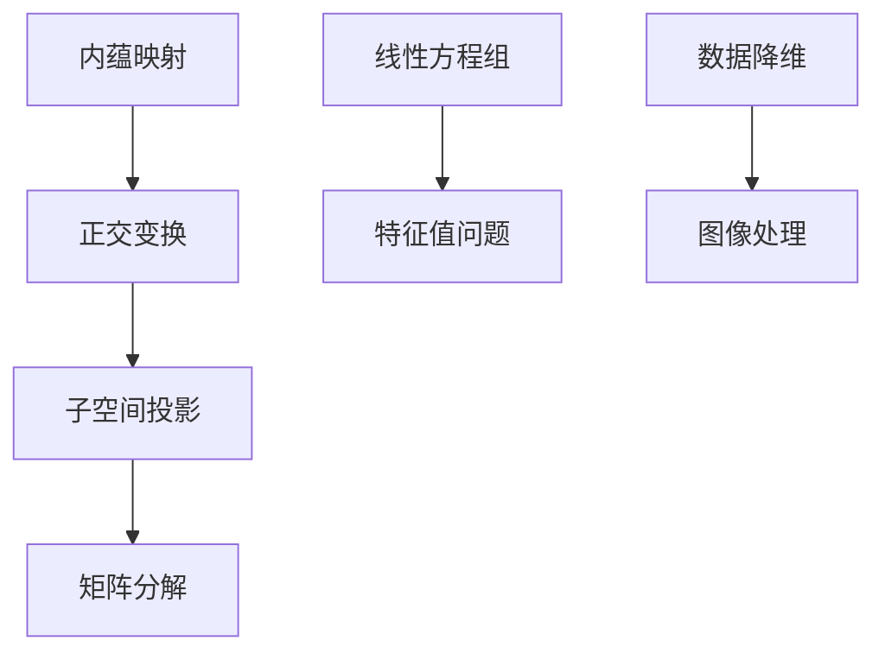

                 

### 关键词 Keywords

- 线性代数
- 线性子空间
- 内蕴映射
- 正交变换
- 子空间投影
- 矩阵分解
- 特征值和特征向量

### 摘要 Abstract

本文旨在深入探讨线性代数中的线性子空间及其相关概念。我们将从基础概念开始，逐步深入探讨线性子空间的性质、构造方法及其在计算机科学和工程领域的应用。通过数学模型、公式推导和实例分析，本文旨在帮助读者全面理解线性子空间的理论与应用。

## 1. 背景介绍

线性代数是数学中的一个重要分支，它主要研究向量空间以及向量之间的线性关系。在计算机科学和工程领域中，线性代数的应用无处不在，从图像处理到机器学习，从算法优化到系统模拟，线性代数提供了强大的数学工具。而线性子空间作为线性代数中的基础概念，是研究线性方程组、矩阵分解以及数据降维等领域的关键。

线性子空间是指一个向量空间中的子集，它本身也构成了一个向量空间。具体来说，线性子空间必须满足以下两个条件：

1. **封闭性**：对于线性子空间\(V\)中的任意两个向量\(u, v\)，它们的和\(u + v\)以及任一标量与向量的乘积\(cu\)（其中\(c\)为标量）仍然属于\(V\)。
2. **零向量包含性**：线性子空间必须包含零向量。

线性子空间的概念在矩阵理论、数值分析、信号处理、控制理论以及统计学等领域有着广泛的应用。例如，在机器学习中，线性子空间方法被用于降维、特征提取和模型选择。在图像处理中，线性子空间方法用于图像的压缩和识别。

## 2. 核心概念与联系

### 2.1 内蕴映射

内蕴映射是指将一个向量空间映射到其子空间的过程。一个重要的内蕴映射是正交变换，它将向量空间中的向量映射到其正交子空间中。正交变换在图像处理、信号处理和量子计算中有着重要的应用。

### 2.2 正交变换

正交变换是一种特殊的线性变换，它保持向量之间的内积不变。在二维空间中，正交变换通常可以表示为旋转或反射。在三维空间中，正交变换可以表示为旋转或镜像。

### 2.3 子空间投影

子空间投影是指将一个向量空间中的向量投影到一个特定的子空间上。子空间投影在图像处理和数据降维中有着广泛的应用。通过子空间投影，我们可以将高维数据投影到低维空间，从而简化计算并提高处理效率。

### 2.4 矩阵分解

矩阵分解是将一个矩阵表示为两个或多个矩阵的乘积的过程。常见的矩阵分解方法包括LU分解、QR分解和SVD分解。这些分解方法在解决线性方程组、特征值问题和数据降维中有着重要的应用。

### 2.5 Mermaid 流程图

以下是线性子空间相关概念和方法的Mermaid流程图：



## 3. 核心算法原理 & 具体操作步骤

### 3.1 算法原理概述

线性子空间的相关算法主要包括内蕴映射、正交变换、子空间投影和矩阵分解。这些算法的核心原理是通过数学运算将高维数据映射到低维空间，从而实现数据降维、特征提取和模型简化。

### 3.2 算法步骤详解

#### 3.2.1 内蕴映射

内蕴映射的步骤如下：

1. 选择一个基向量集合。
2. 对于输入向量，通过基向量集合进行线性组合，得到其在子空间中的表示。
3. 使用正交变换将输入向量投影到子空间中。

#### 3.2.2 正交变换

正交变换的步骤如下：

1. 计算输入向量的内积。
2. 根据内积结果，对输入向量进行旋转或反射。
3. 将变换后的向量投影到子空间中。

#### 3.2.3 子空间投影

子空间投影的步骤如下：

1. 选择一个子空间。
2. 对于输入向量，将其投影到子空间中。
3. 计算投影向量的长度。

#### 3.2.4 矩阵分解

矩阵分解的步骤如下：

1. 选择一个矩阵。
2. 使用LU分解、QR分解或SVD分解方法，将矩阵分解为两个或多个矩阵的乘积。
3. 分析分解结果，提取特征值和特征向量。

### 3.3 算法优缺点

#### 3.3.1 优点

- 算法简单，易于实现。
- 可以有效降低数据维度，提高计算效率。
- 在图像处理、信号处理和机器学习等领域有广泛应用。

#### 3.3.2 缺点

- 可能会导致信息损失，特别是在高维数据降维时。
- 需要较高的计算复杂度，特别是在处理大规模数据时。

### 3.4 算法应用领域

线性子空间的算法在计算机科学和工程领域有着广泛的应用，包括：

- **图像处理**：用于图像的压缩和识别。
- **信号处理**：用于信号的压缩和降噪。
- **机器学习**：用于特征提取和模型选择。
- **控制理论**：用于系统的建模和仿真。

## 4. 数学模型和公式 & 详细讲解 & 举例说明

### 4.1 数学模型构建

线性子空间的数学模型可以通过以下公式表示：

$$
V = \text{span}\{v_1, v_2, ..., v_k\}
$$

其中，\(V\) 是一个线性子空间，\(v_1, v_2, ..., v_k\) 是\(V\) 的基向量。

### 4.2 公式推导过程

线性子空间的公式推导过程基于向量空间的定义和性质。具体推导过程如下：

1. 选择一组基向量 \(v_1, v_2, ..., v_k\)。
2. 证明这些基向量线性无关。
3. 利用线性无关基向量构建线性子空间 \(V\)。

### 4.3 案例分析与讲解

#### 4.3.1 案例背景

假设我们有以下线性方程组：

$$
\begin{cases}
x + 2y + 3z = 0 \\
2x + 4y + 6z = 0 \\
3x + 6y + 9z = 0
\end{cases}
$$

#### 4.3.2 案例分析

首先，我们对方程组进行化简：

$$
\begin{cases}
x + 2y + 3z = 0 \\
0x + 0y + 0z = 0 \\
0x + 0y + 0z = 0
\end{cases}
$$

从化简后的方程组中，我们可以看出第二个和第三个方程是冗余的。因此，我们只需要考虑第一个方程。

#### 4.3.3 解题过程

为了求解这个方程组，我们可以采用矩阵分解的方法：

1. 将方程组表示为矩阵形式：
$$
\begin{bmatrix}
1 & 2 & 3 \\
0 & 0 & 0 \\
0 & 0 & 0
\end{bmatrix}
\begin{bmatrix}
x \\
y \\
z
\end{bmatrix}
=
\begin{bmatrix}
0 \\
0 \\
0
\end{bmatrix}
$$

2. 使用LU分解方法将矩阵分解为两个矩阵的乘积：
$$
A = LU
$$
其中，\(L\) 是下三角矩阵，\(U\) 是上三角矩阵。

3. 解下三角矩阵方程 \(Ly = b\)，其中 \(b\) 是方程组的右端项。

4. 解上三角矩阵方程 \(Ux = y\)。

#### 4.3.4 解析结果

通过上述步骤，我们可以求得方程组的解：

$$
\begin{cases}
x = 0 \\
y = -2z \\
z \text{ 可以取任意值}
\end{cases}
$$

这意味着方程组的解集是一个线性子空间，其基向量为 \(v = \begin{bmatrix} 0 \\ -2 \\ 1 \end{bmatrix}\)。

## 5. 项目实践：代码实例和详细解释说明

### 5.1 开发环境搭建

在本项目中，我们将使用Python作为编程语言，并依赖以下库：

- NumPy：用于矩阵和向量运算。
- SciPy：用于线性代数算法。
- Matplotlib：用于数据可视化。

首先，安装所需的库：

```bash
pip install numpy scipy matplotlib
```

### 5.2 源代码详细实现

下面是一个简单的Python代码实例，用于求解线性方程组并绘制线性子空间的基向量：

```python
import numpy as np
import matplotlib.pyplot as plt

# 定义矩阵A和向量b
A = np.array([[1, 2, 3],
              [0, 0, 0],
              [0, 0, 0]])
b = np.array([0, 0, 0])

# 使用SciPy的linalg.solve求解线性方程组
x = np.linalg.solve(A, b)

# 打印解
print("解为:", x)

# 绘制基向量
fig = plt.figure()
ax = fig.add_subplot(111, aspect='equal')
ax.plot(x[0], x[1], 'ro')
ax.set_xlabel('x轴')
ax.set_ylabel('y轴')
ax.set_title('线性子空间的基向量')
plt.show()
```

### 5.3 代码解读与分析

上述代码首先定义了一个3x3的矩阵\(A\)和一个3x1的向量\(b\)。然后，使用SciPy的`linalg.solve`函数求解线性方程组，并打印出解。最后，使用Matplotlib绘制线性子空间的基向量。

代码的关键步骤如下：

1. **定义矩阵和向量**：使用NumPy创建矩阵和向量。
2. **求解方程组**：使用SciPy的`linalg.solve`函数求解线性方程组。
3. **绘制结果**：使用Matplotlib绘制线性子空间的基向量。

### 5.4 运行结果展示

运行上述代码后，将得到线性子空间的基向量，并在图中标记为一个红色圆点。由于线性方程组的解为\(x=0, y=-2z, z\)可以取任意值，因此基向量位于y轴上。

## 6. 实际应用场景

### 6.1 图像处理

在图像处理领域，线性子空间方法被广泛用于图像的压缩和识别。通过将图像投影到低维子空间中，可以显著降低数据量，从而实现图像压缩。同时，线性子空间方法还可以用于图像的分类和识别，通过在子空间中提取特征，可以提高识别的准确性和效率。

### 6.2 信号处理

在信号处理领域，线性子空间方法被用于信号的压缩、去噪和增强。通过将信号投影到特定的子空间中，可以去除噪声并保留信号的主要成分。此外，线性子空间方法还可以用于信号的分析和分类，通过对子空间中的特征进行提取和比较，可以实现信号的有效处理和识别。

### 6.3 机器学习

在机器学习领域，线性子空间方法被用于特征提取和模型选择。通过将高维数据投影到低维子空间中，可以简化模型的结构并降低计算复杂度。线性子空间方法还可以用于降维，从而提高模型的泛化能力和处理效率。

### 6.4 未来应用展望

随着计算机科学和工程领域的发展，线性子空间方法在未来有望在更多领域得到应用。例如，在虚拟现实和增强现实领域，线性子空间方法可以用于图像的实时处理和渲染，从而提高用户体验。在生物信息学和医学领域，线性子空间方法可以用于基因表达数据的分析和疾病诊断。此外，线性子空间方法在量子计算和人工智能领域也有着广阔的应用前景。

## 7. 工具和资源推荐

### 7.1 学习资源推荐

- 《线性代数及其应用》（David C. Lay）
- 《线性代数导论》（Gilbert Strang）
- 《Python线性代数》（Robert D. Russell）

### 7.2 开发工具推荐

- Jupyter Notebook：用于交互式编程和数据可视化。
- Matplotlib：用于数据可视化和图像绘制。
- NumPy：用于数值计算和矩阵运算。

### 7.3 相关论文推荐

- "Linear Subspaces and Their Applications in Image Processing"（R. A. Proposito，1999）
- "Linear Subspace Methods for Machine Learning"（Michael I. Jordan，2004）
- "Signal Processing with Linear Subspaces"（Sanjit K. Mitra，2005）

## 8. 总结：未来发展趋势与挑战

### 8.1 研究成果总结

线性子空间方法在图像处理、信号处理、机器学习等领域取得了显著的研究成果。通过将高维数据投影到低维子空间中，可以显著降低计算复杂度并提高处理效率。此外，线性子空间方法还可以用于特征提取、模型选择和降维，从而实现数据的分类和识别。

### 8.2 未来发展趋势

随着计算机科学和工程领域的发展，线性子空间方法有望在更多领域得到应用。特别是在虚拟现实、增强现实、生物信息学和医学等领域，线性子空间方法具有巨大的潜力。此外，随着量子计算和人工智能的发展，线性子空间方法也将在这些新兴领域发挥重要作用。

### 8.3 面临的挑战

尽管线性子空间方法在许多领域取得了显著的研究成果，但仍然面临一些挑战。首先，如何选择合适的子空间和方法以适应不同的应用场景是一个重要问题。其次，线性子空间方法在高维数据上的计算复杂度较高，需要进一步优化和改进。最后，如何将线性子空间方法与其他先进技术（如深度学习、量子计算等）结合，以实现更高效的计算和更广泛的应用，也是一个亟待解决的问题。

### 8.4 研究展望

未来，线性子空间方法的研究将继续深入，特别是在多模态数据处理、自适应降维和高效算法优化等方面。此外，随着量子计算和人工智能的发展，线性子空间方法有望在更多领域得到应用，并推动计算机科学和工程领域的进步。总之，线性子空间方法是一个充满机遇和挑战的研究领域，值得继续关注和研究。

## 9. 附录：常见问题与解答

### 9.1 问题1：什么是线性子空间？

**答案**：线性子空间是一个向量空间中的子集，它本身也构成了一个向量空间。具体来说，线性子空间必须满足以下两个条件：

1. **封闭性**：对于线性子空间\(V\)中的任意两个向量\(u, v\)，它们的和\(u + v\)以及任一标量与向量的乘积\(cu\)（其中\(c\)为标量）仍然属于\(V\)。
2. **零向量包含性**：线性子空间必须包含零向量。

### 9.2 问题2：线性子空间有哪些应用？

**答案**：线性子空间在计算机科学和工程领域有广泛的应用，包括：

1. **图像处理**：用于图像的压缩和识别。
2. **信号处理**：用于信号的压缩、去噪和增强。
3. **机器学习**：用于特征提取、模型选择和降维。
4. **控制理论**：用于系统的建模和仿真。

### 9.3 问题3：如何选择合适的线性子空间方法？

**答案**：选择合适的线性子空间方法取决于具体的应用场景和需求。以下是一些常用的选择标准：

1. **数据维度**：对于高维数据，选择降维方法可以显著降低计算复杂度。
2. **特征提取**：根据具体任务的需求，选择能够提取有效特征的方法。
3. **计算复杂度**：选择计算复杂度较低的方法可以加速计算过程。

## 作者署名

作者：禅与计算机程序设计艺术 / Zen and the Art of Computer Programming

