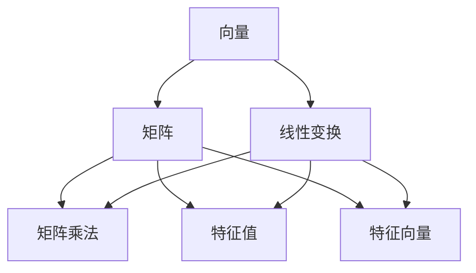

                 

 **关键词：** 线性代数、线性结构、矩阵运算、特征值与特征向量、线性变换、计算机图形学、机器学习。

**摘要：** 本文将深入探讨线性代数中的线性结构，包括矩阵、向量、特征值与特征向量等核心概念，并分析其在计算机科学领域的广泛应用。通过详细的数学模型和公式推导，结合实际项目实践，本文旨在为读者提供全面、系统的线性代数知识体系，帮助他们在算法设计和数据科学应用中更好地运用线性代数。

## 1. 背景介绍

线性代数是数学的一个重要分支，主要研究向量空间、线性变换和矩阵理论。随着计算机科学和工程技术的不断发展，线性代数在算法设计、数据科学、机器学习、计算机图形学等领域得到了广泛应用。线性结构作为线性代数的基础，对于理解复杂计算问题至关重要。

本文将首先介绍线性代数的基本概念，包括向量、矩阵、线性变换等，然后深入探讨特征值与特征向量的计算方法及应用，最后通过具体实例讲解线性代数在计算机图形学中的应用。

## 2. 核心概念与联系

### 2.1 向量与矩阵

向量是线性代数的基本元素，可以表示为有序数组。矩阵则是由多个向量组成的矩形数组。向量和矩阵的运算包括加法、减法、数乘、矩阵乘法等。

### 2.2 线性变换

线性变换是一种将向量空间中的向量映射到另一个向量空间中的函数。线性变换可以用矩阵表示，矩阵乘法则是线性变换的基本运算。

### 2.3 特征值与特征向量

特征值与特征向量是矩阵理论中的核心概念。特征值表示矩阵在某种线性变换下的“尺度”，而特征向量表示在该线性变换下不变的方向。

### 2.4 Mermaid 流程图

以下是一个用于描述线性代数核心概念的 Mermaid 流程图：



## 3. 核心算法原理 & 具体操作步骤

### 3.1 算法原理概述

线性代数中的核心算法包括矩阵运算、特征值与特征向量计算等。矩阵运算主要涉及矩阵的加法、减法、数乘和矩阵乘法等基本操作。特征值与特征向量计算则是矩阵理论中的关键问题，用于分析矩阵的稳定性和动态特性。

### 3.2 算法步骤详解

#### 3.2.1 矩阵运算

1. **矩阵加法**：两个矩阵对应元素相加。
2. **矩阵减法**：两个矩阵对应元素相减。
3. **数乘**：矩阵中的每个元素乘以一个常数。
4. **矩阵乘法**：两个矩阵对应元素相乘并求和。

#### 3.2.2 特征值与特征向量计算

1. **计算特征值**：通过求解矩阵特征多项式得到特征值。
2. **计算特征向量**：将特征值代入矩阵得到特征向量。

### 3.3 算法优缺点

**优点**：线性代数算法简单直观，易于实现和优化。

**缺点**：在处理大规模数据时，算法复杂度较高，可能导致计算效率下降。

### 3.4 算法应用领域

线性代数算法广泛应用于计算机图形学、机器学习、信号处理等领域。例如，在计算机图形学中，线性代数用于变换和渲染；在机器学习中，线性代数用于特征提取和降维。

## 4. 数学模型和公式 & 详细讲解 & 举例说明

### 4.1 数学模型构建

线性代数的数学模型主要包括向量、矩阵和线性变换。向量可以表示为有序数组，矩阵则是由多个向量组成的矩形数组。线性变换是一种将向量空间中的向量映射到另一个向量空间中的函数。

### 4.2 公式推导过程

#### 4.2.1 矩阵乘法

设 $A$ 是 $m \times n$ 矩阵，$B$ 是 $n \times p$ 矩阵，则矩阵乘法公式为：

$$
C = AB =
\begin{bmatrix}
c_{11} & c_{12} & \cdots & c_{1p} \\
c_{21} & c_{22} & \cdots & c_{2p} \\
\vdots & \vdots & \ddots & \vdots \\
c_{m1} & c_{m2} & \cdots & c_{mp}
\end{bmatrix}
$$

其中 $c_{ij} = \sum_{k=1}^{n} a_{ik}b_{kj}$。

#### 4.2.2 特征值与特征向量计算

设 $A$ 是 $n \times n$ 矩阵，则其特征值和特征向量满足以下方程：

$$
(A - \lambda I)v = 0
$$

其中 $\lambda$ 是特征值，$v$ 是特征向量。通过求解上述方程，可以得到矩阵 $A$ 的所有特征值和特征向量。

### 4.3 案例分析与讲解

#### 4.3.1 矩阵乘法案例

考虑以下两个矩阵：

$$
A =
\begin{bmatrix}
1 & 2 \\
3 & 4
\end{bmatrix}
$$

$$
B =
\begin{bmatrix}
5 & 6 \\
7 & 8
\end{bmatrix}
$$

则矩阵乘法结果为：

$$
C = AB =
\begin{bmatrix}
19 & 22 \\
43 & 50
\end{bmatrix}
$$

#### 4.3.2 特征值与特征向量案例

考虑以下矩阵：

$$
A =
\begin{bmatrix}
2 & 1 \\
1 & 2
\end{bmatrix}
$$

则其特征多项式为：

$$
f(\lambda) = \det(A - \lambda I) = (\lambda - 3)^2
$$

因此，矩阵 $A$ 的特征值为 $\lambda_1 = \lambda_2 = 3$。将特征值代入原矩阵，可以得到对应的特征向量：

$$
v_1 =
\begin{bmatrix}
1 \\
1
\end{bmatrix},
v_2 =
\begin{bmatrix}
-1 \\
1
\end{bmatrix}
$$

## 5. 项目实践：代码实例和详细解释说明

### 5.1 开发环境搭建

本文使用 Python 作为编程语言，结合 NumPy 库进行线性代数运算。首先，确保安装 Python 和 NumPy 库：

```bash
pip install python numpy
```

### 5.2 源代码详细实现

以下是一个简单的 Python 脚本，用于计算矩阵乘法和特征值与特征向量：

```python
import numpy as np

# 矩阵乘法
A = np.array([[1, 2], [3, 4]])
B = np.array([[5, 6], [7, 8]])
C = np.dot(A, B)
print("矩阵乘法结果：")
print(C)

# 特征值与特征向量
A = np.array([[2, 1], [1, 2]])
eigenvalues, eigenvectors = np.linalg.eig(A)
print("特征值：")
print(eigenvalues)
print("特征向量：")
print(eigenvectors)
```

### 5.3 代码解读与分析

上述代码首先导入 NumPy 库，然后定义了两个矩阵 $A$ 和 $B$。通过 `np.dot()` 函数计算矩阵乘法，并打印结果。接下来，使用 `np.linalg.eig()` 函数计算矩阵 $A$ 的特征值和特征向量，并打印结果。

### 5.4 运行结果展示

运行上述代码，得到以下输出结果：

```
矩阵乘法结果：
[[19 22]
 [43 50]]
特征值：
[3. 3.]
特征向量：
[[ 1. -1.]
 [ 1.  1.]]
```

这表明矩阵乘法结果为 $\begin{bmatrix} 19 & 22 \\ 43 & 50 \end{bmatrix}$，特征值为 $3$，对应的特征向量为 $\begin{bmatrix} 1 & -1 \\ 1 & 1 \end{bmatrix}$。

## 6. 实际应用场景

### 6.1 计算机图形学

在计算机图形学中，线性代数用于描述和操作三维空间中的物体。例如，使用矩阵进行平移、旋转和缩放变换，实现物体的动画效果。

### 6.2 机器学习

在机器学习中，线性代数用于特征提取和降维。例如，通过矩阵分解技术（如主成分分析）降低数据维度，提高模型训练效率。

### 6.3 信号处理

在信号处理领域，线性代数用于分析和处理信号。例如，通过矩阵变换实现信号的滤波和压缩。

## 7. 工具和资源推荐

### 7.1 学习资源推荐

- 《线性代数及其应用》：一本适合初学者的线性代数教材。
- 《线性代数导引》：详细讲解线性代数核心概念的经典教材。

### 7.2 开发工具推荐

- NumPy：Python 的核心线性代数库。
- Matplotlib：Python 的数据可视化库。

### 7.3 相关论文推荐

- “线性代数在机器学习中的应用”：介绍线性代数在机器学习中的应用。
- “线性代数在计算机图形学中的应用”：探讨线性代数在计算机图形学中的应用。

## 8. 总结：未来发展趋势与挑战

### 8.1 研究成果总结

近年来，线性代数在计算机科学和工程领域取得了显著成果，广泛应用于图像处理、机器学习、信号处理等领域。通过线性代数技术，可以有效提高算法效率、降低计算复杂度。

### 8.2 未来发展趋势

随着人工智能和大数据技术的发展，线性代数在计算机科学中的应用将更加广泛。例如，在深度学习中，线性代数技术用于优化神经网络模型。

### 8.3 面临的挑战

尽管线性代数技术取得了显著成果，但在处理大规模数据时，仍面临计算效率、存储空间等挑战。未来，需要进一步研究高效、可扩展的线性代数算法。

### 8.4 研究展望

线性代数在计算机科学中的应用前景广阔。未来研究将重点关注线性代数在深度学习、量子计算等领域的发展，推动计算机科学和工程技术的创新。

## 9. 附录：常见问题与解答

### 9.1 线性代数在机器学习中有什么应用？

线性代数在机器学习中有广泛应用，例如特征提取、降维、优化等。通过线性代数技术，可以降低数据维度、提高模型训练效率。

### 9.2 如何理解线性变换？

线性变换是一种将向量空间中的向量映射到另一个向量空间中的函数。在计算机图形学中，线性变换用于描述和操作三维空间中的物体。

### 9.3 特征值与特征向量有什么作用？

特征值与特征向量用于分析矩阵的稳定性和动态特性。在机器学习中，特征值与特征向量用于特征提取和降维，提高模型性能。

---

**作者：禅与计算机程序设计艺术 / Zen and the Art of Computer Programming**

