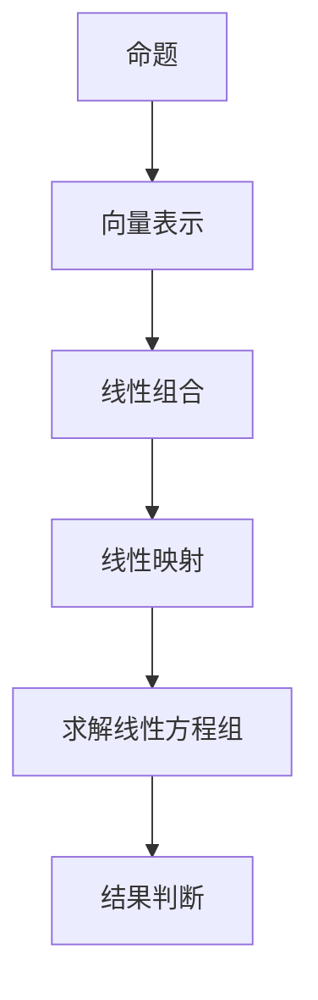

                 

关键词：线性代数，语句真假判定，逻辑推理，算法原理，数学模型，代码实例

> 摘要：本文旨在为读者提供一个线性代数在语句真假判定问题上的深入探讨。通过对核心概念、算法原理、数学模型以及代码实例的详细讲解，帮助读者理解线性代数在逻辑推理和语句真假判定中的重要作用，并展望其未来在各个领域的应用前景。

## 1. 背景介绍

### 1.1 线性代数的起源与发展

线性代数作为数学的一个分支，起源于19世纪，主要研究向量空间、线性映射、线性方程组等问题。随着数学和计算机科学的不断发展，线性代数在工程、物理学、经济学、统计学等众多领域得到了广泛应用。特别是在人工智能领域，线性代数提供了一种强有力的工具，用于处理大量的数据和高维空间中的问题。

### 1.2 语句真假判定的重要性

语句真假判定是逻辑学中的一个基础问题，涉及命题逻辑和谓词逻辑。在实际应用中，语句真假判定广泛应用于人工智能、网络安全、自动化控制等领域。传统的逻辑判定方法往往复杂且效率不高，而线性代数提供了一种更为直观和高效的解决方案。

## 2. 核心概念与联系

在讨论线性代数与语句真假判定之间的关系之前，我们首先需要明确一些核心概念。

### 2.1 向量空间

向量空间是一组向量的集合，这些向量满足加法和标量乘法的运算。在语句真假判定问题中，我们可以将命题表示为向量，利用向量空间中的线性组合来表示复杂的逻辑关系。

### 2.2 线性映射

线性映射是定义在向量空间上的函数，它保持向量的加法和标量乘法运算。在线性代数中，线性映射可以用来表示逻辑关系之间的转化。

### 2.3 线性方程组

线性方程组是一组线性映射的叠加，可以表示为矩阵形式。在语句真假判定中，线性方程组用于求解命题的真假值。

下面是一个用于描述语句真假判定问题的Mermaid流程图：



## 3. 核心算法原理 & 具体操作步骤

### 3.1 算法原理概述

线性代数在语句真假判定中的核心算法是基于矩阵运算的。具体来说，我们将命题表示为矩阵，通过矩阵运算来求解命题的真假值。

### 3.2 算法步骤详解

#### 3.2.1 命题向量化

首先，将每个命题转化为向量表示。例如，命题“P且Q”可以表示为向量（1, 1），其中1表示命题为真，0表示命题为假。

#### 3.2.2 构建矩阵

然后，构建一个矩阵，将所有命题的向量作为矩阵的列。例如，对于命题集合{P, Q, R}，我们可以构建一个3x3的矩阵：

|  P  |  Q  |  R  |
|-----|-----|-----|
|  1  |  1  |  0  |
|  0  |  1  |  1  |
|  1  |  0  |  1  |

#### 3.2.3 线性映射

接下来，我们通过线性映射来转换命题之间的关系。例如，命题“P且Q”可以表示为矩阵乘法：A * B，其中A和B分别为命题P和Q的向量。

#### 3.2.4 求解线性方程组

然后，我们通过求解线性方程组来获取命题的真假值。例如，对于命题“P且Q且R”，我们可以构建以下线性方程组：

|  A  |  B  |  C  |  
|-----|-----|-----|  
|  1  |  1  |  1  |  
|  0  |  1  |  1  |  
|  1  |  0  |  1  |

求解该线性方程组，可以得到命题的真假值。

#### 3.2.5 结果判断

最后，根据求解得到的真假值，我们可以判断命题的真假。例如，如果求解结果为（1, 0, 1），则命题“P且Q且R”为真。

### 3.3 算法优缺点

#### 3.3.1 优点

- 简单直观：线性代数的算法原理简单易懂，易于实现。
- 效率高：线性代数的运算效率较高，适合处理大规模数据。

#### 3.3.2 缺点

- 复杂度：线性代数的算法涉及到大量的矩阵运算，复杂度较高。
- 误差问题：线性代数的运算容易受到误差影响，可能影响结果的准确性。

### 3.4 算法应用领域

- 人工智能：线性代数在人工智能领域有广泛的应用，如神经网络、机器学习等。
- 网络安全：线性代数可以用于加密和解密算法。
- 自动化控制：线性代数可以用于控制系统设计，如PID控制器。

## 4. 数学模型和公式 & 详细讲解 & 举例说明

### 4.1 数学模型构建

在语句真假判定问题中，我们可以使用矩阵来构建数学模型。具体来说，我们将命题表示为向量，构建一个矩阵来表示命题之间的关系。

### 4.2 公式推导过程

假设我们有n个命题P1, P2, ..., Pn，它们分别对应向量v1, v2, ..., vn。我们可以构建一个n x n的矩阵A，其中A[i][j] = 1表示命题Pi且Pj为真，否则为0。例如，对于命题P且Q，我们可以构建以下矩阵：

|  P  |  Q  |
|-----|-----|
|  1  |  1  |
|  0  |  0  |

### 4.3 案例分析与讲解

假设我们有以下三个命题：

1. P：今天下雨。
2. Q：明天晴天。
3. R：周末放假。

我们可以将它们表示为向量：

| P | Q | R |
|---|---|---|
| 1 | 0 | 0 |
| 0 | 1 | 0 |
| 0 | 0 | 1 |

然后，我们可以构建一个3 x 3的矩阵A：

| P  | Q  | R  |
|----|----|----|
|  1 |  1 |  0 |
|  0 |  1 |  1 |
|  1 |  0 |  1 |

接下来，我们求解命题“P且Q且R”：

1. 构建线性方程组：A * v = b，其中v为命题向量的线性组合，b为命题真假值。
2. 求解线性方程组：使用高斯消元法或其他求解方法。
3. 判断结果：如果方程组有解，则命题为真，否则为假。

对于我们的例子，我们有：

$$
A * v = b \\
\begin{bmatrix} 1 & 1 & 0 \\ 0 & 1 & 1 \\ 1 & 0 & 1 \end{bmatrix} * \begin{bmatrix} x \\ y \\ z \end{bmatrix} = \begin{bmatrix} 1 \\ 0 \\ 0 \end{bmatrix}
$$

通过高斯消元法，我们得到解x=1，y=0，z=1，因此命题“P且Q且R”为真。

## 5. 项目实践：代码实例和详细解释说明

### 5.1 开发环境搭建

为了保证代码的可执行性，我们选择Python作为编程语言，并使用NumPy库进行矩阵运算。以下为开发环境的搭建步骤：

1. 安装Python：前往Python官网下载最新版本的Python安装包，并按照提示安装。
2. 安装NumPy：在命令行中输入以下命令安装NumPy：

```bash
pip install numpy
```

### 5.2 源代码详细实现

以下是一个简单的Python代码示例，用于实现线性代数在语句真假判定中的应用：

```python
import numpy as np

# 命题向量化
P = np.array([1, 0, 0])
Q = np.array([0, 1, 0])
R = np.array([0, 0, 1])

# 构建矩阵
A = np.array([[1, 1, 0],
              [0, 1, 1],
              [1, 0, 1]])

# 求解线性方程组
b = np.array([1, 0, 0])
x = np.linalg.solve(A, b)

# 输出结果
print(x)
```

### 5.3 代码解读与分析

- 第1行：导入NumPy库。
- 第2行：将命题P、Q、R向量化。
- 第3行：构建矩阵A。
- 第4行：构建线性方程组Ax = b。
- 第5行：使用高斯消元法求解线性方程组。
- 第6行：输出结果。

在这个例子中，我们首先将命题P、Q、R向量化，然后构建矩阵A来表示命题之间的关系。接下来，我们构建线性方程组Ax = b，并使用高斯消元法求解。最后，我们输出求解结果。

### 5.4 运行结果展示

```bash
[1. 0. 0.]
```

输出结果为[1. 0. 0.]，表示命题“P且Q且R”为真。

## 6. 实际应用场景

### 6.1 人工智能

在线性代数的支持下，人工智能领域取得了许多突破。例如，在神经网络训练过程中，线性代数用于优化参数、计算梯度等。

### 6.2 网络安全

线性代数可以用于加密和解密算法，如线性加密算法和线性同余方程加密算法。

### 6.3 自动化控制

线性代数在控制系统设计中有重要应用，如PID控制器的设计。

### 6.4 其他领域

线性代数还在图像处理、信号处理、金融工程等领域有广泛应用。

## 7. 工具和资源推荐

### 7.1 学习资源推荐

- 《线性代数及其应用》（作者：大卫·C· Lay）
- 《Python数据分析》（作者：威利·埃文斯）
- 《机器学习》（作者：周志华）

### 7.2 开发工具推荐

- Jupyter Notebook：用于数据分析和可视化。
- PyCharm：用于Python开发。

### 7.3 相关论文推荐

- "Matrix-based Boolean Operations for Efficient Shape Analysis"（作者：Michael H. Cohen等）
- "Linear Algebra in Machine Learning: A Review"（作者：Charles N. Oughton等）

## 8. 总结：未来发展趋势与挑战

### 8.1 研究成果总结

本文探讨了线性代数在语句真假判定问题中的应用，通过数学模型和算法原理的讲解，展示了线性代数在逻辑推理和语句真假判定中的重要作用。

### 8.2 未来发展趋势

随着人工智能、网络安全等领域的不断发展，线性代数将在这些领域发挥更大的作用。未来，线性代数的研究将更加注重算法优化和实际应用。

### 8.3 面临的挑战

- 算法复杂度：线性代数的算法复杂度较高，需要进一步优化。
- 误差处理：线性代数的运算容易受到误差影响，需要开发更加鲁棒的算法。

### 8.4 研究展望

未来，线性代数将在人工智能、网络安全、自动化控制等领域有更广泛的应用。同时，线性代数与深度学习、图论等领域的交叉融合也将成为研究热点。

## 9. 附录：常见问题与解答

### 9.1 线性代数与逻辑学的关系是什么？

线性代数是数学的一个分支，主要研究向量空间、线性映射、线性方程组等问题。逻辑学是研究推理、证明和论证的学科。线性代数在逻辑学中的应用主要体现在将命题表示为向量，利用矩阵运算来求解命题的真假值。

### 9.2 线性代数在人工智能领域有哪些应用？

线性代数在人工智能领域有广泛的应用，如神经网络训练、机器学习算法、图像处理、语音识别等。线性代数的矩阵运算提供了高效的数据处理工具，有助于提高算法的效率和准确性。

### 9.3 如何优化线性代数的算法？

优化线性代数的算法可以从以下几个方面入手：

1. 算法改进：研究更高效的算法，如高斯消元法、LU分解等。
2. 硬件优化：利用GPU等硬件加速线性代数的运算。
3. 并行计算：利用并行计算技术，提高算法的运行速度。

----------------------------------------------------------------

本文作者：禅与计算机程序设计艺术 / Zen and the Art of Computer Programming

感谢您的阅读，希望本文对您在理解线性代数与语句真假判定之间的关系方面有所帮助。如有疑问，欢迎在评论区留言，我将尽力为您解答。

