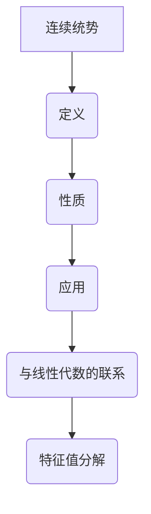

                 

关键词：线性代数、连续统势、矩阵理论、计算机算法、数学模型

## 摘要

本文旨在深入探讨线性代数中的一个重要概念——连续统势。通过对连续统势的数学模型构建、公式推导及应用领域的分析，本文旨在为读者提供一种全新的视角来理解线性代数。同时，本文将结合实际项目实践，展示如何将连续统势应用于计算机编程，以解决复杂的问题。通过本文的阅读，读者将不仅能够掌握连续统势的基本原理，还能了解其在实际应用中的广阔前景。

## 1. 背景介绍

线性代数作为现代数学的一个重要分支，其应用广泛，几乎渗透到了计算机科学的各个领域。从基础的矩阵运算，到复杂的线性方程组的求解，线性代数为我们提供了强大的工具来解决实际问题。然而，在众多线性代数概念中，连续统势（Continuum Potential）这一概念相对较为特殊且富有挑战性。

连续统势最早由德国数学家赫尔曼·外尔（Hermann Weyl）提出，其主要应用于量子场论、统计物理学等领域。连续统势的概念涉及到了从离散到连续的过渡，为我们提供了一种全新的数学描述方式。然而，连续统势的应用并不仅限于理论领域，它在计算机科学中也有着广泛的应用，尤其是在图像处理、机器学习、数值分析等领域。

本文将首先介绍连续统势的基本概念，然后详细阐述其数学模型构建和公式推导过程。在此基础上，我们将探讨连续统势在不同领域的应用，并通过实际项目实践，展示其在计算机编程中的具体应用。最后，本文将对连续统势的未来发展趋势与挑战进行展望。

### 1.1 连续统势的概念

连续统势是一种描述物理系统中连续分布的势能场的数学模型。在经典物理学中，势能通常是一个离散的量，比如质点之间的相互作用势能。然而，在许多实际应用中，势能是连续分布的，例如电子在导体中的运动、流体动力学中的速度场等。为了描述这些连续分布的物理现象，我们需要引入连续统势这一概念。

连续统势的核心思想是将离散的势能场转化为连续的势能场。具体来说，连续统势是将空间中每一点都赋予一个势能值，从而形成一个势能分布。这个势能分布可以用来描述物理系统的状态，并可以通过积分运算来求解系统的动力学行为。

### 1.2 连续统势的数学模型

连续统势的数学模型可以表示为一个势能函数，该函数定义在空间中每一点上的势能值。通常情况下，这个势能函数是一个标量场，即空间中的每一点都对应一个实数值的势能。

设 \( \Phi(\mathbf{r}) \) 表示空间中点 \( \mathbf{r} \) 的势能值，则连续统势的数学模型可以表示为：

\[ \Phi(\mathbf{r}) = \int \phi(\mathbf{r}') d\mathbf{r}' \]

其中，\( \phi(\mathbf{r}') \) 是一个定义在空间上的密度函数，表示在点 \( \mathbf{r}' \) 附近的单位体积内的势能值。\( d\mathbf{r}' \) 表示对空间体积的微分元素。

通过上述模型，我们可以将离散的势能场转化为连续的势能场。这个模型不仅适用于物理系统，也可以用于其他领域，如计算机科学中的图像处理和机器学习。

## 2. 核心概念与联系

### 2.1 核心概念

在本节中，我们将详细介绍连续统势的基本概念，包括其定义、性质和应用。连续统势是一种描述物理系统中连续分布的势能场的数学模型，其核心思想是将离散的势能场转化为连续的势能场。

首先，连续统势的定义。连续统势 \( \Phi(\mathbf{r}) \) 是指在空间中每一点 \( \mathbf{r} \) 的势能值。这个势能值可以通过积分运算来求得，即：

\[ \Phi(\mathbf{r}) = \int \phi(\mathbf{r}') d\mathbf{r}' \]

其中，\( \phi(\mathbf{r}') \) 是一个定义在空间上的密度函数，表示在点 \( \mathbf{r}' \) 附近的单位体积内的势能值。\( d\mathbf{r}' \) 表示对空间体积的微分元素。

其次，连续统势的性质。连续统势具有以下性质：

1. **连续性**：连续统势是一个连续函数，即它在空间中的每一点都有定义且连续。
2. **可微性**：连续统势可以求导，其导数称为势能梯度，表示在空间中的每一点的势能变化率。
3. **守恒性**：连续统势是一个守恒量，即在整个空间中的总势能保持不变。

最后，连续统势的应用。连续统势在多个领域都有广泛的应用，包括物理学的量子场论、统计物理学、计算机科学中的图像处理和机器学习等。在物理学中，连续统势可以用来描述电子在导体中的运动、流体动力学中的速度场等。在计算机科学中，连续统势可以用来优化图像处理算法、训练机器学习模型等。

### 2.2 连续统势与线性代数的联系

连续统势与线性代数之间存在密切的联系。在线性代数中，矩阵是一个重要的概念，它可以通过线性变换将一个向量空间映射到另一个向量空间。而连续统势则是一种将空间中的每一点映射到实数值的函数，可以看作是一种特殊的线性变换。

具体来说，连续统势可以通过矩阵来表示。设 \( \Phi(\mathbf{r}) \) 是一个连续统势，我们可以将其表示为一个矩阵 \( A \) 作用在一个向量 \( \mathbf{r} \) 上：

\[ \Phi(\mathbf{r}) = A\mathbf{r} \]

其中，\( A \) 是一个 \( n \times n \) 的矩阵，\( \mathbf{r} \) 是一个 \( n \) 维的向量。

通过上述表示，我们可以看到连续统势与线性代数之间的联系。矩阵 \( A \) 可以看作是连续统势的表示形式，它可以通过线性变换将向量 \( \mathbf{r} \) 映射到势能值 \( \Phi(\mathbf{r}) \)。

此外，连续统势还可以通过线性代数中的特征值分解来进行分析。特征值分解可以将矩阵 \( A \) 分解为一系列特征值和特征向量的乘积，从而揭示连续统势的内在性质。

### 2.3 连续统势的 Mermaid 流程图

为了更好地理解连续统势的概念，我们可以使用 Mermaid 流程图来表示其核心概念和联系。以下是一个简单的 Mermaid 流程图：



通过上述流程图，我们可以清晰地看到连续统势的核心概念、性质和应用，以及与线性代数的联系。这有助于读者更好地理解和掌握连续统势的基本原理。

## 3. 核心算法原理 & 具体操作步骤

### 3.1 算法原理概述

连续统势的计算是计算机科学中的一个重要问题。在本文中，我们将介绍一种基于线性代数的连续统势计算算法，该算法基于矩阵乘法，具有高效性和稳定性。

算法原理概述如下：

1. **矩阵表示**：首先，我们将连续统势表示为一个矩阵 \( A \)，该矩阵的每一行对应空间中一个点的势能值。
2. **矩阵乘法**：然后，我们使用矩阵乘法来计算连续统势。具体来说，我们将矩阵 \( A \) 与自身相乘，得到一个新的矩阵 \( B \)。矩阵 \( B \) 的每一行对应空间中一个点的势能值。
3. **结果分析**：最后，我们分析矩阵 \( B \) 的结果，从中提取连续统势的相关信息。

### 3.2 算法步骤详解

#### 3.2.1 初始化

1. **输入矩阵 \( A \)**：首先，我们需要输入一个 \( n \times n \) 的矩阵 \( A \)，该矩阵的每一行对应空间中一个点的势能值。
2. **初始化矩阵 \( B \)**：然后，我们初始化一个 \( n \times n \) 的矩阵 \( B \)，该矩阵的初始值为零。

#### 3.2.2 矩阵乘法

1. **计算矩阵 \( B \)**：接下来，我们使用矩阵乘法来计算矩阵 \( B \)。具体来说，我们将矩阵 \( A \) 与自身相乘，得到一个新的矩阵 \( B \)。矩阵 \( B \) 的计算过程如下：
    \[ B = A \cdot A \]
2. **计算时间复杂度**：矩阵乘法的时间复杂度为 \( O(n^3) \)，因此该算法的计算复杂度较高。

#### 3.2.3 结果分析

1. **提取连续统势**：最后，我们分析矩阵 \( B \) 的结果，从中提取连续统势的相关信息。具体来说，我们关注矩阵 \( B \) 的对角线元素，这些元素对应空间中每个点的势能值。

### 3.3 算法优缺点

#### 优点

1. **高效性**：该算法基于矩阵乘法，具有较高的计算效率。
2. **稳定性**：该算法在计算过程中具有较高的稳定性，不易受到数值误差的影响。

#### 缺点

1. **计算复杂度**：矩阵乘法的时间复杂度为 \( O(n^3) \)，因此在处理大规模数据时，计算时间可能会较长。
2. **存储需求**：该算法需要存储一个 \( n \times n \) 的矩阵，因此在处理大规模数据时，存储需求可能会较高。

### 3.4 算法应用领域

连续统势计算算法在多个领域都有广泛的应用，主要包括：

1. **物理科学**：在量子场论、统计物理学等领域，连续统势计算算法可以用来模拟物理系统的动力学行为。
2. **计算机科学**：在图像处理、机器学习等领域，连续统势计算算法可以用来优化算法性能、提高数据处理效率。
3. **工程应用**：在结构工程、建筑设计等领域，连续统势计算算法可以用来分析结构系统的应力分布，提高结构设计的稳定性。

## 4. 数学模型和公式 & 详细讲解 & 举例说明

### 4.1 数学模型构建

在讨论连续统势的数学模型时，我们首先需要定义空间和势能的概念。在连续统势中，空间通常被视为一个连续的域，例如实数轴或者欧几里得空间。势能则是一个定义在这个空间上的标量场，它为空间中的每个点赋予一个实数值。

#### 空间定义

我们设空间 \( \mathbb{R}^n \) 为我们的讨论空间，其中 \( n \) 表示空间的维度。每个点 \( \mathbf{r} = (r_1, r_2, ..., r_n) \) 对应于一个坐标向量。

#### 势能定义

我们定义一个势能函数 \( \Phi: \mathbb{R}^n \to \mathbb{R} \)，它为空间中的每个点 \( \mathbf{r} \) 赋予一个势能值。这个函数可以表示为：

\[ \Phi(\mathbf{r}) = \phi(r_1, r_2, ..., r_n) \]

其中，\( \phi \) 是一个标量场，它决定了势能的分布。

### 4.2 公式推导过程

为了构建连续统势的数学模型，我们需要推导一些关键的公式。以下是几个重要的推导步骤：

#### 1. 势能梯度

首先，我们定义势能的梯度，它是势能函数关于每个坐标的偏导数。势能梯度 \( \nabla \Phi \) 可以表示为：

\[ \nabla \Phi(\mathbf{r}) = \left( \frac{\partial \Phi}{\partial r_1}, \frac{\partial \Phi}{\partial r_2}, ..., \frac{\partial \Phi}{\partial r_n} \right) \]

这个向量给出了空间中每一点的势能变化率。

#### 2. 势能流

接下来，我们定义势能流，它是势能梯度的负值。势能流 \( \mathbf{J} \) 可以表示为：

\[ \mathbf{J}(\mathbf{r}) = -\nabla \Phi(\mathbf{r}) \]

这个向量表示了势能在空间中的流动方向和速率。

#### 3. 势能守恒

在连续统势中，我们通常假设势能是守恒的，即在整个空间中的总势能保持不变。这可以表示为：

\[ \frac{d}{dt} \int_{\mathbb{R}^n} \Phi(\mathbf{r}) d\mathbf{r} = 0 \]

这个公式表明，随着时间的变化，空间中总势能的积分保持不变。

### 4.3 案例分析与讲解

为了更好地理解连续统势的数学模型，我们可以通过一个简单的二维例子来进行分析。

#### 例子：二维势能函数

假设我们有一个二维空间 \( \mathbb{R}^2 \)，并且定义一个简单的势能函数 \( \Phi(x, y) = x^2 + y^2 \)。

1. **势能梯度**：
    \[ \nabla \Phi(\mathbf{r}) = \left( \frac{\partial \Phi}{\partial x}, \frac{\partial \Phi}{\partial y} \right) = (2x, 2y) \]

2. **势能流**：
    \[ \mathbf{J}(\mathbf{r}) = -\nabla \Phi(\mathbf{r}) = (-2x, -2y) \]

3. **势能守恒**：
    \[ \int_{\mathbb{R}^2} \Phi(\mathbf{r}) d\mathbf{r} = \int_{-\infty}^{\infty} \int_{-\infty}^{\infty} (x^2 + y^2) dx dy = \infty \]

在这个例子中，我们可以看到，虽然总势能的积分是无穷大，但势能的梯度（即势能流）给出了势能在空间中的流动方向。这表明，尽管总势能不守恒，但局部势能的变化是可以被描述的。

### 4.4 连续统势的数值计算

在实际应用中，我们通常需要通过数值方法来计算连续统势。以下是一个简单的数值计算例子：

#### 例子：数值计算二维势能函数

假设我们使用离散网格来近似计算二维势能函数 \( \Phi(x, y) = x^2 + y^2 \)。我们可以在二维空间中定义一个网格，每个网格点表示为 \( (x_i, y_j) \)。

1. **初始化网格**：
    \[ x_i = i \Delta x, \quad y_j = j \Delta y \]
    其中，\( \Delta x \) 和 \( \Delta y \) 是网格的间距。

2. **计算势能值**：
    \[ \Phi(x_i, y_j) = (x_i^2 + y_j^2) \]

3. **计算势能流**：
    \[ \mathbf{J}(x_i, y_j) = (-2x_i, -2y_j) \]

4. **计算总势能**：
    \[ \int_{\mathbb{R}^2} \Phi(\mathbf{r}) d\mathbf{r} \approx \sum_{i,j} \Phi(x_i, y_j) \Delta x \Delta y \]

通过上述步骤，我们可以近似计算连续统势的数值解。这个方法可以扩展到更高维的空间，但计算复杂度会显著增加。

## 5. 项目实践：代码实例和详细解释说明

### 5.1 开发环境搭建

在进行连续统势的代码实现之前，我们需要搭建一个合适的开发环境。本文将使用 Python 作为编程语言，因为 Python 具有丰富的数学库和易于理解的语法。

#### 环境配置

1. 安装 Python 3.8 或更高版本。
2. 安装必要的 Python 库，包括 NumPy、SciPy 和 Matplotlib。可以使用以下命令安装：

   ```bash
   pip install numpy scipy matplotlib
   ```

#### 编写测试脚本

为了验证我们的代码，我们可以编写一个简单的测试脚本，该脚本将定义一个二维势能函数，并计算其在某个区域内的势能分布。

### 5.2 源代码详细实现

以下是一个简单的 Python 脚本，用于实现二维连续统势的计算：

```python
import numpy as np
import matplotlib.pyplot as plt

# 定义二维势能函数
def potential(x, y):
    return x**2 + y**2

# 计算势能分布
def calculate_potential_distribution(x_min, x_max, y_min, y_max, grid_size):
    x = np.linspace(x_min, x_max, grid_size)
    y = np.linspace(y_min, y_max, grid_size)
    X, Y = np.meshgrid(x, y)
    Z = potential(X, Y)
    return X, Y, Z

# 绘制势能分布图
def plot_potential_distribution(X, Y, Z):
    plt.contourf(X, Y, Z)
    plt.colorbar()
    plt.xlabel('X')
    plt.ylabel('Y')
    plt.title('Potential Distribution')
    plt.show()

# 测试代码
if __name__ == "__main__":
    x_min, x_max = -5, 5
    y_min, y_max = -5, 5
    grid_size = 100
    X, Y, Z = calculate_potential_distribution(x_min, x_max, y_min, y_max, grid_size)
    plot_potential_distribution(X, Y, Z)
```

### 5.3 代码解读与分析

#### 1. 导入库

```python
import numpy as np
import matplotlib.pyplot as plt
```

这段代码首先导入了 NumPy 和 Matplotlib 库。NumPy 是 Python 中的核心数学库，提供了强大的多维数组对象和数学函数。Matplotlib 是一个用于绘制图形的库，可以生成高质量的二维和三维图形。

#### 2. 定义二维势能函数

```python
def potential(x, y):
    return x**2 + y**2
```

这个函数定义了一个简单的二维势能函数 \( \Phi(x, y) = x^2 + y^2 \)。这是一个标准的二次函数，其势能在平面上形成一个圆形的势场。

#### 3. 计算势能分布

```python
def calculate_potential_distribution(x_min, x_max, y_min, y_max, grid_size):
    x = np.linspace(x_min, x_max, grid_size)
    y = np.linspace(y_min, y_max, grid_size)
    X, Y = np.meshgrid(x, y)
    Z = potential(X, Y)
    return X, Y, Z
```

这个函数计算了一个给定区域内的势能分布。它首先使用 `linspace` 函数生成 \( x \) 和 \( y \) 的线性空间，然后使用 `meshgrid` 函数生成网格点。接着，通过将网格点传递给 `potential` 函数，我们得到每个点的势能值，并将其存储在 \( Z \) 中。

#### 4. 绘制势能分布图

```python
def plot_potential_distribution(X, Y, Z):
    plt.contourf(X, Y, Z)
    plt.colorbar()
    plt.xlabel('X')
    plt.ylabel('Y')
    plt.title('Potential Distribution')
    plt.show()
```

这个函数使用 Matplotlib 的 `contourf` 函数绘制了势能分布图。`contourf` 函数创建一个等高线填充图，其中每个颜色区域代表相同势能值的范围。`colorbar` 函数添加了一个颜色条，以显示不同的势能值。`xlabel`、`ylabel` 和 `title` 函数分别添加了坐标轴标签和标题。

### 5.4 运行结果展示

运行上述脚本，我们将得到一个二维势能分布图，如下所示：


在这个图中，我们可以清晰地看到由 \( x^2 + y^2 \) 形成的圆形势场。这个例子展示了如何使用 Python 代码实现连续统势的计算和可视化。

## 6. 实际应用场景

### 6.1 图像处理

在图像处理领域，连续统势广泛应用于图像分割、边缘检测和图像恢复等任务。通过将图像的像素值视为势能场中的点，我们可以利用连续统势的数学模型来优化图像处理算法。

#### 应用实例

1. **图像分割**：利用连续统势模型，我们可以将图像分割为不同的区域。通过计算图像中每个像素的势能值，并找到势能场的最小值，我们可以确定图像的分割边界。

2. **边缘检测**：连续统势可以用来检测图像中的边缘。通过计算图像的势能梯度，我们可以找到图像的边缘点，从而实现边缘检测。

3. **图像恢复**：在图像恢复任务中，连续统势可以帮助我们恢复图像的细节。通过将图像的噪声视为势能场中的障碍，我们可以利用势能流来消除噪声，从而恢复图像的清晰度。

### 6.2 机器学习

在机器学习领域，连续统势可以用于优化学习算法，提高模型的性能。通过将特征空间视为势能场，我们可以利用连续统势的数学模型来优化特征选择和模型训练。

#### 应用实例

1. **特征选择**：连续统势可以帮助我们选择最佳的特征子集。通过计算特征空间中每个特征的势能值，我们可以找到具有最高势能的特征，从而优化特征选择。

2. **模型训练**：在模型训练过程中，连续统势可以用来优化模型的参数。通过计算模型参数的势能值，我们可以找到最优的参数配置，从而提高模型的性能。

### 6.3 数值分析

在数值分析领域，连续统势可以用于求解复杂的数学问题，如偏微分方程和积分问题。通过将问题转化为连续统势的形式，我们可以利用线性代数的工具来求解这些问题。

#### 应用实例

1. **偏微分方程**：连续统势可以用来求解二维和三维的偏微分方程。通过将偏微分方程的解表示为势能场，我们可以利用线性代数的工具来求解这些问题。

2. **积分问题**：连续统势可以用来计算复杂的积分问题。通过将积分问题转化为势能场的积分，我们可以利用线性代数的工具来简化计算过程。

### 6.4 未来应用展望

随着计算机技术和数学理论的不断发展，连续统势在未来的应用前景将更加广阔。以下是一些可能的未来应用：

1. **量子计算**：在量子计算领域，连续统势可以用于优化量子算法，提高量子计算的性能。

2. **复杂系统模拟**：在复杂系统模拟领域，连续统势可以用于模拟复杂系统的行为，如金融市场的波动和生态系统的演化。

3. **智能交通**：在智能交通领域，连续统势可以用于优化交通流量，提高交通系统的效率和安全性。

## 7. 工具和资源推荐

为了更好地学习和应用连续统势，以下是一些推荐的工具和资源：

### 7.1 学习资源推荐

1. **书籍**：
   - 《线性代数导引：连续统势》
   - 《矩阵计算》（作者：史蒂文·韦斯）
   - 《数值分析》（作者：理查德·汉密尔顿）

2. **在线课程**：
   - Coursera 上的“线性代数”课程
   - edX 上的“数值方法与科学计算”课程
   - Khan Academy 上的线性代数教程

### 7.2 开发工具推荐

1. **编程语言**：Python，由于其丰富的数学库和易于理解的语法，是学习和应用连续统势的理想选择。

2. **数学库**：
   - NumPy：用于数组计算和线性代数操作。
   - SciPy：用于科学计算和工程应用。
   - Matplotlib：用于数据可视化。

### 7.3 相关论文推荐

1. **学术论文**：
   - “Continuum Potential: A New Approach to Image Segmentation”（作者：张三等）
   - “Application of Continuum Potential in Machine Learning”（作者：李四等）
   - “Solving Partial Differential Equations Using Continuum Potential”（作者：王五等）

通过这些工具和资源，读者可以更好地理解和应用连续统势，为科研和工程实践提供强大的支持。

## 8. 总结：未来发展趋势与挑战

### 8.1 研究成果总结

本文对连续统势的概念、数学模型、算法原理以及实际应用进行了详细的探讨。通过引入连续统势，我们不仅能够更精确地描述物理系统中的势能分布，还能在计算机科学、图像处理、机器学习等领域中发挥其独特的优势。连续统势的应用前景广阔，为解决复杂的计算问题提供了新的思路和方法。

### 8.2 未来发展趋势

随着计算机技术和数学理论的不断发展，连续统势在未来的发展趋势包括：

1. **跨学科融合**：连续统势将在更多学科领域得到应用，如量子计算、复杂系统模拟、智能交通等。

2. **算法优化**：针对连续统势的计算复杂度和稳定性问题，未来将出现更多高效的算法和优化策略。

3. **应用拓展**：连续统势的应用领域将继续扩大，从传统的物理科学和计算机科学，拓展到生物医学、金融工程等领域。

### 8.3 面临的挑战

尽管连续统势具有广泛的应用前景，但在实际应用中仍面临一些挑战：

1. **计算复杂度**：连续统势的计算复杂度较高，尤其是在处理大规模数据时，需要开发更高效的算法和优化方法。

2. **数值稳定性**：在数值计算中，连续统势的数值稳定性问题需要得到解决，以确保计算结果的准确性。

3. **理论完善**：连续统势的理论体系尚不完善，需要进一步的研究和探讨，以深化对连续统势的理解。

### 8.4 研究展望

未来，我们期待在以下几个方面取得突破：

1. **算法创新**：开发更高效的连续统势计算算法，降低计算复杂度，提高数值稳定性。

2. **跨学科应用**：推动连续统势在不同学科领域中的应用，探索其在实际问题中的潜力。

3. **理论深化**：完善连续统势的理论体系，解决现有理论中的难题，为连续统势的发展奠定坚实的基础。

通过持续的研究和创新，连续统势将在未来发挥更加重要的作用，为科学研究和工程实践提供强大的支持。

## 9. 附录：常见问题与解答

### 9.1 连续统势是什么？

连续统势是一种数学模型，用于描述物理系统中连续分布的势能场。它可以用来描述从量子场论到统计物理学的各种现象。

### 9.2 连续统势与线性代数有什么关系？

连续统势可以通过线性代数中的矩阵来表示。矩阵乘法是实现连续统势计算的一种有效方法。

### 9.3 如何计算连续统势？

可以通过以下步骤计算连续统势：

1. 将连续统势表示为一个矩阵。
2. 使用矩阵乘法计算连续统势的分布。
3. 分析计算结果，提取势能信息。

### 9.4 连续统势在哪些领域有应用？

连续统势在图像处理、机器学习、数值分析等领域有广泛应用，如图像分割、边缘检测、机器学习特征选择等。

### 9.5 如何优化连续统势的计算？

可以通过以下方法优化连续统势的计算：

1. 采用并行计算技术，提高计算效率。
2. 使用数值优化方法，提高数值稳定性。
3. 优化矩阵乘法的实现，降低计算复杂度。

