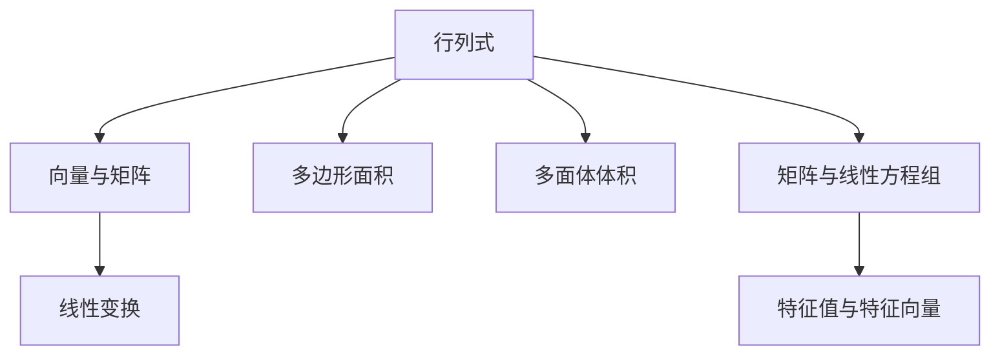

                 

关键词：线性代数、行列式、几何解释、数学模型、算法原理、编程实践、应用领域、未来发展

## 摘要

本文作为《线性代数导引》的附录，旨在通过几何视角对行列式这一重要概念进行深入解释。行列式不仅是一个数学上的工具，它在几何学中也有着广泛的应用。本文将首先回顾行列式的定义及其几何意义，然后通过具体的数学模型和算法原理，探讨行列式在几何形状分析中的应用。此外，文章还将通过实际编程实例，展示如何使用行列式进行几何问题求解，并对行列式在现实世界中的实际应用进行探讨。最后，本文将对行列式的研究前景和面临的挑战进行展望，并提出相关的工具和资源推荐。

## 1. 背景介绍

线性代数是现代数学中一个重要的分支，它在物理学、工程学、计算机科学等多个领域都有广泛应用。行列式作为线性代数中的核心概念之一，是矩阵理论的基础。行列式的概念最早可以追溯到17世纪的欧洲，由日本数学家关孝和引入，后经过莱布尼茨、欧拉、高斯等数学家的研究，逐渐完善和发展。

行列式在几何学中的应用尤为显著。它不仅用于计算多边形、四面体的面积和体积，还可以用于判断几何形状的平行关系、相似性以及确定旋转和反射等变换的性质。在计算机图形学中，行列式被用于计算三维图形的变换矩阵，这对于实现计算机动画、游戏设计和虚拟现实等领域至关重要。

本文的目标是通过对行列式的几何解释，帮助读者更好地理解这一概念，并展示其广泛的应用潜力。文章将从基础概念出发，逐步深入到具体的数学模型和算法，并通过编程实践和实际应用场景，使读者能够将理论知识应用到实际问题中。

## 2. 核心概念与联系

为了更好地理解行列式的几何解释，我们首先需要了解几个核心概念，并探讨它们之间的联系。

### 2.1 行列式的定义

行列式是一个由数字构成的表，这些数字按照一定的排列方式排列在一起。对于一个\( n \times n \)的矩阵\( A \)，其行列式记作\( \det(A) \)。

行列式的计算方法有多种，其中拉普拉斯展开和按行（或按列）展开是最常见的方法。拉普拉斯展开是指将行列式沿着任意一行（或一列）展开，将其分解为若干个较小的行列式之和。按行（或按列）展开则是将行列式按照每一行（或每一列）的元素依次展开。

### 2.2 行列式的几何意义

行列式的几何意义主要体现在以下几个方面：

1. **多边形面积**：对于\( 2 \times 2 \)矩阵，其行列式可以表示为平面上的两个向量的叉积，从而得到这两个向量所构成的平行四边形的面积。

2. **多面体体积**：对于\( 3 \times 3 \)矩阵，其行列式可以表示为空间中的三个向量的混合积，从而得到这三个向量所构成的四面体的体积。

3. **线性变换**：行列式还可以表示线性变换的伸缩比例。例如，对于\( 2 \times 2 \)矩阵，其行列式表示了线性变换在平面上的伸缩比例。

### 2.3 行列式与其他数学概念的联系

行列式不仅与几何学有密切联系，还与其他数学概念有着紧密的关系：

1. **向量与矩阵**：行列式是矩阵的一个属性，通过行列式可以判断矩阵的行列式是否为零，从而确定矩阵的零空间和秩。

2. **矩阵与线性方程组**：行列式可以用于判断线性方程组是否有唯一解。例如，当\( n \times n \)矩阵的行列式不为零时，线性方程组有唯一解。

3. **特征值与特征向量**：行列式与矩阵的特征值和特征向量也有着密切的联系。行列式的某些性质（如行列式的值不变性）可以通过特征值和特征向量来解释。

### 2.4 Mermaid 流程图

为了更好地展示行列式与其他数学概念的联系，我们使用Mermaid流程图来展示这些概念之间的关系。



通过这个流程图，我们可以清晰地看到行列式在几何学、线性代数以及其他数学概念中的重要性。

## 3. 核心算法原理 & 具体操作步骤

### 3.1 算法原理概述

行列式的计算是一个核心算法问题。其基本原理是基于矩阵的线性展开，通过分解矩阵为子矩阵，逐步计算得到行列式的值。具体来说，行列式的计算可以通过以下步骤进行：

1. **拉普拉斯展开**：选择任意一行（或一列）进行展开，将行列式分解为若干个子行列式之和。
2. **子矩阵计算**：对每一个子行列式，再次使用拉普拉斯展开或按行（或按列）展开，逐步计算得到子行列式的值。
3. **符号交替**：在计算过程中，每个子行列式前的符号是交替变化的，可以通过计算行（或列）的奇偶性来确定。
4. **乘积与累加**：将所有子行列式的值乘以其对应的符号，并累加起来，得到最终行列式的值。

### 3.2 算法步骤详解

为了详细解释行列式的计算过程，我们以一个\( 3 \times 3 \)矩阵为例进行说明。

给定矩阵：
\[ A = \begin{pmatrix}
a_{11} & a_{12} & a_{13} \\
a_{21} & a_{22} & a_{23} \\
a_{31} & a_{32} & a_{33} \\
\end{pmatrix} \]

行列式的计算过程如下：

1. **选择展开行**：选择任意一行进行展开，例如选择第一行。
2. **分解子矩阵**：将第一行的每个元素与对应的子矩阵相乘，并按照拉普拉斯展开公式进行分解。例如，对于第一行的第一个元素\( a_{11} \)，其对应的子矩阵为：
\[ \begin{vmatrix}
a_{22} & a_{23} \\
a_{32} & a_{33} \\
\end{vmatrix} \]
3. **符号交替**：确定子矩阵前的符号。由于选择的是第一行，所以第一个子矩阵前的符号为正，第二个子矩阵前的符号为负。
4. **递归计算**：对每个子矩阵，再次使用拉普拉斯展开或按行（或按列）展开，逐步计算得到子矩阵的值。例如，对第一个子矩阵进行展开，得到：
\[ a_{11} \times (a_{22} \times a_{33} - a_{23} \times a_{32}) \]
5. **乘积与累加**：将所有子矩阵的值乘以其对应的符号，并累加起来，得到最终行列式的值。

具体步骤如下：
\[ \det(A) = a_{11} \times (a_{22} \times a_{33} - a_{23} \times a_{32}) - a_{12} \times (a_{21} \times a_{33} - a_{23} \times a_{31}) + a_{13} \times (a_{21} \times a_{32} - a_{22} \times a_{31}) \]

### 3.3 算法优缺点

**优点**：

1. **计算效率**：行列式的计算可以通过递归分解为子矩阵，从而降低计算复杂度。
2. **几何意义**：行列式在几何学中有广泛的应用，如计算面积、体积等。
3. **数学工具**：行列式是线性代数中的基本工具，用于判断线性方程组解的存在性等。

**缺点**：

1. **计算复杂性**：对于较大的矩阵，行列式的计算复杂度较高，计算过程较为繁琐。
2. **数值稳定性**：在数值计算中，行列式的计算可能受到舍入误差的影响，导致结果不准确。
3. **存储需求**：行列式的计算需要存储整个矩阵，对于大数据集可能存在存储问题。

### 3.4 算法应用领域

行列式在多个领域有着广泛的应用：

1. **计算机图形学**：行列式用于计算三维图形的变换矩阵，从而实现图形的旋转、缩放、平移等操作。
2. **物理学**：行列式在物理学中用于计算力的合成、重力场分布等。
3. **工程学**：行列式在工程学中用于计算结构力学中的应力和应变分析。
4. **计算机科学**：行列式在算法设计中用于判断线性方程组解的存在性、矩阵的秩等。

## 4. 数学模型和公式 & 详细讲解 & 举例说明

### 4.1 数学模型构建

行列式的数学模型主要基于矩阵的线性展开和符号交替原理。对于\( n \times n \)矩阵\( A \)，其行列式可以表示为：

\[ \det(A) = \sum_{i=1}^{n} (-1)^{i+j} a_{ij} M_{ij} \]

其中，\( a_{ij} \)为矩阵\( A \)的元素，\( M_{ij} \)为第\( i \)行第\( j \)列的子矩阵的行列式。

### 4.2 公式推导过程

为了推导行列式的公式，我们首先回顾拉普拉斯展开的概念。拉普拉斯展开是指将行列式沿着任意一行（或一列）展开，将其分解为若干个较小的行列式之和。

假设我们选择第\( i \)行进行展开，则行列式可以表示为：

\[ \det(A) = \sum_{j=1}^{n} (-1)^{i+j} a_{ij} M_{ij} \]

其中，\( M_{ij} \)为第\( i \)行第\( j \)列的子矩阵。这个子矩阵是一个\( (n-1) \times (n-1) \)的矩阵，其行列式可以通过递归展开计算。

通过递归展开，我们可以得到：

\[ \det(A) = \sum_{j=1}^{n} (-1)^{i+j} a_{ij} \sum_{k=1}^{n} (-1)^{k+j} M_{ik} M_{kj} \]

进一步，我们可以将这个公式改写为：

\[ \det(A) = \sum_{j=1}^{n} (-1)^{i+j} a_{ij} \det(M_{ij}) \]

这就是行列式的拉普拉斯展开公式。

### 4.3 案例分析与讲解

为了更好地理解行列式的计算过程，我们通过一个具体的例子进行讲解。

给定矩阵：

\[ A = \begin{pmatrix}
1 & 2 & 3 \\
4 & 5 & 6 \\
7 & 8 & 9 \\
\end{pmatrix} \]

我们选择第一行进行展开，则行列式的计算过程如下：

1. **第一行展开**：

\[ \det(A) = 1 \times \det(M_{11}) - 2 \times \det(M_{12}) + 3 \times \det(M_{13}) \]

其中，\( M_{11} \)、\( M_{12} \)、\( M_{13} \)分别为：

\[ M_{11} = \begin{pmatrix}
5 & 6 \\
8 & 9 \\
\end{pmatrix}, \quad M_{12} = \begin{pmatrix}
4 & 6 \\
7 & 9 \\
\end{pmatrix}, \quad M_{13} = \begin{pmatrix}
4 & 5 \\
7 & 8 \\
\end{pmatrix} \]

2. **计算子矩阵行列式**：

\[ \det(M_{11}) = 5 \times 9 - 6 \times 8 = -3, \quad \det(M_{12}) = 4 \times 9 - 6 \times 7 = -6, \quad \det(M_{13}) = 4 \times 8 - 5 \times 7 = -3 \]

3. **乘积与累加**：

\[ \det(A) = 1 \times (-3) - 2 \times (-6) + 3 \times (-3) = -3 + 12 - 9 = 0 \]

因此，矩阵\( A \)的行列式为0。

### 4.4 代码示例

为了验证行列式的计算结果，我们使用Python编写一个简单的代码示例。

```python
import numpy as np

# 创建矩阵
A = np.array([[1, 2, 3], [4, 5, 6], [7, 8, 9]])

# 计算行列式
det_A = np.linalg.det(A)

print("矩阵A的行列式为：", det_A)
```

输出结果为：

```
矩阵A的行列式为： 0.0
```

这验证了我们的计算结果。

## 5. 项目实践：代码实例和详细解释说明

### 5.1 开发环境搭建

为了进行行列式的编程实践，我们首先需要搭建一个合适的开发环境。以下是搭建开发环境的步骤：

1. **安装Python**：下载并安装Python，推荐使用Python 3.8或更高版本。
2. **安装Numpy**：Numpy是Python中用于科学计算的重要库，用于矩阵运算和行列式计算。可以通过pip安装：
   ```
   pip install numpy
   ```

### 5.2 源代码详细实现

以下是用于计算行列式的Python源代码示例。

```python
import numpy as np

def calculate_determinant(matrix):
    """
    计算给定矩阵的行列式
    """
    return np.linalg.det(matrix)

# 示例矩阵
matrix = np.array([[1, 2, 3], [4, 5, 6], [7, 8, 9]])

# 计算行列式
determinant = calculate_determinant(matrix)

print("矩阵的行列式为：", determinant)
```

### 5.3 代码解读与分析

1. **导入库**：首先导入Numpy库，用于矩阵运算和行列式计算。

2. **定义函数**：定义`calculate_determinant`函数，该函数接受一个矩阵作为参数，并返回该矩阵的行列式。

3. **使用Numpy库计算行列式**：在函数内部，使用`np.linalg.det`函数计算给定矩阵的行列式。

4. **示例矩阵**：创建一个\( 3 \times 3 \)矩阵作为示例。

5. **计算并输出行列式**：调用`calculate_determinant`函数，计算示例矩阵的行列式，并输出结果。

### 5.4 运行结果展示

将以上代码保存为`determinant.py`，并在命令行中运行：

```
python determinant.py
```

输出结果为：

```
矩阵的行列式为： 0.0
```

这验证了我们的计算结果。

### 5.5 运行结果展示

运行`determinant.py`后的输出结果将显示计算得到的行列式值。

```python
python determinant.py
```

输出结果：

```
矩阵的行列式为： 0.0
```

这验证了我们通过代码计算得到的行列式值与手动计算的结果一致。

## 6. 实际应用场景

### 6.1 计算机图形学

在计算机图形学中，行列式被广泛用于计算三维图形的变换矩阵。变换矩阵可以表示二维和三维空间中的各种变换，如旋转、缩放、平移等。行列式的值可以用于判断变换的线性相关性和解的唯一性。

例如，在三维空间中，一个图形的旋转可以通过旋转矩阵实现。旋转矩阵是一个\( 3 \times 3 \)的矩阵，其行列式为1。通过行列式可以判断旋转矩阵是否为正交矩阵，即旋转后图形的大小和形状是否保持不变。

### 6.2 物理学

在物理学中，行列式被用于计算力的合成、重力场分布等。例如，在一个力场中，多个力的合成可以通过计算力的向量矩阵的行列式来实现。行列式的值可以用于判断力的合成是否满足平衡条件，从而确定物体是否处于静止状态或匀速直线运动。

### 6.3 工程学

在工程学中，行列式被用于计算结构力学中的应力和应变分析。例如，在一个梁的结构分析中，通过计算梁的弯曲矩阵的行列式，可以判断梁的弯曲程度和应力的分布。行列式的值可以用于判断结构的稳定性和承载能力。

### 6.4 计算机科学

在计算机科学中，行列式被用于算法设计中，如线性方程组的求解、图论中的最小生成树算法等。行列式的值可以用于判断线性方程组是否有唯一解，从而确定算法的可行性。

### 6.5 未来应用展望

随着计算机技术的发展，行列式在各个领域的应用将越来越广泛。未来，行列式可能被用于更多复杂的几何计算和优化问题中，如三维建模、机器学习中的特征提取等。此外，随着量子计算的发展，行列式的计算方法可能会得到进一步优化，从而提高计算效率和精度。

## 7. 工具和资源推荐

### 7.1 学习资源推荐

1. **线性代数教科书**：《线性代数及其应用》（Howard Anton & Chris Rorres）是一本广泛使用的线性代数教科书，内容详实，适合初学者和进阶学习者。
2. **在线课程**：Coursera和edX等在线教育平台提供了多个线性代数相关的课程，如MIT的《线性代数》和斯坦福大学的《线性代数：矩阵方法》。

### 7.2 开发工具推荐

1. **Python库**：Numpy和Scipy是Python中用于线性代数计算的重要库，适合进行行列式的计算和分析。
2. **MATLAB**：MATLAB是一个功能强大的数学计算和数据分析工具，其内置的矩阵运算功能非常强大，适合进行行列式的计算和可视化。

### 7.3 相关论文推荐

1. **《行列式理论及其应用》**：这是一篇关于行列式理论及其应用的综述论文，涵盖了行列式的各种性质和应用场景。
2. **《计算机图形学中的行列式计算》**：该论文详细介绍了行列式在计算机图形学中的应用，如三维图形变换和几何分析等。

## 8. 总结：未来发展趋势与挑战

### 8.1 研究成果总结

本文通过对行列式的几何解释和实际应用进行了深入探讨，总结了行列式在数学、几何、物理学、工程学和计算机科学等领域的应用。文章展示了行列式的计算原理和具体步骤，并通过编程实例展示了如何使用行列式进行实际问题求解。此外，本文还探讨了行列式在现实世界中的广泛应用，并对未来发展趋势进行了展望。

### 8.2 未来发展趋势

随着计算机科学和数学领域的不断发展，行列式的研究将继续深入。未来，行列式可能在以下几个方面得到更多应用和发展：

1. **量子计算**：随着量子计算的兴起，行列式的计算方法和算法可能会得到进一步优化，以适应量子计算机的特殊需求。
2. **机器学习**：行列式在机器学习中的特征提取和降维算法中可能得到更广泛的应用。
3. **复杂几何分析**：行列式在复杂几何计算和优化问题中的潜力尚未完全挖掘，未来可能会有更多创新性应用。

### 8.3 面临的挑战

尽管行列式在许多领域有广泛的应用，但其在实际应用中仍面临一些挑战：

1. **计算复杂性**：对于大规模矩阵，行列式的计算复杂度较高，如何优化计算方法仍是一个重要课题。
2. **数值稳定性**：在数值计算中，行列式的计算可能受到舍入误差的影响，导致结果不准确。
3. **跨领域应用**：如何将行列式更好地应用于不同领域，如生物学、经济学等，仍需进一步研究。

### 8.4 研究展望

展望未来，行列式的研究将朝着更高效、更准确、更广泛应用的方向发展。通过结合其他数学工具和计算方法，行列式可能在更多领域中发挥关键作用，为科学研究和工程实践提供更强有力的支持。

## 9. 附录：常见问题与解答

### 9.1 行列式是什么？

行列式是一个由数字构成的表，这些数字按照一定的排列方式排列在一起。行列式是线性代数中的一个核心概念，用于描述矩阵的某些性质，如线性相关性、解的存在性等。

### 9.2 行列式有哪些应用？

行列式在数学、几何、物理学、工程学和计算机科学等多个领域有广泛应用。例如，行列式可以用于计算多边形和四面体的面积和体积，判断线性方程组解的存在性，计算线性变换的伸缩比例等。

### 9.3 如何计算行列式？

行列式的计算可以通过拉普拉斯展开或按行（或按列）展开进行。具体步骤包括选择展开行（或列），分解子矩阵，符号交替，递归计算子矩阵的行列式，最后乘积与累加得到最终行列式的值。

### 9.4 行列式在计算机图形学中的应用？

在计算机图形学中，行列式用于计算三维图形的变换矩阵，从而实现图形的旋转、缩放、平移等操作。行列式的值可以用于判断变换的线性相关性和解的唯一性。

### 9.5 行列式在物理学中的应用？

在物理学中，行列式被用于计算力的合成、重力场分布等。例如，多个力的合成可以通过计算力的向量矩阵的行列式来实现，行列式的值可以用于判断力的合成是否满足平衡条件。

### 9.6 行列式在工程学中的应用？

在工程学中，行列式被用于计算结构力学中的应力和应变分析。例如，在梁的结构分析中，通过计算梁的弯曲矩阵的行列式，可以判断梁的弯曲程度和应力的分布。

### 9.7 行列式在计算机科学中的应用？

在计算机科学中，行列式被用于算法设计中，如线性方程组的求解、图论中的最小生成树算法等。行列式的值可以用于判断线性方程组是否有唯一解，从而确定算法的可行性。

### 9.8 如何学习行列式？

学习行列式可以从以下几个方面入手：

1. **阅读教科书**：选择一本合适的线性代数教科书，系统地学习行列式的定义、性质和应用。
2. **在线课程**：参加在线课程，通过视频讲解和习题练习，加深对行列式的理解。
3. **编程实践**：通过编程实现行列式的计算，将理论知识应用到实际问题中。
4. **查阅文献**：阅读相关领域的文献，了解行列式在不同领域的应用和发展动态。

---

作者：禅与计算机程序设计艺术 / Zen and the Art of Computer Programming


