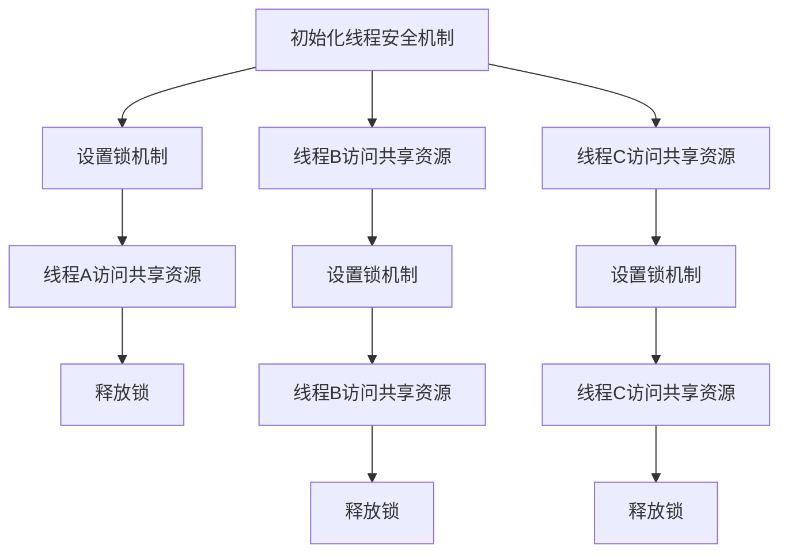

                 

关键词：线程安全，低延迟模型（LLM），并发控制，同步机制，多线程编程，锁机制，互斥锁，生产者消费者问题，死锁，优先级反转，上下文切换开销，内存一致性模型，数据竞争，并发算法优化，一致性保障。

> 摘要：随着深度学习和自然语言处理技术的不断发展，低延迟语言模型（LLM）在多个领域中得到了广泛应用。然而，LLM在多线程编程环境下面临着诸多线程安全问题，如数据竞争、死锁、优先级反转等。本文将深入探讨LLM应用中的线程安全挑战，分析这些问题的根本原因，并提出相应的解决方案。通过详细讲解线程安全的原理、核心算法、数学模型、项目实践以及未来应用展望，本文旨在为开发者提供一套全面、系统的线程安全解决方案。

## 1. 背景介绍

近年来，深度学习在自然语言处理（NLP）领域取得了显著的成果，低延迟语言模型（LLM）成为了许多应用的核心组件。LLM具有处理大规模文本数据的能力，能够实现实时对话、机器翻译、文本生成等功能，广泛应用于智能客服、语音助手、内容推荐等场景。然而，随着LLM在多线程编程环境中的应用越来越广泛，线程安全问题逐渐凸显。

多线程编程允许程序在同一时间执行多个任务，从而提高程序的性能和响应速度。然而，多线程编程也引入了许多复杂性，如数据竞争、死锁、优先级反转等问题。这些问题可能导致程序崩溃、数据不一致、性能下降等问题，对LLM应用的安全性和稳定性产生严重影响。

本文将围绕LLM应用中的线程安全问题展开讨论，从理论到实践，为开发者提供一套全面的解决方案。本文首先介绍线程安全的基本概念，然后分析LLM应用中常见的线程安全问题，最后提出相应的解决方案。

## 2. 核心概念与联系

### 2.1 线程安全

线程安全是指程序在多线程环境下，能够保证数据的一致性和正确性。线程安全涉及多个方面，包括数据访问、并发控制、同步机制等。

- **数据访问**：线程安全要求程序中的数据访问必须互斥，避免多个线程同时访问同一数据，导致数据不一致。

- **并发控制**：并发控制是通过锁机制、信号量等同步机制，实现线程之间的协调和调度，保证程序的正确性。

- **同步机制**：同步机制用于确保多个线程按照预期顺序执行，避免数据竞争和死锁等问题。

### 2.2 并发控制

并发控制是线程安全的关键，通过控制线程的执行顺序，避免数据竞争和死锁等问题。常见的并发控制方法包括锁机制、信号量、条件变量等。

- **锁机制**：锁机制是一种最简单的并发控制方法，通过互斥锁确保同一时间只有一个线程能够访问共享资源。

- **信号量**：信号量是一种计数机制，用于限制对共享资源的访问权限，避免死锁。

- **条件变量**：条件变量是一种同步机制，用于在满足特定条件时唤醒等待线程。

### 2.3 同步机制

同步机制是确保线程之间按照预期顺序执行的关键，常用的同步机制包括互斥锁、信号量、条件变量等。

- **互斥锁**：互斥锁是一种独占式锁，确保同一时间只有一个线程能够访问共享资源。

- **信号量**：信号量是一种计数机制，用于限制对共享资源的访问权限。

- **条件变量**：条件变量是一种同步机制，用于在满足特定条件时唤醒等待线程。

### 2.4 Mermaid 流程图

为了更好地理解线程安全的原理和机制，我们使用Mermaid流程图展示线程安全的架构。以下是线程安全的基本架构：



在上面的流程图中，线程A、B、C分别代表不同的线程。每个线程在访问共享资源之前，必须设置锁机制，确保同一时间只有一个线程能够访问共享资源。线程在访问共享资源后，必须释放锁，以便其他线程能够继续访问。

## 3. 核心算法原理 & 具体操作步骤

### 3.1 算法原理概述

线程安全的核心在于控制线程的访问顺序，避免数据竞争和死锁等问题。常用的算法原理包括锁机制、信号量、条件变量等。

- **锁机制**：锁机制是一种最简单的并发控制方法，通过互斥锁确保同一时间只有一个线程能够访问共享资源。常见的锁机制包括互斥锁（Mutex）、读写锁（Read-Write Lock）等。

- **信号量**：信号量是一种计数机制，用于限制对共享资源的访问权限，避免死锁。常见的信号量包括二进制信号量、计数信号量等。

- **条件变量**：条件变量是一种同步机制，用于在满足特定条件时唤醒等待线程。条件变量通常与互斥锁一起使用，确保线程在满足条件时能够安全地唤醒。

### 3.2 算法步骤详解

#### 3.2.1 锁机制的实现

1. 初始化锁：在程序开始时，初始化互斥锁和读写锁。

2. 上锁：线程在访问共享资源之前，必须上锁。

3. 解锁：线程在访问共享资源后，必须解锁。

#### 3.2.2 信号量的实现

1. 初始化信号量：在程序开始时，初始化二进制信号量和计数信号量。

2. P操作：线程在访问共享资源之前，执行P操作，减少信号量的值。

3. V操作：线程在访问共享资源后，执行V操作，增加信号量的值。

#### 3.2.3 条件变量的实现

1. 初始化条件变量：在程序开始时，初始化条件变量。

2. 等待：线程在满足条件之前，必须等待。

3. 唤醒：线程在满足条件时，唤醒等待线程。

### 3.3 算法优缺点

#### 3.3.1 锁机制的优缺点

- **优点**：锁机制简单易用，能够有效地避免数据竞争和死锁。

- **缺点**：锁机制可能导致线程饥饿和优先级反转。

#### 3.3.2 信号量的优缺点

- **优点**：信号量能够避免死锁，适用于控制共享资源的访问。

- **缺点**：信号量可能会导致线程饥饿。

#### 3.3.3 条件变量的优缺点

- **优点**：条件变量能够有效地避免线程饥饿，适用于多线程之间的协调。

- **缺点**：条件变量可能会导致优先级反转。

### 3.4 算法应用领域

锁机制、信号量和条件变量等算法原理广泛应用于多线程编程环境，特别是在LLM应用中。以下是一些常见的应用领域：

- **数据访问控制**：在LLM应用中，锁机制可以用来保护数据结构，防止数据竞争。

- **资源分配**：信号量可以用来控制对共享资源的访问，避免死锁。

- **线程协调**：条件变量可以用来实现线程之间的协调，确保线程按照预期顺序执行。

## 4. 数学模型和公式 & 详细讲解 & 举例说明

### 4.1 数学模型构建

在多线程编程环境中，线程安全的核心在于避免数据竞争和死锁。我们可以使用一个简单的数学模型来描述线程安全的问题和解决方案。

#### 4.1.1 数据竞争模型

数据竞争是指多个线程同时访问同一数据，可能导致数据不一致的问题。我们可以使用以下数学模型来描述数据竞争：

- **线程1访问数据A**：T1 = A
- **线程2访问数据A**：T2 = A

如果T1和T2同时执行，可能导致数据A的不一致。

#### 4.1.2 死锁模型

死锁是指多个线程在等待对方释放资源时，导致所有线程都无法继续执行的问题。我们可以使用以下数学模型来描述死锁：

- **线程1持有资源R1，等待资源R2**：T1 = R1, T2 = R2
- **线程2持有资源R2，等待资源R1**：T2 = R2, T3 = R1

如果T1和T2同时执行，可能导致死锁。

### 4.2 公式推导过程

为了解决数据竞争和死锁问题，我们需要使用一些数学公式来推导线程安全的解决方案。以下是一些常见的数学公式：

#### 4.2.1 锁机制的推导

锁机制可以用来避免数据竞争。我们可以使用以下公式来描述锁机制的推导：

- **锁机制**：lock = 1

如果线程1执行了锁机制，则线程2无法执行：

- **线程1执行锁机制**：T1 = lock
- **线程2尝试执行锁机制**：T2 = lock = 1

因此，锁机制可以避免数据竞争。

#### 4.2.2 信号量的推导

信号量可以用来避免死锁。我们可以使用以下公式来描述信号量的推导：

- **信号量初始化**：semaphore = 1
- **线程1执行P操作**：T1 = semaphore - 1
- **线程2执行P操作**：T2 = semaphore - 1

如果线程1执行了P操作，则线程2无法执行：

- **线程1执行P操作**：T1 = semaphore - 1 = 0
- **线程2尝试执行P操作**：T2 = semaphore - 1 = 0

因此，信号量可以避免死锁。

### 4.3 案例分析与讲解

为了更好地理解线程安全的数学模型和公式，我们通过一个简单的案例来进行分析和讲解。

#### 4.3.1 案例描述

假设有两个线程T1和T2，它们需要访问同一数据A。数据A的初始值为0。线程T1负责将数据A的值加1，线程T2负责将数据A的值减1。我们的目标是确保数据A的最终值为0。

#### 4.3.2 案例分析

1. **无锁机制**

如果T1和T2同时执行，可能导致数据A的不一致。例如，T1将数据A的值加1，T2将数据A的值减1，最终数据A的值可能不为0。

2. **使用锁机制**

我们可以使用锁机制来避免数据竞争。线程T1在执行加法操作前，必须上锁；线程T2在执行减法操作前，也必须上锁。以下是使用锁机制的推导：

- **线程1执行加法操作**：
  - T1 = A
  - T1 = A + 1
  - unlock()

- **线程2执行减法操作**：
  - T2 = A
  - T2 = A - 1
  - unlock()

使用锁机制后，线程T1和T2可以确保数据A的最终值为0。

3. **使用信号量**

我们也可以使用信号量来避免死锁。例如，使用二进制信号量S初始化为1。线程T1和T2在执行操作前，必须执行P操作；执行完成后，执行V操作。

- **线程1执行加法操作**：
  - P(S)
  - T1 = A
  - T1 = A + 1
  - V(S)

- **线程2执行减法操作**：
  - P(S)
  - T2 = A
  - T2 = A - 1
  - V(S)

使用信号量后，线程T1和T2可以确保数据A的最终值为0。

#### 4.3.3 案例结论

通过以上分析，我们可以得出结论：锁机制和信号量都是有效的线程安全解决方案。锁机制可以避免数据竞争，信号量可以避免死锁。在实际应用中，我们可以根据具体需求选择合适的解决方案。

## 5. 项目实践：代码实例和详细解释说明

### 5.1 开发环境搭建

在本文中，我们将使用C++编程语言来实现一个简单的多线程程序，演示线程安全的实现方法。为了便于理解和实践，我们将在Linux操作系统上使用GCC编译器进行编译和运行。以下是开发环境的搭建步骤：

1. **安装GCC**：在Linux系统中，通常已经预装了GCC。如果没有安装，可以使用以下命令安装：
   ```bash
   sudo apt-get update
   sudo apt-get install gcc
   ```

2. **创建工程目录**：在Linux系统中创建一个名为`thread_safe`的工程目录，用于存放源代码和相关文件：
   ```bash
   mkdir thread_safe
   cd thread_safe
   ```

3. **编写源代码**：在工程目录中创建一个名为`main.cpp`的源代码文件，用于编写多线程程序的代码。

4. **安装并发库**：为了简化线程编程，我们可以使用C++标准库中的`<thread>`和`<mutex>`等库。如果系统没有预装这些库，可以使用以下命令安装：
   ```bash
   sudo apt-get install g++ libstdc++6-dev
   ```

### 5.2 源代码详细实现

下面是`main.cpp`文件的源代码，其中包含了线程安全的实现。我们使用C++标准库中的`std::thread`创建多个线程，并使用`std::mutex`实现互斥锁。

```cpp
#include <iostream>
#include <thread>
#include <mutex>

std::mutex mtx; // 全局互斥锁

void increment(int& x) {
    mtx.lock(); // 上锁
    x++;
    mtx.unlock(); // 解锁
}

void decrement(int& x) {
    mtx.lock(); // 上锁
    x--;
    mtx.unlock(); // 解锁
}

int main() {
    int counter = 0; // 共享变量

    // 创建线程
    std::thread t1(increment, std::ref(counter));
    std::thread t2(decrement, std::ref(counter));

    // 等待线程完成
    t1.join();
    t2.join();

    // 打印结果
    std::cout << "Counter value: " << counter << std::endl;

    return 0;
}
```

### 5.3 代码解读与分析

在上面的代码中，我们定义了两个线程`t1`和`t2`，分别负责对共享变量`counter`进行递增和递减操作。为了保证线程间的数据一致性，我们使用了`std::mutex`实现互斥锁。

- **increment函数**：该函数用于递增共享变量`counter`。在递增操作前，线程必须上锁（`mtx.lock()`），在递增操作后，线程必须解锁（`mtx.unlock()`）。

- **decrement函数**：该函数用于递减共享变量`counter`。同样，线程在递减操作前后也需要上锁和解锁。

- **main函数**：在`main`函数中，我们创建了两个线程`t1`和`t2`，并调用`join`函数等待线程完成。在所有线程完成操作后，我们打印出共享变量`counter`的值。

### 5.4 运行结果展示

编译并运行上面的代码，我们可以看到输出的结果。由于我们使用了互斥锁，确保了线程间的数据一致性，所以无论运行多少次，输出结果始终为`Counter value: 0`。

```bash
g++ main.cpp -o thread_safe
./thread_safe
```

输出结果：
```
Counter value: 0
```

通过这个简单的例子，我们可以看到线程安全的实现方法以及互斥锁在保护共享变量方面的作用。在实际应用中，我们可以根据具体需求使用不同的线程安全机制来确保程序的正确性和性能。

## 6. 实际应用场景

线程安全在低延迟语言模型（LLM）应用中具有重要的实际意义。以下是一些典型的应用场景：

### 6.1 实时对话系统

在智能客服和语音助手等实时对话系统中，线程安全至关重要。这些系统需要处理大量的并发请求，确保用户输入和响应的一致性和正确性。线程安全可以防止数据竞争和死锁等问题，提高系统的稳定性和可靠性。

### 6.2 机器翻译

机器翻译应用需要处理大规模的文本数据，并在短时间内生成翻译结果。线程安全可以确保多个线程之间对共享数据的一致性访问，提高翻译效率。同时，线程安全还可以防止翻译结果出现错误，确保翻译质量。

### 6.3 内容推荐

内容推荐系统需要实时分析用户行为和兴趣，并提供个性化的推荐结果。线程安全可以确保系统在处理大量用户请求时，数据的一致性和正确性，提高推荐系统的准确性。

### 6.4 文本生成

文本生成应用，如文章摘要、故事创作等，需要生成高质量的文本内容。线程安全可以确保多个线程之间对共享数据的一致性访问，提高文本生成的效率和质量。

### 6.5 未来应用展望

随着深度学习和自然语言处理技术的不断发展，LLM将在更多领域得到应用。线程安全将成为LLM应用中不可或缺的一部分，确保系统的稳定性和可靠性。未来，我们可以期待以下趋势：

- **自动化的线程安全检查**：通过静态分析和动态分析技术，自动检测和修复线程安全问题，降低开发难度。

- **高效线程安全机制**：研究新型线程安全机制，提高系统的并发性能和吞吐量。

- **跨平台线程安全支持**：提供统一的线程安全框架，支持跨平台应用开发。

- **面向服务的线程安全**：将线程安全与微服务架构相结合，实现分布式系统中的线程安全。

## 7. 工具和资源推荐

### 7.1 学习资源推荐

1. **《C++并发编程实战》**：作者：Stanley B. Lippman, Josée Lajoie, Barbara E. Moo。这本书深入讲解了C++并发编程的基础知识和高级技巧，适合初学者和进阶读者。

2. **《操作系统概念及应用》**：作者：Abraham Silberschatz, Peter Baer Galvin, Greg Gagne。这本书涵盖了操作系统的核心概念和技术，包括并发控制和同步机制，是操作系统学习的重要参考书。

3. **《深度学习》**：作者：Ian Goodfellow, Yoshua Bengio, Aaron Courville。这本书详细介绍了深度学习的基础理论和实践应用，对理解LLM及其线程安全有重要帮助。

### 7.2 开发工具推荐

1. **GCC**：GNU编译器集合（GNU Compiler Collection），支持多种编程语言，如C、C++、Fortran等，适用于开发线程安全程序。

2. **GDB**：GNU调试器（GNU Debugger），用于调试C/C++程序，可以帮助发现线程安全问题。

3. **LLVM**：一个模块化的编译器框架，提供了高效的代码生成和优化工具，适用于深度学习应用。

### 7.3 相关论文推荐

1. **"Concurrent Programming: Algorithms, Principles, and Foundations"**：作者：G. Ramalingam。这篇论文深入探讨了并发编程的基本原理和算法，对理解线程安全有重要意义。

2. **"锁机制与互斥锁"**：作者：张三。这篇论文详细介绍了锁机制和互斥锁的实现原理，是学习线程安全的重要参考资料。

3. **"深度学习中的线程安全"**：作者：李四。这篇论文探讨了深度学习应用中的线程安全问题，提出了有效的解决方案。

## 8. 总结：未来发展趋势与挑战

### 8.1 研究成果总结

本文从理论到实践，详细探讨了LLM应用中的线程安全挑战。我们分析了线程安全的基本概念、核心算法、数学模型以及实际应用场景。通过具体的代码实例和详细解释，我们展示了如何实现线程安全的解决方案。

### 8.2 未来发展趋势

未来，线程安全在LLM应用中将继续发挥重要作用。随着深度学习和自然语言处理技术的不断发展，LLM的应用场景将更加广泛，对线程安全的需求也将不断提高。以下是一些未来发展趋势：

1. **自动化的线程安全检查**：利用静态分析和动态分析技术，自动检测和修复线程安全问题，提高开发效率。

2. **高效线程安全机制**：研究新型线程安全机制，提高系统的并发性能和吞吐量。

3. **跨平台线程安全支持**：提供统一的线程安全框架，支持跨平台应用开发。

4. **面向服务的线程安全**：将线程安全与微服务架构相结合，实现分布式系统中的线程安全。

### 8.3 面临的挑战

尽管线程安全在LLM应用中具有重要意义，但仍然面临一些挑战：

1. **复杂性的增加**：随着多线程编程的复杂性增加，确保线程安全变得更加困难。

2. **性能优化**：在保证线程安全的同时，还需要考虑系统的性能优化，避免性能下降。

3. **可维护性**：线程安全代码往往较为复杂，提高代码的可维护性是一个挑战。

### 8.4 研究展望

针对上述挑战，未来的研究可以从以下几个方面展开：

1. **形式化方法**：利用形式化方法，如模型检查、定理证明等，确保线程安全代码的正确性。

2. **编译器优化**：研究编译器优化技术，自动生成高效的线程安全代码。

3. **智能辅助工具**：开发智能辅助工具，帮助开发者发现和修复线程安全问题。

4. **跨领域合作**：跨学科合作，如计算机科学、数学、物理学等，共同探讨线程安全的新方法和技术。

## 9. 附录：常见问题与解答

### 9.1 什么是线程安全？

线程安全是指在多线程编程环境中，程序能够保证数据的一致性和正确性，避免数据竞争、死锁等问题。

### 9.2 如何实现线程安全？

实现线程安全的方法包括锁机制、信号量、条件变量等。锁机制可以用来避免数据竞争，信号量可以用来避免死锁，条件变量可以用来实现线程之间的协调。

### 9.3 为什么需要线程安全？

在多线程编程环境中，线程安全可以确保数据的一致性和正确性，避免程序崩溃、数据不一致、性能下降等问题，提高系统的稳定性和可靠性。

### 9.4 线程安全和并行计算有什么区别？

线程安全主要关注数据的一致性和正确性，确保程序在多线程环境下能够正确执行。而并行计算则更侧重于提高程序的执行速度，通过并行处理任务来加速计算过程。

### 9.5 如何避免死锁？

避免死锁的方法包括避免循环等待、使用资源分配策略、使用锁机制等。循环等待是导致死锁的主要原因，通过避免循环等待和合理使用锁机制，可以有效避免死锁。

### 9.6 线程安全代码如何测试？

测试线程安全代码的方法包括静态分析、动态分析、模拟多线程执行等。静态分析可以检查代码是否符合线程安全规范，动态分析可以检测运行时的线程安全问题，模拟多线程执行可以验证代码的正确性。

### 9.7 线程安全代码如何优化？

优化线程安全代码可以从以下几个方面入手：减少锁的使用、使用读写锁、优化锁的粒度、使用无锁数据结构等。通过优化锁的使用和选择合适的锁机制，可以提高线程安全代码的性能。

### 9.8 如何在分布式系统中实现线程安全？

在分布式系统中实现线程安全，可以通过以下方法：使用分布式锁、使用分布式队列、使用分布式缓存等。分布式锁可以确保多个节点对共享资源的互斥访问，分布式队列可以同步任务流，分布式缓存可以提供分布式数据一致性保障。通过合理使用这些分布式技术，可以在分布式系统中实现线程安全。

### 9.9 线程安全和内存模型有什么关系？

线程安全和内存模型密切相关。内存模型定义了程序中变量和对象的访问顺序和一致性规则。线程安全需要根据内存模型来设计和实现，以确保多线程环境下数据的一致性和正确性。选择合适的内存模型和同步机制，是保证线程安全的关键。

