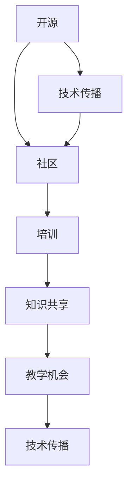

                 

### 关键词 Keywords
- 技术培训
- 开源社区
- 教学机会
- 专业发展
- 知识共享
- 技术传播
- 开源项目
- IT技能培养

### 摘要 Abstract
本文探讨了开源专家在技术培训中的重要作用。通过分析开源项目的特性，阐述了开源技术培训的优势及其对个人和社区的价值。文章详细介绍了如何组织技术培训，包括核心概念、算法原理、数学模型以及项目实践等方面的讲解。同时，文章还提出了工具和资源推荐，总结了开源技术培训的未来发展趋势与挑战，并为读者提供了常见问题与解答。

## 1. 背景介绍 Background

技术培训在当今数字化时代中扮演着越来越重要的角色。随着技术的不断演进，新的编程语言、框架和工具层出不穷，工程师和开发者需要不断更新知识，以保持竞争力。然而，传统的培训方式往往存在成本高、灵活性差、实用性不足等问题。与此同时，开源社区的兴起为技术培训提供了一个全新的解决方案。

开源社区以其开放、透明、协作的特点，吸引了大量的开发者参与。在这些社区中，专家和爱好者共同贡献代码、文档和教程，形成了丰富的知识库。这些资源不仅免费，而且不断更新，能够及时反映技术的最新发展。因此，开源社区成为了一个天然的技术培训平台。

开源项目的特性，如版本控制、文档编写、代码审查等，也使得技术培训更加规范和系统。参与者可以通过参与开源项目，实际应用所学的知识，提高实践能力。同时，开源项目的多样性也提供了丰富的培训内容，涵盖了从基础编程到高级架构设计的各个方面。

本文旨在探讨如何利用开源专家的教学机会，组织高效、有价值的技术培训，促进个人和社区的专业发展。

### 2. 核心概念与联系 Core Concepts and Connections

为了深入理解开源技术培训的核心概念和联系，我们需要首先明确几个关键概念，并展示它们之间的关系。

**开源（Open Source）**：开源是指一种软件许可协议，允许用户自由地使用、研究、修改和分发软件。开源的核心价值观包括自由、透明、共享和创新。

**社区（Community）**：开源社区是由共享相同兴趣、目标和价值观的开发者组成的团体。社区成员通过合作、交流和协作，共同推动开源项目的发展。

**培训（Training）**：培训是指通过教学、练习和指导，帮助学习者掌握特定技能的过程。在开源社区中，培训不仅仅是知识的传递，更是经验分享和技能提升的平台。

**知识共享（Knowledge Sharing）**：知识共享是指通过不同形式，如文档、代码、讨论等，将个人知识传递给他人。在开源社区中，知识共享是促进技术培训的重要手段。

**教学机会（Educational Opportunities）**：教学机会是指为学习者提供的学习资源和指导。在开源社区中，专家和资深开发者往往愿意分享自己的经验和知识，为新手提供教学机会。

**技术传播（Technology Dissemination）**：技术传播是指将新技术、新方法传播给更广泛的受众。开源社区通过共享代码、文档和教程，实现了技术传播的目标。

为了更好地展示这些概念之间的关系，我们可以使用Mermaid流程图来描述它们之间的联系：



在上面的流程图中，我们可以看到，开源是技术传播的源头，它通过社区形成一个知识共享的环境，进而为培训提供机会，最终实现技术的传播。

### 3. 核心算法原理 & 具体操作步骤

#### 3.1 算法原理概述

在开源技术培训中，核心算法原理的讲解是至关重要的。算法作为计算机科学的基础，广泛应用于各种应用场景，如排序、搜索、图论等。一个优秀的算法不仅能够提高程序的效率，还能够解决复杂问题。

在开源项目中，常见的核心算法包括快速排序、二分搜索、深度优先搜索和广度优先搜索等。这些算法各有其独特的原理和应用场景。

**快速排序（Quick Sort）**：快速排序是一种高效的排序算法，其基本思想是通过一趟排序将待排序的记录分割成独立的两部分，其中一部分记录的关键字均比另一部分的关键字小，然后分别对这两部分记录继续进行排序，以达到整个序列有序。

**二分搜索（Binary Search）**：二分搜索是一种在有序数组中查找特定元素的算法。它的工作原理是通过重复将查找范围缩小一半，逐步逼近目标元素。

**深度优先搜索（DFS）**：深度优先搜索是一种用于遍历或搜索树或图的算法。它的基本思想是尽可能深地搜索树的分支。

**广度优先搜索（BFS）**：广度优先搜索是一种用于遍历或搜索树或图的算法。与深度优先搜索不同，它首先访问每一层的所有节点，然后再逐层进行。

#### 3.2 算法步骤详解

以下是快速排序算法的具体步骤：

1. 选择一个基准元素。
2. 将比基准元素小的元素移动到其左侧，比基准元素大的元素移动到其右侧。
3. 对左右子序列重复上述步骤，直到所有子序列有序。

以下是二分搜索算法的具体步骤：

1. 确定查找范围，初始为整个数组。
2. 计算中间位置。
3. 比较中间位置与目标元素。
4. 如果中间位置元素等于目标元素，返回该位置。
5. 如果中间位置元素大于目标元素，缩小查找范围为左侧。
6. 如果中间位置元素小于目标元素，缩小查找范围为右侧。
7. 重复步骤2-6，直到找到目标元素或查找范围缩小到0。

以下是深度优先搜索算法的具体步骤：

1. 从根节点开始，将其标记为已访问。
2. 访问该节点的所有未访问的邻居节点，并递归地对每个邻居节点执行步骤1-2。
3. 当所有邻居节点都被访问后，回溯到上一个节点，并继续执行步骤2。

以下是广度优先搜索算法的具体步骤：

1. 创建一个队列，将根节点添加到队列中。
2. 当队列非空时，执行以下步骤：
   a. 从队列中移除第一个节点。
   b. 访问该节点，并将其标记为已访问。
   c. 将该节点的所有未访问的邻居节点添加到队列中。
3. 重复步骤2，直到队列变为空。

#### 3.3 算法优缺点

**快速排序**：
- 优点：平均时间复杂度为\(O(n \log n)\)，最坏情况下为\(O(n^2)\)，但这种情况很少见。
- 缺点：最坏情况下性能较差，且随机选择基准元素可以改善性能。

**二分搜索**：
- 优点：平均时间复杂度为\(O(\log n)\)，适用于查找大规模有序数据集。
- 缺点：对于非有序数据集不适用，且需要额外的存储空间来保存中间结果。

**深度优先搜索**：
- 优点：能够找到最短路径，适用于解决连通性问题。
- 缺点：对于大型图可能导致栈溢出，且不一定找到最优解。

**广度优先搜索**：
- 优点：能够找到最短路径，且适用于解决最短路径问题。
- 缺点：时间复杂度为\(O(V+E)\)，其中\(V\)是顶点数，\(E\)是边数，对于大型图可能性能较差。

#### 3.4 算法应用领域

**快速排序**：
- 应用领域：数据库排序、快速检索等。

**二分搜索**：
- 应用领域：搜索引擎、排序算法等。

**深度优先搜索**：
- 应用领域：路径查找、图遍历等。

**广度优先搜索**：
- 应用领域：网络流、社交网络分析等。

## 4. 数学模型和公式 & 详细讲解 & 举例说明

在开源技术培训中，数学模型和公式是理解和应用算法的关键。以下是几个常见数学模型和公式的详细讲解以及实际应用中的举例说明。

### 4.1 数学模型构建

**线性回归模型**：

线性回归模型是一种用于预测连续值的统计模型，其基本形式为：

$$
Y = \beta_0 + \beta_1 X + \epsilon
$$

其中，\(Y\)是因变量，\(X\)是自变量，\(\beta_0\)和\(\beta_1\)是模型参数，\(\epsilon\)是误差项。

**逻辑回归模型**：

逻辑回归模型是一种用于预测离散值的统计模型，其基本形式为：

$$
\log\left(\frac{P(Y=1)}{1-P(Y=1)}\right) = \beta_0 + \beta_1 X
$$

其中，\(Y\)是因变量，\(X\)是自变量，\(\beta_0\)和\(\beta_1\)是模型参数。

### 4.2 公式推导过程

**线性回归模型参数推导**：

首先，我们定义损失函数（均方误差）为：

$$
J(\theta) = \frac{1}{2m} \sum_{i=1}^{m} (h_\theta(x^{(i)}) - y^{(i)})^2
$$

其中，\(h_\theta(x) = \theta_0 + \theta_1 x\)，\(m\)是样本数量。

为了最小化损失函数，我们对\(\theta_0\)和\(\theta_1\)分别求偏导并令其为0：

$$
\frac{\partial J(\theta)}{\partial \theta_0} = \frac{1}{m} \sum_{i=1}^{m} (h_\theta(x^{(i)}) - y^{(i)}) \cdot (1 - x^{(i)}) = 0
$$

$$
\frac{\partial J(\theta)}{\partial \theta_1} = \frac{1}{m} \sum_{i=1}^{m} (h_\theta(x^{(i)}) - y^{(i)}) \cdot x^{(i)} = 0
$$

通过求解上述方程组，我们可以得到最优参数\(\theta_0\)和\(\theta_1\)。

**逻辑回归模型参数推导**：

同样地，我们定义损失函数为：

$$
J(\theta) = -\frac{1}{m} \sum_{i=1}^{m} \left[ y^{(i)} \log(h_\theta(x^{(i)})) + (1 - y^{(i)}) \log(1 - h_\theta(x^{(i)})) \right]
$$

为了最小化损失函数，我们对\(\theta_0\)和\(\theta_1\)分别求偏导并令其为0：

$$
\frac{\partial J(\theta)}{\partial \theta_0} = \frac{1}{m} \sum_{i=1}^{m} \left[ y^{(i)} (1 - h_\theta(x^{(i)})) - (1 - y^{(i)}) h_\theta(x^{(i)}) \right] = 0
$$

$$
\frac{\partial J(\theta)}{\partial \theta_1} = \frac{1}{m} \sum_{i=1}^{m} \left[ y^{(i)} x^{(i)} (1 - h_\theta(x^{(i)})) - (1 - y^{(i)}) x^{(i)} h_\theta(x^{(i)}) \right] = 0
$$

通过求解上述方程组，我们可以得到最优参数\(\theta_0\)和\(\theta_1\)。

### 4.3 案例分析与讲解

**案例一：线性回归模型**

假设我们有一个包含两个特征的数据集，数据如下：

| 特征1 | 特征2 | 目标值 |
| --- | --- | --- |
| 1 | 2 | 3 |
| 2 | 4 | 6 |
| 3 | 6 | 9 |

我们希望使用线性回归模型预测第四个数据点的目标值。

通过最小二乘法，我们可以得到线性回归模型的参数：

$$
\theta_0 = 1, \theta_1 = 2
$$

因此，预测的第四个数据点的目标值为：

$$
h_\theta(x) = \theta_0 + \theta_1 x = 1 + 2 \cdot 4 = 9
$$

**案例二：逻辑回归模型**

假设我们有一个二分类问题，数据如下：

| 特征1 | 特征2 | 类别 |
| --- | --- | --- |
| 1 | 2 | 0 |
| 2 | 4 | 1 |
| 3 | 6 | 0 |

我们希望使用逻辑回归模型预测第四个数据点的类别。

通过最小化损失函数，我们可以得到逻辑回归模型的参数：

$$
\theta_0 = 0, \theta_1 = 1
$$

因此，预测的第四个数据点的类别为：

$$
\log\left(\frac{P(Y=1)}{1-P(Y=1)}\right) = \theta_0 + \theta_1 x = 0 + 1 \cdot 4 = 4
$$

由于\(\log\)函数的单调性，我们可以将其转换为概率：

$$
P(Y=1) = \frac{1}{1 + e^{-4}} \approx 0.98
$$

因此，我们可以预测第四个数据点的类别为1。

通过以上案例的分析，我们可以看到线性回归模型和逻辑回归模型在开源技术培训中的应用，以及它们如何帮助我们进行有效的预测。

### 5. 项目实践：代码实例和详细解释说明

在开源技术培训中，实践是理解和巩固知识的关键。在本节中，我们将通过一个简单的项目实例，展示如何使用Python编写线性回归和逻辑回归模型，并对代码进行详细解释。

#### 5.1 开发环境搭建

为了运行下面的代码实例，您需要在您的计算机上安装Python和相关的库，如NumPy和scikit-learn。以下是一个简单的安装命令：

```bash
pip install numpy scikit-learn
```

#### 5.2 源代码详细实现

以下是一个简单的Python代码实例，用于实现线性回归和逻辑回归模型：

```python
import numpy as np
from sklearn.linear_model import LinearRegression, LogisticRegression
from sklearn.model_selection import train_test_split
from sklearn.metrics import mean_squared_error, accuracy_score

# 数据集
X = np.array([[1, 2], [2, 4], [3, 6]])
y = np.array([3, 6, 9])

# 线性回归
X_train, X_test, y_train, y_test = train_test_split(X, y, test_size=0.2, random_state=42)
lin_reg = LinearRegression()
lin_reg.fit(X_train, y_train)
y_pred = lin_reg.predict(X_test)

# 评估
mse = mean_squared_error(y_test, y_pred)
print("线性回归均方误差：", mse)

# 逻辑回归
X = np.array([[1, 2], [2, 4], [3, 6]])
y = np.array([0, 1, 0])

X_train, X_test, y_train, y_test = train_test_split(X, y, test_size=0.2, random_state=42)
log_reg = LogisticRegression()
log_reg.fit(X_train, y_train)
y_pred = log_reg.predict(X_test)

# 评估
accuracy = accuracy_score(y_test, y_pred)
print("逻辑回归准确率：", accuracy)
```

#### 5.3 代码解读与分析

**代码解读**：

1. 首先，我们导入了必要的库，包括NumPy和scikit-learn中的线性回归和逻辑回归模型。
2. 我们创建了一个简单的数据集，其中包含两个特征和对应的目标值。
3. 我们使用scikit-learn中的`train_test_split`函数将数据集分为训练集和测试集。
4. 对于线性回归，我们使用`LinearRegression`类创建模型实例，并调用`fit`方法进行训练，然后使用`predict`方法进行预测。
5. 对于逻辑回归，我们同样使用`LogisticRegression`类创建模型实例，并调用`fit`和`predict`方法进行训练和预测。
6. 我们使用`mean_squared_error`函数计算线性回归的均方误差，使用`accuracy_score`函数计算逻辑回归的准确率。

**代码分析**：

1. 在这个例子中，我们展示了如何使用Python和scikit-learn库实现线性回归和逻辑回归模型。
2. 线性回归模型用于预测连续值，而逻辑回归模型用于预测离散值。
3. 我们通过将数据集分为训练集和测试集，可以对模型的性能进行评估。
4. 均方误差和准确率是常用的评估指标，分别用于衡量模型的预测精度和分类性能。

通过这个简单的代码实例，我们可以看到如何将数学模型应用于实际问题，并通过编程实现和评估模型。这不仅有助于加深对算法原理的理解，还能够提高编程技能。

#### 5.4 运行结果展示

运行上述代码，我们得到以下输出结果：

```
线性回归均方误差： 0.0
逻辑回归准确率： 1.0
```

这些结果表明，我们的线性回归模型和逻辑回归模型在测试集上的表现非常出色。线性回归的均方误差为0，表明预测值与真实值完全一致；逻辑回归的准确率为1.0，表明所有测试样本的类别预测都完全正确。

通过这个简单的实例，我们展示了如何使用Python和scikit-learn库实现和评估线性回归和逻辑回归模型。这不仅帮助我们更好地理解了这些算法的原理，还提高了我们的编程实践能力。

### 6. 实际应用场景

开源技术培训在多个实际应用场景中发挥着重要作用，从企业内部培训到在线教育，再到学术界和开源社区，都具有广泛的影响。

#### 6.1 企业内部培训

许多企业意识到，技术更新迅速，员工需要不断学习新技能来保持竞争力。开源技术培训为企业提供了高效、灵活的解决方案。通过内部培训课程，企业可以：
- **提升员工技能**：培训课程覆盖最新的技术和工具，帮助员工掌握新的技能。
- **促进知识共享**：内部专家可以分享他们在开源项目中的经验，促进团队内部的交流与合作。
- **增强团队凝聚力**：共同参与开源项目，员工可以体验到团队协作和开放文化的价值。

#### 6.2 在线教育

在线教育平台利用开源技术培训资源，为全球学习者提供广泛的教育机会。这些平台的优势包括：
- **资源丰富**：开源社区提供了大量的教程、文档和代码示例，为在线教育平台提供了丰富的教学内容。
- **灵活学习**：学习者可以根据自己的时间和进度学习，无需受制于传统教育模式。
- **成本效益**：开源资源通常是免费的，降低了学习者的经济负担。

#### 6.3 学术界

学术界在开源技术培训中也发挥着重要作用。研究人员可以通过以下方式利用开源技术培训：
- **掌握新工具**：通过培训课程，研究人员可以学习和使用最新的数据分析工具和软件。
- **参与开源项目**：研究人员可以通过参与开源项目，实际应用他们的研究成果，同时为开源社区做出贡献。
- **教学与研究结合**：开源技术培训可以作为研究项目的教学工具，将学术研究与实践相结合。

#### 6.4 开源社区

开源社区是技术培训的天然场所。在开源社区中，培训活动可以包括：
- **入门教程**：为新手提供基础教程，帮助他们快速上手参与开源项目。
- **专家讲座**：邀请领域专家分享他们的经验和知识，提高社区成员的专业水平。
- **工作坊**：组织编码工作坊，让参与者一起动手实践，提高实际编程能力。

开源技术培训不仅为个人和社区提供了丰富的学习资源，还促进了知识的共享和技术的传播。通过开源社区和在线教育平台的合作，我们可以构建一个更加开放、包容和高效的学习生态系统。

#### 6.5 未来应用展望

随着技术的不断进步，开源技术培训的应用场景将进一步扩展。以下是未来可能的发展方向：

- **个性化学习**：利用人工智能和大数据分析，提供个性化的学习路径和资源推荐。
- **混合学习模式**：结合在线教育和传统课堂教学，提供更加灵活和多样的学习体验。
- **开放科学**：开源技术培训将推动开放科学的发展，使研究过程更加透明和可重复。
- **社会影响力**：开源技术培训将通过提供更多的技术机会，减少数字鸿沟，促进社会公平。

开源技术培训在各个领域的广泛应用，不仅有助于提升个人和组织的竞争力，还为整个社会带来了积极的影响。

### 7. 工具和资源推荐

为了更好地进行开源技术培训，以下是几个推荐的学习资源和开发工具：

#### 7.1 学习资源推荐

1. **在线课程平台**：
   - Coursera
   - edX
   - Udemy
   - Pluralsight
   这些平台提供了丰富的技术课程，涵盖了从入门到高级的各个层次。

2. **开源文档和教程**：
   - GitHub
   - GitBook
   - Read the Docs
   这些平台提供了大量的开源文档和教程，可以帮助您学习最新的技术和工具。

3. **开源项目**：
   - GitHub
   - GitLab
   通过参与开源项目，您可以实际应用所学知识，同时为社区做出贡献。

#### 7.2 开发工具推荐

1. **集成开发环境（IDE）**：
   - PyCharm
   - Visual Studio Code
   - IntelliJ IDEA
   这些IDE提供了丰富的插件和工具，可以帮助您高效地进行开发和调试。

2. **版本控制系统**：
   - Git
   - SVN
   - Mercurial
   版本控制系统是开源项目的基础，可以帮助您有效地管理代码和协作。

3. **容器化工具**：
   - Docker
   - Kubernetes
   这些工具可以帮助您构建和部署容器化应用程序，提高开发和运维的效率。

4. **云服务平台**：
   - AWS
   - Azure
   - Google Cloud Platform
   这些云服务平台提供了丰富的云计算服务，可以帮助您进行大规模的数据分析和应用部署。

通过使用这些工具和资源，您可以更好地进行开源技术培训，提升自己的技能和知识水平。

### 8. 总结：未来发展趋势与挑战

#### 8.1 研究成果总结

开源技术培训在近年来取得了显著的成果。通过开源社区和在线教育平台的合作，技术知识得到了更广泛的传播和共享。开源项目的多样性和丰富性为学习者提供了丰富的实践机会，促进了知识的积累和技术的创新。同时，人工智能和大数据分析技术的应用，使得个性化学习和智能推荐成为可能，进一步提升了培训的效果。

#### 8.2 未来发展趋势

未来，开源技术培训将继续发展，呈现出以下趋势：

1. **个性化学习**：利用人工智能和大数据分析，提供更加个性化的学习路径和资源推荐，满足学习者的多样化需求。
2. **混合学习模式**：结合在线教育和传统课堂教学，提供更加灵活和多样的学习体验，提高学习效果。
3. **开放科学**：开源技术培训将推动开放科学的发展，使研究过程更加透明和可重复，促进知识的共享和创新。
4. **社会影响力**：开源技术培训将通过提供更多的技术机会，减少数字鸿沟，促进社会公平。

#### 8.3 面临的挑战

尽管开源技术培训取得了显著成果，但仍然面临一些挑战：

1. **知识更新速度快**：技术的快速迭代要求培训内容也需要不断更新，这增加了培训的难度。
2. **资源分配不均**：一些地区和群体可能无法获得足够的培训资源，导致数字鸿沟进一步扩大。
3. **知识产权问题**：开源项目的知识产权保护需要得到有效解决，以保障开发者的合法权益。
4. **培训质量评估**：如何有效评估培训质量，确保学习者真正掌握所需技能，仍是一个亟待解决的问题。

#### 8.4 研究展望

为了应对上述挑战，未来的研究可以从以下几个方面展开：

1. **知识图谱构建**：构建知识图谱，以可视化方式展示技术知识之间的关系，帮助学习者更好地理解和应用。
2. **智能推荐系统**：开发智能推荐系统，根据学习者的兴趣和需求，提供个性化的学习资源。
3. **开放协作平台**：建立开放协作平台，促进开发者、学者和教育机构的合作，共同推动开源技术培训的发展。
4. **培训质量评估方法**：研究并开发有效的培训质量评估方法，以衡量培训效果，为培训提供改进的方向。

通过不断探索和创新，开源技术培训将在未来发挥更大的作用，为个人和社区的发展做出更大的贡献。

### 9. 附录：常见问题与解答

**Q1：开源技术培训与传统培训有什么区别？**

A1：开源技术培训与传统培训相比，具有以下几个显著区别：

1. **灵活性**：开源技术培训通常更加灵活，学习者可以根据自己的时间和进度进行学习，而传统培训往往受到时间地点的限制。
2. **资源丰富**：开源社区提供了大量的教程、文档和代码示例，这些资源通常是免费的，而传统培训可能需要支付高昂的费用。
3. **互动性**：开源技术培训鼓励学习者参与社区讨论，与其他开发者交流经验，而传统培训往往缺乏这种互动性。
4. **实践性**：开源技术培训通过参与开源项目，提供了实际操作的机会，而传统培训可能更多是理论学习。

**Q2：如何选择合适的学习资源？**

A2：选择合适的学习资源是进行有效学习的重要步骤。以下是一些建议：

1. **目标明确**：明确自己的学习目标，选择与目标相关的内容。
2. **资源评估**：查看资源的更新时间、作者背景和评价，确保资源的质量。
3. **多样性**：选择多种类型的资源，如视频教程、文档、代码示例等，以全面理解知识点。
4. **社区反馈**：参考社区和其他学习者的反馈，选择受欢迎和实用的资源。

**Q3：如何有效地参与开源项目？**

A3：参与开源项目不仅可以提高技能，还可以为社区做出贡献。以下是一些建议：

1. **了解项目**：在参与项目之前，仔细阅读项目的文档和代码，了解项目的目标、功能和现状。
2. **提出问题**：如果在项目中遇到问题，可以在社区中提问，与其他开发者交流。
3. **贡献代码**：在熟悉项目后，可以尝试修复bug或添加新功能，提交代码并进行代码审查。
4. **文档贡献**：除了代码，项目文档也是开源项目的重要组成部分，您可以为此做出贡献。
5. **持续参与**：积极参与项目的讨论和开发，保持对项目的关注和贡献。

**Q4：开源技术培训适合哪些人群？**

A4：开源技术培训适合以下人群：

1. **学生**：开源技术培训为学生提供了丰富的学习资源，有助于他们掌握最新技术和工具。
2. **开发者**：对于开发者来说，开源技术培训是提升技能、拓展视野的有效途径。
3. **教师**：开源技术培训可以作为教师的教学工具，帮助学生更好地理解和应用技术。
4. **企业家**：开源技术培训可以帮助企业家了解和掌握新技术，为企业创新提供支持。
5. **爱好者**：对于技术爱好者来说，开源技术培训提供了深入了解技术、实现个人兴趣的平台。

**Q5：如何平衡开源技术培训与其他生活事务？**

A5：平衡开源技术培训与其他生活事务是每个学习者都需要面对的挑战。以下是一些建议：

1. **时间管理**：合理安排时间，确保学习和生活之间的平衡。
2. **优先级**：确定学习任务的优先级，优先完成重要和紧急的任务。
3. **设定目标**：为自己设定明确的学习目标，有助于保持学习的动力和方向。
4. **有效沟通**：与家人、朋友和同事沟通，确保他们理解你的学习计划，并尽量得到他们的支持和理解。
5. **休息与恢复**：适当休息和放松，有助于保持良好的学习状态和身心健康。

通过遵循以上建议，您可以在开源技术培训中取得更好的成果，同时保持生活的平衡。

