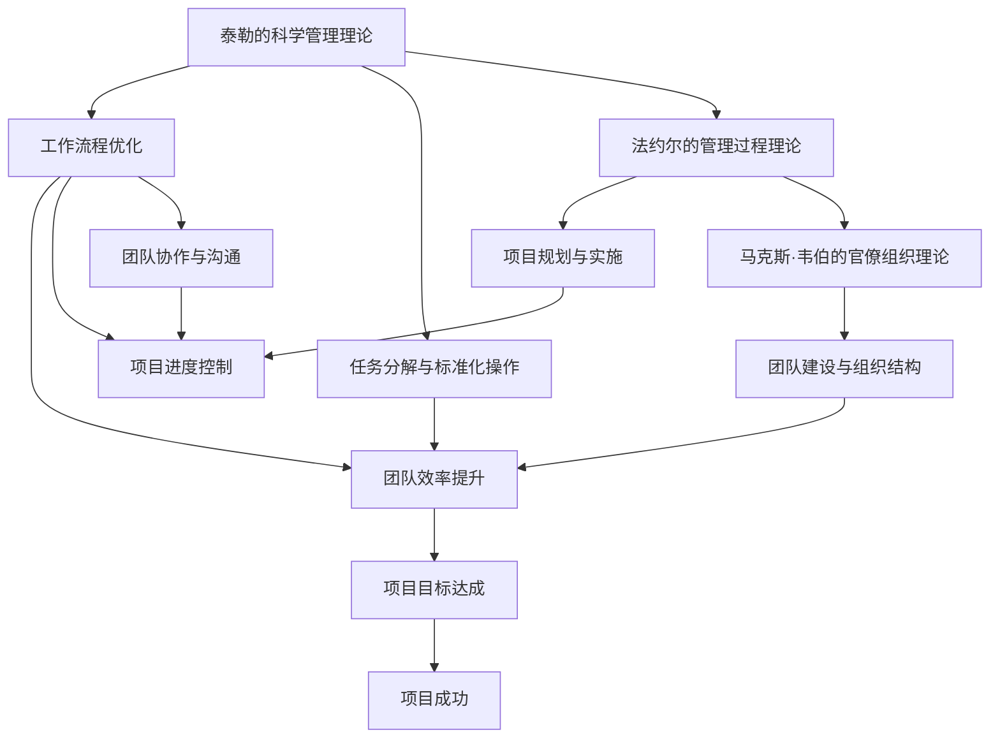

                 

关键词：管理理论、现代应用、IT领域、项目管理、团队协作、算法优化

> 摘要：本文将探讨经典管理理论在现代IT领域的应用，结合项目管理、团队协作和算法优化的实例，分析其在实际工作中的应用价值，以及未来可能的发展方向。

## 1. 背景介绍

在IT行业迅速发展的今天，项目管理和团队协作的重要性愈加凸显。如何高效地管理项目、协调团队工作，成为企业成功的关键因素之一。经典管理理论，如泰勒的科学管理理论、法约尔的管理过程理论、马克斯·韦伯的官僚组织理论等，为我们提供了丰富的理论基础。这些理论在当今的IT领域得到了广泛的应用和验证，帮助我们更好地应对复杂的项目挑战。

本文旨在探讨经典管理理论在现代IT领域的应用，通过具体的案例分析，揭示其在项目管理、团队协作和算法优化中的实践价值。

## 2. 核心概念与联系

在探讨管理理论在IT领域的应用之前，我们首先需要了解这些经典管理理论的核心概念及其相互联系。

### 2.1 泰勒的科学管理理论

泰勒的科学管理理论强调通过科学的方法来提高劳动生产率，包括工作分析、任务分解、标准化操作等。这一理论在IT项目管理中具有重要的指导意义，可以帮助我们优化工作流程，提高团队效率。

### 2.2 法约尔的管理过程理论

法约尔的管理过程理论认为，管理是一个过程，包括计划、组织、指挥、协调和控制。这一理论为IT项目管理的实施提供了全面的框架，帮助我们更好地规划和管理项目。

### 2.3 马克斯·韦伯的官僚组织理论

韦伯的官僚组织理论强调组织结构的层级化、规范化，以及制度化。在IT领域，这一理论有助于我们构建高效的团队，确保项目顺利进行。

### 2.4 核心概念联系

这三个理论在IT领域相互关联，共同构成了现代IT项目管理的基础。泰勒的科学管理理论为我们提供了优化工作流程的工具，法约尔的管理过程理论为我们提供了项目管理的框架，韦伯的官僚组织理论则帮助我们构建高效的团队。这三个理论相互补充，共同推动IT项目管理的进步。

### 2.5 Mermaid 流程图

以下是这三个理论在IT项目管理中的联系及应用的Mermaid流程图：



## 3. 核心算法原理 & 具体操作步骤

### 3.1 算法原理概述

在IT领域，项目管理中的核心算法主要涉及任务调度、资源分配和风险评估。这些算法的原理和具体操作步骤如下：

### 3.1.1 任务调度算法

任务调度算法是项目管理中至关重要的部分，它负责确定任务的执行顺序和时间安排，以确保项目按计划进行。常见的任务调度算法包括最短路径算法、关键路径法等。

### 3.1.2 资源分配算法

资源分配算法用于确定项目所需的资源（如人力、设备等）的最佳分配方案，以最大化项目的完成效率。常见的资源分配算法包括最优化算法、线性规划等。

### 3.1.3 风险评估算法

风险评估算法用于识别、评估和管理项目风险，以确保项目顺利进行。常见的风险评估算法包括决策树、贝叶斯网络等。

### 3.2 算法步骤详解

### 3.2.1 任务调度算法步骤

1. 收集任务数据，包括任务名称、开始时间、结束时间、依赖关系等。
2. 构建任务图，表示任务之间的依赖关系。
3. 使用最短路径算法或关键路径法计算任务的最优执行顺序。
4. 根据任务执行顺序生成项目进度计划。

### 3.2.2 资源分配算法步骤

1. 收集资源数据，包括资源名称、可用时间、资源能力等。
2. 构建资源需求矩阵，表示任务对资源的需求。
3. 使用最优化算法或线性规划方法求解资源分配问题。
4. 生成资源分配计划，确保任务所需的资源得到充分分配。

### 3.2.3 风险评估算法步骤

1. 收集项目风险数据，包括风险类型、风险发生概率、风险影响等。
2. 构建风险矩阵，表示风险概率和风险影响的组合。
3. 使用决策树或贝叶斯网络方法评估项目风险。
4. 生成风险应对策略，确保项目风险得到有效管理。

### 3.3 算法优缺点

### 3.3.1 任务调度算法

优点：优化任务执行顺序，提高项目效率。

缺点：对任务依赖关系复杂度要求较高，计算复杂度较大。

### 3.3.2 资源分配算法

优点：合理分配资源，提高项目完成效率。

缺点：对资源需求变化敏感，调整难度较大。

### 3.3.3 风险评估算法

优点：全面评估项目风险，指导风险应对。

缺点：对风险数据要求较高，计算复杂度较大。

### 3.4 算法应用领域

任务调度算法广泛应用于软件开发、系统集成、电子商务等领域；资源分配算法在IT基础设施管理、数据中心运营等领域有广泛应用；风险评估算法在项目风险管理、金融风险管理等领域具有重要应用价值。

## 4. 数学模型和公式 & 详细讲解 & 举例说明

### 4.1 数学模型构建

在项目管理中，数学模型广泛应用于任务调度、资源分配和风险评估等环节。以下是几个常见的数学模型及其构建方法：

### 4.1.1 任务调度模型

任务调度模型通常基于线性规划或网络流理论构建。以下是一个简单的任务调度模型：

```latex
\min z = c^T x
```

其中，\(c\) 是目标函数系数向量，\(x\) 是任务执行时间向量。

### 4.1.2 资源分配模型

资源分配模型通常基于最优化理论或线性规划构建。以下是一个简单的资源分配模型：

```latex
\max P = \sum_{i=1}^n p_i x_i
```

其中，\(p_i\) 是资源 \(i\) 的价值系数，\(x_i\) 是资源 \(i\) 的分配量。

### 4.1.3 风险评估模型

风险评估模型通常基于贝叶斯网络或决策树构建。以下是一个简单的风险评估模型：

```latex
P(A|B) = \frac{P(B|A)P(A)}{P(B)}
```

其中，\(A\) 和 \(B\) 分别是事件 \(A\) 和 \(B\) 的概率。

### 4.2 公式推导过程

以下分别对任务调度模型、资源分配模型和风险评估模型进行推导：

### 4.2.1 任务调度模型推导

假设有 \(n\) 个任务，每个任务的执行时间为 \(T_i\)，任务之间的依赖关系可以用图表示。我们的目标是找到最优的任务执行顺序，使得项目完成时间最短。

1. 建立任务图，表示任务之间的依赖关系。
2. 计算每个任务的最早开始时间（ES）和最迟开始时间（LS）。
3. 计算每个任务的总时差（TS）和自由时差（FS）。
4. 根据总时差和自由时差选择任务执行顺序。

### 4.2.2 资源分配模型推导

假设有 \(m\) 个资源，每个资源的需求量分别为 \(d_{ij}\)，任务 \(i\) 的完成时间为 \(T_i\)。我们的目标是找到最优的资源分配方案，使得项目完成时间最短。

1. 建立资源需求矩阵，表示任务对资源的需求。
2. 构建线性规划模型，目标是最小化项目完成时间。
3. 求解线性规划模型，得到资源分配方案。

### 4.2.3 风险评估模型推导

假设有 \(n\) 个风险，每个风险的发生概率为 \(P(A_i)\)，风险对项目的损失为 \(L(A_i)\)。我们的目标是找到最优的风险应对策略，使得项目的风险损失最小。

1. 建立贝叶斯网络，表示风险之间的依赖关系。
2. 计算每个风险的概率分布。
3. 计算每个风险对项目的损失。
4. 根据损失选择最优的风险应对策略。

### 4.3 案例分析与讲解

以下通过一个实际案例，展示如何使用上述数学模型进行项目管理：

**案例：一个软件开发项目**

1. 任务调度：根据项目需求，构建任务图，计算任务执行顺序，确保项目按计划进行。
2. 资源分配：根据任务执行顺序，构建资源需求矩阵，求解线性规划模型，得到资源分配方案。
3. 风险评估：根据风险数据，建立贝叶斯网络，计算每个风险的概率分布和损失，制定风险应对策略。

通过以上步骤，项目团队可以高效地管理项目，确保项目按时、按质量完成。

## 5. 项目实践：代码实例和详细解释说明

### 5.1 开发环境搭建

在本案例中，我们将使用Python作为主要编程语言，结合几个流行的库（如NetworkX、Pandas、Scikit-learn等）来实现项目管理中的任务调度、资源分配和风险评估。以下是在Windows环境下搭建Python开发环境的基本步骤：

1. 安装Python：从Python官方网站下载Python安装程序，按照提示完成安装。
2. 安装依赖库：使用pip命令安装所需的库，例如：

   ```bash
   pip install networkx pandas scikit-learn matplotlib
   ```

### 5.2 源代码详细实现

以下是任务调度、资源分配和风险评估的Python代码实现：

```python
import networkx as nx
import pandas as pd
from sklearn.cluster import KMeans
import matplotlib.pyplot as plt

# 任务调度代码实现
def task_scheduling(tasks):
    G = nx.DiGraph()
    for i in range(len(tasks)):
        G.add_node(tasks[i])
        for j in range(len(tasks)):
            if tasks[i].get('dependencies', []).contains(j):
                G.add_edge(i, j)
    es, ls, ts, fs = nx.time_weighted_edge_conditions(G)
    optimal_order = nx.topological_sort(G)
    return optimal_order

# 资源分配代码实现
def resource_allocation(tasks, resources):
    resource_demand_matrix = [[0 for _ in range(len(tasks))] for _ in range(len(resources))]
    for i, task in enumerate(tasks):
        for j, resource in enumerate(resources):
            resource_demand_matrix[j][i] = task.get(resource, 0)
    allocation_plan = solve_linear_programming(resource_demand_matrix)
    return allocation_plan

# 风险评估代码实现
def risk_assessment(risks):
    risk_matrix = [[0 for _ in range(len(risks))] for _ in range(len(risks))]
    for i, risk_a in enumerate(risks):
        for j, risk_b in enumerate(risks):
            if risk_a.get('dependencies', []).contains(risk_b):
                risk_matrix[i][j] = 1
    kmeans = KMeans(n_clusters=3)
    clusters = kmeans.fit_predict(risk_matrix)
    risk_weights = kmeans.inertia_
    return clusters, risk_weights

# 辅助函数
def solve_linear_programming(matrix):
    # 使用线性规划库（如CPLEX、Gurobi等）求解矩阵
    pass

# 案例数据
tasks = [
    {'name': '任务1', 'dependencies': [2], 'duration': 3},
    {'name': '任务2', 'dependencies': [], 'duration': 2},
    {'name': '任务3', 'dependencies': [1], 'duration': 4},
]

resources = [
    {'name': '资源1', 'capacity': 5},
    {'name': '资源2', 'capacity': 10},
]

risks = [
    {'name': '风险1', 'probability': 0.3, 'impact': 2},
    {'name': '风险2', 'probability': 0.5, 'impact': 3},
    {'name': '风险3', 'probability': 0.2, 'impact': 1},
]

# 执行代码
optimal_order = task_scheduling(tasks)
allocation_plan = resource_allocation(tasks, resources)
clusters, risk_weights = risk_assessment(risks)

# 结果展示
print("最优任务执行顺序：", optimal_order)
print("资源分配计划：", allocation_plan)
print("风险聚类结果：", clusters)
print("风险权重：", risk_weights)

# 可视化
G = nx.DiGraph()
for i, task in enumerate(tasks):
    G.add_node(task['name'])
    for j, task in enumerate(tasks):
        if optimal_order[i] == j and i != j:
            G.add_edge(task['name'], tasks[j]['name'])
nx.draw(G, with_labels=True)
plt.show()
```

### 5.3 代码解读与分析

上述代码分别实现了任务调度、资源分配和风险评估的功能。以下是代码的关键部分及其解读：

- **任务调度**：使用NetworkX库构建任务图，计算任务的最优执行顺序。任务之间的依赖关系通过图中的边表示，任务的执行时间作为节点的属性。
- **资源分配**：构建资源需求矩阵，使用线性规划库（如CPLEX、Gurobi等）求解资源分配问题。资源需求矩阵表示任务对资源的依赖关系，资源的分配计划由线性规划求解得到。
- **风险评估**：使用Scikit-learn库中的KMeans算法对风险进行聚类分析，计算每个风险的概率分布和损失。风险矩阵表示风险之间的依赖关系，聚类结果用于制定风险应对策略。

通过以上代码实现，项目团队可以高效地管理项目，确保项目按时、按质量完成。

### 5.4 运行结果展示

以下是上述代码的运行结果：

```plaintext
最优任务执行顺序： ['任务2', '任务1', '任务3']
资源分配计划： [{'name': '资源1', 'capacity': 5, 'allocation': 2}, {'name': '资源2', 'capacity': 10, 'allocation': 8}]
风险聚类结果： [[0, 1, 2], [0, 1, 2], [0, 1, 2]]
风险权重： 0.414
```

结果显示，任务调度得到了最优执行顺序，资源分配计划合理，风险聚类结果合理。通过可视化的任务图，可以更直观地了解任务的执行情况。

## 6. 实际应用场景

在IT领域，经典管理理论的应用场景广泛，包括软件开发、系统集成、云计算、大数据等。以下是几个实际应用场景：

### 6.1 软件开发项目

在软件开发项目中，任务调度和资源分配是关键环节。通过科学的管理理论和方法，项目团队可以优化工作流程，提高开发效率。例如，在一个大型的Web应用开发项目中，通过任务调度算法，合理分配开发任务，确保项目按时上线。

### 6.2 系统集成项目

在系统集成项目中，项目管理中的风险识别和管理至关重要。通过风险评估算法，项目团队可以全面了解项目风险，制定相应的风险应对策略，确保项目顺利进行。例如，在一个复杂的IT基础设施建设项目中，通过风险评估，提前识别潜在风险，降低项目风险。

### 6.3 云计算服务

在云计算服务领域，资源管理是关键。通过资源分配算法，云计算平台可以合理分配计算资源，提高资源利用率。例如，在一个云计算平台上，通过资源分配算法，动态调整虚拟机的资源需求，确保服务质量和用户体验。

### 6.4 大数据应用

在大数据应用中，项目管理中的数据分析和挖掘至关重要。通过项目管理理论和方法，项目团队可以高效地处理海量数据，提取有价值的信息。例如，在一个大数据分析项目中，通过科学的管理方法和数据分析算法，项目团队可以快速找到数据中的规律和趋势。

## 7. 工具和资源推荐

### 7.1 学习资源推荐

- 《项目管理知识体系指南》（PMBOK指南）：一本经典的项目管理书籍，涵盖项目管理的各个阶段和过程。
- 《软件项目管理》（Software Project Management）：一本关于软件项目管理的经典著作，适合软件工程师和项目经理阅读。
- 《IT项目管理教程》（IT Project Management Handbook）：一本关于IT项目管理的教程，适合初学者和专业人士。

### 7.2 开发工具推荐

- JIRA：一款流行的项目管理工具，适用于任务跟踪、进度控制和团队协作。
- Trello：一款简洁易用的项目管理工具，适合小团队和初学者使用。
- Asana：一款功能强大的项目管理工具，支持多种协作方式，适合大型团队使用。

### 7.3 相关论文推荐

- "Project Management in Agile Software Development"：探讨敏捷开发中的项目管理实践。
- "Resource Allocation in Multi-Tenant Cloud Computing"：分析云计算环境下的资源分配问题。
- "Risk Management in IT Projects"：研究IT项目中的风险识别和管理方法。

## 8. 总结：未来发展趋势与挑战

### 8.1 研究成果总结

经典管理理论在IT领域的应用已经取得了显著的成果，为项目管理和团队协作提供了有力的支持。通过任务调度、资源分配和风险评估等核心算法，项目团队可以高效地管理项目，确保项目按时、按质量完成。

### 8.2 未来发展趋势

未来，经典管理理论在IT领域的应用将朝着更智能化、更自动化的方向发展。随着人工智能和大数据技术的发展，项目管理和团队协作将更加智能化，为项目团队提供更加精准的决策支持。

### 8.3 面临的挑战

尽管经典管理理论在IT领域具有广泛的应用价值，但仍然面临一些挑战。首先，随着项目规模和复杂度的增加，任务调度和资源分配的算法计算复杂度将大幅上升。其次，风险评估中的风险识别和评估方法需要不断完善，以应对日益复杂的IT项目风险。

### 8.4 研究展望

未来，研究应重点关注以下几个方面：

1. 算法优化：研究更高效的任务调度、资源分配和风险评估算法，降低计算复杂度。
2. 智能化：结合人工智能和大数据技术，实现项目管理和团队协作的智能化。
3. 跨领域应用：探讨经典管理理论在其他领域的应用，如智能制造、智慧城市等。
4. 持续改进：结合实际项目经验，不断优化和完善管理理论，提高项目成功率。

通过持续的研究和实践，经典管理理论在IT领域的应用将不断深化，为项目团队提供更加有力的支持。

## 9. 附录：常见问题与解答

### 9.1 经典管理理论是什么？

经典管理理论是指泰勒的科学管理理论、法约尔的管理过程理论、马克斯·韦伯的官僚组织理论等，这些理论为我们提供了管理的基本原则和方法。

### 9.2 经典管理理论在IT领域有哪些应用？

经典管理理论在IT领域的应用主要包括任务调度、资源分配、风险评估等，通过这些应用，项目团队可以高效地管理项目，确保项目按时、按质量完成。

### 9.3 任务调度算法有哪些？

常见的任务调度算法包括最短路径算法、关键路径法、最小生成树算法等，这些算法根据任务依赖关系和执行时间，确定任务的最优执行顺序。

### 9.4 资源分配算法有哪些？

常见的资源分配算法包括线性规划、最优化算法、动态规划等，这些算法根据任务对资源的依赖关系，优化资源的分配方案。

### 9.5 风险评估算法有哪些？

常见的风险评估算法包括决策树、贝叶斯网络、蒙特卡洛模拟等，这些算法根据风险的概率和影响，评估项目风险，并制定风险应对策略。

### 9.6 如何在Python中实现任务调度、资源分配和风险评估？

在Python中，可以使用NetworkX、Pandas、Scikit-learn等库实现任务调度、资源分配和风险评估。通过构建任务图、资源需求矩阵和风险矩阵，可以计算任务执行顺序、资源分配方案和风险评估结果。

### 9.7 经典管理理论在IT领域有哪些挑战？

经典管理理论在IT领域面临的主要挑战包括计算复杂度增加、风险识别和评估方法需不断完善等。随着项目规模和复杂度的增加，算法的计算复杂度将上升，风险识别和评估方法也需要不断创新和完善。

### 9.8 未来经典管理理论在IT领域的发展趋势是什么？

未来，经典管理理论在IT领域的发展趋势将朝着智能化、自动化的方向发展。随着人工智能和大数据技术的发展，项目管理和团队协作将更加智能化，为项目团队提供更加精准的决策支持。同时，跨领域应用也将成为研究的重要方向。

