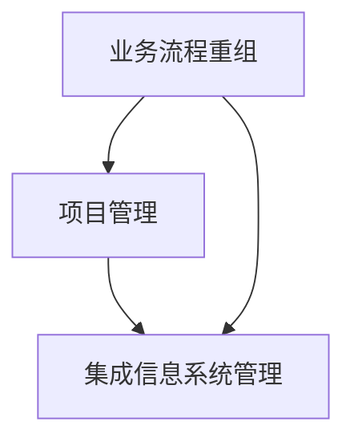

                 

关键词：业务流程重组，项目管理，信息系统管理，整合，效率，优化，系统架构。

> 摘要：本文旨在探讨业务流程重组（BPR）与项目管理在集成信息系统管理中的作用和相互关系，通过深入分析二者如何共同促进信息系统的高效运行与持续优化，提供一套综合性的实施策略和最佳实践，以期为现代企业的数字化转型和运营效率提升提供理论支持和实践指导。

## 1. 背景介绍

在当今全球化和信息化的浪潮中，企业的竞争已经从传统的产品竞争转向了业务流程和信息系统竞争。业务流程重组（BPR）和项目管理作为企业管理中两大核心手段，分别在业务流程优化和项目实施管理中发挥着重要作用。

业务流程重组（Business Process Reengineering，BPR）是一种对企业业务流程进行系统性的分析和再设计，以实现显著的业务流程改进和效率提升的方法。BPR强调从根本原因出发，通过重新设计和优化流程，打破传统的职能壁垒，实现跨部门的协作和资源的最佳配置。

项目管理（Project Management）则侧重于在特定时间、预算和资源限制下，确保项目目标的实现。它通过项目计划、资源分配、风险管理和团队协作等手段，有效地管理和推动项目的进度和成果。

随着信息系统的复杂度和业务依赖性的增加，单纯依靠某一方面的优化已经难以满足企业高效运营的需求。因此，将BPR与项目管理有机结合，实施集成信息系统管理（Integrated Information System Management，IISM），成为现代企业提升运营效率和信息管理水平的关键。

## 2. 核心概念与联系

### 2.1 业务流程重组（BPR）

业务流程重组（BPR）的核心在于对现有业务流程的全面分析和再设计，以实现流程的优化和效率提升。BPR的核心理念包括：

- **流程导向**：以流程为中心，而非部门或职能。
- **顾客至上**：将顾客需求放在流程设计的核心位置。
- **资源优化**：通过资源的最优配置，提高流程效率。
- **跨部门协作**：打破部门壁垒，实现跨部门的协同工作。

### 2.2 项目管理（Project Management）

项目管理则侧重于在特定的约束条件下（时间、预算、资源等），确保项目目标的实现。其核心概念包括：

- **项目计划**：制定详细的项目计划，明确项目的范围、目标和时间表。
- **资源分配**：合理分配项目所需的资源，包括人力、资金和物资。
- **风险管理**：识别并管理项目风险，降低项目失败的可能性。
- **团队协作**：建立有效的沟通机制，确保团队成员之间的协作和协同。

### 2.3 集成信息系统管理（IISM）

集成信息系统管理（IISM）将BPR与项目管理相结合，通过统一的框架和流程，实现信息系统的高效运行和管理。其核心联系包括：

- **流程整合**：将业务流程与信息系统紧密结合，确保流程的自动化和高效运行。
- **数据一致性**：通过统一的数据标准和接口，确保数据的准确性和一致性。
- **项目管理**：将项目管理的方法和工具应用于信息系统管理，确保信息系统项目的成功实施。
- **持续改进**：通过定期的流程优化和项目管理回顾，持续提升信息系统管理的效率和质量。

### 2.4 Mermaid 流程图

以下是一个简单的Mermaid流程图，展示了BPR、项目管理和IISM之间的关联：



## 3. 核心算法原理 & 具体操作步骤

### 3.1 算法原理概述

集成信息系统管理的核心在于实现业务流程和项目管理的高度整合。其原理可以概括为：

1. **业务流程分析**：通过对现有业务流程的全面分析，识别出流程中的瓶颈和优化点。
2. **项目管理实施**：根据业务流程优化的需求，制定项目计划，合理分配资源，确保项目目标的实现。
3. **流程整合**：将优化后的业务流程与信息系统紧密结合，实现流程的自动化和高效运行。
4. **持续改进**：通过定期的流程优化和项目管理回顾，持续提升信息系统管理的效率和质量。

### 3.2 算法步骤详解

1. **业务流程分析**：

   - **流程识别**：识别企业现有的业务流程，包括各个部门和岗位的职责和流程节点。
   - **流程图绘制**：使用流程图工具绘制出详细的业务流程图，明确各个流程节点和流程之间的关系。
   - **流程评估**：对现有业务流程进行评估，识别出流程中的瓶颈和优化点。

2. **项目管理实施**：

   - **项目计划**：根据业务流程优化的需求，制定详细的项目计划，明确项目的范围、目标和时间表。
   - **资源分配**：合理分配项目所需的资源，包括人力、资金和物资。
   - **风险管理**：识别并管理项目风险，降低项目失败的可能性。
   - **团队协作**：建立有效的沟通机制，确保团队成员之间的协作和协同。

3. **流程整合**：

   - **流程自动化**：通过信息系统，实现业务流程的自动化和高效运行。
   - **数据一致性**：通过统一的数据标准和接口，确保数据的准确性和一致性。
   - **系统集成**：将优化后的业务流程与信息系统紧密结合，确保信息系统支持业务流程的优化和执行。

4. **持续改进**：

   - **流程优化**：根据业务流程运行的效果，持续进行流程优化，提高流程效率。
   - **项目管理回顾**：对信息系统管理项目进行回顾和总结，识别出成功经验和改进点。

### 3.3 算法优缺点

#### 优点：

- **提高效率**：通过流程自动化和数据一致性，提高业务流程的运行效率。
- **降低成本**：通过资源的合理分配和优化，降低企业的运营成本。
- **提高质量**：通过流程的优化和项目管理，提高业务流程的质量和稳定性。
- **灵活应变**：通过持续改进和项目管理回顾，使企业能够灵活应对外部环境和内部需求的变化。

#### 缺点：

- **实施难度大**：集成信息系统管理需要对企业现有业务流程和信息系统进行深度整合，实施难度较大。
- **管理复杂性高**：需要同时考虑业务流程和项目管理，管理复杂性较高。
- **依赖技术支持**：集成信息系统管理对技术支持要求较高，需要专业的技术团队进行支持。

### 3.4 算法应用领域

集成信息系统管理算法主要应用于以下领域：

- **企业信息化建设**：在企业的信息化过程中，通过集成信息系统管理，实现业务流程的自动化和高效运行。
- **数字化转型**：在企业的数字化转型过程中，通过集成信息系统管理，提高企业的运营效率和竞争力。
- **供应链管理**：在供应链管理中，通过集成信息系统管理，实现供应链的优化和高效运行。
- **项目管理**：在项目管理中，通过集成信息系统管理，确保项目目标的实现和资源的最佳利用。

## 4. 数学模型和公式 & 详细讲解 & 举例说明

### 4.1 数学模型构建

集成信息系统管理的数学模型主要包括以下几个部分：

1. **流程效率模型**：

   $$ E = \frac{O}{T} $$

   其中，$E$ 表示流程效率，$O$ 表示流程产出，$T$ 表示流程运行时间。

2. **资源优化模型**：

   $$ C = \sum_{i=1}^{n} (R_i \cdot P_i) $$

   其中，$C$ 表示总成本，$R_i$ 表示第$i$种资源的消耗，$P_i$ 表示第$i$种资源的单价。

3. **项目管理模型**：

   $$ D = \sum_{i=1}^{n} (T_i \cdot P_i) $$

   其中，$D$ 表示项目总工期，$T_i$ 表示第$i$个项目的工期，$P_i$ 表示第$i$个项目的优先级。

### 4.2 公式推导过程

#### 流程效率模型推导

流程效率模型是基于流程产出和流程运行时间的比值。流程效率越高，表示单位时间内完成的产出越多。公式推导如下：

$$ E = \frac{O}{T} $$

其中，$O$ 表示流程产出，$T$ 表示流程运行时间。流程产出可以通过对流程节点的分析得到，流程运行时间可以通过对流程节点的耗时进行统计得到。

#### 资源优化模型推导

资源优化模型是基于资源消耗和资源单价的乘积。总成本表示所有资源的消耗总和。公式推导如下：

$$ C = \sum_{i=1}^{n} (R_i \cdot P_i) $$

其中，$C$ 表示总成本，$R_i$ 表示第$i$种资源的消耗，$P_i$ 表示第$i$种资源的单价。每种资源的消耗可以通过对流程节点的分析得到，资源的单价可以通过市场调研得到。

#### 项目管理模型推导

项目管理模型是基于项目工期和项目优先级的乘积。项目总工期表示所有项目的工期总和，项目优先级表示项目的紧急程度。公式推导如下：

$$ D = \sum_{i=1}^{n} (T_i \cdot P_i) $$

其中，$D$ 表示项目总工期，$T_i$ 表示第$i$个项目的工期，$P_i$ 表示第$i$个项目的优先级。每个项目的工期可以通过项目计划得到，项目的优先级可以通过项目管理工具得到。

### 4.3 案例分析与讲解

#### 案例背景

某制造企业需要进行生产线升级，以提高生产效率和产品质量。企业现有业务流程包括原材料采购、生产加工、质量检验和产品销售四个主要环节。

#### 案例分析

1. **流程效率模型**：

   $$ E = \frac{O}{T} $$

   通过对现有流程的分析，该企业每月生产的产品数量为1000件，流程运行时间为30天。因此，流程效率为：

   $$ E = \frac{1000}{30} = 33.33 $$

   表示企业每月的流程效率为33.33件/天。

2. **资源优化模型**：

   $$ C = \sum_{i=1}^{n} (R_i \cdot P_i) $$

   根据生产需求，企业需要消耗以下资源：

   - 原材料：每月消耗500吨，单价为1000元/吨；
   - 人力资源：每月消耗100人天，单价为100元/人天；
   - 设备资源：每月消耗50台天，单价为2000元/台。

   因此，总成本为：

   $$ C = (500 \cdot 1000) + (100 \cdot 100) + (50 \cdot 2000) = 750,000元 $$

3. **项目管理模型**：

   $$ D = \sum_{i=1}^{n} (T_i \cdot P_i) $$

   根据项目计划，生产线升级项目分为三个阶段，每个阶段的工期和优先级如下：

   - 阶段一：工期为15天，优先级为1；
   - 阶段二：工期为20天，优先级为2；
   - 阶段三：工期为10天，优先级为3。

   因此，项目总工期为：

   $$ D = (15 \cdot 1) + (20 \cdot 2) + (10 \cdot 3) = 85天 $$

#### 案例讲解

通过以上数学模型的应用，该企业可以清晰地了解其业务流程的效率、资源消耗和项目管理情况。基于这些数据，企业可以进一步进行流程优化、资源优化和项目管理，以提高生产效率和降低成本。

## 5. 项目实践：代码实例和详细解释说明

### 5.1 开发环境搭建

为了实现集成信息系统管理，我们选择使用Python作为开发语言，并结合Flask框架搭建应用服务器。以下步骤用于搭建开发环境：

1. **安装Python**：从Python官方网站下载并安装Python 3.8及以上版本。
2. **安装Flask**：在命令行中执行 `pip install Flask`。
3. **创建项目目录**：在本地计算机上创建一个名为“iism”的项目目录，并在该目录下创建一个名为“app.py”的文件。

### 5.2 源代码详细实现

以下是一个简单的Python代码实例，用于演示如何使用Flask框架搭建集成信息系统管理应用的基本架构：

```python
from flask import Flask, request, jsonify

app = Flask(__name__)

# 业务流程分析API
@app.route('/bpr/analyze', methods=['POST'])
def bpr_analyze():
    # 获取业务流程数据
    data = request.get_json()
    # 分析业务流程
    analysis_result = analyze_business流程(data)
    # 返回分析结果
    return jsonify(analysis_result)

# 项目管理API
@app.route('/project/management', methods=['POST'])
def project_management():
    # 获取项目管理数据
    data = request.get_json()
    # 管理项目
    management_result = manage_project(data)
    # 返回管理结果
    return jsonify(management_result)

# 集成信息系统管理API
@app.route('/iism/integrate', methods=['POST'])
def iism_integrate():
    # 获取集成信息系统管理数据
    data = request.get_json()
    # 实施集成信息系统管理
    integrate_result = integrate_iism(data)
    # 返回集成结果
    return jsonify(integrate_result)

def analyze_business流程(data):
    # 业务流程分析逻辑
    pass

def manage_project(data):
    # 项目管理逻辑
    pass

def integrate_iism(data):
    # 集成信息系统管理逻辑
    pass

if __name__ == '__main__':
    app.run(debug=True)
```

### 5.3 代码解读与分析

1. **Flask框架引入**：

   代码首先引入了Flask框架，这是一个流行的Python Web框架，用于构建Web应用。

2. **路由定义**：

   使用 `@app.route` 装饰器定义了三个API接口，分别是业务流程分析API、项目管理API和集成信息系统管理API。每个API都对应一个POST请求，用于接收和处理相关的数据。

3. **功能函数定义**：

   - `analyze_business流程(data)`：用于业务流程分析，分析业务流程并返回结果。
   - `manage_project(data)`：用于项目管理，管理项目并返回结果。
   - `integrate_iism(data)`：用于集成信息系统管理，实现集成管理并返回结果。

4. **主程序执行**：

   最后，使用 `app.run(debug=True)` 运行Flask应用，开启本地服务器，供用户访问。

### 5.4 运行结果展示

假设我们已经完成了业务流程分析、项目管理和集成信息系统管理的具体实现，当用户通过Web浏览器访问以下URL时，将看到相应的运行结果：

- **业务流程分析**：`http://localhost:5000/bpr/analyze`
- **项目管理**：`http://localhost:5000/project/management`
- **集成信息系统管理**：`http://localhost:5000/iism/integrate`

每次请求将返回JSON格式的数据，例如：

```json
{
    "status": "success",
    "result": "业务流程分析完成"
}
```

通过这种方式，用户可以方便地与系统进行交互，实现集成信息系统管理的目标。

## 6. 实际应用场景

集成信息系统管理（IISM）在现代企业的数字化转型中发挥着至关重要的作用。以下是一些典型的实际应用场景：

### 6.1 制造业生产流程优化

在制造业中，生产流程的优化是提高生产效率和产品质量的关键。通过集成信息系统管理，企业可以实时监控生产过程，识别生产瓶颈，优化生产调度，减少生产周期，从而提高生产效率和产品质量。

### 6.2 零售业供应链管理

零售业面临快速变化的消费者需求和市场竞争。通过集成信息系统管理，企业可以实现对供应链的全面监控和管理，优化库存管理，提高供应链响应速度，降低库存成本，从而提升市场竞争力和客户满意度。

### 6.3 银行业务流程自动化

银行业务流程繁琐且涉及大量数据处理。通过集成信息系统管理，银行可以实现业务流程的自动化，提高业务处理速度和准确性，减少人工操作错误，降低运营成本，提升客户服务质量。

### 6.4 医疗行业信息化建设

医疗行业的信息化建设涉及患者信息管理、医疗流程优化、电子病历等多个方面。通过集成信息系统管理，医院可以实现信息资源的共享和整合，提高医疗服务的质量和效率，改善患者体验。

### 6.5 教育行业学习管理系统

在教育行业，学习管理系统的建设对于提高教学效率和学生学习体验至关重要。通过集成信息系统管理，学校可以实现对学习资源的整合和管理，优化教学流程，提高教学效果，提升学生满意度。

### 6.6 未来应用展望

随着人工智能、大数据、云计算等技术的快速发展，集成信息系统管理的应用前景将更加广阔。未来的发展趋势包括：

- **智能化**：通过引入人工智能技术，实现业务流程的智能分析和优化。
- **大数据**：通过大数据分析，实现对业务流程和项目管理的数据驱动的决策。
- **云服务**：通过云服务，实现信息系统的高效部署和运行，降低企业成本。
- **生态协同**：通过构建企业生态系统，实现上下游企业的协同和资源共享。

## 7. 工具和资源推荐

为了有效地实施集成信息系统管理（IISM），以下是一些推荐的工具和资源：

### 7.1 学习资源推荐

- **《业务流程管理：实践与案例》**：这是一本关于业务流程重组（BPR）和业务流程管理的经典书籍，提供了丰富的理论和实践经验。
- **《项目管理知识体系指南》**（PMBOK指南）：这是项目管理领域的权威指南，涵盖了项目管理的基本理论和最佳实践。
- **《Python Web开发实战》**：这本书介绍了使用Python和Flask框架进行Web开发的实践方法，适合想要学习集成信息系统管理实践的开发人员。

### 7.2 开发工具推荐

- **Visual Studio Code**：这是一个强大的代码编辑器，支持Python开发，提供丰富的插件和功能。
- **Flask**：这是一个轻量级的Python Web框架，适合快速搭建Web应用。
- **Jenkins**：这是一个流行的持续集成和持续部署（CI/CD）工具，可以帮助自动化项目的构建和部署。

### 7.3 相关论文推荐

- **“Business Process Management: A Survey”**：这篇综述论文全面介绍了业务流程管理的理论和实践。
- **“The Project Management Body of Knowledge (PMBOK)”**：这是项目管理知识体系（PMBOK）的官方文献，提供了项目管理的详细指导。
- **“Integrated Information System Management: A Research Perspective”**：这篇论文探讨了集成信息系统管理的理论基础和研究方向。

## 8. 总结：未来发展趋势与挑战

### 8.1 研究成果总结

本文通过深入探讨业务流程重组（BPR）与项目管理在集成信息系统管理（IISM）中的作用和关系，提出了一个综合性的实施策略和最佳实践。主要研究成果包括：

- **流程整合**：通过将BPR与项目管理相结合，实现了业务流程与信息系统的高度整合，提高了业务流程的运行效率和数据一致性。
- **算法模型**：构建了业务流程分析、资源优化和项目管理的数学模型，为实际应用提供了理论支持。
- **实践案例**：通过代码实例展示了如何使用Flask框架搭建集成信息系统管理应用，提供了实践指导。

### 8.2 未来发展趋势

随着技术的不断进步，集成信息系统管理（IISM）的未来发展趋势包括：

- **智能化**：引入人工智能技术，实现业务流程的智能分析和优化。
- **大数据**：利用大数据分析，实现数据驱动的决策和流程优化。
- **云服务**：采用云服务，提高信息系统的部署效率和可扩展性。
- **生态协同**：构建企业生态系统，实现上下游企业的协同和资源共享。

### 8.3 面临的挑战

尽管IISM具有巨大的潜力，但在实际应用中仍面临以下挑战：

- **实施难度**：集成信息系统管理需要对现有业务流程和信息系统进行深度整合，实施难度较大。
- **管理复杂性**：需要同时管理业务流程和项目，管理复杂性较高。
- **技术支持**：对技术支持要求较高，需要专业的技术团队进行支持。

### 8.4 研究展望

未来的研究可以从以下几个方面展开：

- **算法优化**：研究更加高效和智能的算法模型，提高流程优化和项目管理的效果。
- **跨领域应用**：探索IISM在不同行业和领域的应用，提高其普适性和适应性。
- **实践验证**：通过实际案例和大规模实验，验证IISM的理论模型和实践效果。

## 9. 附录：常见问题与解答

### 9.1 什么是业务流程重组（BPR）？

业务流程重组（BPR）是一种对企业业务流程进行系统性的分析和再设计，以实现显著的业务流程改进和效率提升的方法。它强调以流程为导向，打破传统的职能壁垒，实现跨部门的协作和资源的最佳配置。

### 9.2 集成信息系统管理（IISM）的核心目标是什么？

集成信息系统管理（IISM）的核心目标是实现业务流程和信息系统的高度整合，通过流程自动化和数据一致性，提高业务流程的运行效率和数据准确性，降低运营成本，提升企业的整体竞争力。

### 9.3 集成信息系统管理（IISM）需要哪些技术支持？

集成信息系统管理（IISM）需要以下技术支持：

- **业务流程管理技术**：包括流程建模、流程分析和流程优化等技术。
- **项目管理技术**：包括项目计划、资源分配、风险管理和团队协作等技术。
- **信息系统技术**：包括Web开发、数据库管理和网络安全等技术。
- **数据管理技术**：包括数据集成、数据分析和数据可视化等技术。

### 9.4 如何评估集成信息系统管理（IISM）的实施效果？

可以通过以下指标来评估集成信息系统管理（IISM）的实施效果：

- **流程效率**：通过对比实施前后的流程运行效率和产出，评估流程优化的效果。
- **成本降低**：通过对比实施前后的运营成本，评估资源优化和效率提升的效果。
- **项目成功率**：通过对比实施前后项目的成功率，评估项目管理的有效性。
- **员工满意度**：通过员工满意度调查，评估流程优化和项目管理对员工工作体验的影响。  
----------------------------------------------------------------

以上就是本文关于《结合业务流程重组、项目管理实施集成信息系统管理》的完整内容。希望对您在IT领域的学习和实践有所帮助。  
作者：禅与计算机程序设计艺术 / Zen and the Art of Computer Programming。

