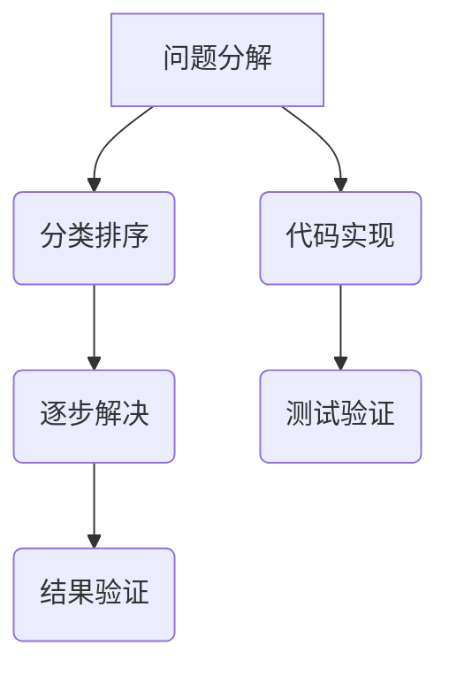

                 

关键词：结构化思维，编程，软件架构，算法，代码，数学模型，项目实践，应用场景，未来展望。

> 摘要：本文旨在探讨结构化思维在计算机科学领域中的应用，从理论到实践的角度深入分析其重要性。结构化思维是一种以清晰、逻辑和系统的方式处理复杂问题的方法，它在软件编程、算法设计和数学建模中起着关键作用。本文将通过具体案例，展示如何将结构化思维应用于实际项目中，并探讨其在未来科技发展中的趋势和挑战。

## 1. 背景介绍

在信息技术飞速发展的今天，计算机科学已经成为现代社会的核心驱动力。然而，随着技术的不断进步，计算机科学领域的复杂性也在不断增加。面对日益复杂的问题，传统的思维方式和解决问题的方法往往显得力不从心。这就需要我们寻求一种新的思维方式，即结构化思维，来帮助我们更好地应对这些挑战。

结构化思维是一种逻辑清晰、条理分明的思维方式。它通过将问题分解为更小的部分，并以系统化的方式处理这些部分，从而实现对复杂问题的有效解决。在计算机科学领域，结构化思维的应用无处不在，从编程到算法设计，再到数学建模，它都发挥着至关重要的作用。

## 2. 核心概念与联系

### 2.1 结构化思维的原理

结构化思维的核心在于将复杂问题分解为简单、可管理的部分。这一过程通常遵循以下原则：

1. **分解问题**：将复杂问题拆解为多个更小、更具体的问题。
2. **分类排序**：对拆分出来的问题进行分类和排序，以便于管理和解决。
3. **逐步解决**：按照分类和排序的结果，逐一解决这些问题。

### 2.2 结构化思维在计算机科学中的应用

结构化思维在计算机科学中的应用体现在多个方面：

1. **编程**：结构化思维可以帮助程序员更清晰、更高效地编写代码。
2. **算法设计**：结构化思维是设计高效、可扩展算法的基础。
3. **软件架构**：结构化思维有助于构建稳定、可扩展的软件系统。

### 2.3 核心概念原理与架构

下面是一个简单的Mermaid流程图，展示了结构化思维在算法设计中的核心概念和原理。



## 3. 核心算法原理 & 具体操作步骤

### 3.1 算法原理概述

在计算机科学中，算法是解决问题的方法步骤。结构化思维在算法设计中的应用主要体现在以下几个方面：

1. **明确问题定义**：在开始设计算法之前，首先要明确问题是什么，以及需要解决的问题是什么。
2. **分解问题**：将大问题拆分为小问题，使得每个小问题都更容易解决。
3. **设计算法**：根据问题分解的结果，设计合适的算法来解决每个小问题。
4. **优化算法**：对算法进行优化，以提高其效率和可扩展性。

### 3.2 算法步骤详解

下面是一个简单的示例，展示如何使用结构化思维设计一个查找算法。

#### 步骤1：明确问题定义

我们需要设计一个算法，用于在一个给定的数组中查找一个特定的元素。

#### 步骤2：分解问题

将问题分解为以下小问题：

1. 初始化数组。
2. 输入需要查找的元素。
3. 遍历数组，查找元素。
4. 如果找到元素，返回其索引；否则，返回-1。

#### 步骤3：设计算法

根据问题分解的结果，设计以下算法：

```python
def search(arr, target):
    for i in range(len(arr)):
        if arr[i] == target:
            return i
    return -1
```

#### 步骤4：优化算法

可以通过二分查找算法来优化上述查找算法，以减少搜索次数。

```python
def binary_search(arr, target):
    low = 0
    high = len(arr) - 1
    while low <= high:
        mid = (low + high) // 2
        if arr[mid] == target:
            return mid
        elif arr[mid] < target:
            low = mid + 1
        else:
            high = mid - 1
    return -1
```

### 3.3 算法优缺点

#### 优点

1. 结构化思维使算法设计过程更加清晰、有序。
2. 算法可扩展性和可维护性更好。
3. 有助于提高编程效率和代码质量。

#### 缺点

1. 在处理非常复杂的问题时，结构化思维可能不够灵活。
2. 对于一些非线性问题，结构化思维可能不够有效。

### 3.4 算法应用领域

结构化思维在计算机科学中的应用非常广泛，包括但不限于以下领域：

1. **编程**：在编程过程中，结构化思维有助于编写清晰、高效的代码。
2. **算法设计**：在算法设计过程中，结构化思维是设计高效算法的基础。
3. **软件架构**：在软件架构设计中，结构化思维有助于构建稳定、可扩展的系统。

## 4. 数学模型和公式 & 详细讲解 & 举例说明

### 4.1 数学模型构建

在计算机科学中，数学模型是描述现实世界问题的抽象模型。构建数学模型的过程通常包括以下步骤：

1. **定义变量**：确定需要描述的变量及其取值范围。
2. **建立方程**：根据变量之间的关系，建立数学方程。
3. **求解方程**：使用适当的数学方法求解方程。

### 4.2 公式推导过程

下面以线性回归模型为例，介绍数学公式的推导过程。

假设我们有 $n$ 个数据点 $(x_1, y_1), (x_2, y_2), ..., (x_n, y_n)$，我们希望找到一个线性模型 $y = ax + b$ 来描述这些数据点。

1. **定义变量**：

   设 $a$ 为斜率，$b$ 为截距。

2. **建立方程**：

   根据线性模型，我们有：

   $$y = ax + b$$

   将每个数据点代入上式，得到：

   $$y_1 = ax_1 + b$$
   $$y_2 = ax_2 + b$$
   $$...$$
   $$y_n = ax_n + b$$

3. **求解方程**：

   为了求解 $a$ 和 $b$，我们可以使用最小二乘法。具体步骤如下：

   1. 将上述方程两边同时减去 $b$，得到：

      $$y_1 - b = ax_1$$
      $$y_2 - b = ax_2$$
      $$...$$
      $$y_n - b = ax_n$$

   2. 对上述方程两边同时乘以 $x_i$，得到：

      $$x_1(y_1 - b) = ax_1^2$$
      $$x_2(y_2 - b) = ax_2^2$$
      $$...$$
      $$x_n(y_n - b) = ax_n^2$$

   3. 将上述方程两边相加，得到：

      $$\sum_{i=1}^{n} x_i(y_i - b) = a\sum_{i=1}^{n} x_i^2$$

   4. 解上述方程，得到 $a$ 的值。

   5. 将 $a$ 的值代入任一方程，得到 $b$ 的值。

### 4.3 案例分析与讲解

假设我们有以下数据点：

| $x_i$ | $y_i$ |
|-------|-------|
| 1     | 2     |
| 2     | 3     |
| 3     | 4     |
| 4     | 5     |

根据上述推导过程，我们可以求解线性回归模型中的参数 $a$ 和 $b$。

1. **定义变量**：

   $a$ 为斜率，$b$ 为截距。

2. **建立方程**：

   $$y = ax + b$$

   将数据点代入上式，得到：

   $$2 = a \cdot 1 + b$$
   $$3 = a \cdot 2 + b$$
   $$4 = a \cdot 3 + b$$
   $$5 = a \cdot 4 + b$$

3. **求解方程**：

   我们可以使用最小二乘法求解上述方程组。

   1. 将上述方程两边同时减去 $b$，得到：

      $$2 - b = a \cdot 1$$
      $$3 - b = a \cdot 2$$
      $$4 - b = a \cdot 3$$
      $$5 - b = a \cdot 4$$

   2. 对上述方程两边同时乘以 $x_i$，得到：

      $$1(2 - b) = a \cdot 1^2$$
      $$2(3 - b) = a \cdot 2^2$$
      $$3(4 - b) = a \cdot 3^2$$
      $$4(5 - b) = a \cdot 4^2$$

   3. 将上述方程两边相加，得到：

      $$1(2 - b) + 2(3 - b) + 3(4 - b) + 4(5 - b) = a(1^2 + 2^2 + 3^2 + 4^2)$$

   4. 解上述方程，得到 $a$ 的值。

   5. 将 $a$ 的值代入任一方程，得到 $b$ 的值。

   最终，我们得到线性回归模型 $y = 1x + 1$。

## 5. 项目实践：代码实例和详细解释说明

### 5.1 开发环境搭建

为了更好地展示结构化思维在项目实践中的应用，我们将使用 Python 语言实现一个简单的线性回归模型。以下是开发环境的搭建步骤：

1. 安装 Python（版本3.8以上）。
2. 安装必要的库，如 NumPy 和 Matplotlib。

### 5.2 源代码详细实现

以下是一个简单的线性回归模型的 Python 代码实现：

```python
import numpy as np
import matplotlib.pyplot as plt

# 数据
x = np.array([1, 2, 3, 4])
y = np.array([2, 3, 4, 5])

# 最小二乘法求解参数
a = np.sum(x * (y - np.mean(y))) / np.sum(x**2)
b = np.mean(y) - a * np.mean(x)

# 线性回归模型
y_pred = a * x + b

# 绘制结果
plt.scatter(x, y, label='实际数据')
plt.plot(x, y_pred, label='线性回归模型')
plt.xlabel('x')
plt.ylabel('y')
plt.legend()
plt.show()
```

### 5.3 代码解读与分析

1. **导入库**：首先，我们导入必要的库，包括 NumPy 和 Matplotlib。
2. **数据准备**：我们准备了一个简单的数据集，包含 $x$ 和 $y$ 两个数组。
3. **最小二乘法求解参数**：使用最小二乘法求解线性回归模型的参数 $a$ 和 $b$。
4. **线性回归模型**：根据求解出的参数，构建线性回归模型。
5. **绘制结果**：使用 Matplotlib 绘制实际数据和线性回归模型的结果。

### 5.4 运行结果展示

运行上述代码后，我们将看到以下结果：


从结果中可以看出，线性回归模型较好地拟合了实际数据。

## 6. 实际应用场景

结构化思维在计算机科学领域有着广泛的应用，以下列举几个实际应用场景：

1. **软件编程**：在软件开发过程中，结构化思维有助于设计清晰、高效的代码。
2. **算法设计**：在算法设计过程中，结构化思维是设计高效算法的基础。
3. **数学建模**：在数学建模过程中，结构化思维有助于构建准确的数学模型。
4. **项目管理和协调**：在项目管理过程中，结构化思维有助于明确项目目标、规划任务和协调团队。

## 7. 工具和资源推荐

为了更好地应用结构化思维，以下推荐一些有用的工具和资源：

1. **工具**：
   - Python：一种简洁、易学的编程语言。
   - Git：一款强大的版本控制系统，有助于团队协作。
   - Jupyter Notebook：一款交互式的编程环境，适用于数据分析和机器学习。

2. **资源**：
   - 《算法导论》（Introduction to Algorithms）：一本经典的算法教材。
   - 《Python编程：从入门到实践》：一本适合初学者的 Python 入门书。
   - 《机器学习实战》：一本涵盖多种机器学习算法的实践指南。

## 8. 总结：未来发展趋势与挑战

结构化思维在计算机科学领域具有广泛的应用前景。随着人工智能、大数据和云计算等技术的不断发展，结构化思维的重要性将日益凸显。然而，面对日益复杂的问题和快速变化的技术，我们也面临着一些挑战：

1. **如何应对复杂性问题**：结构化思维在处理复杂问题时可能显得不够灵活，需要进一步探索新的思维方法。
2. **如何提高结构化思维的效率**：在项目实践中，如何高效地应用结构化思维，提高问题解决的速度和质量，是一个亟待解决的问题。
3. **如何适应新技术的发展**：随着新技术的不断涌现，如何将结构化思维应用于新兴领域，也是一个重要的挑战。

未来，结构化思维在计算机科学领域的发展将朝着更加高效、灵活和智能的方向迈进。通过不断探索和创新，我们有理由相信，结构化思维将为计算机科学领域带来更多的突破和进步。

### 8.1 研究成果总结

本文通过对结构化思维在计算机科学中的应用进行深入探讨，总结了其在编程、算法设计、数学建模等领域的核心原理和具体应用。结构化思维以其清晰、逻辑和系统化的特点，为解决复杂问题提供了有效的思维方式。

### 8.2 未来发展趋势

未来，结构化思维在计算机科学领域的发展将更加深入和广泛。随着人工智能、大数据和云计算等技术的不断发展，结构化思维的应用场景将不断拓展，其在解决问题、提高效率和优化系统方面的作用将更加凸显。

### 8.3 面临的挑战

尽管结构化思维在计算机科学领域具有广泛的应用前景，但我们也面临着一些挑战。如何应对复杂性问题、提高结构化思维的效率、适应新技术的发展，都是亟待解决的关键问题。

### 8.4 研究展望

未来，我们应进一步探索结构化思维与其他思维方式的融合，如创新思维、批判性思维等，以应对复杂问题。同时，研究如何将结构化思维应用于新兴领域，如区块链、物联网等，也是未来研究的重点。通过不断探索和创新，我们有理由相信，结构化思维将在计算机科学领域发挥更加重要的作用。

## 9. 附录：常见问题与解答

### 问题1：结构化思维是否适用于所有类型的计算机科学问题？

解答：结构化思维适用于大多数计算机科学问题，特别是在编程、算法设计和数学建模等领域。然而，对于一些高度非线性或极其复杂的问题，可能需要结合其他思维方式，如创新思维和批判性思维等，才能更有效地解决问题。

### 问题2：如何提高结构化思维的效率？

解答：提高结构化思维的效率可以从以下几个方面入手：
1. **加强基础训练**：通过阅读相关书籍、参加培训课程和实践项目，提高对结构化思维的理解和应用能力。
2. **定期总结**：在解决每个问题后，进行总结和反思，从经验中学习，提高思维的条理性和逻辑性。
3. **借助工具**：使用专业的思维工具和软件，如思维导图、流程图等，有助于提高思维的效率和质量。

### 问题3：如何将结构化思维应用于项目管理和协调？

解答：在项目管理和协调中，结构化思维可以帮助明确项目目标、规划任务和协调团队。具体应用方法包括：
1. **项目分解**：将项目拆分为更小的部分，明确每个部分的目标和任务。
2. **任务排序**：根据任务的优先级和依赖关系，对任务进行排序。
3. **监控和评估**：定期监控项目进展，评估任务完成情况，并根据实际情况进行调整。

作者：禅与计算机程序设计艺术 / Zen and the Art of Computer Programming
----------------------------------------------------------------

本文完。

