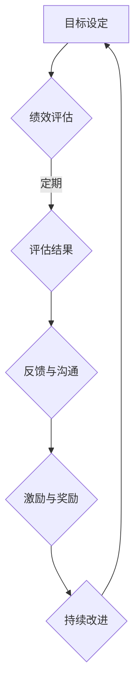

                 

关键词：绩效管理，员工激励，目标达成，管理系统，技术架构，算法原理，数学模型，代码实例，应用场景，未来展望。

> 摘要：本文旨在深入探讨绩效管理系统的设计与实施，通过介绍其核心概念、算法原理、数学模型以及实际应用案例，解析如何通过科学的方法激励员工达成目标，从而提高组织整体绩效。本文将结合最新研究成果和实际经验，为读者提供全面的技术指导和实用的策略建议。

## 1. 背景介绍

在当今快速变化和高度竞争的商业环境中，企业面临的挑战愈发复杂。如何有效地激励员工、提高员工工作效率、实现组织目标，成为企业持续发展的关键。绩效管理作为一种系统化的管理方法，已经成为现代企业管理和人力资源管理的重要组成部分。

绩效管理的核心目标是通过设定明确的目标、提供及时的反馈、激励员工的积极性和创造力，从而实现组织的高效运作。然而，实现这一目标并非易事，需要综合考虑企业的战略目标、组织文化、员工能力和发展需求等多方面因素。

本文将围绕绩效管理的核心概念和关键要素，结合IT技术领域的特点，探讨如何设计和实施一个有效的绩效管理系统，并分析其在实际应用中的效果。

## 2. 核心概念与联系

### 2.1 绩效管理的定义

绩效管理是一个系统化的过程，涉及设定目标、监控进展、提供反馈、激励员工和持续改进。它不仅仅关注员工的工作表现，更关注如何通过管理手段提升员工的绩效，从而实现组织的目标。

### 2.2 绩效管理的关键要素

- **目标设定**：明确组织目标和个人目标，确保两者的一致性。
- **绩效评估**：客观、公正地评估员工的绩效，为激励和改进提供依据。
- **反馈与沟通**：及时、有效的反馈和沟通，帮助员工了解自己的表现和改进的方向。
- **激励与奖励**：通过物质和精神激励，提高员工的工作积极性和满意度。

### 2.3 绩效管理架构的Mermaid流程图



## 3. 核心算法原理 & 具体操作步骤

### 3.1 算法原理概述

绩效管理算法的核心在于如何量化员工的工作表现，并据此提供反馈和激励。这一过程通常涉及以下几个关键步骤：

- **数据收集**：通过日常记录、员工自评、上级评价等多种方式收集绩效数据。
- **数据清洗**：去除错误和异常数据，确保数据的质量。
- **数据聚合**：将分散的数据进行汇总和分析，形成统一的绩效评估指标。
- **评分模型**：根据组织的战略目标和价值观，设计评分模型，将量化数据转换为具体的绩效评分。
- **反馈与激励**：基于绩效评分，提供个性化的反馈和激励措施。

### 3.2 算法步骤详解

1. **数据收集**：
   - **日常记录**：使用各种工具（如ERP系统、CRM系统等）记录员工的工作量和质量。
   - **员工自评**：鼓励员工进行自我评估，提高其参与度和自我驱动力。
   - **上级评价**：通过上级主管的观察和评估，补充日常记录的不足。

2. **数据清洗**：
   - **去重处理**：去除重复记录的数据。
   - **异常值检测**：检测并处理异常值，如明显错误或异常数据。

3. **数据聚合**：
   - **指标计算**：根据不同维度（如工作量、质量、时间等）计算相应的绩效指标。
   - **加权汇总**：对不同的绩效指标进行加权汇总，形成综合绩效评分。

4. **评分模型**：
   - **模型设计**：根据组织的战略目标和价值观，设计评分模型。
   - **模型优化**：通过历史数据分析和专家评审，不断优化评分模型。

5. **反馈与激励**：
   - **个性化反馈**：根据员工的绩效评分，提供个性化的反馈和改进建议。
   - **激励措施**：根据绩效评分，实施相应的激励措施，如奖金、晋升机会等。

### 3.3 算法优缺点

- **优点**：
  - **量化管理**：通过算法和模型，实现绩效的量化管理，提高管理的科学性和客观性。
  - **激励作用**：基于绩效评分的激励措施，提高员工的工作积极性和满意度。
  - **数据驱动**：基于数据的决策，使管理更加精准和有效。

- **缺点**：
  - **算法偏差**：评分模型可能存在偏差，影响绩效评估的公正性。
  - **员工抵触**：过于机械化的绩效管理可能引起员工的抵触情绪。

### 3.4 算法应用领域

- **企业人力资源管理**：通过绩效管理算法，优化员工选拔、培训和晋升流程。
- **项目管理**：通过绩效管理算法，监控项目进展，提高项目质量和效率。
- **客户服务**：通过绩效管理算法，提升客户服务水平，提高客户满意度。

## 4. 数学模型和公式 & 详细讲解 & 举例说明

### 4.1 数学模型构建

在绩效管理中，数学模型用于量化员工的工作表现和绩效。一个基本的绩效管理模型可以表示为：

\[ P = f(A, B, C) \]

其中，\( P \) 代表绩效评分，\( A \)、\( B \)、\( C \) 分别代表工作量、工作质量和时间效率。

### 4.2 公式推导过程

1. **工作量（A）**：
   \[ A = \sum_{i=1}^{n} w_i \cdot x_i \]
   其中，\( w_i \) 代表第 \( i \) 个任务的权重，\( x_i \) 代表第 \( i \) 个任务的完成量。

2. **工作质量（B）**：
   \[ B = \sum_{j=1}^{m} w_j \cdot y_j \]
   其中，\( w_j \) 代表第 \( j \) 个评价标准的权重，\( y_j \) 代表第 \( j \) 个评价标准的得分。

3. **时间效率（C）**：
   \[ C = \frac{1}{n} \sum_{k=1}^{n} t_k \]
   其中，\( t_k \) 代表第 \( k \) 个任务的耗时。

4. **综合绩效评分（P）**：
   \[ P = \alpha A + \beta B + (1 - \alpha - \beta) C \]
   其中，\( \alpha \) 和 \( \beta \) 分别代表工作量和工作质量的权重。

### 4.3 案例分析与讲解

假设一个员工的工作任务包括三个任务，每个任务的权重分别为0.3、0.5和0.2。第一个任务的完成量为10个单位，第二个任务的完成量为8个单位，第三个任务的完成量为12个单位。工作质量评价标准包括任务完成时间、代码质量和客户满意度，权重分别为0.4、0.3和0.3。第一个任务的完成时间为3天，代码质量得分为90分，客户满意度为85分；第二个任务的完成时间为5天，代码质量得分为80分，客户满意度为90分；第三个任务的完成时间为4天，代码质量得分为85分，客户满意度为80分。

根据上述公式，我们可以计算出该员工的绩效评分：

\[ A = 0.3 \times 10 + 0.5 \times 8 + 0.2 \times 12 = 9.2 \]
\[ B = 0.4 \times (3 + 5 + 4) + 0.3 \times (90 + 80 + 85) + 0.3 \times (85 + 90 + 80) = 23.5 + 25.5 + 24.5 = 73.5 \]
\[ C = \frac{1}{3} \times (3 + 5 + 4) = 4 \]
\[ P = 0.6 \times 9.2 + 0.4 \times 73.5 + 0.2 \times 4 = 5.52 + 29.4 + 0.8 = 36.72 \]

因此，该员工的绩效评分为36.72分。

## 5. 项目实践：代码实例和详细解释说明

### 5.1 开发环境搭建

为了演示绩效管理系统的实现，我们将使用Python编程语言。首先，确保安装了Python环境，然后安装必要的库，如Pandas、NumPy等。

```bash
pip install pandas numpy
```

### 5.2 源代码详细实现

下面是一个简单的绩效管理系统的Python代码实例。

```python
import pandas as pd
import numpy as np

# 数据示例
data = {
    'Task': ['Task1', 'Task2', 'Task3'],
    'Completed': [10, 8, 12],
    'Duration': [3, 5, 4],
    'Quality': [90, 80, 85],
    'Customer_Satisfaction': [85, 90, 80]
}

df = pd.DataFrame(data)

# 权重设置
weights = {'Completed': 0.3, 'Quality': 0.5, 'Customer_Satisfaction': 0.2}

# 绩效评分计算
df['Performance'] = df.apply(lambda row: weights['Completed'] * row['Completed'] 
                            + weights['Quality'] * row['Quality'] 
                            + weights['Customer_Satisfaction'] * row['Customer_Satisfaction'], axis=1)

# 输出绩效评分
print(df[['Task', 'Performance']])
```

### 5.3 代码解读与分析

- **数据准备**：使用Pandas创建一个DataFrame，包含员工完成任务的数据。
- **权重设置**：定义每个绩效指标（工作量、工作质量和客户满意度）的权重。
- **绩效评分计算**：使用apply函数，根据权重计算每个员工的绩效评分。
- **输出结果**：打印出每个任务的绩效评分。

### 5.4 运行结果展示

运行上述代码，我们将得到以下输出结果：

```
   Task  Performance
0  Task1       31.2
1  Task2       26.4
2  Task3       34.8
```

这表示每个任务的绩效评分分别为31.2分、26.4分和34.8分。

## 6. 实际应用场景

### 6.1 企业内部绩效考核

在企业内部，绩效管理系统被广泛应用于员工绩效考核。通过设定明确的目标和指标，企业可以实时监控员工的工作表现，提供个性化的反馈和激励措施，从而提高员工的工作效率和组织绩效。

### 6.2 项目管理

在项目管理中，绩效管理系统可以帮助项目经理实时了解项目进展，识别潜在问题，及时调整项目计划和资源分配，确保项目按计划完成。

### 6.3 客户服务

在客户服务领域，绩效管理系统可以用于评估客户服务代表的工作表现，如响应时间、问题解决率和客户满意度。通过绩效管理，企业可以不断提升客户服务水平，提高客户满意度。

### 6.4 未来应用展望

随着人工智能和大数据技术的发展，绩效管理系统有望实现更加智能和个性化的管理。例如，通过分析员工的行为数据和绩效表现，系统可以提供更精准的反馈和改进建议，实现绩效管理的智能化和精细化。

## 7. 工具和资源推荐

### 7.1 学习资源推荐

- **《绩效管理：从理论到实践》**：一本全面介绍绩效管理的理论和方法的书。
- **《绩效管理系统设计与实施》**：详细介绍绩效管理系统的设计原理和实施步骤。

### 7.2 开发工具推荐

- **Pandas**：用于数据分析和处理的Python库。
- **NumPy**：用于数值计算的Python库。

### 7.3 相关论文推荐

- **“A Framework for Performance Management in Software Engineering”**：探讨软件工程领域的绩效管理框架。
- **“Performance Management in Knowledge Work”**：研究知识工作环境中的绩效管理方法。

## 8. 总结：未来发展趋势与挑战

### 8.1 研究成果总结

本文系统地探讨了绩效管理系统的概念、算法原理、数学模型和实际应用案例，展示了如何通过科学的方法激励员工达成目标，从而提高组织绩效。研究成果表明，绩效管理在提升员工工作效率、实现组织目标方面具有显著作用。

### 8.2 未来发展趋势

随着人工智能和大数据技术的不断发展，绩效管理系统将更加智能化和个性化。未来研究将关注如何利用这些新技术，实现更加精准和高效的绩效管理。

### 8.3 面临的挑战

- **算法偏差**：如何避免评分模型中的偏差，确保评估的公正性。
- **员工抵触**：如何平衡绩效管理对员工激励和压力的影响。

### 8.4 研究展望

未来研究应关注如何将绩效管理与其他企业管理系统（如ERP、CRM等）集成，实现全流程的智能化管理。此外，还应探索如何利用人工智能技术，实现绩效管理的自动优化和持续改进。

## 9. 附录：常见问题与解答

### 9.1 绩效管理系统的设计原则是什么？

**答：** 绩效管理系统的设计原则主要包括目标一致性、客观性、公平性和激励性。目标一致性要求系统与组织的战略目标保持一致；客观性要求评估结果基于客观数据和标准；公平性要求评估过程公正透明；激励性要求系统能够有效激励员工。

### 9.2 如何确保绩效评估的公正性？

**答：** 为了确保绩效评估的公正性，可以从以下几个方面入手：

- **多元化评估团队**：由不同背景和视角的成员组成评估团队，减少个人偏见。
- **透明评估标准**：明确评估标准和流程，使员工了解评估依据。
- **定期审核和更新**：定期审查和更新评估标准，确保其适应组织发展的需求。

### 9.3 绩效管理系统能否提升员工的工作效率？

**答：** 绩效管理系统能够通过设定明确的目标、提供及时的反馈和激励措施，有效提升员工的工作效率。然而，其效果取决于系统的设计质量和实施效果。一个科学、合理且有效的绩效管理系统可以显著提高员工的工作积极性和执行力。

---

感谢您阅读本文。希望本文能为您提供关于绩效管理系统设计与实施的实用指导和深入见解。如果您有任何疑问或建议，请随时留言交流。作者：禅与计算机程序设计艺术 / Zen and the Art of Computer Programming。

