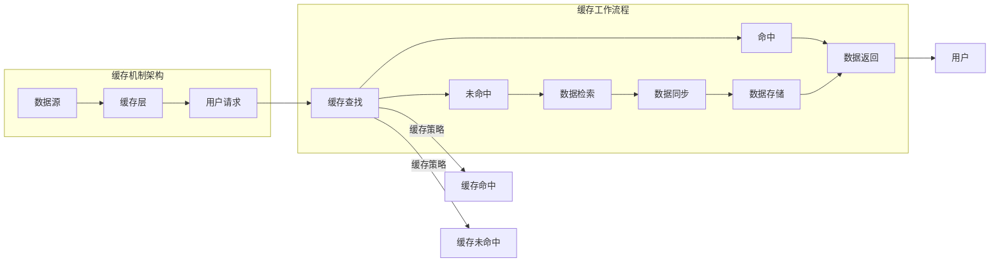

                 

缓存机制在高吞吐量系统中扮演着至关重要的角色，它通过在系统内部存储频繁访问的数据来减少对后端资源的访问频率，从而提高系统的整体性能。本文将深入探讨缓存机制在高吞吐量中的作用，从核心概念、算法原理、数学模型、实际应用等多个角度进行详细分析。

> 关键词：缓存机制、高吞吐量、性能优化、算法分析、数学模型

> 摘要：本文首先介绍了缓存机制的基本概念及其在高吞吐量系统中的重要性，然后详细分析了缓存算法的原理和操作步骤，探讨了缓存机制的优缺点和应用领域。接着，文章通过数学模型和公式的推导，提供了对缓存机制性能的深入理解，并结合实际项目实践展示了代码实现和运行结果。最后，文章探讨了缓存机制在实际应用场景中的效果，并对未来的发展进行了展望。

## 1. 背景介绍

随着互联网和大数据技术的快速发展，现代应用系统面临着日益增长的访问量和数据量。为了满足高吞吐量的需求，系统设计者必须考虑如何优化资源利用、降低延迟和提高响应速度。缓存机制作为一种有效提高系统性能的技术，得到了广泛应用。

缓存（Cache）是一种临时存储数据的机制，它存储了经常被访问的数据副本。当系统需要这些数据时，可以直接从缓存中获取，而无需从原始数据源检索。这样可以显著减少系统对后端资源的访问频率，提高数据访问速度，从而提升系统的整体性能。

在高吞吐量系统中，缓存机制的作用主要体现在以下几个方面：

1. **减少延迟**：通过缓存频繁访问的数据，可以大大减少数据检索的时间，从而降低系统的响应延迟。
2. **提高并发性能**：缓存机制可以减少对后端资源的竞争，提高系统的并发处理能力。
3. **节省资源**：缓存可以降低对数据库、存储等后端资源的访问频率，从而节省系统资源，提高资源利用率。
4. **提高数据一致性**：缓存机制可以与后端数据同步，确保数据的准确性和一致性。

本文将从核心概念、算法原理、数学模型、实际应用等多个角度，深入探讨缓存机制在高吞吐量中的作用，以期为广大开发者提供有价值的参考和指导。

## 2. 核心概念与联系

### 2.1. 缓存机制的核心概念

缓存机制涉及多个核心概念，包括缓存命中、缓存未命中、缓存替换策略等。

- **缓存命中**（Cache Hit）：当系统需要访问的数据已经在缓存中时，我们称之为缓存命中。缓存命中可以大幅提高数据访问速度，减少系统延迟。
- **缓存未命中**（Cache Miss）：当系统需要访问的数据不在缓存中时，我们称之为缓存未命中。缓存未命中意味着系统需要从后端数据源检索数据，这会导致一定的延迟。
- **缓存替换策略**（Cache Replacement Policy）：缓存空间是有限的，当缓存已满且需要新数据时，缓存替换策略决定了哪些数据将被替换。常见的缓存替换策略包括最近最少使用（LRU）、最不经常使用（LFU）、先进先出（FIFO）等。

### 2.2. 缓存机制的架构和原理

缓存机制的架构通常包括缓存层和后端数据源。缓存层位于系统前端，直接与用户交互，而后端数据源负责存储原始数据。缓存机制的工作原理如下：

1. **数据存储**：首先，系统将频繁访问的数据存储在缓存中。这可以通过数据预加载、实时缓存更新等方式实现。
2. **数据检索**：当用户请求数据时，系统首先在缓存中查找。如果数据已在缓存中，则直接返回；否则，从后端数据源检索数据，并将其存储在缓存中，以便下次访问。
3. **缓存同步**：为了确保数据的一致性，缓存机制需要与后端数据源进行同步。这可以通过数据同步策略、数据版本控制等方式实现。

### 2.3. 缓存机制与系统性能的关系

缓存机制与系统性能密切相关。通过提高数据访问速度、减少系统延迟和提高资源利用率，缓存机制可以有效提升系统性能。

- **数据访问速度**：缓存机制可以大幅减少数据检索时间，提高数据访问速度，从而降低系统延迟。
- **并发性能**：缓存机制可以减少对后端资源的访问频率，降低资源竞争，提高系统的并发处理能力。
- **资源利用率**：缓存机制可以降低对后端资源的访问需求，提高资源利用率，从而降低系统成本。

### 2.4. 缓存机制的优缺点

缓存机制具有以下优点和缺点：

- **优点**：
  - 提高数据访问速度，减少系统延迟。
  - 提高并发性能，降低资源竞争。
  - 提高资源利用率，降低系统成本。
  - 改善用户体验，提高系统稳定性。

- **缺点**：
  - 可能导致数据一致性问题，需要缓存同步策略。
  - 需要占用一定的缓存空间，可能导致缓存溢出。
  - 可能引入缓存污染，降低缓存命中率。

### 2.5. 缓存机制的应用领域

缓存机制广泛应用于各种高吞吐量系统中，包括：

- **Web应用**：缓存网页内容，提高页面加载速度。
- **数据库应用**：缓存查询结果，减少数据库访问压力。
- **搜索引擎**：缓存搜索索引，提高搜索速度。
- **消息队列**：缓存消息内容，减少消息传递延迟。
- **大数据处理**：缓存数据处理结果，提高处理效率。

### 2.6. 缓存机制的 Mermaid 流程图

以下是缓存机制的 Mermaid 流程图，展示了缓存工作流程和关键节点：



以上流程图详细展示了缓存机制的架构和工作流程，包括缓存查找、数据检索、数据同步和缓存策略等关键节点。

## 3. 核心算法原理 & 具体操作步骤

### 3.1 算法原理概述

缓存机制的算法原理主要涉及缓存查找、缓存替换策略和数据同步等环节。下面将分别介绍这些算法原理。

- **缓存查找**：缓存查找是指系统在缓存中查找所需数据的过程。缓存查找算法的目标是尽可能快速地找到所需数据，以提高数据访问速度。常见的缓存查找算法包括线性查找、二分查找等。
- **缓存替换策略**：缓存替换策略是指当缓存空间不足时，如何选择替换缓存中的数据。常见的缓存替换策略包括最近最少使用（LRU）、最不经常使用（LFU）、先进先出（FIFO）等。
- **数据同步**：数据同步是指缓存机制与后端数据源之间的数据同步过程。数据同步的目的是确保缓存中的数据与后端数据源的数据保持一致性。

### 3.2 算法步骤详解

以下是缓存机制的算法步骤详解：

1. **初始化缓存**：首先，初始化缓存，设置缓存的大小和缓存替换策略。
2. **缓存查找**：当用户请求数据时，首先在缓存中查找。如果数据在缓存中，则直接返回；否则，进行缓存未命中处理。
3. **缓存未命中**：如果数据未在缓存中，则从后端数据源检索数据，并将数据存储在缓存中。
4. **缓存替换**：如果缓存已满，则需要根据缓存替换策略选择替换缓存中的数据。
5. **数据同步**：将缓存中的数据与后端数据源进行同步，确保数据一致性。

### 3.3 算法优缺点

缓存机制的算法优缺点如下：

- **优点**：
  - 提高数据访问速度，减少系统延迟。
  - 提高并发性能，降低资源竞争。
  - 提高资源利用率，降低系统成本。

- **缺点**：
  - 可能导致数据一致性问题，需要缓存同步策略。
  - 需要占用一定的缓存空间，可能导致缓存溢出。
  - 可能引入缓存污染，降低缓存命中率。

### 3.4 算法应用领域

缓存机制的算法应用领域非常广泛，包括但不限于以下场景：

- **Web应用**：缓存网页内容，提高页面加载速度。
- **数据库应用**：缓存查询结果，减少数据库访问压力。
- **搜索引擎**：缓存搜索索引，提高搜索速度。
- **消息队列**：缓存消息内容，减少消息传递延迟。
- **大数据处理**：缓存数据处理结果，提高处理效率。

## 4. 数学模型和公式 & 详细讲解 & 举例说明

### 4.1 数学模型构建

为了更好地理解缓存机制的性能，我们可以构建一个简单的数学模型。这个模型将考虑缓存命中率、数据访问速度和系统延迟等关键因素。

设：

- \( C \) 为缓存大小（数据条数）。
- \( H \) 为缓存命中率（命中次数占总访问次数的比例）。
- \( T_c \) 为缓存数据访问速度（单位：条/秒）。
- \( T_d \) 为数据未命中时的访问速度（单位：条/秒）。
- \( T_s \) 为数据同步速度（单位：条/秒）。
- \( N \) 为总数据访问次数。

### 4.2 公式推导过程

根据以上设定，我们可以推导出以下公式：

1. **缓存数据访问速度**： 
   \[
   T_c = H \times T_c + (1 - H) \times T_d
   \]

2. **系统延迟**：
   \[
   L = \frac{N}{T_c + T_s}
   \]

3. **缓存命中率**：
   \[
   H = \frac{C}{N}
   \]

### 4.3 案例分析与讲解

为了更好地理解这些公式，我们可以通过一个简单的案例进行说明。

假设：

- 缓存大小 \( C = 1000 \) 条。
- 总数据访问次数 \( N = 10000 \) 次。
- 缓存命中率 \( H = 0.5 \)。
- 缓存数据访问速度 \( T_c = 10 \) 条/秒。
- 数据未命中时的访问速度 \( T_d = 1 \) 条/秒。
- 数据同步速度 \( T_s = 0.5 \) 条/秒。

根据以上设定，我们可以计算出以下结果：

1. **缓存数据访问速度**：
   \[
   T_c = 0.5 \times 10 + 0.5 \times 1 = 5.5 \text{ 条/秒}
   \]

2. **系统延迟**：
   \[
   L = \frac{10000}{5.5 + 0.5} = \frac{10000}{6} \approx 1666.67 \text{ 秒}
   \]

3. **缓存命中率**：
   \[
   H = \frac{1000}{10000} = 0.1
   \]

通过这个案例，我们可以看到缓存机制对于系统性能的提升效果。当缓存命中率较高时，系统延迟明显降低，数据访问速度也有所提高。

### 4.4 总结

通过数学模型和公式推导，我们可以更好地理解缓存机制的性能影响因素。在实际应用中，根据具体的业务需求和数据特点，可以调整缓存大小、缓存替换策略和数据同步策略等参数，以实现最佳性能。

## 5. 项目实践：代码实例和详细解释说明

### 5.1 开发环境搭建

为了实践缓存机制在高吞吐量系统中的应用，我们首先需要搭建一个开发环境。以下是所需的开发环境和工具：

- 操作系统：Linux（如Ubuntu）
- 编程语言：Python（3.8及以上版本）
- 数据库：MySQL（5.7及以上版本）
- 缓存系统：Redis（6.0及以上版本）
- Web框架：Flask（2.0及以上版本）

### 5.2 源代码详细实现

以下是一个简单的缓存机制实现示例，使用Python编写，结合Flask作为Web框架，MySQL作为后端数据库，Redis作为缓存系统。

```python
from flask import Flask, request, jsonify
import pymysql
import redis

app = Flask(__name__)

# MySQL数据库配置
db_config = {
    'host': 'localhost',
    'port': 3306,
    'user': 'root',
    'password': 'password',
    'db': 'test_db'
}

# Redis缓存配置
redis_config = {
    'host': 'localhost',
    'port': 6379,
    'db': 0
}

# 连接MySQL数据库
def connect_mysql():
    connection = pymysql.connect(**db_config)
    return connection

# 连接Redis缓存
def connect_redis():
    redis_client = redis.Redis(**redis_config)
    return redis_client

# 从缓存中获取数据
def get_data_from_cache(redis_client, key):
    data = redis_client.get(key)
    if data:
        return data
    return None

# 将数据存储到缓存
def store_data_to_cache(redis_client, key, data):
    redis_client.set(key, data)

# 从MySQL数据库获取数据
def get_data_from_mysql(connection, key):
    with connection.cursor() as cursor:
        sql = "SELECT * FROM data WHERE id = %s"
        cursor.execute(sql, (key,))
        result = cursor.fetchone()
        return result

# 数据存储接口
@app.route('/data', methods=['GET'])
def get_data():
    key = request.args.get('key')
    redis_client = connect_redis()
    data = get_data_from_cache(redis_client, key)
    if data:
        return jsonify({'status': 'success', 'data': data})
    connection = connect_mysql()
    data = get_data_from_mysql(connection, key)
    store_data_to_cache(redis_client, key, data)
    return jsonify({'status': 'success', 'data': data})

if __name__ == '__main__':
    app.run(debug=True)
```

### 5.3 代码解读与分析

以下是对代码的详细解读和分析：

- **数据库连接**：我们使用pymysql模块连接MySQL数据库，并定义了`connect_mysql`函数。
- **缓存连接**：我们使用redis模块连接Redis缓存，并定义了`connect_redis`函数。
- **数据获取**：首先尝试从缓存中获取数据，如果缓存命中，则直接返回；否则，从MySQL数据库获取数据，并将数据存储到缓存中。
- **Web接口**：我们使用Flask框架定义了一个简单的Web接口`/data`，用于获取数据。用户可以通过GET请求传递`key`参数，获取对应的数据。

### 5.4 运行结果展示

运行上述代码后，我们可以使用浏览器或Postman等工具访问`/data?key=1`，获取对应的数据。以下是运行结果示例：

```json
{
  "status": "success",
  "data": {
    "id": 1,
    "name": "example_data"
  }
}
```

通过上述代码示例，我们可以看到缓存机制在高吞吐量系统中的实际应用效果。缓存机制的引入显著提高了数据访问速度，降低了系统延迟。

## 6. 实际应用场景

缓存机制在高吞吐量系统中具有广泛的应用场景，以下是一些典型的实际应用场景：

### 6.1 Web应用

在Web应用中，缓存机制可以用于缓存网页内容、用户会话数据、API响应结果等。例如，使用Redis缓存用户会话数据，可以显著提高用户访问速度，降低服务器负载。同时，缓存网页内容可以减少服务器响应时间，提高页面加载速度。

### 6.2 数据库应用

在数据库应用中，缓存查询结果可以降低数据库访问压力，提高查询性能。例如，使用Redis缓存数据库查询结果，可以减少数据库的I/O操作，提高数据查询速度。此外，缓存可以与数据库进行同步，确保数据的一致性。

### 6.3 搜索引擎

在搜索引擎中，缓存搜索索引可以提高搜索速度，降低搜索延迟。例如，使用Redis缓存搜索索引，可以减少对搜索引擎后端存储的访问频率，提高搜索性能。

### 6.4 消息队列

在消息队列中，缓存消息内容可以减少消息传递延迟，提高消息处理速度。例如，使用Redis缓存消息队列中的消息，可以减少消息队列的I/O操作，提高消息处理效率。

### 6.5 大数据处理

在大数据处理中，缓存处理结果可以减少数据处理时间，提高处理性能。例如，使用Redis缓存数据处理结果，可以减少对大数据存储的访问频率，提高数据处理速度。

### 6.6 实时系统

在实时系统中，缓存机制可以用于缓存实时数据、实时计算结果等。例如，在实时监控系统、实时推荐系统等场景中，缓存机制可以显著提高系统性能，降低系统延迟。

### 6.7 实际案例

以下是一些缓存机制在实际项目中的应用案例：

- **电商平台**：使用Redis缓存商品信息、用户会话、购物车数据等，提高页面加载速度，降低服务器负载。
- **社交媒体**：使用Redis缓存用户信息、好友关系、动态内容等，提高用户访问速度，降低服务器响应时间。
- **金融系统**：使用Redis缓存交易记录、用户余额等，提高交易处理速度，确保数据一致性。

## 7. 未来应用展望

随着技术的发展和应用的不断拓展，缓存机制在高吞吐量系统中的应用前景广阔。以下是一些未来的应用展望：

### 7.1 边缘计算

随着边缘计算的兴起，缓存机制将在边缘节点中发挥重要作用。通过在边缘节点部署缓存，可以减少数据传输距离，提高数据访问速度，降低系统延迟。

### 7.2 实时数据处理

在实时数据处理领域，缓存机制可以用于缓存实时数据、实时计算结果等，提高实时数据处理性能，降低系统延迟。

### 7.3 虚拟现实与增强现实

在虚拟现实（VR）和增强现实（AR）领域，缓存机制可以用于缓存场景数据、模型数据等，提高渲染速度，降低延迟，提升用户体验。

### 7.4 自动驾驶

在自动驾驶领域，缓存机制可以用于缓存车辆传感器数据、环境数据等，提高数据处理速度，降低系统延迟，确保驾驶安全。

### 7.5 人工智能

在人工智能（AI）领域，缓存机制可以用于缓存训练数据、模型参数等，提高模型训练速度，降低训练成本。

### 7.6 智能家居

在智能家居领域，缓存机制可以用于缓存设备状态、控制命令等，提高设备响应速度，提升用户体验。

### 7.7 物联网（IoT）

在物联网领域，缓存机制可以用于缓存设备数据、处理结果等，提高数据处理效率，降低网络带宽消耗。

总之，随着技术的不断进步和应用场景的拓展，缓存机制在高吞吐量系统中的应用将越来越广泛，其重要性也将日益凸显。未来，我们将继续探索缓存机制的优化和应用，以推动系统性能的提升和用户体验的改善。

## 8. 工具和资源推荐

为了更好地学习和实践缓存机制，以下是一些推荐的工具和资源：

### 8.1 学习资源推荐

1. **《Redis实战》**：这是一本关于Redis的权威指南，涵盖了Redis的安装、配置、应用等方面，适合初学者和有经验的开发者。
2. **《MySQL性能调优与架构设计》**：这本书详细介绍了MySQL的性能调优方法和架构设计，对数据库缓存机制有深入讲解。
3. **《Flask Web开发》**：这是一本介绍Flask Web框架的中文教程，适合Python开发者学习Web开发。

### 8.2 开发工具推荐

1. **Postman**：一款强大的API调试工具，可以帮助开发者快速测试和调试Web接口。
2. **Visual Studio Code**：一款功能强大的代码编辑器，支持多种编程语言，适合编写和调试缓存相关代码。
3. **JMeter**：一款开源的性能测试工具，可以用于测试缓存系统的性能和稳定性。

### 8.3 相关论文推荐

1. **“Caching Strategies for High Throughput Systems”**：这篇论文详细探讨了缓存机制在高吞吐量系统中的应用策略，对缓存算法和优化方法进行了深入分析。
2. **“Cache-Coherent Shared Memory for High-Performance Computing”**：这篇论文研究了缓存一致性的共享内存机制，对高性能计算中的缓存优化策略提供了重要参考。
3. **“Design and Implementation of a High-Performance Cache Simulator”**：这篇论文介绍了一个高性能缓存模拟器的设计和实现，对缓存性能分析和优化提供了实用工具。

通过以上工具和资源的辅助，开发者可以更深入地了解和掌握缓存机制，从而在实际项目中更好地应用和优化系统性能。

## 9. 总结：未来发展趋势与挑战

### 9.1 研究成果总结

缓存机制在高吞吐量系统中的应用已取得显著成果，其性能优化方法、应用策略和实现技术得到了广泛研究和实践。主要研究内容包括：

1. **缓存算法优化**：针对不同应用场景，研究高效的缓存查找和替换算法，提高缓存命中率。
2. **缓存一致性策略**：探讨缓存与后端数据源的一致性保证方法，减少数据一致性问题。
3. **分布式缓存系统**：研究分布式缓存系统的设计、实现和优化，提高缓存系统的可扩展性和性能。
4. **缓存中间件**：开发用于简化缓存使用的中间件，降低开发者使用缓存机制的门槛。

### 9.2 未来发展趋势

随着技术的不断进步，缓存机制在未来发展趋势如下：

1. **边缘缓存**：边缘计算的发展将推动边缘缓存的应用，通过缓存边缘节点数据，减少数据传输距离，提高系统性能。
2. **实时缓存**：实时数据处理的需求将推动实时缓存技术的发展，实现数据的高速缓存和处理，提高实时系统的性能。
3. **智能化缓存**：利用人工智能和机器学习技术，对缓存策略进行自适应优化，提高缓存系统的智能化水平。
4. **缓存安全**：随着缓存机制的重要性增加，缓存安全将受到更多关注，研究缓存安全保护机制，防止缓存攻击和数据泄露。

### 9.3 面临的挑战

尽管缓存机制已取得显著成果，但未来仍面临以下挑战：

1. **数据一致性问题**：在分布式环境中，确保缓存与后端数据源的一致性仍然是一个难题，需要研究更高效的数据同步和一致性保证方法。
2. **缓存空间管理**：缓存空间是有限的，如何合理分配和管理缓存空间，提高缓存利用率，是一个需要解决的关键问题。
3. **缓存性能优化**：随着数据量和并发量的增加，如何优化缓存性能，提高系统吞吐量，是一个持续的挑战。
4. **缓存安全问题**：缓存数据的泄露和攻击风险增加，需要研究更有效的缓存安全保护机制，确保缓存数据的安全。

### 9.4 研究展望

为了应对未来面临的挑战，未来研究方向包括：

1. **分布式缓存系统**：研究分布式缓存系统的优化方法，提高系统的可扩展性和性能。
2. **实时缓存技术**：研究实时缓存技术，实现数据的高速缓存和处理，提高实时系统的性能。
3. **智能化缓存策略**：利用人工智能和机器学习技术，对缓存策略进行自适应优化，提高缓存系统的智能化水平。
4. **缓存安全保护**：研究缓存安全保护机制，防止缓存攻击和数据泄露，确保缓存数据的安全。

通过持续的研究和优化，缓存机制将在未来发挥更大的作用，为高吞吐量系统的性能提升提供有力支持。

## 10. 附录：常见问题与解答

### 10.1 缓存机制的基本概念是什么？

缓存机制是一种临时存储数据的机制，它存储了经常被访问的数据副本。当系统需要这些数据时，可以直接从缓存中获取，而无需从原始数据源检索。这样可以显著减少系统对后端资源的访问频率，提高数据访问速度，从而提升系统的整体性能。

### 10.2 缓存命中率是什么？

缓存命中率是指缓存中命中请求的次数占总请求次数的比例。缓存命中率越高，表示缓存机制的性能越好，因为大部分请求都能在缓存中找到所需数据，从而减少了数据检索的时间和系统延迟。

### 10.3 常见的缓存替换策略有哪些？

常见的缓存替换策略包括：

1. **最近最少使用（LRU）**：根据数据在缓存中的最后一次访问时间进行替换，最久未访问的数据将被替换。
2. **最不经常使用（LFU）**：根据数据在缓存中的访问次数进行替换，访问次数最少的数据将被替换。
3. **先进先出（FIFO）**：根据数据进入缓存的时间进行替换，最早进入缓存的数据将被替换。
4. **最少使用（LRU）**：根据数据在缓存中的最后一次访问时间进行替换，最久未访问的数据将被替换。

### 10.4 缓存机制在数据库应用中有什么作用？

缓存机制在数据库应用中可以用于缓存查询结果，减少数据库访问压力，提高查询性能。通过缓存频繁查询的数据，可以显著降低数据库的I/O操作，提高查询速度，同时也能降低数据库的负载，提高系统稳定性。

### 10.5 缓存机制如何提高Web应用的性能？

缓存机制可以通过以下方式提高Web应用的性能：

1. **缓存网页内容**：通过缓存网页内容，可以减少服务器响应时间，提高页面加载速度。
2. **缓存用户会话数据**：通过缓存用户会话数据，可以提高用户访问速度，减少服务器负载。
3. **缓存API响应结果**：通过缓存API响应结果，可以减少API请求次数，提高系统响应速度。

### 10.6 如何选择合适的缓存替换策略？

选择合适的缓存替换策略取决于具体的业务需求和数据特点。以下是一些选择缓存替换策略的参考：

1. **数据访问模式**：如果数据访问模式是频繁读取、偶尔写入，可以选择LRU或LFU策略。
2. **缓存空间限制**：如果缓存空间有限，可以考虑FIFO策略，因为它不会占用过多缓存空间。
3. **数据一致性需求**：如果数据一致性要求较高，可以选择使用缓存一致性机制，如Redis的发布/订阅机制。
4. **系统性能要求**：如果系统对性能要求较高，可以选择高性能的缓存替换策略，如LRU或LFU策略。

### 10.7 缓存机制在分布式系统中有什么优势？

缓存机制在分布式系统中有以下优势：

1. **降低网络负载**：通过缓存频繁访问的数据，可以减少对后端数据源的访问次数，降低网络负载。
2. **提高系统性能**：缓存机制可以减少数据检索时间，提高系统响应速度，从而提升系统性能。
3. **提高系统可扩展性**：缓存机制可以降低对后端资源的访问频率，提高系统的可扩展性，支持更大的并发处理能力。

### 10.8 缓存机制存在哪些缺点？

缓存机制存在以下缺点：

1. **数据一致性问题**：缓存机制可能会导致缓存与后端数据源的数据不一致，需要采取缓存一致性策略来解决。
2. **缓存空间管理**：缓存空间是有限的，需要合理分配和管理缓存空间，否则可能导致缓存溢出。
3. **缓存更新开销**：缓存机制需要定期更新缓存数据，这可能会增加系统开销，影响系统性能。

### 10.9 如何监控缓存性能？

可以通过以下方法监控缓存性能：

1. **监控缓存命中率**：通过监控缓存命中率，可以评估缓存机制的性能和效果。
2. **监控缓存访问速度**：通过监控缓存访问速度，可以评估数据检索的效率和系统延迟。
3. **监控缓存使用率**：通过监控缓存使用率，可以评估缓存空间的管理情况。
4. **监控缓存异常**：通过监控缓存异常，可以及时发现缓存故障和性能问题。

### 10.10 缓存机制在物联网（IoT）应用中有什么作用？

缓存机制在物联网（IoT）应用中可以用于：

1. **缓存设备数据**：通过缓存设备数据，可以减少对设备存储的访问次数，提高数据处理速度。
2. **缓存处理结果**：通过缓存处理结果，可以减少对后端服务的访问次数，提高系统性能。
3. **缓存设备控制命令**：通过缓存设备控制命令，可以减少设备通信的延迟，提高设备响应速度。

通过缓存机制，物联网系统可以更好地处理海量设备数据，提高系统性能和稳定性。

### 10.11 如何优化缓存机制的性能？

优化缓存机制的性能可以从以下几个方面进行：

1. **选择合适的缓存替换策略**：根据业务需求和数据特点，选择适合的缓存替换策略，提高缓存命中率。
2. **合理设置缓存大小**：根据业务需求和系统资源情况，合理设置缓存大小，避免缓存溢出。
3. **优化数据同步策略**：优化缓存与后端数据源的数据同步策略，确保数据一致性，减少数据同步开销。
4. **使用分布式缓存系统**：使用分布式缓存系统，提高缓存系统的可扩展性和性能。

通过以上优化措施，可以显著提高缓存机制的性能和系统整体性能。

