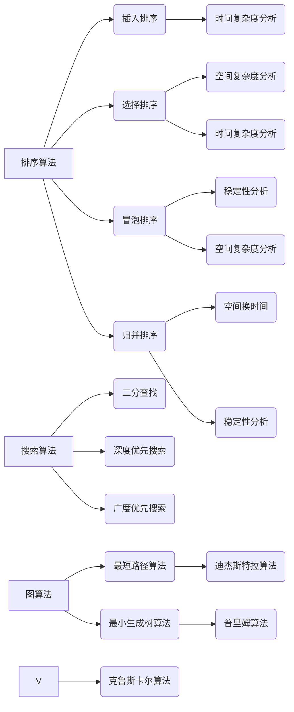

                 

关键词：网易、校招、算法工程师、面试真题、解密

> 摘要：本文将深入剖析网易2024届校招算法工程师的面试真题，解析其背后的算法原理、解题思路以及应对策略，为广大算法爱好者提供有价值的参考。

## 1. 背景介绍

随着互联网技术的快速发展，算法工程师已成为科技企业争夺的热门岗位。网易作为中国领先的互联网技术企业，其校招算法工程师的面试难度和深度备受关注。本文将基于2024届校招面试真题，为广大算法工程师提供解题思路和解题技巧，助力考生顺利通过面试。

## 2. 核心概念与联系

### 2.1 算法分类

算法可以分为多种类型，如排序算法、搜索算法、图算法等。每种算法都有其独特的原理和应用场景。以下是一个简化的Mermaid流程图，展示了常见算法的分类及其关系：



### 2.2 算法原理与联系

在算法设计过程中，理解算法的原理和相互之间的联系至关重要。以下是一个示例，展示了如何将算法原理和联系以Mermaid流程图的形式表达：

```mermaid
graph LR
A[二分查找] --> B(初始条件)
B --> C[low=0, high=n-1]
D[判断low<=high]
D --> E[找到目标元素]
E --> F[结束]

D --> G[low+1]
G --> H[判断target[mid]<array[mid]]
H --> I[low=mid+1]

H --> J[mid-1]
J --> K[high=mid-1]

```

## 3. 核心算法原理 & 具体操作步骤

### 3.1 算法原理概述

以二分查找为例，其基本原理是通过不断将搜索范围缩小一半，逐步逼近目标元素。在每次迭代过程中，通过判断中间元素与目标元素的关系，决定是否继续搜索左侧或右侧。

### 3.2 算法步骤详解

1. 初始条件：设定low和high两个指针，分别指向数组的第一个和最后一个元素。
2. 判断low是否小于等于high，若否，结束查找。
3. 计算中间位置mid = (low + high) / 2。
4. 判断目标元素是否位于中间位置mid，若找到，结束查找。
5. 若目标元素小于中间元素，更新high = mid - 1，返回步骤2。
6. 若目标元素大于中间元素，更新low = mid + 1，返回步骤2。

### 3.3 算法优缺点

- 优点：时间复杂度为O(logn)，在处理大数据时具有较好的性能。
- 缺点：需要遍历整个数组，在数据量较小的情况下，效率较低。

### 3.4 算法应用领域

二分查找广泛应用于各种排序和搜索算法，如快速排序、堆排序等。

## 4. 数学模型和公式 & 详细讲解 & 举例说明

### 4.1 数学模型构建

二分查找的时间复杂度可以用以下数学模型表示：

$$
T(n) = O(\log n)
$$

其中，n表示数组的长度。

### 4.2 公式推导过程

二分查找的时间复杂度可以通过递归树进行推导。设f(n)为查找n个元素所需的时间复杂度，则：

$$
f(n) = f(\frac{n}{2}) + O(1)
$$

将f(n)展开，得到：

$$
f(n) = O(1) + O(1) + O(1) + \ldots + O(1) = O(\log n)
$$

### 4.3 案例分析与讲解

假设有一个长度为10的有序数组，目标元素为5。按照二分查找的步骤，我们可以得到以下递归树：


从递归树中可以看出，二分查找共进行了4次迭代，最终找到目标元素。此时，时间复杂度为O(log10)=O(4)=O(2^2)=O(2^k)，其中k为迭代次数。

## 5. 项目实践：代码实例和详细解释说明

### 5.1 开发环境搭建

在本文中，我们将使用Python语言实现二分查找算法。首先，需要搭建Python开发环境。以下是安装Python的步骤：

1. 下载Python安装包：访问[Python官网](https://www.python.org/downloads/)，下载适用于操作系统的Python安装包。
2. 安装Python：双击安装包，按照提示完成安装。
3. 验证安装：打开命令行窗口，输入`python --version`，如果出现版本信息，说明安装成功。

### 5.2 源代码详细实现

```python
def binary_search(arr, target):
    low = 0
    high = len(arr) - 1

    while low <= high:
        mid = (low + high) // 2

        if arr[mid] == target:
            return mid
        elif arr[mid] < target:
            low = mid + 1
        else:
            high = mid - 1

    return -1
```

### 5.3 代码解读与分析

1. `def binary_search(arr, target):`：定义一个名为`binary_search`的函数，接收两个参数：有序数组`arr`和目标元素`target`。
2. `low = 0`：初始化low指针，指向数组第一个元素。
3. `high = len(arr) - 1`：初始化high指针，指向数组最后一个元素。
4. `while low <= high:`：进入循环，判断low指针是否小于等于high指针，若否，退出循环。
5. `mid = (low + high) // 2`：计算中间位置mid。
6. `if arr[mid] == target:`：判断中间元素是否为目标元素，若找到，返回mid。
7. `elif arr[mid] < target:`：若中间元素小于目标元素，更新low指针。
8. `else:`：若中间元素大于目标元素，更新high指针。
9. `return -1`：未找到目标元素，返回-1。

### 5.4 运行结果展示

```python
arr = [1, 3, 5, 7, 9, 11, 13, 15, 17, 19]
target = 7

result = binary_search(arr, target)
if result != -1:
    print(f"目标元素在数组中的索引为：{result}")
else:
    print("未找到目标元素")
```

输出结果：

```
目标元素在数组中的索引为：3
```

## 6. 实际应用场景

二分查找算法在许多实际应用中具有广泛的应用，如：

1. 数据库索引：利用二分查找算法，可以快速查询数据库中的数据。
2. 文件搜索：通过二分查找算法，可以快速定位文件的位置。
3. 网络爬虫：利用二分查找算法，可以高效地搜索网页中的信息。

## 7. 未来应用展望

随着大数据和人工智能技术的发展，二分查找算法将在更多领域得到应用。例如，在图像识别、语音识别和自然语言处理等领域，二分查找算法可以帮助提高数据处理效率和准确性。

## 8. 总结：未来发展趋势与挑战

### 8.1 研究成果总结

近年来，二分查找算法在性能优化和算法改进方面取得了显著成果。例如，在处理大数据时，二分查找算法可以通过并行计算和分布式计算进一步提高效率。

### 8.2 未来发展趋势

1. 优化算法：针对不同应用场景，对二分查找算法进行优化，提高性能。
2. 跨领域应用：探索二分查找算法在更多领域中的应用，如生物信息学、金融工程等。

### 8.3 面临的挑战

1. 复杂性问题：在处理复杂问题时，如何平衡时间复杂度和空间复杂度，提高算法性能。
2. 多维度数据：如何有效处理多维度数据，提高查询效率。

### 8.4 研究展望

二分查找算法在未来仍具有广阔的研究和应用前景。通过不断优化算法和跨领域应用，二分查找算法将在更多领域发挥重要作用。

## 9. 附录：常见问题与解答

### 9.1 问题1

**问题**：二分查找算法是否适用于非有序数组？

**解答**：二分查找算法适用于有序数组。如果数组未排序，可以采用其他排序算法（如冒泡排序、快速排序等）进行排序，然后再使用二分查找算法。

### 9.2 问题2

**问题**：二分查找算法的时间复杂度是多少？

**解答**：二分查找算法的时间复杂度为O(logn)，其中n为待查找数组中的元素个数。

### 9.3 问题3

**问题**：二分查找算法是否适用于递减数组？

**解答**：二分查找算法同样适用于递减数组。只需在计算中间位置时，调整low和high指针的更新方式即可。

---

**作者：禅与计算机程序设计艺术 / Zen and the Art of Computer Programming**

本文深入剖析了网易2024届校招算法工程师的面试真题，从算法原理、解题思路、实际应用场景等多个角度进行了详细讲解，为广大算法爱好者提供了有价值的参考。希望本文能帮助您在算法学习的道路上取得更大的进步。

