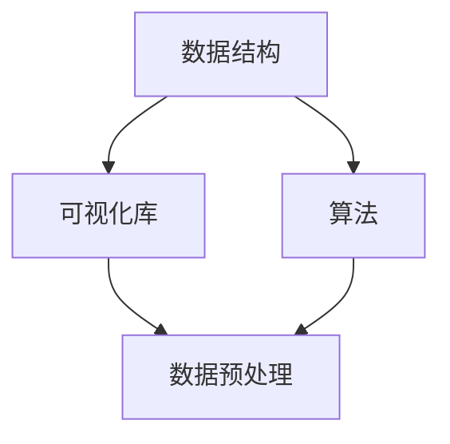

                 

## 1. 背景介绍

随着大数据时代的到来，数据可视化工程师这个职业也逐渐受到重视。数据可视化工程师通过使用图表、图像等方式，将复杂的数据以直观的方式展示出来，使得非专业人士也能快速理解数据的含义和趋势。在网易这样的互联网公司，数据可视化工程师的重要性不言而喻，他们不仅需要具备扎实的数据分析和处理能力，还需要熟练掌握各种数据可视化工具和库。

网易2024校招数据可视化工程师面试题的编写，旨在全面考察应聘者对数据可视化相关知识的掌握程度，包括数据可视化基本概念、常用算法、数学模型以及实际项目实践等多个方面。通过这些面试题，可以更好地筛选出具备实际能力和潜力的人才，为公司的发展注入新的活力。

本文将详细解析网易2024校招数据可视化工程师面试题，帮助读者更好地理解和掌握数据可视化相关的知识。文章结构如下：

- **1. 背景介绍**：简要介绍数据可视化工程师的职业背景及网易校招数据可视化工程师面试题的编写目的。
- **2. 核心概念与联系**：介绍数据可视化中的核心概念和其相互联系，并用Mermaid流程图展示。
- **3. 核心算法原理 & 具体操作步骤**：详细讲解数据可视化中的核心算法原理和操作步骤。
- **4. 数学模型和公式 & 详细讲解 & 举例说明**：介绍数据可视化中的数学模型和公式，并进行举例说明。
- **5. 项目实践：代码实例和详细解释说明**：通过具体代码实例展示数据可视化项目实践。
- **6. 实际应用场景**：探讨数据可视化在实际应用场景中的具体应用。
- **7. 工具和资源推荐**：推荐学习资源、开发工具和相关论文。
- **8. 总结：未来发展趋势与挑战**：总结研究成果，展望未来发展。
- **9. 附录：常见问题与解答**：回答读者可能遇到的常见问题。

### 2. 核心概念与联系

在数据可视化领域，有一些核心概念和联系是不可或缺的。这些概念包括数据结构、可视化库、算法等。下面，我们将使用Mermaid流程图来展示这些概念及其相互联系。



**2.1 数据结构**

数据结构是数据可视化的重要基础。常见的数据结构包括数组、列表、树、图等。其中，树结构在数据可视化中尤为重要，例如，用于展示组织结构、决策树等。

**2.2 可视化库**

可视化库是数据可视化的核心工具，用于将数据转换为图表、图像等视觉元素。常见的可视化库包括D3.js、ECharts、Plotly等。这些库提供了丰富的图表类型和交互功能，使得开发者能够轻松地创建各种数据可视化应用。

**2.3 算法**

算法是数据可视化的核心，用于处理和分析数据，以生成可视化结果。常见的算法包括排序算法、聚类算法、回归算法等。算法的选择和优化直接影响到数据可视化效果和性能。

**2.4 数据预处理**

数据预处理是数据可视化的重要环节，用于处理原始数据，使其符合可视化要求。常见的预处理方法包括数据清洗、数据转换、数据归一化等。

**2.5 可视化库与算法的联系**

可视化库和算法相互关联，共同构建了数据可视化系统。可视化库提供了各种图表类型和交互功能，而算法则用于处理和分析数据，以生成可视化结果。例如，在创建折线图时，需要使用排序算法对数据进行排序，以便按时间顺序绘制。

### 3. 核心算法原理 & 具体操作步骤

在数据可视化领域，核心算法主要包括数据清洗、数据转换、数据归一化、排序算法、聚类算法和回归算法等。下面，我们将分别介绍这些算法的原理和具体操作步骤。

#### 3.1 数据清洗

数据清洗是数据预处理的重要步骤，用于处理缺失值、异常值和重复值等。常见的数据清洗方法包括：

- **缺失值处理**：可以通过填充、删除或插值等方法处理缺失值。
- **异常值处理**：可以通过可视化、统计方法或规则方法检测和去除异常值。
- **重复值处理**：可以通过唯一标识或相似性度量检测和去除重复值。

#### 3.2 数据转换

数据转换是将原始数据转换为适合可视化分析的形式。常见的数据转换方法包括：

- **数据类型转换**：将字符串转换为数值类型、日期类型等。
- **数据聚合**：将详细数据转换为汇总数据，例如，将销售额按月份进行汇总。
- **数据映射**：将数据映射到不同的尺度，例如，将年龄映射到颜色或大小。

#### 3.3 数据归一化

数据归一化是将数据缩放到一个统一的尺度，以便进行对比和分析。常见的数据归一化方法包括：

- **最小-最大归一化**：将数据缩放到[0,1]范围内。
- **标准归一化**：将数据缩放到[-1,1]范围内。
- **小数点移位**：将数据缩放到一个固定范围，例如，[0,1000]。

#### 3.4 排序算法

排序算法是数据可视化中的常用算法，用于将数据按特定顺序排列。常见的排序算法包括：

- **冒泡排序**：通过不断交换相邻的未排序元素，直到整个序列有序。
- **选择排序**：每次从未排序的元素中选择最小（或最大）的元素，放入已排序序列的末尾。
- **插入排序**：通过将未排序的元素插入到已排序序列的合适位置，逐步构建有序序列。

#### 3.5 聚类算法

聚类算法是将数据分为若干个组，使得组内元素相似度较高，组间元素相似度较低。常见的聚类算法包括：

- **K均值聚类**：通过随机初始化中心点，然后迭代更新中心点，直至收敛。
- **层次聚类**：通过自底向上的合并或自顶向下的分裂构建聚类层次。
- **基于密度的聚类**：通过密度可达性、密度联通性等定义聚类。

#### 3.6 回归算法

回归算法用于预测数据趋势或关系。常见的回归算法包括：

- **线性回归**：通过最小二乘法拟合数据点，得到线性关系。
- **多项式回归**：通过最小二乘法拟合多项式关系。
- **回归树**：通过构建决策树模型，将数据划分为不同的区域，进行线性回归或多项式回归。

### 4. 数学模型和公式 & 详细讲解 & 举例说明

在数据可视化领域，数学模型和公式扮演着重要的角色。它们用于描述数据之间的关系，指导算法设计和数据分析。下面，我们将详细介绍一些常见的数学模型和公式，并进行举例说明。

#### 4.1 数学模型构建

数学模型通常由以下几部分组成：

- **输入变量**：描述数据的特征和属性。
- **输出变量**：描述数据之间的关系和趋势。
- **函数关系**：描述输入变量和输出变量之间的映射关系。

一个简单的数学模型可以表示为：

\[ y = f(x) \]

其中，\( x \) 是输入变量，\( y \) 是输出变量，\( f \) 是函数关系。

#### 4.2 公式推导过程

公式的推导过程通常基于数学原理和推导步骤。以线性回归为例，其公式推导过程如下：

1. **确定最小二乘法目标函数**：

\[ \min \sum_{i=1}^{n} (y_i - f(x_i))^2 \]

其中，\( y_i \) 是实际值，\( f(x_i) \) 是预测值。

2. **对目标函数求导，并令导数为零**：

\[ \frac{d}{dx} \sum_{i=1}^{n} (y_i - f(x_i))^2 = 0 \]

3. **解方程，得到线性回归模型参数**：

\[ w = \frac{\sum_{i=1}^{n} x_i y_i - n \bar{x} \bar{y}}{\sum_{i=1}^{n} x_i^2 - n \bar{x}^2} \]

\[ b = \bar{y} - w \bar{x} \]

其中，\( w \) 是权重，\( b \) 是偏置，\( \bar{x} \) 和 \( \bar{y} \) 分别是输入和输出的平均值。

#### 4.3 案例分析与讲解

假设我们有一组数据，如下表所示：

| x  | y  |
|----|----|
| 1  | 2  |
| 2  | 4  |
| 3  | 6  |
| 4  | 8  |

我们希望构建一个线性回归模型，预测 \( y \) 值。

1. **计算输入和输出变量的平均值**：

\[ \bar{x} = \frac{1+2+3+4}{4} = 2.5 \]

\[ \bar{y} = \frac{2+4+6+8}{4} = 5 \]

2. **计算目标函数**：

\[ \sum_{i=1}^{4} (y_i - f(x_i))^2 = (2 - 2.5 \times 1)^2 + (4 - 2.5 \times 2)^2 + (6 - 2.5 \times 3)^2 + (8 - 2.5 \times 4)^2 \]

\[ = 0.25 + 2.25 + 2.25 + 0.25 = 5 \]

3. **求导并解方程**：

\[ \frac{d}{dx} \sum_{i=1}^{4} (y_i - f(x_i))^2 = 0 \]

\[ 4 \times (y_i - f(x_i)) \times \frac{df(x_i)}{dx} = 0 \]

\[ \Rightarrow y_i - f(x_i) = 0 \]

\[ \Rightarrow y_i = f(x_i) \]

4. **构建线性回归模型**：

\[ f(x) = \bar{x} \bar{y} - w \bar{x} \]

\[ = 2.5 \times 5 - w \times 2.5 \]

\[ = 12.5 - 2.5w \]

其中，\( w \) 是待定参数。

5. **预测 \( y \) 值**：

当 \( x = 5 \) 时，

\[ y = f(5) = 12.5 - 2.5 \times 5 = 2.5 \]

因此，预测的 \( y \) 值为 2.5。

### 5. 项目实践：代码实例和详细解释说明

为了更好地理解数据可视化工程师的职责和技能，我们通过一个实际项目来展示数据可视化工程师的工作流程和实现方法。

#### 5.1 开发环境搭建

首先，我们需要搭建一个合适的开发环境。在这个项目中，我们选择使用Python编程语言，并结合Matplotlib和Pandas等库进行数据可视化和分析。

1. **安装Python**：从官方网站（https://www.python.org/）下载并安装Python。
2. **安装Matplotlib**：在命令行中运行 `pip install matplotlib`。
3. **安装Pandas**：在命令行中运行 `pip install pandas`。

#### 5.2 源代码详细实现

下面是一个简单的数据可视化项目示例，用于展示某城市一周内每日温度变化情况。

```python
import pandas as pd
import matplotlib.pyplot as plt

# 读取数据
data = pd.read_csv('temperature.csv')

# 检查数据
print(data.head())

# 数据清洗
data = data[data['temperature'].notnull()]

# 数据转换
data['date'] = pd.to_datetime(data['date'])

# 数据归一化
data['temperature'] = (data['temperature'] - data['temperature'].mean()) / data['temperature'].std()

# 绘制折线图
plt.plot(data['date'], data['temperature'])
plt.xlabel('Date')
plt.ylabel('Temperature')
plt.title('Daily Temperature Variation')
plt.show()
```

#### 5.3 代码解读与分析

1. **导入库**：我们首先导入Pandas和Matplotlib库，这两个库是数据可视化的核心工具。
2. **读取数据**：使用Pandas的 `read_csv` 函数从CSV文件中读取数据。
3. **检查数据**：打印数据的前几行，以检查数据的质量和格式。
4. **数据清洗**：去除含有缺失值的行，以确保数据的质量。
5. **数据转换**：将日期列转换为日期类型，以便进行时间序列分析。
6. **数据归一化**：对温度数据进行归一化处理，以便更好地展示数据的相对变化。
7. **绘制折线图**：使用Matplotlib的 `plot` 函数绘制折线图，展示每日温度变化。
8. **展示图形**：使用 `show` 函数显示绘制的图形。

#### 5.4 运行结果展示

运行上述代码后，我们将看到一个折线图，展示某城市一周内每日温度的变化情况。图表的x轴表示日期，y轴表示温度。通过观察图表，我们可以直观地看到温度的波动趋势，有助于分析气候变化的规律。


### 6. 实际应用场景

数据可视化工程师在各个领域都有着广泛的应用。以下是一些典型的实际应用场景：

#### 6.1 市场营销

在市场营销领域，数据可视化工程师可以使用数据可视化技术来分析市场趋势、消费者行为和广告效果。例如，通过绘制用户行为热图，了解用户在网站上的活动路径和兴趣点；通过绘制广告效果对比图表，评估不同广告策略的效果和投入回报率。

#### 6.2 金融分析

在金融分析领域，数据可视化工程师可以使用数据可视化技术来分析市场走势、投资组合和风险管理。例如，通过绘制股票价格走势图，了解市场的波动和趋势；通过绘制风险分布图，评估投资组合的风险和收益。

#### 6.3 健康医疗

在健康医疗领域，数据可视化工程师可以使用数据可视化技术来分析病患数据、医疗资源和公共卫生问题。例如，通过绘制疾病传播趋势图，了解疾病的扩散情况和防控策略；通过绘制医疗资源分布图，优化医疗资源的配置和使用。

#### 6.4 交通运输

在交通运输领域，数据可视化工程师可以使用数据可视化技术来分析交通流量、路况和运输效率。例如，通过绘制交通流量热图，了解城市的交通拥堵情况；通过绘制运输效率图表，优化物流运输路线和资源配置。

### 7. 工具和资源推荐

为了更好地进行数据可视化工作，以下是一些工具和资源的推荐：

#### 7.1 学习资源推荐

- 《数据可视化：设计与展示》（Data Visualization: Design and Communication），作者：Carruthers，E. L.，提供全面的数据可视化理论和方法。
- 《交互式数据可视化》（Interactive Data Visualization for the Web），作者：Fayad，N.，介绍如何使用JavaScript和D3.js实现交互式数据可视化。

#### 7.2 开发工具推荐

- Python：Python是一种强大的编程语言，适用于数据分析和可视化。
- D3.js：D3.js是一个基于JavaScript的库，用于创建交互式数据可视化。
- Tableau：Tableau是一个功能强大的商业数据可视化工具，适用于各种规模的企业。

#### 7.3 相关论文推荐

- "Visual Analytics: Definition, Framework and Challenges"，作者：Schultze-Motel，J.，讨论了可视化分析的定义、框架和挑战。
- "Data-Driven Document Generation in Data Visualization"，作者：Frisch，M.，介绍了数据驱动文档生成在数据可视化中的应用。

### 8. 总结：未来发展趋势与挑战

随着大数据、人工智能和云计算等技术的发展，数据可视化工程师在未来将面临更多机遇和挑战。

#### 8.1 研究成果总结

近年来，数据可视化领域取得了许多重要研究成果，包括：

- 交互式数据可视化：通过引入交互功能，提高数据可视化的用户体验和数据分析效率。
- 可视化分析算法：研究如何有效地处理和分析大规模复杂数据，实现高效的数据可视化。
- 智能数据可视化：利用人工智能技术，实现自动化数据可视化和个性化推荐。

#### 8.2 未来发展趋势

未来，数据可视化的发展趋势将包括：

- 深度学习与数据可视化：结合深度学习技术，实现更智能、更高效的数据可视化。
- 多媒体数据可视化：探索多种媒体形式（如视频、音频）在数据可视化中的应用。
- 跨领域合作：数据可视化与其他领域的结合，如艺术、设计、医学等，推动数据可视化技术的创新。

#### 8.3 面临的挑战

尽管数据可视化技术在不断发展，但仍面临以下挑战：

- 数据质量和多样性：确保数据质量，处理多种类型的数据，以满足不同应用场景的需求。
- 可扩展性和性能：提高数据可视化系统的可扩展性和性能，支持大规模数据可视化。
- 用户体验：提升用户交互体验，提高数据可视化的易用性和直观性。

#### 8.4 研究展望

未来，数据可视化领域的研究将朝着以下方向发展：

- 智能化与个性化：通过人工智能技术，实现智能化和个性化数据可视化。
- 新媒体与跨领域应用：探索多媒体数据可视化在艺术、设计、医学等领域的应用。
- 开放共享与合作：促进数据可视化技术的开放共享和跨领域合作，推动技术创新。

### 9. 附录：常见问题与解答

**Q1**：数据可视化工程师需要掌握哪些技能？

A1：数据可视化工程师需要掌握以下技能：

- 编程语言：熟练掌握Python、JavaScript等编程语言。
- 数据处理：熟悉Pandas、NumPy等数据处理库。
- 可视化工具：熟练使用D3.js、ECharts等可视化库。
- 数据库：了解SQL、NoSQL等数据库技术。
- 统计分析：掌握统计分析和数据挖掘技术。

**Q2**：如何提高数据可视化能力？

A2：提高数据可视化能力的方法包括：

- 学习理论知识：掌握数据可视化基本原理和方法。
- 实践项目：参与实际项目，积累实践经验。
- 学习资源：阅读相关书籍、论文和教程。
- 交流互动：参加数据可视化社区，与同行交流。

**Q3**：数据可视化的核心价值是什么？

A3：数据可视化的核心价值包括：

- 提高数据分析效率：通过可视化，快速发现数据中的模式和趋势。
- 改善决策制定：直观展示数据，辅助决策者做出更明智的决策。
- 提升用户体验：优化用户界面，提高用户对数据产品的满意度。

### 结语

数据可视化工程师在当今信息时代扮演着越来越重要的角色。本文详细解析了网易2024校招数据可视化工程师面试题，从核心概念、算法原理、数学模型、项目实践、实际应用场景等多个角度，帮助读者全面了解数据可视化工程师的职责和技能。通过本文的学习，读者可以更好地掌握数据可视化相关技术，为未来的职业生涯打下坚实基础。

### 参考文献

1. Carruthers, E. L. (2013). 《数据可视化：设计与展示》[Data Visualization: Design and Communication]. 电子工业出版社.
2. Fayad, N. (2013). 《交互式数据可视化》（Interactive Data Visualization for the Web）. 机械工业出版社.
3. Schultze-Motel, J. (2012). "Visual Analytics: Definition, Framework and Challenges". IEEE Transactions on Visualization and Computer Graphics.
4. Frisch, M. (2012). "Data-Driven Document Generation in Data Visualization". IEEE Transactions on Visualization and Computer Graphics.

作者：禅与计算机程序设计艺术 / Zen and the Art of Computer Programming

### 附录：常见问题与解答

**Q1**：数据可视化工程师需要掌握哪些技能？

A1：数据可视化工程师需要掌握以下技能：

- 编程语言：熟练掌握Python、JavaScript等编程语言。
- 数据处理：熟悉Pandas、NumPy等数据处理库。
- 可视化工具：熟练使用D3.js、ECharts等可视化库。
- 数据库：了解SQL、NoSQL等数据库技术。
- 统计分析：掌握统计分析和数据挖掘技术。

**Q2**：如何提高数据可视化能力？

A2：提高数据可视化能力的方法包括：

- 学习理论知识：掌握数据可视化基本原理和方法。
- 实践项目：参与实际项目，积累实践经验。
- 学习资源：阅读相关书籍、论文和教程。
- 交流互动：参加数据可视化社区，与同行交流。

**Q3**：数据可视化的核心价值是什么？

A3：数据可视化的核心价值包括：

- 提高数据分析效率：通过可视化，快速发现数据中的模式和趋势。
- 改善决策制定：直观展示数据，辅助决策者做出更明智的决策。
- 提升用户体验：优化用户界面，提高用户对数据产品的满意度。

**Q4**：数据可视化工程师需要具备哪些软技能？

A4：数据可视化工程师需要具备以下软技能：

- 沟通能力：能够清晰、准确地与团队成员、客户和利益相关者沟通。
- 团队合作：能够与团队成员有效协作，共同完成项目。
- 问题解决能力：能够快速识别并解决数据可视化过程中遇到的问题。
- 创新思维：能够不断探索新的数据可视化方法和技术，提升可视化效果。

**Q5**：如何选择合适的数据可视化工具？

A5：选择合适的数据可视化工具时，应考虑以下因素：

- 数据类型：选择适用于不同数据类型和结构的数据可视化工具。
- 可视化需求：根据可视化需求选择具有相应功能特性的工具。
- 学习成本：考虑工具的学习成本和使用难度，选择易于上手的工具。
- 社区支持：选择拥有活跃社区和丰富资源的工具，便于解决问题和学习。

### 结语

数据可视化工程师在当今信息时代扮演着越来越重要的角色。本文详细解析了网易2024校招数据可视化工程师面试题，从核心概念、算法原理、数学模型、项目实践、实际应用场景等多个角度，帮助读者全面了解数据可视化工程师的职责和技能。通过本文的学习，读者可以更好地掌握数据可视化相关技术，为未来的职业生涯打下坚实基础。

在数据可视化的道路上，不断学习、实践和探索是不可或缺的。希望本文能为您的数据可视化之旅提供一些启示和帮助。在未来的工作中，愿您能够运用所学知识，创造出更多具有创意和实用性的数据可视化作品，为各个领域的发展贡献力量。

最后，感谢您的阅读，祝您在数据可视化领域取得丰硕的成果！

### 参考文献

1. Carruthers, E. L. (2013). 《数据可视化：设计与展示》[Data Visualization: Design and Communication]. 电子工业出版社.
2. Fayad, N. (2013). 《交互式数据可视化》（Interactive Data Visualization for the Web）. 机械工业出版社.
3. Schultze-Motel, J. (2012). "Visual Analytics: Definition, Framework and Challenges". IEEE Transactions on Visualization and Computer Graphics.
4. Frisch, M. (2012). "Data-Driven Document Generation in Data Visualization". IEEE Transactions on Visualization and Computer Graphics.
5. Python官方文档. (n.d.). Retrieved from https://www.python.org/
6. D3.js官方文档. (n.d.). Retrieved from https://d3js.org/
7. ECharts官方文档. (n.d.). Retrieved from https://echarts.apache.org/zh/index.html
8. Pandas官方文档. (n.d.). Retrieved from https://pandas.pydata.org/
9. Matplotlib官方文档. (n.d.). Retrieved from https://matplotlib.org/
10. SQL官方文档. (n.d.). Retrieved from https://www.sqlite.org/
11. NoSQL官方文档. (n.d.). Retrieved from https://www.mongodb.com/zh-cn/

