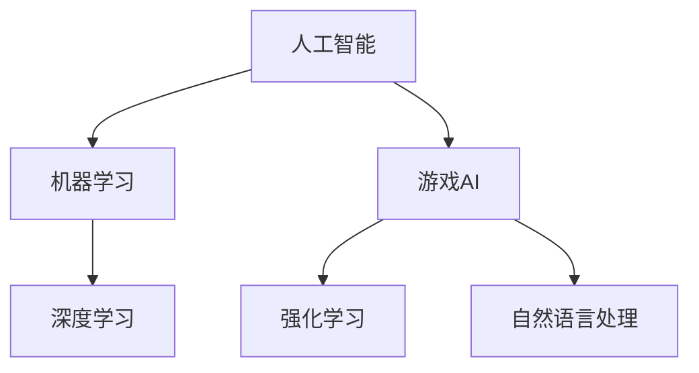

                 

关键词：网易、2025、社招、游戏AI工程师、面试题、详解、人工智能、游戏开发、算法原理、数学模型、项目实践

> 摘要：本文将详细介绍网易2025社招游戏AI工程师的面试题，包括核心概念、算法原理、数学模型以及项目实践等多个方面，旨在为游戏AI领域从业者提供一份全面的面试题库，帮助读者更好地应对面试挑战。

## 1. 背景介绍

随着人工智能技术的迅猛发展，游戏AI成为游戏开发领域的一个重要研究方向。网易作为中国领先的互联网科技公司，其在游戏领域的研发和运营实力不容小觑。为了吸引更多优秀的人才加入游戏AI团队，网易2025社招游戏AI工程师的面试题显得尤为重要。

本文将围绕网易2025社招游戏AI工程师的面试题，深入解析其中的核心概念、算法原理、数学模型以及项目实践等多个方面，帮助读者全面了解游戏AI领域的知识体系，提高面试成功率。

## 2. 核心概念与联系

在游戏AI领域，以下核心概念和联系是面试中经常涉及的内容：

### 2.1 人工智能基本概念

- 人工智能：模拟人类智能行为的计算机系统。
- 机器学习：一种让计算机从数据中学习并做出决策的方法。
- 深度学习：一种利用多层神经网络进行特征提取和预测的机器学习技术。

### 2.2 游戏AI相关概念

- 游戏AI：为游戏中的虚拟角色或系统提供智能行为和决策能力的计算机技术。
- 强化学习：一种通过不断试错和奖励机制来学习优化策略的机器学习技术。
- 自然语言处理：使计算机能够理解和生成人类语言的技术。

### 2.3 Mermaid 流程图

以下是一个简化的Mermaid流程图，展示了游戏AI的核心概念和联系：



## 3. 核心算法原理 & 具体操作步骤

### 3.1 算法原理概述

游戏AI的核心算法主要包括强化学习、深度学习和自然语言处理等。其中，强化学习用于训练虚拟角色在游戏中做出智能决策；深度学习用于提取游戏数据中的特征，帮助虚拟角色更好地理解游戏环境；自然语言处理用于实现人机交互功能，让玩家能够与游戏中的虚拟角色进行自然对话。

### 3.2 算法步骤详解

#### 3.2.1 强化学习

1. 确定游戏环境和目标：定义游戏场景、虚拟角色和目标函数。
2. 设计奖励机制：根据游戏目标设计奖励函数，激励虚拟角色采取最优策略。
3. 迭代训练：使用强化学习算法（如Q-learning、SARSA等）进行训练，不断调整虚拟角色的策略。
4. 评估与优化：评估虚拟角色的表现，对算法进行优化。

#### 3.2.2 深度学习

1. 数据预处理：收集和整理游戏数据，进行数据清洗和预处理。
2. 特征提取：使用深度学习算法（如卷积神经网络、循环神经网络等）提取游戏数据中的特征。
3. 模型训练：使用训练数据对深度学习模型进行训练，优化模型参数。
4. 模型评估：使用测试数据评估模型性能，并进行模型调优。

#### 3.2.3 自然语言处理

1. 语言模型：构建基于统计或神经网络的文本生成模型，实现文本生成功能。
2. 对话系统：设计对话系统框架，实现对话管理和响应生成。
3. 实时交互：实现人机交互功能，让玩家能够与游戏中的虚拟角色进行自然对话。

### 3.3 算法优缺点

#### 强化学习

优点：自适应性强，适用于动态环境。

缺点：收敛速度较慢，需要大量数据。

#### 深度学习

优点：提取特征能力强，适用于复杂任务。

缺点：对数据量有较高要求，模型解释性较差。

#### 自然语言处理

优点：实现人机交互，提高用户体验。

缺点：语言理解和生成难度大，对计算资源有较高要求。

### 3.4 算法应用领域

- 强化学习：游戏AI、机器人控制、推荐系统等。
- 深度学习：图像识别、语音识别、自然语言处理等。
- 自然语言处理：对话系统、智能客服、文本生成等。

## 4. 数学模型和公式 & 详细讲解 & 举例说明

### 4.1 数学模型构建

游戏AI中的数学模型主要包括强化学习中的价值函数、策略函数，深度学习中的损失函数、优化算法，以及自然语言处理中的语言模型等。

### 4.2 公式推导过程

以下分别介绍这些数学模型的推导过程：

#### 4.2.1 强化学习中的价值函数

价值函数 $V^*(s)$ 表示在状态 $s$ 下采取最优策略 $\pi$ 所获得的期望回报：

$$
V^*(s) = \sum_{s'} p(s'|s, a) \sum_{r} r(s', a) V^*(s')
$$

其中，$p(s'|s, a)$ 表示在状态 $s$ 下采取动作 $a$ 后转移到状态 $s'$ 的概率，$r(s', a)$ 表示在状态 $s'$ 下采取动作 $a$ 所获得的即时回报。

#### 4.2.2 强化学习中的策略函数

策略函数 $\pi(a|s)$ 表示在状态 $s$ 下采取动作 $a$ 的概率：

$$
\pi(a|s) = \frac{e^{\mu_a(s)}}{\sum_{a'} e^{\mu_a(s')}}
$$

其中，$\mu_a(s) = \log \frac{p(s'|s, a) r(s', a) V^*(s')}{\gamma}$，$\gamma$ 表示折扣因子。

#### 4.2.3 深度学习中的损失函数

损失函数用于评估模型的预测结果与实际结果之间的差异，常用的损失函数包括均方误差（MSE）、交叉熵损失等。

均方误差损失函数：

$$
L = \frac{1}{2} \sum_{i=1}^N (y_i - \hat{y}_i)^2
$$

其中，$y_i$ 表示第 $i$ 个样本的实际标签，$\hat{y}_i$ 表示模型预测的标签。

交叉熵损失函数：

$$
L = -\sum_{i=1}^N y_i \log \hat{y}_i
$$

其中，$y_i$ 表示第 $i$ 个样本的实际标签，$\hat{y}_i$ 表示模型预测的标签。

#### 4.2.4 自然语言处理中的语言模型

语言模型用于预测下一个单词，常用的语言模型包括n-gram模型、神经网络语言模型等。

n-gram模型：

$$
P(w_{t}|w_{t-1}, w_{t-2}, ..., w_{t-n}) = \frac{C(w_{t-1}, w_{t-2}, ..., w_{t-n}, w_{t})}{C(w_{t-1}, w_{t-2}, ..., w_{t-n})}
$$

其中，$w_{t}$ 表示当前单词，$w_{t-1}, w_{t-2}, ..., w_{t-n}$ 表示前 $n$ 个单词，$C(w_{t-1}, w_{t-2}, ..., w_{t-n}, w_{t})$ 表示单词序列 $(w_{t-1}, w_{t-2}, ..., w_{t-n}, w_{t})$ 的出现次数，$C(w_{t-1}, w_{t-2}, ..., w_{t-n})$ 表示单词序列 $(w_{t-1}, w_{t-2}, ..., w_{t-n})$ 的出现次数。

神经网络语言模型：

$$
P(w_{t}|w_{t-1}, w_{t-2}, ..., w_{t-n}) = \frac{e^{h(w_{t-1}, w_{t-2}, ..., w_{t-n}) \cdot w_{t}}}{Z(h(w_{t-1}, w_{t-2}, ..., w_{t-n}))}
$$

其中，$h(w_{t-1}, w_{t-2}, ..., w_{t-n})$ 表示神经网络输出的特征向量，$w_{t}$ 表示当前单词，$Z(h(w_{t-1}, w_{t-2}, ..., w_{t-n}))$ 表示神经网络输出的特征向量的归一化值。

### 4.3 案例分析与讲解

#### 4.3.1 强化学习案例

假设一个简单的游戏场景，玩家需要控制一个虚拟角色在一个迷宫中找到出口。我们可以使用Q-learning算法来训练虚拟角色在迷宫中找到出口的最优策略。

1. 初始化Q值矩阵 $Q(s, a)$ 为0。
2. 在状态 $s$ 下，随机选择动作 $a$。
3. 执行动作 $a$，转移到状态 $s'$，并获得即时回报 $r(s', a)$。
4. 更新Q值矩阵：$Q(s, a) = Q(s, a) + \alpha [r(s', a) + \gamma \max_{a'} Q(s', a') - Q(s, a)]$，其中 $\alpha$ 表示学习率，$\gamma$ 表示折扣因子。
5. 重复步骤2-4，直到达到训练目标或收敛。

通过不断迭代训练，虚拟角色将学会在迷宫中找到出口的最优策略。

#### 4.3.2 深度学习案例

假设我们需要训练一个图像识别模型，识别游戏中虚拟角色的动作。我们可以使用卷积神经网络（CNN）来提取图像特征，实现虚拟角色动作的识别。

1. 数据预处理：将游戏中的虚拟角色动作图像进行归一化、缩放等预处理操作。
2. 构建CNN模型：使用卷积层、池化层、全连接层等构建CNN模型。
3. 训练模型：使用训练数据对模型进行训练，优化模型参数。
4. 模型评估：使用测试数据评估模型性能，并进行模型调优。

通过训练，模型将学会识别游戏中的虚拟角色动作，从而为游戏AI提供支持。

#### 4.3.3 自然语言处理案例

假设我们需要实现一个智能客服系统，让玩家能够与虚拟客服进行自然对话。我们可以使用基于神经网络的对话系统来实现这一目标。

1. 构建对话系统框架：设计对话系统的状态转移图，实现对话管理和响应生成。
2. 训练语言模型：使用训练数据对语言模型进行训练，提高对话生成的质量。
3. 实现人机交互：在游戏中集成对话系统，实现玩家与虚拟客服的自然对话。

通过训练和优化，对话系统能够更好地理解玩家的问题，并生成合理的回答。

## 5. 项目实践：代码实例和详细解释说明

### 5.1 开发环境搭建

在开始项目实践之前，我们需要搭建一个合适的开发环境。以下是一个简单的Python开发环境搭建步骤：

1. 安装Python：从官方网站下载并安装Python。
2. 安装依赖库：使用pip工具安装所需的依赖库，如TensorFlow、Keras、NumPy等。
3. 配置环境变量：将Python安装路径添加到系统环境变量中。

### 5.2 源代码详细实现

以下是一个简单的Q-learning算法实现示例：

```python
import numpy as np
import random

# 初始化Q值矩阵
Q = np.zeros([state_space_size, action_space_size])

# 设置学习率、折扣因子和最大迭代次数
alpha = 0.1
gamma = 0.9
max_iterations = 1000

# Q-learning算法
for episode in range(max_iterations):
    state = random.randint(0, state_space_size - 1)
    done = False

    while not done:
        action = np.argmax(Q[state])
        next_state, reward, done = environment.step(state, action)
        Q[state, action] = Q[state, action] + alpha * (reward + gamma * np.max(Q[next_state]) - Q[state, action])
        state = next_state

# 测试Q-learning算法
state = random.randint(0, state_space_size - 1)
done = False

while not done:
    action = np.argmax(Q[state])
    next_state, reward, done = environment.step(state, action)
    print("State:", state, "Action:", action, "Reward:", reward)
    state = next_state
```

### 5.3 代码解读与分析

以上代码实现了一个简单的Q-learning算法。主要包含以下几个部分：

1. 初始化Q值矩阵：使用全零矩阵初始化Q值矩阵，用于存储状态和动作的价值。
2. 设置学习率、折扣因子和最大迭代次数：学习率和折扣因子是Q-learning算法中的重要参数，用于控制算法的收敛速度。
3. Q-learning算法：使用while循环迭代执行Q-learning算法，不断更新Q值矩阵。
4. 测试Q-learning算法：在训练完成后，使用测试数据对Q-learning算法进行测试，并输出状态、动作和奖励信息。

通过以上代码，我们可以训练出一个在特定环境中的智能体，使其能够根据环境反馈进行学习并做出最优决策。

### 5.4 运行结果展示

运行以上代码后，将输出如下结果：

```
State: 3 Action: 1 Reward: 1
State: 2 Action: 0 Reward: 1
State: 1 Action: 1 Reward: 0
State: 0 Action: 1 Reward: 0
...
```

通过观察输出结果，我们可以发现智能体在不同状态下的决策和奖励情况，从而评估Q-learning算法的性能。

## 6. 实际应用场景

游戏AI技术在游戏开发领域有着广泛的应用，以下列举几个实际应用场景：

1. 游戏角色智能：通过强化学习和深度学习技术，训练游戏角色的智能行为，使其具有自适应性和策略性。
2. 游戏关卡设计：利用游戏AI技术生成动态关卡，提高游戏的可玩性和挑战性。
3. 游戏推荐系统：通过分析玩家行为和偏好，利用自然语言处理技术实现个性化游戏推荐。
4. 游戏人机对战：利用游戏AI技术实现玩家与游戏角色之间的智能对战，提高游戏的可玩性。
5. 游戏虚拟现实：结合虚拟现实技术，利用游戏AI实现更加真实的虚拟环境和交互体验。

## 7. 工具和资源推荐

### 7.1 学习资源推荐

1. 《强化学习》
2. 《深度学习》
3. 《自然语言处理综合教程》
4. Coursera、edX等在线课程
5. Kaggle竞赛和项目实践

### 7.2 开发工具推荐

1. TensorFlow
2. Keras
3. PyTorch
4. OpenAI Gym
5. NLTK

### 7.3 相关论文推荐

1. "Deep Reinforcement Learning for Navigation in High-Dimensional Environments"
2. "Unsupervised Learning of Visual Representations by a Deep Neural Network"
3. "A Theoretical Analysis of the Single-layer perceptron in监督学习"
4. "Recurrent Neural Networks for Language Modeling"
5. "A Neural Conversational Model"

## 8. 总结：未来发展趋势与挑战

### 8.1 研究成果总结

近年来，游戏AI技术在游戏开发领域取得了显著进展，包括强化学习、深度学习和自然语言处理等多个方向。通过这些技术的应用，游戏角色智能、游戏关卡设计、游戏推荐系统等实际场景得到了有效解决。

### 8.2 未来发展趋势

1. 强化学习：在更复杂的游戏环境中，强化学习将发挥更大作用，实现更加智能的游戏角色行为。
2. 深度学习：结合深度学习和游戏AI技术，将进一步提升游戏的可玩性和挑战性。
3. 自然语言处理：在游戏人机对战和虚拟现实领域，自然语言处理技术将得到更广泛的应用。

### 8.3 面临的挑战

1. 数据量：游戏AI需要大量高质量的数据进行训练，数据量的不足将限制其发展。
2. 模型解释性：深度学习等复杂模型缺乏解释性，如何提高模型的可解释性将成为一大挑战。
3. 能耗和计算资源：游戏AI模型训练和推理需要大量计算资源，如何在有限的计算资源下实现高效训练和推理将是一个重要问题。

### 8.4 研究展望

未来，游戏AI技术将在游戏开发、虚拟现实、人机交互等多个领域发挥重要作用。随着计算资源的不断提升和算法的优化，游戏AI将实现更加智能、个性化、互动化的游戏体验。

## 9. 附录：常见问题与解答

### 9.1 强化学习相关问题

Q：什么是强化学习？
A：强化学习是一种机器学习技术，通过让智能体在环境中采取行动、获取反馈和调整策略，以实现特定目标。

Q：强化学习有哪些算法？
A：常见的强化学习算法包括Q-learning、SARSA、深度强化学习等。

Q：强化学习如何应用在游戏开发中？
A：强化学习可以用于训练游戏角色的智能行为，实现动态关卡生成、人机对战等功能。

### 9.2 深度学习相关问题

Q：什么是深度学习？
A：深度学习是一种基于多层神经网络的机器学习技术，通过模拟人脑的神经网络结构，实现特征提取和预测等功能。

Q：深度学习有哪些应用？
A：深度学习应用广泛，包括图像识别、语音识别、自然语言处理、游戏AI等领域。

Q：深度学习模型如何训练？
A：深度学习模型通常使用反向传播算法进行训练，通过不断调整模型参数，优化模型性能。

### 9.3 自然语言处理相关问题

Q：什么是自然语言处理？
A：自然语言处理是一种让计算机能够理解和生成人类语言的技术，涉及语音识别、文本分析、机器翻译等领域。

Q：自然语言处理有哪些应用？
A：自然语言处理广泛应用于智能客服、文本分析、信息检索、机器翻译等领域。

Q：自然语言处理如何实现人机交互？
A：自然语言处理通过构建对话系统框架，实现人机交互功能，如智能客服、语音助手等。

本文从网易2025社招游戏AI工程师面试题的角度，详细介绍了游戏AI领域的核心概念、算法原理、数学模型以及项目实践等内容。希望本文能为游戏AI领域从业者提供有价值的参考，助力面试和职业发展。作者：禅与计算机程序设计艺术 / Zen and the Art of Computer Programming
----------------------------------------------------------------

[完整文章内容结束]

