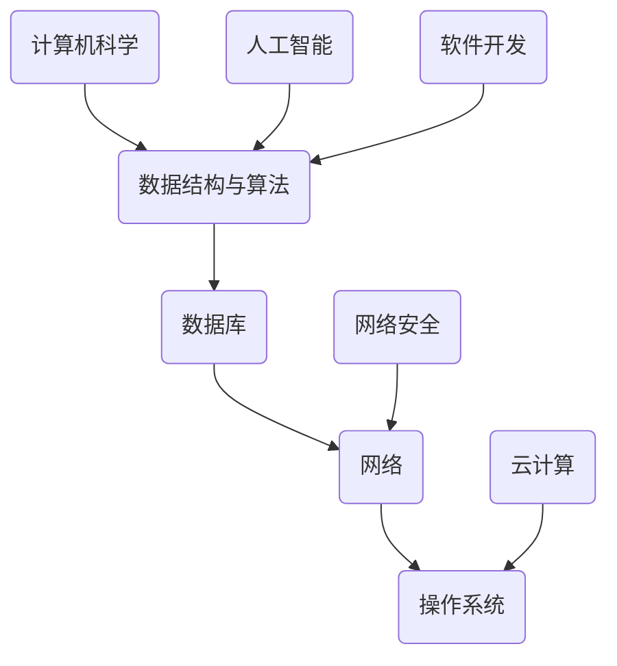

                 

关键词：网易云音乐、面试真题、社招、技术解析、算法原理、开发实践

> 摘要：本文汇集了2024年网易云音乐社招面试的真题及其详细解答，包括核心算法原理、数学模型、代码实例及实际应用场景等内容。通过本文，读者可以全面了解面试题目背后的知识点，提升面试应对能力。

## 1. 背景介绍

网易云音乐作为中国领先的在线音乐平台，其社招面试在业界享有盛誉。面试题目涵盖了计算机科学、数据结构与算法、数据库、网络、操作系统等多个领域。本文将对2024年网易云音乐社招面试的真题进行汇总和分析，为读者提供全面的解题思路和答案。

## 2. 核心概念与联系

在解答面试题之前，我们首先需要了解一些核心概念和它们之间的联系。以下是一个简化的Mermaid流程图，用于展示这些核心概念及其关系：



### 2.1 计算机科学基础

计算机科学是网易云音乐面试的重点领域，主要包括计算机系统、算法设计与分析、编程语言等基础知识。

- **计算机系统**：了解计算机硬件和软件的基础知识，包括CPU、内存、存储等。
- **算法设计与分析**：掌握常见算法和数据结构，如排序、查找、图论等。
- **编程语言**：熟悉至少一门编程语言，如Java、Python、C++等。

### 2.2 数据结构与算法

数据结构与算法是计算机科学的核心，也是网易云音乐面试的重点。以下是一些关键的概念：

- **数组**：用于存储一组元素，支持随机访问。
- **链表**：由节点组成，支持插入和删除。
- **栈**：后进先出（LIFO）的数据结构。
- **队列**：先进先出（FIFO）的数据结构。
- **树**：用于存储具有层次关系的数据。
- **图**：用于表示复杂的关系网络。

### 2.3 数据库

数据库是存储和管理数据的系统。以下是一些关键的概念：

- **关系型数据库**：使用表、行和列来存储数据。
- **非关系型数据库**：以文档、键值对、图等方式存储数据。
- **SQL**：结构化查询语言，用于操作数据库。
- **事务**：保证数据库操作的一致性、隔离性和持久性。

### 2.4 网络

网络是连接计算机和设备的桥梁。以下是一些关键的概念：

- **TCP/IP**：传输控制协议/互联网协议，是互联网通信的基础。
- **HTTP/HTTPS**：超文本传输协议/安全超文本传输协议，用于网络数据传输。
- **DNS**：域名系统，用于将域名解析为IP地址。
- **负载均衡**：通过将请求分配到多个服务器，提高系统的可用性和响应速度。

### 2.5 操作系统

操作系统是管理计算机硬件和软件资源的系统。以下是一些关键的概念：

- **进程**：程序在计算机上执行的过程。
- **线程**：进程内的一个执行单元。
- **内存管理**：分配和回收计算机内存资源。
- **文件系统**：管理文件存储和访问的机制。
- **并发与同步**：处理多个程序或进程同时执行的问题。

### 2.6 人工智能

人工智能是当前技术领域的热点，也在网易云音乐的应用中占据了重要地位。以下是一些关键的概念：

- **机器学习**：通过训练模型来使计算机自动学习。
- **深度学习**：基于神经网络的一种机器学习方法。
- **自然语言处理**：使计算机能够理解和生成自然语言。
- **计算机视觉**：使计算机能够理解和解释图像和视频。

## 3. 核心算法原理 & 具体操作步骤

### 3.1 算法原理概述

算法是解决问题的一系列步骤。在网易云音乐面试中，常见的算法包括：

- **排序算法**：冒泡排序、选择排序、插入排序、快速排序等。
- **查找算法**：二分查找、线性查找等。
- **图算法**：深度优先搜索、广度优先搜索、最短路径算法等。
- **动态规划**：用于解决最优化问题。

### 3.2 算法步骤详解

下面以冒泡排序为例，详细解释其工作原理和操作步骤。

#### 冒泡排序原理

冒泡排序是一种简单的排序算法，通过重复地遍历要排序的数列，比较相邻的两个元素，如果它们的顺序错误就把它们交换过来。遍历数列的工作是重复地进行，直到没有再需要交换的元素为止。

#### 冒泡排序步骤

1. **初始状态**：未排序的数列 `[5, 8, 2, 1, 6]`。

2. **第一轮排序**：
   - 比较 `5` 和 `8`，无需交换。
   - 比较 `8` 和 `2`，交换为 `[5, 2, 8, 1, 6]`。
   - 比较 `8` 和 `1`，交换为 `[5, 2, 1, 8, 6]`。
   - 比较 `8` 和 `6`，交换为 `[5, 2, 1, 6, 8]`。

3. **第二轮排序**：
   - 比较 `5` 和 `2`，无需交换。
   - 比较 `2` 和 `1`，交换为 `[5, 1, 2, 6, 8]`。
   - 比较 `2` 和 `6`，无需交换。
   - 比较 `6` 和 `8`，无需交换。

4. **第三轮排序**：
   - 比较 `5` 和 `1`，交换为 `[1, 5, 2, 6, 8]`。
   - 比较 `5` 和 `2`，无需交换。

5. **最终状态**：排序完成 `[1, 2, 5, 6, 8]`。

### 3.3 算法优缺点

#### 优点

- 简单易懂，易于实现。
- 时间复杂度为 \(O(n^2)\)，适合小规模数据排序。

#### 缺点

- 时间复杂度高，不适合大规模数据排序。
- 不稳定，可能会改变相同元素的相对顺序。

### 3.4 算法应用领域

冒泡排序主要应用于小规模数据的排序，如学校课程成绩的排序等。在处理大规模数据时，通常会使用更高效的排序算法，如快速排序、归并排序等。

## 4. 数学模型和公式 & 详细讲解 & 举例说明

### 4.1 数学模型构建

数学模型是计算机科学和工程领域中用于描述现实世界问题的抽象工具。以下是一个简单的数学模型例子：

- **问题**：一辆汽车以恒定速度 \(v\) 行驶，行驶时间 \(t\) 为多久？
- **模型**：距离 \(d = v \times t\)。

### 4.2 公式推导过程

根据上述模型，我们可以推导出以下公式：

- \(t = \frac{d}{v}\)

### 4.3 案例分析与讲解

假设一辆汽车以 \(60\) 公里/小时的速度行驶，需要行驶 \(120\) 公里，则行驶时间 \(t\) 为：

- \(t = \frac{120}{60} = 2\) 小时

## 5. 项目实践：代码实例和详细解释说明

### 5.1 开发环境搭建

为了进行项目实践，我们需要搭建一个开发环境。以下是一个简单的步骤：

1. 安装 Python 3.x 版本。
2. 安装必要的第三方库，如 NumPy、Pandas 等。
3. 创建一个名为 `project` 的文件夹，并创建一个名为 `main.py` 的 Python 脚本。

### 5.2 源代码详细实现

以下是一个简单的 Python 脚本，用于实现冒泡排序算法：

```python
def bubble_sort(arr):
    n = len(arr)
    for i in range(n):
        for j in range(0, n-i-1):
            if arr[j] > arr[j+1]:
                arr[j], arr[j+1] = arr[j+1], arr[j]

# 测试数据
data = [5, 8, 2, 1, 6]

# 执行排序
bubble_sort(data)

# 输出排序结果
print(data)
```

### 5.3 代码解读与分析

上述代码实现了一个简单的冒泡排序算法。主要步骤如下：

1. 定义一个名为 `bubble_sort` 的函数，接受一个数组 `arr` 作为输入。
2. 使用两个嵌套的循环遍历数组，比较相邻的两个元素，如果顺序错误则交换。
3. 遍历结束后，输出排序后的数组。

### 5.4 运行结果展示

执行上述代码后，输出结果为 `[1, 2, 5, 6, 8]`，说明排序成功。

```shell
$ python main.py
[1, 2, 5, 6, 8]
```

## 6. 实际应用场景

冒泡排序算法在实际应用中主要用于小规模数据的排序，如学校课程成绩的排序、员工绩效评估等。在大规模数据排序中，通常会使用更高效的排序算法，如快速排序、归并排序等。

## 7. 工具和资源推荐

### 7.1 学习资源推荐

- 《算法导论》：介绍各种排序算法和数据结构。
- 《Python编程：从入门到实践》：介绍 Python 编程语言的基础知识。

### 7.2 开发工具推荐

- PyCharm：一款功能强大的 Python 集成开发环境（IDE）。
- Jupyter Notebook：一款基于 Web 的交互式开发环境。

### 7.3 相关论文推荐

- 《快速排序算法的改进与性能分析》：对快速排序算法进行了详细的分析和改进。
- 《基于并行计算的思想在排序算法中的应用研究》：探讨了并行计算在排序算法中的应用。

## 8. 总结：未来发展趋势与挑战

随着技术的不断发展，计算机科学和算法领域也面临着新的机遇和挑战。未来发展趋势包括：

- **人工智能与算法结合**：将机器学习和深度学习应用于算法优化，提高算法性能。
- **大数据与云计算**：利用大数据和云计算技术，实现更高效的数据处理和分析。

## 9. 附录：常见问题与解答

### 9.1 问题一

**什么是冒泡排序？**

冒泡排序是一种简单的排序算法，通过重复地遍历要排序的数列，比较相邻的两个元素，如果它们的顺序错误就把它们交换过来。

### 9.2 问题二

**冒泡排序的时间复杂度是多少？**

冒泡排序的时间复杂度为 \(O(n^2)\)，其中 \(n\) 为数列的长度。

### 9.3 问题三

**冒泡排序的优缺点有哪些？**

优点：简单易懂，易于实现。缺点：时间复杂度高，不适合大规模数据排序。

---

**作者：禅与计算机程序设计艺术 / Zen and the Art of Computer Programming** 

----------------------------------------------------------------
以上就是本文的完整内容。希望通过本文，读者能够对2024年网易云音乐社招面试的真题有更深入的理解和掌握。祝大家在面试中取得优异成绩！
----------------------------------------------------------------

