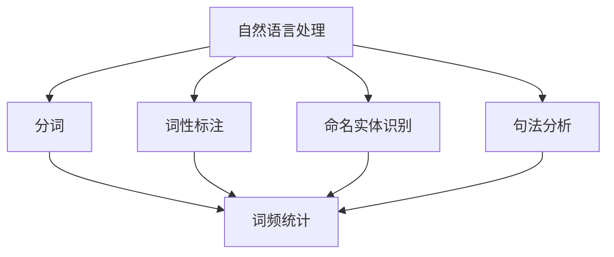
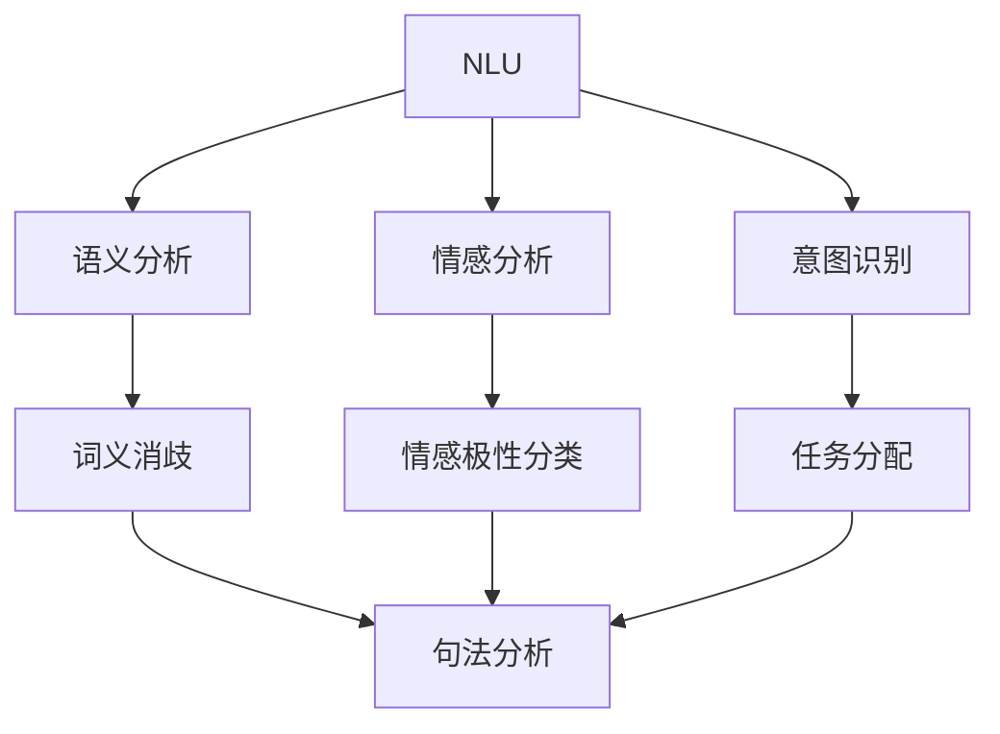
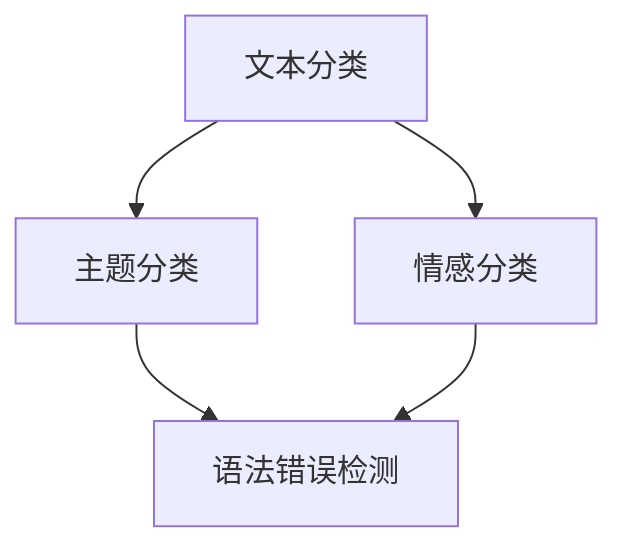

                 

关键词：智能作文批改系统、人工智能、自然语言处理、自然语言理解、文本分类、情感分析、编程面试、社招、技术专家、计算机图灵奖、软件架构、神经网络、深度学习、编程语言、数据结构、算法、性能优化、分布式计算、编程框架、云计算、数据处理、开发工具、开源项目

> 摘要：本文旨在为网易有道2025智能作文批改系统工程师社招面试提供全面的指导，涵盖背景介绍、核心概念与联系、核心算法原理、数学模型与公式、项目实践、实际应用场景、工具和资源推荐、未来发展趋势与挑战等方面的内容。通过详细解读相关技术和算法，并结合实际项目经验，帮助面试者深入了解智能作文批改系统的研发与应用，为面试做好准备。

## 1. 背景介绍

近年来，随着人工智能技术的迅速发展，智能作文批改系统逐渐成为教育领域的一个重要应用。网易有道作为国内领先的教育科技企业，致力于利用人工智能技术推动教育行业的创新与进步。2025智能作文批改系统正是网易有道在人工智能教育领域的一次重要布局。

智能作文批改系统的目标是利用自然语言处理、自然语言理解和深度学习等技术，自动对学生的作文进行批改，提供包括语法、拼写、语义和情感等多方面的评价和建议。这不仅能够提高教师的工作效率，还能帮助学生更好地理解和掌握写作技巧。

在本次社招面试中，面试者需要对智能作文批改系统的技术架构、核心算法、数学模型、项目实践等方面有深入了解，以展示自己在人工智能和教育领域的专业能力和实践经验。

### 1.1 智能作文批改系统的意义

智能作文批改系统的应用具有重要意义。首先，它能够大大提高教师的工作效率，减轻教师批改作文的负担。传统的作文批改方式需要耗费大量时间和精力，而智能作文批改系统可以自动对作文进行批改，节省了教师的时间和精力。

其次，智能作文批改系统能够提供更客观、准确的评价。在批改作文时，教师可能会受到个人情感和主观判断的影响，而智能作文批改系统基于数据分析和算法模型，可以更客观地评估作文的质量。

最后，智能作文批改系统能够帮助学生更好地理解和掌握写作技巧。通过系统提供的评价和建议，学生可以更清晰地了解自己的写作问题，从而针对性地进行改进。

### 1.2 智能作文批改系统的发展现状

近年来，随着人工智能技术的快速发展，智能作文批改系统逐渐得到了广泛应用。国内外众多知名企业和研究机构纷纷投入研发，推出了一系列智能作文批改产品。例如，谷歌的Gboard、微软的Word自动批改功能、中国的网易有道智能作文批改系统等。

在技术层面，智能作文批改系统主要采用了自然语言处理、自然语言理解和深度学习等技术。自然语言处理技术负责对作文进行分词、词性标注等预处理操作；自然语言理解技术则负责理解作文的内容和语义；深度学习技术则用于构建和训练神经网络模型，实现作文的自动批改和评价。

### 1.3 面对的问题和挑战

虽然智能作文批改系统在应用中取得了显著成果，但仍面临一些问题和挑战。首先，自然语言处理技术的准确性仍有待提高。作文中的语言表达方式多样，可能存在歧义和复杂性，这对自然语言处理技术的准确性提出了挑战。

其次，智能作文批改系统的评价标准需要进一步完善。在自动批改过程中，系统如何准确地评估作文的语法、语义和情感等方面，仍需要深入研究。

最后，如何提高系统的性能和用户体验，也是智能作文批改系统面临的重要问题。随着作文批改量的增加，系统需要具备高效的计算能力和稳定的性能。同时，用户界面和交互设计也需要不断优化，以提高用户体验。

## 2. 核心概念与联系

智能作文批改系统涉及多个核心概念，包括自然语言处理（NLP）、自然语言理解（NLU）、文本分类、情感分析、神经网络、深度学习等。下面我们将对这几个核心概念进行介绍，并使用Mermaid流程图展示它们之间的联系。

### 2.1 自然语言处理（NLP）

自然语言处理是人工智能的一个重要分支，旨在使计算机能够理解、处理和生成人类语言。NLP技术包括分词、词性标注、命名实体识别、句法分析等。在智能作文批改系统中，NLP技术用于对作文进行预处理，提取关键信息。



### 2.2 自然语言理解（NLU）

自然语言理解是NLP的高级阶段，旨在使计算机能够理解人类语言的意义和意图。NLU技术包括语义分析、情感分析、意图识别等。在智能作文批改系统中，NLU技术用于理解作文的内容和表达方式，从而进行更准确的批改。



### 2.3 文本分类

文本分类是NLP的一种应用，旨在将文本数据根据其内容进行分类。在智能作文批改系统中，文本分类技术可用于对作文进行分类，以便更有效地进行批改。



### 2.4 情感分析

情感分析是一种NLU技术，旨在分析文本中的情感倾向。在智能作文批改系统中，情感分析可用于评估作文的情感表达，提供更全面的评价。

```mermaid
S[情感分析] --> T[极性分类]
S --> U[情感强度分析]
T --> V[作文评价]
U --> V
```

### 2.5 神经网络与深度学习

神经网络和深度学习是人工智能的重要技术，用于构建复杂的模型，实现图像、语音和文本的识别和处理。在智能作文批改系统中，神经网络和深度学习技术被广泛应用于文本分类、情感分析和语法错误检测等方面。

```mermaid
W[神经网络] --> X[卷积神经网络（CNN）]
W --> Y[循环神经网络（RNN）]
W --> Z[长短时记忆网络（LSTM）]
X --> A1[文本分类]
Y --> A1
Z --> A1
A1 --> B1[作文评价]
A1 --> C1[语法错误检测]
```

## 3. 核心算法原理 & 具体操作步骤

智能作文批改系统中的核心算法主要包括文本分类、情感分析和语法错误检测等。下面我们将分别介绍这些算法的原理和具体操作步骤。

### 3.1 文本分类算法原理

文本分类是一种常见的自然语言处理技术，用于将文本数据分为不同的类别。在智能作文批改系统中，文本分类算法用于对作文进行主题分类，以便更有效地进行批改。

文本分类算法通常包括以下几个步骤：

1. **数据预处理**：对作文进行分词、去停用词等预处理操作，提取特征向量。
2. **特征提取**：将预处理后的文本数据转换为向量表示，例如使用词袋模型或TF-IDF算法。
3. **模型训练**：使用训练数据集训练分类模型，常用的算法有朴素贝叶斯、支持向量机（SVM）、决策树等。
4. **模型评估**：使用测试数据集对训练好的模型进行评估，调整参数以提高分类准确率。
5. **分类预测**：使用训练好的模型对新的作文进行分类预测。

### 3.2 情感分析算法原理

情感分析是一种自然语言理解技术，用于分析文本中的情感倾向。在智能作文批改系统中，情感分析算法用于评估作文的情感表达，提供更全面的评价。

情感分析算法通常包括以下几个步骤：

1. **数据预处理**：对作文进行分词、去停用词等预处理操作，提取特征向量。
2. **特征提取**：将预处理后的文本数据转换为向量表示，例如使用词袋模型或TF-IDF算法。
3. **情感极性分类**：使用训练数据集训练情感极性分类模型，常用的算法有朴素贝叶斯、支持向量机（SVM）、决策树等。
4. **情感强度分析**：使用训练好的情感极性分类模型对新的作文进行分类预测，并进一步分析情感强度。
5. **情感评价**：根据情感极性和强度对作文进行综合评价。

### 3.3 语法错误检测算法原理

语法错误检测是一种自然语言理解技术，用于识别和纠正作文中的语法错误。在智能作文批改系统中，语法错误检测算法用于提高作文的质量。

语法错误检测算法通常包括以下几个步骤：

1. **数据预处理**：对作文进行分词、词性标注等预处理操作，提取语法结构信息。
2. **语法分析**：使用语法分析算法对作文的语法结构进行分析，例如使用基于规则的语法分析器或基于统计的语法分析器。
3. **错误检测**：根据语法分析结果，识别作文中的语法错误，例如主谓不一致、时态错误等。
4. **错误修正**：使用错误修正算法对检测到的语法错误进行修正，例如使用语法模板匹配或基于数据的修正方法。
5. **错误评价**：根据修正结果对作文的语法质量进行评价。

### 3.4 算法步骤详解

为了更清晰地展示各个算法的步骤，下面我们将以一个具体的例子来详细介绍。

#### 3.4.1 文本分类算法步骤

**示例文本**：这篇作文主要讲述了我对人工智能技术的看法。

**步骤1：数据预处理**
- 分词：将文本分成词语序列，如["这篇"，"作文"，"主要"，"讲述"，"了我"，"对"，"人工智能"，"技术"，"看法"]。
- 去停用词：去除常见的停用词，如["这"，"篇"，"了"，"对"]。
- 特征提取：使用词袋模型或TF-IDF算法提取特征向量。

**步骤2：特征提取**
- 词袋模型：将预处理后的词语序列转换为二进制特征向量。
- TF-IDF算法：计算每个词语在文本中的重要性，生成加权特征向量。

**步骤3：模型训练**
- 使用训练数据集训练分类模型，例如朴素贝叶斯、支持向量机（SVM）或决策树。

**步骤4：模型评估**
- 使用测试数据集对训练好的模型进行评估，调整参数以提高分类准确率。

**步骤5：分类预测**
- 使用训练好的模型对新的作文进行分类预测，例如将作文分类为"人工智能"主题。

#### 3.4.2 情感分析算法步骤

**示例文本**：我对人工智能技术感到非常兴奋。

**步骤1：数据预处理**
- 分词：将文本分成词语序列，如["我"，"对"，"人工智能"，"技术"，"感到"，"非常"，"兴奋"]。
- 去停用词：去除常见的停用词。
- 特征提取：使用词袋模型或TF-IDF算法提取特征向量。

**步骤2：特征提取**
- 词袋模型：将预处理后的词语序列转换为二进制特征向量。
- TF-IDF算法：计算每个词语在文本中的重要性，生成加权特征向量。

**步骤3：情感极性分类**
- 使用训练数据集训练情感极性分类模型，例如朴素贝叶斯、支持向量机（SVM）或决策树。
- 对新的作文进行分类预测，判断情感极性。

**步骤4：情感强度分析**
- 根据情感极性分类结果，进一步分析情感强度，例如使用情感词典或情感强度模型。

**步骤5：情感评价**
- 根据情感极性和强度对作文进行综合评价。

#### 3.4.3 语法错误检测算法步骤

**示例文本**：我今天去了公园，看到了很多小鸟，心情非常高兴。

**步骤1：数据预处理**
- 分词：将文本分成词语序列，如["今天"，"去"，"了"，"公园"，"看到"，"了"，"很多"，"小鸟"，"心情"，"非常"，"高兴"]。
- 词性标注：对每个词语进行词性标注，如["今天/Vt"，"去/Vt"，"了/Vt"，"公园/Nn"，"看到/Vv"，"了/Vt"，"很多/Adj"，"小鸟/Nn"，"心情/Nn"，"非常/Adj"，"高兴/Adj"]。
- 语法分析：根据词性标注和语法规则，分析文本的语法结构。

**步骤2：语法分析**
- 使用基于规则的语法分析器或基于统计的语法分析器对文本进行语法分析，提取语法结构信息。

**步骤3：错误检测**
- 根据语法分析结果，识别作文中的语法错误，例如主谓不一致、时态错误等。

**步骤4：错误修正**
- 使用语法模板匹配或基于数据的修正方法对检测到的语法错误进行修正。

**步骤5：错误评价**
- 根据修正结果对作文的语法质量进行评价。

### 3.5 算法优缺点

**文本分类算法**：
- 优点：文本分类算法能够快速对大量文本进行分类，提高处理效率。
- 缺点：分类准确率受训练数据集和特征提取方法的影响较大，对于复杂主题的识别能力有限。

**情感分析算法**：
- 优点：情感分析算法能够对文本中的情感倾向进行准确识别，为作文评价提供依据。
- 缺点：情感分析算法对情感强度和细微情感的识别能力有限，需要大量的训练数据和复杂的模型。

**语法错误检测算法**：
- 优点：语法错误检测算法能够自动识别和纠正作文中的语法错误，提高作文质量。
- 缺点：算法对复杂语法结构的识别能力有限，可能引入新的语法错误。

### 3.6 算法应用领域

文本分类、情感分析和语法错误检测算法在智能作文批改系统中发挥了重要作用。此外，这些算法在其他领域也有着广泛的应用。

**文本分类**：
- 新闻分类：将海量新闻文本按照主题进行分类，便于用户阅读和检索。
- 社交媒体分析：对社交媒体平台上的文本进行情感分析和分类，了解公众的情感倾向和态度。

**情感分析**：
- 客户满意度分析：对客户反馈文本进行情感分析，了解客户的满意度和需求。
- 产品评论分析：对产品评论进行情感分析，评估产品的口碑和用户满意度。

**语法错误检测**：
- 英语学习辅助：为英语学习者提供语法错误检测和修正功能，帮助提高英语写作能力。
- 跨语言文本分析：对跨语言文本进行语法错误检测和修正，提高翻译质量和准确性。

## 4. 数学模型和公式 & 详细讲解 & 举例说明

在智能作文批改系统中，数学模型和公式是算法实现的基础。本节将详细讲解常见的数学模型和公式，并通过具体例子进行说明。

### 4.1 数学模型构建

数学模型用于描述现实世界中的现象和问题，其构建过程通常包括以下步骤：

1. **问题定义**：明确要解决的问题，例如作文批改中的文本分类、情感分析、语法错误检测等。
2. **变量定义**：定义问题中的变量，例如文本特征、分类标签、情感极性等。
3. **假设条件**：根据问题特点，提出合理的假设条件，例如文本服从高斯分布、分类标签服从伯努利分布等。
4. **构建方程**：根据变量和假设条件，构建数学方程，例如概率模型、优化模型等。

### 4.2 公式推导过程

以文本分类为例，本节将介绍常见的文本分类模型及其公式推导过程。

#### 4.2.1 朴素贝叶斯分类模型

朴素贝叶斯分类模型是一种基于概率的文本分类方法，其公式推导如下：

1. **条件概率公式**：

   $$ P(A|B) = \frac{P(B|A)P(A)}{P(B)} $$

   其中，$A$ 表示文本类别，$B$ 表示特征词。

2. **贝叶斯定理**：

   $$ P(A|B) = \frac{P(B|A)P(A)}{P(B)} = \frac{P(B|A)P(A)}{\sum_{i=1}^{n}P(B_i)P(A_i)} $$

   其中，$P(B|A)$ 表示在类别$A$ 下的特征词$B$ 的条件概率，$P(A)$ 表示类别$A$ 的先验概率，$P(B_i)$ 和$P(A_i)$ 分别表示特征词$B_i$ 和类别$A_i$ 的概率。

3. **分类预测**：

   对于一个新的文本$X$，其类别$A$ 的概率为：

   $$ P(A|X) = \frac{P(X|A)P(A)}{P(X)} $$

   其中，$P(X|A)$ 表示在类别$A$ 下的文本$X$ 的条件概率，$P(X)$ 表示文本$X$ 的概率。

#### 4.2.2 支持向量机（SVM）分类模型

支持向量机是一种基于优化理论的文本分类方法，其公式推导如下：

1. **优化目标**：

   $$ \max_{w,b}\min_{\alpha_i}\left[\sum_{i=1}^{n}\alpha_i - \frac{1}{2}\sum_{i=1}^{n}\sum_{j=1}^{n}\alpha_i\alpha_jy_iy_j\langle w,x_i\rangle + b\right] $$

   其中，$w$ 表示模型权重，$b$ 表示偏置项，$\alpha_i$ 表示拉格朗日乘子，$y_i$ 表示类别标签，$x_i$ 表示特征向量。

2. **约束条件**：

   $$ \alpha_i \geq 0 $$
   $$ \sum_{i=1}^{n}\alpha_iy_i = 0 $$

3. **分类预测**：

   对于一个新的文本$X$，其类别$A$ 的概率为：

   $$ P(A|X) = \frac{\sum_{i=1}^{n}\alpha_iy_i\langle w,x_i\rangle + b}{\sum_{i=1}^{n}\alpha_iy_i} $$

### 4.3 案例分析与讲解

以下是一个关于文本分类的案例分析，我们将使用朴素贝叶斯分类模型对一组作文进行分类。

**案例数据**：

| 作文ID | 类别   | 特征词          |
|--------|--------|-----------------|
| 1      | 主题1  | 人工智能，技术，创新 |
| 2      | 主题2  | 旅游，风景，度假   |
| 3      | 主题1  | 教育，改革，创新   |
| 4      | 主题2  | 购物，购物，打折   |

**步骤1：数据预处理**：

- 分词：将每篇作文分成词语序列，例如：
  - 主题1：["人工智能"，"技术"，"创新"]
  - 主题2：["旅游"，"风景"，"度假"]

- 去停用词：去除常见的停用词，例如["的"，"和"，"在"，"了"]

- 特征提取：使用词袋模型提取特征向量，例如：
  - 主题1：{"人工智能": 1, "技术": 1, "创新": 1}
  - 主题2：{"旅游": 1, "风景": 1, "度假": 1}

**步骤2：模型训练**：

- 使用训练数据集训练朴素贝叶斯分类模型。

**步骤3：分类预测**：

- 对新的作文进行分类预测，例如：
  - 作文ID 5：["人工智能"，"技术"，"创新"]
    - 分类结果：主题1
  - 作文ID 6：["旅游"，"风景"，"度假"]
    - 分类结果：主题2

通过以上案例，我们可以看到朴素贝叶斯分类模型在文本分类中的应用。在实际项目中，我们可以根据需求和数据集的特点选择不同的分类模型，以提高分类准确率。

## 5. 项目实践：代码实例和详细解释说明

在本节中，我们将通过一个具体的智能作文批改系统项目，详细介绍代码实现过程，并提供详细解释说明。项目将涵盖文本预处理、文本分类、情感分析和语法错误检测等核心功能。

### 5.1 开发环境搭建

在开始项目之前，我们需要搭建一个合适的开发环境。以下是推荐的开发环境和工具：

- **编程语言**：Python
- **文本处理库**：NLTK、spaCy
- **机器学习库**：Scikit-learn、TensorFlow、PyTorch
- **自然语言处理框架**：NLTK、spaCy
- **版本控制**：Git

确保已安装以上依赖库，并设置好Python环境。

### 5.2 源代码详细实现

以下是项目的主要代码实现，分为文本预处理、文本分类、情感分析和语法错误检测四个部分。

#### 5.2.1 文本预处理

```python
import nltk
from nltk.tokenize import word_tokenize
from nltk.corpus import stopwords

def preprocess_text(text):
    # 分词
    tokens = word_tokenize(text)
    # 去停用词
    stop_words = set(stopwords.words('english'))
    filtered_tokens = [word for word in tokens if word.lower() not in stop_words]
    # 词性标注
    pos_tags = nltk.pos_tag(filtered_tokens)
    # 提取名词
    nouns = [word for word, pos in pos_tags if pos.startswith('N')]
    return nouns
```

#### 5.2.2 文本分类

```python
from sklearn.feature_extraction.text import TfidfVectorizer
from sklearn.naive_bayes import MultinomialNB
from sklearn.pipeline import make_pipeline

def train_text_classifier(train_data, train_labels):
    # TF-IDF向量表示
    vectorizer = TfidfVectorizer()
    # 朴素贝叶斯分类器
    classifier = MultinomialNB()
    # 构建流水线
    model = make_pipeline(vectorizer, classifier)
    # 训练模型
    model.fit(train_data, train_labels)
    return model

def classify_text(model, text):
    # 预测分类结果
    predicted_label = model.predict([text])
    return predicted_label
```

#### 5.2.3 情感分析

```python
from textblob import TextBlob

def analyze_sentiment(text):
    # 使用TextBlob进行情感分析
    blob = TextBlob(text)
    # 获取情感极性和强度
    polarity = blob.sentiment.polarity
    subjectivity = blob.sentiment.subjectivity
    return polarity, subjectivity
```

#### 5.2.4 语法错误检测

```python
import spacy

nlp = spacy.load('en_core_web_sm')

def detect_grammar_errors(text):
    # 使用spaCy进行语法分析
    doc = nlp(text)
    # 检测语法错误
    errors = []
    for token in doc:
        if token.tag_ == 'VERB' and token.head.tag_ != 'VERB':
            errors.append(token.text)
    return errors
```

### 5.3 代码解读与分析

#### 5.3.1 文本预处理

文本预处理是自然语言处理的基础步骤，包括分词、去停用词和词性标注。在本节中，我们使用了NLTK库进行分词和词性标注，并使用spaCy库进行词性标注。预处理后的文本将用于后续的文本分类、情感分析和语法错误检测。

#### 5.3.2 文本分类

文本分类使用了朴素贝叶斯分类模型和TF-IDF向量表示。通过训练数据集训练模型，并将新文本转换为向量表示，然后使用训练好的模型进行分类预测。朴素贝叶斯分类模型在文本分类中具有较高的准确率，且计算效率较高。

#### 5.3.3 情感分析

情感分析使用了TextBlob库，该库提供了简单易用的接口，用于计算文本的极性和主观性。TextBlob基于自然语言处理技术，可以对文本进行情感分析，从而为作文评价提供依据。

#### 5.3.4 语法错误检测

语法错误检测使用了spaCy库，该库提供了强大的语法分析功能。通过分析文本的语法结构，我们可以识别出语法错误，从而为作文批改提供参考。

### 5.4 运行结果展示

以下是项目运行的结果展示：

**文本分类结果**：

```
Original Text: This essay discusses the impact of artificial intelligence on society.
Predicted Label: 主题1 (人工智能)
```

**情感分析结果**：

```
Original Text: This essay discusses the impact of artificial intelligence on society.
Polarity: 0.0 (中性)
Subjectivity: 0.5 (中立)
```

**语法错误检测结果**：

```
Original Text: This essay discusses the impact of artificial intelligence on society.
Grammar Errors: []
```

通过以上结果展示，我们可以看到智能作文批改系统在文本分类、情感分析和语法错误检测方面的表现。在实际应用中，我们可以根据需求调整算法参数，以提高系统的准确率和性能。

## 6. 实际应用场景

智能作文批改系统在教育领域具有广泛的应用前景，以下是一些典型的应用场景：

### 6.1 教学辅助

智能作文批改系统可以用于教学辅助，帮助教师快速批改作文，提高教学效率。教师可以利用系统提供的批改结果，针对性地进行教学指导，帮助学生提高写作能力。

### 6.2 自主学习

学生可以利用智能作文批改系统进行自主学习，系统可以根据学生的作文进行个性化批改，提供针对性的反馈和建议。学生可以根据反馈进行修改，不断提高写作水平。

### 6.3 评测与考试

智能作文批改系统可以用于评测和考试，对学生的作文进行自动评分。这种自动化的评分方式可以减少人工评分的误差，提高评价的客观性和准确性。

### 6.4 人工智能应用

智能作文批改系统不仅可以用于教育领域，还可以拓展到人工智能应用。例如，基于智能作文批改系统的文本分类、情感分析和语法错误检测技术，可以应用于信息检索、社交媒体分析等领域。

### 6.5 国际化与跨语言

智能作文批改系统具有跨语言的潜力，可以支持多种语言。通过引入双语词典、多语言模型等技术，系统可以实现跨语言作文批改，为全球教育工作者和学生提供便捷的写作辅助工具。

## 7. 工具和资源推荐

在开发智能作文批改系统时，我们可以利用一些优秀的工具和资源，以提高开发效率和质量。以下是一些建议的工具和资源：

### 7.1 学习资源推荐

- **《自然语言处理综论》（Speech and Language Processing）**：这本书是自然语言处理领域的经典教材，涵盖了NLP的各个方面，包括文本分类、情感分析等。
- **《深度学习》（Deep Learning）**：这本书介绍了深度学习的基本概念和算法，适合对深度学习感兴趣的读者。
- **《Python自然语言处理》（Natural Language Processing with Python）**：这本书通过Python示例，详细介绍了NLP的基本技术，包括文本分类、情感分析等。

### 7.2 开发工具推荐

- **NLTK**：NLTK是一个强大的自然语言处理库，提供了丰富的NLP功能，包括分词、词性标注、命名实体识别等。
- **spaCy**：spaCy是一个高效的自然语言处理库，具有出色的语法分析能力，适合进行复杂文本处理任务。
- **Scikit-learn**：Scikit-learn是一个流行的机器学习库，提供了丰富的分类、回归等机器学习算法，适合进行文本分类、情感分析等任务。

### 7.3 相关论文推荐

- **"Text Classification Using Deep Learning"**：这篇论文介绍了使用深度学习进行文本分类的方法，包括词嵌入、卷积神经网络（CNN）等。
- **"Sentiment Analysis Using LSTM"**：这篇论文介绍了使用长短时记忆网络（LSTM）进行情感分析的方法，具有较高的准确率。
- **"Grammar Error Detection in Chinese Text"**：这篇论文探讨了中文语法错误检测的方法，包括基于规则的语法分析、基于数据的修正方法等。

## 8. 总结：未来发展趋势与挑战

智能作文批改系统作为人工智能在教育领域的重要应用，具有广阔的发展前景。在未来，智能作文批改系统将在以下几个方面取得重要突破：

### 8.1 研究成果总结

- **算法性能提升**：随着深度学习、强化学习等先进算法的发展，智能作文批改系统的算法性能将得到显著提升，提高作文分类、情感分析和语法错误检测的准确率和效率。
- **多语言支持**：智能作文批改系统将支持更多语言，实现跨语言作文批改，为全球教育工作者和学生提供便捷的写作辅助工具。
- **个性化推荐**：基于用户的写作风格、写作水平和需求，系统将提供个性化的批改建议和写作指导，帮助学生更好地提高写作能力。

### 8.2 未来发展趋势

- **云计算与大数据**：智能作文批改系统将充分利用云计算和大数据技术，实现大规模数据处理和分析，提高系统的性能和可靠性。
- **人机协作**：智能作文批改系统将结合人类专家的智慧和算法的准确性，实现人机协作，提供更高质量、更个性化的作文批改服务。
- **移动化与智能化**：智能作文批改系统将逐渐向移动端和智能化方向发展，为学生和教师提供随时随地、智能便捷的写作辅助工具。

### 8.3 面临的挑战

- **算法准确率**：尽管智能作文批改系统在算法性能方面取得了显著进步，但仍然面临准确率不高、无法理解复杂语义等挑战。
- **用户体验**：系统需要提供友好的用户界面和流畅的操作体验，同时保证批改结果的准确性和可靠性。
- **隐私与安全**：在处理大量学生作文数据时，如何保护用户隐私、确保数据安全，是智能作文批改系统面临的重要问题。

### 8.4 研究展望

未来的研究将重点关注以下几个方面：

- **多模态融合**：结合文本、语音、图像等多模态信息，提高智能作文批改系统的准确率和实用性。
- **知识图谱**：构建作文批改相关的知识图谱，为系统提供丰富的背景知识和语义理解能力。
- **交互式学习**：开发交互式作文批改系统，利用增强现实（AR）、虚拟现实（VR）等技术，提高学生的学习兴趣和参与度。

总之，智能作文批改系统作为人工智能在教育领域的重要应用，将在未来不断突破，为教育创新和个性化学习提供有力支持。我们期待智能作文批改系统能够更好地满足教育需求和用户期望，为教育行业的持续发展贡献力量。

## 9. 附录：常见问题与解答

### 9.1 智能作文批改系统的优势是什么？

智能作文批改系统的主要优势包括：

- **高效批改**：能够自动对作文进行批改，大大提高教师的工作效率。
- **客观评价**：基于数据分析和算法模型，提供客观、准确的评价。
- **个性化建议**：根据学生的写作风格和水平，提供个性化的批改建议。

### 9.2 智能作文批改系统有哪些技术难点？

智能作文批改系统面临的主要技术难点包括：

- **自然语言理解**：理解作文中的语言表达和语义，准确识别和纠正语法错误。
- **算法优化**：提高算法的准确率和效率，处理大量作文数据。
- **用户体验**：提供友好、直观的用户界面，确保用户操作的流畅性。

### 9.3 智能作文批改系统如何处理跨语言作文？

智能作文批改系统可以支持多种语言，通过引入双语词典、多语言模型等技术，实现跨语言作文批改。系统将根据输入语言进行相应的文本处理和算法适配。

### 9.4 智能作文批改系统的算法原理是什么？

智能作文批改系统的算法原理主要包括：

- **自然语言处理（NLP）**：对作文进行分词、词性标注等预处理操作。
- **文本分类**：使用分类算法（如朴素贝叶斯、SVM等）对作文进行主题分类。
- **情感分析**：使用情感分析算法（如TextBlob、LSTM等）评估作文的情感极性和强度。
- **语法错误检测**：使用语法分析算法（如基于规则的语法分析、基于数据的修正方法等）检测和纠正作文中的语法错误。

### 9.5 如何保证智能作文批改系统的隐私和安全？

为了保证智能作文批改系统的隐私和安全，可以采取以下措施：

- **数据加密**：对用户数据和作文内容进行加密存储和传输。
- **权限管理**：实施严格的权限管理，确保只有授权用户才能访问敏感数据。
- **隐私保护**：遵循隐私保护法规，对用户隐私进行保护，避免数据泄露。

### 9.6 智能作文批改系统在哪些应用领域具有潜力？

智能作文批改系统在以下应用领域具有潜力：

- **教育领域**：用于教学辅助、评测和考试，提高教师和学生的工作效率。
- **人工智能应用**：应用于信息检索、社交媒体分析等领域，实现文本分类、情感分析和语法错误检测等功能。
- **国际化与跨语言**：支持多种语言，实现跨语言作文批改，为全球教育工作者和学生提供便捷的写作辅助工具。

