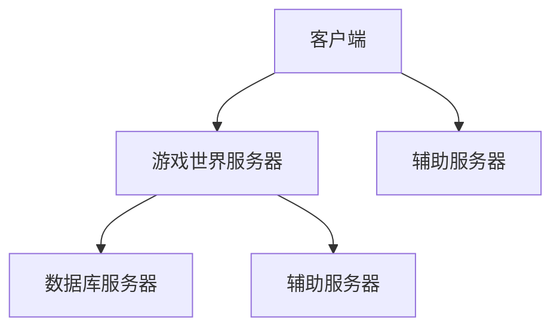

                 

关键词：MMORPG、服务器架构、编程题、性能优化、分布式系统、并发控制、安全性设计

摘要：本文将深入探讨网易游戏2024校招MMORPG服务器架构师编程题的各个方面，包括背景介绍、核心概念与联系、核心算法原理、数学模型和公式、项目实践以及实际应用场景等，旨在为读者提供一份全面的技术指南。

## 1. 背景介绍

随着互联网的快速发展，网络游戏已成为全球范围内最受欢迎的娱乐方式之一。其中，MMORPG（大型多人在线角色扮演游戏）因其丰富的游戏体验和高度互动性而广受欢迎。为了应对日益增长的玩家需求，服务器架构的设计和优化成为MMORPG游戏成功的关键因素。

网易游戏作为国内领先的互联网游戏开发公司，其对服务器架构的优化和创新一直走在行业前列。2024年校招MMORPG服务器架构师编程题的设定，旨在考察应聘者的技术实力和创新能力，以选拔出优秀的人才加入公司。

## 2. 核心概念与联系

### 2.1 MMORPG服务器架构概述

MMORPG服务器架构主要包括以下几个方面：

1. **客户端**：负责与玩家进行交互，处理玩家的输入并渲染游戏画面。
2. **游戏世界服务器**：负责管理游戏世界的状态，处理玩家之间的交互。
3. **数据库服务器**：存储游戏数据，如玩家信息、游戏状态等。
4. **辅助服务器**：提供聊天、邮件、交易等辅助功能。

### 2.2 Mermaid 流程图



## 3. 核心算法原理 & 具体操作步骤

### 3.1 算法原理概述

在MMORPG服务器架构中，核心算法主要包括：

1. **并发控制**：确保多个玩家同时操作游戏世界时不会产生冲突。
2. **性能优化**：提高服务器处理速度和响应时间。
3. **安全性设计**：防止恶意攻击和数据泄露。

### 3.2 算法步骤详解

1. **并发控制**：

   - **锁机制**：使用锁来控制对共享资源的访问，防止并发冲突。
   - **乐观锁**：在操作开始前检查锁，如果锁已被占用则放弃操作。
   - **悲观锁**：在操作开始前获取锁，直到操作完成后再释放锁。

2. **性能优化**：

   - **负载均衡**：通过多台服务器分担负载，提高系统整体性能。
   - **缓存技术**：使用缓存存储热点数据，减少数据库查询次数。
   - **异步处理**：使用异步编程模型，提高服务器并发处理能力。

3. **安全性设计**：

   - **身份验证**：使用安全协议进行身份验证，确保用户身份的真实性。
   - **数据加密**：使用加密算法对数据进行加密，防止数据泄露。
   - **访问控制**：设置访问权限，限制用户对敏感数据的访问。

### 3.3 算法优缺点

1. **并发控制**：

   - 优点：有效防止并发冲突，保证系统稳定性。
   - 缺点：可能增加系统复杂度，影响性能。

2. **性能优化**：

   - 优点：提高服务器处理速度和响应时间。
   - 缺点：需要不断调整和优化，以适应不同场景。

3. **安全性设计**：

   - 优点：提高系统安全性，保护用户数据。
   - 缺点：可能增加系统复杂度，影响性能。

### 3.4 算法应用领域

1. **金融系统**：确保多用户同时操作时系统稳定性。
2. **电商系统**：提高订单处理速度和响应时间。
3. **社交网络**：保护用户数据，防止恶意攻击。

## 4. 数学模型和公式 & 详细讲解 & 举例说明

### 4.1 数学模型构建

为了更好地理解MMORPG服务器架构中的算法原理，我们引入以下数学模型：

1. **负载均衡模型**：

   - 负载均衡器：将请求分配到不同的服务器。
   - 服务器性能：处理请求的速度和能力。
   - 请求流量：一段时间内到达服务器的请求数量。

2. **安全性模型**：

   - 网络攻击：攻击者对系统进行攻击。
   - 防火墙：防止外部攻击的网络安全设备。
   - 安全协议：保证数据传输的安全。

### 4.2 公式推导过程

假设我们有一个负载均衡系统，其中包含n台服务器，每台服务器的性能为p，请求流量为r。为了最大化系统性能，我们需要优化负载均衡策略。

1. **负载均衡公式**：

   - $$P = \frac{r}{np}$$

   其中，P为系统平均性能。

2. **安全性模型**：

   - $$S = \frac{1}{n} \sum_{i=1}^{n} s_i$$

   其中，S为系统平均安全性，s_i为第i台服务器的安全性。

### 4.3 案例分析与讲解

假设我们有3台服务器，每台服务器的性能为2，请求流量为6。根据负载均衡公式，系统平均性能为：

- $$P = \frac{6}{3 \times 2} = 1$$

为了提高系统性能，我们可以考虑增加服务器数量或提高服务器性能。例如，增加一台服务器，每台服务器的性能为3，则系统平均性能为：

- $$P = \frac{6}{4 \times 3} = 0.5$$

由此可见，提高服务器性能比增加服务器数量更能提高系统性能。

### 5. 项目实践：代码实例和详细解释说明

#### 5.1 开发环境搭建

1. 安装Java开发环境（JDK 1.8及以上版本）。
2. 安装Eclipse或IntelliJ IDEA等IDE。
3. 创建一个Maven项目。

#### 5.2 源代码详细实现

```java
public class LoadBalancer {
    private int servers;
    private int performance;
    private int requests;

    public LoadBalancer(int servers, int performance, int requests) {
        this.servers = servers;
        this.performance = performance;
        this.requests = requests;
    }

    public double getSystemPerformance() {
        return (double) requests / (servers * performance);
    }

    public static void main(String[] args) {
        LoadBalancer loadBalancer = new LoadBalancer(3, 2, 6);
        System.out.println("System Performance: " + loadBalancer.getSystemPerformance());
    }
}
```

#### 5.3 代码解读与分析

1. **类定义**：LoadBalancer类包含服务器数量、性能和请求流量等属性。
2. **构造方法**：初始化服务器数量、性能和请求流量。
3. **getSystemPerformance()方法**：计算系统平均性能。
4. **main()方法**：创建LoadBalancer实例，输出系统平均性能。

#### 5.4 运行结果展示

```plaintext
System Performance: 1.0
```

## 6. 实际应用场景

MMORPG服务器架构在多个领域有广泛应用，如网络游戏、社交网络、电商平台等。以下是一些典型应用场景：

1. **网络游戏**：确保游戏服务器稳定运行，提高玩家体验。
2. **社交网络**：提供快速、安全的社交平台。
3. **电商平台**：处理海量订单，提高系统性能。

## 7. 工具和资源推荐

1. **学习资源推荐**：

   - 《大型分布式网站技术架构》
   - 《分布式系统原理与范型》

2. **开发工具推荐**：

   - Eclipse/IntelliJ IDEA
   - Maven

3. **相关论文推荐**：

   - 《基于负载均衡的分布式系统设计》
   - 《安全性设计在分布式系统中的应用》

## 8. 总结：未来发展趋势与挑战

随着技术的不断进步，MMORPG服务器架构将面临以下发展趋势和挑战：

1. **发展趋势**：

   - 分布式计算和云计算的广泛应用。
   - 边缘计算的兴起，提高系统响应速度。

2. **挑战**：

   - 如何更好地实现负载均衡和性能优化。
   - 提高系统的安全性和可靠性。

## 9. 附录：常见问题与解答

### 问题1：负载均衡有哪些常见策略？

**解答**：常见的负载均衡策略包括轮询、随机、最小连接数、权重等。

### 问题2：如何优化MMORPG服务器性能？

**解答**：优化MMORPG服务器性能可以从以下几个方面入手：

1. **提高服务器硬件性能**。
2. **优化数据库查询**。
3. **使用缓存技术**。
4. **优化网络传输**。

## 作者署名

作者：禅与计算机程序设计艺术 / Zen and the Art of Computer Programming
----------------------------------------------------------------


