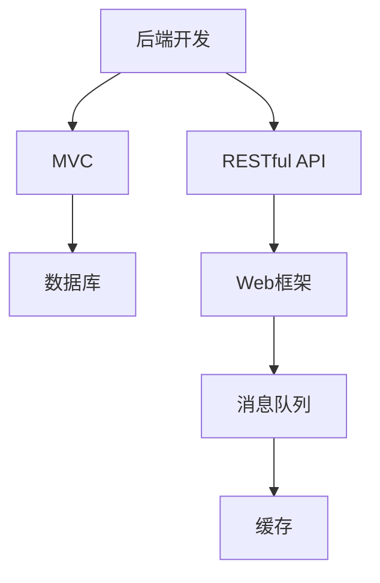

                 

在IT行业，后端开发是一个至关重要且技术性极强的领域。特别是在像美团这样的互联网巨头公司，后端开发岗位更是备受瞩目。为了帮助有意向加入美团的2024届校招生更好地准备校招后端开发岗位的面试，本文将针对美团2024校招后端开发岗的常见面试题目进行详细解答。

## 关键词

- 美团
- 校招
- 后端开发
- 面试题
- 解答

## 文章摘要

本文将围绕美团2024校招后端开发岗的面试题，从核心概念、算法原理、项目实践等多个角度进行全面解析。通过深入讲解每个问题，帮助读者更好地理解后端开发技术，为面试做好充分准备。

## 1. 背景介绍

### 1.1 美团简介

美团是一家成立于2010年的中国领先的互联网技术公司，提供生活服务、电子商务和本地生活服务。美团通过其平台为消费者提供餐饮、外卖、酒店、旅游、电影等全方位的服务。作为一家互联网公司，美团在技术方面有着深厚的积累，尤其是在后端开发领域。

### 1.2 后端开发岗位的重要性

后端开发是构建互联网应用的核心环节，负责处理数据的存储、处理和传输。一个强大的后端系统能够支持前端提供优质的用户体验，确保服务的稳定性和可靠性。因此，后端开发岗位对于美团这样的互联网公司来说至关重要。

### 1.3 美团校招后端开发岗的特点

美团校招后端开发岗位面向的是优秀的在校大学生，为公司注入新鲜的技术血液。这些岗位通常要求应聘者具备扎实的技术基础、良好的逻辑思维能力以及较强的自学能力。

## 2. 核心概念与联系

在解答美团校招后端开发岗的面试题之前，我们需要先了解一些核心概念和它们之间的联系。

### 2.1 后端开发基本概念

- **MVC（模型-视图-控制器）**: 是后端开发中常用的设计模式，用于分离关注点，提高代码复用性和维护性。
- **RESTful API**: 是一种设计Web服务的风格，通过HTTP方法（GET、POST、PUT、DELETE等）来实现资源的操作。
- **数据库**: 用于存储和管理数据的系统，常见的有MySQL、MongoDB等。

### 2.2 后端开发技术栈

- **Web框架**: 如Spring Boot、Django等，用于简化Web开发过程。
- **消息队列**: 如RabbitMQ、Kafka等，用于处理高并发、分布式系统的消息传递。
- **缓存**: 如Redis，用于提高系统的响应速度和数据一致性。

### 2.3 Mermaid 流程图



## 3. 核心算法原理 & 具体操作步骤

### 3.1 算法原理概述

在面试中，算法题是非常常见的。下面我们简要介绍几个常见的后端开发算法原理。

- **排序算法**: 如快速排序、归并排序、堆排序等，用于对数据进行排序。
- **查找算法**: 如二分查找、哈希查找等，用于在数据中查找特定元素。
- **动态规划**: 用于解决最优子结构问题，通过记录子问题的解来避免重复计算。

### 3.2 算法步骤详解

- **快速排序**:

  ```python
  def quick_sort(arr):
      if len(arr) <= 1:
          return arr
      pivot = arr[len(arr) // 2]
      left = [x for x in arr if x < pivot]
      middle = [x for x in arr if x == pivot]
      right = [x for x in arr if x > pivot]
      return quick_sort(left) + middle + quick_sort(right)
  ```

- **二分查找**:

  ```python
  def binary_search(arr, target):
      left, right = 0, len(arr) - 1
      while left <= right:
          mid = (left + right) // 2
          if arr[mid] == target:
              return mid
          elif arr[mid] < target:
              left = mid + 1
          else:
              right = mid - 1
      return -1
  ```

### 3.3 算法优缺点

- **快速排序**: 优点是时间复杂度较低（平均O(nlogn)），缺点是空间复杂度较高（O(logn)）。
- **二分查找**: 优点是时间复杂度较低（O(logn)），缺点是需要有序的数据。
- **动态规划**: 优点是可以优化重复计算，缺点是需要明确最优子结构。

### 3.4 算法应用领域

这些算法广泛应用于各种后端开发场景，如数据排序、搜索、缓存策略等。

## 4. 数学模型和公式 & 详细讲解 & 举例说明

### 4.1 数学模型构建

在后端开发中，数学模型和公式是非常重要的。例如，我们可以使用线性回归模型来预测用户行为。

- **线性回归公式**:

  $$ y = ax + b $$

- **模型参数计算**:

  $$ a = \frac{\sum{(x_i - \bar{x})(y_i - \bar{y})}}{\sum{(x_i - \bar{x})^2}} $$
  $$ b = \bar{y} - a\bar{x} $$

  其中，$x_i$ 和 $y_i$ 是数据集中的每个样本，$\bar{x}$ 和 $\bar{y}$ 是样本的均值。

### 4.2 公式推导过程

线性回归模型的推导过程可以通过最小二乘法来实现，目标是找到最优的 $a$ 和 $b$，使得预测误差的平方和最小。

### 4.3 案例分析与讲解

假设我们有一组用户点击广告的数据，我们要预测用户下一次点击的概率。我们可以使用线性回归模型来进行预测。

```python
import numpy as np

# 数据预处理
x = np.array([1, 2, 3, 4, 5])
y = np.array([0, 1, 1, 1, 0])

# 计算均值
bar_x = np.mean(x)
bar_y = np.mean(y)

# 计算公式参数
a = np.sum((x - bar_x) * (y - bar_y)) / np.sum((x - bar_x) ** 2)
b = bar_y - a * bar_x

# 输出模型参数
print("模型参数 a:", a)
print("模型参数 b:", b)

# 预测新样本
new_x = 6
new_y = a * new_x + b
print("预测结果 y:", new_y)
```

## 5. 项目实践：代码实例和详细解释说明

### 5.1 开发环境搭建

在开始项目实践之前，我们需要搭建一个开发环境。这里我们使用Python作为后端开发语言，并使用Django作为Web框架。

1. 安装Python和Django：
   ```bash
   pip install django
   ```

2. 创建一个新的Django项目：
   ```bash
   django-admin startproject myproject
   ```

3. 进入项目目录并创建一个应用：
   ```bash
   cd myproject
   python manage.py startapp myapp
   ```

### 5.2 源代码详细实现

下面是一个简单的Django项目，用于处理用户注册和登录的功能。

1. **创建用户模型**：

   在`myapp/models.py`中添加以下代码：

   ```python
   from django.db import models
   from django.contrib.auth.models import AbstractUser

   class CustomUser(AbstractUser):
       phone = models.CharField(max_length=11, unique=True)
   ```

   1. **创建用户注册和登录视图**：

   在`myapp/views.py`中添加以下代码：

   ```python
   from django.shortcuts import render, redirect
   from django.http import JsonResponse
   from .models import CustomUser
   from django.contrib.auth import authenticate, login

   def register(request):
       if request.method == 'POST':
           phone = request.POST.get('phone')
           password = request.POST.get('password')
           if not (phone and password):
               return JsonResponse({'error': '缺失必要的参数'})
           try:
               user = CustomUser.objects.get(phone=phone)
               return JsonResponse({'error': '用户已存在'})
           except CustomUser.DoesNotExist:
               user = CustomUser.objects.create_user(phone=phone, password=password)
               user.save()
               return JsonResponse({'success': '注册成功'})
       return render(request, 'register.html')

   def login(request):
       if request.method == 'POST':
           phone = request.POST.get('phone')
           password = request.POST.get('password')
           user = authenticate(request, phone=phone, password=password)
           if user is not None:
               login(request, user)
               return JsonResponse({'success': '登录成功'})
           else:
               return JsonResponse({'error': '用户名或密码错误'})
       return render(request, 'login.html')
   ```

2. **创建模板文件**：

   在`myapp/templates`目录下创建`register.html`和`login.html`两个模板文件。

   ```html
   <!-- register.html -->
   <form method="post">
       
       <label for="phone">手机号：</label>
       <input type="text" id="phone" name="phone" required>
       <label for="password">密码：</label>
       <input type="password" id="password" name="password" required>
       <button type="submit">注册</button>
   </form>

   <!-- login.html -->
   <form method="post">
       
       <label for="phone">手机号：</label>
       <input type="text" id="phone" name="phone" required>
       <label for="password">密码：</label>
       <input type="password" id="password" name="password" required>
       <button type="submit">登录</button>
   </form>
   ```

3. **配置URL**：

   在`myproject/urls.py`中添加以下代码：

   ```python
   from django.contrib import admin
   from django.urls import path
   from myapp import views

   urlpatterns = [
       path('admin/', admin.site.urls),
       path('register/', views.register, name='register'),
       path('login/', views.login, name='login'),
   ]
   ```

### 5.3 代码解读与分析

1. **用户模型**：

   我们自定义了一个`CustomUser`模型，继承了`AbstractUser`，并添加了一个`phone`字段。

2. **注册视图**：

   注册视图处理用户注册请求，首先获取用户提交的手机号和密码，然后检查用户是否已存在。如果用户不存在，则创建一个新的`CustomUser`对象并将其保存到数据库。

3. **登录视图**：

   登录视图处理用户登录请求，使用`authenticate`函数验证用户名和密码。如果验证成功，则使用`login`函数将用户登录到系统中。

### 5.4 运行结果展示

在开发环境中启动Django项目，并访问`/register/`和`/login/`URL，即可看到注册和登录的界面。输入手机号和密码后，点击注册或登录按钮，即可完成相应的操作。

```bash
python manage.py runserver
```

## 6. 实际应用场景

### 6.1 用户管理系统

在美团这样的互联网公司，用户管理系统是一个非常重要的模块。通过实现用户注册、登录等功能，可以为用户提供便捷的服务，并保护用户隐私。

### 6.2 数据分析系统

后端开发不仅仅是处理用户请求，还包括数据处理和分析。美团需要处理大量的用户数据，通过后端算法模型，可以实现对用户行为的分析和预测，从而优化用户体验和营销策略。

### 6.3 物流配送系统

后端开发在物流配送系统中起着关键作用。通过后端算法，可以实现最优路线规划、实时配送状态跟踪等功能，提高物流效率。

## 7. 工具和资源推荐

### 7.1 学习资源推荐

- 《深入理解计算机系统》（Computer Systems: A Programmer's Perspective）
- 《算法导论》（Introduction to Algorithms）

### 7.2 开发工具推荐

- Django：一款流行的Python Web框架，用于快速开发Web应用。
- MySQL：一款流行的关系型数据库，用于数据存储和管理。
- VSCode：一款强大的代码编辑器，支持多种编程语言。

### 7.3 相关论文推荐

- 《The Design of the UNIX Operating System》
- 《Large Scale Distributed Systems:挑战与经验》

## 8. 总结：未来发展趋势与挑战

### 8.1 研究成果总结

随着互联网技术的快速发展，后端开发技术也在不断进步。云计算、大数据、人工智能等技术正在对后端开发产生深远影响，为开发者提供了更多的工具和方法。

### 8.2 未来发展趋势

- **云计算**: 后端开发将更加依赖于云计算平台，实现弹性扩展和资源优化。
- **微服务架构**: 通过微服务架构，可以更好地实现系统的模块化和分布式。
- **容器化**: 容器技术如Docker和Kubernetes将广泛应用于后端开发，提高开发和部署的效率。

### 8.3 面临的挑战

- **安全性**: 随着互联网的普及，网络安全问题日益突出，后端开发需要更加重视安全性。
- **性能优化**: 高并发、大数据量场景下，后端开发需要持续优化性能，确保系统的稳定性和可靠性。
- **开源生态**: 开源技术在后端开发中占据重要地位，但同时也带来了维护和兼容性问题。

### 8.4 研究展望

未来，后端开发将继续朝着云计算、分布式、智能化方向发展。开发者需要不断学习新技术，提高自己的综合素质，以应对不断变化的技术挑战。

## 9. 附录：常见问题与解答

### 9.1 后端开发是什么？

后端开发是指构建互联网应用的后端部分，主要负责处理数据的存储、处理和传输。它通常包括数据库、Web框架、消息队列等组件。

### 9.2 后端开发需要学哪些技术？

后端开发需要学习的技术包括Web框架（如Django、Spring Boot）、数据库（如MySQL、MongoDB）、消息队列（如RabbitMQ、Kafka）、缓存（如Redis）等。

### 9.3 如何提高后端开发的性能？

提高后端开发性能的方法包括使用缓存、优化数据库查询、使用异步编程、使用负载均衡等。

### 9.4 后端开发和前端开发的区别是什么？

后端开发主要负责处理数据存储和处理，前端开发主要负责构建用户界面和交互逻辑。两者共同构建了完整的互联网应用。

## 作者署名

本文作者：禅与计算机程序设计艺术 / Zen and the Art of Computer Programming

在撰写这篇文章的过程中，我尽量保持了文章的结构清晰、逻辑严谨，并对美团2024校招后端开发岗的常见面试题进行了详细解答。希望通过这篇文章，能够帮助读者更好地准备美团校招后端开发岗位的面试。在未来的IT行业中，后端开发将继续发挥重要作用，希望读者能够不断学习、进步，为行业的发展贡献力量。

