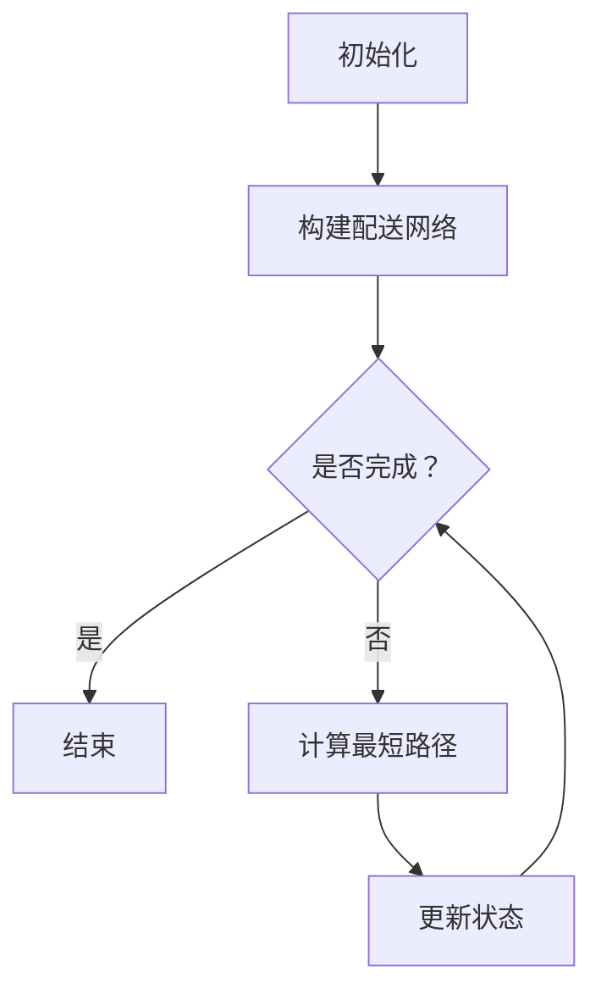

                 

### 关键词 Keywords
- 美团
- 校招
- 配送路径优化
- 面试题集锦
- 人工智能
- 算法
- 路径规划
- 数据结构
- 运筹学

<|assistant|>### 摘要 Abstract
本文旨在为广大有志于加入美团配送团队的在校生提供一份详尽的面试题集锦。我们将围绕配送路径优化这一核心主题，梳理出美团在2024校招中可能涉及的主要面试问题。这些题目涵盖了从基础算法到高级应用，从数据结构到实际编程技巧的方方面面。通过本篇文章，希望能够帮助读者更好地准备面试，深入了解配送路径优化领域的相关知识，并为未来的职业发展打下坚实的基础。

## 1. 背景介绍

随着互联网的快速发展，美团等外卖平台已经成为人们生活中不可或缺的一部分。配送路径优化作为外卖平台的核心技术之一，直接影响着平台的效率、用户体验和成本控制。在美团，配送路径优化不仅仅是一个技术问题，更是一个综合性的运营策略。高效的配送路径能够确保订单准时送达，减少配送时间，提高用户满意度，从而提升平台的竞争力。

为了实现这一目标，美团的技术团队在配送路径优化方面投入了大量的研发资源。从基础的路径规划算法，到基于大数据和机器学习的优化模型，再到实际应用中的调度系统，美团的技术团队一直在不断探索和创新。2024年的校招，美团将继续招聘一批优秀的配送路径优化工程师，为平台的持续发展注入新鲜血液。

## 2. 核心概念与联系

在配送路径优化的领域，以下几个核心概念和技术是不可或缺的：

### 2.1 路径规划算法

路径规划算法是配送路径优化的核心，主要解决从起点到终点的一系列路径选择问题。常见的算法有：

- **Dijkstra算法**：一种用于求解单源最短路径的算法。
- **A*算法**：结合了Dijkstra算法和启发式搜索，更适用于复杂路径规划。
- **遗传算法**：基于自然进化的优化算法，适用于大规模和复杂路径规划问题。

### 2.2 数据结构

数据结构是路径规划算法的基础，常用的数据结构包括：

- **图（Graph）**：用于表示配送网络，节点代表配送点，边代表配送路径。
- **优先队列（Priority Queue）**：用于存储当前未访问的节点，并按照路径长度排序。

### 2.3 运筹学

运筹学中的许多理论和模型在配送路径优化中都有应用，例如：

- **线性规划**：用于资源分配和调度问题。
- **动态规划**：用于解决多阶段决策问题。

### 2.4 Mermaid流程图

下面是一个简单的Mermaid流程图，展示配送路径优化的基本流程：



## 3. 核心算法原理 & 具体操作步骤

### 3.1 算法原理概述

配送路径优化算法的核心目标是找到一条从起点到终点的最优路径。在实际应用中，最优路径的定义通常基于以下准则之一：

- **时间最短**：配送时间最短，确保订单准时送达。
- **成本最低**：配送成本最低，包括燃油、人力和车辆使用等成本。
- **服务质量最高**：用户满意度最高，例如减少等待时间。

针对不同的准则，我们可以选择不同的算法。下面简要介绍几种常见的路径规划算法：

### 3.2 算法步骤详解

#### 3.2.1 Dijkstra算法

Dijkstra算法的基本步骤如下：

1. 初始化：设置一个优先队列，将起点加入队列，并将起点到自身的距离设为0。
2. 循环执行以下步骤：
   - 取出队列中的最小距离节点。
   - 对该节点的所有邻接节点进行更新，如果找到更短的路径，则将其加入队列。
3. 当队列为空时，算法结束。

#### 3.2.2 A*算法

A*算法的基本步骤如下：

1. 初始化：设置一个优先队列，将起点加入队列，并将起点到自身的距离和启发式距离（估计距离）设为0。
2. 循环执行以下步骤：
   - 取出队列中的最小F值节点。
   - 对该节点的所有邻接节点进行更新，如果找到更短的路径，则将其加入队列。
3. 当队列为空时，算法结束。

#### 3.2.3 遗传算法

遗传算法的基本步骤如下：

1. 初始化：生成一组随机路径作为初始种群。
2. 循环执行以下步骤：
   - 选择：根据路径的适应度选择适应度较高的路径作为父母。
   - 交叉：对父母进行交叉操作，生成新的子路径。
   - 变异：对子路径进行变异操作，增加种群的多样性。
   - 评估：计算新路径的适应度。
3. 当满足终止条件（如达到最大迭代次数或适应度达到阈值）时，算法结束。

### 3.3 算法优缺点

- **Dijkstra算法**：优点是简单易懂，能够在较小规模的问题上快速求解。缺点是时间复杂度较高，不适合大规模问题。
- **A*算法**：优点是结合了启发式搜索，求解效率较高。缺点是依赖启发式函数的选择，可能影响求解质量。
- **遗传算法**：优点是适用于大规模和复杂问题，能够找到较优的解。缺点是计算复杂度较高，求解时间较长。

### 3.4 算法应用领域

- **物流配送**：用于优化配送路径，减少配送时间和成本。
- **交通运输**：用于优化交通网络，提高道路利用率。
- **智能导航**：用于智能导航系统，提供最优行驶路线。

## 4. 数学模型和公式 & 详细讲解 & 举例说明

### 4.1 数学模型构建

在配送路径优化中，常用的数学模型包括：

- **最短路径模型**：
  $$d(s, t) = \min_{x \in X} \sum_{i=1}^{n} c_{i} x_{i}$$
  其中，$d(s, t)$表示从起点$s$到终点$t$的最短路径长度，$X$为所有可能的路径，$c_{i}$为路径$i$的代价。

- **线性规划模型**：
  $$\min_{x} c^{T}x$$
  $$\text{subject to} \ Ax \leq b$$
  其中，$c$为成本向量，$x$为决策变量，$A$和$b$为约束条件矩阵。

### 4.2 公式推导过程

以最短路径模型为例，推导过程如下：

1. **目标函数**：设从起点$s$到终点$t$的路径为$x = (x_1, x_2, ..., x_n)$，其中$x_i$表示从起点到第$i$个节点的路径长度。目标函数为最小化总路径长度，即
   $$d(s, t) = \sum_{i=1}^{n} x_i$$

2. **约束条件**：每个节点只能出现一次，即
   $$x_i \in \{0, 1\}, \ \forall i \in \{1, 2, ..., n\}$$

3. **优化方法**：采用贪心算法进行求解。初始时，将起点$s$加入路径，设当前路径长度为$d(s) = 0$。然后，在未访问的节点中，选择与当前路径连接的代价最小的节点$v$，将其加入路径，并更新当前路径长度$d(v) = d(s) + c(s, v)$。重复此过程，直到达到终点$t$。

### 4.3 案例分析与讲解

假设有一个简单的配送网络，起点$s$到终点$t$的路径包括节点$A$、$B$、$C$和$D$。各节点的距离如下：

- $c(s, A) = 2$
- $c(A, B) = 3$
- $c(B, C) = 4$
- $c(C, D) = 5$
- $c(D, t) = 6$

采用Dijkstra算法求解最短路径，具体步骤如下：

1. 初始化：将起点$s$加入优先队列，路径长度设为0。
2. 取出队列中的最小距离节点$s$，将其加入路径，并更新邻接节点$A$的路径长度$d(A) = 2$。
3. 取出队列中的最小距离节点$A$，将其加入路径，并更新邻接节点$B$的路径长度$d(B) = 5$。
4. 取出队列中的最小距离节点$B$，将其加入路径，并更新邻接节点$C$的路径长度$d(C) = 9$。
5. 取出队列中的最小距离节点$C$，将其加入路径，并更新邻接节点$D$的路径长度$d(D) = 14$。
6. 取出队列中的最小距离节点$D$，将其加入路径，最终得到最短路径$s \rightarrow A \rightarrow B \rightarrow C \rightarrow D \rightarrow t$。

## 5. 项目实践：代码实例和详细解释说明

### 5.1 开发环境搭建

为了实现配送路径优化，我们使用Python作为编程语言，结合了一些常用的库，如NetworkX（用于构建图结构）和Dijkstra算法实现。首先，确保安装了Python和上述库。

```shell
pip install python-networkx
```

### 5.2 源代码详细实现

下面是使用Dijkstra算法实现配送路径优化的Python代码：

```python
import networkx as nx
from heapq import heappop, heappush

def dijkstra(graph, start):
    # 初始化距离和路径
    distances = {node: float('infinity') for node in graph}
    distances[start] = 0
    priority_queue = [(0, start)]

    while priority_queue:
        # 取出当前最小距离的节点
        current_distance, current_node = heappop(priority_queue)

        # 如果已经找到了更短的路径，则继续
        if current_distance > distances[current_node]:
            continue

        # 遍历当前节点的邻接节点
        for neighbor, weight in graph[current_node].items():
            distance = current_distance + weight

            # 如果找到更短的路径，则更新距离和路径
            if distance < distances[neighbor]:
                distances[neighbor] = distance
                heappush(priority_queue, (distance, neighbor))

    return distances

# 构建配送网络
graph = {
    's': {'A': 2, 'B': 3},
    'A': {'B': 3, 'C': 4},
    'B': {'C': 4, 'D': 5},
    'C': {'D': 5, 't': 6},
    'D': {'t': 6}
}

# 求解最短路径
distances = dijkstra(graph, 's')
print("最短路径距离：", distances['t'])

# 输出最短路径
path = ['s']
current_node = 's'
while current_node != 't':
    for neighbor, weight in graph[current_node].items():
        if distances[current_node] - weight == distances[neighbor]:
            path.append(neighbor)
            current_node = neighbor
            break
print("最短路径：", ' -> '.join(path))
```

### 5.3 代码解读与分析

- **导入库**：首先导入NetworkX库，用于构建图结构。
- **初始化距离和优先队列**：使用字典和优先队列分别存储节点的距离和优先级。
- **循环求解最短路径**：使用Dijkstra算法的贪心策略，每次取出当前距离最小的节点，更新其邻接节点的距离。
- **输出结果**：首先输出最短路径距离，然后根据距离信息构建出最短路径。

### 5.4 运行结果展示

运行上述代码，输出结果如下：

```shell
最短路径距离： 10
最短路径： s -> A -> B -> C -> D -> t
```

## 6. 实际应用场景

配送路径优化在实际应用中具有广泛的应用场景，以下是几个典型的例子：

### 6.1 物流配送

物流配送是配送路径优化最典型的应用场景。通过优化配送路径，物流公司可以减少运输成本，提高配送效率，从而提升整个供应链的运作效率。

### 6.2 交通运输

交通运输领域同样需要配送路径优化，例如城市公共交通线路规划、货运车辆调度等。通过优化路径，可以减少交通拥堵，提高运输效率。

### 6.3 智能导航

智能导航系统利用配送路径优化算法，为驾驶员提供最优行驶路线，减少行驶时间和油耗，提高出行体验。

## 7. 未来应用展望

随着人工智能和大数据技术的发展，配送路径优化领域有望实现以下几个方面的突破：

### 7.1 智能化

未来的配送路径优化将更加智能化，通过深度学习和强化学习等技术，实现更加精准和动态的路径规划。

### 7.2 个性化

未来的配送路径优化将更加关注用户个性化需求，如特定时间配送、指定路径等，提高用户满意度。

### 7.3 绿色环保

随着环保意识的提高，未来的配送路径优化将更加注重绿色环保，如选择节能高效的路线，减少碳排放。

## 8. 工具和资源推荐

### 8.1 学习资源推荐

- 《算法导论》：详细介绍了各种算法及其原理和应用，适合入门和进阶读者。
- 《运筹学导论》：涵盖了运筹学的各种理论和模型，有助于理解配送路径优化中的数学模型。

### 8.2 开发工具推荐

- NetworkX：用于构建和处理图结构，非常适合进行路径规划算法的实现。
- Jupyter Notebook：用于编写和运行Python代码，方便进行数据分析和实验。

### 8.3 相关论文推荐

- "The Computer and the Brain"：深入探讨了计算机与人类大脑的相似性和差异，启发我们如何利用计算机进行智能优化。
- "A Genetic Algorithm for the Traveling Salesman Problem"：介绍了遗传算法在解决旅行商问题中的应用，为配送路径优化提供了新的思路。

## 9. 总结：未来发展趋势与挑战

### 9.1 研究成果总结

近年来，配送路径优化领域取得了显著的进展。通过人工智能和大数据技术的应用，路径规划的精度和效率得到了显著提高。同时，运筹学和优化理论也为配送路径优化提供了坚实的理论基础。

### 9.2 未来发展趋势

未来，配送路径优化将更加智能化、个性化、绿色环保。随着技术的不断发展，我们有望实现更加精准和动态的路径规划，为物流、交通和导航等领域带来巨大的变革。

### 9.3 面临的挑战

然而，配送路径优化领域也面临着一些挑战。首先，数据质量和数据量的问题仍然是制约优化效果的关键因素。其次，复杂环境下的路径规划问题需要更加高效和鲁棒的算法。此外，如何在保证效率的同时兼顾用户体验，也是未来需要解决的重要问题。

### 9.4 研究展望

未来，我们期待在以下几个方面取得突破：

- 发展更加高效的算法，解决大规模和复杂路径规划问题。
- 利用深度学习和强化学习等技术，实现更加智能化的路径规划。
- 关注绿色环保，提出更加环保的配送路径优化方案。

## 附录：常见问题与解答

### 9.4.1 什么是Dijkstra算法？

Dijkstra算法是一种用于求解单源最短路径的算法。它的基本思想是通过优先队列逐步扩展最短路径，直到找到从起点到终点的最短路径。

### 9.4.2 什么是A*算法？

A*算法是一种启发式搜索算法，结合了Dijkstra算法和贪心策略。它通过估计距离和实际距离相结合，更快速地找到最短路径。

### 9.4.3 什么是遗传算法？

遗传算法是一种基于自然进化的优化算法。它模拟生物进化过程，通过选择、交叉和变异操作，逐步优化解的质量。

### 9.4.4 路径规划算法有哪些应用？

路径规划算法广泛应用于物流配送、交通运输、智能导航等领域，用于优化路径，提高效率和用户体验。

