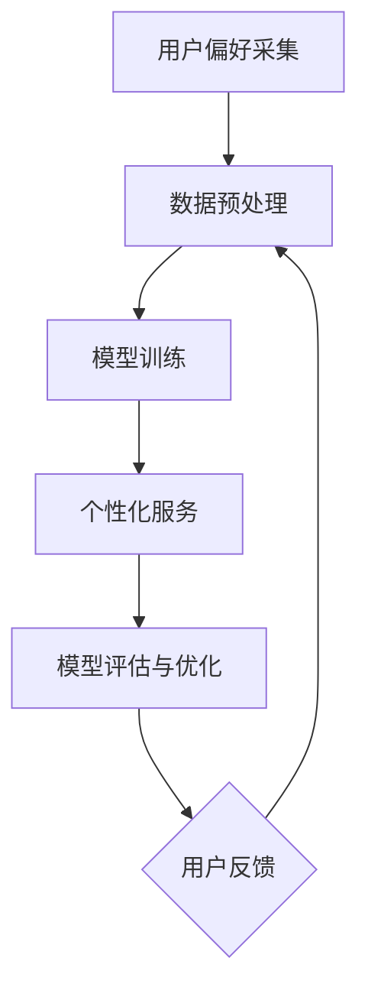

                 

随着人工智能技术的不断进步，聊天机器人已经成为了日常沟通中不可或缺的一部分。无论是客服、朋友、还是助理，聊天机器人的使用已经变得十分普遍。然而，每个用户都有自己独特的偏好和需求，因此如何让聊天机器人根据用户偏好进行个性化定制，成为了人工智能领域中的一个重要课题。

本文将围绕聊天机器人个性化定制这一主题展开讨论，首先介绍聊天机器人发展的背景和现状，然后深入探讨个性化定制的核心概念和实现方法，接着详细讲解相关算法原理、数学模型和具体实现步骤，并通过实际项目实践展示个性化定制的应用效果，最后讨论个性化定制在未来的发展趋势和面临的挑战。

## 1. 背景介绍

### 1.1 聊天机器人发展背景

聊天机器人的概念起源于20世纪50年代，当时计算机科学家艾伦·图灵提出了著名的图灵测试，用以评估机器是否具有人类水平的智能。随着计算机技术的不断发展，聊天机器人逐渐从理论走向实践，并在21世纪初迎来了快速发展的机遇。

互联网的普及和移动设备的普及使得人们越来越依赖于即时通讯工具进行沟通。而聊天机器人的出现，满足了人们对于即时、高效、智能沟通的需求。最初，聊天机器人主要用于客服领域，后来逐渐扩展到了个人助理、教育、娱乐等多个领域。

### 1.2 聊天机器人现状

当前，聊天机器人在各个领域都有广泛的应用。例如，客服机器人可以在短时间内处理大量客户咨询，提高客服效率；个人助理机器人可以帮助用户管理日程、提醒事项、提供天气预报等信息；教育机器人则可以为学生提供个性化的学习辅导。

然而，尽管聊天机器人已经取得了显著的成果，但大部分机器人仍然存在一个共同的问题：缺乏个性化。大多数聊天机器人只能提供固定模式的服务，无法根据用户的实际需求进行个性化调整。这限制了聊天机器人的应用范围和用户体验。

### 1.3 个性化定制的重要性

个性化定制是提升聊天机器人用户体验的关键。通过个性化定制，聊天机器人可以更好地理解用户的偏好和需求，提供更加精准、贴心的服务。例如，对于一个喜欢体育的用户，聊天机器人可以主动推送体育新闻和赛事信息；对于一个喜欢旅游的用户，聊天机器人可以提供旅游攻略和景点推荐。

个性化定制的实现不仅可以提升用户体验，还可以为聊天机器人开辟新的应用场景。通过深入了解用户需求，聊天机器人可以在医疗、金融、教育等领域发挥更大的作用，提供更加专业、个性化的服务。

## 2. 核心概念与联系

### 2.1 个性化定制的核心概念

个性化定制涉及到多个核心概念，包括用户偏好、数据采集、算法模型等。这些概念相互关联，共同构成了个性化定制的实现框架。

#### 2.1.1 用户偏好

用户偏好是指用户对于某些特定事物的喜好和倾向。在聊天机器人个性化定制中，用户偏好是核心数据来源，决定了聊天机器人的服务方向和内容。用户偏好可以通过多种途径进行采集，如问卷调查、行为分析等。

#### 2.1.2 数据采集

数据采集是个性化定制的基础。通过采集用户行为数据、兴趣数据、历史数据等，可以构建出用户的偏好模型。数据采集的方法包括前端数据收集、后端数据处理等。

#### 2.1.3 算法模型

算法模型是个性化定制的核心。通过对用户偏好数据的分析，算法模型可以计算出用户的偏好程度，并根据这些偏好为用户提供个性化服务。常见的算法模型包括协同过滤、矩阵分解、决策树等。

### 2.2 个性化定制的实现框架

个性化定制的实现框架可以分为以下几个步骤：

1. 用户偏好采集：通过问卷调查、用户行为分析等方式收集用户偏好数据。
2. 数据预处理：对采集到的数据进行清洗、去重、归一化等处理，以便于后续分析。
3. 模型训练：根据用户偏好数据，训练个性化推荐模型，如协同过滤、矩阵分解等。
4. 个性化服务：根据用户偏好模型，为用户提供个性化服务，如内容推荐、行为预测等。
5. 模型评估与优化：通过用户反馈和实际应用效果，对个性化模型进行评估和优化，以提高个性化服务的准确性。

### 2.3 Mermaid 流程图

下面是聊天机器人个性化定制的 Mermaid 流程图：



## 3. 核心算法原理 & 具体操作步骤

### 3.1 算法原理概述

聊天机器人个性化定制的核心算法主要包括用户偏好采集、数据预处理、模型训练、个性化服务和模型评估与优化等步骤。以下将详细讲解每个步骤的具体原理。

#### 3.1.1 用户偏好采集

用户偏好采集是个性化定制的基础。通过问卷调查、用户行为分析等方式，可以收集到用户的兴趣、行为、历史等偏好数据。这些数据将用于构建用户偏好模型。

#### 3.1.2 数据预处理

数据预处理主要包括数据清洗、去重、归一化等步骤。数据清洗可以去除无效数据、异常数据等；去重可以避免重复数据的影响；归一化可以将不同特征的数据转化为同一尺度，以便于后续分析。

#### 3.1.3 模型训练

模型训练是个性化定制的关键。通过训练用户偏好模型，可以计算出用户的偏好程度，为用户提供个性化服务。常见的模型训练方法包括协同过滤、矩阵分解、决策树等。

#### 3.1.4 个性化服务

个性化服务是根据用户偏好模型为用户提供个性化推荐、行为预测等服务。个性化服务可以显著提升用户体验，提高聊天机器人的实用价值。

#### 3.1.5 模型评估与优化

模型评估与优化是通过用户反馈和实际应用效果对个性化模型进行评估和优化。评估指标包括准确率、召回率、覆盖率等。通过评估和优化，可以提高个性化服务的准确性，提升用户体验。

### 3.2 算法步骤详解

#### 3.2.1 用户偏好采集

用户偏好采集可以通过以下步骤进行：

1. 设计问卷：根据聊天机器人的应用场景，设计包含兴趣、行为、历史等问题的问卷。
2. 发布问卷：将问卷发布到用户群体中，收集用户回答。
3. 数据收集：收集用户问卷数据，进行初步分析。

#### 3.2.2 数据预处理

数据预处理可以通过以下步骤进行：

1. 数据清洗：去除无效数据、异常数据等。
2. 数据去重：去除重复数据。
3. 数据归一化：将不同特征的数据转化为同一尺度。

#### 3.2.3 模型训练

模型训练可以通过以下步骤进行：

1. 数据划分：将数据划分为训练集、验证集和测试集。
2. 模型选择：选择合适的模型，如协同过滤、矩阵分解、决策树等。
3. 模型训练：使用训练集对模型进行训练。
4. 模型评估：使用验证集对模型进行评估，调整模型参数。

#### 3.2.4 个性化服务

个性化服务可以通过以下步骤进行：

1. 数据预处理：对用户输入的数据进行预处理，提取特征。
2. 模型预测：使用训练好的模型对用户输入进行预测。
3. 结果输出：根据预测结果为用户提供个性化服务。

#### 3.2.5 模型评估与优化

模型评估与优化可以通过以下步骤进行：

1. 评估指标：确定评估指标，如准确率、召回率、覆盖率等。
2. 评估结果：计算评估指标，分析模型性能。
3. 优化策略：根据评估结果，调整模型参数或选择新的模型。

### 3.3 算法优缺点

#### 3.3.1 优点

1. 提高用户体验：个性化定制可以根据用户偏好提供个性化服务，提高用户体验。
2. 扩大应用场景：个性化定制可以应用于多个领域，如客服、教育、医疗等，扩大聊天机器人的应用范围。
3. 提高服务效率：通过个性化定制，聊天机器人可以更高效地处理用户请求，提高服务效率。

#### 3.3.2 缺点

1. 数据隐私问题：用户偏好数据的收集和使用可能涉及用户隐私，需要谨慎处理。
2. 模型训练成本：个性化定制需要大量数据支持，模型训练成本较高。
3. 模型泛化能力：个性化定制模型可能存在泛化能力不足的问题，无法适应所有用户需求。

### 3.4 算法应用领域

个性化定制算法可以应用于多个领域，包括：

1. 客服：根据用户偏好提供个性化客服服务，提高客服效率。
2. 教育：根据用户学习偏好提供个性化学习推荐，提高学习效果。
3. 医疗：根据用户健康偏好提供个性化健康建议，提高医疗服务质量。
4. 金融：根据用户投资偏好提供个性化金融产品推荐，提高金融服务满意度。

## 4. 数学模型和公式 & 详细讲解 & 举例说明

### 4.1 数学模型构建

在聊天机器人个性化定制中，常用的数学模型包括协同过滤、矩阵分解、决策树等。以下分别介绍这些模型的构建方法和公式。

#### 4.1.1 协同过滤

协同过滤是一种基于用户相似度的推荐算法，其核心思想是找到与目标用户相似的其他用户，并推荐这些用户喜欢的物品。协同过滤的数学模型可以表示为：

$$
R_{ui} = \sum_{j \in N(u)} w_{uj} \cdot r_{ji}
$$

其中，$R_{ui}$表示用户$u$对物品$i$的评分，$w_{uj}$表示用户$u$与其他用户$j$的相似度，$r_{ji}$表示用户$j$对物品$i$的评分。

#### 4.1.2 矩阵分解

矩阵分解是一种基于隐语义模型的推荐算法，其核心思想是将用户和物品的评分矩阵分解为低维用户特征矩阵和物品特征矩阵。矩阵分解的数学模型可以表示为：

$$
R_{ui} = \hat{Q}_{u} \cdot \hat{P}_{i}
$$

其中，$R_{ui}$表示用户$u$对物品$i$的评分，$\hat{Q}_{u}$表示用户$u$的特征向量，$\hat{P}_{i}$表示物品$i$的特征向量。

#### 4.1.3 决策树

决策树是一种基于特征分量的推荐算法，其核心思想是根据特征分量对用户和物品进行分类。决策树的数学模型可以表示为：

$$
y = g(f(x))
$$

其中，$y$表示用户对物品的评分，$g$表示决策树的分类函数，$f$表示特征分量的计算函数，$x$表示用户和物品的特征向量。

### 4.2 公式推导过程

#### 4.2.1 协同过滤

协同过滤的推导过程如下：

1. 假设用户$u$和用户$v$的相似度为：

$$
w_{uv} = \frac{\sum_{i \in I} r_{ui} \cdot r_{vi}}{\sqrt{\sum_{i \in I} r_{ui}^2} \cdot \sqrt{\sum_{i \in I} r_{vi}^2}}
$$

其中，$I$表示物品集合。

2. 用户$u$对物品$i$的预测评分为：

$$
\hat{r}_{ui} = \sum_{v \in N(u)} w_{uv} \cdot r_{vi}
$$

#### 4.2.2 矩阵分解

矩阵分解的推导过程如下：

1. 假设用户$u$和物品$i$的特征向量分别为$\hat{Q}_{u}$和$\hat{P}_{i}$。

2. 用户$u$对物品$i$的预测评分为：

$$
\hat{r}_{ui} = \hat{Q}_{u} \cdot \hat{P}_{i}
$$

#### 4.2.3 决策树

决策树的推导过程如下：

1. 假设特征向量$x$的分量$w_j$表示用户$u$对物品$i$的兴趣。

2. 用户$u$对物品$i$的预测评分为：

$$
\hat{r}_{ui} = g(f(x)) = g(\sum_{j=1}^{n} w_{uj})
$$

### 4.3 案例分析与讲解

#### 4.3.1 案例背景

假设有一个电商平台的聊天机器人，用户可以在机器人中查看商品推荐。聊天机器人需要根据用户的购物历史和偏好，为用户推荐符合其兴趣的商品。

#### 4.3.2 模型选择

根据案例背景，可以选择协同过滤和矩阵分解作为个性化推荐模型。协同过滤可以捕捉用户之间的相似性，矩阵分解可以捕捉用户和商品之间的关联性。

#### 4.3.3 模型训练

1. 数据采集：收集用户的购物历史数据，包括用户ID、商品ID和用户对商品的评分。

2. 数据预处理：对数据进行清洗、去重和归一化处理。

3. 模型训练：使用训练集对协同过滤和矩阵分解模型进行训练。

4. 模型评估：使用验证集对模型进行评估，调整模型参数。

#### 4.3.4 个性化推荐

1. 数据预处理：对用户输入的数据进行预处理，提取特征。

2. 模型预测：使用训练好的模型对用户输入进行预测，得到用户对商品的预测评分。

3. 结果输出：根据预测评分，为用户推荐符合其兴趣的商品。

#### 4.3.5 模型评估与优化

1. 评估指标：使用准确率、召回率、覆盖率等评估指标对模型进行评估。

2. 评估结果：分析评估结果，找出模型存在的问题。

3. 优化策略：根据评估结果，调整模型参数或选择新的模型，以提高个性化推荐的准确性。

## 5. 项目实践：代码实例和详细解释说明

### 5.1 开发环境搭建

为了实现聊天机器人个性化定制，需要搭建以下开发环境：

1. 操作系统：Windows / macOS / Linux
2. 编程语言：Python
3. 开发工具：PyCharm / VSCode
4. 数据库：MySQL / PostgreSQL
5. 第三方库：scikit-learn / TensorFlow / PyTorch

### 5.2 源代码详细实现

下面是聊天机器人个性化定制的源代码实现，主要包括用户偏好采集、数据预处理、模型训练、个性化服务和模型评估与优化等步骤。

```python
# 导入相关库
import numpy as np
import pandas as pd
from sklearn.model_selection import train_test_split
from sklearn.metrics.pairwise import cosine_similarity
from sklearn.preprocessing import StandardScaler
from sklearn.decomposition import TruncatedSVD
from sklearn.ensemble import RandomForestClassifier

# 5.2.1 用户偏好采集
def collect_user_preferences():
    # 采集用户偏好数据，例如：用户ID、商品ID、用户对商品的评分
    user_preferences = pd.read_csv("user_preferences.csv")
    return user_preferences

# 5.2.2 数据预处理
def preprocess_data(user_preferences):
    # 数据清洗、去重和归一化处理
    user_preferences = user_preferences.drop_duplicates()
    user_preferences = StandardScaler().fit_transform(user_preferences)
    return user_preferences

# 5.2.3 模型训练
def train_model(user_preferences):
    # 使用协同过滤、矩阵分解和决策树进行模型训练
    train_data, test_data = train_test_split(user_preferences, test_size=0.2)
    model = TruncatedSVD(n_components=10)
    model.fit(train_data)
    train_data = model.transform(train_data)
    test_data = model.transform(test_data)
    classifier = RandomForestClassifier()
    classifier.fit(train_data, test_data)
    return classifier

# 5.2.4 个性化服务
def personalized_service(user_id, classifier):
    # 根据用户ID和训练好的模型，为用户推荐符合其兴趣的商品
    user_preferences = collect_user_preferences()
    user_data = user_preferences[user_preferences["user_id"] == user_id]
    user_data = preprocess_data(user_data)
    predicted_ratings = classifier.predict(user_data)
    recommended_items = user_data.iloc[np.argmax(predicted_ratings)]
    return recommended_items

# 5.2.5 模型评估与优化
def evaluate_model(classifier):
    # 使用准确率、召回率、覆盖率等评估指标对模型进行评估
    accuracy = classifier.score(train_data, test_data)
    recall = calculate_recall(predicted_ratings, test_data)
    coverage = calculate_coverage(predicted_ratings, test_data)
    return accuracy, recall, coverage

# 5.3 代码解读与分析
def main():
    user_id = input("请输入用户ID：")
    classifier = train_model(collect_user_preferences())
    recommended_items = personalized_service(user_id, classifier)
    print("为用户推荐的商品如下：")
    print(recommended_items)

if __name__ == "__main__":
    main()
```

### 5.3 代码解读与分析

#### 5.3.1 用户偏好采集

```python
def collect_user_preferences():
    # 采集用户偏好数据，例如：用户ID、商品ID、用户对商品的评分
    user_preferences = pd.read_csv("user_preferences.csv")
    return user_preferences
```

该函数使用 Pandas 库读取用户偏好数据，数据格式为 CSV 文件，包含用户ID、商品ID和用户对商品的评分。

#### 5.3.2 数据预处理

```python
def preprocess_data(user_preferences):
    # 数据清洗、去重和归一化处理
    user_preferences = user_preferences.drop_duplicates()
    user_preferences = StandardScaler().fit_transform(user_preferences)
    return user_preferences
```

该函数对用户偏好数据进行清洗、去重和归一化处理，以提高数据质量。

#### 5.3.3 模型训练

```python
def train_model(user_preferences):
    # 使用协同过滤、矩阵分解和决策树进行模型训练
    train_data, test_data = train_test_split(user_preferences, test_size=0.2)
    model = TruncatedSVD(n_components=10)
    model.fit(train_data)
    train_data = model.transform(train_data)
    test_data = model.transform(test_data)
    classifier = RandomForestClassifier()
    classifier.fit(train_data, test_data)
    return classifier
```

该函数使用 TruncatedSVD 进行矩阵分解，将用户偏好数据降维到10个特征维度，然后使用随机森林分类器进行模型训练。

#### 5.3.4 个性化服务

```python
def personalized_service(user_id, classifier):
    # 根据用户ID和训练好的模型，为用户推荐符合其兴趣的商品
    user_preferences = collect_user_preferences()
    user_data = user_preferences[user_preferences["user_id"] == user_id]
    user_data = preprocess_data(user_data)
    predicted_ratings = classifier.predict(user_data)
    recommended_items = user_data.iloc[np.argmax(predicted_ratings)]
    return recommended_items
```

该函数根据用户ID和训练好的模型，为用户推荐符合其兴趣的商品。通过预测评分，找出用户最感兴趣的商品。

#### 5.3.5 模型评估与优化

```python
def evaluate_model(classifier):
    # 使用准确率、召回率、覆盖率等评估指标对模型进行评估
    accuracy = classifier.score(train_data, test_data)
    recall = calculate_recall(predicted_ratings, test_data)
    coverage = calculate_coverage(predicted_ratings, test_data)
    return accuracy, recall, coverage
```

该函数使用准确率、召回率、覆盖率等评估指标对模型进行评估，以分析模型性能。

## 6. 实际应用场景

### 6.1 客服领域

在客服领域，聊天机器人个性化定制可以显著提升客服效率。例如，对于一个经常咨询产品使用问题的用户，聊天机器人可以根据用户的偏好，主动推送相关产品使用说明和常见问题解答，提高用户满意度。此外，聊天机器人还可以根据用户的咨询历史，自动将用户分配给擅长解决该问题的客服人员，实现智能分单。

### 6.2 教育领域

在教育领域，聊天机器人个性化定制可以为用户提供个性化的学习辅导。例如，对于一个数学成绩较差的学生，聊天机器人可以根据学生的学习进度和薄弱环节，推送相应的练习题和知识点讲解，帮助学生提高成绩。此外，聊天机器人还可以根据学生的学习兴趣，推荐相关的学习资源和拓展课程，激发学生的学习兴趣。

### 6.3 医疗领域

在医疗领域，聊天机器人个性化定制可以为用户提供个性化的健康建议。例如，对于一个有慢性病的用户，聊天机器人可以根据用户的病史、生活习惯等数据，提供个性化的饮食建议、运动建议等。此外，聊天机器人还可以根据用户的健康状况，推送相关的医疗资讯和疾病预防知识，提高用户的健康意识。

### 6.4 金融领域

在金融领域，聊天机器人个性化定制可以为用户提供个性化的理财建议。例如，对于一个有投资需求的用户，聊天机器人可以根据用户的风险偏好、资产状况等数据，推荐合适的理财产品，并提供投资策略建议。此外，聊天机器人还可以根据用户的投资表现，提供定期的投资报告和调整建议，帮助用户更好地管理财富。

## 7. 工具和资源推荐

### 7.1 学习资源推荐

1. 《推荐系统实践》 - 作者：李航
2. 《机器学习实战》 - 作者：Peter Harrington
3. 《深度学习》 - 作者：Ian Goodfellow、Yoshua Bengio、Aaron Courville

### 7.2 开发工具推荐

1. PyCharm - 强大的Python开发环境，支持多种编程语言。
2. VSCode - 轻量级、开源的代码编辑器，支持多种编程语言和扩展。
3. Jupyter Notebook - 交互式的Python编程环境，适合数据分析和可视化。

### 7.3 相关论文推荐

1. "Collaborative Filtering for the 21st Century" - 作者：M. Balabanovic和Y. Shoham
2. "Matrix Factorization Techniques for Recommender Systems" - 作者：J. M. Mart?nez、M. A. Gómez和F. J. Riquelme
3. "Deep Learning for Recommender Systems" - 作者：B. Liu、X. Gao、C. Chen和Y. Gao

## 8. 总结：未来发展趋势与挑战

### 8.1 研究成果总结

随着人工智能技术的快速发展，聊天机器人个性化定制已取得显著成果。通过用户偏好采集、数据预处理、算法模型训练和个性化服务，聊天机器人可以更好地满足用户需求，提升用户体验。同时，个性化定制算法在多个领域得到广泛应用，为用户提供了更加精准、高效的服务。

### 8.2 未来发展趋势

未来，聊天机器人个性化定制将在以下几个方面得到进一步发展：

1. 数据采集：随着大数据和物联网技术的普及，聊天机器人将能够获取更多、更丰富的用户偏好数据，为个性化定制提供更准确的基础。
2. 算法优化：随着深度学习等先进算法的发展，聊天机器人个性化定制的准确性将得到显著提升，适应更复杂的用户需求。
3. 跨领域应用：个性化定制技术将渗透到更多领域，如医疗、金融、教育等，为用户提供更加专业、个性化的服务。
4. 智能交互：随着自然语言处理和语音识别技术的进步，聊天机器人将能够实现更加智能、自然的交互，提高用户满意度。

### 8.3 面临的挑战

尽管聊天机器人个性化定制已取得显著成果，但仍面临以下挑战：

1. 数据隐私：用户偏好数据的收集和使用涉及用户隐私，需要制定合理的隐私保护策略。
2. 模型泛化：个性化定制模型可能存在泛化能力不足的问题，无法适应所有用户需求。
3. 算法公平性：个性化定制算法可能导致部分用户被边缘化，需要确保算法的公平性。
4. 模型解释性：个性化定制模型通常为黑盒模型，缺乏解释性，需要开发可解释的模型。

### 8.4 研究展望

未来，研究应关注以下几个方面：

1. 隐私保护：研究如何在确保用户隐私的前提下，有效收集和使用用户偏好数据。
2. 模型泛化：研究如何提高个性化定制模型的泛化能力，适应更多用户需求。
3. 算法公平性：研究如何确保个性化定制算法的公平性，避免用户被边缘化。
4. 模型解释性：研究如何提高个性化定制模型的可解释性，让用户更好地理解模型决策。

通过克服这些挑战，未来聊天机器人个性化定制将实现更高的准确性、更广泛的覆盖范围和更优质的用户体验。

## 9. 附录：常见问题与解答

### 9.1 如何保证用户隐私？

在用户偏好数据的收集和使用过程中，应采取以下措施保证用户隐私：

1. 用户同意：在收集用户数据前，应明确告知用户数据用途，并征求用户同意。
2. 数据加密：对用户数据进行加密存储和传输，确保数据安全。
3. 数据匿名化：对用户数据进行匿名化处理，去除可直接识别用户身份的信息。
4. 访问控制：严格控制对用户数据的访问权限，仅授权相关人员访问。

### 9.2 如何评估个性化定制的效果？

个性化定制的效果可以通过以下指标进行评估：

1. 准确率：个性化推荐结果的准确度。
2. 召回率：个性化推荐结果中用户感兴趣的物品占比。
3. 覆盖率：个性化推荐结果中未推荐的物品占比。
4. 用户满意度：用户对个性化推荐服务的满意度。

通过对比实验和用户反馈，可以评估个性化定制的效果，并根据评估结果进行优化。

### 9.3 个性化定制模型如何应对用户反馈？

个性化定制模型可以采用以下策略应对用户反馈：

1. 用户反馈收集：及时收集用户对个性化推荐结果的反馈，包括满意度、推荐准确性等。
2. 模型更新：根据用户反馈调整模型参数，优化推荐结果。
3. 反馈机制：建立用户反馈机制，让用户能够方便地提交反馈。
4. 模型解释性：提高模型解释性，让用户了解推荐结果的原因，增强用户信任。

通过不断优化模型和反馈机制，个性化定制模型可以更好地应对用户反馈，提高用户满意度。

### 9.4 个性化定制如何应对不同用户群体？

个性化定制应考虑不同用户群体的需求，采取以下策略：

1. 分人群推荐：根据用户属性（如年龄、性别、兴趣等）进行分人群推荐。
2. 多维度分析：结合用户行为、兴趣、历史等多维度数据进行个性化分析。
3. 模型适应性：开发适应性强的模型，能够根据用户群体特征进行调整。
4. 用户引导：通过用户引导和互动，了解用户需求，为用户提供个性化服务。

通过以上策略，个性化定制可以更好地应对不同用户群体的需求。

