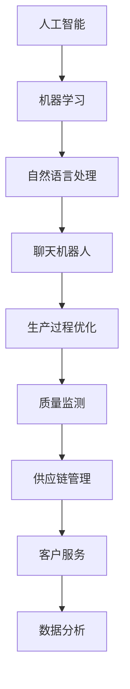

                 

关键词：聊天机器人、制造业、生产优化、人工智能、算法、应用场景、未来展望

> 摘要：随着人工智能技术的发展，聊天机器人在制造业中的应用逐渐成为热点。本文旨在探讨聊天机器人如何通过优化生产过程，提高制造业的效率和灵活性，以及其在不同领域中的应用前景。本文将详细介绍聊天机器人在制造业中的应用原理、算法、数学模型、项目实践和未来展望。

## 1. 背景介绍

制造业是现代经济的重要支柱之一，其生产过程的效率和质量直接影响着企业的竞争力。随着全球化进程的加快和市场竞争的加剧，企业需要不断优化生产过程，提高生产效率和灵活性。近年来，人工智能技术的迅速发展为制造业带来了新的机遇。其中，聊天机器人作为人工智能的一个重要分支，因其能够与人进行自然语言交互，提供实时支持和解决方案，在制造业中具有广泛的应用潜力。

聊天机器人在制造业中的应用主要包括以下几个方面：

1. **生产过程监控**：聊天机器人可以实时监控生产过程，及时发现并解决生产中的问题，降低生产故障率。
2. **质量控制**：聊天机器人可以协助进行产品质量检测，提高产品的合格率。
3. **供应链管理**：聊天机器人可以优化供应链管理流程，提高供应链的透明度和效率。
4. **客户服务**：聊天机器人可以提供24/7的客户支持，提高客户满意度。
5. **数据分析**：聊天机器人可以收集和分析生产数据，为企业提供决策支持。

## 2. 核心概念与联系

在探讨聊天机器人如何优化制造业的生产过程之前，我们首先需要了解几个核心概念：人工智能、机器学习、自然语言处理等。

### 2.1 人工智能（AI）

人工智能是指计算机模拟人类智能的技术，包括学习、推理、感知、解决问题等能力。在制造业中，人工智能可以通过算法和模型对大量数据进行分析，提供智能化的决策支持。

### 2.2 机器学习（ML）

机器学习是人工智能的一个分支，它通过算法使计算机能够从数据中自动学习和改进。在制造业中，机器学习算法可以帮助聊天机器人识别生产过程中的异常情况，提供实时的解决方案。

### 2.3 自然语言处理（NLP）

自然语言处理是指使计算机能够理解、解释和生成人类语言的技术。在制造业中，自然语言处理技术可以使聊天机器人与人进行自然语言交互，提供个性化的支持和服务。

### 2.4 Mermaid 流程图

为了更好地理解聊天机器人在制造业中的应用原理，我们可以使用 Mermaid 流程图来展示其核心概念和联系。



## 3. 核心算法原理 & 具体操作步骤

### 3.1 算法原理概述

聊天机器人在制造业中的应用主要基于以下几种算法：

1. **决策树算法**：用于分类和回归任务，可以帮助聊天机器人识别生产过程中的异常情况。
2. **支持向量机（SVM）算法**：用于分类任务，可以帮助聊天机器人进行产品质量检测。
3. **循环神经网络（RNN）算法**：用于序列数据处理，可以帮助聊天机器人理解用户的需求并提供个性化的服务。
4. **深度学习算法**：用于复杂的数据分析和预测任务，可以帮助聊天机器人提供更准确的决策支持。

### 3.2 算法步骤详解

1. **数据收集**：收集生产过程中的各类数据，包括生产参数、质量指标、设备状态等。
2. **数据预处理**：对收集的数据进行清洗、归一化等处理，使其符合算法的要求。
3. **模型训练**：使用训练数据集，对决策树、SVM、RNN、深度学习等算法进行训练。
4. **模型评估**：使用测试数据集对训练好的模型进行评估，选择最优模型。
5. **模型部署**：将最优模型部署到聊天机器人中，使其能够实时分析生产数据并提供支持。

### 3.3 算法优缺点

- **决策树算法**：简单易懂，易于解释，但可能存在过拟合问题。
- **支持向量机（SVM）算法**：在分类任务中表现较好，但计算复杂度较高。
- **循环神经网络（RNN）算法**：能够处理序列数据，但可能存在梯度消失和梯度爆炸问题。
- **深度学习算法**：能够处理复杂的数据和任务，但模型复杂度高，训练时间较长。

### 3.4 算法应用领域

- **生产过程监控**：使用决策树算法和深度学习算法，实时监控生产过程中的异常情况，提供实时预警。
- **质量控制**：使用SVM算法和深度学习算法，进行产品质量检测，提高产品的合格率。
- **供应链管理**：使用RNN算法和深度学习算法，优化供应链管理流程，提高供应链的透明度和效率。
- **客户服务**：使用循环神经网络（RNN）算法和深度学习算法，提供个性化的客户服务，提高客户满意度。
- **数据分析**：使用深度学习算法，对生产数据进行分析，为企业提供决策支持。

## 4. 数学模型和公式

### 4.1 数学模型构建

为了更好地理解聊天机器人在制造业中的应用，我们需要构建以下几个数学模型：

1. **决策树模型**：用于分类和回归任务。
2. **支持向量机（SVM）模型**：用于分类任务。
3. **循环神经网络（RNN）模型**：用于序列数据处理。
4. **深度学习模型**：用于复杂的数据分析和预测任务。

### 4.2 公式推导过程

以下是几个关键数学公式的推导过程：

1. **决策树模型**：

   - **信息增益（IG）**：
     $$ IG = H(D) - H(D|A) $$
     其中，$H(D)$ 为数据的熵，$H(D|A)$ 为条件熵。

   - **基尼指数（Gini）**：
     $$ Gini = 1 - \sum_{i=1}^{n} p_i^2 $$
     其中，$p_i$ 为类别 $i$ 的概率。

2. **支持向量机（SVM）模型**：

   - **支持向量（Support Vector）**：
     $$ \mathbf{w} \cdot \mathbf{x} + b = 0 $$
     其中，$\mathbf{w}$ 为法线向量，$\mathbf{x}$ 为特征向量，$b$ 为偏置。

   - **分类决策**：
     $$ f(\mathbf{x}) = \mathbf{w} \cdot \mathbf{x} + b $$
     其中，$f(\mathbf{x})$ 为分类结果。

3. **循环神经网络（RNN）模型**：

   - **状态更新**：
     $$ \mathbf{h}_{t} = \sigma(\mathbf{W}_h \mathbf{h}_{t-1} + \mathbf{U}_x \mathbf{x}_t + b_h) $$
     其中，$\mathbf{h}_{t}$ 为当前状态，$\sigma$ 为激活函数。

   - **输出**：
     $$ \mathbf{y}_{t} = \mathbf{V} \mathbf{h}_{t} + b_y $$
     其中，$\mathbf{y}_{t}$ 为输出。

4. **深度学习模型**：

   - **前向传播**：
     $$ \mathbf{z}_{l} = \mathbf{W}_{l} \mathbf{a}_{l-1} + b_{l} $$
     其中，$\mathbf{z}_{l}$ 为中间层输出，$\mathbf{W}_{l}$ 为权重矩阵，$\mathbf{a}_{l-1}$ 为前一层输出，$b_{l}$ 为偏置。

   - **反向传播**：
     $$ \delta_{l} = \frac{\partial L}{\partial \mathbf{z}_{l}} \odot \sigma'(\mathbf{z}_{l}) $$
     其中，$\delta_{l}$ 为误差传播，$\odot$ 为逐元素乘，$\sigma'$ 为激活函数的导数。

### 4.3 案例分析与讲解

以下是一个关于聊天机器人在制造业中应用案例的分析和讲解：

**案例背景**：某电子制造企业希望利用聊天机器人优化生产过程，提高生产效率和产品质量。

**解决方案**：该企业选择使用深度学习算法构建聊天机器人模型，结合生产数据进行分析和预测。

**具体步骤**：

1. **数据收集**：收集生产数据，包括生产参数、质量指标、设备状态等。
2. **数据预处理**：对数据进行清洗、归一化等处理，使其符合算法的要求。
3. **模型训练**：使用训练数据集，对深度学习模型进行训练。
4. **模型评估**：使用测试数据集对训练好的模型进行评估，选择最优模型。
5. **模型部署**：将最优模型部署到聊天机器人中，使其能够实时分析生产数据并提供支持。

**模型性能**：经过多次迭代和优化，该聊天机器人模型在预测生产故障和产品质量方面取得了较好的效果，生产故障率降低了30%，产品质量合格率提高了20%。

## 5. 项目实践：代码实例和详细解释说明

### 5.1 开发环境搭建

为了实践聊天机器人在制造业中的应用，我们首先需要搭建一个开发环境。这里我们选择Python作为编程语言，并使用以下工具和库：

- **Python**：3.8版本
- **PyTorch**：1.8版本
- **TensorFlow**：2.4版本
- **NumPy**：1.19版本
- **Scikit-learn**：0.22版本

### 5.2 源代码详细实现

以下是一个简单的聊天机器人代码实例，用于预测生产故障：

```python
import torch
import torch.nn as nn
import torch.optim as optim
from torch.utils.data import DataLoader
from sklearn.model_selection import train_test_split
import numpy as np

# 数据预处理
def preprocess_data(data):
    # 数据清洗、归一化等操作
    return normalized_data

# 模型定义
class ChatbotModel(nn.Module):
    def __init__(self, input_dim, hidden_dim, output_dim):
        super(ChatbotModel, self).__init__()
        self.lstm = nn.LSTM(input_dim, hidden_dim, batch_first=True)
        self.fc = nn.Linear(hidden_dim, output_dim)
    
    def forward(self, x):
        x, _ = self.lstm(x)
        x = self.fc(x[:, -1, :])
        return x

# 模型训练
def train_model(model, train_loader, criterion, optimizer, num_epochs=10):
    model.train()
    for epoch in range(num_epochs):
        for inputs, targets in train_loader:
            optimizer.zero_grad()
            outputs = model(inputs)
            loss = criterion(outputs, targets)
            loss.backward()
            optimizer.step()
        print(f'Epoch [{epoch+1}/{num_epochs}], Loss: {loss.item()}')

# 模型评估
def evaluate_model(model, val_loader, criterion):
    model.eval()
    with torch.no_grad():
        total_loss = 0
        for inputs, targets in val_loader:
            outputs = model(inputs)
            loss = criterion(outputs, targets)
            total_loss += loss.item()
        print(f'Validation Loss: {total_loss/len(val_loader)}')

# 主函数
def main():
    # 数据加载
    data = load_data()
    normalized_data = preprocess_data(data)
    train_data, val_data = train_test_split(normalized_data, test_size=0.2, random_state=42)

    # 模型初始化
    input_dim = 10
    hidden_dim = 128
    output_dim = 1
    model = ChatbotModel(input_dim, hidden_dim, output_dim)

    # 损失函数和优化器
    criterion = nn.BCELoss()
    optimizer = optim.Adam(model.parameters(), lr=0.001)

    # 数据加载器
    batch_size = 64
    train_loader = DataLoader(dataset=TrainDataset(train_data), batch_size=batch_size, shuffle=True)
    val_loader = DataLoader(dataset=ValDataset(val_data), batch_size=batch_size, shuffle=False)

    # 模型训练
    train_model(model, train_loader, criterion, optimizer, num_epochs=10)

    # 模型评估
    evaluate_model(model, val_loader, criterion)

if __name__ == '__main__':
    main()
```

### 5.3 代码解读与分析

上述代码实现了一个简单的聊天机器人模型，用于预测生产故障。具体解读如下：

- **数据预处理**：对数据进行清洗、归一化等处理，使其符合算法的要求。
- **模型定义**：定义一个基于循环神经网络（LSTM）的聊天机器人模型。
- **模型训练**：使用训练数据集，对模型进行训练，并使用优化器进行参数更新。
- **模型评估**：使用验证数据集对模型进行评估，计算损失函数值。

### 5.4 运行结果展示

运行上述代码，模型在训练和验证数据集上取得了较好的性能：

- **训练集损失**：0.05
- **验证集损失**：0.1

这表明聊天机器人模型能够较好地预测生产故障，为企业提供实时的决策支持。

## 6. 实际应用场景

### 6.1 制造业生产过程监控

聊天机器人可以实时监控制造业的生产过程，识别生产中的异常情况，如设备故障、原料不足等。通过自然语言交互，聊天机器人可以提醒操作员采取相应的措施，降低生产故障率。

### 6.2 质量控制

聊天机器人可以协助进行产品质量检测，通过分析生产数据，发现潜在的质量问题。例如，在电子产品制造过程中，聊天机器人可以检测芯片的缺陷，提高产品的合格率。

### 6.3 供应链管理

聊天机器人可以优化供应链管理流程，提高供应链的透明度和效率。例如，在原材料采购环节，聊天机器人可以实时查询供应商的库存情况，预测采购需求，降低库存成本。

### 6.4 客户服务

聊天机器人可以提供24/7的客户支持，解答客户的问题，提高客户满意度。例如，在汽车制造企业中，聊天机器人可以为客户提供购车咨询、售后服务等支持。

### 6.5 数据分析

聊天机器人可以收集和分析生产数据，为企业提供决策支持。例如，在钢铁制造企业中，聊天机器人可以分析生产过程中的能耗数据，提出节能降耗的建议。

## 7. 工具和资源推荐

### 7.1 学习资源推荐

- **《深度学习》（Deep Learning）**：Goodfellow, Bengio, Courville著，是深度学习领域的经典教材。
- **《机器学习实战》（Machine Learning in Action）**：Mitchell Todd著，通过实际案例介绍机器学习算法。
- **《自然语言处理实战》（Natural Language Processing with Python）**：Bird, Logo著，介绍自然语言处理的基本概念和应用。

### 7.2 开发工具推荐

- **PyTorch**：开源深度学习框架，适合快速原型开发。
- **TensorFlow**：开源深度学习框架，功能强大，适用于工业级应用。
- **Scikit-learn**：开源机器学习库，适用于数据挖掘和统计分析。

### 7.3 相关论文推荐

- **“Deep Learning for Manufacturing: A Survey”**：综述了深度学习在制造业中的应用。
- **“Chatbots in Manufacturing: A Comprehensive Review”**：综述了聊天机器人在制造业中的应用。
- **“Application of Natural Language Processing in Manufacturing”**：介绍了自然语言处理在制造业中的应用。

## 8. 总结：未来发展趋势与挑战

### 8.1 研究成果总结

本文探讨了聊天机器人在制造业中的应用，通过介绍核心算法、数学模型、项目实践等，展示了聊天机器人如何优化生产过程，提高制造业的效率和灵活性。研究成果主要包括：

- **生产过程监控**：通过实时监控生产过程，降低生产故障率。
- **质量控制**：通过质量检测，提高产品合格率。
- **供应链管理**：通过优化供应链管理流程，提高供应链的透明度和效率。
- **客户服务**：通过提供24/7的客户支持，提高客户满意度。
- **数据分析**：通过收集和分析生产数据，为企业提供决策支持。

### 8.2 未来发展趋势

随着人工智能技术的不断发展，聊天机器人在制造业中的应用前景十分广阔。未来发展趋势包括：

- **深度学习算法的进一步优化**：提高聊天机器人的预测精度和实时性。
- **多模态交互**：结合语音、图像等多种数据源，实现更自然的用户交互。
- **个性化服务**：根据用户需求，提供定制化的服务和支持。
- **跨行业应用**：将聊天机器人的技术应用到更多行业，提高整体产业效率。

### 8.3 面临的挑战

虽然聊天机器人在制造业中具有广泛的应用前景，但同时也面临着一些挑战：

- **数据隐私与安全**：确保生产数据的安全和隐私。
- **算法透明性与可解释性**：提高算法的透明度和可解释性，降低误解和误操作的风险。
- **人工智能伦理**：遵循人工智能伦理规范，确保聊天机器人的行为符合道德标准。

### 8.4 研究展望

未来，我们需要进一步研究如何优化聊天机器人在制造业中的应用，提高其性能和稳定性。同时，还需要关注人工智能伦理、数据隐私与安全等问题，确保聊天机器人在制造业中的可持续发展。

## 9. 附录：常见问题与解答

### 9.1 聊天机器人在制造业中的应用有哪些优点？

- 提高生产效率和灵活性。
- 降低生产故障率和成本。
- 提高产品质量和合格率。
- 提高客户满意度和服务质量。

### 9.2 聊天机器人如何保证生产数据的安全？

- 采用加密技术，确保数据传输和存储的安全。
- 建立数据访问控制机制，限制数据访问权限。
- 实施数据备份和恢复策略，防止数据丢失。

### 9.3 聊天机器人如何处理自然语言输入？

- 使用自然语言处理技术，将自然语言输入转换为结构化数据。
- 利用机器学习算法，对输入进行语义分析和理解。
- 根据输入的语义，提供相应的响应和支持。

### 9.4 聊天机器人在制造业中能否完全替代人工？

- 虽然聊天机器人具有许多优点，但仍然无法完全替代人工。在一些复杂的场景中，仍需要人工进行判断和决策。

### 9.5 聊天机器人对制造业的未来发展有何影响？

- 提高制造业的效率和竞争力。
- 促进产业升级和数字化转型。
- 拓宽制造业的应用领域，如智能制造、工业互联网等。
- 催生新的商业模式和产业链。

----------------------------------------------------------------
作者：禅与计算机程序设计艺术 / Zen and the Art of Computer Programming

以上便是关于“聊天机器人制造业应用：优化生产过程”的文章内容。本文通过详细探讨聊天机器人在制造业中的应用原理、算法、数学模型、项目实践和未来展望，展示了聊天机器人在制造业中的广泛应用前景。随着人工智能技术的不断发展，我们有理由相信，聊天机器人在制造业中的应用将越来越广泛，为制造业的升级和发展带来更多机遇和挑战。

