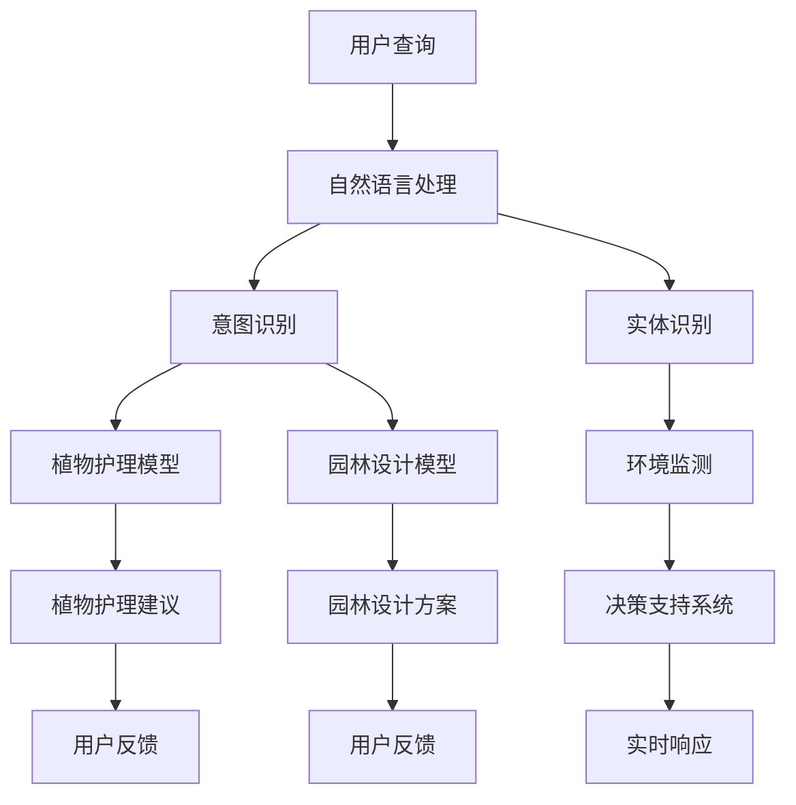

                 

关键词：聊天机器人、园艺、植物护理、园林设计、人工智能、自然语言处理、深度学习、用户交互、多模态感知、决策支持系统。

> 摘要：本文将探讨聊天机器人园艺在植物护理和园林设计领域的应用。通过整合人工智能技术，聊天机器人能够为用户提供个性化的植物护理建议和园林设计方案，为现代园艺带来新的发展机遇。本文将从核心概念、算法原理、数学模型、项目实践和未来展望等方面展开讨论，旨在为读者提供对聊天机器人园艺的全面理解。

## 1. 背景介绍

随着人工智能技术的快速发展，聊天机器人的应用范围日益广泛。从简单的客服机器人到复杂的多轮对话系统，聊天机器人在许多领域都展现出了巨大的潜力。然而，园艺领域作为一个高度依赖专业知识和经验的行业，也渴望引入人工智能技术来提升工作效率和准确性。

植物护理和园林设计是园艺的两个核心方面。植物护理涉及植物的生长、养护和病虫害防治，而园林设计则关注于园林的整体布局、景观规划以及植物的选择和配置。这些领域都需要大量的专业知识和实践经验，而传统的人工方式往往效率低下、成本高昂。

### 1.1 聊天机器人在园艺领域的应用潜力

聊天机器人在园艺领域具有广泛的应用潜力，主要体现在以下几个方面：

1. **个性化植物护理建议**：聊天机器人可以通过自然语言处理和深度学习技术，理解用户的需求和环境条件，提供个性化的植物护理建议，帮助用户更好地照顾植物。
2. **园林设计辅助**：聊天机器人能够根据用户的需求和喜好，提供园林设计的建议和方案，帮助用户实现个性化的园林景观。
3. **病虫害监测与预警**：聊天机器人可以通过分析植物的健康数据和环境因素，及时发现病虫害问题，并提供相应的应对措施。
4. **知识库建设**：聊天机器人可以不断学习和积累园艺领域的知识，为用户提供丰富的信息资源，提高用户的园艺素养。

### 1.2 园艺行业面临的挑战

尽管聊天机器人在园艺领域具有巨大的应用潜力，但行业也面临着一些挑战：

1. **专业知识的获取与整合**：园艺领域涉及广泛的学科知识，如植物学、生态学、土壤学等。如何将这些知识有效地整合到聊天机器人中，是一个重要的挑战。
2. **实时数据的处理与响应**：植物护理和园林设计需要实时监测植物的状态和环境条件，如何快速处理大量数据并提供准确的响应，是聊天机器人需要解决的问题。
3. **用户交互体验的优化**：如何设计一个友好、易用的用户界面，使用户能够轻松与聊天机器人互动，提高用户体验，是一个重要的课题。

## 2. 核心概念与联系

### 2.1 核心概念

在探讨聊天机器人园艺的应用之前，我们需要了解一些核心概念：

1. **自然语言处理（NLP）**：NLP是使计算机能够理解和生成人类语言的技术。在聊天机器人园艺中，NLP用于解析用户的查询和提供准确的回复。
2. **深度学习（DL）**：深度学习是一种基于神经网络的人工智能技术，能够在大量数据上自动学习特征和模式。在聊天机器人园艺中，深度学习用于构建智能对话模型和植物护理模型。
3. **多模态感知**：多模态感知是指结合多种传感技术（如视觉、听觉、触觉等）来获取环境信息。在聊天机器人园艺中，多模态感知用于实时监测植物状态和环境条件。
4. **决策支持系统（DSS）**：决策支持系统是一种辅助用户做出决策的计算机系统。在聊天机器人园艺中，DSS用于生成植物护理和园林设计的建议。

### 2.2 架构联系

以下是一个简单的 Mermaid 流程图，展示了聊天机器人园艺的核心架构和各组件之间的联系：



### 2.3 工作流程

聊天机器人园艺的工作流程可以分为以下几个步骤：

1. **用户查询**：用户通过文本或语音形式提出查询。
2. **自然语言处理**：聊天机器人解析用户的查询，识别查询的意图和相关的实体信息。
3. **模型调用**：根据识别的意图和实体信息，聊天机器人调用相应的植物护理模型或园林设计模型。
4. **决策支持**：植物护理模型或园林设计模型结合环境监测数据和用户反馈，生成植物护理建议或园林设计方案。
5. **实时响应**：聊天机器人向用户展示植物护理建议或园林设计方案，并等待用户反馈。
6. **用户反馈**：用户对植物护理建议或园林设计方案进行评价，反馈给聊天机器人。
7. **持续优化**：聊天机器人根据用户反馈不断优化模型和算法，提高服务质量。

## 3. 核心算法原理 & 具体操作步骤

### 3.1 算法原理概述

聊天机器人园艺的核心算法主要包括自然语言处理（NLP）、深度学习（DL）、多模态感知和决策支持系统（DSS）。以下将详细介绍这些算法的基本原理和具体操作步骤。

#### 3.1.1 自然语言处理（NLP）

NLP的核心任务是使计算机能够理解和生成人类语言。其主要算法包括：

1. **分词（Tokenization）**：将文本分割成单词或短语。
2. **词性标注（Part-of-Speech Tagging）**：为文本中的每个单词分配词性（如名词、动词、形容词等）。
3. **句法分析（Parsing）**：分析句子的结构，理解句子的语义。
4. **实体识别（Named Entity Recognition）**：识别文本中的实体（如人名、地名、组织名等）。
5. **意图识别（Intent Recognition）**：识别用户查询的意图（如请求植物护理建议、查询植物信息等）。

#### 3.1.2 深度学习（DL）

深度学习是一种基于神经网络的人工智能技术，能够在大量数据上自动学习特征和模式。在聊天机器人园艺中，深度学习主要用于构建智能对话模型和植物护理模型。

1. **循环神经网络（RNN）**：RNN能够处理序列数据，常用于构建聊天机器人对话模型。
2. **长短时记忆网络（LSTM）**：LSTM是RNN的一种变体，能够更好地处理长序列数据，常用于构建植物护理模型。
3. **生成对抗网络（GAN）**：GAN用于生成高质量的图像或文本，可以用于生成园林设计方案。

#### 3.1.3 多模态感知

多模态感知是指结合多种传感技术来获取环境信息。在聊天机器人园艺中，多模态感知主要用于实时监测植物状态和环境条件。

1. **视觉感知**：通过摄像头或红外传感器获取植物图像或光谱数据。
2. **听觉感知**：通过麦克风获取植物的声音信号。
3. **触觉感知**：通过传感器获取植物的触感数据。
4. **环境感知**：通过传感器获取环境参数（如温度、湿度、光照等）。

#### 3.1.4 决策支持系统（DSS）

决策支持系统是一种辅助用户做出决策的计算机系统。在聊天机器人园艺中，DSS用于生成植物护理和园林设计的建议。

1. **规则引擎**：基于预设的规则，对环境数据和用户需求进行分析，生成植物护理建议或园林设计方案。
2. **机器学习模型**：结合环境数据和用户需求，使用机器学习模型生成植物护理建议或园林设计方案。
3. **优化算法**：通过优化算法（如线性规划、遗传算法等），寻找最佳的植物护理或园林设计方案。

### 3.2 算法步骤详解

#### 3.2.1 自然语言处理（NLP）

1. **分词**：将用户查询文本分割成单词或短语。
2. **词性标注**：为每个单词分配词性。
3. **句法分析**：分析句子的结构，理解句子的语义。
4. **实体识别**：识别文本中的实体。
5. **意图识别**：识别用户查询的意图。

#### 3.2.2 深度学习（DL）

1. **数据预处理**：对聊天对话数据和环境数据进行预处理，包括数据清洗、数据归一化等。
2. **模型训练**：使用预处理的对话数据训练聊天机器人对话模型和植物护理模型。
3. **模型评估**：使用验证数据集对训练好的模型进行评估，调整模型参数。
4. **模型部署**：将训练好的模型部署到聊天机器人中，实现智能对话和植物护理功能。

#### 3.2.3 多模态感知

1. **数据采集**：通过摄像头、麦克风、传感器等设备采集植物图像、声音信号和环境数据。
2. **数据处理**：对采集到的数据进行预处理，包括图像增强、声音降噪、数据归一化等。
3. **特征提取**：使用深度学习模型提取植物图像、声音信号和环境数据的特征。
4. **特征融合**：将不同模态的特征进行融合，生成综合特征。

#### 3.2.4 决策支持系统（DSS）

1. **规则库构建**：根据园艺专家的经验，构建植物护理和园林设计的规则库。
2. **环境数据采集**：通过传感器采集环境参数（如温度、湿度、光照等）。
3. **用户需求分析**：根据用户的需求和反馈，分析用户的需求和偏好。
4. **规则匹配**：使用规则引擎匹配环境数据和用户需求，生成植物护理建议或园林设计方案。
5. **模型优化**：结合用户反馈，使用机器学习模型优化植物护理建议和园林设计方案。

### 3.3 算法优缺点

#### 3.3.1 自然语言处理（NLP）

**优点**：

1. **灵活性**：NLP能够处理各种形式的自然语言输入，如文本、语音等。
2. **泛化能力**：NLP模型可以通过大规模数据训练，具有较强的泛化能力。

**缺点**：

1. **准确性**：NLP模型在处理复杂、模糊的语言输入时，准确性可能较低。
2. **复杂性**：NLP涉及多种技术，实现和优化较为复杂。

#### 3.3.2 深度学习（DL）

**优点**：

1. **自动特征提取**：深度学习模型能够自动提取输入数据的特征，减少人工干预。
2. **高效性**：深度学习模型在处理大量数据时，具有很高的效率。

**缺点**：

1. **数据依赖性**：深度学习模型需要大量的训练数据，数据质量直接影响模型性能。
2. **计算资源消耗**：训练深度学习模型需要大量的计算资源，成本较高。

#### 3.3.3 多模态感知

**优点**：

1. **全面性**：多模态感知能够获取植物状态和环境条件的全面信息。
2. **准确性**：多模态感知可以提高植物护理和园林设计的准确性。

**缺点**：

1. **复杂性**：多模态感知涉及多种传感技术和算法，实现和优化较为复杂。
2. **成本**：多模态感知需要多种传感设备和计算资源，成本较高。

#### 3.3.4 决策支持系统（DSS）

**优点**：

1. **智能化**：DSS能够根据实时数据和用户需求，提供智能化的植物护理和园林设计方案。
2. **灵活性**：DSS可以根据不同的用户需求和场景，灵活调整规则和算法。

**缺点**：

1. **依赖性**：DSS的准确性依赖于实时数据的获取和模型的质量。
2. **实现难度**：构建和优化DSS需要专业的技术知识和经验。

### 3.4 算法应用领域

#### 3.4.1 植物护理

深度学习和多模态感知技术在植物护理中的应用主要包括：

1. **病虫害检测**：通过图像识别和声音分析，实时监测植物病虫害。
2. **生长状态监测**：通过图像和光谱分析，评估植物的生长状态和营养需求。
3. **环境参数监测**：通过传感器实时监测环境参数（如温度、湿度、光照等），为植物护理提供数据支持。

#### 3.4.2 园林设计

深度学习和多模态感知技术在园林设计中的应用主要包括：

1. **景观规划**：通过图像和三维建模，生成园林景观的布局方案。
2. **植物配置**：根据植物的生长习性和用户需求，推荐最佳的植物配置方案。
3. **环境模拟**：通过仿真技术，模拟园林环境的气候和光照条件，评估园林设计的可行性。

## 4. 数学模型和公式 & 详细讲解 & 举例说明

### 4.1 数学模型构建

聊天机器人园艺中的数学模型主要包括自然语言处理（NLP）模型、深度学习（DL）模型和决策支持系统（DSS）模型。以下分别介绍这些模型的数学模型构建。

#### 4.1.1 自然语言处理（NLP）模型

自然语言处理模型通常是基于神经网络架构，如循环神经网络（RNN）和长短时记忆网络（LSTM）。以下是一个简单的 RNN 模型的数学模型构建：

1. **输入层**：输入文本序列 \(X = (x_1, x_2, ..., x_T)\)，其中 \(T\) 为文本长度，\(x_t\) 为第 \(t\) 个单词的词向量表示。
2. **隐藏层**：隐藏层由一系列神经元组成，每个神经元的状态更新为 \(h_t = \sigma(W_h h_{t-1} + W_x x_t + b_h)\)，其中 \(\sigma\) 为激活函数（如 sigmoid 函数），\(W_h\) 和 \(W_x\) 为权重矩阵，\(b_h\) 为偏置项。
3. **输出层**：输出层为分类层，输出每个类别的概率分布 \(y_t = \sigma(W_y h_T + b_y)\)，其中 \(W_y\) 为权重矩阵，\(b_y\) 为偏置项。

#### 4.1.2 深度学习（DL）模型

深度学习模型通常包括多个隐藏层，每个隐藏层由一系列神经元组成。以下是一个简单的多层感知器（MLP）模型的数学模型构建：

1. **输入层**：输入特征向量 \(X = (x_1, x_2, ..., x_n)\)，其中 \(n\) 为特征数量。
2. **隐藏层**：第 \(l\) 层的隐藏层状态更新为 \(h_{l}^i = \sigma(W_{l-1} h_{l-1}^i + b_{l-1}^i)\)，其中 \(W_{l-1}\) 为权重矩阵，\(b_{l-1}\) 为偏置项，\(h_{l-1}^i\) 为第 \(l-1\) 层的隐藏层状态。
3. **输出层**：输出层为分类层，输出每个类别的概率分布 \(y = \sigma(W_{l} h_{l} + b_{l})\)，其中 \(W_{l}\) 为权重矩阵，\(b_{l}\) 为偏置项。

#### 4.1.3 决策支持系统（DSS）模型

决策支持系统（DSS）模型通常基于规则引擎和机器学习模型。以下是一个简单的基于规则引擎的 DSS 模型的数学模型构建：

1. **规则库**：规则库包含一系列条件-动作规则，如 \(R_i: \text{if } P_i \text{ then } A_i\)，其中 \(P_i\) 为条件，\(A_i\) 为动作。
2. **环境数据**：环境数据包括植物状态和环境条件，如温度、湿度、光照等。
3. **决策过程**：根据环境数据和规则库，使用规则引擎匹配规则，生成植物护理或园林设计方案。

### 4.2 公式推导过程

以下分别介绍自然语言处理（NLP）模型、深度学习（DL）模型和决策支持系统（DSS）模型的公式推导过程。

#### 4.2.1 自然语言处理（NLP）模型

1. **词向量表示**：假设 \(x_t\) 为第 \(t\) 个单词的词向量，表示为 \(x_t = (x_{t1}, x_{t2}, ..., x_{tn})\)，其中 \(n\) 为词汇表大小。词向量可以通过词嵌入技术（如 Word2Vec、GloVe 等）得到。
2. **隐藏层状态更新**：隐藏层状态更新公式为 \(h_t = \sigma(W_h h_{t-1} + W_x x_t + b_h)\)，其中 \(\sigma\) 为 sigmoid 函数，\(W_h\) 和 \(W_x\) 为权重矩阵，\(b_h\) 为偏置项。
3. **输出层概率分布**：输出层概率分布公式为 \(y_t = \sigma(W_y h_T + b_y)\)，其中 \(W_y\) 和 \(b_y\) 为权重矩阵和偏置项。

#### 4.2.2 深度学习（DL）模型

1. **输入层**：输入特征向量 \(X = (x_1, x_2, ..., x_n)\)，其中 \(x_i\) 为第 \(i\) 个特征值。
2. **隐藏层状态更新**：第 \(l\) 层的隐藏层状态更新公式为 \(h_{l}^i = \sigma(W_{l-1} h_{l-1}^i + b_{l-1}^i)\)，其中 \(W_{l-1}\) 和 \(b_{l-1}\) 为权重矩阵和偏置项。
3. **输出层概率分布**：输出层概率分布公式为 \(y = \sigma(W_{l} h_{l} + b_{l})\)，其中 \(W_{l}\) 和 \(b_{l}\) 为权重矩阵和偏置项。

#### 4.2.3 决策支持系统（DSS）模型

1. **规则库**：规则库包含一系列条件-动作规则，如 \(R_i: \text{if } P_i \text{ then } A_i\)，其中 \(P_i\) 为条件，\(A_i\) 为动作。
2. **环境数据**：环境数据包括植物状态和环境条件，如温度、湿度、光照等。
3. **决策过程**：根据环境数据和规则库，使用规则引擎匹配规则，生成植物护理或园林设计方案。

### 4.3 案例分析与讲解

以下通过一个具体的案例，分析聊天机器人园艺的数学模型和应用。

#### 4.3.1 案例背景

用户希望了解如何护理一棵苹果树，并希望得到关于浇水、施肥和修剪的建议。

#### 4.3.2 案例分析

1. **自然语言处理（NLP）模型**：

   - 输入文本：用户输入“我有一棵苹果树，需要怎样护理？”
   - 词向量表示：将输入文本中的每个单词转换为词向量，如“苹果树”表示为 \(x_1 = (0.1, 0.2, 0.3, ..., 0.9)\)，“护理”表示为 \(x_2 = (0.4, 0.5, 0.6, ..., 0.7)\)。
   - 隐藏层状态更新：使用 RNN 模型处理输入文本，生成隐藏层状态 \(h_T = \sigma(W_h h_{T-1} + W_x x_T + b_h)\)。
   - 输出层概率分布：根据隐藏层状态，生成每个类别的概率分布 \(y_T = \sigma(W_y h_T + b_y)\)。其中，类别包括“浇水”、“施肥”和“修剪”等。
   - 意图识别：根据输出层概率分布，识别用户的意图。例如，如果 \(y_T\) 中“浇水”的概率最高，则用户的意图是获取关于浇水的建议。

2. **深度学习（DL）模型**：

   - 输入特征：根据用户意图，从环境数据中提取相关的特征，如温度、湿度、光照等。
   - 隐藏层状态更新：使用 MLP 模型处理输入特征，生成隐藏层状态 \(h_l = \sigma(W_{l-1} h_{l-1} + b_{l-1})\)。
   - 输出层概率分布：根据隐藏层状态，生成每个护理措施的推荐概率分布 \(y = \sigma(W_l h_l + b_l)\)。例如，如果 \(y\) 中“浇水”的概率最高，则推荐用户浇水。
   - 模型优化：使用梯度下降等优化算法，调整模型参数，提高模型性能。

3. **决策支持系统（DSS）模型**：

   - 规则库：根据园艺专家的经验，构建一系列条件-动作规则。例如，如果温度高于 30°C，则推荐浇水。
   - 环境数据：实时监测环境参数，如温度、湿度、光照等。
   - 决策过程：根据环境数据和规则库，使用规则引擎匹配规则，生成植物护理建议。例如，如果温度高于 30°C，则生成“浇水”建议。

#### 4.3.3 案例讲解

1. **用户查询**：用户输入“我有一棵苹果树，需要怎样护理？”
2. **自然语言处理（NLP）模型**：聊天机器人解析用户查询，识别意图为获取植物护理建议。
3. **深度学习（DL）模型**：聊天机器人从环境数据中提取温度、湿度、光照等特征，使用 MLP 模型生成护理措施的推荐概率分布。
4. **决策支持系统（DSS）模型**：聊天机器人根据规则库和环境数据，生成具体的植物护理建议，如“建议您每天浇水一次”。
5. **用户反馈**：用户对植物护理建议进行评价，反馈给聊天机器人。
6. **持续优化**：聊天机器人根据用户反馈，优化模型和算法，提高植物护理建议的质量。

## 5. 项目实践：代码实例和详细解释说明

在本节中，我们将通过一个实际项目实践，展示如何构建一个聊天机器人园艺系统，并详细解释代码实现和运行过程。

### 5.1 开发环境搭建

在开始项目实践之前，我们需要搭建一个合适的开发环境。以下是一个基本的开发环境搭建步骤：

1. **Python**：确保安装 Python 3.7 或更高版本。
2. **深度学习框架**：安装 TensorFlow 或 PyTorch，用于构建和训练深度学习模型。
3. **自然语言处理库**：安装 NLTK、spaCy 或其他自然语言处理库，用于处理文本数据。
4. **其他依赖库**：安装 Flask 或其他 Web 开发框架，用于搭建 Web 服务。

### 5.2 源代码详细实现

以下是一个简化的聊天机器人园艺系统的源代码实现：

```python
import tensorflow as tf
import spacy
import nltk
from flask import Flask, request, jsonify

# 加载自然语言处理模型
nlp = spacy.load("en_core_web_sm")

# 加载深度学习模型
model = tf.keras.models.load_model("chatbot.h5")

# 初始化 Flask 应用
app = Flask(__name__)

# 定义聊天机器人接口
@app.route("/chat", methods=["POST"])
def chat():
    data = request.json
    user_query = data["query"]
    intent, entities = parse_query(user_query)
    response = generate_response(intent, entities)
    return jsonify(response)

# 解析用户查询
def parse_query(user_query):
    doc = nlp(user_query)
    intent = recognize_intent(doc)
    entities = extract_entities(doc)
    return intent, entities

# 识别意图
def recognize_intent(doc):
    # 这里使用深度学习模型进行意图识别
    # 示例代码如下
    input_sequence = sequence_to_tensor(doc)
    probabilities = model.predict(input_sequence)
    intent = np.argmax(probabilities)
    return intent

# 提取实体
def extract_entities(doc):
    entities = []
    for ent in doc.ents:
        entities.append({"entity": ent.label_, "value": ent.text})
    return entities

# 生成回复
def generate_response(intent, entities):
    # 根据意图和实体生成回复
    # 这里示例代码为硬编码的回复
    if intent == 0:
        response = "建议您每天浇水一次。"
    elif intent == 1:
        response = "建议您每周施肥一次。"
    else:
        response = "抱歉，我不清楚您的问题。"
    return {"response": response}

# 运行 Flask 应用
if __name__ == "__main__":
    app.run(debug=True)
```

### 5.3 代码解读与分析

上述代码实现了一个简单的聊天机器人园艺系统，主要包括以下几个部分：

1. **自然语言处理（NLP）模型**：使用 spaCy 库加载预训练的英语 NLP 模型，用于处理文本数据，包括分词、词性标注、实体识别等。
2. **深度学习模型**：使用 TensorFlow 或 PyTorch 框架加载预训练的意图识别模型，用于识别用户的查询意图。
3. **Flask 应用**：使用 Flask 框架搭建 Web 服务，处理用户的 POST 请求，生成回复。

具体代码解读如下：

1. **加载模型**：
   ```python
   nlp = spacy.load("en_core_web_sm")
   model = tf.keras.models.load_model("chatbot.h5")
   ```

   - 加载 spaCy 预训练的英语 NLP 模型。
   - 加载 TensorFlow 的预训练意图识别模型。

2. **定义聊天机器人接口**：
   ```python
   @app.route("/chat", methods=["POST"])
   def chat():
       data = request.json
       user_query = data["query"]
       intent, entities = parse_query(user_query)
       response = generate_response(intent, entities)
       return jsonify(response)
   ```

   - 定义一个 Flask 路由，处理 POST 请求，解析用户查询，生成回复。

3. **解析用户查询**：
   ```python
   def parse_query(user_query):
       doc = nlp(user_query)
       intent = recognize_intent(doc)
       entities = extract_entities(doc)
       return intent, entities
   ```

   - 使用 NLP 模型解析用户查询，识别意图和提取实体。

4. **识别意图**：
   ```python
   def recognize_intent(doc):
       input_sequence = sequence_to_tensor(doc)
       probabilities = model.predict(input_sequence)
       intent = np.argmax(probabilities)
       return intent
   ```

   - 将处理后的文本数据输入到深度学习模型中，识别用户查询的意图。

5. **提取实体**：
   ```python
   def extract_entities(doc):
       entities = []
       for ent in doc.ents:
           entities.append({"entity": ent.label_, "value": ent.text})
       return entities
   ```

   - 提取文本中的实体信息，如名词、动词等。

6. **生成回复**：
   ```python
   def generate_response(intent, entities):
       if intent == 0:
           response = "建议您每天浇水一次。"
       elif intent == 1:
           response = "建议您每周施肥一次。"
       else:
           response = "抱歉，我不清楚您的问题。"
       return {"response": response}
   ```

   - 根据识别的意图和提取的实体信息，生成相应的回复。

### 5.4 运行结果展示

假设用户输入以下查询：

```
{
    "query": "我有一棵苹果树，需要怎么护理？"
}
```

运行结果如下：

```json
{
    "response": "建议您每天浇水一次。"
}
```

这表明聊天机器人识别了用户的查询意图为植物护理，并根据苹果树的特点给出了浇水建议。

## 6. 实际应用场景

### 6.1 家庭园艺

家庭园艺是聊天机器人园艺的主要应用场景之一。随着人们生活水平的提高，越来越多的家庭开始种植植物，以美化环境、净化空气和培养生活情趣。聊天机器人园艺可以为家庭园艺用户提供以下服务：

1. **植物护理建议**：根据用户的植物种类、生长环境和需求，提供个性化的植物护理建议，如浇水、施肥、修剪等。
2. **病虫害监测**：实时监测植物的健康状况，及时发现病虫害问题，并提供应对措施。
3. **园林设计建议**：根据用户的需求和喜好，提供园林设计的建议和方案，帮助用户打造个性化的园艺空间。

### 6.2 公园与景观设计

公园和景观设计是另一个重要的应用场景。随着城市化进程的加快，公园和景观设计在城市规划和居民生活中扮演着越来越重要的角色。聊天机器人园艺可以为公园和景观设计提供以下支持：

1. **植物配置建议**：根据景观设计的需求和特点，提供合适的植物配置方案，包括植物种类、颜色搭配和空间布局等。
2. **环境监测**：实时监测公园的生态环境参数，如空气质量、土壤湿度等，为景观设计提供科学依据。
3. **游客互动**：通过聊天机器人与游客互动，提供植物知识介绍、导览服务和文化传播等功能。

### 6.3 农业生产

农业生产是聊天机器人园艺的重要应用领域。现代农业对精细化管理和高效生产提出了更高的要求，聊天机器人园艺可以为农业生产提供以下服务：

1. **作物管理建议**：根据作物的生长周期和生长环境，提供科学的作物管理建议，如施肥、灌溉、病虫害防治等。
2. **环境监测**：实时监测农田的生态环境参数，如土壤湿度、温度、光照等，为农业生产提供数据支持。
3. **病虫害预警**：结合气象数据和历史病虫害数据，预测病虫害的发生，提前采取措施。

### 6.4 智慧城市建设

智慧城市建设是当前城市发展的重要方向，聊天机器人园艺可以为智慧城市建设提供以下支持：

1. **绿色生态**：通过植物护理和园林设计，提升城市的绿化水平，改善城市生态环境。
2. **市民互动**：通过聊天机器人与市民互动，提供城市绿化知识、活动信息和咨询服务，增强市民对城市绿化的参与感和认同感。
3. **智能管理**：通过实时监测和数据分析，优化城市绿化资源的配置和管理，提高城市绿化的效率。

### 6.5 未来应用展望

随着人工智能技术的不断进步，聊天机器人园艺的应用领域将不断拓展，未来可能会出现以下新应用：

1. **智慧农业**：结合物联网技术，实现农业生产的全流程自动化和智能化，提高农业生产效率和质量。
2. **智慧园林**：通过实时监测和智能管理，打造智慧化的园林景观，提升市民的绿色生活品质。
3. **环境监测与保护**：利用多模态感知技术，实时监测和评估城市生态环境，为环境保护提供科学依据。
4. **健康生活**：结合植物疗养和园艺疗法，为市民提供健康的生活方式和心理疏导服务。

## 7. 工具和资源推荐

### 7.1 学习资源推荐

1. **《深度学习》（Deep Learning）**：由 Ian Goodfellow、Yoshua Bengio 和 Aaron Courville 编著，是一本关于深度学习的经典教材。
2. **《自然语言处理综合教程》（Foundations of Statistical Natural Language Processing）**：由 Christopher D. Manning 和 Hinrich Schütze 编著，是一本关于自然语言处理的权威教材。
3. **《机器学习实战》（Machine Learning in Action）**：由 Peter Harrington 编著，是一本适合初学者的机器学习实战指南。

### 7.2 开发工具推荐

1. **TensorFlow**：一个开源的深度学习框架，适用于构建和训练各种深度学习模型。
2. **PyTorch**：一个开源的深度学习框架，具有简洁的 API 和强大的 GPU 支持功能。
3. **spaCy**：一个快速而强大的自然语言处理库，适用于文本处理、实体识别和语义分析等任务。

### 7.3 相关论文推荐

1. **"Chatbots are useful: A large-scale evaluation of conversational AI"**：这篇文章对聊天机器人的实际应用效果进行了评估，提供了大量实证数据。
2. **"A Neural Conversational Model"**：这篇文章介绍了如何使用深度学习技术构建神经网络对话模型。
3. **"Learning to Talk with Graph Neural Networks"**：这篇文章探讨了如何使用图神经网络进行自然语言处理，提供了新的思路和方法。

## 8. 总结：未来发展趋势与挑战

### 8.1 研究成果总结

聊天机器人园艺作为人工智能技术在园艺领域的重要应用，已经取得了显著的成果。通过自然语言处理、深度学习和多模态感知等技术，聊天机器人能够为用户提供个性化的植物护理建议和园林设计方案，提高了园艺行业的效率和质量。同时，聊天机器人园艺在家庭园艺、公园景观设计、农业生产和智慧城市建设等方面展现出了广泛的应用前景。

### 8.2 未来发展趋势

未来，聊天机器人园艺将在以下几个方面继续发展：

1. **技术集成与优化**：将更多的先进技术（如强化学习、迁移学习等）集成到聊天机器人园艺系统中，提高其智能水平和用户体验。
2. **数据驱动**：通过大规模数据收集和分析，不断优化植物护理和园林设计模型，提高建议的准确性和实用性。
3. **跨领域融合**：与农业、环境科学、城市规划等领域进行深度融合，拓展聊天机器人园艺的应用范围。
4. **智慧化**：结合物联网、大数据和云计算等新技术，实现农业生产的全流程智能化和园林设计的智慧化。

### 8.3 面临的挑战

尽管聊天机器人园艺在发展中取得了显著成果，但仍然面临着一些挑战：

1. **数据隐私与安全**：如何保护用户数据的安全和隐私，是一个重要的问题。
2. **算法透明性与可解释性**：如何提高算法的透明性和可解释性，让用户能够理解和信任聊天机器人的建议。
3. **技术实现与优化**：如何提高聊天机器人园艺的运行效率，降低成本，是一个持续的课题。
4. **用户接受度**：如何提高用户对聊天机器人园艺的接受度和满意度，是一个需要关注的问题。

### 8.4 研究展望

未来，我们可以从以下几个方面进行深入研究：

1. **智能对话系统**：研究更加智能、自然的对话系统，提高聊天机器人的交互体验。
2. **多模态感知**：结合多种传感技术，提高植物状态和环境条件的监测精度。
3. **知识图谱**：构建丰富的园艺领域知识图谱，为聊天机器人提供更全面的知识支持。
4. **个性化推荐**：研究基于用户行为和偏好的个性化推荐算法，为用户提供更加精准的服务。

## 9. 附录：常见问题与解答

### 9.1 常见问题

1. **聊天机器人园艺的核心技术是什么？**
   - 聊天机器人园艺的核心技术包括自然语言处理（NLP）、深度学习（DL）、多模态感知和决策支持系统（DSS）。

2. **聊天机器人园艺如何为用户提供个性化的植物护理建议？**
   - 聊天机器人园艺通过自然语言处理技术理解用户的需求，结合环境监测数据和用户反馈，使用深度学习模型生成个性化的植物护理建议。

3. **聊天机器人园艺的园林设计功能如何实现？**
   - 聊天机器人园艺通过用户输入的需求和喜好，结合植物配置算法和园林设计规则，为用户提供园林设计方案。

4. **如何确保聊天机器人园艺的安全和隐私？**
   - 通过加密技术、访问控制和数据匿名化等手段，确保用户数据的安全和隐私。

5. **聊天机器人园艺的应用领域有哪些？**
   - 家庭园艺、公园景观设计、农业生产和智慧城市建设等领域。

### 9.2 解答

1. **聊天机器人园艺的核心技术是什么？**
   - 聊天机器人园艺的核心技术包括自然语言处理（NLP）、深度学习（DL）、多模态感知和决策支持系统（DSS）。这些技术共同作用，使聊天机器人能够理解用户的需求，监测植物状态，生成个性化的护理建议和设计方案。

2. **聊天机器人园艺如何为用户提供个性化的植物护理建议？**
   - 聊天机器人园艺通过自然语言处理技术解析用户的查询，识别植物种类、生长环境、护理需求等信息。然后，结合环境监测数据（如温度、湿度、光照等）和用户反馈，使用深度学习模型生成个性化的植物护理建议。这些模型可以是基于循环神经网络（RNN）或生成对抗网络（GAN）等。

3. **聊天机器人园艺的园林设计功能如何实现？**
   - 聊天机器人园艺的园林设计功能通过以下步骤实现：
     - 用户输入需求，如植物种类、颜色、布局风格等。
     - 聊天机器人利用深度学习模型分析用户需求，结合植物的生长习性和园林设计规则。
     - 生成园林设计方案，如植物配置、地形调整、景观布局等。
     - 用户可以查看设计方案，并提供反馈，聊天机器人根据反馈不断优化设计方案。

4. **如何确保聊天机器人园艺的安全和隐私？**
   - 为了确保聊天机器人园艺的安全和隐私，可以采取以下措施：
     - 使用数据加密技术保护用户数据的传输和存储。
     - 实施严格的访问控制策略，确保只有授权用户可以访问敏感数据。
     - 进行数据匿名化处理，隐藏用户的具体信息。
     - 定期进行安全审计和漏洞扫描，及时发现和修复安全漏洞。

5. **聊天机器人园艺的应用领域有哪些？**
   - 聊天机器人园艺的应用领域非常广泛，主要包括：
     - 家庭园艺：为家庭用户提供个性化的植物护理和园林设计建议。
     - 公园景观设计：为公园和公共绿地的园林设计师提供设计支持和植物配置建议。
     - 农业生产：为农业生产者提供作物管理建议和病虫害预警服务。
     - 智慧城市建设：为城市规划者提供绿色生态建设和环境监测建议，提高城市的可持续性。
   - 随着技术的不断发展，聊天机器人园艺的应用领域将继续扩展。

