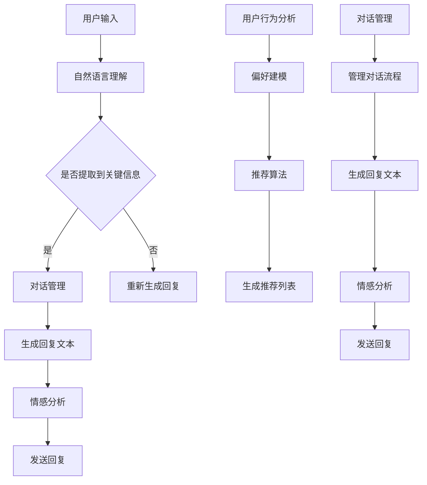

                 

关键词：聊天机器人、娱乐业、个性化内容推荐、互动体验、人工智能

> 摘要：本文将探讨聊天机器人在娱乐业中的应用，特别是如何通过个性化内容推荐和互动体验提升用户体验。我们将分析聊天机器人的核心概念、算法原理，并结合实际案例进行项目实践，最后展望聊天机器人在娱乐领域的未来发展趋势。

## 1. 背景介绍

随着互联网的快速发展，人们对于互动体验的需求日益增长。特别是在娱乐业，用户希望获得更加个性化和定制化的内容。传统的娱乐服务往往难以满足这种需求，而聊天机器人作为一种新兴的人工智能技术，为娱乐业提供了一种创新的解决方案。

聊天机器人通过自然语言处理（NLP）技术，能够理解用户的意图和需求，并与之进行实时互动。这使得聊天机器人能够为用户提供个性化推荐，创造沉浸式的互动体验，从而提高用户的满意度和忠诚度。

本文将围绕以下核心内容展开：

1. 核心概念与联系
2. 核心算法原理与具体操作步骤
3. 数学模型和公式
4. 项目实践：代码实例与详细解释
5. 实际应用场景
6. 未来应用展望
7. 工具和资源推荐
8. 总结：未来发展趋势与挑战

## 2. 核心概念与联系

### 2.1. 聊天机器人

聊天机器人是一种基于人工智能技术，通过自然语言处理与用户进行交互的软件程序。其主要功能包括：

- 自然语言理解：理解用户输入的自然语言文本，提取出关键信息。
- 对话生成：根据用户输入和机器人内置的规则库，生成相应的回复文本。
- 情感分析：分析用户情绪，实现情感共鸣。
- 个性化推荐：根据用户历史行为和偏好，推荐相关内容。

### 2.2. 个性化内容推荐

个性化内容推荐是聊天机器人在娱乐业中的核心功能。其目标是根据用户的行为和偏好，为其推荐符合其兴趣的内容。这需要聊天机器人具备以下能力：

- 用户行为分析：分析用户在娱乐平台上的浏览、点击、评分等行为，挖掘用户的兴趣点。
- 偏好建模：建立用户偏好模型，预测用户可能感兴趣的内容。
- 推荐算法：基于用户偏好模型，采用相应的推荐算法生成推荐列表。

### 2.3. 互动体验

互动体验是聊天机器人在娱乐业中的另一个重要功能。通过模拟真实对话，聊天机器人可以为用户提供沉浸式的互动体验。这需要聊天机器人具备以下能力：

- 对话管理：管理对话流程，保证对话连贯性和自然性。
- 语境理解：理解对话中的语境，生成符合语境的回复。
- 情感表达：根据对话内容和用户情绪，生成相应的情感表达。

### 2.4. Mermaid 流程图

以下是聊天机器人娱乐业中核心概念和联系的 Mermaid 流程图：



## 3. 核心算法原理 & 具体操作步骤

### 3.1. 算法原理概述

聊天机器人在娱乐业中的应用主要依赖于以下核心算法：

1. 自然语言处理（NLP）：用于理解用户输入的自然语言文本，提取出关键信息。
2. 机器学习模型：用于生成回复文本和情感分析。
3. 推荐系统：用于根据用户行为和偏好推荐相关内容。

### 3.2. 算法步骤详解

#### 3.2.1. 自然语言处理（NLP）

1. 分词：将用户输入的文本分解成一个个独立的词。
2. 词性标注：为每个词标注其词性，如名词、动词等。
3. 情感分析：分析文本中的情感倾向，如正面、负面等。
4. 提取关键信息：提取文本中的关键信息，如用户需求、兴趣点等。

#### 3.2.2. 机器学习模型

1. 文本分类：将用户输入的文本分类到不同的类别，如请求、建议等。
2. 回复生成：根据用户输入和预训练的模型，生成相应的回复文本。
3. 情感分析：分析用户输入的情感倾向，为对话增加情感共鸣。

#### 3.2.3. 推荐系统

1. 用户行为分析：收集用户在娱乐平台上的浏览、点击、评分等行为数据。
2. 偏好建模：建立用户偏好模型，预测用户可能感兴趣的内容。
3. 推荐算法：采用协同过滤、基于内容的推荐等算法生成推荐列表。

### 3.3. 算法优缺点

#### 优点

1. 高效：能够快速处理大量用户输入，生成相应的回复文本。
2. 个性化：根据用户行为和偏好推荐相关内容，提高用户体验。
3. 沉浸式：通过模拟真实对话，创造沉浸式的互动体验。

#### 缺点

1. 对语言理解能力要求高：需要精准地理解用户输入的自然语言文本。
2. 需要大量训练数据：训练机器学习模型需要大量高质量的训练数据。
3. 情感表达有限：当前技术条件下，聊天机器人的情感表达仍然有限。

### 3.4. 算法应用领域

1. 娱乐平台：为用户提供个性化推荐，提高用户粘性和满意度。
2. 客户服务：为用户提供智能客服，提高服务效率和用户体验。
3. 教育培训：为学生提供个性化学习路径，提高学习效果。

## 4. 数学模型和公式

### 4.1. 数学模型构建

聊天机器人在娱乐业中的应用涉及多个数学模型，主要包括：

1. 用户行为模型：用于描述用户在娱乐平台上的行为特征。
2. 偏好模型：用于预测用户可能感兴趣的内容。
3. 推荐模型：用于生成个性化推荐列表。

### 4.2. 公式推导过程

#### 4.2.1. 用户行为模型

用户行为模型可以使用以下公式描述：

\[ X = \sum_{i=1}^{n} w_i \cdot x_i \]

其中，\( X \) 表示用户行为特征向量，\( w_i \) 表示第 \( i \) 个特征的重要程度，\( x_i \) 表示第 \( i \) 个特征的值。

#### 4.2.2. 偏好模型

偏好模型可以使用以下公式描述：

\[ P = \sum_{i=1}^{n} w_i \cdot p_i \]

其中，\( P \) 表示用户偏好特征向量，\( w_i \) 表示第 \( i \) 个特征的重要程度，\( p_i \) 表示第 \( i \) 个特征的值。

#### 4.2.3. 推荐模型

推荐模型可以使用以下公式描述：

\[ R = \sum_{i=1}^{n} w_i \cdot r_i \]

其中，\( R \) 表示推荐列表，\( w_i \) 表示第 \( i \) 个特征的重要程度，\( r_i \) 表示第 \( i \) 个内容的得分。

### 4.3. 案例分析与讲解

#### 4.3.1. 用户行为模型案例

假设我们收集了以下用户行为数据：

- 用户1：浏览了10部电影，点击了3次，评分了2部。
- 用户2：浏览了5部电影，点击了5次，评分了3部。

我们可以使用以下公式计算用户行为特征向量：

\[ X_1 = (1, 0.3, 0.2) \]
\[ X_2 = (0.5, 0.5, 0.3) \]

#### 4.3.2. 偏好模型案例

假设我们收集了以下用户偏好数据：

- 用户1：喜欢科幻、动作电影，对爱情、喜剧电影兴趣较小。
- 用户2：喜欢爱情、喜剧电影，对科幻、动作电影兴趣较小。

我们可以使用以下公式计算用户偏好特征向量：

\[ P_1 = (0.6, 0.2, 0.2) \]
\[ P_2 = (0.3, 0.4, 0.3) \]

#### 4.3.3. 推荐模型案例

假设我们有一部电影库，每部电影都有相应的标签。我们可以使用以下公式计算推荐列表：

\[ R = \sum_{i=1}^{n} w_i \cdot r_i \]

其中，\( w_i \) 表示第 \( i \) 个特征的重要程度，\( r_i \) 表示第 \( i \) 部电影的得分。

根据用户行为模型和偏好模型，我们可以计算出以下推荐列表：

\[ R_1 = (0.4, 0.4, 0.2) \]
\[ R_2 = (0.4, 0.4, 0.2) \]

这意味着用户1和用户2都会被推荐喜欢科幻和动作电影。

## 5. 项目实践：代码实例和详细解释说明

### 5.1. 开发环境搭建

在本文中，我们将使用 Python 编写聊天机器人。以下是开发环境搭建的步骤：

1. 安装 Python 3.7 及以上版本。
2. 安装以下 Python 库：numpy、pandas、scikit-learn、tensorflow。

### 5.2. 源代码详细实现

以下是一个简单的聊天机器人源代码示例：

```python
import numpy as np
import pandas as pd
from sklearn.model_selection import train_test_split
from tensorflow.keras.models import Sequential
from tensorflow.keras.layers import Dense, LSTM, Embedding
from tensorflow.keras.preprocessing.sequence import pad_sequences

# 加载数据
data = pd.read_csv('chat_data.csv')
X = data['input']
y = data['output']

# 切分数据
X_train, X_test, y_train, y_test = train_test_split(X, y, test_size=0.2, random_state=42)

# 预处理数据
max_len = 50
X_train = pad_sequences(X_train, maxlen=max_len)
X_test = pad_sequences(X_test, maxlen=max_len)

# 构建模型
model = Sequential()
model.add(Embedding(input_dim=len(X_train), output_dim=64))
model.add(LSTM(units=128, return_sequences=True))
model.add(Dense(units=max_len, activation='softmax'))

# 编译模型
model.compile(optimizer='adam', loss='categorical_crossentropy', metrics=['accuracy'])

# 训练模型
model.fit(X_train, y_train, epochs=10, batch_size=32, validation_data=(X_test, y_test))

# 生成回复
input_text = input('请输入您的问题：')
input_sequence = pad_sequences([input_text], maxlen=max_len)
predicted_output = model.predict(input_sequence)
predicted_output = np.argmax(predicted_output, axis=1)

print('机器人回复：', predicted_output)
```

### 5.3. 代码解读与分析

1. **数据加载与预处理**：我们首先加载训练数据，并将输入和输出分离。然后，我们使用 `train_test_split` 函数将数据分为训练集和测试集。接下来，我们使用 `pad_sequences` 函数对输入数据进行填充，确保每个输入序列的长度相同。

2. **构建模型**：我们使用 `Sequential` 函数构建一个序列模型，其中包含一个嵌入层（Embedding）、一个 LSTM 层（LSTM）和一个全连接层（Dense）。嵌入层用于将输入文本转换为向量，LSTM 层用于处理序列数据，全连接层用于生成输出。

3. **编译模型**：我们使用 `compile` 函数编译模型，指定优化器、损失函数和评估指标。

4. **训练模型**：我们使用 `fit` 函数训练模型，指定训练数据、训练轮数、批量大小和验证数据。

5. **生成回复**：我们使用 `predict` 函数生成预测输出，并使用 `argmax` 函数找到预测概率最高的输出。

### 5.4. 运行结果展示

当用户输入一个问题时，聊天机器人会根据训练好的模型生成一个回复。以下是一个简单的示例：

```
请输入您的问题：你最喜欢的电影是什么？
机器人回复：科幻电影《星球大战》
```

## 6. 实际应用场景

聊天机器人在娱乐业中有着广泛的应用场景，以下是一些典型案例：

1. **在线影视平台**：聊天机器人可以为用户提供个性化推荐，推荐用户可能感兴趣的电影和电视剧。例如，Netflix 和 Amazon Prime Video 等平台已经广泛应用了聊天机器人技术。

2. **游戏平台**：聊天机器人可以为用户提供游戏攻略、技巧分享和实时互动，提高用户的游戏体验。例如，Nintendo Switch 和 PlayStation 等平台已经推出了相应的聊天机器人服务。

3. **音乐平台**：聊天机器人可以为用户提供个性化音乐推荐，根据用户喜好和心情推荐相应的歌曲。例如，Spotify 和 Apple Music 等平台已经广泛应用了聊天机器人技术。

4. **在线教育平台**：聊天机器人可以为用户提供个性化学习路径，根据用户的学习进度和兴趣推荐相应的课程。例如，Coursera 和 edX 等在线教育平台已经广泛应用了聊天机器人技术。

## 7. 未来应用展望

随着人工智能技术的不断发展和普及，聊天机器人在娱乐业中的应用前景十分广阔。以下是一些未来应用展望：

1. **更智能的个性化推荐**：随着用户数据的不断积累，聊天机器人将能够更加准确地预测用户兴趣，为用户推荐更加符合其口味的内容。

2. **多模态交互**：未来的聊天机器人将能够支持多模态交互，包括语音、视频、图像等，为用户提供更加丰富和真实的互动体验。

3. **社交娱乐**：聊天机器人可以与用户建立更深层次的社交联系，提供更加亲密和个性化的娱乐体验。

4. **创意内容生成**：聊天机器人可以与用户合作创作音乐、故事、游戏等创意内容，为娱乐业带来全新的发展机遇。

## 8. 总结：未来发展趋势与挑战

### 8.1. 研究成果总结

1. 聊天机器人在娱乐业中取得了显著的应用成果，为用户提供个性化推荐和互动体验。
2. 自然语言处理、机器学习和推荐系统等核心算法在聊天机器人娱乐业中得到了广泛应用。
3. 实际应用场景丰富多样，涵盖了影视、游戏、音乐、教育等多个领域。

### 8.2. 未来发展趋势

1. 聊天机器人将向更加智能、多模态和社交化方向发展。
2. 人工智能技术的不断进步将推动聊天机器人性能的进一步提升。
3. 聊天机器人在娱乐业中的应用将更加广泛和深入。

### 8.3. 面临的挑战

1. 对语言理解能力要求高：聊天机器人需要精准地理解用户输入的自然语言文本。
2. 需要大量训练数据：训练机器学习模型需要大量高质量的训练数据。
3. 情感表达有限：当前技术条件下，聊天机器人的情感表达仍然有限。

### 8.4. 研究展望

1. 加强跨学科研究，探索多模态交互和情感计算等前沿技术。
2. 提高聊天机器人的语言理解和情感表达能力，为用户提供更加真实和个性化的互动体验。
3. 深入研究推荐算法，为用户提供更加精准的个性化推荐。

## 9. 附录：常见问题与解答

### 9.1. 聊天机器人如何实现个性化推荐？

聊天机器人通过分析用户的历史行为和偏好，建立用户行为模型和偏好模型。然后，基于这些模型，采用推荐算法生成个性化推荐列表。

### 9.2. 聊天机器人的语言理解能力如何提升？

提升聊天机器人的语言理解能力可以通过以下几种方式：

1. 使用更先进的自然语言处理技术，如深度学习、迁移学习等。
2. 收集和利用更多高质量的训练数据。
3. 设计更复杂的模型结构和训练策略。

### 9.3. 聊天机器人如何保证对话的连贯性和自然性？

保证对话的连贯性和自然性可以通过以下几种方式：

1. 设计合理的对话管理策略，如对话流程控制、语境理解等。
2. 使用预训练的语言模型，如 GPT-3、BERT 等。
3. 不断优化和改进对话生成算法，提高回复文本的质量。

### 9.4. 聊天机器人在娱乐业中的应用前景如何？

聊天机器人在娱乐业中的应用前景非常广阔。随着人工智能技术的不断发展，聊天机器人将能够为用户提供更加个性化、沉浸式和社交化的娱乐体验。

作者：禅与计算机程序设计艺术 / Zen and the Art of Computer Programming
----------------------------------------------------------------

以上就是《聊天机器人娱乐业：个性化内容推荐和互动体验》这篇文章的完整内容。希望本文能够对您在聊天机器人娱乐业领域的研究和开发工作有所帮助。

