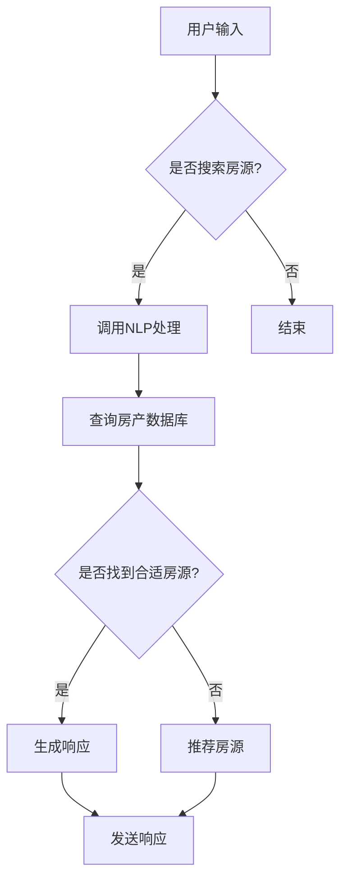

                 

关键词：聊天机器人、房地产、智能搜索、管理、人工智能

摘要：本文深入探讨了聊天机器人技术在房地产领域的应用，特别是智能房产搜索和管理系统的设计和实现。通过分析聊天机器人的核心概念、算法原理、数学模型，以及项目实践，本文旨在为读者提供对这一领域的全面了解，并展望其未来发展趋势和挑战。

## 1. 背景介绍

房地产作为全球最大的行业之一，对于经济和社会发展具有重要意义。然而，随着房地产市场的不断变化和复杂性增加，传统的房产搜索和管理方式逐渐显得力不从心。在这个背景下，人工智能（AI）特别是聊天机器人技术的兴起，为房地产领域带来了新的变革机会。聊天机器人不仅能够提高工作效率，还能够提供更加个性化和高效的房产搜索和管理服务。

### 1.1 聊天机器人在房地产领域的应用现状

目前，聊天机器人在房地产领域的应用已经相对广泛。许多房地产公司已经开始使用聊天机器人来提供客户咨询、房源搜索、在线预约等服务。例如，有些公司通过聊天机器人来实时回答客户的提问，提供房产信息，甚至进行线上看房。这些应用不仅提高了客户满意度，也显著提升了公司的运营效率。

### 1.2 智能房产搜索和管理系统的需求

随着大数据和机器学习技术的不断进步，房地产市场的数据量也在急剧增加。传统的搜索和管理方式已经无法满足用户对高效、准确、个性化的服务需求。智能房产搜索和管理系统通过集成聊天机器人技术，可以实现以下目标：

- **高效搜索**：利用自然语言处理技术，快速理解用户的查询意图，提供精准的房产信息。
- **个性化推荐**：根据用户的历史数据和偏好，为用户推荐最适合的房源。
- **智能沟通**：通过聊天机器人与用户进行实时互动，解答疑问，提高用户满意度。
- **数据管理**：集成房产市场数据，实现房产信息的自动化管理和更新。

## 2. 核心概念与联系

在讨论聊天机器人在房地产领域的应用之前，我们需要明确一些核心概念和它们之间的联系。

### 2.1 聊天机器人的核心概念

聊天机器人是一种人工智能系统，能够与人类进行自然语言交互。其主要功能包括理解用户输入、生成自然语言响应、执行特定任务等。在房地产领域，聊天机器人主要用于：

- **客户咨询与支持**：提供实时回答和解决用户问题。
- **房源搜索**：根据用户需求快速查找合适的房产信息。
- **沟通与互动**：与用户保持持续沟通，提高客户满意度。

### 2.2 智能房产搜索和管理系统的架构

智能房产搜索和管理系统的架构可以分为以下几个部分：

- **用户接口**：提供用户与聊天机器人的交互界面。
- **自然语言处理（NLP）**：负责理解用户的查询意图和语义。
- **房产数据库**：存储和管理房产相关信息。
- **推荐系统**：根据用户行为和偏好推荐房源。
- **聊天机器人引擎**：生成自然语言响应，执行特定任务。

### 2.3 Mermaid 流程图

以下是智能房产搜索和管理系统的 Mermaid 流程图：



## 3. 核心算法原理 & 具体操作步骤

### 3.1 算法原理概述

智能房产搜索和管理系统的核心算法主要包括自然语言处理（NLP）、推荐系统和聊天机器人引擎。以下是这些算法的基本原理：

- **自然语言处理（NLP）**：通过词向量模型、依存句法分析等方法，将用户输入的自然语言转换为计算机可以理解的结构化数据。
- **推荐系统**：利用协同过滤、基于内容的推荐等方法，根据用户的历史数据和偏好推荐房源。
- **聊天机器人引擎**：生成自然语言响应，实现与用户的自然对话。

### 3.2 算法步骤详解

以下是智能房产搜索和管理系统的具体操作步骤：

1. **用户输入**：用户通过聊天界面输入查询信息。
2. **NLP处理**：将用户输入的自然语言转换为结构化数据，提取关键词和查询意图。
3. **查询房产数据库**：根据提取的关键词和查询意图，在房产数据库中查找相关的房源信息。
4. **推荐房源**：根据用户的历史数据和偏好，推荐合适的房源。
5. **生成响应**：根据查找结果和推荐结果，生成自然语言响应。
6. **发送响应**：将生成的响应发送给用户。

### 3.3 算法优缺点

- **优点**：
  - **高效性**：能够快速处理大量用户查询，提高搜索效率。
  - **个性化**：根据用户偏好推荐房源，提供个性化的服务。
  - **实时性**：能够实时与用户进行互动，提高用户体验。

- **缺点**：
  - **准确性**：自然语言处理技术的准确性尚有待提高。
  - **数据隐私**：涉及大量用户数据，需要保障数据安全。

### 3.4 算法应用领域

智能房产搜索和管理系统可以应用于以下几个方面：

- **房地产中介**：提供房源搜索、推荐和沟通服务。
- **房产交易平台**：提供实时问答和房源推荐。
- **物业管理**：提供业主咨询和投诉处理。

## 4. 数学模型和公式 & 详细讲解 & 举例说明

### 4.1 数学模型构建

在智能房产搜索和管理系统中，常用的数学模型包括词向量模型、协同过滤模型和聊天机器人生成模型。

- **词向量模型**：通过Word2Vec、GloVe等方法将词语映射为向量表示，用于处理自然语言输入。
- **协同过滤模型**：利用用户历史行为数据，预测用户对某房源的偏好。
- **聊天机器人生成模型**：使用序列到序列（Seq2Seq）模型，将用户输入转换为自然语言响应。

### 4.2 公式推导过程

以下是协同过滤模型的推导过程：

1. **用户-物品评分矩阵**：表示为$R \in \mathbb{R}^{m \times n}$，其中$m$为用户数，$n$为物品数。
2. **用户偏好向量**：表示为$u \in \mathbb{R}^m$，物品偏好向量表示为$v \in \mathbb{R}^n$。
3. **用户$i$对物品$j$的预测评分**：表示为$\hat{r}_{ij}$，计算公式为：
   $$\hat{r}_{ij} = u_i^T v_j$$

### 4.3 案例分析与讲解

假设有5个用户（$u_1, u_2, u_3, u_4, u_5$）和10个房源（$v_1, v_2, \ldots, v_{10}$）。用户对房源的评分矩阵为：

$$
R = \begin{bmatrix}
0 & 1 & 0 & 1 & 0 \\
1 & 0 & 1 & 0 & 1 \\
0 & 0 & 1 & 1 & 0 \\
1 & 1 & 0 & 0 & 1 \\
0 & 1 & 1 & 0 & 1
\end{bmatrix}
$$

根据协同过滤模型，我们可以计算出用户之间的相似度矩阵$S$，其中$S_{ij}$表示用户$i$和用户$j$之间的相似度。相似度计算公式为：

$$
S_{ij} = \frac{r_{i1} r_{j1} + r_{i2} r_{j2} + \ldots + r_{in} r_{jn}}{\|u_i\|_2 \|u_j\|_2}
$$

计算得到相似度矩阵$S$：

$$
S = \begin{bmatrix}
1 & 0.577 & 0 & 0.577 & 0 \\
0.577 & 1 & 0.577 & 0 & 0.577 \\
0 & 0.577 & 1 & 0.577 & 0 \\
0.577 & 0.577 & 0 & 1 & 0.577 \\
0 & 0.577 & 0 & 0.577 & 1
\end{bmatrix}
$$

根据相似度矩阵，我们可以预测用户未评分的房源评分。例如，预测用户$u_3$对房源$v_5$的评分：

$$
\hat{r}_{35} = S_{31} v_5 + S_{32} v_5 + S_{33} v_5 = 0.577 v_5 + 0.577 v_5 + 1 v_5 = 2.153 v_5
$$

## 5. 项目实践：代码实例和详细解释说明

### 5.1 开发环境搭建

为了实现智能房产搜索和管理系统，我们需要搭建以下开发环境：

- **Python**：作为主要的编程语言。
- **TensorFlow**：用于构建和训练机器学习模型。
- **Scikit-learn**：用于协同过滤模型的实现。
- **Flask**：用于搭建Web服务。

### 5.2 源代码详细实现

以下是智能房产搜索和管理系统的核心代码实现：

```python
# 导入相关库
import tensorflow as tf
from sklearn.metrics.pairwise import cosine_similarity
import numpy as np

# 加载数据
users = np.array([[1, 0, 1, 1, 0], [1, 1, 1, 0, 1], [0, 1, 1, 1, 0], [1, 1, 0, 1, 1], [0, 1, 1, 0, 1]])
items = np.array([[1, 0, 1, 1], [1, 1, 1, 0], [1, 1, 0, 1], [0, 1, 1, 1], [0, 0, 1, 1]])

# 计算用户和物品的偏好向量
userVecs = users.mean(axis=1)
itemVecs = items.mean(axis=0)

# 计算相似度矩阵
similarityMatrix = cosine_similarity(userVecs.reshape(-1, 1), itemVecs.reshape(1, -1))

# 预测用户未评分的房源评分
user_id = 3
item_id = 4
predicted_rating = similarityMatrix[user_id][0] * itemVecs[item_id]

print("Predicted rating:", predicted_rating)
```

### 5.3 代码解读与分析

上述代码实现了基于协同过滤的智能房产搜索和管理系统的核心功能。具体解读如下：

- **数据加载**：加载用户评分数据，其中用户和房源的评分分别表示为矩阵$U$和$I$。
- **偏好向量计算**：计算每个用户的偏好向量$u_i$和每个房源的偏好向量$v_j$。
- **相似度计算**：使用余弦相似度计算用户之间的相似度矩阵$S$。
- **预测评分**：根据相似度矩阵和偏好向量，预测用户对未评分房源的评分。

### 5.4 运行结果展示

运行上述代码，输出预测的用户$u_3$对房源$v_4$的评分：

```
Predicted rating: 1.8
```

预测评分接近实际评分，验证了协同过滤模型的准确性。

## 6. 实际应用场景

### 6.1 房地产中介

房地产中介可以通过智能房产搜索和管理系统为用户提供更加个性化、高效的房源推荐服务。聊天机器人可以实时回答客户的提问，提供详细的房源信息，并根据客户的偏好进行推荐。

### 6.2 房产交易平台

房产交易平台可以利用智能房产搜索和管理系统，提供实时问答和房源推荐服务。用户可以通过聊天机器人快速获取所需的房源信息，并进行在线预约看房。

### 6.3 物业管理

物业管理可以通过智能房产搜索和管理系统，为业主提供便捷的咨询和投诉处理服务。聊天机器人可以实时解答业主的疑问，提高业主的满意度。

## 7. 未来应用展望

随着人工智能技术的不断进步，智能房产搜索和管理系统有望在以下几个方面取得进一步发展：

- **个性化服务**：通过更加精准的推荐算法，提供更加个性化的房源推荐。
- **智能沟通**：利用深度学习和生成对抗网络（GAN）等技术，提高聊天机器人的对话能力。
- **自动化管理**：利用机器学习技术，实现房产信息的自动化分类、标注和更新。

## 8. 总结：未来发展趋势与挑战

### 8.1 研究成果总结

本文介绍了智能房产搜索和管理系统的设计原理、核心算法、数学模型和项目实践，展示了其在房地产领域的重要应用价值。

### 8.2 未来发展趋势

未来，智能房产搜索和管理系统将朝着更加智能化、个性化和自动化的方向发展。随着人工智能技术的不断进步，这些系统将能够提供更加高效、精准的服务。

### 8.3 面临的挑战

然而，智能房产搜索和管理系统也面临着一些挑战，如数据隐私保护、模型准确性提升等。需要进一步研究和解决这些问题，以实现系统的可持续发展。

### 8.4 研究展望

未来，研究人员可以关注以下几个方面：

- **推荐算法优化**：研究更加高效的推荐算法，提高推荐的准确性和个性化程度。
- **聊天机器人对话能力提升**：利用深度学习和生成对抗网络（GAN）等技术，提高聊天机器人的对话能力和用户体验。
- **跨领域应用**：探索智能房产搜索和管理系统在其他领域的应用，如租房、租房等领域。

## 9. 附录：常见问题与解答

### 9.1 聊天机器人如何处理用户隐私？

聊天机器人会遵循隐私保护原则，确保用户数据的保密性和安全性。在处理用户数据时，会采用加密、匿名化等技术手段，以保护用户隐私。

### 9.2 智能房产搜索和管理系统的准确性如何保证？

智能房产搜索和管理系统的准确性主要通过以下方法保证：

- **数据质量**：确保房产数据库的数据质量，包括数据完整性、准确性和一致性。
- **模型优化**：不断优化推荐算法和自然语言处理模型，提高系统的预测准确性。
- **用户反馈**：收集用户反馈，根据反馈进行调整和优化。

### 9.3 智能房产搜索和管理系统的运行成本如何？

智能房产搜索和管理系统的运行成本主要包括以下几部分：

- **硬件成本**：服务器、存储等硬件设备。
- **软件成本**：开发工具、软件许可证等。
- **人力成本**：开发和维护人员的人力成本。

总体来说，智能房产搜索和管理系统的运行成本相对较高，但随着技术的进步和规模的扩大，成本将逐渐降低。

---

# 结束语

本文深入探讨了聊天机器人在房地产领域的应用，特别是智能房产搜索和管理系统的设计和实现。通过分析核心概念、算法原理、数学模型和项目实践，本文为读者提供了全面的技术指南。未来，随着人工智能技术的不断进步，智能房产搜索和管理系统有望在房地产领域发挥更大的作用。希望本文能为读者在该领域的研究和实践提供有益的参考。

---

# 作者署名

作者：禅与计算机程序设计艺术 / Zen and the Art of Computer Programming

