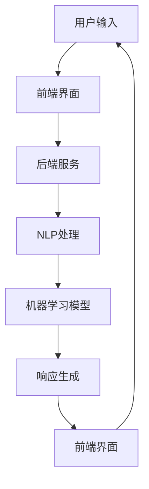

                 

关键词：聊天机器人、战略决策、商业洞察力、管理、技术

> 摘要：本文将探讨聊天机器人在当今商业环境中的重要性，以及如何通过战略决策和商业洞察力来优化和管理聊天机器人的性能和用户体验。我们将深入分析聊天机器人的架构、算法原理，并探讨数学模型在实际应用中的作用。同时，本文还将通过项目实践、实际应用场景和未来展望，为读者提供全面的指导和建议。

## 1. 背景介绍

随着互联网的普及和移动设备的普及，聊天机器人已经成为现代商业环境中不可或缺的一部分。聊天机器人的应用场景广泛，包括客服支持、在线购物、金融服务、医疗咨询等。它们可以提供24/7全天候的服务，极大地提高了企业的运营效率和用户体验。

然而，随着聊天机器人的广泛应用，如何有效地管理和优化聊天机器人的性能和用户体验成为一个重要课题。本文将围绕这个主题展开，从战略决策和商业洞察力的角度，深入探讨聊天机器人的管理方法。

## 2. 核心概念与联系

### 2.1 聊天机器人架构

聊天机器人的架构通常包括以下几个核心组成部分：

1. **前端界面**：用户与聊天机器人交互的界面，通常是一个文本聊天窗口或语音交互界面。
2. **后端服务**：处理用户请求、管理对话流程和提供业务逻辑的服务端组件。
3. **自然语言处理（NLP）**：用于解析和理解用户输入的自然语言。
4. **机器学习模型**：用于生成响应、推荐和决策。
5. **数据库**：存储用户数据、对话历史和业务数据。

下面是一个简化的 Mermaid 流程图，展示了聊天机器人的主要组件和交互流程：



### 2.2 核心概念

- **意图识别（Intent Recognition）**：识别用户的意图或需求。
- **实体提取（Entity Extraction）**：从用户输入中提取关键信息或实体。
- **对话管理（Dialogue Management）**：管理对话流程，包括上下文维护和用户状态管理。
- **自然语言生成（Natural Language Generation）**：生成自然语言响应。

## 3. 核心算法原理 & 具体操作步骤

### 3.1 算法原理概述

聊天机器人的核心算法主要涉及自然语言处理（NLP）和机器学习（ML）。NLP算法负责理解和生成自然语言，而ML算法则用于从数据中学习并改进对话质量。

### 3.2 算法步骤详解

1. **意图识别**：使用分类算法（如朴素贝叶斯、决策树、支持向量机等）将用户输入映射到预定义的意图类别。
2. **实体提取**：使用命名实体识别（NER）算法提取用户输入中的关键信息，如人名、地点、日期等。
3. **对话管理**：使用图论算法（如图遍历、路径规划等）维护对话上下文，确保对话连贯性和用户满意度。
4. **自然语言生成**：使用序列到序列（Seq2Seq）模型或生成对抗网络（GAN）生成自然语言响应。

### 3.3 算法优缺点

- **朴素贝叶斯、决策树和支持向量机**：简单易实现，但效果相对有限。
- **深度学习模型（如神经网络、循环神经网络、长短时记忆网络等）**：效果更好，但计算成本高，训练时间长。

### 3.4 算法应用领域

聊天机器人算法广泛应用于各种场景，包括：

- **客服支持**：提供快速、准确的客户服务。
- **在线购物**：提供个性化推荐和购物建议。
- **金融服务**：处理账户查询、交易咨询等。
- **医疗咨询**：提供基础健康咨询和症状推荐。

## 4. 数学模型和公式 & 详细讲解 & 举例说明

### 4.1 数学模型构建

聊天机器人的数学模型通常涉及以下几个关键方面：

- **意图识别模型**：使用逻辑回归、支持向量机等分类算法。
- **实体提取模型**：使用条件概率模型或序列标注模型。
- **对话管理模型**：使用图论算法和概率图模型。
- **自然语言生成模型**：使用序列到序列模型或生成对抗网络。

### 4.2 公式推导过程

- **意图识别**：

  $$P(Intent|Text) = \frac{P(Text|Intent) \cdot P(Intent)}{P(Text)}$$

- **实体提取**：

  $$P(Entity|Word) = \frac{P(Word|Entity) \cdot P(Entity)}{P(Word)}$$

- **对话管理**：

  $$P(Dialogue|History) = \prod_{t=1}^{T} P(Action_t|History)$$

- **自然语言生成**：

  $$P(Response|Input) = \sum_{r \in Responses} P(Response=r|Input)$$

### 4.3 案例分析与讲解

以客服支持为例，我们使用逻辑回归模型进行意图识别。给定用户输入的文本，我们通过特征工程提取文本的特征，如词袋模型、TF-IDF等，然后输入逻辑回归模型进行分类。

例如，用户输入“我想要退款”，我们可以提取以下特征：

- “想要”：“想要”这个词的出现频率。
- “退款”：“退款”这个词的出现频率。

使用逻辑回归模型，我们可以计算每个意图的概率：

$$P(Intent=退款|输入) = \frac{e^{w_1 \cdot f_1 + w_2 \cdot f_2}}{1 + e^{w_1 \cdot f_1 + w_2 \cdot f_2}}$$

其中，$w_1$和$w_2$是权重，$f_1$和$f_2$是提取的特征。

## 5. 项目实践：代码实例和详细解释说明

### 5.1 开发环境搭建

为了演示聊天机器人的开发过程，我们将使用Python作为编程语言，并使用以下库：

- **TensorFlow**：用于构建和训练机器学习模型。
- **NLTK**：用于自然语言处理。
- **Scikit-learn**：用于特征提取和模型训练。

### 5.2 源代码详细实现

下面是一个简单的聊天机器人实现：

```python
import tensorflow as tf
import nltk
from nltk.tokenize import word_tokenize
from sklearn.feature_extraction.text import TfidfVectorizer
from sklearn.linear_model import LogisticRegression

# 加载预训练模型
model = LogisticRegression()

# 加载对话数据集
data = ...

# 特征提取
vectorizer = TfidfVectorizer()
X = vectorizer.fit_transform(data['input'])

# 模型训练
model.fit(X, data['label'])

# 自然语言处理
def process_input(input_text):
    tokens = word_tokenize(input_text)
    features = vectorizer.transform([' '.join(tokens)])
    return model.predict(features)[0]

# 用户交互
while True:
    user_input = input("用户输入：")
    intent = process_input(user_input)
    print(f"聊天机器人：您想{intent}")
```

### 5.3 代码解读与分析

这段代码首先加载预训练的逻辑回归模型和数据集。然后，使用TF-IDF向量器提取输入文本的特征，并使用逻辑回归模型进行分类。最后，通过自然语言处理函数`process_input`处理用户输入，并输出聊天机器人的响应。

### 5.4 运行结果展示

当用户输入“我想要退款”时，聊天机器人的响应将是“您想退款”。

## 6. 实际应用场景

### 6.1 客服支持

聊天机器人可以为企业提供高效的客户支持，处理常见问题和投诉。通过意图识别和实体提取，聊天机器人可以快速定位用户需求，并提供准确的解决方案。

### 6.2 在线购物

聊天机器人可以帮助用户进行在线购物，提供个性化推荐、购物车管理和订单跟踪服务。通过对话管理，聊天机器人可以维护用户购物状态，确保购物过程的连贯性。

### 6.3 金融服务

聊天机器人可以提供金融咨询服务，包括账户查询、投资建议和风险提示。通过自然语言生成，聊天机器人可以生成专业且自然的金融报告。

### 6.4 医疗咨询

聊天机器人可以提供基础的医疗咨询，包括症状推荐、健康建议和预约挂号服务。通过对话管理，聊天机器人可以维护用户健康状态，确保咨询过程的连贯性。

## 7. 工具和资源推荐

### 7.1 学习资源推荐

- **《自然语言处理综论》（Speech and Language Processing）**：Goodfellow, Bengio, Courville。
- **《深度学习》（Deep Learning）**：Goodfellow, Bengio, Courville。

### 7.2 开发工具推荐

- **TensorFlow**：用于构建和训练机器学习模型。
- **NLTK**：用于自然语言处理。
- **Scikit-learn**：用于特征提取和模型训练。

### 7.3 相关论文推荐

- **《End-to-End Language Models for Language Understanding》**：Alec Radford et al.。
- **《A Theoretically Grounded Application of Dropout in Recurrent Neural Networks》**：Yarin Gal and Zoubin Ghahramani。

## 8. 总结：未来发展趋势与挑战

### 8.1 研究成果总结

本文探讨了聊天机器人在现代商业环境中的应用和重要性，分析了聊天机器人的架构和核心算法，并通过项目实践展示了如何实现一个简单的聊天机器人。我们还讨论了数学模型在实际应用中的作用，并展望了聊天机器人在未来商业环境中的发展趋势。

### 8.2 未来发展趋势

- **多模态交互**：结合语音、图像和文本等多种交互方式，提高用户体验。
- **个性化推荐**：基于用户行为和历史数据，提供个性化服务。
- **隐私保护**：确保用户数据的安全和隐私。

### 8.3 面临的挑战

- **自然语言理解**：提高聊天机器人的理解和生成能力，使其更接近人类的交流方式。
- **计算资源**：随着模型复杂性的增加，对计算资源的需求也在不断上升。

### 8.4 研究展望

未来，聊天机器人将在更多领域得到广泛应用，成为企业数字化转型的关键工具。同时，随着技术的进步，聊天机器人将更加智能化，更好地满足用户需求。

## 9. 附录：常见问题与解答

### 9.1 聊天机器人如何处理多语言场景？

使用多语言版本的训练数据和模型，并采用语言检测技术，自动识别用户语言，然后切换到相应的语言模型。

### 9.2 聊天机器人如何保证隐私？

通过加密用户数据、匿名化和数据脱敏等技术，确保用户数据的安全和隐私。

### 9.3 聊天机器人如何处理紧急情况？

聊天机器人可以与人类客服协同工作，当遇到紧急情况时，自动转接给人类客服。

---

作者：禅与计算机程序设计艺术 / Zen and the Art of Computer Programming
----------------------------------------------------------------

以上是《聊天机器人管理层：战略决策和商业洞察力》的技术博客文章的完整内容。希望对您在聊天机器人的研究和实践中有所帮助。如有任何问题或建议，欢迎随时交流。

