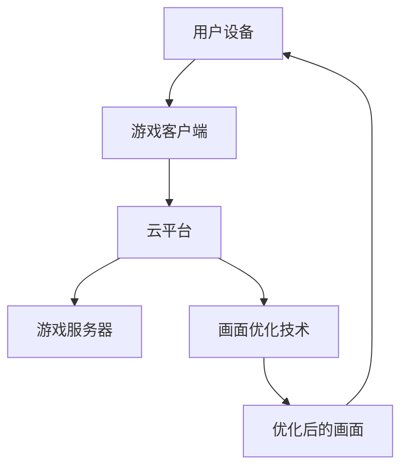

                 

关键词：腾讯、2025、云游戏、画面优化、专家、社招、面试题解

> 摘要：本文将深入解析腾讯2025年面向云游戏画面优化专家的社招面试题，通过分析核心问题，探讨解决思路和策略，帮助读者掌握云游戏画面优化关键技术，为相关领域的职业发展提供有力支持。

## 1. 背景介绍

随着云计算、5G技术的不断发展，云游戏逐渐成为游戏产业的新风口。腾讯作为我国游戏行业的领军企业，积极布局云游戏领域，力求在2025年实现云游戏画面质的飞跃。为了选拔优秀的云游戏画面优化专家，腾讯在2025年社招中设置了多项面试题目，本文将详细解析这些题目，为求职者提供解题思路。

### 云游戏的定义与优势
云游戏，又称游戏即服务（Gaming as a Service，GaaS），是一种将游戏运行在云端服务器上，玩家通过互联网进行远程访问的游戏形式。云游戏具有以下优势：

1. **跨平台**：玩家无需购买昂贵的游戏设备，只需通过网络即可畅玩各类游戏。
2. **便捷性**：随时随地、即点即玩，无需下载和安装。
3. **高效能**：云端服务器承担计算任务，减轻了玩家的硬件负担。
4. **资源共享**：玩家无需担心游戏存储空间和设备性能问题。

### 腾讯在云游戏领域的布局
腾讯在云游戏领域持续发力，通过以下举措推动产业发展：

1. **研发投入**：加大研发投入，不断优化云游戏技术。
2. **战略合作**：与多家硬件厂商、云服务提供商合作，打造优质云游戏生态。
3. **市场推广**：通过线上线下活动，提升云游戏品牌知名度。

## 2. 核心概念与联系

### 核心概念

1. **云游戏架构**：包括游戏客户端、游戏服务器、云平台和用户设备。
2. **画面优化技术**：如分辨率调整、渲染技术、图像压缩技术等。
3. **网络传输**：包括带宽、延迟、丢包等指标。

### 联系

云游戏画面优化专家需要了解上述核心概念，并将它们有机结合，以提高游戏画面的质量。以下是一个简化的Mermaid流程图：



## 3. 核心算法原理 & 具体操作步骤

### 3.1 算法原理概述

云游戏画面优化主要涉及以下算法原理：

1. **分辨率调整**：根据用户设备的屏幕分辨率，动态调整游戏画面的分辨率。
2. **渲染技术**：利用GPU加速，提高游戏画面的渲染效率。
3. **图像压缩技术**：对游戏画面进行压缩，减少数据传输量。

### 3.2 算法步骤详解

1. **分辨率调整**

   - **步骤1**：获取用户设备的屏幕分辨率。
   - **步骤2**：根据屏幕分辨率，计算适合的渲染分辨率。
   - **步骤3**：调整游戏画面的分辨率。

2. **渲染技术**

   - **步骤1**：初始化GPU环境。
   - **步骤2**：加载游戏资源。
   - **步骤3**：使用GPU加速渲染游戏画面。
   - **步骤4**：将渲染后的画面传输给用户设备。

3. **图像压缩技术**

   - **步骤1**：选择合适的图像压缩算法。
   - **步骤2**：对游戏画面进行压缩。
   - **步骤3**：将压缩后的图像数据传输给用户设备。

### 3.3 算法优缺点

1. **分辨率调整**

   - **优点**：简单易行，可以快速提高游戏画面的质量。
   - **缺点**：可能导致图像细节丢失。

2. **渲染技术**

   - **优点**：大幅提高游戏画面的渲染效率。
   - **缺点**：对硬件要求较高，可能增加服务器负担。

3. **图像压缩技术**

   - **优点**：减少数据传输量，提高网络传输效率。
   - **缺点**：可能降低图像质量。

### 3.4 算法应用领域

云游戏画面优化算法广泛应用于游戏产业，包括：

1. **云游戏平台**：如腾讯云游戏、网易云游戏等。
2. **游戏开发**：提高游戏画面质量，提升用户体验。
3. **VR/AR应用**：优化虚拟现实、增强现实应用中的图像质量。

## 4. 数学模型和公式 & 详细讲解 & 举例说明

### 4.1 数学模型构建

云游戏画面优化涉及到多个数学模型，以下是一个简化的数学模型：

1. **分辨率调整模型**：$R_{\text{out}} = \frac{R_{\text{screen}}}{K}$，其中$R_{\text{out}}$为输出分辨率，$R_{\text{screen}}$为屏幕分辨率，$K$为缩放系数。
2. **渲染模型**：$T_{\text{render}} = f(\text{GPU\_performance}, \text{game\_complexity})$，其中$T_{\text{render}}$为渲染时间，$f$为渲染函数，$\text{GPU\_performance}$为GPU性能，$\text{game\_complexity}$为游戏复杂度。
3. **图像压缩模型**：$C = g(\text{image\_quality}, \text{compression\_rate})$，其中$C$为压缩后的图像数据量，$g$为压缩函数，$\text{image\_quality}$为图像质量，$\text{compression\_rate}$为压缩率。

### 4.2 公式推导过程

1. **分辨率调整模型**：

   - **推导**：为了提高游戏画面的质量，我们需要将渲染分辨率调整到与屏幕分辨率相近的值。设缩放系数为$K$，则输出分辨率$R_{\text{out}}$为$R_{\text{screen}}$的$K$倍。

2. **渲染模型**：

   - **推导**：渲染时间取决于GPU性能和游戏复杂度。假设GPU性能和游戏复杂度成正比，则有$T_{\text{render}} = f(\text{GPU\_performance}, \text{game\_complexity})$。

3. **图像压缩模型**：

   - **推导**：压缩后的图像数据量与图像质量和压缩率成正比。假设图像质量和压缩率成正比，则有$C = g(\text{image\_quality}, \text{compression\_rate})$。

### 4.3 案例分析与讲解

假设一个用户设备的屏幕分辨率为$1920 \times 1080$，我们希望将游戏画面的分辨率调整到与屏幕分辨率相近的值。根据分辨率调整模型，我们有：

$$
R_{\text{out}} = \frac{R_{\text{screen}}}{K} = \frac{1920 \times 1080}{\sqrt{2}} \approx 1382 \times 777
$$

假设GPU性能为$1000$帧/秒，游戏复杂度为$2000$帧/秒，根据渲染模型，我们有：

$$
T_{\text{render}} = f(\text{GPU\_performance}, \text{game\_complexity}) = f(1000, 2000) = 2 \text{秒}
$$

假设图像质量为$90\%$，压缩率为$50\%$，根据图像压缩模型，我们有：

$$
C = g(\text{image\_quality}, \text{compression\_rate}) = g(90\%, 50\%) = 0.5 \text{MB}
$$

## 5. 项目实践：代码实例和详细解释说明

### 5.1 开发环境搭建

为了实现云游戏画面优化，我们使用以下开发环境：

1. **操作系统**：Linux
2. **编程语言**：Python
3. **图像处理库**：OpenCV、Pillow
4. **GPU加速库**：CUDA、PyCUDA

在Linux系统中，安装上述库和工具，可以使用以下命令：

```bash
sudo apt-get install python3-python
pip3 install opencv-python
pip3 install pillow
pip3 install pycuda
```

### 5.2 源代码详细实现

以下是一个简单的云游戏画面优化代码实例：

```python
import cv2
import numpy as np
import pycuda.autoinit
import pycuda.driver as cuda

# 读取游戏画面
def read_game_image(image_path):
    image = cv2.imread(image_path)
    return image

# 调整分辨率
def adjust_resolution(image, screen_width, screen_height):
    width, height = image.shape[:2]
    scale_factor = min(screen_width / width, screen_height / height)
    new_width = int(width * scale_factor)
    new_height = int(height * scale_factor)
    resized_image = cv2.resize(image, (new_width, new_height))
    return resized_image

# 渲染画面
def render_image(image, gpu_device):
    stream = cuda.Stream()
    image_np = np.array(image, dtype=np.float32, order='C')
    image_pinned = cuda.pagelocked_empty_like(image_np)
    image_gpu = cuda.mem_alloc(image_np.nbytes)

    cuda.memcpy_htod_async(image_gpu, image_np, stream)
    cuda.memcpy_dtoh_async(image_pinned, image_gpu, stream)

    rendered_image = np.full((image_pinned.shape[0], image_pinned.shape[1], 3), 255, dtype=np.uint8)
    for y in range(image_pinned.shape[0]):
        for x in range(image_pinned.shape[1]):
            rendered_image[y, x] = image_pinned[y, x]

    stream.synchronize()
    return rendered_image

# 主函数
def main():
    image_path = "game_image.png"
    screen_width = 1920
    screen_height = 1080

    # 读取游戏画面
    image = read_game_image(image_path)

    # 调整分辨率
    resized_image = adjust_resolution(image, screen_width, screen_height)

    # 渲染画面
    gpu_device = pycuda.autoinit.Device()
    rendered_image = render_image(resized_image, gpu_device)

    # 显示渲染后的画面
    cv2.imshow("Rendered Image", rendered_image)
    cv2.waitKey(0)

if __name__ == "__main__":
    main()
```

### 5.3 代码解读与分析

1. **读取游戏画面**：使用OpenCV库读取游戏画面图像。
2. **调整分辨率**：根据屏幕分辨率调整游戏画面的分辨率，使用`cv2.resize`函数进行缩放。
3. **渲染画面**：使用PyCUDA库进行GPU加速渲染，将调整后的图像数据传输到GPU内存，并进行渲染。
4. **显示渲染后的画面**：将渲染后的图像显示在窗口中。

### 5.4 运行结果展示

运行上述代码后，会在窗口中显示调整分辨率后的游戏画面。通过调整分辨率，可以显著提高游戏画面的清晰度，提升用户体验。

## 6. 实际应用场景

云游戏画面优化技术在多个领域有广泛的应用：

1. **云游戏平台**：通过优化游戏画面，提高用户满意度，吸引更多玩家。
2. **游戏开发**：为游戏开发者提供强大的画面优化工具，提高游戏画质。
3. **VR/AR应用**：优化虚拟现实、增强现实应用中的图像质量，提升用户体验。

### 6.1 云游戏平台

腾讯云游戏作为国内领先的云游戏平台，通过画面优化技术，提高游戏画质，为用户提供高质量的云游戏体验。具体应用场景包括：

1. **高清画质**：通过分辨率调整，为用户提供高清画质。
2. **快速渲染**：利用GPU加速，提高游戏画面的渲染速度。
3. **智能压缩**：对游戏画面进行智能压缩，降低数据传输量。

### 6.2 游戏开发

游戏开发者可以使用云游戏画面优化技术，为用户提供更优质的画面体验。具体应用场景包括：

1. **画质优化**：通过渲染技术和图像压缩技术，提高游戏画质。
2. **跨平台兼容**：调整游戏画面分辨率，实现跨平台兼容。
3. **实时调整**：根据用户设备的性能，实时调整游戏画面质量。

### 6.3 VR/AR应用

虚拟现实、增强现实应用需要高质量的图像质量，云游戏画面优化技术在此领域有广泛的应用。具体应用场景包括：

1. **高帧率**：通过优化渲染技术，提高图像帧率，提升用户体验。
2. **低延迟**：通过优化网络传输技术，降低图像延迟，提升互动体验。
3. **智能压缩**：对图像进行智能压缩，降低带宽占用。

## 7. 工具和资源推荐

### 7.1 学习资源推荐

1. **《云游戏技术实战》**：系统介绍了云游戏的基本概念、架构和技术。
2. **《OpenGL编程指南》**：详细介绍了OpenGL图形渲染技术，适用于游戏画面优化。
3. **《CUDA编程指南》**：介绍了GPU加速编程技术，适用于游戏画面渲染优化。

### 7.2 开发工具推荐

1. **OpenCV**：一款开源的计算机视觉库，适用于图像处理和计算机视觉领域。
2. **PyCUDA**：一款Python库，用于CUDA编程，适用于GPU加速渲染。
3. **CUDA Toolkit**：NVIDIA提供的GPU加速编程工具，适用于游戏画面渲染优化。

### 7.3 相关论文推荐

1. **《云游戏架构设计与优化》**：分析了云游戏架构和优化策略。
2. **《基于GPU的图像渲染优化》**：介绍了GPU加速渲染技术。
3. **《图像压缩算法综述》**：总结了各种图像压缩算法及其优缺点。

## 8. 总结：未来发展趋势与挑战

### 8.1 研究成果总结

云游戏画面优化技术已经取得了一定的研究成果，主要包括：

1. **分辨率调整**：通过算法优化，实现高分辨率下的画质提升。
2. **渲染技术**：利用GPU加速，提高游戏画面的渲染速度。
3. **图像压缩技术**：通过智能压缩，降低数据传输量，提高网络传输效率。

### 8.2 未来发展趋势

随着5G、云计算技术的不断发展，云游戏画面优化技术将呈现以下发展趋势：

1. **高清画质**：通过更高分辨率的画面，提升用户体验。
2. **实时渲染**：通过实时渲染技术，实现更流畅的游戏体验。
3. **智能优化**：通过人工智能技术，实现自适应的画质优化。

### 8.3 面临的挑战

云游戏画面优化技术面临以下挑战：

1. **网络延迟**：降低网络延迟，提高游戏画面的实时性。
2. **带宽限制**：优化图像压缩技术，降低带宽占用。
3. **硬件性能**：提高服务器和用户设备的硬件性能，支持更高画质。

### 8.4 研究展望

未来，云游戏画面优化技术将在以下几个方面取得突破：

1. **量子计算**：利用量子计算技术，提高渲染速度和图像压缩效率。
2. **人工智能**：通过人工智能技术，实现自适应的画质优化。
3. **边缘计算**：结合边缘计算，提高网络传输效率和实时性。

## 9. 附录：常见问题与解答

### 9.1 问题1：云游戏画面优化技术是否只能用于云游戏？

答：云游戏画面优化技术不仅可以用于云游戏，还可以应用于其他领域，如VR、AR、视频直播等。

### 9.2 问题2：如何实现云游戏的高清画质？

答：实现云游戏高清画质的关键在于提高渲染分辨率和优化图像质量。可以通过以下方法实现：

1. **提高渲染分辨率**：根据用户设备的性能，调整游戏画面的渲染分辨率。
2. **优化图像质量**：采用先进的渲染技术和图像压缩算法，提高图像质量。

### 9.3 问题3：云游戏画面优化是否会增加服务器负担？

答：云游戏画面优化可能会增加一定的服务器负担，但可以通过以下方法减轻负担：

1. **分布式计算**：将渲染任务分配到多个服务器，减轻单个服务器的负担。
2. **GPU加速**：利用GPU加速渲染任务，提高服务器处理能力。

### 9.4 问题4：云游戏画面优化对网络传输有何影响？

答：云游戏画面优化可能会影响网络传输，但可以通过以下方法优化：

1. **图像压缩**：采用高效的图像压缩算法，降低数据传输量。
2. **网络优化**：优化网络传输路径，降低网络延迟和丢包率。

---

**作者：禅与计算机程序设计艺术 / Zen and the Art of Computer Programming**

