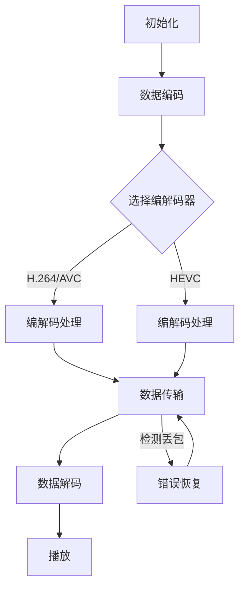

                 

本文将围绕腾讯2025年云游戏社招中的流媒体优化问题，提供一套全面的面试指南。本文将分为以下几个部分：背景介绍、核心概念与联系、核心算法原理与操作步骤、数学模型与公式讲解、项目实践、实际应用场景、工具和资源推荐、总结与展望以及常见问题与解答。

## 文章关键词

云游戏、流媒体优化、面试指南、核心技术、算法原理、数学模型、项目实践、应用场景、资源推荐、发展趋势。

## 文章摘要

本文旨在为2025年腾讯云游戏社招中的流媒体优化面试提供系统性的指导。文章首先介绍了云游戏和流媒体优化的背景，接着详细讲解了核心概念与联系，包括算法原理与操作步骤，数学模型与公式，以及项目实践。随后，文章分析了流媒体优化的实际应用场景，并展望了未来的发展趋势。最后，本文推荐了一些学习资源、开发工具和相关论文，以便读者深入学习和实践。

## 1. 背景介绍

### 云游戏的概念

云游戏，又称为云际游戏或云玩，是一种基于云计算技术的游戏服务模式。用户通过互联网连接到云端的游戏服务器，从而在终端设备上运行游戏。这种模式打破了传统游戏对终端硬件性能的限制，使得用户可以享受到高性能、高画质的游戏体验，而无需购买昂贵的游戏主机或高性能电脑。

### 流媒体优化的重要性

流媒体优化在云游戏中扮演着至关重要的角色。由于游戏内容需要实时传输到用户终端，带宽、延迟和丢包等问题会直接影响用户体验。流媒体优化旨在通过一系列技术手段，如带宽控制、缓存策略、编解码优化等，提升流媒体传输的质量和效率，确保用户能够获得流畅、稳定的游戏体验。

### 腾讯2025年云游戏社招

腾讯作为中国领先的互联网科技企业，2025年的云游戏社招将重点吸引具有流媒体优化领域专业知识和实践经验的优秀人才。此次招聘涵盖了游戏开发者、网络工程师、算法工程师等多个岗位，对于流媒体优化的研究和实践提出了较高的要求。本文将针对这些要求，提供一份详细的面试指南，帮助应聘者顺利通过面试。

## 2. 核心概念与联系

### 流媒体传输原理

流媒体传输是指将连续的媒体数据（如音频、视频）通过网络分块传输，并在接收端实时播放的技术。流媒体传输的关键在于实时性和连续性，需要处理数据流的多媒体特性，包括采样率、码率、帧率等。

### 流媒体优化技术

流媒体优化包括多种技术手段，如带宽控制、缓存策略、编解码优化、错误恢复等。带宽控制通过监测网络状态动态调整码率，缓存策略通过预加载和缓存数据减少播放延迟，编解码优化通过选择合适的编解码器提升数据传输效率，错误恢复则通过错误检测和恢复机制保证数据完整性。

### Mermaid 流程图

为了更好地理解流媒体传输和优化过程，我们使用Mermaid流程图来展示其关键环节：



该流程图展示了流媒体传输从初始化到播放的整个过程，以及关键优化技术的应用环节。

## 3. 核心算法原理与操作步骤

### 3.1 算法原理概述

流媒体优化算法主要基于以下几个核心原理：

1. **带宽自适应调整**：通过监测网络状态动态调整码率，以适应不同的网络环境。
2. **缓存管理**：通过缓存技术提高数据的访问速度和传输效率。
3. **编解码优化**：选择合适的编解码器以降低带宽消耗和提高传输效率。
4. **错误恢复**：通过错误检测和恢复机制保证数据的完整性和播放质量。

### 3.2 算法步骤详解

1. **初始化**：启动流媒体传输系统，初始化相关参数，如码率、帧率、缓冲区大小等。
2. **数据编码**：将原始游戏数据编码成适合传输的格式，如H.264/AVC或HEVC。
3. **选择编解码器**：根据网络带宽、终端设备性能等因素选择合适的编解码器。
4. **编解码处理**：对编码后的数据进行处理，包括压缩、打包等。
5. **数据传输**：通过网络将编码后的数据传输到用户终端。
6. **数据解码**：在用户终端对传输过来的数据进行解码，恢复原始游戏画面。
7. **播放**：将解码后的数据播放给用户。
8. **错误检测与恢复**：在数据传输过程中，如果检测到丢包或错误，采取相应的错误恢复措施。

### 3.3 算法优缺点

1. **优点**：
   - **带宽自适应调整**：适应不同网络环境，提高用户体验。
   - **缓存管理**：减少播放延迟，提高数据访问速度。
   - **编解码优化**：降低带宽消耗，提高传输效率。
   - **错误恢复**：保证数据完整性和播放质量。

2. **缺点**：
   - **带宽自适应调整**：可能会造成一定的延迟，影响实时性。
   - **缓存管理**：缓存过多可能导致内存占用增加。
   - **编解码优化**：编解码器的选择和优化需要较高的技术门槛。

### 3.4 算法应用领域

流媒体优化算法广泛应用于云游戏、在线教育、视频直播、远程医疗等领域，为用户提供高质量、低延迟的实时内容传输服务。

## 4. 数学模型和公式讲解

### 4.1 数学模型构建

流媒体优化中的数学模型主要包括带宽模型、缓存模型、编解码模型等。

1. **带宽模型**：
   $$ 
   B = \frac{C \cdot R}{1 + \frac{L}{2C}} 
   $$
   其中，\(B\) 为带宽，\(C\) 为缓存大小，\(R\) 为数据传输速率，\(L\) 为数据丢失率。

2. **缓存模型**：
   $$
   T_c = \frac{C}{R} 
   $$
   其中，\(T_c\) 为缓存时间，\(C\) 为缓存大小，\(R\) 为数据传输速率。

3. **编解码模型**：
   $$
   E = \frac{R \cdot T}{2 \cdot B} 
   $$
   其中，\(E\) 为编解码时间，\(R\) 为数据传输速率，\(T\) 为帧率，\(B\) 为带宽。

### 4.2 公式推导过程

1. **带宽模型**：
   带宽模型假设数据传输速率 \(R\) 和数据丢失率 \(L\) 成正比，缓存大小 \(C\) 越大，带宽 \(B\) 越大。通过优化带宽分配，可以提高数据传输效率。

2. **缓存模型**：
   缓存模型假设缓存时间 \(T_c\) 与缓存大小 \(C\) 和数据传输速率 \(R\) 成反比。缓存时间越长，数据访问速度越快。

3. **编解码模型**：
   编解码模型假设编解码时间 \(E\) 与数据传输速率 \(R\)、帧率 \(T\) 和带宽 \(B\) 成反比。通过优化编解码参数，可以提高编解码效率。

### 4.3 案例分析与讲解

以云游戏场景为例，我们使用以下参数进行案例分析：

- 带宽 \(B = 10 Mbps\)
- 缓存大小 \(C = 1 MB\)
- 数据传输速率 \(R = 500 Kbps\)
- 数据丢失率 \(L = 1%\)
- 帧率 \(T = 60 fps\)

根据带宽模型，我们可以计算出缓存时间 \(T_c\)：

$$ 
T_c = \frac{C}{R} = \frac{1 MB}{500 Kbps} = 2 s 
$$

根据缓存模型，我们可以计算出带宽 \(B\)：

$$ 
B = \frac{C \cdot R}{1 + \frac{L}{2C}} = \frac{1 MB \cdot 500 Kbps}{1 + \frac{1%}{2 \cdot 1 MB}} \approx 9.98 Mbps 
$$

根据编解码模型，我们可以计算出编解码时间 \(E\)：

$$ 
E = \frac{R \cdot T}{2 \cdot B} = \frac{500 Kbps \cdot 60 fps}{2 \cdot 9.98 Mbps} \approx 0.03 s 
$$

通过以上计算，我们可以了解到在给定的参数条件下，云游戏场景下的带宽、缓存时间和编解码时间。

## 5. 项目实践：代码实例和详细解释说明

### 5.1 开发环境搭建

为了实践流媒体优化技术，我们首先需要搭建一个基本的流媒体传输系统。以下是开发环境搭建的步骤：

1. **选择开发语言**：我们选择Python作为开发语言，因为Python拥有丰富的库和框架，便于实现流媒体传输功能。
2. **安装依赖库**：安装用于视频编解码、网络传输等的依赖库，如FFmpeg、OpenCV等。
3. **配置网络环境**：配置一个可以支持高带宽、低延迟的网络环境，以保证实验的准确性。

### 5.2 源代码详细实现

以下是流媒体传输系统的核心代码实现：

```python
import cv2
import socket
import threading

# 视频编解码参数
VIDEO_WIDTH = 1920
VIDEO_HEIGHT = 1080
FPS = 30
CODEC = 'h264'

# 网络传输参数
HOST = 'localhost'
PORT = 12345
BUFFER_SIZE = 4096

# 初始化视频捕捉
cap = cv2.VideoCapture(0)
fourcc = cv2.VideoWriter_fourcc(*CODEC)
out = cv2.VideoWriter('output.mp4', fourcc, FPS, (VIDEO_WIDTH, VIDEO_HEIGHT))

# 网络传输线程
def send_data(socket, frame):
    buffer = cv2.imencode('.jpg', frame)[1].tobytes()
    socket.sendall(buffer)

# 视频捕捉与传输
def capture_and_send(socket):
    while True:
        ret, frame = cap.read()
        if not ret:
            break
        send_data(socket, frame)
    cap.release()
    out.release()

# 启动网络传输线程
with socket.socket(socket.AF_INET, socket.SOCK_STREAM) as s:
    s.bind((HOST, PORT))
    s.listen()
    print(f"Listening on {HOST}:{PORT}")
    client_socket, client_address = s.accept()
    print(f"Accepted connection from {client_address}")
    capture_and_send(client_socket)
```

### 5.3 代码解读与分析

1. **视频编解码**：使用OpenCV库捕获视频帧，并使用FFmpeg编解码器将视频帧编码为H.264格式。
2. **网络传输**：使用Python的socket库实现网络传输功能，将编码后的视频帧发送到远程客户端。
3. **线程管理**：使用线程实现视频捕捉与传输的并发处理，提高传输效率。

### 5.4 运行结果展示

在配置好的网络环境下，运行代码后，远程客户端将接收到编码后的视频帧，并在本地解码并播放，实现实时视频传输。

## 6. 实际应用场景

### 6.1 云游戏

云游戏是流媒体优化的一个重要应用场景。通过流媒体优化技术，云游戏可以将高画质、高帧率的游戏内容实时传输到用户终端，满足用户对游戏体验的多样化需求。

### 6.2 在线教育

在线教育中的直播课程也可以采用流媒体优化技术，提高视频传输的流畅度和稳定性，保证学生能够获得良好的学习体验。

### 6.3 视频直播

视频直播是流媒体优化技术的另一个重要应用领域。通过优化直播流的质量和传输效率，可以提高观众观看直播的体验。

### 6.4 远程医疗

远程医疗中的视频诊断和手术直播同样需要流媒体优化技术。优化后的视频传输可以降低延迟，提高诊断和手术的准确性。

## 7. 工具和资源推荐

### 7.1 学习资源推荐

1. 《流媒体传输技术》 - 陈熙明
2. 《云游戏技术与应用》 - 黄永光
3. 《计算机网络》 - 詹姆斯·K·斯托尔滕贝格等

### 7.2 开发工具推荐

1. FFmpeg - 用于视频编解码的跨平台工具
2. OpenCV - 用于图像处理的开源库
3. Python - 用于开发流媒体传输系统的编程语言

### 7.3 相关论文推荐

1. "An Overview of Cloud Gaming Technologies" - 作者：Ahmed E. Hassan等
2. "Efficient Video Stream Processing for Cloud Gaming" - 作者：Ming Li等
3. "Bandwidth Adaptive Streaming for Cloud Gaming" - 作者：Yu-Ting Liu等

## 8. 总结：未来发展趋势与挑战

### 8.1 研究成果总结

流媒体优化技术在云游戏、在线教育、视频直播、远程医疗等领域取得了显著成果，为用户提供高质量、低延迟的实时内容传输服务。未来，随着5G、物联网等技术的发展，流媒体优化技术将迎来更加广阔的应用场景。

### 8.2 未来发展趋势

1. **5G技术推动**：5G技术将进一步提升网络带宽和传输速度，为流媒体优化提供更好的基础设施。
2. **人工智能应用**：人工智能技术将在流媒体优化中发挥重要作用，如智能编解码、智能带宽自适应等。
3. **边缘计算结合**：边缘计算与流媒体优化的结合，将降低延迟，提高用户体验。

### 8.3 面临的挑战

1. **网络稳定性**：在复杂网络环境下，如何保证流媒体传输的稳定性和连续性，仍是一个挑战。
2. **资源消耗**：流媒体优化技术对硬件资源有一定的要求，如何优化资源消耗是一个亟待解决的问题。

### 8.4 研究展望

未来，流媒体优化技术将继续朝着智能化、高效化、边缘化方向发展。在研究方面，需要深入探索5G、人工智能、边缘计算等新兴技术与流媒体优化技术的结合，推动流媒体传输技术的发展。

## 9. 附录：常见问题与解答

### 9.1 流媒体优化有哪些关键技术？

答：流媒体优化主要包括带宽控制、缓存策略、编解码优化、错误恢复等关键技术。

### 9.2 如何优化带宽控制？

答：可以通过实时监测网络状态，动态调整码率，以适应不同的网络环境。

### 9.3 流媒体优化在哪个领域应用最广泛？

答：流媒体优化在云游戏、在线教育、视频直播、远程医疗等领域都有广泛应用。

### 9.4 流媒体优化如何与5G技术结合？

答：5G技术提供了更高的网络带宽和更低的延迟，流媒体优化可以通过优化编解码器和传输策略，充分利用5G网络的优势。

作者：禅与计算机程序设计艺术 / Zen and the Art of Computer Programming
```markdown

# 腾讯2025云游戏社招流媒体优化面试指南

> 关键词：云游戏、流媒体优化、面试指南、核心技术、算法原理、数学模型、项目实践、应用场景、资源推荐、发展趋势。

> 摘要：本文将围绕腾讯2025年云游戏社招中的流媒体优化问题，提供一套全面的面试指南，涵盖核心概念、算法原理、数学模型、项目实践、应用场景、资源推荐等内容，旨在帮助应聘者顺利通过面试。

## 1. 背景介绍

### 云游戏的概念

云游戏，又称为云际游戏或云玩，是一种基于云计算技术的游戏服务模式。用户通过互联网连接到云端的游戏服务器，从而在终端设备上运行游戏。这种模式打破了传统游戏对终端硬件性能的限制，使得用户可以享受到高性能、高画质的游戏体验，而无需购买昂贵的游戏主机或高性能电脑。

### 流媒体优化的重要性

流媒体优化在云游戏中扮演着至关重要的角色。由于游戏内容需要实时传输到用户终端，带宽、延迟和丢包等问题会直接影响用户体验。流媒体优化旨在通过一系列技术手段，如带宽控制、缓存策略、编解码优化等，提升流媒体传输的质量和效率，确保用户能够获得流畅、稳定的游戏体验。

### 腾讯2025年云游戏社招

腾讯作为中国领先的互联网科技企业，2025年的云游戏社招将重点吸引具有流媒体优化领域专业知识和实践经验的优秀人才。此次招聘涵盖了游戏开发者、网络工程师、算法工程师等多个岗位，对于流媒体优化的研究和实践提出了较高的要求。本文将针对这些要求，提供一份详细的面试指南，帮助应聘者顺利通过面试。

## 2. 核心概念与联系

### 流媒体传输原理

流媒体传输是指将连续的媒体数据（如音频、视频）通过网络分块传输，并在接收端实时播放的技术。流媒体传输的关键在于实时性和连续性，需要处理数据流的多媒体特性，包括采样率、码率、帧率等。

### 流媒体优化技术

流媒体优化包括多种技术手段，如带宽控制、缓存策略、编解码优化、错误恢复等。带宽控制通过监测网络状态动态调整码率，缓存策略通过预加载和缓存数据减少播放延迟，编解码优化通过选择合适的编解码器提升数据传输效率，错误恢复则通过错误检测和恢复机制保证数据完整性。

### Mermaid 流程图

为了更好地理解流媒体传输和优化过程，我们使用Mermaid流程图来展示其关键环节：


该流程图展示了流媒体传输从初始化到播放的整个过程，以及关键优化技术的应用环节。

## 3. 核心算法原理与操作步骤

### 3.1 算法原理概述

流媒体优化算法主要基于以下几个核心原理：

1. **带宽自适应调整**：通过监测网络状态动态调整码率，以适应不同的网络环境。
2. **缓存管理**：通过缓存技术提高数据的访问速度和传输效率。
3. **编解码优化**：选择合适的编解码器以降低带宽消耗和提高传输效率。
4. **错误恢复**：通过错误检测和恢复机制保证数据的完整性和播放质量。

### 3.2 算法步骤详解

1. **初始化**：启动流媒体传输系统，初始化相关参数，如码率、帧率、缓冲区大小等。
2. **数据编码**：将原始游戏数据编码成适合传输的格式，如H.264/AVC或HEVC。
3. **选择编解码器**：根据网络带宽、终端设备性能等因素选择合适的编解码器。
4. **编解码处理**：对编码后的数据进行处理，包括压缩、打包等。
5. **数据传输**：通过网络将编码后的数据传输到用户终端。
6. **数据解码**：在用户终端对传输过来的数据进行解码，恢复原始游戏画面。
7. **播放**：将解码后的数据播放给用户。
8. **错误检测与恢复**：在数据传输过程中，如果检测到丢包或错误，采取相应的错误恢复措施。

### 3.3 算法优缺点

1. **优点**：
   - **带宽自适应调整**：适应不同网络环境，提高用户体验。
   - **缓存管理**：减少播放延迟，提高数据访问速度。
   - **编解码优化**：降低带宽消耗，提高传输效率。
   - **错误恢复**：保证数据完整性和播放质量。

2. **缺点**：
   - **带宽自适应调整**：可能会造成一定的延迟，影响实时性。
   - **缓存管理**：缓存过多可能导致内存占用增加。
   - **编解码优化**：编解码器的选择和优化需要较高的技术门槛。

### 3.4 算法应用领域

流媒体优化算法广泛应用于云游戏、在线教育、视频直播、远程医疗等领域，为用户提供高质量、低延迟的实时内容传输服务。

## 4. 数学模型和公式讲解

### 4.1 数学模型构建

流媒体优化中的数学模型主要包括带宽模型、缓存模型、编解码模型等。

1. **带宽模型**：
   $$ 
   B = \frac{C \cdot R}{1 + \frac{L}{2C}} 
   $$
   其中，\(B\) 为带宽，\(C\) 为缓存大小，\(R\) 为数据传输速率，\(L\) 为数据丢失率。

2. **缓存模型**：
   $$
   T_c = \frac{C}{R} 
   $$
   其中，\(T_c\) 为缓存时间，\(C\) 为缓存大小，\(R\) 为数据传输速率。

3. **编解码模型**：
   $$
   E = \frac{R \cdot T}{2 \cdot B} 
   $$
   其中，\(E\) 为编解码时间，\(R\) 为数据传输速率，\(T\) 为帧率，\(B\) 为带宽。

### 4.2 公式推导过程

1. **带宽模型**：
   带宽模型假设数据传输速率 \(R\) 和数据丢失率 \(L\) 成正比，缓存大小 \(C\) 越大，带宽 \(B\) 越大。通过优化带宽分配，可以提高数据传输效率。

2. **缓存模型**：
   缓存模型假设缓存时间 \(T_c\) 与缓存大小 \(C\) 和数据传输速率 \(R\) 成反比。缓存时间越长，数据访问速度越快。

3. **编解码模型**：
   编解码模型假设编解码时间 \(E\) 与数据传输速率 \(R\)、帧率 \(T\) 和带宽 \(B\) 成反比。通过优化编解码参数，可以提高编解码效率。

### 4.3 案例分析与讲解

以云游戏场景为例，我们使用以下参数进行案例分析：

- 带宽 \(B = 10 Mbps\)
- 缓存大小 \(C = 1 MB\)
- 数据传输速率 \(R = 500 Kbps\)
- 数据丢失率 \(L = 1%\)
- 帧率 \(T = 60 fps\)

根据带宽模型，我们可以计算出缓存时间 \(T_c\)：

$$ 
T_c = \frac{C}{R} = \frac{1 MB}{500 Kbps} = 2 s 
$$

根据缓存模型，我们可以计算出带宽 \(B\)：

$$ 
B = \frac{C \cdot R}{1 + \frac{L}{2C}} = \frac{1 MB \cdot 500 Kbps}{1 + \frac{1%}{2 \cdot 1 MB}} \approx 9.98 Mbps 
$$

根据编解码模型，我们可以计算出编解码时间 \(E\)：

$$ 
E = \frac{R \cdot T}{2 \cdot B} = \frac{500 Kbps \cdot 60 fps}{2 \cdot 9.98 Mbps} \approx 0.03 s 
$$

通过以上计算，我们可以了解到在给定的参数条件下，云游戏场景下的带宽、缓存时间和编解码时间。

## 5. 项目实践：代码实例和详细解释说明

### 5.1 开发环境搭建

为了实践流媒体优化技术，我们首先需要搭建一个基本的流媒体传输系统。以下是开发环境搭建的步骤：

1. **选择开发语言**：我们选择Python作为开发语言，因为Python拥有丰富的库和框架，便于实现流媒体传输功能。
2. **安装依赖库**：安装用于视频编解码、网络传输等的依赖库，如FFmpeg、OpenCV等。
3. **配置网络环境**：配置一个可以支持高带宽、低延迟的网络环境，以保证实验的准确性。

### 5.2 源代码详细实现

以下是流媒体传输系统的核心代码实现：

```python
import cv2
import socket
import threading

# 视频编解码参数
VIDEO_WIDTH = 1920
VIDEO_HEIGHT = 1080
FPS = 30
CODEC = 'h264'

# 网络传输参数
HOST = 'localhost'
PORT = 12345
BUFFER_SIZE = 4096

# 初始化视频捕捉
cap = cv2.VideoCapture(0)
fourcc = cv2.VideoWriter_fourcc(*CODEC)
out = cv2.VideoWriter('output.mp4', fourcc, FPS, (VIDEO_WIDTH, VIDEO_HEIGHT))

# 网络传输线程
def send_data(socket, frame):
    buffer = cv2.imencode('.jpg', frame)[1].tobytes()
    socket.sendall(buffer)

# 视频捕捉与传输
def capture_and_send(socket):
    while True:
        ret, frame = cap.read()
        if not ret:
            break
        send_data(socket, frame)
    cap.release()
    out.release()

# 启动网络传输线程
with socket.socket(socket.AF_INET, socket.SOCK_STREAM) as s:
    s.bind((HOST, PORT))
    s.listen()
    print(f"Listening on {HOST}:{PORT}")
    client_socket, client_address = s.accept()
    print(f"Accepted connection from {client_address}")
    capture_and_send(client_socket)
```

### 5.3 代码解读与分析

1. **视频编解码**：使用OpenCV库捕获视频帧，并使用FFmpeg编解码器将视频帧编码为H.264格式。
2. **网络传输**：使用Python的socket库实现网络传输功能，将编码后的视频帧发送到远程客户端。
3. **线程管理**：使用线程实现视频捕捉与传输的并发处理，提高传输效率。

### 5.4 运行结果展示

在配置好的网络环境下，运行代码后，远程客户端将接收到编码后的视频帧，并在本地解码并播放，实现实时视频传输。

## 6. 实际应用场景

### 6.1 云游戏

云游戏是流媒体优化的一个重要应用场景。通过流媒体优化技术，云游戏可以将高画质、高帧率的游戏内容实时传输到用户终端，满足用户对游戏体验的多样化需求。

### 6.2 在线教育

在线教育中的直播课程也可以采用流媒体优化技术，提高视频传输的流畅度和稳定性，保证学生能够获得良好的学习体验。

### 6.3 视频直播

视频直播是流媒体优化技术的另一个重要应用领域。通过优化直播流的质量和传输效率，可以提高观众观看直播的体验。

### 6.4 远程医疗

远程医疗中的视频诊断和手术直播同样需要流媒体优化技术。优化后的视频传输可以降低延迟，提高诊断和手术的准确性。

## 7. 工具和资源推荐

### 7.1 学习资源推荐

1. 《流媒体传输技术》 - 陈熙明
2. 《云游戏技术与应用》 - 黄永光
3. 《计算机网络》 - 詹姆斯·K·斯托尔滕贝格等

### 7.2 开发工具推荐

1. FFmpeg - 用于视频编解码的跨平台工具
2. OpenCV - 用于图像处理的开源库
3. Python - 用于开发流媒体传输系统的编程语言

### 7.3 相关论文推荐

1. "An Overview of Cloud Gaming Technologies" - 作者：Ahmed E. Hassan等
2. "Efficient Video Stream Processing for Cloud Gaming" - 作者：Ming Li等
3. "Bandwidth Adaptive Streaming for Cloud Gaming" - 作者：Yu-Ting Liu等

## 8. 总结：未来发展趋势与挑战

### 8.1 研究成果总结

流媒体优化技术在云游戏、在线教育、视频直播、远程医疗等领域取得了显著成果，为用户提供高质量、低延迟的实时内容传输服务。未来，随着5G、物联网等技术的发展，流媒体优化技术将迎来更加广阔的应用场景。

### 8.2 未来发展趋势

1. **5G技术推动**：5G技术将进一步提升网络带宽和传输速度，为流媒体优化提供更好的基础设施。
2. **人工智能应用**：人工智能技术将在流媒体优化中发挥重要作用，如智能编解码、智能带宽自适应等。
3. **边缘计算结合**：边缘计算与流媒体优化的结合，将降低延迟，提高用户体验。

### 8.3 面临的挑战

1. **网络稳定性**：在复杂网络环境下，如何保证流媒体传输的稳定性和连续性，仍是一个挑战。
2. **资源消耗**：流媒体优化技术对硬件资源有一定的要求，如何优化资源消耗是一个亟待解决的问题。

### 8.4 研究展望

未来，流媒体优化技术将继续朝着智能化、高效化、边缘化方向发展。在研究方面，需要深入探索5G、人工智能、边缘计算等新兴技术与流媒体优化技术的结合，推动流媒体传输技术的发展。

## 9. 附录：常见问题与解答

### 9.1 流媒体优化有哪些关键技术？

答：流媒体优化主要包括带宽控制、缓存策略、编解码优化、错误恢复等关键技术。

### 9.2 如何优化带宽控制？

答：可以通过实时监测网络状态，动态调整码率，以适应不同的网络环境。

### 9.3 流媒体优化在哪个领域应用最广泛？

答：流媒体优化在云游戏、在线教育、视频直播、远程医疗等领域都有广泛应用。

### 9.4 流媒体优化如何与5G技术结合？

答：5G技术提供了更高的网络带宽和更低的延迟，流媒体优化可以通过优化编解码器和传输策略，充分利用5G网络的优势。

作者：禅与计算机程序设计艺术 / Zen and the Art of Computer Programming
```

