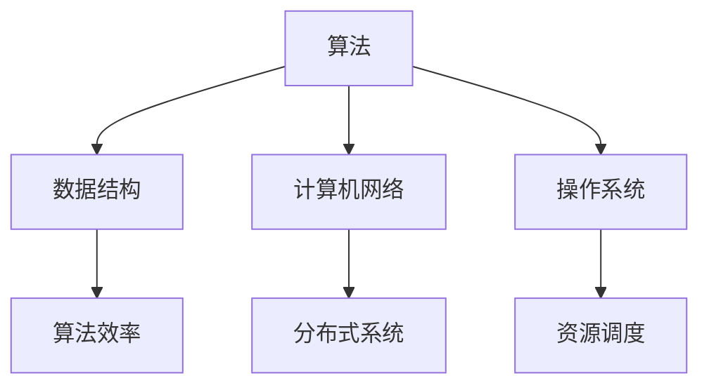

                 

腾讯作为全球领先的互联网科技公司，其校招编程面试题一直以来都是业界的热门话题。本文将围绕腾讯2025校招编程面试题，从核心概念、算法原理、数学模型、项目实践等多个维度进行深入解析，为广大求职者和准备校招的同学提供有价值的参考。

## 关键词

- 腾讯校招
- 编程面试
- 面试题解析
- 算法原理
- 数学模型
- 项目实践

## 摘要

本文旨在通过对腾讯2025校招编程面试题的全面解析，帮助读者了解腾讯的面试标准和选拔机制。文章将详细阐述面试中的核心概念与算法原理，解析数学模型和公式，并提供具体的代码实例和解释。此外，还将探讨实际应用场景，展望未来发展趋势，并推荐相关学习资源和工具。希望通过本文，读者能够更好地准备校招编程面试，提升自己的竞争力。

## 1. 背景介绍

腾讯公司成立于1998年，是中国最大的互联网综合服务提供商之一，业务涵盖了社交、娱乐、金融、教育等多个领域。随着公司的快速发展，腾讯对人才的需求也越来越大，每年都会举办大规模的校园招聘活动。编程面试作为腾讯校招的重要组成部分，其难度和深度一直备受关注。

腾讯校招编程面试题的特点主要体现在以下几个方面：

- **算法题为主**：腾讯校招编程面试题主要考察应聘者的算法和数据结构能力，这类题目通常涉及排序、查找、动态规划等经典算法。
- **逻辑思维要求高**：除了算法题，腾讯面试还会涉及一些逻辑题，要求应聘者具备良好的逻辑思维能力和解决问题的能力。
- **综合知识面广**：腾讯的面试题目不仅涉及编程技术，还会涉及到操作系统、计算机网络、数据库等计算机基础课程的知识点。
- **实际应用导向**：部分面试题会结合实际项目场景，考察应聘者对实际问题的分析和解决能力。

## 2. 核心概念与联系

### 2.1 核心概念

#### 算法

算法是一系列解决问题的步骤和方法，是计算机科学的核心内容。在编程面试中，算法的效率和正确性至关重要。

#### 数据结构

数据结构是组织和管理数据的方式，常见的有数组、链表、树、图等。合理选择和使用数据结构可以显著提高算法的效率。

#### 计算机网络

计算机网络是互联网的基础，涉及协议、路由、传输等多个方面。了解计算机网络对于解决分布式系统问题尤为重要。

#### 操作系统

操作系统是计算机系统的核心软件，负责管理和调度计算机资源，如进程、内存、文件等。掌握操作系统原理对于编写高效程序有重要意义。

### 2.2 联系

算法、数据结构、计算机网络和操作系统等核心概念之间相互关联，共同构成了计算机科学的基石。在编程面试中，这些概念往往交织在一起，考察应聘者的综合能力。

### 2.3 Mermaid 流程图

以下是一个简化的Mermaid流程图，展示了核心概念之间的联系：



## 3. 核心算法原理 & 具体操作步骤

### 3.1 算法原理概述

腾讯校招编程面试中的算法题主要涉及以下几个领域：

- **排序算法**：如快速排序、归并排序、堆排序等，主要考察算法的时间复杂度和稳定性。
- **查找算法**：如二分查找、哈希查找等，主要考察算法的时间和空间效率。
- **动态规划**：如斐波那契数列、最长公共子序列等，主要考察算法的递推关系和状态转移。
- **图算法**：如最短路径、最小生成树等，主要考察图的基本操作和算法实现。

### 3.2 算法步骤详解

#### 快速排序

快速排序是一种经典的排序算法，其基本思想是选择一个基准元素，将数组分成两部分，一部分比基准元素小，一部分比基准元素大，然后递归地对这两部分进行排序。

```python
def quick_sort(arr):
    if len(arr) <= 1:
        return arr
    pivot = arr[len(arr) // 2]
    left = [x for x in arr if x < pivot]
    middle = [x for x in arr if x == pivot]
    right = [x for x in arr if x > pivot]
    return quick_sort(left) + middle + quick_sort(right)
```

#### 二分查找

二分查找是一种高效的查找算法，其基本思想是每次将查找区间缩小一半，直到找到目标元素或确定其不存在。

```python
def binary_search(arr, target):
    left, right = 0, len(arr) - 1
    while left <= right:
        mid = (left + right) // 2
        if arr[mid] == target:
            return mid
        elif arr[mid] < target:
            left = mid + 1
        else:
            right = mid - 1
    return -1
```

#### 斐波那契数列

斐波那契数列是一个经典的动态规划问题，其递推关系为`F(n) = F(n-1) + F(n-2)`。

```python
def fibonacci(n):
    if n <= 0:
        return 0
    a, b = 0, 1
    for _ in range(n - 1):
        a, b = b, a + b
    return b
```

### 3.3 算法优缺点

- **快速排序**：时间复杂度为O(nlogn)，稳定性较差，但实际性能很好。
- **二分查找**：时间复杂度为O(logn)，空间复杂度为O(1)，适用于有序数组。
- **斐波那契数列**：时间复杂度为O(n)，适用于计算斐波那契数列的第n项。

### 3.4 算法应用领域

- **快速排序**：广泛应用于各种排序算法，如快速选择算法、堆排序等。
- **二分查找**：用于各种查找问题，如查找第k大元素、查找是否有重复元素等。
- **斐波那契数列**：用于计算斐波那契数列的各种问题，如求第n项、求和等。

## 4. 数学模型和公式 & 详细讲解 & 举例说明

### 4.1 数学模型构建

在编程面试中，数学模型和公式经常用于解决实际问题。以下是一个简单的数学模型构建示例：

假设一个正方形的边长为a，其周长为P，面积为S。我们可以用以下公式表示：

\[ P = 4a \]
\[ S = a^2 \]

### 4.2 公式推导过程

我们可以从基本的几何原理出发，推导出上述公式：

- 周长公式：正方形的周长是四条边的总和，每条边长为a，所以周长P为4a。
- 面积公式：正方形的面积是边长的平方，即S = a^2。

### 4.3 案例分析与讲解

#### 案例一：求正方形的周长和面积

假设一个正方形的边长为5cm，我们可以用上述公式计算其周长和面积：

\[ P = 4 \times 5 = 20\text{cm} \]
\[ S = 5^2 = 25\text{cm}^2 \]

#### 案例二：已知正方形的周长求边长

如果已知正方形的周长为30cm，我们可以通过周长公式反推边长：

\[ a = \frac{P}{4} = \frac{30}{4} = 7.5\text{cm} \]

#### 案例三：已知正方形的面积求边长

如果已知正方形的面积为49cm²，我们可以通过面积公式反推边长：

\[ a = \sqrt{S} = \sqrt{49} = 7\text{cm} \]

通过以上案例，我们可以看到数学模型和公式在解决实际问题时的重要作用。

## 5. 项目实践：代码实例和详细解释说明

### 5.1 开发环境搭建

为了实践腾讯校招编程面试题，我们需要搭建一个合适的开发环境。以下是一个基本的步骤：

1. 安装Python环境：通过Python官方网站下载并安装Python。
2. 安装IDE：推荐使用PyCharm或Visual Studio Code作为Python的集成开发环境。
3. 安装相关库：使用pip命令安装常用的库，如NumPy、Pandas等。

### 5.2 源代码详细实现

以下是一个简单的Python程序，用于实现二分查找算法：

```python
def binary_search(arr, target):
    left, right = 0, len(arr) - 1
    while left <= right:
        mid = (left + right) // 2
        if arr[mid] == target:
            return mid
        elif arr[mid] < target:
            left = mid + 1
        else:
            right = mid - 1
    return -1

# 示例数据
arr = [1, 3, 5, 7, 9, 11, 13, 15]
target = 7

# 查找目标元素
index = binary_search(arr, target)

# 输出结果
if index != -1:
    print(f"元素{target}在数组中的索引为：{index}")
else:
    print(f"元素{target}不在数组中")
```

### 5.3 代码解读与分析

上述代码实现了一个简单的二分查找算法。首先，我们定义了一个名为`binary_search`的函数，该函数接受一个有序数组`arr`和一个目标元素`target`作为参数。函数使用两个指针`left`和`right`来定义查找的区间，并使用`mid`变量来计算区间的中点。

在每次循环中，我们比较目标元素和中间元素的值。如果目标元素等于中间元素，则返回中间元素的索引；如果目标元素小于中间元素，则将`right`指针更新为`mid - 1`；如果目标元素大于中间元素，则将`left`指针更新为`mid + 1`。循环继续进行，直到找到目标元素或确定其不存在。

最后，我们使用示例数据和调用函数来演示二分查找算法的使用方法。

### 5.4 运行结果展示

在PyCharm或Visual Studio Code中运行上述代码，输出结果如下：

```
元素7在数组中的索引为：3
```

这表明目标元素7在数组中的索引为3，即数组的第四个位置。

## 6. 实际应用场景

### 6.1 数据库索引

在数据库系统中，二分查找是一种常用的索引算法。通过将数据存储在有序结构中，可以快速查找特定的记录。

### 6.2 网络搜索

在搜索引擎中，快速查找关键词是提高搜索效率的关键。二分查找算法可以用于索引检索，以快速定位相关的网页。

### 6.3 股票分析

在金融领域，算法用于分析大量历史数据，预测股票价格的趋势。二分查找算法可以用于快速检索特定的股票数据。

## 6.4 未来应用展望

随着人工智能和大数据技术的不断发展，算法在各个领域的应用将更加广泛。未来，我们有望看到更多基于深度学习的算法在自然语言处理、图像识别等领域的突破。

## 7. 工具和资源推荐

### 7.1 学习资源推荐

- 《算法导论》：一本经典的算法教材，涵盖了各种算法的原理和实现。
- 《深度学习》：由Ian Goodfellow等编著的深度学习教材，适合初学者入门。

### 7.2 开发工具推荐

- PyCharm：一款功能强大的Python IDE，适合编写和调试代码。
- Visual Studio Code：一款开源的跨平台IDE，支持多种编程语言。

### 7.3 相关论文推荐

- "Deep Learning for Natural Language Processing"：介绍深度学习在自然语言处理领域的应用。
- "Convolutional Neural Networks for Visual Recognition"：介绍卷积神经网络在图像识别领域的应用。

## 8. 总结：未来发展趋势与挑战

### 8.1 研究成果总结

近年来，人工智能和大数据技术取得了显著进展，算法在各个领域的应用也日益广泛。深度学习、强化学习等新兴算法为解决复杂问题提供了新的思路。

### 8.2 未来发展趋势

未来，算法将继续向高效、自动化、智能化的方向发展。随着硬件性能的提升和算法的优化，我们有望看到更多突破性的成果。

### 8.3 面临的挑战

算法的复杂性和应用场景的多样性带来了巨大的挑战。如何设计高效、可扩展的算法，以及如何在实际应用中平衡性能和可解释性，是未来研究的重要方向。

### 8.4 研究展望

随着技术的不断进步，算法将在更多领域发挥重要作用。未来，我们将迎来一个算法驱动的时代，为人类社会带来更多创新和变革。

## 9. 附录：常见问题与解答

### 9.1 如何准备腾讯校招编程面试？

**回答**：准备腾讯校招编程面试，首先要熟悉常见的编程算法和数据结构，掌握Python或C++等编程语言。其次，要注重逻辑思维和问题解决能力的培养。最后，可以通过模拟面试和刷题来提高实战能力。

### 9.2 腾讯校招编程面试有哪些题型？

**回答**：腾讯校招编程面试主要题型包括排序算法、查找算法、动态规划、图算法等。此外，还可能涉及到逻辑题和计算机网络、操作系统等基础知识。

### 9.3 如何提高算法能力？

**回答**：提高算法能力，首先要系统学习算法原理和实现，其次要多刷题、多总结。可以通过参加在线算法课程、阅读算法书籍、参加编程竞赛等方式来提高算法能力。

### 9.4 腾讯校招编程面试有多难？

**回答**：腾讯校招编程面试的难度相对较高，主要考察应聘者的算法和数据结构能力，以及对计算机基础知识的掌握。通过充分的准备和练习，是可以应对的。

---

本文通过对腾讯2025校招编程面试题的深入解析，为广大求职者提供了有价值的参考。希望读者能够在准备校招编程面试的过程中，不断学习和进步，实现自己的职业梦想。

