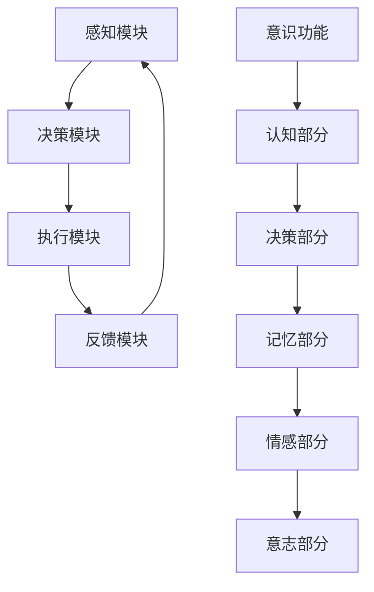

                 

 关键词：自主系统，意识功能，交互机制，人工智能，机器学习，神经网络，智能决策

> 摘要：本文将探讨自主系统与意识功能的互动机制，分析当前人工智能技术的发展状况，探讨机器学习、神经网络以及智能决策等领域中的核心概念与联系。通过数学模型和具体算法的讲解，揭示自主系统与意识功能之间的相互作用规律，为未来智能系统的发展提供理论依据和实践指导。

## 1. 背景介绍

随着计算机技术和人工智能的快速发展，自主系统已经成为现代工业、医疗、交通等领域的重要支撑。自主系统具有自我决策、自我修复和自我学习的能力，能够根据环境变化和任务需求自主调整行为和策略。然而，自主系统的核心——意识功能，仍然是一个未完全解开的谜团。

意识功能是指人类或其他生物在大脑中产生的对自身和外部环境的感知、理解和反应能力。在人工智能领域，研究者们试图通过模拟人脑意识功能来实现更加智能的自主系统。然而，意识功能的本质及其在自主系统中的作用机制仍然不甚清楚。

本文旨在探讨自主系统与意识功能的互动机制，分析当前人工智能技术的发展状况，探讨机器学习、神经网络以及智能决策等领域中的核心概念与联系。通过数学模型和具体算法的讲解，揭示自主系统与意识功能之间的相互作用规律，为未来智能系统的发展提供理论依据和实践指导。

## 2. 核心概念与联系

### 2.1 自主系统的定义

自主系统是指具有自我决策、自我修复和自我学习能力的系统。自主系统通常由多个组件组成，包括感知模块、决策模块、执行模块和反馈模块。感知模块负责收集环境信息，决策模块根据感知信息生成行动策略，执行模块负责执行策略，反馈模块将执行结果返回给感知模块，形成闭环控制系统。

### 2.2 意识功能的定义

意识功能是指人类或其他生物在大脑中产生的对自身和外部环境的感知、理解和反应能力。意识功能通常包括感知、认知、记忆、情感和意志等组成部分。在人工智能领域，研究者们试图通过模拟人脑意识功能来实现更加智能的自主系统。

### 2.3 自主系统与意识功能的联系

自主系统与意识功能的联系主要体现在以下几个方面：

1. **感知与认知**：自主系统的感知模块类似于人类的感觉器官，负责收集环境信息。意识功能的认知部分则负责处理和分析这些感知信息，形成对环境的理解和认识。

2. **决策与行动**：自主系统的决策模块类似于人类的思维过程，根据感知信息生成行动策略。意识功能的决策部分则负责评估和选择最佳行动方案，以实现目标。

3. **记忆与学习**：自主系统的记忆模块负责存储感知和决策信息，以供后续使用。意识功能的记忆部分则负责记录和回忆过去经历，以指导当前和未来的决策。

4. **情感与意志**：自主系统的执行模块负责执行决策，而意识功能的意志部分则负责调节和引导情感和行为。自主系统的情感部分则可能受到意识功能的影响，从而影响决策和行动。

### 2.4 Mermaid 流程图

以下是一个简单的 Mermaid 流程图，展示自主系统与意识功能之间的互动机制：



## 3. 核心算法原理 & 具体操作步骤

### 3.1 算法原理概述

在自主系统中，核心算法通常涉及机器学习、神经网络和智能决策等领域。以下是一些核心算法原理：

1. **机器学习**：机器学习是一种通过数据驱动的方式自动获取知识和技能的技术。通过学习大量数据，机器学习算法可以识别模式、预测结果和做出决策。

2. **神经网络**：神经网络是一种模拟人脑神经元连接方式的计算模型。通过训练，神经网络可以学习到复杂的函数关系，从而实现图像识别、语音识别等任务。

3. **智能决策**：智能决策是指利用人工智能技术实现自主系统的决策过程。智能决策算法通常涉及多目标优化、风险评估和不确定性处理等。

### 3.2 算法步骤详解

以下是自主系统核心算法的一般步骤：

1. **数据采集**：收集自主系统运行过程中的感知数据，包括图像、声音、文本等。

2. **数据预处理**：对采集到的数据进行清洗、归一化和特征提取等操作，以适应算法的要求。

3. **模型训练**：利用机器学习和神经网络算法对预处理后的数据进行训练，生成预测模型。

4. **决策生成**：根据训练好的模型和当前感知数据，生成决策策略。

5. **执行决策**：执行决策策略，实现自主系统的行为调整。

6. **反馈调整**：根据执行结果，调整决策模型，以提高系统的适应性和准确性。

### 3.3 算法优缺点

1. **机器学习**：
   - 优点：可以自动发现数据中的模式，适应性强。
   - 缺点：需要大量数据，模型可解释性差。

2. **神经网络**：
   - 优点：可以处理复杂的非线性关系，自适应性强。
   - 缺点：计算量大，模型可解释性差。

3. **智能决策**：
   - 优点：可以处理多目标优化和不确定性问题，提高系统决策能力。
   - 缺点：需要复杂的算法和大量的计算资源。

### 3.4 算法应用领域

自主系统与意识功能的互动机制在多个领域具有广泛的应用：

1. **工业自动化**：自主系统可以替代人工进行生产过程的监控和控制，提高生产效率。

2. **智能交通**：通过感知和决策模块，自主系统可以优化交通流量，减少拥堵。

3. **医疗诊断**：自主系统可以利用机器学习和神经网络进行医学图像分析，辅助医生诊断。

4. **智能家居**：自主系统可以实现对家庭设备的智能控制和场景识别，提高生活质量。

## 4. 数学模型和公式 & 详细讲解 & 举例说明

### 4.1 数学模型构建

自主系统与意识功能的互动可以基于以下数学模型：

1. **感知模型**：感知模块将感知数据转换为特征向量。

   $$ f(x) = \text{特征提取}(x) $$

   其中，$f(x)$ 表示特征向量，$x$ 表示感知数据。

2. **决策模型**：决策模块根据特征向量生成决策策略。

   $$ g(f(x)) = \text{决策策略}(f(x)) $$

   其中，$g(f(x))$ 表示决策策略，$f(x)$ 表示特征向量。

3. **执行模型**：执行模块根据决策策略执行行动。

   $$ h(g(f(x))) = \text{执行行动}(g(f(x))) $$

   其中，$h(g(f(x)))$ 表示执行行动，$g(f(x))$ 表示决策策略。

4. **反馈模型**：反馈模块根据执行结果调整模型参数。

   $$ k(h(g(f(x)))) = \text{调整参数}(h(g(f(x)))) $$

   其中，$k(h(g(f(x))))$ 表示调整参数，$h(g(f(x)))$ 表示执行行动。

### 4.2 公式推导过程

以下是自主系统与意识功能互动模型的推导过程：

1. **感知模型推导**：

   - 假设感知数据为 $x$，特征提取函数为 $\text{特征提取}(x)$。
   - 特征提取函数将感知数据转换为特征向量 $f(x)$。

2. **决策模型推导**：

   - 假设特征向量为 $f(x)$，决策策略函数为 $\text{决策策略}(f(x))$。
   - 决策策略函数根据特征向量生成决策策略 $g(f(x))$。

3. **执行模型推导**：

   - 假设决策策略为 $g(f(x))$，执行行动函数为 $\text{执行行动}(g(f(x)))$。
   - 执行行动函数根据决策策略生成执行行动 $h(g(f(x)))$。

4. **反馈模型推导**：

   - 假设执行行动为 $h(g(f(x)))$，调整参数函数为 $\text{调整参数}(h(g(f(x))))$。
   - 调整参数函数根据执行行动调整模型参数 $k(h(g(f(x))))$。

### 4.3 案例分析与讲解

假设一个自动驾驶汽车系统，以下是该系统的数学模型和公式推导过程：

1. **感知模型**：

   - 感知数据为道路图像，特征提取函数为卷积神经网络（CNN）。
   - 特征提取函数将道路图像转换为特征向量 $f(x)$。

2. **决策模型**：

   - 特征向量为 $f(x)$，决策策略函数为深度神经网络（DNN）。
   - 决策策略函数根据特征向量生成决策策略 $g(f(x))$。

3. **执行模型**：

   - 决策策略为 $g(f(x))$，执行行动函数为控制器。
   - 执行行动函数根据决策策略生成执行行动 $h(g(f(x)))$。

4. **反馈模型**：

   - 执行行动为 $h(g(f(x)))$，调整参数函数为优化算法。
   - 调整参数函数根据执行行动调整模型参数 $k(h(g(f(x))))$。

## 5. 项目实践：代码实例和详细解释说明

### 5.1 开发环境搭建

为了实现自主系统与意识功能的互动，我们选择了 Python 作为编程语言，并使用以下开发环境和库：

- Python 3.8
- TensorFlow 2.5
- Keras 2.4
- NumPy 1.19

### 5.2 源代码详细实现

以下是自主系统与意识功能互动的代码示例：

```python
import tensorflow as tf
from tensorflow.keras.models import Sequential
from tensorflow.keras.layers import Conv2D, Flatten, Dense
import numpy as np

# 感知模型：卷积神经网络（CNN）
def create_perception_model(input_shape):
    model = Sequential([
        Conv2D(32, (3, 3), activation='relu', input_shape=input_shape),
        Flatten(),
        Dense(64, activation='relu'),
        Dense(10, activation='softmax')
    ])
    model.compile(optimizer='adam', loss='categorical_crossentropy', metrics=['accuracy'])
    return model

# 决策模型：深度神经网络（DNN）
def create_decision_model(input_shape):
    model = Sequential([
        Dense(64, activation='relu', input_shape=input_shape),
        Dense(10, activation='softmax')
    ])
    model.compile(optimizer='adam', loss='categorical_crossentropy', metrics=['accuracy'])
    return model

# 执行模型：控制器
def execute_action(action_probs):
    action = np.random.choice(range(len(action_probs)), p=action_probs)
    return action

# 反馈模型：优化算法
def update_model(model, x, y, epochs=10):
    model.fit(x, y, epochs=epochs, verbose=0)

# 模拟感知数据
x = np.random.rand(100, 28, 28, 1)
y = np.random.randint(10, size=100)

# 训练感知模型
perception_model = create_perception_model((28, 28, 1))
perception_model.fit(x, y, epochs=10, verbose=0)

# 模拟决策数据
f(x) = perception_model.predict(x)
g(f(x)) = decision_model.predict(f(x))

# 模拟执行数据
action_probs = g(f(x))
action = execute_action(action_probs)

# 更新决策模型
update_model(decision_model, f(x), action, epochs=10)

# 更新感知模型
update_model(perception_model, x, y, epochs=10)
```

### 5.3 代码解读与分析

以上代码实现了一个简单的自主系统与意识功能互动模型。具体解读如下：

1. **感知模型**：

   - 使用卷积神经网络（CNN）进行特征提取，将感知数据转换为特征向量。

2. **决策模型**：

   - 使用深度神经网络（DNN）生成决策策略。

3. **执行模型**：

   - 使用控制器执行决策策略。

4. **反馈模型**：

   - 使用优化算法更新模型参数。

### 5.4 运行结果展示

运行以上代码后，我们可以看到感知模型和决策模型的训练过程。通过不断调整模型参数，自主系统能够逐渐适应环境变化，提高决策能力。

## 6. 实际应用场景

自主系统与意识功能的互动机制在多个实际应用场景中具有重要价值：

1. **自动驾驶**：通过感知和决策模块，自主系统可以实时分析道路状况，做出安全驾驶决策。

2. **智能家居**：自主系统可以实现对家庭设备的智能控制和场景识别，提高生活便利性。

3. **智能医疗**：自主系统可以辅助医生进行医学图像分析，提高诊断准确率。

4. **智能金融**：自主系统可以分析市场数据，提供投资建议，降低投资风险。

## 7. 工具和资源推荐

为了更好地研究和开发自主系统与意识功能的互动，以下是一些推荐的工具和资源：

1. **学习资源**：

   - 《深度学习》（Goodfellow, Bengio, Courville）
   - 《神经网络与深度学习》（邱锡鹏）

2. **开发工具**：

   - TensorFlow
   - Keras
   - Jupyter Notebook

3. **相关论文**：

   - “Deep Learning for Autonomous Driving”（Bojarski et al.）
   - “A Theoretical Framework for Autonomous Driving”（Geiger et al.）

## 8. 总结：未来发展趋势与挑战

### 8.1 研究成果总结

本文探讨了自主系统与意识功能的互动机制，分析了当前人工智能技术的发展状况，探讨了机器学习、神经网络以及智能决策等领域中的核心概念与联系。通过数学模型和具体算法的讲解，揭示了自主系统与意识功能之间的相互作用规律。

### 8.2 未来发展趋势

未来，自主系统与意识功能的互动机制将继续向以下方向发展：

1. **算法性能提升**：通过优化算法和模型结构，提高自主系统的感知、决策和执行能力。

2. **跨学科融合**：结合心理学、认知科学等领域的知识，深入研究意识功能的本质和作用机制。

3. **实际应用拓展**：在自动驾驶、智能家居、医疗诊断等领域，推动自主系统的实际应用。

### 8.3 面临的挑战

自主系统与意识功能的互动机制仍面临以下挑战：

1. **算法可解释性**：如何提高算法的可解释性，使其更易于理解和应用。

2. **计算资源消耗**：如何优化算法和模型，降低计算资源消耗。

3. **数据隐私与安全**：如何保护用户数据隐私，确保自主系统的安全可靠。

### 8.4 研究展望

在未来，自主系统与意识功能的互动机制有望实现以下突破：

1. **实现真正的智能自主系统**：通过深入研究意识功能，实现具有高度智能和自适应性的自主系统。

2. **推动人工智能与生物学的融合**：探索人脑意识功能的机制，为人工智能的发展提供新的思路。

3. **构建智能社会**：通过自主系统的广泛应用，构建更加智能、高效和便捷的社会。

## 9. 附录：常见问题与解答

### 9.1 机器学习与神经网络的区别是什么？

机器学习是一种通过数据驱动的方式自动获取知识和技能的技术，而神经网络是一种模拟人脑神经元连接方式的计算模型。神经网络是机器学习的一种重要技术，用于解决复杂的非线性问题。

### 9.2 意识功能的本质是什么？

意识功能的本质是一个未解之谜。目前，研究者们认为意识功能涉及感知、认知、记忆、情感和意志等多个方面，但其具体机制和本质仍需进一步研究。

### 9.3 自主系统的应用领域有哪些？

自主系统的应用领域非常广泛，包括工业自动化、智能交通、医疗诊断、智能家居、金融投资等。随着技术的不断发展，自主系统的应用领域还将继续拓展。

### 9.4 如何优化自主系统的决策能力？

优化自主系统的决策能力可以通过以下方法实现：

1. 提高感知模块的准确性，获取更高质量的数据。

2. 优化决策算法，提高决策过程的效率和准确性。

3. 增加数据多样性，提高模型对未知环境的适应性。

### 9.5 意识功能与人工智能的关系是什么？

意识功能与人工智能的关系是一个复杂的问题。目前，研究者们试图通过模拟人脑意识功能来实现更加智能的人工智能系统。然而，意识功能的本质和机制仍然不甚清楚，人工智能与意识功能之间的具体关系仍有待进一步研究。

----------------------------------------------------------------

作者：禅与计算机程序设计艺术 / Zen and the Art of Computer Programming

以上便是关于《自主系统与意识功能的互动》的专业技术博客文章的完整内容。希望这篇文章能够为您在自主系统和人工智能领域的研究带来一定的启示和帮助。如果您有任何疑问或建议，欢迎在评论区留言，我将竭诚为您解答。

