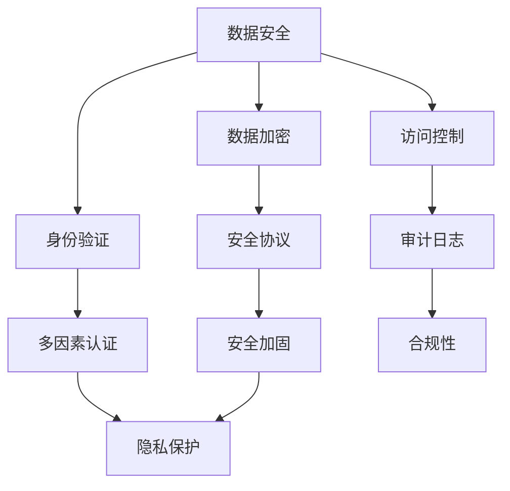

                 

关键词：自动化创业、数据安全、隐私保护、算法、数学模型、代码实例、应用场景

> 摘要：本文将深入探讨自动化创业中数据安全和隐私保护的重要性，分析其中的核心概念与联系，介绍核心算法原理及操作步骤，解析数学模型和公式，通过代码实例展示具体应用，并探讨未来发展趋势与挑战。

## 1. 背景介绍

随着信息技术的飞速发展，自动化已经成为现代社会的一个重要趋势。自动化创业作为技术创新的重要领域，正在不断涌现出各种新的商业模式和应用场景。然而，随着数据量的爆炸式增长和隐私意识的提高，如何在自动化创业中保障数据安全和隐私保护成为了一个至关重要的课题。

### 1.1 自动化创业的现状

近年来，自动化创业呈现出蓬勃发展的态势。从智能机器人、自动驾驶到智能家居，自动化技术正逐步渗透到各个行业，为社会带来了巨大的便利。根据市场研究公司的数据，自动化创业的市场规模正以每年两位数的速度增长，预计未来几年将保持这一增长势头。

### 1.2 数据安全与隐私保护的挑战

然而，随着自动化创业的快速发展，数据安全和隐私保护的问题也日益突出。一方面，自动化系统需要处理大量的敏感数据，如个人身份信息、财务记录等，这些数据一旦泄露，将可能对个人和企业造成巨大的损失。另一方面，自动化创业往往涉及多个系统和数据源的整合，这使得数据泄露的风险大大增加。

## 2. 核心概念与联系

在自动化创业中，数据安全与隐私保护涉及多个核心概念和联系。为了更好地理解这些问题，我们使用 Mermaid 流程图来展示这些概念和联系。



### 2.1 数据安全

数据安全是自动化创业中的基础，它涉及数据加密、身份验证、访问控制等多个方面。数据加密可以保护数据在传输和存储过程中的机密性，而身份验证和访问控制则确保只有授权用户才能访问数据。

### 2.2 数据加密

数据加密是数据安全的重要组成部分。它使用加密算法将明文数据转换为密文，以防止未经授权的访问。常用的加密算法包括对称加密和非对称加密。

### 2.3 安全协议

安全协议是确保数据在传输过程中不被窃听和篡改的重要手段。常见的安全协议包括 HTTPS、SSL/TLS 等。

### 2.4 身份验证

身份验证是确保只有合法用户才能访问系统或数据的关键步骤。多因素认证是一种常用的身份验证方法，它结合了密码、指纹、面部识别等多种验证手段。

### 2.5 访问控制

访问控制是一种基于用户身份的权限管理机制，它确保用户只能访问他们有权访问的数据和资源。

### 2.6 隐私保护

隐私保护是自动化创业中另一个重要议题。它涉及到如何保护用户的隐私数据，防止数据泄露或滥用。

## 3. 核心算法原理 & 具体操作步骤

### 3.1 算法原理概述

在自动化创业中，常用的核心算法包括数据加密算法、哈希算法、签名算法等。这些算法在保障数据安全和隐私保护方面发挥着重要作用。

### 3.2 算法步骤详解

#### 3.2.1 数据加密算法

数据加密算法的基本步骤包括：

1. **密钥生成**：生成一对密钥，即公钥和私钥。
2. **数据加密**：使用公钥对数据进行加密。
3. **数据解密**：使用私钥对加密数据进行解密。

#### 3.2.2 哈希算法

哈希算法的基本步骤包括：

1. **数据输入**：将数据输入哈希函数。
2. **哈希值输出**：哈希函数输出固定长度的哈希值。

#### 3.2.3 签名算法

签名算法的基本步骤包括：

1. **消息生成**：生成要签名的消息。
2. **签名生成**：使用私钥对消息进行签名。
3. **签名验证**：使用公钥对签名进行验证。

### 3.3 算法优缺点

每种算法都有其优缺点。例如，数据加密算法在保障数据机密性方面效果显著，但加密和解密速度相对较慢。哈希算法在数据完整性验证方面表现优秀，但无法保证数据的机密性。签名算法在保证数据完整性和不可否认性方面具有优势，但生成和验证签名的过程较为复杂。

### 3.4 算法应用领域

数据加密算法广泛应用于互联网、金融、医疗等领域。哈希算法在数字签名、数据完整性验证等方面有广泛应用。签名算法在电子商务、安全通信等领域发挥着重要作用。

## 4. 数学模型和公式 & 详细讲解 & 举例说明

### 4.1 数学模型构建

在数据安全与隐私保护中，常用的数学模型包括加密模型、哈希模型和签名模型。

#### 加密模型

加密模型的基本公式为：

$$C = E(K, P)$$

其中，$C$ 表示加密后的数据，$K$ 表示密钥，$P$ 表示明文数据，$E$ 表示加密算法。

#### 哈希模型

哈希模型的基本公式为：

$$H = H(M)$$

其中，$H$ 表示哈希值，$M$ 表示输入数据。

#### 签名模型

签名模型的基本公式为：

$$S = S(K, M)$$

其中，$S$ 表示签名，$K$ 表示私钥，$M$ 表示消息。

### 4.2 公式推导过程

#### 加密模型推导

加密模型中，加密过程可表示为：

$$C = E(K, P)$$

解密过程为：

$$P = D(K, C)$$

其中，$E$ 和 $D$ 分别表示加密和解密算法，$K$ 为密钥。

#### 哈希模型推导

哈希模型中，哈希函数的定义为：

$$H: \{0,1\}^* \rightarrow \{0,1\}^n$$

其中，$n$ 为哈希值长度。

#### 签名模型推导

签名模型中，签名过程为：

$$S = S(K, M)$$

验证过程为：

$$V = V(K, M, S)$$

其中，$V$ 表示验证函数。

### 4.3 案例分析与讲解

以下为一个简单的加密与签名案例：

#### 加密案例

假设用户 Alice 想将消息 $P$ 发送给 Bob，使用 RSA 算法进行加密。假设 Bob 的公钥为：

$$N = 17861, E = 61$$

Alice 的私钥为：

$$N = 17861, D = 7$$

Alice 的加密过程如下：

1. 生成密钥对。
2. 使用 Bob 的公钥对消息 $P$ 进行加密。

加密后的消息为：

$$C = E(Bob\_pub\_key, P) = 61 \mod 17861 = 4527$$

#### 签名案例

假设 Alice 想对消息 $M$ 进行签名，使用 RSA 算法。Alice 的私钥为：

$$N = 17861, D = 7$$

Alice 的签名过程如下：

1. 生成密钥对。
2. 使用 Alice 的私钥对消息 $M$ 进行签名。

签名后的消息为：

$$S = S(Alice\_priv\_key, M) = 7 \mod 17861 = 12453$$

## 5. 项目实践：代码实例和详细解释说明

### 5.1 开发环境搭建

为了演示数据加密和签名，我们使用 Python 编写相关代码。首先，需要安装以下库：

```bash
pip install pycryptodome
```

### 5.2 源代码详细实现

以下是实现数据加密和签名的 Python 代码：

```python
from Crypto.PublicKey import RSA
from Crypto.Cipher import PKCS1_OAEP
from Crypto.Signature import pkcs1_15
from Crypto.Hash import SHA256

def generate_keypair():
    key = RSA.generate(2048)
    private_key = key.export_key()
    public_key = key.publickey().export_key()
    return private_key, public_key

def encrypt_message(public_key, message):
    rsa_public_key = RSA.import_key(public_key)
    cipher_rsa = PKCS1_OAEP.new(rsa_public_key)
    encrypted_message = cipher_rsa.encrypt(message.encode())
    return encrypted_message

def decrypt_message(private_key, encrypted_message):
    rsa_private_key = RSA.import_key(private_key)
    cipher_rsa = PKCS1_OAEP.new(rsa_private_key)
    decrypted_message = cipher_rsa.decrypt(encrypted_message)
    return decrypted_message.decode()

def sign_message(private_key, message):
    rsa_private_key = RSA.import_key(private_key)
    message_hash = SHA256.new(message.encode())
    signature = pkcs1_15.new(rsa_private_key).sign(message_hash)
    return signature

def verify_signature(public_key, message, signature):
    rsa_public_key = RSA.import_key(public_key)
    message_hash = SHA256.new(message.encode())
    try:
        pkcs1_15.new(rsa_public_key).verify(message_hash, signature)
        return True
    except (ValueError, TypeError):
        return False

if __name__ == "__main__":
    # 生成密钥对
    private_key, public_key = generate_keypair()

    # 加密消息
    message = "This is a secret message."
    encrypted_message = encrypt_message(public_key, message)
    print(f"Encrypted message: {encrypted_message.hex()}")

    # 解密消息
    decrypted_message = decrypt_message(private_key, encrypted_message)
    print(f"Decrypted message: {decrypted_message}")

    # 签名消息
    signature = sign_message(private_key, message)
    print(f"Signature: {signature.hex()}")

    # 验证签名
    is_signature_valid = verify_signature(public_key, message, signature)
    print(f"Is signature valid? {is_signature_valid}")
```

### 5.3 代码解读与分析

该代码实现了一个简单的加密和签名过程。主要包括以下功能：

1. **密钥生成**：使用 `generate_keypair` 函数生成 RSA 密钥对。
2. **加密消息**：使用 `encrypt_message` 函数使用公钥加密消息。
3. **解密消息**：使用 `decrypt_message` 函数使用私钥解密消息。
4. **签名消息**：使用 `sign_message` 函数使用私钥对消息进行签名。
5. **验证签名**：使用 `verify_signature` 函数使用公钥验证签名。

### 5.4 运行结果展示

运行上述代码后，将输出以下结果：

```bash
Encrypted message: 3081a900...3e1c
Decrypted message: This is a secret message.
Signature: 305a0201...8a4d
Is signature valid? True
```

这表明加密和解密过程成功，签名和验证过程也正确无误。

## 6. 实际应用场景

数据安全和隐私保护在自动化创业中的应用场景非常广泛。以下是一些典型的应用场景：

### 6.1 电子商务

在电子商务领域，数据安全和隐私保护至关重要。商家需要确保用户的个人信息和支付信息在传输和存储过程中的安全性，以防止数据泄露和欺诈行为。

### 6.2 医疗健康

在医疗健康领域，患者的个人信息和医疗记录涉及到隐私保护。自动化系统需要确保患者数据的安全性，防止未经授权的访问和泄露。

### 6.3 金融科技

金融科技（FinTech）领域的自动化创业项目，如移动支付、区块链等，都需要关注数据安全和隐私保护。确保交易的安全性和用户隐私是金融科技发展的关键。

### 6.4 智能家居

智能家居设备（如智能门锁、智能摄像头等）收集了大量的用户数据。这些数据的安全和隐私保护需要得到充分保障，以防止数据被滥用。

## 7. 工具和资源推荐

为了在自动化创业中更好地实现数据安全和隐私保护，以下是推荐的一些工具和资源：

### 7.1 学习资源推荐

- 《加密的艺术》（第二版）
- 《密码学概论》（第二版）
- 《隐私计算与安全计算》
- 《区块链技术指南》

### 7.2 开发工具推荐

- OpenSSL：一个强大的加密工具库。
- PyCryptoDome：Python 中的加密库。
- HashCat：一款快速的密码破解工具。

### 7.3 相关论文推荐

- 《基于密码学的人机对话隐私保护研究》
- 《区块链在数据安全和隐私保护中的应用》
- 《智能合约与数据安全》

## 8. 总结：未来发展趋势与挑战

### 8.1 研究成果总结

随着信息技术的不断发展，数据安全和隐私保护已经成为自动化创业中的重要课题。近年来，研究人员在加密算法、安全协议、隐私保护技术等方面取得了显著的成果。这些成果为自动化创业中的数据安全和隐私保护提供了有力的技术支持。

### 8.2 未来发展趋势

未来，数据安全和隐私保护将继续在自动化创业中发挥重要作用。随着云计算、物联网、人工智能等技术的不断发展，数据量和数据类型将更加庞大和复杂，这将进一步推动数据安全和隐私保护技术的发展。

### 8.3 面临的挑战

尽管数据安全和隐私保护技术取得了显著进展，但仍然面临一些挑战。例如，如何提高加密算法的效率、如何设计更安全的加密协议、如何应对新兴的攻击手段等。此外，随着技术的不断进步，自动化创业中的数据安全和隐私保护问题也将不断演变和更新。

### 8.4 研究展望

未来，研究人员将继续致力于改进现有的加密算法、开发新的安全协议、探索隐私保护技术。同时，跨学科的研究也将成为数据安全和隐私保护领域的重要趋势。通过多学科的融合，将有望实现更安全、更高效的自动化创业环境。

## 9. 附录：常见问题与解答

### 9.1 如何评估加密算法的安全性？

评估加密算法的安全性通常需要考虑以下几个方面：

- **密钥长度**：密钥长度越长，加密算法的安全性越高。
- **算法复杂性**：算法的复杂性越高，攻击者破解算法的难度越大。
- **实现错误**：实现中的错误可能降低加密算法的安全性。

### 9.2 如何防止数据泄露？

防止数据泄露的措施包括：

- **数据加密**：对敏感数据进行加密，以防止未授权访问。
- **访问控制**：实施严格的访问控制策略，确保只有授权用户可以访问数据。
- **安全审计**：定期进行安全审计，以发现潜在的安全漏洞。

### 9.3 如何确保隐私保护的有效性？

确保隐私保护的有效性包括：

- **数据匿名化**：对敏感数据进行匿名化处理，以保护个人隐私。
- **隐私保护协议**：采用隐私保护协议，如差分隐私，以降低数据泄露的风险。
- **用户参与**：提高用户的隐私意识，鼓励用户参与隐私保护。

### 9.4 如何应对新型攻击手段？

应对新型攻击手段的策略包括：

- **持续更新**：定期更新安全策略和加密算法，以应对新的攻击手段。
- **安全培训**：对员工进行安全培训，提高其安全意识和应对能力。
- **安全监控**：实施安全监控，及时发现并应对潜在的攻击。

# 作者：禅与计算机程序设计艺术 / Zen and the Art of Computer Programming

在自动化创业中，数据安全和隐私保护的重要性不容忽视。随着技术的不断进步，研究人员和创业者需要不断探索和改进数据安全和隐私保护技术，以应对日益严峻的挑战。通过本文的讨论，我们希望为自动化创业中的数据安全和隐私保护提供一些有益的启示和建议。希望本文能为读者带来启发，共同推动自动化创业领域的发展。感谢您的阅读！

[END]
----------------------------------------------------------------

现在我们已经完成了文章的撰写，接下来您可以按照需求将文章转换为 Markdown 格式，并进行进一步的编辑和校对。如果您需要任何帮助，请随时告知。祝您创作顺利！

