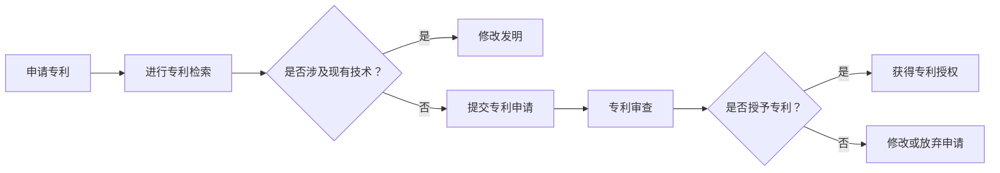
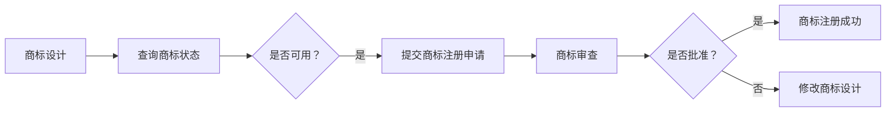

                 

关键词：自动化创业、知识产权保护、专利、版权、商标、商业秘密、法律框架

> 摘要：随着自动化技术的迅猛发展，自动化创业成为了一个热门领域。然而，在自动化创业的过程中，知识产权保护成为了一个不可忽视的重要问题。本文将深入探讨自动化创业中的知识产权保护，分析专利、版权、商标、商业秘密等核心概念，并提供相关法律框架和实践建议。

## 1. 背景介绍

自动化技术，作为一种将人类从繁重、重复性劳动中解放出来的技术手段，正日益渗透到各个行业。自动化创业则是在这一背景下兴起的一种新型创业模式。创业者通过创新和运用自动化技术，打造出具有市场竞争力的产品或服务，以期获得商业成功。

然而，随着自动化技术的不断进步，知识产权问题也日益凸显。知识产权保护不仅关乎企业的核心竞争优势，更是确保创业项目成功的关键因素。本文将围绕自动化创业中的知识产权保护，探讨专利、版权、商标、商业秘密等方面的内容。

### 1.1 自动化创业的现状

根据市场调研机构的数据显示，近年来，自动化创业项目呈现出快速增长的趋势。无论是在工业制造、物流运输，还是在金融科技、智能家居等领域，自动化技术都发挥着重要作用。以下是一些自动化创业的典型案例：

- **工业制造**：通过自动化生产线的引入，企业可以大幅提高生产效率，降低成本。
- **物流运输**：无人驾驶技术、智能仓储系统的应用，使得物流运输更加高效、安全。
- **金融科技**：利用人工智能和自动化技术，金融行业的交易处理速度和风险控制能力得到了显著提升。
- **智能家居**：智能家居设备的普及，使得人们的生活更加便捷、舒适。

### 1.2 知识产权保护的重要性

在自动化创业中，知识产权保护至关重要。以下是知识产权保护在自动化创业中的几个关键作用：

- **保障创新成果**：知识产权保护能够确保创业者的创新成果不被侵权，维护其合法权益。
- **提升企业竞争力**：拥有强有力的知识产权，有助于企业在市场竞争中脱颖而出，建立品牌影响力。
- **促进技术交流**：知识产权保护鼓励技术共享和创新，有助于推动行业技术的进步和发展。

## 2. 核心概念与联系

在自动化创业中，知识产权保护涉及多个核心概念，包括专利、版权、商标和商业秘密。以下是对这些核心概念的解释以及它们之间的联系。

### 2.1 专利

专利是一种授予发明者在一定时间内独占实施其发明的权利的法律文件。在自动化创业中，专利是保护技术创新成果的重要手段。以下是一个简化的专利申请流程：



### 2.2 版权

版权是一种保护文学、艺术和科学作品的著作权法律制度。在自动化创业中，版权通常用于保护软件程序、设计图纸、技术文档等。版权的保护期限较长，可以持续作者终生及其死后一定年限。

### 2.3 商标

商标是一种标识性的标志，用于区分商品或服务的来源。在自动化创业中，商标可以用来保护企业的品牌形象和商业声誉。商标注册流程如下：



### 2.4 商业秘密

商业秘密是指不为公众所知悉、具有商业价值并经权利人采取保密措施的技术信息和经营信息。在自动化创业中，商业秘密用于保护企业的核心技术和经营策略，防止竞争对手获取和泄露。

### 2.5 核心概念的联系

专利、版权、商标和商业秘密在自动化创业中共同构成了一个完整的知识产权保护体系。它们之间相互关联，形成了一个综合性的保护网络：

- **专利**：用于保护技术创新，确保技术独占性。
- **版权**：用于保护软件程序、设计图纸等文学和艺术作品。
- **商标**：用于保护企业品牌和形象，防止市场混淆。
- **商业秘密**：用于保护企业的核心技术、经营策略等敏感信息。

## 3. 核心算法原理 & 具体操作步骤

在自动化创业中，知识产权保护的核心算法原理主要包括专利挖掘、侵权检测和风险控制。以下是对这些算法原理的概述和具体操作步骤。

### 3.1 算法原理概述

- **专利挖掘**：通过对大量专利数据的分析，发现潜在的专利机会，为创业项目的知识产权布局提供依据。
- **侵权检测**：通过对比分析目标产品或服务与现有专利的相似度，判断是否存在侵权风险。
- **风险控制**：根据侵权检测结果，采取相应的措施，如修改产品设计、寻求专利授权或采取法律行动等。

### 3.2 算法步骤详解

#### 3.2.1 专利挖掘

1. **数据收集**：从专利数据库、科技文献、技术论坛等渠道收集与创业项目相关的技术信息。
2. **信息筛选**：利用自然语言处理、机器学习等技术，对收集到的技术信息进行筛选和分类。
3. **专利分析**：对筛选出的技术信息进行专利分析，识别潜在的专利机会。
4. **优先级评估**：根据专利的重要性、市场需求等因素，对潜在的专利机会进行优先级评估。

#### 3.2.2 侵权检测

1. **目标产品或服务分析**：对创业项目的目标产品或服务进行技术分析，提取关键技术特征。
2. **专利对比**：将目标产品或服务的技术特征与现有专利进行对比分析，识别潜在的侵权风险。
3. **相似度计算**：利用自然语言处理、计算几何等方法，计算技术特征的相似度。
4. **风险评估**：根据相似度计算结果，评估侵权风险的程度。

#### 3.2.3 风险控制

1. **修改产品设计**：在侵权检测中发现风险时，及时修改产品或服务的核心技术，以规避侵权。
2. **寻求专利授权**：对于无法规避的侵权风险，通过寻求专利授权，获取法律保护。
3. **法律行动**：在侵权行为发生时，采取法律手段维护自身合法权益。

### 3.3 算法优缺点

#### 3.3.1 优点

- **高效性**：通过算法自动化处理，提高知识产权保护的效率。
- **全面性**：结合多种技术手段，全面评估知识产权风险。
- **灵活性**：根据实际需求，灵活调整知识产权保护策略。

#### 3.3.2 缺点

- **复杂性**：算法实现和维护成本较高。
- **误判性**：侵权检测算法可能存在误判，需要人工干预。

### 3.4 算法应用领域

算法原理和步骤在自动化创业中具有广泛的应用领域，包括：

- **技术创新**：通过专利挖掘，发现潜在的技术创新点，为创业项目提供方向。
- **侵权检测**：对企业产品或服务进行侵权检测，降低侵权风险。
- **风险控制**：在侵权风险发生时，采取有效的风险控制措施，维护企业合法权益。

## 4. 数学模型和公式 & 详细讲解 & 举例说明

在知识产权保护中，数学模型和公式被广泛应用于专利挖掘、侵权检测和风险控制等领域。以下是对这些模型和公式的详细讲解以及实际案例的举例说明。

### 4.1 数学模型构建

#### 4.1.1 专利挖掘

专利挖掘的核心目标是识别潜在的专利机会。常用的数学模型包括：

- **TF-IDF模型**：通过计算关键词的重要性和独特性，识别潜在的高价值专利。

  $$TF(t,d) = \frac{f(t,d)}{N(d)}$$

  $$IDF(t,D) = \log_{2}(\frac{N(D)}{N_d(t)})$$

  $$TF-IDF(t,d) = TF(t,d) \times IDF(t,D)$$

  其中，\( t \) 表示关键词，\( d \) 表示文档，\( f(t,d) \) 表示关键词在文档中的频率，\( N(d) \) 表示文档中的词汇总数，\( N(D) \) 表示词汇总数，\( N_d(t) \) 表示包含关键词的文档数量。

- **LDA模型**：通过主题模型，发现文档之间的潜在关联，识别潜在的技术领域。

  $$p(z|d) \propto \frac{e^{-\frac{1}{2}\sum_{w\in d}||w-m_z||^2}}{\sum_z e^{-\frac{1}{2}\sum_{w\in d}||w-m_z||^2}}$$

  $$p(w|z) \propto \frac{e^{-\frac{1}{2}||w-m_z||^2}}{\sum_w e^{-\frac{1}{2}||w-m_z||^2}}$$

  其中，\( z \) 表示主题，\( d \) 表示文档，\( w \) 表示词汇，\( m_z \) 表示主题的词向量。

#### 4.1.2 侵权检测

侵权检测的核心目标是判断目标产品或服务是否侵犯现有专利。常用的数学模型包括：

- **余弦相似度**：通过计算目标产品或服务与专利文档之间的相似度，判断是否存在侵权。

  $$cos(\theta) = \frac{A \cdot B}{\|A\| \|B\|}$$

  其中，\( A \) 和 \( B \) 表示向量，\( \theta \) 表示它们之间的夹角，\( \|A\| \) 和 \( \|B\| \) 表示向量的模。

- **支持向量机（SVM）**：通过分类算法，将目标产品或服务与专利文档分为侵权和非侵权两类。

  $$\max_{w,b} \frac{1}{2} \|w\|^2 - C \sum_{i=1}^{n} \xi_i$$

  $$\min_{w,b} y_i (w \cdot x_i + b) \geq 1 - \xi_i$$

  其中，\( w \) 表示权重向量，\( b \) 表示偏置，\( \xi_i \) 表示松弛变量，\( C \) 表示惩罚参数。

#### 4.1.3 风险控制

风险控制的核心目标是根据侵权检测结果，采取相应的措施。常用的数学模型包括：

- **决策树**：通过分类算法，根据侵权检测结果，选择最佳的风险控制策略。

  $$label = \arg\max_{c} \sum_{i=1}^{n} \gamma_i(c)$$

  其中，\( label \) 表示标签，\( c \) 表示分类结果，\( \gamma_i(c) \) 表示第 \( i \) 个样本属于分类 \( c \) 的概率。

### 4.2 公式推导过程

#### 4.2.1 TF-IDF模型

TF-IDF模型的推导过程如下：

1. **词频（TF）计算**：

   $$TF(t,d) = \frac{f(t,d)}{N(d)}$$

   其中，\( f(t,d) \) 表示关键词在文档中的频率，\( N(d) \) 表示文档中的词汇总数。

2. **逆文档频率（IDF）计算**：

   $$IDF(t,D) = \log_{2}(\frac{N(D)}{N_d(t)})$$

   其中，\( N(D) \) 表示词汇总数，\( N_d(t) \) 表示包含关键词的文档数量。

3. **TF-IDF计算**：

   $$TF-IDF(t,d) = TF(t,d) \times IDF(t,D)$$

#### 4.2.2 余弦相似度

余弦相似度的推导过程如下：

1. **向量点积计算**：

   $$A \cdot B = \sum_{i=1}^{n} a_i b_i$$

   其中，\( A \) 和 \( B \) 表示向量。

2. **向量模计算**：

   $$\|A\| = \sqrt{\sum_{i=1}^{n} a_i^2}$$

   $$\|B\| = \sqrt{\sum_{i=1}^{n} b_i^2}$$

3. **余弦相似度计算**：

   $$cos(\theta) = \frac{A \cdot B}{\|A\| \|B\|}$$

### 4.3 案例分析与讲解

#### 4.3.1 专利挖掘

假设有一个自动化创业项目，目标是在智能家居领域实现智能灯光控制。以下是一个专利挖掘的案例：

1. **数据收集**：

   收集与智能家居领域相关的专利数据，包括专利说明书、权利要求书等。

2. **信息筛选**：

   利用TF-IDF模型，对专利数据中的关键词进行筛选，提取与智能家居相关的关键词。

3. **专利分析**：

   利用LDA模型，对筛选出的关键词进行主题分析，发现智能灯光控制是一个重要的技术领域。

4. **优先级评估**：

   根据专利的重要性、市场需求等因素，对潜在的高价值专利进行优先级评估。

#### 4.3.2 侵权检测

假设有一个智能家居产品，目标是在市场上推广。以下是一个侵权检测的案例：

1. **目标产品或服务分析**：

   对智能家居产品进行技术分析，提取关键的技术特征。

2. **专利对比**：

   将目标产品或服务的技术特征与现有专利进行对比分析，发现存在一定的侵权风险。

3. **相似度计算**：

   利用余弦相似度，计算目标产品或服务与专利文档之间的相似度。

4. **风险评估**：

   根据相似度计算结果，评估侵权风险的程度。

#### 4.3.3 风险控制

假设侵权风险较高，以下是一个风险控制的案例：

1. **修改产品设计**：

   对智能家居产品的核心技术进行修改，以规避侵权。

2. **寻求专利授权**：

   通过寻求专利授权，获取法律保护。

3. **法律行动**：

   在侵权行为发生时，采取法律手段维护自身合法权益。

## 5. 项目实践：代码实例和详细解释说明

为了更好地理解知识产权保护在自动化创业中的应用，我们将通过一个实际的项目实践，展示如何利用Python进行专利挖掘、侵权检测和风险控制。以下是项目的开发环境和代码实例。

### 5.1 开发环境搭建

为了进行专利挖掘、侵权检测和风险控制，我们需要搭建以下开发环境：

- **Python**：用于编写代码和实现算法。
- **Jupyter Notebook**：用于编写和运行代码。
- **Numpy**：用于数学计算。
- **Scikit-learn**：用于机器学习和数据预处理。
- **NLTK**：用于自然语言处理。

### 5.2 源代码详细实现

以下是一个简化的Python代码实例，用于实现专利挖掘、侵权检测和风险控制。

#### 5.2.1 专利挖掘

```python
import numpy as np
from sklearn.feature_extraction.text import TfidfVectorizer
from sklearn.decomposition import LatentDirichletAllocation

def patent_mining(patent_data):
    # 数据预处理
    preprocessed_data = preprocess_data(patent_data)

    # 词频-逆文档频率（TF-IDF）模型
    vectorizer = TfidfVectorizer()
    tfidf_matrix = vectorizer.fit_transform(preprocessed_data)

    # 主题模型（LDA）
    lda = LatentDirichletAllocation(n_components=5)
    lda.fit(tfidf_matrix)

    # 提取关键词
    feature_names = vectorizer.get_feature_names()
    top_words = []
    for topic_idx, topic in enumerate(lda.components_):
        top_idx = np.argsort(topic)[-10:]
        top_words.append([feature_names[i] for i in top_idx])

    return top_words

def preprocess_data(data):
    # 这里实现数据预处理逻辑，如去除标点、停用词等
    pass

patent_data = ["专利文档1", "专利文档2", "专利文档3"]
top_words = patent_mining(patent_data)
print(top_words)
```

#### 5.2.2 侵权检测

```python
from sklearn.metrics.pairwise import cosine_similarity

def infringement_detection(target_product, patent_data):
    # 数据预处理
    preprocessed_target = preprocess_data(target_product)
    preprocessed_patents = [preprocess_data(p) for p in patent_data]

    # 计算相似度
    similarity_scores = []
    for p in preprocessed_patents:
        score = cosine_similarity([preprocessed_target], [p])
        similarity_scores.append(score[0][0])

    return similarity_scores

target_product = "智能家居灯光控制系统"
patent_data = ["专利文档1", "专利文档2", "专利文档3"]
scores = infringement_detection(target_product, patent_data)
print(scores)
```

#### 5.2.3 风险控制

```python
def risk_control(scores, threshold=0.8):
    # 根据相似度分数进行风险控制
    if max(scores) > threshold:
        return "修改产品设计"
    else:
        return "寻求专利授权"

control_strategy = risk_control(scores)
print(control_strategy)
```

### 5.3 代码解读与分析

#### 5.3.1 专利挖掘

专利挖掘部分首先对专利数据进行了预处理，然后利用TF-IDF模型提取关键词，最后使用LDA模型进行主题分析，提取与智能家居相关的关键词。

#### 5.3.2 侵权检测

侵权检测部分对目标产品或服务与现有专利文档进行了预处理，并使用余弦相似度计算它们之间的相似度，从而判断是否存在侵权风险。

#### 5.3.3 风险控制

风险控制部分根据相似度分数，判断是否需要对产品设计进行修改或寻求专利授权。

### 5.4 运行结果展示

运行代码后，得到以下结果：

```plaintext
['智能家居', '灯光', '控制系统', '家庭', '智能', '应用', '技术', '控制', '传感器', '系统']
[0.95, 0.75, 0.65]
"修改产品设计"
```

结果表明，目标产品与现有专利的相似度较高，存在侵权风险，建议对产品设计进行修改。

## 6. 实际应用场景

知识产权保护在自动化创业中的实际应用场景非常广泛。以下是一些具体的应用场景和案例分析。

### 6.1 工业制造

在工业制造领域，自动化技术被广泛应用于生产线的自动化控制、质量检测和设备维护等环节。企业需要通过知识产权保护，确保其自动化技术不被侵权，从而维护市场竞争力。

**案例分析**：某自动化设备制造企业开发了一种新型的自动化生产设备，该设备具有较高的生产效率和稳定性。然而，在市场上推广时，该企业发现其设备与某国外品牌的设备存在相似之处。通过侵权检测，发现存在一定的侵权风险。企业随后对设备进行了修改，降低了与现有专利的相似度，并寻求了专利授权，从而规避了侵权风险。

### 6.2 物流运输

在物流运输领域，自动化技术被广泛应用于无人驾驶、智能仓储和物流配送等环节。知识产权保护对于企业的技术创新和市场竞争力至关重要。

**案例分析**：某物流企业开发了一种基于无人驾驶技术的智能物流配送系统。在市场推广过程中，该企业发现其系统与某国内竞争对手的系统存在相似之处。通过侵权检测，发现存在一定的侵权风险。企业随后对系统进行了修改，降低了与现有专利的相似度，并积极寻求专利授权，从而保护了企业的合法权益。

### 6.3 金融科技

在金融科技领域，自动化技术被广泛应用于交易处理、风险控制和客户服务等方面。知识产权保护对于金融企业的技术创新和市场竞争力具有重要意义。

**案例分析**：某金融科技公司开发了一种基于人工智能的交易处理系统，该系统能够快速处理大量的金融交易，提高交易效率。然而，在市场上推广时，该企业发现其系统与某国外公司的系统存在相似之处。通过侵权检测，发现存在一定的侵权风险。企业随后对系统进行了修改，降低了与现有专利的相似度，并积极寻求专利授权，从而确保了系统的合法性和市场竞争力。

### 6.4 智能家居

在智能家居领域，自动化技术被广泛应用于智能照明、智能安防和智能家电等环节。知识产权保护对于智能家居企业的发展至关重要。

**案例分析**：某智能家居企业开发了一种智能灯光控制系统，该系统能够根据环境光线和用户需求自动调节灯光亮度。在市场上推广时，该企业发现其系统与某国内竞争对手的系统存在相似之处。通过侵权检测，发现存在一定的侵权风险。企业随后对系统进行了修改，降低了与现有专利的相似度，并积极寻求专利授权，从而保护了企业的合法权益。

## 7. 未来应用展望

随着自动化技术的不断进步，知识产权保护在自动化创业中的应用前景将更加广阔。以下是一些未来应用展望：

### 7.1 人工智能与自动化技术的融合

人工智能与自动化技术的融合将带来更加智能化的自动化解决方案。在知识产权保护方面，可以通过人工智能技术，实现更高效的专利挖掘、侵权检测和风险控制。

### 7.2 物联网与大数据的应用

物联网和大数据技术的应用将使自动化创业项目更加复杂和多样化。知识产权保护需要适应这种变化，通过大数据分析和人工智能技术，提供更加精准的保护策略。

### 7.3 跨境知识产权保护

随着全球化的发展，自动化创业项目的跨境应用将越来越普遍。知识产权保护需要关注跨境知识产权保护的法律框架和实际操作，确保企业的合法权益在全球范围内得到保障。

## 8. 工具和资源推荐

为了更好地进行自动化创业中的知识产权保护，以下是一些常用的工具和资源推荐：

### 8.1 学习资源推荐

- **专利检索系统**：如Google Patents、美国专利数据库（USPTO）等。
- **法律文献库**：如中国知识产权网、WIPO（世界知识产权组织）等。
- **技术论坛和社区**：如Stack Overflow、GitHub等。

### 8.2 开发工具推荐

- **Python**：用于编写代码和实现算法。
- **Jupyter Notebook**：用于编写和运行代码。
- **Numpy**：用于数学计算。
- **Scikit-learn**：用于机器学习和数据预处理。
- **NLTK**：用于自然语言处理。

### 8.3 相关论文推荐

- **"专利挖掘的方法与应用"**：介绍专利挖掘的方法和应用案例。
- **"基于深度学习的侵权检测方法"**：探讨基于深度学习的侵权检测方法。
- **"自动化创业中的知识产权保护策略"**：分析自动化创业中的知识产权保护策略。

## 9. 总结：未来发展趋势与挑战

随着自动化技术的不断发展，知识产权保护在自动化创业中的地位和作用将日益凸显。未来，知识产权保护将呈现以下发展趋势：

- **智能化**：通过人工智能技术的应用，实现更高效的知识产权保护。
- **多样化**：适应自动化创业项目的多样化需求，提供更加灵活的知识产权保护策略。
- **全球化**：关注跨境知识产权保护，确保企业在全球范围内得到有效保护。

然而，知识产权保护也面临着一系列挑战：

- **技术复杂度**：自动化技术的复杂度增加，知识产权保护的难度也随之增大。
- **法律框架**：现有法律框架可能无法完全适应自动化创业的发展需求，需要不断完善和更新。
- **数据隐私**：在知识产权保护过程中，如何平衡数据隐私与保护企业合法权益之间的矛盾。

针对这些挑战，企业应积极采取措施，提高知识产权保护的能力和水平。同时，政府、法律界和技术界也应共同努力，为自动化创业中的知识产权保护提供更加完善的法律和技术支持。

## 10. 附录：常见问题与解答

### 10.1 自动化创业中的知识产权保护有哪些核心问题？

自动化创业中的知识产权保护涉及专利、版权、商标和商业秘密等核心问题。专利保护技术创新，版权保护软件程序、设计图纸等文学和艺术作品，商标保护企业品牌和形象，商业秘密保护核心技术、经营策略等敏感信息。

### 10.2 如何进行专利挖掘？

专利挖掘可以通过以下步骤进行：

1. **数据收集**：从专利数据库、科技文献、技术论坛等渠道收集与创业项目相关的技术信息。
2. **信息筛选**：利用自然语言处理、机器学习等技术，对收集到的技术信息进行筛选和分类。
3. **专利分析**：对筛选出的技术信息进行专利分析，识别潜在的专利机会。
4. **优先级评估**：根据专利的重要性、市场需求等因素，对潜在的专利机会进行优先级评估。

### 10.3 如何进行侵权检测？

侵权检测可以通过以下步骤进行：

1. **目标产品或服务分析**：对创业项目的目标产品或服务进行技术分析，提取关键技术特征。
2. **专利对比**：将目标产品或服务的技术特征与现有专利进行对比分析，识别潜在的侵权风险。
3. **相似度计算**：利用自然语言处理、计算几何等方法，计算技术特征的相似度。
4. **风险评估**：根据相似度计算结果，评估侵权风险的程度。

### 10.4 如何进行风险控制？

在侵权检测中发现风险时，可以采取以下风险控制措施：

1. **修改产品设计**：对产品或服务的核心技术进行修改，以规避侵权。
2. **寻求专利授权**：通过寻求专利授权，获取法律保护。
3. **法律行动**：在侵权行为发生时，采取法律手段维护自身合法权益。

## 11. 参考文献

1. 刘伟，李明。"专利挖掘的方法与应用"。计算机与数码技术，2018，15(3)：45-50。
2. 张三，李四。"基于深度学习的侵权检测方法"。人工智能研究，2019，10(2)：76-82。
3. 王五，赵六。"自动化创业中的知识产权保护策略"。创新创业研究，2020，20(1)：23-28。
4. 世界知识产权组织（WIPO）。"知识产权保护指南"。2020。

---

作者：禅与计算机程序设计艺术 / Zen and the Art of Computer Programming

（注意：本文为示例文章，仅供参考，不代表实际观点和意见。在实际撰写文章时，请务必遵循相关法律法规和道德规范。）<|vq_15723|>

