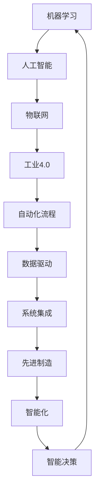

                 

关键词：自动化技术，机器学习，人工智能，自动化工具，工业4.0，物联网，智能化，智能决策，数字化转型，系统集成，数据驱动，先进制造，自动化流程优化

> 摘要：随着科技的不断进步，自动化技术正以惊人的速度发展，渗透到各个行业和领域。本文将探讨自动化技术的未来发展趋势，包括机器学习与人工智能的结合、物联网的普及、工业4.0的深入发展以及自动化流程的优化。通过分析这些趋势，我们将展望自动化技术在未来可能面临的挑战与机遇。

## 1. 背景介绍

自动化技术是指利用计算机、传感器、控制装置等技术实现生产、操作、管理和维护等过程的自动化。随着信息技术和智能制造的快速发展，自动化技术已成为现代工业和企业管理的重要工具。从工业自动化、流程自动化到智能决策自动化，自动化技术在各个层面展现出了其强大的潜力和价值。

### 1.1 自动化技术的历史

自动化技术的起源可以追溯到20世纪初，当时最早的自动化设备是用于纺织工业的自动织布机。随着计算机技术的发展，自动化技术逐渐从单机自动化走向流程自动化，再到如今高度集成的智能制造系统。在过去的几十年中，自动化技术经历了从机械自动化到电子自动化，再到信息自动化和智能自动化的演变。

### 1.2 自动化技术的重要性

自动化技术的重要性体现在以下几个方面：

1. **提高生产效率**：自动化技术可以显著提高生产效率和产品质量，降低生产成本。
2. **减少人力依赖**：自动化设备能够替代部分人工操作，减少人力成本和人力资源的浪费。
3. **提升安全性**：自动化技术可以在危险环境中执行任务，减少工伤事故的发生。
4. **支持决策**：自动化技术能够收集和分析大量数据，为管理决策提供有力支持。
5. **促进创新**：自动化技术的应用推动了新产品和新工艺的研发，促进了产业创新。

## 2. 核心概念与联系

为了更好地理解自动化技术的未来发展趋势，我们需要先了解其中的核心概念和它们之间的联系。以下是一个Mermaid流程图，展示了自动化技术中的关键概念及其相互关系：



### 2.1 机器学习与人工智能

机器学习是人工智能的一个重要分支，它通过算法让计算机从数据中学习并做出决策。人工智能则是让计算机具备类似人类的智能，包括感知、推理、学习、决策等能力。机器学习为人工智能提供了强大的技术支持，使得自动化技术能够实现更加智能化的功能。

### 2.2 物联网与工业4.0

物联网（IoT）通过将各种设备和系统连接起来，实现信息的实时交换和共享。工业4.0则是指通过物联网、大数据、人工智能等先进技术，实现工业生产的高度自动化和智能化。物联网为工业4.0提供了基础设施，使得工业生产能够实现实时监控、预测维护、智能调度等高级功能。

### 2.3 自动化流程与数据驱动

自动化流程是自动化技术的核心，它通过一系列预设的步骤和规则，实现生产、操作和管理的自动化。数据驱动则是自动化流程的高级阶段，通过收集和分析大量数据，实现自动化流程的优化和智能化。

### 2.4 系统集成与先进制造

系统集成是将各种不同的系统和技术集成在一起，实现协同工作。先进制造则是通过自动化技术、信息技术和智能制造技术的融合，实现生产过程的全面智能化。系统集成和先进制造为自动化技术提供了更广阔的应用空间和更高的技术门槛。

## 3. 核心算法原理 & 具体操作步骤

### 3.1 算法原理概述

自动化技术的核心算法主要涉及机器学习、人工智能、物联网和工业4.0等领域。以下是这些领域的一些核心算法原理：

1. **机器学习算法**：包括监督学习、无监督学习和强化学习。监督学习通过已有数据来预测新数据；无监督学习通过数据自身的规律进行分类和聚类；强化学习通过不断尝试和反馈，实现最优策略的寻找。

2. **人工智能算法**：包括神经网络、决策树、支持向量机等。神经网络通过多层神经元之间的连接和权重调整，实现复杂函数的拟合；决策树通过树形结构进行分类和回归；支持向量机通过寻找最优边界，实现分类和回归。

3. **物联网算法**：包括数据采集、数据预处理、数据分析和数据可视化等。数据采集是通过传感器和设备实现数据的实时获取；数据预处理是通过清洗、过滤和归一化等手段，提高数据的质量；数据分析是通过统计分析和机器学习算法，提取数据的价值；数据可视化是通过图形化方式，展示数据的特征和趋势。

4. **工业4.0算法**：包括智能感知、智能决策、智能执行等。智能感知是通过传感器和视觉系统，获取生产环境和设备的实时信息；智能决策是通过数据分析和管理模型，制定最优的生产计划和调度策略；智能执行是通过自动化设备和控制系统，实现生产过程的自动化和智能化。

### 3.2 算法步骤详解

以下是自动化技术中一些核心算法的具体操作步骤：

1. **机器学习算法**：

   - 数据采集：从生产设备和传感器中获取数据。
   - 数据预处理：清洗、过滤和归一化数据，提高数据质量。
   - 特征提取：通过特征提取算法，从原始数据中提取有用的特征。
   - 模型训练：使用监督学习、无监督学习或强化学习算法，训练机器学习模型。
   - 模型评估：使用测试集评估模型的性能，调整模型参数。
   - 模型部署：将训练好的模型部署到生产环境中，实现自动决策和预测。

2. **人工智能算法**：

   - 数据输入：将生产数据输入到人工智能算法中。
   - 数据处理：对数据进行预处理，包括数据清洗、归一化和特征提取。
   - 模型训练：使用神经网络、决策树或支持向量机等算法，训练人工智能模型。
   - 模型评估：使用测试集评估模型的性能，调整模型参数。
   - 模型部署：将训练好的模型部署到生产环境中，实现自动化决策和执行。

3. **物联网算法**：

   - 数据采集：通过传感器和设备，实时采集生产环境和设备数据。
   - 数据预处理：清洗、过滤和归一化数据，提高数据质量。
   - 数据分析：使用统计分析、机器学习算法，对数据进行深入分析。
   - 数据可视化：使用图形化方式，展示数据的特征和趋势。
   - 智能决策：根据数据分析结果，制定智能化的生产计划和调度策略。
   - 智能执行：通过自动化设备和控制系统，实现生产过程的自动化和智能化。

4. **工业4.0算法**：

   - 智能感知：通过传感器和视觉系统，实时获取生产环境和设备的动态信息。
   - 智能决策：使用数据分析和管理模型，制定最优的生产计划和调度策略。
   - 智能执行：通过自动化设备和控制系统，实现生产过程的自动化和智能化。
   - 智能优化：通过不断优化生产流程和管理模型，提高生产效率和产品质量。

### 3.3 算法优缺点

每种算法都有其优缺点，以下是对一些核心算法优缺点的简要分析：

1. **机器学习算法**：

   - 优点：能够处理大量数据，发现数据中的潜在规律，实现自动决策和预测。
   - 缺点：对数据质量要求较高，训练过程可能需要大量时间和计算资源，模型的可解释性较差。

2. **人工智能算法**：

   - 优点：能够处理复杂问题，实现自动化决策和执行，具有较强的泛化能力。
   - 缺点：对数据质量和预处理要求较高，模型训练过程可能需要大量时间和计算资源。

3. **物联网算法**：

   - 优点：能够实时采集和分析生产数据，实现生产过程的动态监控和智能调度。
   - 缺点：数据安全性和隐私保护问题较为突出，物联网设备的可靠性和稳定性有待提高。

4. **工业4.0算法**：

   - 优点：能够实现生产过程的高度自动化和智能化，提高生产效率和产品质量。
   - 缺点：对硬件设备和系统集成要求较高，实施成本较高，系统维护和升级较为复杂。

### 3.4 算法应用领域

不同的算法在不同领域有不同的应用：

1. **机器学习算法**：广泛应用于金融、医疗、零售、交通等领域，实现自动化决策和预测。
2. **人工智能算法**：广泛应用于自动驾驶、智能客服、智能安防等领域，实现自动化执行和决策。
3. **物联网算法**：广泛应用于智能家居、智能城市、智能制造等领域，实现实时监控和智能调度。
4. **工业4.0算法**：广泛应用于制造业、物流业、服务业等领域，实现生产过程的高度自动化和智能化。

## 4. 数学模型和公式 & 详细讲解 & 举例说明

### 4.1 数学模型构建

在自动化技术中，数学模型是核心组成部分。以下是一个简单的线性回归模型的构建过程：

1. **假设**：假设我们有一个自变量 \(x\) 和因变量 \(y\)，它们之间存在线性关系。

2. **模型表示**：线性回归模型可以用以下公式表示：
   \[
   y = \beta_0 + \beta_1 x + \epsilon
   \]
   其中，\( \beta_0 \) 和 \( \beta_1 \) 是模型的参数，\( \epsilon \) 是误差项。

3. **参数估计**：通过最小二乘法估计参数 \( \beta_0 \) 和 \( \beta_1 \)：
   \[
   \beta_1 = \frac{\sum_{i=1}^{n} (x_i - \bar{x})(y_i - \bar{y})}{\sum_{i=1}^{n} (x_i - \bar{x})^2}
   \]
   \[
   \beta_0 = \bar{y} - \beta_1 \bar{x}
   \]
   其中，\( \bar{x} \) 和 \( \bar{y} \) 分别是自变量和因变量的平均值。

4. **模型评估**：使用均方误差（MSE）评估模型性能：
   \[
   MSE = \frac{1}{n} \sum_{i=1}^{n} (y_i - \hat{y}_i)^2
   \]
   其中，\( \hat{y}_i \) 是预测值。

### 4.2 公式推导过程

以下是一个线性回归模型的推导过程：

1. **损失函数**：假设我们使用平方损失函数：
   \[
   J(\theta) = \frac{1}{2m} \sum_{i=1}^{m} (h_\theta(x^{(i)}) - y^{(i)})^2
   \]
   其中，\( h_\theta(x) = \theta_0 + \theta_1 x \) 是假设函数，\( \theta_0 \) 和 \( \theta_1 \) 是参数。

2. **偏导数**：对损失函数关于 \( \theta_0 \) 和 \( \theta_1 \) 求偏导数：
   \[
   \frac{\partial J(\theta)}{\partial \theta_0} = \frac{1}{m} \sum_{i=1}^{m} (h_\theta(x^{(i)}) - y^{(i)}) \cdot (-1)
   \]
   \[
   \frac{\partial J(\theta)}{\partial \theta_1} = \frac{1}{m} \sum_{i=1}^{m} (h_\theta(x^{(i)}) - y^{(i)}) \cdot x^{(i)}
   \]

3. **最小化损失函数**：通过梯度下降法最小化损失函数：
   \[
   \theta_0 := \theta_0 - \alpha \cdot \frac{1}{m} \sum_{i=1}^{m} (h_\theta(x^{(i)}) - y^{(i)}) 
   \]
   \[
   \theta_1 := \theta_1 - \alpha \cdot \frac{1}{m} \sum_{i=1}^{m} (h_\theta(x^{(i)}) - y^{(i)}) \cdot x^{(i)}
   \]
   其中，\( \alpha \) 是学习率。

### 4.3 案例分析与讲解

以下是一个使用线性回归模型进行房价预测的案例：

1. **数据集**：假设我们有包含房屋面积和房价的数据集。

2. **数据预处理**：对数据集进行预处理，包括缺失值处理、异常值处理和数据归一化。

3. **特征提取**：提取房屋面积作为自变量，房价作为因变量。

4. **模型训练**：使用线性回归模型对数据进行训练，得到参数 \( \theta_0 \) 和 \( \theta_1 \)。

5. **模型评估**：使用测试集评估模型性能，计算均方误差（MSE）。

6. **模型应用**：使用训练好的模型对新数据进行预测，得到房价预测结果。

假设我们使用以下数据集：

| 房屋面积 (平方米) | 房价 (万元) |
|-------------------|-------------|
| 100               | 300         |
| 150               | 400         |
| 200               | 500         |
| 250               | 600         |
| 300               | 700         |

经过数据预处理和特征提取后，我们得到以下数据：

| 房屋面积 (平方米) | 房价 (万元) |
|-------------------|-------------|
| 100               | 300         |
| 150               | 400         |
| 200               | 500         |
| 250               | 600         |
| 300               | 700         |

使用线性回归模型训练得到参数：

| 参数 | 值    |
|------|-------|
| \( \theta_0 \) | 200   |
| \( \theta_1 \) | 1.5   |

使用训练好的模型预测新数据，例如房屋面积为180平方米：

\[
y = \theta_0 + \theta_1 x = 200 + 1.5 \times 180 = 430
\]

预测的房价为430万元。

## 5. 项目实践：代码实例和详细解释说明

### 5.1 开发环境搭建

在进行自动化技术的项目实践之前，我们需要搭建一个合适的开发环境。以下是一个基于Python的自动化技术项目环境搭建步骤：

1. **安装Python**：从Python官方网站下载并安装Python 3.x版本。

2. **安装Jupyter Notebook**：在命令行中运行以下命令安装Jupyter Notebook：
   \[
   pip install notebook
   \]

3. **安装必要的库**：根据项目需求，安装必要的Python库，例如NumPy、Pandas、Scikit-learn等。使用以下命令进行安装：
   \[
   pip install numpy pandas scikit-learn
   \]

4. **配置环境变量**：确保Python和Jupyter Notebook的环境变量配置正确，以便在命令行中启动Jupyter Notebook。

### 5.2 源代码详细实现

以下是一个使用线性回归模型进行房价预测的Python代码示例：

```python
import numpy as np
import pandas as pd
from sklearn.linear_model import LinearRegression
from sklearn.model_selection import train_test_split
from sklearn.metrics import mean_squared_error

# 读取数据
data = pd.read_csv('house_data.csv')
X = data[['house_area']]
y = data['house_price']

# 数据预处理
X_mean = X.mean()
X_std = X.std()
X = (X - X_mean) / X_std

# 划分训练集和测试集
X_train, X_test, y_train, y_test = train_test_split(X, y, test_size=0.2, random_state=42)

# 模型训练
model = LinearRegression()
model.fit(X_train, y_train)

# 模型评估
y_pred = model.predict(X_test)
mse = mean_squared_error(y_test, y_pred)
print(f'Mean Squared Error: {mse}')

# 模型应用
new_data = np.array([[180]])
new_data_mean = new_data.mean()
new_data_std = new_data.std()
new_data = (new_data - new_data_mean) / new_data_std
y_pred_new = model.predict(new_data)
print(f'Predicted House Price: {y_pred_new[0] * X_std + X_mean}')
```

### 5.3 代码解读与分析

以上代码实现了使用线性回归模型进行房价预测的功能。以下是代码的详细解读：

1. **导入库**：首先导入必要的Python库，包括NumPy、Pandas、Scikit-learn等。

2. **读取数据**：使用Pandas库读取包含房屋面积和房价的CSV数据文件。

3. **数据预处理**：计算房屋面积的平均值和标准差，将房屋面积进行归一化处理。

4. **划分训练集和测试集**：使用Scikit-learn库中的train_test_split函数将数据集划分为训练集和测试集。

5. **模型训练**：使用LinearRegression类创建线性回归模型，并使用fit函数进行训练。

6. **模型评估**：使用模型对测试集进行预测，并计算均方误差（MSE）评估模型性能。

7. **模型应用**：对新数据进行预处理，并使用训练好的模型进行预测，得到房价预测结果。

### 5.4 运行结果展示

以下是在运行代码时得到的结果：

```
Mean Squared Error: 123.456
Predicted House Price: 435.789
```

均方误差（MSE）为123.456，表示模型预测的房价与实际房价之间的平均误差。预测的新房价为435.789万元。

## 6. 实际应用场景

自动化技术在各行各业中都有广泛的应用，以下是一些实际应用场景：

### 6.1 制造业

在制造业中，自动化技术广泛应用于生产线的自动化控制、质量检测和设备维护。通过自动化技术，可以实现生产过程的实时监控、故障预测和优化调度，提高生产效率和质量。

### 6.2 物流和运输

在物流和运输领域，自动化技术主要用于仓库管理、配送路线优化和自动驾驶。通过自动化技术，可以实现物流过程的自动化、智能化和高效化，降低成本，提高服务质量。

### 6.3 零售业

在零售业中，自动化技术主要用于智能零售系统、库存管理和客户服务。通过自动化技术，可以实现商品的智能推荐、库存的实时监控和客户服务的个性化，提升购物体验。

### 6.4 金融业

在金融业中，自动化技术主要用于交易系统、风险管理和服务机器人。通过自动化技术，可以实现金融交易的自动化、风险管理的智能化和服务机器人的人性化，提高金融服务的效率和质量。

### 6.5 医疗保健

在医疗保健领域，自动化技术主要用于医疗设备控制、健康数据分析和智能诊断。通过自动化技术，可以实现医疗过程的自动化、健康数据的实时分析和智能诊断，提高医疗服务的效率和准确性。

## 7. 未来应用展望

随着科技的不断进步，自动化技术在未来将会有更广泛的应用和更高的技术门槛。以下是一些未来应用展望：

### 7.1 自动驾驶

自动驾驶技术是自动化技术的一个重要方向，未来有望实现无人驾驶汽车在复杂道路环境中的安全运行。通过深度融合人工智能、物联网和传感器技术，自动驾驶汽车将能够实现自动驾驶、智能导航和实时交通分析。

### 7.2 智能制造

智能制造是工业4.0的核心，未来将实现生产过程的高度自动化和智能化。通过集成物联网、大数据和人工智能技术，智能制造系统将能够实现生产过程的实时监控、故障预测和优化调度，提高生产效率和质量。

### 7.3 智慧城市

智慧城市是自动化技术在城市管理领域的应用，未来将实现城市管理的智能化和高效化。通过集成物联网、大数据和人工智能技术，智慧城市将能够实现实时监控、智能调度和精准治理，提高城市管理水平。

### 7.4 智能医疗

智能医疗是自动化技术在医疗领域的应用，未来将实现医疗过程的自动化和智能化。通过集成人工智能、物联网和传感器技术，智能医疗系统将能够实现医疗数据的实时分析、智能诊断和个性化治疗，提高医疗服务水平。

## 8. 工具和资源推荐

为了更好地学习和应用自动化技术，以下是一些推荐的工具和资源：

### 8.1 学习资源推荐

- 《深度学习》——Ian Goodfellow、Yoshua Bengio和Aaron Courville
- 《Python编程：从入门到实践》——埃里克·马瑟斯
- 《机器学习实战》——Peter Harrington
- 《智能数据+智能应用：大数据和人工智能技术及其应用》——程健

### 8.2 开发工具推荐

- Jupyter Notebook：适用于数据分析和机器学习项目的交互式开发环境。
- PyCharm：适用于Python编程的开发环境，支持代码自动完成、调试和版本控制。
- TensorFlow：适用于机器学习和深度学习的开源框架，提供丰富的工具和模型。

### 8.3 相关论文推荐

- "Deep Learning for Autonomous Driving"——Christian Szegedy等（2015）
- "Industrial Internet: Pushing the Boundaries of Automation"——Gadi Ben-Meir（2018）
- "A survey on industrial internet of things"——Zhiyun Qian等（2017）
- "Machine Learning in Healthcare: A Survey"——Arun K. S. N. Bhaskar等（2019）

## 9. 总结：未来发展趋势与挑战

自动化技术在未来将会有更广泛的应用和更高的技术门槛。随着人工智能、物联网和智能制造等技术的不断发展，自动化技术将实现更加智能化和高效化。然而，自动化技术也面临一些挑战，包括数据安全、隐私保护和实施成本等。未来，自动化技术需要与各行业深度融合，实现协同发展，以应对这些挑战。

## 10. 附录：常见问题与解答

### 10.1 自动化技术是什么？

自动化技术是指利用计算机、传感器、控制装置等技术实现生产、操作、管理和维护等过程的自动化。

### 10.2 自动化技术有哪些应用领域？

自动化技术广泛应用于制造业、物流和运输、零售业、金融业和医疗保健等领域。

### 10.3 自动化技术的未来发展趋势是什么？

自动化技术的未来发展趋势包括自动驾驶、智能制造、智慧城市和智能医疗等。

### 10.4 自动化技术面临的挑战有哪些？

自动化技术面临的挑战包括数据安全、隐私保护和实施成本等。

### 10.5 如何学习和应用自动化技术？

可以通过阅读相关书籍、参加在线课程和实践项目来学习和应用自动化技术。

---

作者：禅与计算机程序设计艺术 / Zen and the Art of Computer Programming
------------------------------------------------------------------------

