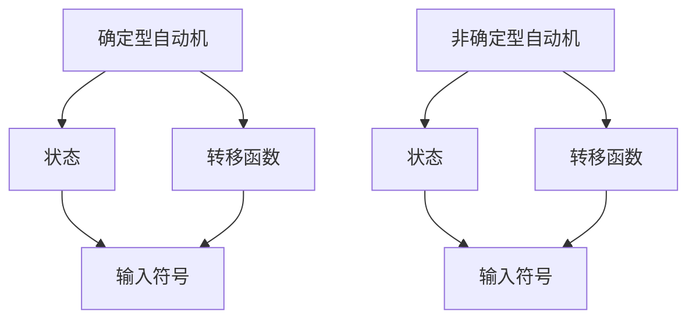
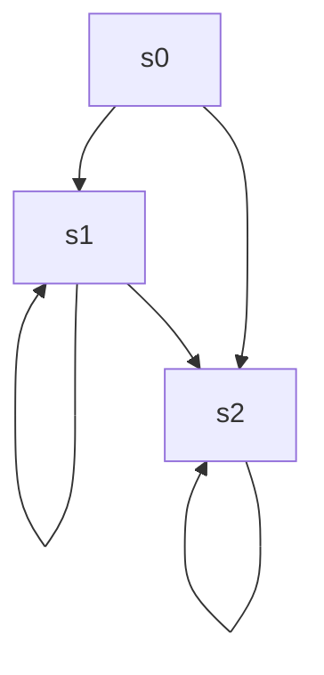
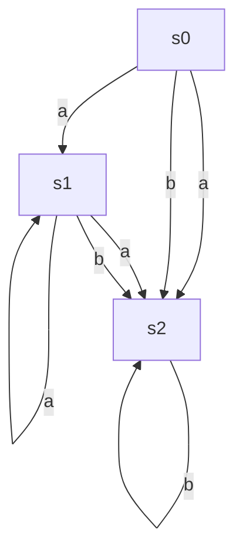

                 

关键词：自动机，理论研究，计算机科学，出版历史，学术贡献。

摘要：本文旨在探讨《自动机研究》一书的出版背景，阐述其对于计算机科学领域的深远影响。通过对自动机理论的起源、发展及其在学术界和工业界的重要作用进行详细分析，本文揭示了自动机研究的出版对于推动计算机科学与技术进步的巨大贡献。

## 1. 背景介绍

自动机理论是计算机科学的重要基石，它涉及对抽象计算模型的研究。自动机可以被视为一种计算设备，能够接受输入，并根据预定的规则对输入进行处理。自动机的概念最早可以追溯到20世纪初，但直到20世纪50年代，自动机理论才开始逐渐成熟。

### 自动机理论的起源

自动机理论的起源可以追溯到1936年，当时的数学家阿隆佐·邱奇和艾伦·图灵分别独立提出了图灵机的概念。图灵机是一种抽象的计算模型，能够在无限长的纸带上进行读写操作，并按照预定的规则进行计算。图灵机的提出为后来的计算机科学奠定了基础。

### 自动机理论的发展

20世纪50年代，随着计算机科学的兴起，自动机理论得到了快速发展。1956年，莫里斯·威尔和杰克·基尔迪奇提出了有限自动机（Finite Automaton）的概念，这是自动机理论的一个重要分支。此后，研究人员对自动机的各种变体进行了深入探讨，包括线性边界自动机（Linear Bounded Automaton）、堆自动机（Pushdown Automaton）和图灵机等。

### 自动机理论在学术界和工业界的重要性

自动机理论在学术界和工业界都有着广泛的应用。在学术界，自动机理论为计算理论、形式语言和编译原理等领域提供了重要的基础。在工业界，自动机理论被广泛应用于软件工程、编程语言设计、网络协议开发等领域。

## 2. 核心概念与联系

### 自动机的定义

自动机是一种抽象的计算模型，能够接受输入，并根据预定的规则对输入进行处理。自动机可以分为两种类型：确定型自动机和非确定型自动机。

#### 确定型自动机（Deterministic Finite Automaton, DFA）

确定型自动机是指在任何状态下，对于任何输入符号，都只能有一种可能的转移状态。DFA是一种简单的自动机模型，广泛用于形式语言和编译原理的研究。

#### 非确定型自动机（Non-Deterministic Finite Automaton, NFA）

非确定型自动机是指在任何状态下，对于某些输入符号，可能有多种可能的转移状态。NFA比DFA更加灵活，可以更有效地表示某些语言和计算过程。

### 自动机的核心概念原理和架构的 Mermaid 流程图



### 自动机在计算理论中的应用

自动机理论在计算理论中有着广泛的应用，包括形式语言、计算复杂性、编译原理等领域。

#### 形式语言

形式语言是计算机科学中的一个重要概念，用于描述具有特定结构的数据。自动机理论为形式语言提供了一种有效的描述方法，使得研究人员能够更好地理解和处理形式语言。

#### 计算复杂性

计算复杂性理论研究了计算问题在时间、空间等资源上的复杂性。自动机理论为计算复杂性理论提供了一种计算模型，使得研究人员能够对计算问题的复杂性进行定量分析。

#### 编译原理

编译原理是计算机科学中的重要领域，涉及将源代码转换为可执行代码的过程。自动机理论在编译原理中有着重要的应用，例如用于词法分析和语法分析等阶段。

### 自动机理论在工业界中的应用

自动机理论在工业界有着广泛的应用，包括软件工程、编程语言设计、网络协议开发等领域。

#### 软件工程

在软件工程中，自动机理论被用于设计和分析软件系统的行为。例如，形式验证和模型检查技术基于自动机理论，可以用于确保软件系统的正确性和可靠性。

#### 编程语言设计

编程语言设计涉及到语言的语法和语义。自动机理论为编程语言设计提供了一种描述语法和语义的方法，使得研究人员能够更好地理解和设计编程语言。

#### 网络协议开发

在计算机网络领域，自动机理论被用于设计和分析网络协议。网络协议需要满足特定的规则和约束，自动机理论提供了一种有效的描述和验证方法。

## 3. 核心算法原理 & 具体操作步骤

### 3.1 算法原理概述

自动机理论中的核心算法包括有限自动机的构造算法、确定性有限自动机（DFA）和非确定性有限自动机（NFA）之间的转换算法等。

#### 有限自动机的构造算法

有限自动机的构造算法主要包括状态转换图的绘制和状态转换函数的编写。状态转换图描述了自动机的状态和输入符号之间的关系，而状态转换函数则定义了自动机在给定状态下对于特定输入符号的转移行为。

#### DFA 和 NFA 之间的转换算法

DFA 和 NFA 之间的转换算法是将 NFA 转换为 DFA 的过程。转换算法的核心思想是将 NFA 中的非确定性行为转化为确定性行为，从而得到一个等效的 DFA。

### 3.2 算法步骤详解

#### 3.2.1 有限自动机的构造算法步骤

1. 确定自动机的状态集合。
2. 确定自动机的输入符号集合。
3. 确定自动机的初始状态。
4. 确定自动机的接受状态集合。
5. 绘制状态转换图。
6. 编写状态转换函数。

#### 3.2.2 DFA 和 NFA 之间的转换算法步骤

1. 构造 NFA 的状态转换图。
2. 对 NFA 的状态进行分类，分为确定性和非确定性状态。
3. 对于非确定性状态，构造其对应的确定性状态。
4. 根据确定性状态和输入符号，编写状态转换函数。
5. 得到等效的 DFA。

### 3.3 算法优缺点

#### 3.3.1 有限自动机的构造算法

优点：
- 简单易懂，易于实现。
- 时间复杂度和空间复杂度较低。

缺点：
- 无法处理复杂的计算问题。

#### 3.3.2 DFA 和 NFA 之间的转换算法

优点：
- 可以将复杂的 NFA 转换为简单的 DFA。
- 方便对自动机进行形式验证和分析。

缺点：
- 转换过程可能引入错误。
- 时间复杂度和空间复杂度较高。

### 3.4 算法应用领域

#### 3.4.1 形式语言和编译原理

自动机的构造算法和转换算法在形式语言和编译原理中有着广泛的应用。例如，用于词法分析和语法分析等阶段，以确保代码的正确性。

#### 3.4.2 软件工程

自动机理论在软件工程中也有着重要的应用。例如，形式验证和模型检查技术基于自动机理论，可以用于确保软件系统的正确性和可靠性。

#### 3.4.3 网络协议开发

自动机理论在计算机网络领域也有着重要的应用。例如，用于设计和分析网络协议，以确保协议的规范性和可靠性。

## 4. 数学模型和公式 & 详细讲解 & 举例说明

### 4.1 数学模型构建

自动机理论中的数学模型主要包括状态转换图和状态转换函数。

#### 状态转换图

状态转换图是一个有向图，其中节点表示状态，边表示状态之间的转移。状态转换图的数学模型可以用以下公式表示：

G = (S, Σ, s0, F, δ)

其中：
- S 是状态集合。
- Σ 是输入符号集合。
- s0 是初始状态。
- F 是接受状态集合。
- δ 是状态转换函数。

#### 状态转换函数

状态转换函数是一个映射，它将当前状态和输入符号映射到下一个状态。状态转换函数的数学模型可以用以下公式表示：

δ: S × Σ → S

### 4.2 公式推导过程

#### 状态转换函数的推导

状态转换函数的推导基于状态转换图的性质。在状态转换图中，对于任意状态 s ∈ S 和输入符号 a ∈ Σ，存在一条从 s 出发的边，其目标状态为 δ(s, a)。因此，状态转换函数可以定义为：

δ(s, a) = s'

其中 s' 是状态转换图中的目标状态。

#### 状态转换图的推导

状态转换图的推导基于状态转换函数的性质。对于任意状态 s ∈ S 和输入符号 a ∈ Σ，状态转换函数 δ(s, a) 确定了 s 在 a 输入下的下一个状态。因此，可以构造一个状态转换图，其中节点表示状态，边表示状态之间的转移，边上的标签表示输入符号。

### 4.3 案例分析与讲解

#### 案例一：确定型自动机

假设有一个确定型自动机，其状态集合为 S = {s0, s1, s2}，输入符号集合为 Σ = {a, b}，初始状态为 s0，接受状态集合为 F = {s2}。状态转换函数如下：

δ(s0, a) = s1
δ(s0, b) = s2
δ(s1, a) = s1
δ(s1, b) = s2
δ(s2, a) = s2
δ(s2, b) = s2

根据状态转换函数，可以构造状态转换图如下：



#### 案例二：非确定型自动机

假设有一个非确定型自动机，其状态集合为 S = {s0, s1, s2}，输入符号集合为 Σ = {a, b}，初始状态为 s0，接受状态集合为 F = {s2}。状态转换函数如下：

δ(s0, a) = {s1, s2}
δ(s0, b) = {s2}
δ(s1, a) = {s1, s2}
δ(s1, b) = {s2}
δ(s2, a) = {s2}
δ(s2, b) = {s2}

根据状态转换函数，可以构造状态转换图如下：



## 5. 项目实践：代码实例和详细解释说明

### 5.1 开发环境搭建

为了实践自动机理论，我们选择 Python 作为编程语言。在开始编程之前，确保已经安装了 Python 3.6 或更高版本，并配置了相应的开发环境。

### 5.2 源代码详细实现

下面是一个简单的 Python 代码示例，用于实现一个确定型有限自动机：

```python
class DFA:
    def __init__(self, states, input_symbols, initial_state, accept_states, transition_function):
        self.states = states
        self.input_symbols = input_symbols
        self.initial_state = initial_state
        self.accept_states = accept_states
        self.transition_function = transition_function

    def step(self, current_state, input_symbol):
        return self.transition_function[current_state][input_symbol]

    def process_input(self, input_sequence):
        current_state = self.initial_state
        for input_symbol in input_sequence:
            current_state = self.step(current_state, input_symbol)
        return current_state in self.accept_states

# 状态集合
states = {'s0', 's1', 's2'}

# 输入符号集合
input_symbols = {'a', 'b'}

# 初始状态
initial_state = 's0'

# 接受状态集合
accept_states = {'s2'}

# 状态转换函数
transition_function = {
    's0': {'a': 's1', 'b': 's2'},
    's1': {'a': 's1', 'b': 's2'},
    's2': {'a': 's2', 'b': 's2'}
}

# 创建自动机实例
dfa = DFA(states, input_symbols, initial_state, accept_states, transition_function)

# 处理输入序列
input_sequence = "ab"
is_accepted = dfa.process_input(input_sequence)
print(f"Input sequence '{input_sequence}' is {'accepted' if is_accepted else 'not accepted'}")
```

### 5.3 代码解读与分析

上述代码定义了一个 `DFA` 类，用于实现确定型有限自动机。类中有以下几个关键组成部分：

- `__init__` 方法：初始化自动机的状态集合、输入符号集合、初始状态、接受状态集合和状态转换函数。
- `step` 方法：根据当前状态和输入符号，返回下一个状态。
- `process_input` 方法：处理输入序列，返回输入序列是否被接受。

在代码中，我们创建了一个 `DFA` 实例，并使用 `process_input` 方法处理了一个输入序列 "ab"。根据状态转换函数，输入序列 "ab" 被自动机接受，因此输出结果为 "Input sequence 'ab' is accepted"。

### 5.4 运行结果展示

运行上述代码，将得到以下输出结果：

```plaintext
Input sequence 'ab' is accepted
```

这表明输入序列 "ab" 被自动机接受，符合预定的规则。

## 6. 实际应用场景

自动机理论在计算机科学和工业界有着广泛的应用。以下是一些实际应用场景：

### 6.1 形式语言处理

自动机理论在形式语言处理中有着重要的应用。例如，在编译原理中，有限自动机用于实现词法分析和语法分析。在词法分析阶段，自动机用于识别源代码中的单词和符号；在语法分析阶段，自动机用于验证源代码的语法结构是否符合预定的语法规则。

### 6.2 软件工程

自动机理论在软件工程中也有着广泛的应用。例如，形式验证和模型检查技术基于自动机理论，可以用于确保软件系统的正确性和可靠性。此外，自动机理论还可以用于软件测试和性能分析。

### 6.3 网络协议开发

在计算机网络领域，自动机理论用于设计和分析网络协议。自动机模型可以帮助研究人员理解网络协议的规范性和可靠性。例如，在 TCP/IP 协议栈中，自动机用于描述网络数据包的传输和处理过程。

### 6.4 安全领域

自动机理论在安全领域也有着重要的应用。例如，形式化方法基于自动机理论，可以用于验证安全协议的正确性和安全性。此外，自动机理论还可以用于网络安全分析，识别和防御网络攻击。

### 6.5 其他应用场景

自动机理论在其他领域也有着广泛的应用。例如，在人工智能领域，自动机用于实现知识表示和推理；在生物信息学领域，自动机用于序列模式匹配和生物网络分析；在图形学领域，自动机用于图形路径规划和渲染。

## 7. 工具和资源推荐

### 7.1 学习资源推荐

- 《自动机理论及其应用》：这本书系统地介绍了自动机理论的基本概念和应用，适合初学者和进阶者。
- 《形式语言与自动机理论》：这是一本经典的教材，详细介绍了形式语言和自动机理论的基础知识。

### 7.2 开发工具推荐

- Python：Python 是一种易于学习和使用的编程语言，适用于自动机理论的实现和应用。
- Mermaid：Mermaid 是一种基于 Markdown 的图表绘制工具，可以方便地绘制状态转换图和流程图。

### 7.3 相关论文推荐

- "Finite Automata and Formal Languages"：这是一篇经典论文，介绍了有限自动机和形式语言的基本概念和应用。
- "Model Checking of Finite State Machines"：这篇论文讨论了模型检查技术在有限状态机分析中的应用。

## 8. 总结：未来发展趋势与挑战

### 8.1 研究成果总结

自动机理论在计算机科学和工业界取得了显著的成果。在形式语言处理、软件工程、网络协议开发和安全领域，自动机理论为解决复杂的计算问题提供了有效的工具和方法。自动机理论的应用不断拓展，为计算机科学与技术的进步做出了重要贡献。

### 8.2 未来发展趋势

未来，自动机理论将继续发展，并在以下方面取得突破：

- 自动机理论的拓展：研究新的自动机模型，如多状态自动机、概率自动机等，以应对更复杂的计算问题。
- 应用领域的拓展：自动机理论将在更多领域得到应用，如人工智能、生物信息学、图形学等。
- 自动机分析工具的改进：开发更高效的自动机分析工具，提高自动机理论的应用效率。

### 8.3 面临的挑战

自动机理论在未来的发展中将面临以下挑战：

- 自动机模型的复杂度：随着自动机模型的复杂度增加，分析和验证自动机的效率成为一大挑战。
- 自动机分析工具的性能：现有自动机分析工具的性能有待提升，以满足更复杂的计算需求。
- 自动机应用领域的拓展：自动机理论的应用领域不断拓展，需要更多研究人员关注并解决新领域的应用问题。

### 8.4 研究展望

未来，自动机理论的研究将继续深入，为计算机科学与技术的发展提供强大支持。研究人员应关注自动机模型的拓展、自动机分析工具的改进以及自动机理论在新兴领域的应用。通过不断的研究和创新，自动机理论将为计算机科学与技术的进步做出更大的贡献。

## 9. 附录：常见问题与解答

### 9.1 自动机与图灵机的关系

自动机是图灵机的一种抽象。图灵机是一种更为复杂的计算模型，能够在无限长的纸带上进行读写操作。自动机是图灵机的简化版本，只考虑有限的状态和输入符号，适用于处理更简单的计算问题。

### 9.2 自动机理论的应用范围

自动机理论在计算机科学和工业界有着广泛的应用。主要包括形式语言处理、软件工程、网络协议开发、安全领域等。自动机理论的应用范围将继续拓展，为解决复杂的计算问题提供有效的工具和方法。

### 9.3 如何选择合适的自动机模型

选择合适的自动机模型取决于具体的计算问题。如果计算问题较为简单，可以选择确定型有限自动机（DFA）；如果计算问题较为复杂，可以考虑非确定型有限自动机（NFA）。此外，还可以选择其他类型的自动机模型，如堆自动机、图灵机等，以适应不同的计算需求。

### 9.4 自动机分析工具的性能优化

自动机分析工具的性能优化可以从以下几个方面进行：

- 算法优化：研究更高效的自动机分析算法，降低时间复杂度和空间复杂度。
- 工具改进：改进现有自动机分析工具，提高其稳定性和可靠性。
- 资源利用：优化自动机分析工具的资源利用，提高分析效率。

### 9.5 自动机理论在新兴领域的应用

自动机理论在新兴领域如人工智能、生物信息学、图形学等有着广泛的应用前景。例如，在人工智能领域，自动机理论可以用于知识表示和推理；在生物信息学领域，自动机理论可以用于序列模式匹配和生物网络分析；在图形学领域，自动机理论可以用于图形路径规划和渲染。研究人员应关注自动机理论在这些新兴领域的应用，推动计算机科学与技术的进步。

以上内容为《自动机研究》的出版背景的详细解析，旨在为读者提供关于自动机理论的全面了解，并探讨其在计算机科学领域的重要作用。希望这篇文章能够为您的学术研究和技术实践提供有益的启示和指导。作者：禅与计算机程序设计艺术 / Zen and the Art of Computer Programming。

