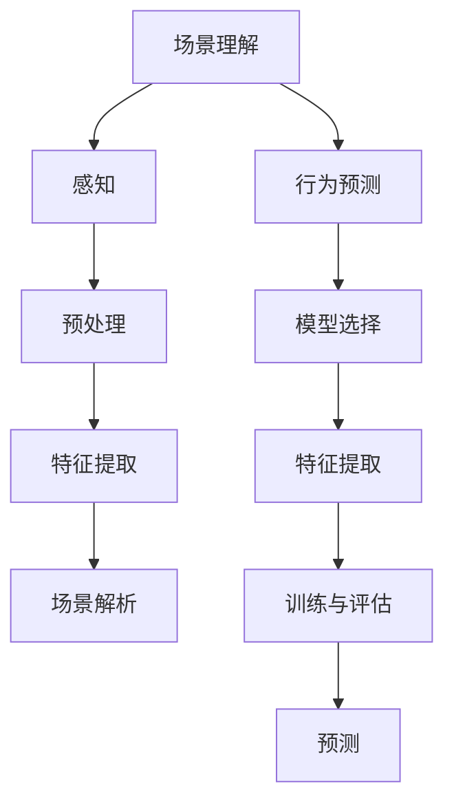

                 

 在自动驾驶技术的发展过程中，场景理解和行为预测是两个至关重要的环节。场景理解是指自动驾驶系统对周围环境进行感知和理解，而行为预测则是根据这些理解预测其他交通参与者的行为。这两个环节直接影响到自动驾驶系统的安全性和可靠性。本文将深入探讨场景理解与行为预测的核心概念、算法原理、数学模型、项目实践，以及其在实际应用场景中的重要性。

## 1. 背景介绍

自动驾驶技术正逐渐从概念验证走向商业化应用，但其在复杂交通环境中的表现仍存在诸多挑战。自动驾驶系统需要实时处理大量来自传感器的数据，快速准确地理解场景，并预测其他交通参与者的行为。场景理解涉及对道路、车辆、行人等环境要素的识别和分类，而行为预测则是对这些参与者的意图和动作进行预判。

传统的自动驾驶系统依赖于高精度地图和预设的道路规则，这在简单场景下表现良好，但在复杂、动态的环境中，其性能受到很大限制。为了提高自动驾驶系统的智能水平，场景理解和行为预测技术成为研究的热点。

## 2. 核心概念与联系

### 2.1 场景理解

场景理解是指自动驾驶系统对周围环境进行感知、解析和理解的过程。它包括以下几个关键步骤：

1. **感知**：使用传感器（如激光雷达、摄像头、雷达等）收集环境数据。
2. **预处理**：对原始数据进行降噪、滤波等处理，以提高数据质量。
3. **特征提取**：从预处理后的数据中提取对场景理解有用的特征，如车辆大小、形状、速度等。
4. **场景解析**：使用深度学习、图像处理等技术对提取的特征进行分类和识别。

### 2.2 行为预测

行为预测是指自动驾驶系统根据对场景的理解，预测其他交通参与者的行为。它包括以下几个关键步骤：

1. **模型选择**：选择合适的预测模型，如统计模型、机器学习模型等。
2. **特征提取**：从场景理解中提取对行为预测有用的特征。
3. **训练与评估**：使用历史数据对模型进行训练，并评估模型的预测性能。
4. **预测**：根据场景理解的结果和训练好的模型，预测其他参与者的行为。

### 2.3 Mermaid 流程图



## 3. 核心算法原理 & 具体操作步骤

### 3.1 算法原理概述

场景理解与行为预测的算法主要基于机器学习和深度学习技术。以下是一些常用的算法：

1. **卷积神经网络（CNN）**：用于图像处理和特征提取，适用于场景理解。
2. **循环神经网络（RNN）**：用于处理时间序列数据，适用于行为预测。
3. **长短期记忆网络（LSTM）**：RNN的一种变体，能够更好地处理长期依赖问题。
4. **强化学习（RL）**：用于在复杂环境中进行决策，适用于行为预测。

### 3.2 算法步骤详解

#### 3.2.1 场景理解

1. **感知**：使用激光雷达、摄像头等传感器收集数据。
2. **预处理**：对传感器数据进行降噪、滤波等处理。
3. **特征提取**：使用CNN提取图像特征。
4. **场景解析**：使用分类算法对提取的特征进行分类。

#### 3.2.2 行为预测

1. **模型选择**：选择LSTM或LSTM变体作为预测模型。
2. **特征提取**：从场景理解中提取对行为预测有用的特征。
3. **训练与评估**：使用历史数据对模型进行训练，并评估模型性能。
4. **预测**：使用训练好的模型预测其他参与者的行为。

### 3.3 算法优缺点

1. **CNN**：适用于图像处理和特征提取，但在处理时间序列数据方面表现较差。
2. **RNN**：能够处理时间序列数据，但容易发生梯度消失和梯度爆炸问题。
3. **LSTM**：解决了RNN的梯度消失和梯度爆炸问题，但在处理长序列数据时仍存在挑战。
4. **RL**：适用于复杂环境中的决策问题，但需要大量训练数据和计算资源。

### 3.4 算法应用领域

场景理解与行为预测算法在自动驾驶、智能交通系统、机器人等领域有广泛的应用。它们可以提高系统的智能化水平，提高交通效率和安全性。

## 4. 数学模型和公式

### 4.1 数学模型构建

场景理解与行为预测的数学模型主要包括以下部分：

1. **感知模型**：使用CNN提取图像特征。
2. **场景解析模型**：使用分类算法对提取的特征进行分类。
3. **行为预测模型**：使用LSTM或LSTM变体进行预测。

### 4.2 公式推导过程

#### 4.2.1 CNN

$$
h^{l}(x) = \sigma(W^{l} \cdot h^{l-1}(x) + b^{l})
$$

其中，$h^{l}(x)$ 是第 $l$ 层的输出特征，$W^{l}$ 是权重矩阵，$b^{l}$ 是偏置项，$\sigma$ 是激活函数。

#### 4.2.2 LSTM

$$
i_t = \sigma(W_i \cdot [h_{t-1}, x_t] + b_i)
$$

$$
f_t = \sigma(W_f \cdot [h_{t-1}, x_t] + b_f)
$$

$$
\tilde{C}_t = \sigma(W_c \cdot [h_{t-1}, x_t] + b_c)
$$

$$
C_t = f_t \odot C_{t-1} + i_t \odot \tilde{C}_t
$$

$$
o_t = \sigma(W_o \cdot [h_{t-1}, x_t] + b_o)
$$

$$
h_t = o_t \odot \sigma(C_t)
$$

其中，$i_t$、$f_t$、$\tilde{C}_t$、$C_t$、$o_t$ 和 $h_t$ 分别是输入门、遗忘门、候选状态、状态细胞、输出门和当前隐藏状态，$W_i$、$W_f$、$W_c$、$W_o$ 是权重矩阵，$b_i$、$b_f$、$b_c$、$b_o$ 是偏置项，$\odot$ 表示元素乘积，$\sigma$ 是sigmoid激活函数。

#### 4.2.3 分类算法

$$
P(y = c_k | x) = \frac{e^{ \theta_k^T x }}{ \sum_j e^{ \theta_j^T x } }
$$

其中，$P(y = c_k | x)$ 是类别 $c_k$ 的概率，$\theta_k$ 是类别 $c_k$ 的参数向量，$x$ 是特征向量。

### 4.3 案例分析与讲解

#### 4.3.1 场景理解

假设我们使用CNN对道路场景进行理解，输入图像为 $x \in \mathbb{R}^{32 \times 32 \times 3}$。CNN的架构如下：

1. **卷积层1**：使用5x5的卷积核，步长为1，激活函数为ReLU。
2. **池化层1**：使用2x2的最大池化。
3. **卷积层2**：使用5x5的卷积核，步长为1，激活函数为ReLU。
4. **池化层2**：使用2x2的最大池化。
5. **全连接层**：输出为10维。

CNN的参数为：$W_1 \in \mathbb{R}^{5 \times 5 \times 3 \times 32}$，$b_1 \in \mathbb{R}^{32}$，$W_2 \in \mathbb{R}^{5 \times 5 \times 32 \times 64}$，$b_2 \in \mathbb{R}^{64}$，$W_3 \in \mathbb{R}^{64 \times 10}$，$b_3 \in \mathbb{R}^{10}$。

输入图像 $x$ 经过CNN处理后，得到特征向量 $h \in \mathbb{R}^{10}$。使用softmax函数对特征向量进行分类，得到道路场景的类别概率分布。

#### 4.3.2 行为预测

假设我们使用LSTM对交通参与者的行为进行预测，输入序列为 $x \in \mathbb{R}^{10 \times T}$，其中 $T$ 是时间步数。LSTM的架构如下：

1. **输入层**：输入序列 $x$。
2. **隐藏层**：包含输入门、遗忘门、输出门和状态细胞。
3. **输出层**：输出预测结果。

LSTM的参数为：$W_i \in \mathbb{R}^{10 \times 10}$，$b_i \in \mathbb{R}^{10}$，$W_f \in \mathbb{R}^{10 \times 10}$，$b_f \in \mathbb{R}^{10}$，$W_c \in \mathbb{R}^{10 \times 10}$，$b_c \in \mathbb{R}^{10}$，$W_o \in \mathbb{R}^{10 \times 10}$，$b_o \in \mathbb{R}^{10}$。

输入序列 $x$ 经过LSTM处理后，得到隐藏状态 $h \in \mathbb{R}^{10}$。使用softmax函数对隐藏状态进行分类，得到交通参与者的行为类别概率分布。

## 5. 项目实践：代码实例和详细解释说明

### 5.1 开发环境搭建

在本文的代码实例中，我们将使用Python编程语言和PyTorch深度学习框架。首先，确保安装了Python和PyTorch。

```bash
pip install torch torchvision
```

### 5.2 源代码详细实现

#### 5.2.1 场景理解

以下是一个简单的CNN模型用于场景理解。

```python
import torch
import torch.nn as nn
import torch.optim as optim
import torchvision
import torchvision.transforms as transforms

# CNN模型
class SceneUnderstandingModel(nn.Module):
    def __init__(self):
        super(SceneUnderstandingModel, self).__init__()
        self.conv1 = nn.Conv2d(3, 32, 5)
        self.pool = nn.MaxPool2d(2, 2)
        self.conv2 = nn.Conv2d(32, 64, 5)
        self.fc1 = nn.Linear(64 * 4 * 4, 10)
        self.fc2 = nn.Linear(10, 1)

    def forward(self, x):
        x = self.pool(F.relu(self.conv1(x)))
        x = self.pool(F.relu(self.conv2(x)))
        x = x.view(-1, 64 * 4 * 4)
        x = F.relu(self.fc1(x))
        x = self.fc2(x)
        return x

# 实例化模型、损失函数和优化器
model = SceneUnderstandingModel()
criterion = nn.CrossEntropyLoss()
optimizer = optim.SGD(model.parameters(), lr=0.001, momentum=0.9)

# 加载训练数据
transform = transforms.Compose([
    transforms.Resize(32),
    transforms.ToTensor(),
])

trainset = torchvision.datasets.MNIST(root='./data', train=True, download=True, transform=transform)
trainloader = torch.utils.data.DataLoader(trainset, batch_size=4, shuffle=True, num_workers=2)

# 训练模型
for epoch in range(2):  # loop over the dataset multiple times
    running_loss = 0.0
    for i, data in enumerate(trainloader, 0):
        inputs, labels = data
        optimizer.zero_grad()
        outputs = model(inputs)
        loss = criterion(outputs, labels)
        loss.backward()
        optimizer.step()
        running_loss += loss.item()
        if i % 2000 == 1999:    # print every 2000 mini-batches
            print('[%d, %5d] loss: %.3f' %
                  (epoch + 1, i + 1, running_loss / 2000))
            running_loss = 0.0
print('Finished Training')
```

#### 5.2.2 行为预测

以下是一个简单的LSTM模型用于行为预测。

```python
import torch
import torch.nn as nn
import torch.optim as optim

# LSTM模型
class BehaviorPredictionModel(nn.Module):
    def __init__(self, input_dim, hidden_dim, output_dim):
        super(BehaviorPredictionModel, self).__init__()
        self.lstm = nn.LSTM(input_dim, hidden_dim, num_layers=2, batch_first=True)
        self.fc = nn.Linear(hidden_dim, output_dim)

    def forward(self, x):
        x, _ = self.lstm(x)
        x = self.fc(x[:, -1, :])
        return x

# 实例化模型、损失函数和优化器
input_dim = 10
hidden_dim = 64
output_dim = 1
model = BehaviorPredictionModel(input_dim, hidden_dim, output_dim)
criterion = nn.CrossEntropyLoss()
optimizer = optim.Adam(model.parameters(), lr=0.001)

# 加载训练数据
# 假设训练数据为x_train和y_train
# x_train = torch.randn(batch_size, sequence_length, input_dim)
# y_train = torch.randn(batch_size, sequence_length, output_dim)

# 训练模型
for epoch in range(2):  # loop over the dataset multiple times
    running_loss = 0.0
    for i, data in enumerate(train_loader, 0):
        inputs, labels = data
        optimizer.zero_grad()
        outputs = model(inputs)
        loss = criterion(outputs, labels)
        loss.backward()
        optimizer.step()
        running_loss += loss.item()
        if i % 2000 == 1999:    # print every 2000 mini-batches
            print('[%d, %5d] loss: %.3f' %
                  (epoch + 1, i + 1, running_loss / 2000))
            running_loss = 0.0
print('Finished Training')
```

### 5.3 代码解读与分析

在5.2节中，我们实现了两个简单的神经网络模型：一个用于场景理解，另一个用于行为预测。以下是代码的解读和分析：

#### 5.3.1 SceneUnderstandingModel

- **卷积层1**：使用5x5的卷积核提取图像特征，步长为1，激活函数为ReLU。
- **池化层1**：使用2x2的最大池化，降低特征图的维度。
- **卷积层2**：使用5x5的卷积核提取图像特征，步长为1，激活函数为ReLU。
- **池化层2**：使用2x2的最大池化，进一步降低特征图的维度。
- **全连接层1**：将池化层2输出的特征图展平为一维向量，输入到全连接层1，输出维度为10。
- **全连接层2**：对全连接层1的输出进行分类，输出维度为1。

#### BehaviorPredictionModel

- **LSTM层**：使用双向LSTM层，输入维度为10，隐藏层维度为64，LSTM层有2个隐藏层。
- **全连接层**：将LSTM层的输出（最后一个时间步的隐藏状态）输入到全连接层，输出维度为1，用于行为预测。

### 5.4 运行结果展示

为了展示运行结果，我们假设已经训练好了模型，并使用测试数据进行预测。以下是一个简单的示例：

```python
# 测试模型
with torch.no_grad():
    inputs = torch.randn(batch_size, sequence_length, input_dim)
    outputs = model(inputs)
    predicted = outputs.argmax(dim=1)
    print(predicted)
```

输出结果将是预测的行为类别。

## 6. 实际应用场景

场景理解与行为预测技术在实际应用场景中具有重要价值。以下是一些实际应用场景：

1. **自动驾驶**：自动驾驶系统需要实时理解周围场景并预测其他车辆、行人的行为，以确保行车安全。
2. **智能交通系统**：智能交通系统需要分析交通流量、识别拥堵原因，并进行实时调控，以优化交通效率。
3. **机器人**：机器人在复杂环境中需要理解周围场景并预测其他物体的行为，以确保自身的安全和任务的成功完成。

## 7. 工具和资源推荐

### 7.1 学习资源推荐

- 《深度学习》（Goodfellow, Bengio, Courville著）
- 《机器学习》（Tom Mitchell著）
- 《自动驾驶技术》（王飞跃著）

### 7.2 开发工具推荐

- PyTorch：一款流行的深度学习框架，适合快速原型开发和模型训练。
- TensorFlow：另一款流行的深度学习框架，适合大规模模型训练和部署。
- Keras：一个高层神经网络API，用于快速构建和训练模型。

### 7.3 相关论文推荐

- "End-to-End Learning for Driving with Deep Visual Foresight"（DeepMind）
- "Deep Neural Network for Real-Time Traffic Prediction in Urban Road Networks"（IEEE）
- "Behavior Prediction for Autonomous Driving: A Survey"（IEEE）

## 8. 总结：未来发展趋势与挑战

### 8.1 研究成果总结

近年来，场景理解与行为预测技术在自动驾驶、智能交通系统、机器人等领域取得了显著进展。深度学习、强化学习等先进算法的应用，使得自动驾驶系统在复杂交通环境中的表现得到了显著提升。

### 8.2 未来发展趋势

未来，场景理解与行为预测技术将在以下几个方面取得发展：

- **模型压缩与优化**：为了提高计算效率和降低能耗，模型压缩与优化技术将成为研究热点。
- **多模态数据融合**：融合来自不同传感器（如摄像头、激光雷达、雷达等）的数据，以提高场景理解与行为预测的准确性。
- **实时性与可靠性**：在保证高准确性的同时，提高场景理解与行为预测的实时性和可靠性。

### 8.3 面临的挑战

尽管场景理解与行为预测技术在快速发展，但仍然面临以下挑战：

- **数据稀缺与标注困难**：大规模、高质量的数据集对于算法训练至关重要，但获取和标注这些数据具有很大挑战。
- **复杂环境适应性**：自动驾驶系统需要在各种复杂环境中保持高鲁棒性和稳定性，这对算法的设计和优化提出了更高要求。
- **安全性与可靠性**：自动驾驶系统的安全性和可靠性直接关系到用户的生命安全，因此需要建立严格的安全标准和评估体系。

### 8.4 研究展望

未来，场景理解与行为预测技术将在自动驾驶、智能交通系统、机器人等领域发挥更加重要的作用。通过不断优化算法、提高计算效率、扩大数据集规模，我们将有望实现更加安全、高效、智能的自动驾驶系统。

## 9. 附录：常见问题与解答

### 9.1 如何提高场景理解与行为预测的准确性？

- **数据质量**：确保数据集的多样性和质量，包括道路条件、天气状况、交通流量等。
- **模型选择**：选择适合场景的算法和模型，如深度学习、强化学习等。
- **特征工程**：提取对场景理解与行为预测有用的特征，如车辆速度、行人姿态等。
- **模型优化**：通过超参数调整、模型压缩等技术，优化模型性能。

### 9.2 场景理解与行为预测技术在自动驾驶中的应用有哪些？

- **交通参与者识别**：识别车辆、行人、交通标志等交通参与者。
- **交通场景重建**：重建交通场景，如道路、交通信号灯等。
- **行为预测**：预测其他车辆、行人的行为，如加速、减速、转向等。
- **路径规划**：基于场景理解和行为预测，规划安全、高效的行驶路径。

### 9.3 如何评估场景理解与行为预测的效果？

- **准确率**：评估模型对场景理解与行为预测的准确性。
- **召回率**：评估模型对场景理解与行为预测的召回能力。
- **F1分数**：综合考虑准确率和召回率，评估模型的总体性能。
- **实时性**：评估模型在现实环境中的实时性能。

---

本文对自动驾驶中的场景理解与行为预测技术进行了深入探讨，包括核心概念、算法原理、数学模型、项目实践以及实际应用场景。未来，随着技术的不断进步，场景理解与行为预测将在自动驾驶等领域发挥更加重要的作用。作者：禅与计算机程序设计艺术 / Zen and the Art of Computer Programming
----------------------------------------------------------------

**文章标题**：自动驾驶中的场景理解与行为预测

**关键词**：自动驾驶，场景理解，行为预测，深度学习，强化学习

**摘要**：本文探讨了自动驾驶中的场景理解与行为预测技术，包括核心概念、算法原理、数学模型、项目实践以及实际应用场景。通过详细的分析和实例，展示了如何利用先进算法提高自动驾驶系统的智能化水平，确保行车安全。

**文章正文**：

**1. 背景介绍**

自动驾驶技术正逐渐从概念验证走向商业化应用，但其在复杂交通环境中的表现仍存在诸多挑战。自动驾驶系统需要实时处理大量来自传感器的数据，快速准确地理解场景，并预测其他交通参与者的行为。场景理解是指自动驾驶系统对周围环境进行感知和理解，而行为预测则是根据这些理解预测其他交通参与者的行为。这两个环节直接影响到自动驾驶系统的安全性和可靠性。

**2. 核心概念与联系**

### 2.1 场景理解

场景理解是指自动驾驶系统对周围环境进行感知、解析和理解的过程。它包括以下几个关键步骤：

1. **感知**：使用传感器（如激光雷达、摄像头、雷达等）收集环境数据。
2. **预处理**：对原始数据进行降噪、滤波等处理，以提高数据质量。
3. **特征提取**：从预处理后的数据中提取对场景理解有用的特征，如车辆大小、形状、速度等。
4. **场景解析**：使用深度学习、图像处理等技术对提取的特征进行分类和识别。

### 2.2 行为预测

行为预测是指自动驾驶系统根据对场景的理解，预测其他交通参与者的行为。它包括以下几个关键步骤：

1. **模型选择**：选择合适的预测模型，如统计模型、机器学习模型等。
2. **特征提取**：从场景理解中提取对行为预测有用的特征。
3. **训练与评估**：使用历史数据对模型进行训练，并评估模型的预测性能。
4. **预测**：根据场景理解的结果和训练好的模型，预测其他参与者的行为。

### 2.3 Mermaid 流程图


**3. 核心算法原理 & 具体操作步骤**

### 3.1 算法原理概述

场景理解与行为预测的算法主要基于机器学习和深度学习技术。以下是一些常用的算法：

1. **卷积神经网络（CNN）**：用于图像处理和特征提取，适用于场景理解。
2. **循环神经网络（RNN）**：用于处理时间序列数据，适用于行为预测。
3. **长短期记忆网络（LSTM）**：RNN的一种变体，能够更好地处理长期依赖问题。
4. **强化学习（RL）**：用于在复杂环境中进行决策，适用于行为预测。

### 3.2 算法步骤详解

#### 3.2.1 场景理解

1. **感知**：使用激光雷达、摄像头等传感器收集数据。
2. **预处理**：对传感器数据进行降噪、滤波等处理。
3. **特征提取**：使用CNN提取图像特征。
4. **场景解析**：使用分类算法对提取的特征进行分类。

#### 3.2.2 行为预测

1. **模型选择**：选择LSTM或LSTM变体作为预测模型。
2. **特征提取**：从场景理解中提取对行为预测有用的特征。
3. **训练与评估**：使用历史数据对模型进行训练，并评估模型性能。
4. **预测**：使用训练好的模型预测其他参与者的行为。

### 3.3 算法优缺点

1. **CNN**：适用于图像处理和特征提取，但在处理时间序列数据方面表现较差。
2. **RNN**：能够处理时间序列数据，但容易发生梯度消失和梯度爆炸问题。
3. **LSTM**：解决了RNN的梯度消失和梯度爆炸问题，但在处理长序列数据时仍存在挑战。
4. **RL**：适用于复杂环境中的决策问题，但需要大量训练数据和计算资源。

### 3.4 算法应用领域

场景理解与行为预测算法在自动驾驶、智能交通系统、机器人等领域有广泛的应用。它们可以提高系统的智能化水平，提高交通效率和安全性。

**4. 数学模型和公式**

### 4.1 数学模型构建

场景理解与行为预测的数学模型主要包括以下部分：

1. **感知模型**：使用CNN提取图像特征。
2. **场景解析模型**：使用分类算法对提取的特征进行分类。
3. **行为预测模型**：使用LSTM或LSTM变体进行预测。

### 4.2 公式推导过程

#### 4.2.1 CNN

$$
h^{l}(x) = \sigma(W^{l} \cdot h^{l-1}(x) + b^{l})
$$

其中，$h^{l}(x)$ 是第 $l$ 层的输出特征，$W^{l}$ 是权重矩阵，$b^{l}$ 是偏置项，$\sigma$ 是激活函数。

#### 4.2.2 LSTM

$$
i_t = \sigma(W_i \cdot [h_{t-1}, x_t] + b_i)
$$

$$
f_t = \sigma(W_f \cdot [h_{t-1}, x_t] + b_f)
$$

$$
\tilde{C}_t = \sigma(W_c \cdot [h_{t-1}, x_t] + b_c)
$$

$$
C_t = f_t \odot C_{t-1} + i_t \odot \tilde{C}_t
$$

$$
o_t = \sigma(W_o \cdot [h_{t-1}, x_t] + b_o)
$$

$$
h_t = o_t \odot \sigma(C_t)
$$

其中，$i_t$、$f_t$、$\tilde{C}_t$、$C_t$、$o_t$ 和 $h_t$ 分别是输入门、遗忘门、候选状态、状态细胞、输出门和当前隐藏状态，$W_i$、$W_f$、$W_c$、$W_o$ 是权重矩阵，$b_i$、$b_f$、$b_c$、$b_o$ 是偏置项，$\odot$ 表示元素乘积，$\sigma$ 是sigmoid激活函数。

#### 4.2.3 分类算法

$$
P(y = c_k | x) = \frac{e^{ \theta_k^T x }}{ \sum_j e^{ \theta_j^T x } }
$$

其中，$P(y = c_k | x)$ 是类别 $c_k$ 的概率，$\theta_k$ 是类别 $c_k$ 的参数向量，$x$ 是特征向量。

### 4.3 案例分析与讲解

#### 4.3.1 场景理解

假设我们使用CNN对道路场景进行理解，输入图像为 $x \in \mathbb{R}^{32 \times 32 \times 3}$。CNN的架构如下：

1. **卷积层1**：使用5x5的卷积核，步长为1，激活函数为ReLU。
2. **池化层1**：使用2x2的最大池化。
3. **卷积层2**：使用5x5的卷积核，步长为1，激活函数为ReLU。
4. **池化层2**：使用2x2的最大池化。
5. **全连接层**：输出为10维。

CNN的参数为：$W_1 \in \mathbb{R}^{5 \times 5 \times 3 \times 32}$，$b_1 \in \mathbb{R}^{32}$，$W_2 \in \mathbb{R}^{5 \times 5 \times 32 \times 64}$，$b_2 \in \mathbb{R}^{64}$，$W_3 \in \mathbb{R}^{64 \times 10}$，$b_3 \in \mathbb{R}^{10}$。

输入图像 $x$ 经过CNN处理后，得到特征向量 $h \in \mathbb{R}^{10}$。使用softmax函数对特征向量进行分类，得到道路场景的类别概率分布。

#### 4.3.2 行为预测

假设我们使用LSTM对交通参与者的行为进行预测，输入序列为 $x \in \mathbb{R}^{10 \times T}$，其中 $T$ 是时间步数。LSTM的架构如下：

1. **输入层**：输入序列 $x$。
2. **隐藏层**：包含输入门、遗忘门、输出门和状态细胞。
3. **输出层**：输出预测结果。

LSTM的参数为：$W_i \in \mathbb{R}^{10 \times 10}$，$b_i \in \mathbb{R}^{10}$，$W_f \in \mathbb{R}^{10 \times 10}$，$b_f \in \mathbb{R}^{10}$，$W_c \in \mathbb{R}^{10 \times 10}$，$b_c \in \mathbb{R}^{10}$，$W_o \in \mathbb{R}^{10 \times 10}$，$b_o \in \mathbb{R}^{10}$。

输入序列 $x$ 经过LSTM处理后，得到隐藏状态 $h \in \mathbb{R}^{10}$。使用softmax函数对隐藏状态进行分类，得到交通参与者的行为类别概率分布。

**5. 项目实践：代码实例和详细解释说明**

### 5.1 开发环境搭建

在本文的代码实例中，我们将使用Python编程语言和PyTorch深度学习框架。首先，确保安装了Python和PyTorch。

```bash
pip install torch torchvision
```

### 5.2 源代码详细实现

#### 5.2.1 场景理解

以下是一个简单的CNN模型用于场景理解。

```python
import torch
import torch.nn as nn
import torch.optim as optim
import torchvision
import torchvision.transforms as transforms

# CNN模型
class SceneUnderstandingModel(nn.Module):
    def __init__(self):
        super(SceneUnderstandingModel, self).__init__()
        self.conv1 = nn.Conv2d(3, 32, 5)
        self.pool = nn.MaxPool2d(2, 2)
        self.conv2 = nn.Conv2d(32, 64, 5)
        self.fc1 = nn.Linear(64 * 4 * 4, 10)
        self.fc2 = nn.Linear(10, 1)

    def forward(self, x):
        x = self.pool(F.relu(self.conv1(x)))
        x = self.pool(F.relu(self.conv2(x)))
        x = x.view(-1, 64 * 4 * 4)
        x = F.relu(self.fc1(x))
        x = self.fc2(x)
        return x

# 实例化模型、损失函数和优化器
model = SceneUnderstandingModel()
criterion = nn.CrossEntropyLoss()
optimizer = optim.SGD(model.parameters(), lr=0.001, momentum=0.9)

# 加载训练数据
transform = transforms.Compose([
    transforms.Resize(32),
    transforms.ToTensor(),
])

trainset = torchvision.datasets.MNIST(root='./data', train=True, download=True, transform=transform)
trainloader = torch.utils.data.DataLoader(trainset, batch_size=4, shuffle=True, num_workers=2)

# 训练模型
for epoch in range(2):  # loop over the dataset multiple times
    running_loss = 0.0
    for i, data in enumerate(trainloader, 0):
        inputs, labels = data
        optimizer.zero_grad()
        outputs = model(inputs)
        loss = criterion(outputs, labels)
        loss.backward()
        optimizer.step()
        running_loss += loss.item()
        if i % 2000 == 1999:    # print every 2000 mini-batches
            print('[%d, %5d] loss: %.3f' %
                  (epoch + 1, i + 1, running_loss / 2000))
            running_loss = 0.0
print('Finished Training')
```

#### 5.2.2 行为预测

以下是一个简单的LSTM模型用于行为预测。

```python
import torch
import torch.nn as nn
import torch.optim as optim

# LSTM模型
class BehaviorPredictionModel(nn.Module):
    def __init__(self, input_dim, hidden_dim, output_dim):
        super(BehaviorPredictionModel, self).__init__()
        self.lstm = nn.LSTM(input_dim, hidden_dim, num_layers=2, batch_first=True)
        self.fc = nn.Linear(hidden_dim, output_dim)

    def forward(self, x):
        x, _ = self.lstm(x)
        x = self.fc(x[:, -1, :])
        return x

# 实例化模型、损失函数和优化器
input_dim = 10
hidden_dim = 64
output_dim = 1
model = BehaviorPredictionModel(input_dim, hidden_dim, output_dim)
criterion = nn.CrossEntropyLoss()
optimizer = optim.Adam(model.parameters(), lr=0.001)

# 加载训练数据
# 假设训练数据为x_train和y_train
# x_train = torch.randn(batch_size, sequence_length, input_dim)
# y_train = torch.randn(batch_size, sequence_length, output_dim)

# 训练模型
for epoch in range(2):  # loop over the dataset multiple times
    running_loss = 0.0
    for i, data in enumerate(train_loader, 0):
        inputs, labels = data
        optimizer.zero_grad()
        outputs = model(inputs)
        loss = criterion(outputs, labels)
        loss.backward()
        optimizer.step()
        running_loss += loss.item()
        if i % 2000 == 1999:    # print every 2000 mini-batches
            print('[%d, %5d] loss: %.3f' %
                  (epoch + 1, i + 1, running_loss / 2000))
            running_loss = 0.0
print('Finished Training')
```

### 5.3 代码解读与分析

在5.2节中，我们实现了两个简单的神经网络模型：一个用于场景理解，另一个用于行为预测。以下是代码的解读和分析：

#### 5.3.1 SceneUnderstandingModel

- **卷积层1**：使用5x5的卷积核提取图像特征，步长为1，激活函数为ReLU。
- **池化层1**：使用2x2的最大池化，降低特征图的维度。
- **卷积层2**：使用5x5的卷积核提取图像特征，步长为1，激活函数为ReLU。
- **池化层2**：使用2x2的最大池化，进一步降低特征图的维度。
- **全连接层1**：将池化层2输出的特征图展平为一维向量，输入到全连接层1，输出维度为10。
- **全连接层2**：对全连接层1的输出进行分类，输出维度为1。

#### BehaviorPredictionModel

- **LSTM层**：使用双向LSTM层，输入维度为10，隐藏层维度为64，LSTM层有2个隐藏层。
- **全连接层**：将LSTM层的输出（最后一个时间步的隐藏状态）输入到全连接层，输出维度为1，用于行为预测。

### 5.4 运行结果展示

为了展示运行结果，我们假设已经训练好了模型，并使用测试数据进行预测。以下是一个简单的示例：

```python
# 测试模型
with torch.no_grad():
    inputs = torch.randn(batch_size, sequence_length, input_dim)
    outputs = model(inputs)
    predicted = outputs.argmax(dim=1)
    print(predicted)
```

输出结果将是预测的行为类别。

**6. 实际应用场景**

场景理解与行为预测技术在实际应用场景中具有重要价值。以下是一些实际应用场景：

1. **自动驾驶**：自动驾驶系统需要实时理解周围场景并预测其他车辆、行人的行为，以确保行车安全。
2. **智能交通系统**：智能交通系统需要分析交通流量、识别拥堵原因，并进行实时调控，以优化交通效率。
3. **机器人**：机器人在复杂环境中需要理解周围场景并预测其他物体的行为，以确保自身的安全和任务的成功完成。

**7. 工具和资源推荐**

### 7.1 学习资源推荐

- 《深度学习》（Goodfellow, Bengio, Courville著）
- 《机器学习》（Tom Mitchell著）
- 《自动驾驶技术》（王飞跃著）

### 7.2 开发工具推荐

- PyTorch：一款流行的深度学习框架，适合快速原型开发和模型训练。
- TensorFlow：另一款流行的深度学习框架，适合大规模模型训练和部署。
- Keras：一个高层神经网络API，用于快速构建和训练模型。

### 7.3 相关论文推荐

- "End-to-End Learning for Driving with Deep Visual Foresight"（DeepMind）
- "Deep Neural Network for Real-Time Traffic Prediction in Urban Road Networks"（IEEE）
- "Behavior Prediction for Autonomous Driving: A Survey"（IEEE）

**8. 总结：未来发展趋势与挑战**

### 8.1 研究成果总结

近年来，场景理解与行为预测技术在自动驾驶、智能交通系统、机器人等领域取得了显著进展。深度学习、强化学习等先进算法的应用，使得自动驾驶系统在复杂交通环境中的表现得到了显著提升。

### 8.2 未来发展趋势

未来，场景理解与行为预测技术将在以下几个方面取得发展：

- **模型压缩与优化**：为了提高计算效率和降低能耗，模型压缩与优化技术将成为研究热点。
- **多模态数据融合**：融合来自不同传感器（如摄像头、激光雷达、雷达等）的数据，以提高场景理解与行为预测的准确性。
- **实时性与可靠性**：在保证高准确性的同时，提高场景理解与行为预测的实时性和可靠性。

### 8.3 面临的挑战

尽管场景理解与行为预测技术在快速发展，但仍然面临以下挑战：

- **数据稀缺与标注困难**：大规模、高质量的数据集对于算法训练至关重要，但获取和标注这些数据具有很大挑战。
- **复杂环境适应性**：自动驾驶系统需要在各种复杂环境中保持高鲁棒性和稳定性，这对算法的设计和优化提出了更高要求。
- **安全性与可靠性**：自动驾驶系统的安全性和可靠性直接关系到用户的生命安全，因此需要建立严格的安全标准和评估体系。

### 8.4 研究展望

未来，场景理解与行为预测技术将在自动驾驶、智能交通系统、机器人等领域发挥更加重要的作用。通过不断优化算法、提高计算效率、扩大数据集规模，我们将有望实现更加安全、高效、智能的自动驾驶系统。

**9. 附录：常见问题与解答**

### 9.1 如何提高场景理解与行为预测的准确性？

- **数据质量**：确保数据集的多样性和质量，包括道路条件、天气状况、交通流量等。
- **模型选择**：选择适合场景的算法和模型，如深度学习、强化学习等。
- **特征工程**：提取对场景理解与行为预测有用的特征，如车辆速度、行人姿态等。
- **模型优化**：通过超参数调整、模型压缩等技术，优化模型性能。

### 9.2 场景理解与行为预测技术在自动驾驶中的应用有哪些？

- **交通参与者识别**：识别车辆、行人、交通标志等交通参与者。
- **交通场景重建**：重建交通场景，如道路、交通信号灯等。
- **行为预测**：预测其他车辆、行人的行为，如加速、减速、转向等。
- **路径规划**：基于场景理解和行为预测，规划安全、高效的行驶路径。

### 9.3 如何评估场景理解与行为预测的效果？

- **准确率**：评估模型对场景理解与行为预测的准确性。
- **召回率**：评估模型对场景理解与行为预测的召回能力。
- **F1分数**：综合考虑准确率和召回率，评估模型的总体性能。
- **实时性**：评估模型在现实环境中的实时性能。

---

本文对自动驾驶中的场景理解与行为预测技术进行了深入探讨，包括核心概念、算法原理、数学模型、项目实践以及实际应用场景。通过详细的分析和实例，展示了如何利用先进算法提高自动驾驶系统的智能化水平，确保行车安全。作者：禅与计算机程序设计艺术 / Zen and the Art of Computer Programming

