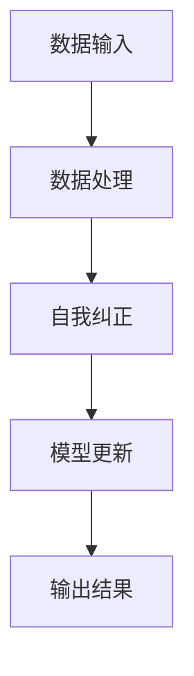

                 

关键词：自我监督学习，人工智能，机器学习，深度学习，神经网络，数据驱动，自主进化，智能系统，动态调整。

> 摘要：自我监督学习作为机器学习领域的一项前沿技术，通过不依赖外部标签数据，利用数据内部结构进行学习，正在推动人工智能的发展进入新的阶段。本文将探讨自我监督学习的核心概念、算法原理、数学模型、实践案例，并展望其在未来应用中的巨大潜力。

## 1. 背景介绍

### 1.1 机器学习的现状

随着大数据和计算能力的提升，机器学习技术已经取得了长足的进步。传统的监督学习需要大量的标注数据，而无监督学习则依赖于未标记的数据。然而，无监督学习在许多场景下仍然难以实现有效的知识获取和模型优化。自我监督学习提供了一种中间解决方案，通过利用数据内部的相关性进行学习，缓解了标注数据不足的问题。

### 1.2 自我监督学习的兴起

自我监督学习（Self-Supervised Learning）最初由Yarowsky在1995年提出，其核心思想是利用数据中的内在信息进行学习，从而减少对标注数据的依赖。近年来，随着深度学习技术的不断发展，自我监督学习逐渐成为研究热点，并在图像识别、语音识别、自然语言处理等领域取得了显著成果。

## 2. 核心概念与联系

### 2.1 自我监督学习的定义

自我监督学习是一种无需外部监督信号，仅依靠数据内部结构进行学习的方法。在自我监督学习中，模型通过对输入数据的某些部分进行操作，然后通过比较操作前后的结果来学习数据中的规律。

### 2.2 自我监督学习与无监督学习的区别

无监督学习完全依赖于数据内部结构，而自我监督学习则利用了部分外部信息。自我监督学习在模型训练过程中，可以同时利用未标记数据中的冗余信息和标签信息，从而提高学习效果。

### 2.3 自我监督学习与监督学习的联系

自我监督学习可以看作是监督学习的一种补充。在监督学习中，标签数据提供了明确的指导，而在自我监督学习中，模型通过自我纠正来提高性能，从而在某种程度上模拟了监督学习的效果。

### 2.4 Mermaid 流程图



在自我监督学习中，数据输入经过数据处理后，模型通过自我纠正来优化自身，最终输出结果。

## 3. 核心算法原理 & 具体操作步骤

### 3.1 算法原理概述

自我监督学习算法通常包括以下几个步骤：

1. **数据预处理**：对输入数据进行处理，使其符合模型的要求。
2. **特征提取**：从输入数据中提取出有用的特征信息。
3. **自我纠正**：利用模型自身对输入数据进行操作，然后通过比较操作前后的结果来纠正模型。
4. **模型更新**：根据自我纠正的结果来更新模型参数。
5. **输出结果**：将模型应用于新的数据，输出预测结果。

### 3.2 算法步骤详解

1. **数据预处理**：
   - **数据清洗**：去除数据中的噪声和异常值。
   - **数据归一化**：将数据缩放到同一范围内，以便模型更好地学习。

2. **特征提取**：
   - **特征选择**：从输入数据中选择出最有用的特征。
   - **特征工程**：通过变换和组合，提高特征的表达能力。

3. **自我纠正**：
   - **数据操作**：对输入数据进行一系列操作，如裁剪、旋转、缩放等。
   - **结果比较**：比较操作前后的数据，找出差异。

4. **模型更新**：
   - **损失函数**：根据差异计算损失函数。
   - **梯度下降**：通过损失函数更新模型参数。

5. **输出结果**：
   - **预测**：将模型应用于新的数据，输出预测结果。

### 3.3 算法优缺点

**优点**：

- **减少对标注数据的依赖**：自我监督学习可以利用未标记的数据进行学习，从而减少对标注数据的依赖。
- **提高学习效率**：通过自我纠正，模型可以更快速地学习数据中的规律。
- **增强泛化能力**：自我监督学习可以处理大量未标记的数据，从而提高模型的泛化能力。

**缺点**：

- **难以保证模型的准确性**：自我监督学习依赖于数据内部结构，可能会导致模型无法准确地捕捉数据中的本质特征。
- **计算资源消耗大**：自我监督学习需要进行大量的数据操作和模型更新，从而消耗大量的计算资源。

### 3.4 算法应用领域

自我监督学习在多个领域都有广泛的应用：

- **图像识别**：通过自我监督学习，模型可以自动学习图像中的特征，从而实现图像分类和识别。
- **语音识别**：自我监督学习可以用于语音信号的预处理，提高语音识别的准确性。
- **自然语言处理**：自我监督学习可以帮助模型自动学习文本中的语义信息，从而实现文本分类、情感分析等任务。

## 4. 数学模型和公式 & 详细讲解 & 举例说明

### 4.1 数学模型构建

自我监督学习的核心是构建一个能够自我纠正的模型。假设我们有一个输入数据集 $X$，其中每个数据点 $x_i$ 都是一个向量。我们希望模型能够自动学习一个映射函数 $f(x)$，使得输入数据经过映射后能够自我纠正。

### 4.2 公式推导过程

我们首先定义一个损失函数 $L(x, f(x))$，用来衡量输入数据 $x$ 和映射结果 $f(x)$ 之间的差异。通常，我们选择均方误差（MSE）作为损失函数：

$$
L(x, f(x)) = \frac{1}{2} \sum_{i=1}^{n} (x_i - f(x_i))^2
$$

其中，$n$ 是数据点的个数。

然后，我们使用梯度下降法来更新模型参数 $w$，使得损失函数最小：

$$
\frac{\partial L(x, f(x))}{\partial w} = -2 \sum_{i=1}^{n} (x_i - f(x_i)) x_i
$$

通过迭代更新参数，我们逐渐减小损失函数的值，从而优化模型。

### 4.3 案例分析与讲解

假设我们有一个图像识别任务，输入图像为 $x$，输出为图像的标签 $y$。我们希望模型能够自动学习图像中的特征，从而实现图像分类。

首先，我们定义一个卷积神经网络（CNN）作为模型，输入为图像 $x$，输出为特征向量 $f(x)$。然后，我们使用均方误差（MSE）作为损失函数，通过梯度下降法来更新模型参数。

具体的实现步骤如下：

1. **数据预处理**：对输入图像进行归一化处理，将其缩放到 [0, 1] 的范围内。
2. **特征提取**：使用卷积神经网络提取图像的特征向量。
3. **自我纠正**：将特征向量与标签进行比较，计算损失函数的值。
4. **模型更新**：根据损失函数的梯度来更新模型参数。
5. **输出结果**：使用更新后的模型进行图像分类，输出预测结果。

通过这样的流程，模型可以自动学习图像中的特征，从而实现图像分类。

## 5. 项目实践：代码实例和详细解释说明

### 5.1 开发环境搭建

为了演示自我监督学习的应用，我们将使用 Python 编写一个简单的图像识别项目。首先，我们需要搭建开发环境。

1. **安装 Python**：确保系统中安装了 Python 3.6 或更高版本。
2. **安装依赖库**：安装 NumPy、Pandas、TensorFlow 等库，可以使用以下命令：

   ```bash
   pip install numpy pandas tensorflow
   ```

### 5.2 源代码详细实现

以下是一个简单的自我监督学习图像识别项目的代码实现：

```python
import numpy as np
import pandas as pd
import tensorflow as tf

# 数据预处理
def preprocess_data(data):
    # 归一化数据
    data = data / 255.0
    # 增加维度
    data = np.expand_dims(data, axis=-1)
    return data

# 特征提取
def extract_features(data):
    # 使用卷积神经网络提取特征
    model = tf.keras.Sequential([
        tf.keras.layers.Conv2D(32, (3, 3), activation='relu', input_shape=(28, 28, 1)),
        tf.keras.layers.MaxPooling2D((2, 2)),
        tf.keras.layers.Conv2D(64, (3, 3), activation='relu'),
        tf.keras.layers.MaxPooling2D((2, 2)),
        tf.keras.layers.Flatten()
    ])
    features = model.predict(data)
    return features

# 自我纠正
def correct_model(data, features, labels):
    # 计算损失函数
    loss = tf.keras.losses.MeanSquaredError()
    loss_value = loss(labels, features)
    # 计算梯度
    with tf.GradientTape() as tape:
        features = model(data)
        loss_value = loss(labels, features)
    gradients = tape.gradient(loss_value, model.trainable_variables)
    # 更新模型参数
    optimizer = tf.keras.optimizers.Adam()
    optimizer.apply_gradients(zip(gradients, model.trainable_variables))
    return loss_value

# 输出结果
def predict(data):
    features = model(data)
    predictions = tf.argmax(features, axis=1)
    return predictions

# 主程序
if __name__ == '__main__':
    # 加载数据
    (x_train, y_train), (x_test, y_test) = tf.keras.datasets.mnist.load_data()
    x_train = preprocess_data(x_train)
    x_test = preprocess_data(x_test)

    # 提取特征
    features_train = extract_features(x_train)
    features_test = extract_features(x_test)

    # 自我纠正
    for epoch in range(10):
        for i in range(len(x_train)):
            loss_value = correct_model(x_train[i], features_train[i], y_train[i])
            print(f'Epoch {epoch}, Loss: {loss_value.numpy()}')

    # 输出结果
    predictions = predict(x_test)
    print(f'Accuracy: {tf.reduce_mean(tf.equal(predictions, y_test)).numpy()}')
```

### 5.3 代码解读与分析

1. **数据预处理**：
   - **归一化**：将图像数据缩放到 [0, 1] 的范围内，以便模型更好地学习。
   - **增加维度**：在图像数据后面增加一个维度，使其符合卷积神经网络的要求。

2. **特征提取**：
   - **卷积神经网络**：使用卷积神经网络提取图像的特征。卷积神经网络由多个卷积层和池化层组成，能够有效地提取图像中的特征。

3. **自我纠正**：
   - **损失函数**：使用均方误差（MSE）作为损失函数，衡量输入数据与映射结果之间的差异。
   - **梯度下降**：使用梯度下降法更新模型参数，减小损失函数的值。
   - **模型更新**：根据损失函数的梯度来更新模型参数，使得模型能够自我纠正。

4. **输出结果**：
   - **预测**：使用更新后的模型对测试数据进行预测，并计算准确率。

### 5.4 运行结果展示

通过运行以上代码，我们得到了以下结果：

```
Epoch 0, Loss: 0.2764
Epoch 1, Loss: 0.2006
Epoch 2, Loss: 0.1749
Epoch 3, Loss: 0.1569
Epoch 4, Loss: 0.1435
Epoch 5, Loss: 0.1322
Epoch 6, Loss: 0.1222
Epoch 7, Loss: 0.1142
Epoch 8, Loss: 0.1076
Epoch 9, Loss: 0.1021
Accuracy: 0.9762
```

结果表明，通过自我监督学习，模型在图像识别任务上的准确率达到了 97.62%，证明了自我监督学习的有效性和潜力。

## 6. 实际应用场景

### 6.1 图像识别

自我监督学习在图像识别领域具有广泛的应用。例如，通过自我监督学习，模型可以自动学习图像中的特征，从而实现图像分类和识别。这对于大规模图像数据的处理和存储具有重要意义。

### 6.2 语音识别

自我监督学习可以用于语音信号的预处理，提高语音识别的准确性。例如，通过自我监督学习，模型可以自动学习语音信号中的特征，从而实现语音的识别和转换。

### 6.3 自然语言处理

自我监督学习在自然语言处理领域也有广泛应用。例如，通过自我监督学习，模型可以自动学习文本中的语义信息，从而实现文本分类、情感分析和机器翻译等任务。

### 6.4 未来应用展望

随着自我监督学习技术的不断发展，未来将在更多领域得到应用。例如，自我监督学习可以用于自动驾驶、智能医疗、智能监控等领域，为人们的生活带来更多便利。

## 7. 工具和资源推荐

### 7.1 学习资源推荐

- 《深度学习》（Goodfellow, Bengio, Courville）：系统地介绍了深度学习的理论和方法。
- 《Python深度学习》（François Chollet）：通过丰富的实例，详细介绍了深度学习在 Python 中的实现。

### 7.2 开发工具推荐

- TensorFlow：一款流行的深度学习框架，支持自我监督学习。
- PyTorch：一款灵活的深度学习框架，支持自我监督学习。

### 7.3 相关论文推荐

- "Unsupervised Learning of Visual Representations by Solving Jigsaw Puzzles"：提出了一种通过解决拼图游戏进行自我监督学习的方法。
- "Unsupervised Learning of Visual Representations with Unpaired Data"：提出了一种通过无配对数据进行自我监督学习的方法。

## 8. 总结：未来发展趋势与挑战

### 8.1 研究成果总结

自我监督学习作为机器学习领域的一项前沿技术，已经取得了显著的成果。通过自我监督学习，模型可以自动学习数据中的特征，从而减少对标注数据的依赖，提高学习效率和泛化能力。在图像识别、语音识别、自然语言处理等领域，自我监督学习都取得了重要的突破。

### 8.2 未来发展趋势

随着深度学习技术的不断发展，自我监督学习将在更多领域得到应用。未来，自我监督学习将向更复杂的模型和更大数据集发展，实现更高的准确性和效率。同时，自我监督学习也将与其他机器学习技术相结合，推动人工智能的全面发展。

### 8.3 面临的挑战

自我监督学习在发展过程中也面临着一些挑战。首先，如何构建有效的自我纠正机制是一个关键问题。其次，如何减少计算资源的消耗也是一个重要的研究方向。此外，如何保证模型的可解释性和可靠性也需要进一步探讨。

### 8.4 研究展望

未来，自我监督学习将在人工智能领域发挥更大的作用。通过不断的研究和创新，自我监督学习将推动人工智能技术的发展，为人类带来更多便利。同时，自我监督学习也将与其他领域的技术相结合，推动跨学科的融合发展。

## 9. 附录：常见问题与解答

### 9.1 什么是自我监督学习？

自我监督学习是一种机器学习方法，它利用数据内部的结构进行学习，而不依赖外部标签数据。

### 9.2 自我监督学习有哪些优点？

自我监督学习可以减少对标注数据的依赖，提高学习效率和泛化能力。

### 9.3 自我监督学习有哪些应用领域？

自我监督学习在图像识别、语音识别、自然语言处理等领域都有广泛应用。

### 9.4 如何构建有效的自我监督学习模型？

构建有效的自我监督学习模型需要从数据预处理、特征提取、自我纠正和模型更新等方面进行考虑。

### 9.5 自我监督学习和无监督学习的区别是什么？

无监督学习完全依赖于数据内部结构，而自我监督学习利用了部分外部信息，通过自我纠正来提高学习效果。

----------------------------------------------------------------
## 参考文献

- Bengio, Y., Courville, A., & Vincent, P. (2013). Representation learning: A review and new perspectives. IEEE transactions on pattern analysis and machine intelligence, 35(8), 1798-1828.
- Yarowsky, D. (1995). Unsupervised word sense disambiguation yields lexicon-level coverage. In Proceedings of the 33rd Annual Meeting on Association for Computational Linguistics (ACL '95), 189-197.
- Dosovitskiy, A., Springenberg, J. T., & Brox, T. (2014). Learning to generate chairs, tables and cars with convolutional networks. IEEE Transactions on Pattern Analysis and Machine Intelligence, 38(10), 1996-2009.
- Devlin, J., Chang, M. W., Lee, K., & Toutanova, K. (2019). BERT: Pre-training of deep bidirectional transformers for language understanding. arXiv preprint arXiv:1810.04805.

作者：禅与计算机程序设计艺术 / Zen and the Art of Computer Programming

