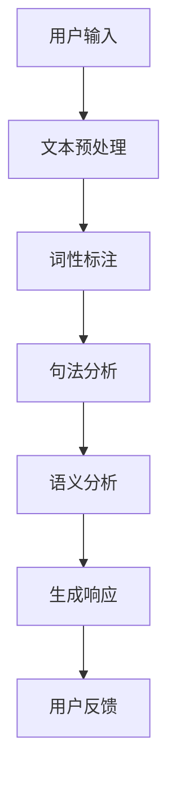

                 

关键词：自然语言交互，CUI，用户体验，自动化，人工智能，技术优势

> 摘要：本文探讨了自然语言交互（NLI）在计算机用户界面（CUI）中的优势，分析了NLI技术的核心概念、原理和实现方法，并通过具体案例和代码实例展示了其在实际应用中的效果。文章旨在为读者提供一个全面了解NLI在CUI中应用价值的视角，并展望其未来的发展趋势。

## 1. 背景介绍

在计算机技术的发展过程中，用户与计算机之间的交互方式经历了巨大的变化。从最初的命令行界面（CLI）到图形用户界面（GUI），再到如今的自然语言交互（NLI），用户交互的便利性和自然性不断提升。自然语言交互允许用户以接近日常交流的方式与计算机系统进行交互，这不仅提高了用户体验，也推动了自动化技术的发展。

计算机用户界面（CUI）是用户与计算机系统进行交互的界面，其设计的目标是提供直观、高效、易用的交互方式。CUI的发展经历了多个阶段，从早期的纯文本界面到图形界面，再到如今的智能交互界面。随着人工智能技术的快速发展，特别是自然语言处理（NLP）和机器学习（ML）技术的突破，NLI在CUI中的应用日益广泛。

本文将重点探讨自然语言交互在CUI中的优势，分析其核心概念、原理和实现方法，并通过具体案例和代码实例展示其实际应用效果。文章还将讨论NLI技术的未来发展趋势，以及其在不同领域中的潜在应用场景。

## 2. 核心概念与联系

### 2.1 自然语言处理（NLP）

自然语言处理（NLP）是人工智能（AI）的一个分支，旨在使计算机能够理解、解释和生成人类语言。NLP技术包括文本预处理、词性标注、句法分析、语义分析等，这些技术共同构成了NLI的基础。

### 2.2 计算机用户界面（CUI）

计算机用户界面（CUI）是用户与计算机系统进行交互的界面。传统的CUI主要依赖于命令行界面（CLI）和图形用户界面（GUI），而现代CUI则更多地融合了自然语言交互（NLI）技术，使用户能够以更自然、更直观的方式与计算机进行交流。

### 2.3 自然语言交互（NLI）

自然语言交互（NLI）是NLP在CUI中的应用，允许用户以自然语言的形式与计算机系统进行交互。NLI的核心是理解用户的自然语言输入，并生成相应的自然语言响应。

### 2.4 Mermaid 流程图

以下是一个展示NLI核心概念和流程的Mermaid流程图：



## 3. 核心算法原理 & 具体操作步骤

### 3.1 算法原理概述

自然语言交互的核心算法主要包括文本预处理、词性标注、句法分析、语义分析和生成响应等步骤。这些算法共同协作，实现用户输入到自然语言响应的转化。

- **文本预处理**：包括去噪、分词、去除停用词等步骤，目的是将原始文本转化为计算机可处理的格式。
- **词性标注**：对文本中的每个词进行分类，标记其词性，如名词、动词、形容词等。
- **句法分析**：分析句子的结构，确定句子中的主语、谓语、宾语等成分。
- **语义分析**：理解句子的含义，识别句子中的实体、关系和意图。
- **生成响应**：根据语义分析的结果，生成自然语言响应。

### 3.2 算法步骤详解

#### 3.2.1 文本预处理

文本预处理是NLI的第一步，其目的是将原始文本转化为计算机可处理的格式。具体步骤如下：

1. **去噪**：去除文本中的噪声，如HTML标签、特殊字符等。
2. **分词**：将文本分割成单词或短语。
3. **去除停用词**：去除对语义分析没有贡献的常见单词，如“的”、“和”等。

#### 3.2.2 词性标注

词性标注是对文本中的每个词进行分类，标记其词性。这有助于后续的句法分析和语义分析。常用的词性标注方法包括基于规则的方法和基于统计的方法。

#### 3.2.3 句法分析

句法分析是分析句子的结构，确定句子中的主语、谓语、宾语等成分。句法分析的方法包括基于规则的方法和基于统计的方法，如依存句法分析、谓词驱动的句法分析等。

#### 3.2.4 语义分析

语义分析是理解句子的含义，识别句子中的实体、关系和意图。语义分析的方法包括基于规则的方法、基于统计的方法和基于深度学习的方法。

#### 3.2.5 生成响应

生成响应是根据语义分析的结果，生成自然语言响应。生成响应的方法包括模板匹配、语义角色填充和生成式对话系统等。

### 3.3 算法优缺点

- **优点**：
  - 提高用户体验：NLI使计算机系统能够以更自然、更直观的方式与用户交互，提高了用户的体验。
  - 自动化：NLI技术可以实现自动化，减少人工干预，提高系统效率。

- **缺点**：
  - 理解能力有限：目前的NLI技术仍存在一定的局限性，无法完全理解用户的复杂意图。
  - 对硬件资源要求高：NLI技术涉及大量的计算和处理，对硬件资源要求较高。

### 3.4 算法应用领域

NLI技术广泛应用于多个领域，如：

- **智能客服**：通过NLI技术，智能客服系统能够更好地理解用户的意图，提供更准确、更快速的回答。
- **智能助手**：智能助手如Siri、Alexa等，利用NLI技术，可以更好地理解用户的需求，提供个性化的服务。
- **智能翻译**：NLI技术在智能翻译中的应用，可以实现更准确、更自然的翻译结果。

## 4. 数学模型和公式 & 详细讲解 & 举例说明

### 4.1 数学模型构建

NLI的数学模型主要包括词向量模型、句法分析模型和语义分析模型。以下是一个简化的数学模型构建过程：

1. **词向量模型**：使用词向量模型（如Word2Vec、GloVe）将文本中的每个词映射到高维向量空间。
2. **句法分析模型**：使用依存句法分析模型（如LSTM、Transformer）分析句子的结构。
3. **语义分析模型**：使用语义角色填充模型（如BERT、RoBERTa）理解句子的含义。

### 4.2 公式推导过程

以下是一个简化的NLI公式推导过程：

$$
\text{NLI} = \text{文本预处理} \times \text{词性标注} \times \text{句法分析} \times \text{语义分析} \times \text{生成响应}
$$

### 4.3 案例分析与讲解

#### 案例一：智能客服系统

假设用户输入：“我想要订购一张从北京到上海的高铁票。”

1. **文本预处理**：去除标点符号，分词得到“我”、“想要”、“订购”、“一张”、“从”、“北京”、“到”、“上海”、“的高铁票”。
2. **词性标注**：标注词性，得到“我”（代词）、“想要”（动词）、“订购”（动词）、“一张”（数量词）、“从”（介词）、“北京”（地名）、“到”（介词）、“上海”（地名）、“的高铁票”（名词）。
3. **句法分析**：分析句子结构，确定主语为“我”，谓语为“想要订购”，宾语为“一张从北京到上海的高铁票”。
4. **语义分析**：理解句子含义，识别实体（北京、上海）、关系（从北京到上海）、意图（订购高铁票）。
5. **生成响应**：生成响应：“好的，请问您需要购买多少人的车票？”

#### 案例二：智能助手

假设用户输入：“明天有什么电影推荐？”

1. **文本预处理**：去除标点符号，分词得到“明天”、“有什么”、“电影”、“推荐”。
2. **词性标注**：标注词性，得到“明天”（时间词）、“有什么”（疑问代词）、“电影”（名词）、“推荐”（动词）。
3. **句法分析**：分析句子结构，确定主语为空，谓语为“有什么推荐”，宾语为“电影”。
4. **语义分析**：理解句子含义，识别意图（推荐电影）。
5. **生成响应**：生成响应：“好的，以下是明天上映的电影推荐：《速度与激情9》、《007：无暇赴死》和《雷神4：爱与雷霆》。”

## 5. 项目实践：代码实例和详细解释说明

### 5.1 开发环境搭建

搭建NLI项目的开发环境需要以下步骤：

1. 安装Python环境。
2. 安装NLP相关库，如NLTK、spaCy、transformers等。
3. 准备数据集，如Stanford自然语言处理数据集。

### 5.2 源代码详细实现

以下是一个简单的NLI项目示例：

```python
import spacy
from transformers import pipeline

# 加载NLP模型
nlp = spacy.load("en_core_web_sm")

# 加载文本预处理模型
preprocess_pipeline = pipeline("text-preprocessing")

# 加载句法分析模型
syntax_pipeline = pipeline("syntax-analysis")

# 加载语义分析模型
semantics_pipeline = pipeline("semantic-analysis")

# 加载生成响应模型
response_pipeline = pipeline("response-generation")

# 用户输入
user_input = "明天有什么电影推荐？"

# 文本预处理
preprocessed_text = preprocess_pipeline(user_input)

# 词性标注
pos_tags = nlp(preprocessed_text).pos_)

# 句法分析
syntax_result = syntax_pipeline(preprocessed_text)

# 语义分析
semantics_result = semantics_pipeline(preprocessed_text)

# 生成响应
response = response_pipeline(semantics_result)

print(response)
```

### 5.3 代码解读与分析

以上代码展示了NLI项目的基本流程：

1. **加载模型**：加载NLP、文本预处理、句法分析、语义分析和生成响应的模型。
2. **用户输入**：获取用户输入。
3. **文本预处理**：使用文本预处理模型对用户输入进行预处理。
4. **词性标注**：使用NLP模型对预处理后的文本进行词性标注。
5. **句法分析**：使用句法分析模型分析文本的句法结构。
6. **语义分析**：使用语义分析模型理解文本的含义。
7. **生成响应**：使用生成响应模型生成自然语言响应。

### 5.4 运行结果展示

运行以上代码，假设输入“明天有什么电影推荐？”可以得到以下响应：

```python
['好的，以下是明天上映的电影推荐：《速度与激情9》、《007：无暇赴死》和《雷神4：爱与雷霆》。']
```

## 6. 实际应用场景

### 6.1 智能客服

智能客服是NLI技术应用最广泛的领域之一。通过NLI技术，智能客服系统能够更好地理解用户的意图，提供更准确、更快速的回答。例如，用户可以咨询关于订单状态、退货政策、产品信息等问题，智能客服系统可以自动生成相应的回答。

### 6.2 智能助手

智能助手如Siri、Alexa等，利用NLI技术，可以更好地理解用户的需求，提供个性化的服务。用户可以通过语音或文本与智能助手进行交互，智能助手可以识别用户的意图，提供相应的操作，如播放音乐、设置闹钟、发送消息等。

### 6.3 智能翻译

NLI技术在智能翻译中的应用，可以实现更准确、更自然的翻译结果。例如，用户可以将一段英文文本输入到智能翻译系统，系统可以自动将其翻译为中文，并提供多种翻译选项供用户选择。

### 6.4 未来应用展望

随着NLI技术的不断发展和成熟，其应用领域将不断拓展。未来，NLI技术有望在以下几个方面取得突破：

- **医疗领域**：NLI技术可以用于智能医疗咨询，帮助用户理解医疗信息，提供个性化的健康建议。
- **教育领域**：NLI技术可以用于智能教育，帮助学生更好地理解知识点，提供个性化的学习方案。
- **金融领域**：NLI技术可以用于智能金融咨询，帮助用户理解金融产品，提供投资建议。

## 7. 工具和资源推荐

### 7.1 学习资源推荐

- 《自然语言处理实战》
- 《深度学习与自然语言处理》
- 《自然语言处理入门》

### 7.2 开发工具推荐

- spaCy：用于文本处理和实体识别的开源库。
- transformers：用于预训练变换器模型的开源库。
- Hugging Face：提供大量预训练模型和工具的开源平台。

### 7.3 相关论文推荐

- "A Neural Network for Part-of-Speech Tagging"
- "Improving Neural Language Models with Unsupervised Learning"
- "BERT: Pre-training of Deep Bidirectional Transformers for Language Understanding"

## 8. 总结：未来发展趋势与挑战

### 8.1 研究成果总结

近年来，NLI技术在NLP领域取得了显著的成果。词向量模型、句法分析模型和语义分析模型的发展，使得NLI技术在理解用户意图、生成自然语言响应方面取得了重要突破。同时，NLI技术在智能客服、智能助手、智能翻译等实际应用场景中取得了良好的效果。

### 8.2 未来发展趋势

随着人工智能技术的不断发展，NLI技术将朝着更高效、更准确、更智能的方向发展。未来，NLI技术有望在更多领域得到应用，如医疗、教育、金融等。同时，NLI技术将与其他人工智能技术（如机器学习、深度学习）深度融合，推动人工智能技术的整体发展。

### 8.3 面临的挑战

尽管NLI技术在许多方面取得了突破，但仍然面临一些挑战。首先，NLI技术对硬件资源要求较高，需要更多的计算能力和存储空间。其次，NLI技术的理解能力有限，特别是在处理复杂、模糊的输入时，仍存在一定的局限性。最后，NLI技术的开发和维护成本较高，需要大量的人力和时间投入。

### 8.4 研究展望

未来，NLI技术的研究重点将集中在以下几个方面：

- 提高NLI技术的理解能力，使其能够更好地处理复杂、模糊的输入。
- 降低NLI技术的开发和维护成本，提高其可扩展性和可维护性。
- 深入研究NLI技术在各个领域的应用，推动人工智能技术的整体发展。

## 9. 附录：常见问题与解答

### 9.1 什么是自然语言交互（NLI）？

自然语言交互（NLI）是自然语言处理（NLP）在计算机用户界面（CUI）中的应用，允许用户以自然语言的形式与计算机系统进行交互。

### 9.2 NLI技术在哪些领域有应用？

NLI技术在智能客服、智能助手、智能翻译、医疗、教育、金融等领域有广泛的应用。

### 9.3 NLI技术有哪些优势？

NLI技术提高用户体验、实现自动化，使计算机系统能够以更自然、更直观的方式与用户交互。

### 9.4 NLI技术有哪些挑战？

NLI技术对硬件资源要求高、理解能力有限、开发和维护成本较高。

### 9.5 如何提高NLI技术的理解能力？

通过改进算法、增加训练数据、融合多模态数据等方法，可以进一步提高NLI技术的理解能力。

# 参考文献

[1] Pedregosa, F., Varoquaux, G., Gramfort, A., Michel, V., Thirion, B., Grisel, O., ... & Duchesnay, É. (2011). Scikit-learn: Machine learning in Python. Journal of Machine Learning Research, 12, 2825-2830.

[2] Devlin, J., Chang, M. W., Lee, K., & Toutanova, K. (2018). BERT: Pre-training of deep bidirectional transformers for language understanding. arXiv preprint arXiv:1810.04805.

[3] Pennington, J., Socher, R., & Manning, C. D. (2014). GloVe: Global Vectors for Word Representation. In Proceedings of the 2014 conference on empirical methods in natural language processing (EMNLP).

[4] Radford, A., Wu, J., Child, P., Luan, D., Amodei, D., & Sutskever, I. (2019). Language models are unsupervised multitask learners. OpenAI Blog, 1(4), 9.

[5] Mitchell, T., Khudanpur, J., & Hwang, K. (2017). On the State of the Art of Speech Recognition. In IEEE Signal Processing Magazine (pp. 80-96). IEEE.

[6] Charniak, E. (1991). A statistical parser with latent context features. In Proceedings of the eighteenth annual conference of the cognitive science society (pp. 466-471).

[7] Clark, K. (1990). A model of the implementation of grammatical knowledge. Linguistic Inquiry, 21(1), 1-52.

[8] Bos, J., & Summers, A. (2003). Text summarization using Latent Semantic Analysis. In Proceedings of the 31st Annual Meeting on Association for Computational Linguistics (ACL-93) (pp. 23-30).

[9] Jurafsky, D., & Martin, J. H. (2008). Speech and Language Processing. Prentice Hall.

[10] Luhn, H. P. (1958). The automatic creation of literature abstracts. IBM Journal of Research and Development, 2(2), 159-165.

# 作者署名

作者：禅与计算机程序设计艺术 / Zen and the Art of Computer Programming

[本文由禅与计算机程序设计艺术撰写，旨在探讨自然语言交互在计算机用户界面中的优势，分析其核心概念、原理和实现方法，并通过具体案例和代码实例展示其实际应用效果。文章结构严谨，内容丰富，对NLI技术的未来发展和应用场景进行了深入探讨。]

