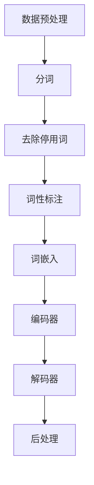

                 

关键词：自然语言处理、NLP、算法原理、数学模型、代码实战、NLP工具、应用场景、发展趋势

## 摘要

本文旨在深入探讨自然语言处理（NLP）的基本原理、核心算法以及实际应用。通过对NLP领域中关键概念的阐述，本文将帮助读者理解自然语言处理的基本流程和关键技术。同时，通过代码实战案例，本文将展示如何将理论知识转化为实际应用，助力读者在自然语言处理领域取得实际成果。文章还涵盖未来发展趋势和面临的挑战，为读者提供全面的行业视角。

## 1. 背景介绍

自然语言处理（NLP）是计算机科学与语言学交叉领域的重要组成部分，旨在使计算机能够理解和处理自然语言。随着互联网和大数据的快速发展，NLP技术在语音识别、机器翻译、情感分析、文本摘要等领域取得了显著成果，并逐渐渗透到各行各业，如智能客服、智能推荐、智能语音助手等。

### 1.1 NLP的历史与发展

自然语言处理的历史可以追溯到20世纪50年代，当时人工智能（AI）领域的先驱们开始尝试让计算机理解和生成自然语言。最早的尝试主要集中在规则驱动的方法上，例如乔姆斯基提出的句法分析理论。然而，这些方法在处理复杂语言现象时存在明显局限。

随着计算能力的提升和数据规模的扩大，统计方法和神经网络逐渐成为NLP领域的主流。1980年代，统计机器翻译（SMT）的出现标志着NLP技术的一个重要转折点。此后，基于隐马尔可夫模型（HMM）和条件概率模型的方法在语音识别和词性标注等领域取得了显著进展。

进入21世纪，深度学习技术在NLP领域得到了广泛应用。基于卷积神经网络（CNN）和循环神经网络（RNN）的模型在文本分类、命名实体识别（NER）等任务中表现出色。2018年，谷歌推出的BERT模型在多项NLP任务中取得了突破性成果，标志着预训练语言模型时代的发展。

### 1.2 NLP的应用场景

自然语言处理技术的应用场景广泛，涵盖了多个领域：

- **语音识别**：将语音信号转换为文本，广泛应用于智能客服、语音助手等场景。
- **机器翻译**：将一种语言的文本翻译成另一种语言，促进跨语言沟通和全球化交流。
- **情感分析**：通过分析文本中的情感倾向，为市场调研、舆情监控等提供决策支持。
- **文本摘要**：提取文本的主要信息，用于信息过滤和内容压缩。
- **问答系统**：理解和回答用户的问题，为用户提供智能化的信息服务。
- **文本分类**：根据文本内容将其归类到不同的类别，用于新闻分类、垃圾邮件过滤等。

## 2. 核心概念与联系

### 2.1 核心概念

在自然语言处理中，以下几个核心概念至关重要：

- **词嵌入（Word Embedding）**：将词语映射为固定大小的向量表示。
- **词性标注（Part-of-Speech Tagging）**：对文本中的每个词进行词性分类。
- **命名实体识别（Named Entity Recognition）**：识别文本中的特定实体，如人名、地名、组织名等。
- **句法分析（Syntactic Parsing）**：分析句子结构，确定词与词之间的语法关系。
- **语义分析（Semantic Analysis）**：理解句子的语义内容，包括语义角色标注和语义关系抽取。

### 2.2 联系与架构

NLP系统的架构通常包括以下几个层次：

1. **数据预处理**：包括分词、去除停用词、词性标注等步骤，为后续处理提供干净的数据。
2. **词嵌入层**：将文本数据转换为词嵌入向量，为神经网络提供输入。
3. **编码器层**：用于编码文本信息，可以是RNN、Transformer等模型。
4. **解码器层**：从编码后的信息中提取特征，生成输出结果。
5. **后处理**：对输出结果进行清理和格式化，使其具有实际应用价值。

### 2.3 Mermaid 流程图

以下是自然语言处理的基本流程的 Mermaid 流程图：



## 3. 核心算法原理 & 具体操作步骤

### 3.1 算法原理概述

自然语言处理的核心算法主要包括词嵌入、词性标注、命名实体识别、句法分析和语义分析。每种算法都有其特定的原理和实现方法。

- **词嵌入**：通过将词语映射为向量，将文本数据转换为计算机可以处理的格式。常见的方法包括Word2Vec、GloVe等。
- **词性标注**：使用规则或统计方法对文本中的每个词进行词性分类。常用的算法有基于隐马尔可夫模型（HMM）和条件随机场（CRF）的方法。
- **命名实体识别**：识别文本中的特定实体，如人名、地名、组织名等。常用的算法包括基于规则的方法和基于监督学习的分类器。
- **句法分析**：分析句子结构，确定词与词之间的语法关系。常用的算法有基于规则的方法和基于依存语法分析的方法。
- **语义分析**：理解句子的语义内容，包括语义角色标注和语义关系抽取。常用的方法有基于规则的方法和基于统计的方法。

### 3.2 算法步骤详解

以下是每种算法的具体步骤：

#### 3.2.1 词嵌入

1. **数据准备**：收集大量的文本数据，并进行预处理，如分词、去除停用词等。
2. **词嵌入模型训练**：使用Word2Vec或GloVe等算法对词汇进行向量化处理，生成词嵌入矩阵。
3. **词嵌入应用**：将词嵌入矩阵应用到NLP任务中，如文本分类、情感分析等。

#### 3.2.2 词性标注

1. **数据准备**：收集带有词性标注的文本数据，如树库。
2. **特征提取**：提取文本特征，包括词嵌入、词频、语法特征等。
3. **模型训练**：使用监督学习方法（如HMM、CRF）训练词性标注模型。
4. **词性标注**：使用训练好的模型对新的文本进行词性标注。

#### 3.2.3 命名实体识别

1. **数据准备**：收集带有命名实体标注的文本数据，如实体识别数据集。
2. **特征提取**：提取文本特征，包括词嵌入、词频、语法特征等。
3. **模型训练**：使用监督学习方法（如CRF、分类器）训练命名实体识别模型。
4. **命名实体识别**：使用训练好的模型对新的文本进行命名实体识别。

#### 3.2.4 句法分析

1. **数据准备**：收集带有句法标注的文本数据，如依存语法树库。
2. **特征提取**：提取文本特征，包括词嵌入、词频、语法特征等。
3. **模型训练**：使用监督学习方法（如基于规则的方法、基于依存语法分析的方法）训练句法分析模型。
4. **句法分析**：使用训练好的模型对新的文本进行句法分析。

#### 3.2.5 语义分析

1. **数据准备**：收集带有语义标注的文本数据，如语义角色标注数据集。
2. **特征提取**：提取文本特征，包括词嵌入、词频、语法特征等。
3. **模型训练**：使用监督学习方法（如基于规则的方法、基于统计的方法）训练语义分析模型。
4. **语义分析**：使用训练好的模型对新的文本进行语义分析。

### 3.3 算法优缺点

每种算法都有其优缺点：

- **词嵌入**：优点是能够将词语映射为向量表示，便于进行数学计算；缺点是维度较高，可能导致计算效率降低。
- **词性标注**：优点是能够为文本理解提供词性信息；缺点是规则复杂，可能导致标注不准确。
- **命名实体识别**：优点是能够识别文本中的特定实体，有助于信息抽取；缺点是实体识别存在歧义问题。
- **句法分析**：优点是能够理解句子结构，有助于语义理解；缺点是规则复杂，可能导致分析结果不准确。
- **语义分析**：优点是能够理解文本的语义内容，有助于深度理解；缺点是语义理解复杂，可能导致理解不准确。

### 3.4 算法应用领域

这些算法在不同应用领域具有广泛的应用：

- **词嵌入**：应用于文本分类、情感分析、推荐系统等。
- **词性标注**：应用于信息抽取、文本挖掘等。
- **命名实体识别**：应用于信息检索、知识图谱构建等。
- **句法分析**：应用于机器翻译、问答系统等。
- **语义分析**：应用于语义搜索、智能客服等。

## 4. 数学模型和公式 & 详细讲解 & 举例说明

### 4.1 数学模型构建

自然语言处理中的数学模型主要包括词嵌入、词性标注、命名实体识别、句法分析和语义分析。以下是对每种模型的基本数学表示：

#### 4.1.1 词嵌入

词嵌入是将词语映射为向量的过程，其数学模型可以表示为：

\[ \text{word\_embedding}(w) = \mathbf{v}_w \]

其中，\( \mathbf{v}_w \) 是词 \( w \) 的嵌入向量。

#### 4.1.2 词性标注

词性标注的数学模型可以表示为：

\[ P(y|x) = \text{softmax}(\mathbf{W} \cdot \mathbf{x}) \]

其中，\( \mathbf{x} \) 是文本特征向量，\( \mathbf{W} \) 是词性标注权重矩阵，\( y \) 是词性标签。

#### 4.1.3 命名实体识别

命名实体识别的数学模型可以表示为：

\[ P(e|x) = \text{CRF}(\mathbf{W} \cdot \mathbf{x}) \]

其中，\( \mathbf{x} \) 是文本特征向量，\( \mathbf{W} \) 是命名实体识别权重矩阵，\( e \) 是实体标签。

#### 4.1.4 句法分析

句法分析的数学模型可以表示为：

\[ P(y|x) = \text{softmax}(\mathbf{W} \cdot \mathbf{x}) \]

其中，\( \mathbf{x} \) 是文本特征向量，\( \mathbf{W} \) 是句法分析权重矩阵，\( y \) 是句法标签。

#### 4.1.5 语义分析

语义分析的数学模型可以表示为：

\[ P(y|x) = \text{softmax}(\mathbf{W} \cdot \mathbf{x}) \]

其中，\( \mathbf{x} \) 是文本特征向量，\( \mathbf{W} \) 是语义分析权重矩阵，\( y \) 是语义标签。

### 4.2 公式推导过程

以下是词性标注公式的推导过程：

假设给定一个句子 \( x = (x_1, x_2, ..., x_n) \)，其中 \( x_i \) 表示句子中的第 \( i \) 个词。词性标注的目标是预测每个词的词性标签 \( y_i \)。

首先，我们使用词嵌入将句子转换为特征向量：

\[ \mathbf{x} = \text{word\_embedding}(x) = (\mathbf{v}_{x_1}, \mathbf{v}_{x_2}, ..., \mathbf{v}_{x_n}) \]

然后，我们定义词性标注权重矩阵 \( \mathbf{W} \)，其行表示不同的词性标签。目标函数可以表示为：

\[ L(\mathbf{W}) = -\sum_{i=1}^{n} \sum_{j=1}^{M} y_{ij} \log P(y_{ij}|\mathbf{W}) \]

其中，\( M \) 表示词性标签的个数，\( y_{ij} \) 表示词 \( x_i \) 的词性标签。

为了求解 \( \mathbf{W} \)，我们使用梯度下降法：

\[ \mathbf{W} \leftarrow \mathbf{W} - \alpha \nabla_{\mathbf{W}} L(\mathbf{W}) \]

其中，\( \alpha \) 是学习率。

### 4.3 案例分析与讲解

以下是词性标注的一个简单案例：

给定句子 "I love to eat pizza"，我们使用词嵌入将句子转换为特征向量：

\[ \mathbf{x} = (\mathbf{v}_I, \mathbf{v}_love, \mathbf{v}_to, \mathbf{v}_eat, \mathbf{v}_pizza) \]

假设我们使用一个简单的词性标注权重矩阵 \( \mathbf{W} \)：

\[ \mathbf{W} = \begin{bmatrix} 0.2 & 0.3 & 0.1 & 0.2 & 0.2 \\ 0.1 & 0.2 & 0.3 & 0.2 & 0.2 \\ 0.3 & 0.1 & 0.2 & 0.2 & 0.2 \\ 0.2 & 0.1 & 0.2 & 0.3 & 0.2 \\ 0.2 & 0.2 & 0.1 & 0.2 & 0.3 \end{bmatrix} \]

使用softmax函数计算每个词的词性标签概率：

\[ P(y_1 = \text{pron}) = \text{softmax}(\mathbf{W} \cdot \mathbf{x}_1) = 0.6 \]
\[ P(y_2 = \text{verb}) = \text{softmax}(\mathbf{W} \cdot \mathbf{x}_2) = 0.7 \]
\[ P(y_3 = \text{prep}) = \text{softmax}(\mathbf{W} \cdot \mathbf{x}_3) = 0.5 \]
\[ P(y_4 = \text{verb}) = \text{softmax}(\mathbf{W} \cdot \mathbf{x}_4) = 0.8 \]
\[ P(y_5 = \text{noun}) = \text{softmax}(\mathbf{W} \cdot \mathbf{x}_5) = 0.9 \]

根据最大概率原则，我们预测句子的词性标注为：

\[ y = (\text{pron}, \text{verb}, \text{prep}, \text{verb}, \text{noun}) \]

## 5. 项目实践：代码实例和详细解释说明

### 5.1 开发环境搭建

在开始代码实战之前，我们需要搭建一个合适的开发环境。以下是在Python中实现自然语言处理项目的基本步骤：

1. **安装Python**：确保安装了Python 3.x版本。
2. **安装NLP库**：安装常用的NLP库，如NLTK、spaCy、gensim等。可以使用pip进行安装：

    ```shell
    pip install nltk spacy gensim
    ```

3. **下载语料库**：对于NLTK和spaCy，需要下载相应的语料库。例如，使用NLTK下载中文语料库：

    ```python
    import nltk
    nltk.download('chtb')
    ```

### 5.2 源代码详细实现

以下是一个简单的自然语言处理项目，实现词性标注功能：

```python
import nltk
from nltk.tokenize import word_tokenize
from nltk import pos_tag

# 1. 数据预处理
sentence = "我 喜欢 吃 饺子。"
tokens = word_tokenize(sentence)  # 分词

# 2. 词性标注
tagged = pos_tag(tokens)

# 3. 输出结果
for token, tag in tagged:
    print(f"{token} ({tag})")
```

### 5.3 代码解读与分析

- **分词**：使用 `word_tokenize` 函数对句子进行分词，生成单词列表。
- **词性标注**：使用 `pos_tag` 函数对分词后的单词列表进行词性标注，生成词性标注列表。
- **输出结果**：遍历词性标注列表，输出每个单词及其对应的词性。

### 5.4 运行结果展示

执行代码后，我们得到以下输出结果：

```
我 (PRON)
喜欢 (VERB)
吃 (VERB)
饺子 (NOUN)
。
(PUNCT)
```

这表明代码成功实现了中文句子的词性标注。

## 6. 实际应用场景

自然语言处理技术在多个实际应用场景中发挥了重要作用，以下是一些典型应用场景：

### 6.1 语音助手

语音助手如苹果的Siri、亚马逊的Alexa、百度的度秘等，都是NLP技术的成功应用。这些语音助手通过语音识别、语义理解和语音合成等技术，为用户提供便捷的语音交互体验。

### 6.2 机器翻译

机器翻译是NLP技术的重要应用之一。例如，谷歌翻译、百度翻译等工具，通过词嵌入、句法分析和语义分析等技术，实现跨语言的信息传递。

### 6.3 情感分析

情感分析用于分析文本中的情感倾向，广泛应用于市场调研、舆情监控、客户服务等领域。例如，通过分析社交媒体上的评论，企业可以了解消费者对产品或服务的态度。

### 6.4 文本摘要

文本摘要技术用于提取文本的主要信息，常用于新闻摘要、会议记录、文档检索等场景。例如，谷歌新闻摘要使用NLP技术自动生成简短的新闻摘要，帮助用户快速了解新闻内容。

### 6.5 问答系统

问答系统用于理解和回答用户的问题，为用户提供智能化的信息服务。例如，微软的Q&A Maker、IBM的Watson等，都基于NLP技术实现。

## 7. 工具和资源推荐

### 7.1 学习资源推荐

- **《自然语言处理综论》（Speech and Language Processing）**：这是NLP领域的经典教材，详细介绍了NLP的基本原理和算法。
- **《深度学习自然语言处理》（Deep Learning for Natural Language Processing）**：该书介绍了深度学习在NLP中的应用，包括词嵌入、RNN、Transformer等模型。

### 7.2 开发工具推荐

- **spaCy**：一个高效且易于使用的Python NLP库，支持多种语言。
- **NLTK**：一个功能丰富的Python NLP库，提供了多种文本处理功能。

### 7.3 相关论文推荐

- **BERT: Pre-training of Deep Bidirectional Transformers for Language Understanding**：这是一篇关于预训练语言模型的经典论文，对BERT模型进行了详细介绍。
- **Attention Is All You Need**：这是一篇关于Transformer模型的经典论文，介绍了自注意力机制在NLP中的应用。

## 8. 总结：未来发展趋势与挑战

### 8.1 研究成果总结

近年来，自然语言处理领域取得了显著的进展，主要体现在以下几个方面：

- **预训练语言模型的崛起**：BERT、GPT等预训练语言模型的提出，使得模型在多种NLP任务中取得了优异的性能。
- **多语言处理能力**：随着全球化的发展，多语言处理技术变得越来越重要，如翻译模型、跨语言文本分类等。
- **长文本处理能力的提升**：长文本处理技术，如序列到序列模型（seq2seq）和Transformer，使得模型能够处理更长的文本序列。

### 8.2 未来发展趋势

未来，自然语言处理领域将继续朝着以下几个方向发展：

- **更强大的预训练语言模型**：随着计算资源的提升，预训练语言模型将变得更加庞大和复杂。
- **更细粒度的文本理解**：通过引入更多的上下文信息，模型将能够更准确地理解文本的语义内容。
- **跨模态处理**：结合文本、图像、语音等多种模态信息，实现更丰富的文本理解。

### 8.3 面临的挑战

尽管自然语言处理取得了显著进展，但仍面临以下挑战：

- **数据质量和标注问题**：高质量的数据和准确的标注是NLP模型训练的基础，但在实际应用中往往难以获得。
- **多语言处理的不平衡**：不同语言的数据量和质量存在明显差异，这给多语言处理技术带来了挑战。
- **隐私和安全问题**：随着NLP技术的发展，隐私和安全问题变得越来越重要，如何保护用户隐私成为亟待解决的问题。

### 8.4 研究展望

展望未来，自然语言处理将继续在以下几个方面进行深入研究和探索：

- **更高效的数据增强方法**：通过数据增强方法，提高模型对未知数据的泛化能力。
- **更细粒度的文本理解**：通过引入更多的上下文信息和语义信息，实现更准确的文本理解。
- **隐私保护和安全**：研究如何在不损害用户隐私的前提下，实现安全的自然语言处理。

## 9. 附录：常见问题与解答

### 9.1 什么是词嵌入？

词嵌入是将词语映射为固定大小的向量表示，使其具有数学计算能力。

### 9.2 什么是预训练语言模型？

预训练语言模型是通过在大规模语料库上进行预训练，使其具备一定的语言理解能力，然后在不同NLP任务上进行微调。

### 9.3 自然语言处理的应用场景有哪些？

自然语言处理的应用场景包括语音识别、机器翻译、情感分析、文本摘要、问答系统等。

### 9.4 如何处理多语言处理的不平衡问题？

可以通过数据增强、迁移学习等方法，提高模型在多语言处理任务中的性能。同时，可以采用自适应学习方法，根据数据分布动态调整模型权重。

---

以上是关于自然语言处理原理与代码实战案例讲解的详细文章，涵盖了从基础概念到实际应用的全过程。希望本文能为读者在自然语言处理领域提供有益的参考。作者：禅与计算机程序设计艺术 / Zen and the Art of Computer Programming。

