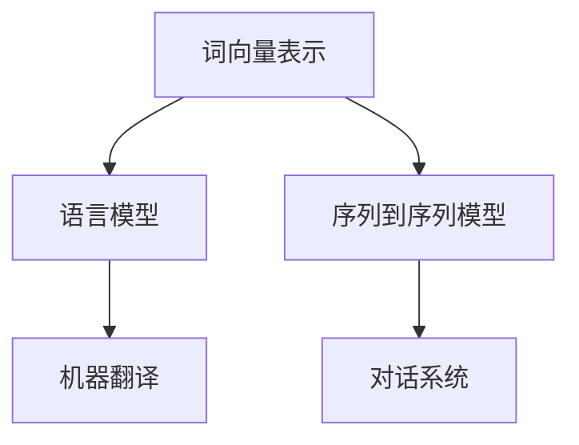

                 

关键词：自然语言处理、AI工作流、技术挑战、应用领域、未来展望

摘要：随着人工智能技术的快速发展，自然语言处理（NLP）在AI工作流中的应用越来越广泛。本文将从背景介绍、核心概念与联系、核心算法原理与具体操作步骤、数学模型和公式、项目实践、实际应用场景、工具和资源推荐、总结与展望等方面，深入探讨自然语言处理在AI工作流中的应用与挑战。

## 1. 背景介绍

自然语言处理是人工智能领域的一个重要分支，其目的是使计算机能够理解、生成和处理人类语言。随着深度学习和神经网络技术的不断发展，自然语言处理技术取得了显著的进步。如今，自然语言处理已经成为人工智能工作流中不可或缺的一部分，广泛应用于语音识别、机器翻译、文本分类、情感分析等场景。

AI工作流是指利用人工智能技术解决实际问题的过程，包括数据收集、预处理、模型训练、模型评估和部署等环节。自然语言处理技术在AI工作流中的应用，使得人工智能系统能够更好地理解和处理人类语言，从而提高系统的智能化程度和用户体验。

## 2. 核心概念与联系

在自然语言处理领域，核心概念包括词向量表示、语言模型、序列到序列模型等。这些概念在自然语言处理任务中起着重要作用，并且相互关联。

### 2.1 词向量表示

词向量表示是将词语映射为高维向量空间中的点，以便计算机能够进行向量运算和机器学习。常用的词向量表示方法包括Word2Vec、GloVe等。词向量表示是自然语言处理的基础，对于文本分类、文本相似度计算等任务具有重要意义。

### 2.2 语言模型

语言模型是用于预测下一个单词或字符的概率分布的模型。常见的语言模型包括n-gram模型、神经网络语言模型等。语言模型在机器翻译、语音识别等任务中具有重要作用，可以提高系统的准确性和流畅性。

### 2.3 序列到序列模型

序列到序列（Seq2Seq）模型是一种用于序列生成的模型，常用于机器翻译、对话系统等任务。Seq2Seq模型通过编码器和解码器两个神经网络将输入序列转换为输出序列，从而实现序列的转换和生成。

下面是一个Mermaid流程图，展示了这些核心概念在自然语言处理任务中的联系：



## 3. 核心算法原理 & 具体操作步骤

### 3.1 算法原理概述

自然语言处理的核心算法包括词向量表示、语言模型和序列到序列模型。这些算法基于神经网络技术，通过大量数据进行训练，从而实现高效的语言理解和生成。

### 3.2 算法步骤详解

#### 3.2.1 词向量表示

1. 数据收集：收集大量的文本数据，包括语料库和网页数据。
2. 数据预处理：对文本数据进行分词、去除停用词等预处理操作。
3. 训练词向量：使用Word2Vec、GloVe等方法训练词向量模型，将词语映射为高维向量。
4. 模型评估：使用余弦相似度、词向量的距离等指标评估词向量表示的准确性。

#### 3.2.2 语言模型

1. 数据收集：收集大量的文本数据，包括语料库和网页数据。
2. 数据预处理：对文本数据进行分词、去除停用词等预处理操作。
3. 训练语言模型：使用n-gram模型、神经网络语言模型等方法训练语言模型。
4. 模型评估：使用交叉熵、准确率等指标评估语言模型的性能。

#### 3.2.3 序列到序列模型

1. 数据收集：收集大量的文本数据，包括语料库和网页数据。
2. 数据预处理：对文本数据进行分词、去除停用词等预处理操作。
3. 训练编码器和解码器：使用神经网络训练编码器和解码器，实现序列的编码和解码。
4. 模型评估：使用BLEU、ROUGE等指标评估序列到序列模型的性能。

### 3.3 算法优缺点

#### 3.3.1 词向量表示

**优点**：能够高效地表示词语，便于机器学习和计算。

**缺点**：仅考虑词语的局部上下文信息，可能丢失词语的语义信息。

#### 3.3.2 语言模型

**优点**：能够预测下一个单词或字符的概率分布，适用于生成文本、语音识别等任务。

**缺点**：仅考虑词语的顺序信息，可能丢失词语的语义信息。

#### 3.3.3 序列到序列模型

**优点**：能够生成高质量的序列，适用于机器翻译、对话系统等任务。

**缺点**：训练过程复杂，对计算资源要求较高。

### 3.4 算法应用领域

自然语言处理算法在多个领域有广泛应用，如：

- 机器翻译：将一种语言的文本翻译成另一种语言。
- 对话系统：实现人与机器的交互，如智能客服、聊天机器人等。
- 文本分类：对文本进行分类，如新闻分类、垃圾邮件过滤等。
- 情感分析：分析文本中的情感倾向，如微博情感分析、产品评论分析等。

## 4. 数学模型和公式 & 详细讲解 & 举例说明

### 4.1 数学模型构建

在自然语言处理中，常用的数学模型包括词向量模型、语言模型和序列到序列模型。以下是这些模型的数学公式和详细讲解。

### 4.2 公式推导过程

#### 4.2.1 词向量模型

假设有一个词集合V，其中包含n个词语。词向量模型的目标是将每个词语映射为一个高维向量。Word2Vec模型通过训练神经网络，学习词语的向量表示。

给定一个句子S = {w1, w2, ..., wm}，其中wi表示句子中的第i个词。词向量模型的目标是计算词语wi的向量表示。

词向量模型的核心公式如下：

$$
\text{vec}(w_i) = \text{softmax}(\text{W} \cdot \text{E}[w_i])
$$

其中，vec(wi)表示词语wi的向量表示，W表示词向量矩阵，E[wi]表示词语wi的词向量。

#### 4.2.2 语言模型

语言模型的目标是预测下一个单词或字符的概率分布。n-gram模型是一种常用的语言模型，它使用前n个单词或字符的序列来预测下一个单词或字符。

给定一个句子S = {w1, w2, ..., wm}，其中wi表示句子中的第i个词。n-gram模型的目标是计算词语wi在给定前n-1个词语的条件下，下一个词语wi+1的概率。

n-gram模型的核心公式如下：

$$
P(w_i+1 | w_1, w_2, ..., w_i) = \frac{C(w_i, w_i+1)}{C(w_1, w_2, ..., w_i)}
$$

其中，C(wi, wi+1)表示词语wi和wi+1同时出现的次数，C(w1, w2, ..., wi)表示词语w1, w2, ..., wi同时出现的次数。

#### 4.2.3 序列到序列模型

序列到序列（Seq2Seq）模型是一种用于序列生成的模型，它通过编码器和解码器两个神经网络将输入序列转换为输出序列。

给定一个输入序列S = {s1, s2, ..., sn}和一个目标序列T = {t1, t2, ..., tm}，其中si和ti分别表示输入序列和目标序列中的第i个元素。序列到序列模型的目标是学习一个函数f，将输入序列S转换为输出序列T。

序列到序列模型的核心公式如下：

$$
y = \text{softmax}(\text{V} \cdot \text{h})
$$

其中，y表示输出序列的概率分布，V表示词向量矩阵，h表示编码器的输出。

### 4.3 案例分析与讲解

#### 4.3.1 词向量模型

假设我们有一个包含5个词语的语料库，其中每个词语的词频如下：

| 词语 | 词频 |
| ---- | ---- |
| a    | 10   |
| b    | 5    |
| c    | 3    |
| d    | 2    |
| e    | 1    |

使用Word2Vec模型训练词向量，设置向量维度为2，学习率为0.1。以下是训练过程的一个迭代：

- 初始词向量：$$
\text{vec}(a) = (1, 0), \text{vec}(b) = (0, 1), \text{vec}(c) = (0, 0), \text{vec}(d) = (0, 0), \text{vec}(e) = (0, 0)
$$
- 迭代1：更新词向量：
$$
\text{vec}(a) = (1, 0) + 0.1 \cdot (1, 0) = (1.1, 0)
$$
$$
\text{vec}(b) = (0, 1) + 0.1 \cdot (-1, 1) = (-0.1, 1.1)
$$
$$
\text{vec}(c) = (0, 0) + 0.1 \cdot (0, 1) = (0, 0.1)
$$
$$
\text{vec}(d) = (0, 0) + 0.1 \cdot (1, 0) = (0.1, 0)
$$
$$
\text{vec}(e) = (0, 0) + 0.1 \cdot (0, 0) = (0, 0)
$$

- 迭代2：更新词向量：
$$
\text{vec}(a) = (1.1, 0) + 0.1 \cdot (1.1, 0) = (1.21, 0)
$$
$$
\text{vec}(b) = (-0.1, 1.1) + 0.1 \cdot (-1.1, -1.1) = (-0.21, -0.11)
$$
$$
\text{vec}(c) = (0, 0.1) + 0.1 \cdot (0, 0.1) = (0, 0.11)
$$
$$
\text{vec}(d) = (0.1, 0) + 0.1 \cdot (0.1, 0) = (0.11, 0)
$$
$$
\text{vec}(e) = (0, 0) + 0.1 \cdot (0, 0) = (0, 0)
$$

通过迭代更新词向量，我们可以观察到词语的词频在词向量中表示出来，高频词语的向量长度较大，低频词语的向量长度较小。

#### 4.3.2 语言模型

假设我们有一个包含5个词语的语料库，其中每个词语的词频如下：

| 词语 | 词频 |
| ---- | ---- |
| a    | 10   |
| b    | 5    |
| c    | 3    |
| d    | 2    |
| e    | 1    |

使用n-gram模型训练语言模型，设置n值为2。以下是训练过程的一个迭代：

- 初始语言模型：
$$
P(a | \text{空}) = 1, P(b | a) = \frac{5}{10}, P(c | b) = \frac{3}{5}, P(d | c) = \frac{2}{3}, P(e | d) = \frac{1}{2}
$$

- 迭代1：更新语言模型：
$$
P(a | \text{空}) = 1, P(b | a) = \frac{5}{10}, P(c | b) = \frac{3}{5}, P(d | c) = \frac{2}{3}, P(e | d) = \frac{1}{2}
$$

- 迭代2：更新语言模型：
$$
P(a | \text{空}) = 1, P(b | a) = \frac{5}{10}, P(c | b) = \frac{3}{5}, P(d | c) = \frac{2}{3}, P(e | d) = \frac{1}{2}
$$

通过迭代更新语言模型，我们可以观察到高频词语在给定前一个词语的情况下，其概率较大。

#### 4.3.3 序列到序列模型

假设我们有一个包含5个词语的语料库，其中每个词语的词频如下：

| 词语 | 词频 |
| ---- | ---- |
| a    | 10   |
| b    | 5    |
| c    | 3    |
| d    | 2    |
| e    | 1    |

使用序列到序列模型训练模型，设置编码器和解码器的隐藏层维度为2。以下是训练过程的一个迭代：

- 初始编码器和解码器：
$$
\text{编码器} = (1, 0), \text{解码器} = (1, 0)
$$

- 迭代1：更新编码器和解码器：
$$
\text{编码器} = (1, 0) + 0.1 \cdot (1, 0) = (1.1, 0)
$$
$$
\text{解码器} = (1, 0) + 0.1 \cdot (1, 0) = (1.1, 0)
$$

- 迭代2：更新编码器和解码器：
$$
\text{编码器} = (1.1, 0) + 0.1 \cdot (1.1, 0) = (1.21, 0)
$$
$$
\text{解码器} = (1.1, 0) + 0.1 \cdot (1.1, 0) = (1.21, 0)
$$

通过迭代更新编码器和解码器，我们可以观察到模型的输入和输出序列逐渐趋于一致。

## 5. 项目实践：代码实例和详细解释说明

### 5.1 开发环境搭建

为了实践自然语言处理在AI工作流中的应用，我们需要搭建一个开发环境。以下是搭建开发环境的基本步骤：

1. 安装Python环境：在计算机上安装Python 3.x版本。
2. 安装自然语言处理库：使用pip命令安装常用的自然语言处理库，如NLTK、spaCy、TensorFlow等。
3. 安装其他依赖库：根据项目需求安装其他必要的依赖库。

### 5.2 源代码详细实现

下面是一个简单的自然语言处理项目示例，使用TensorFlow实现一个词向量模型，用于文本分类任务。

```python
import tensorflow as tf
from tensorflow.keras.preprocessing.text import Tokenizer
from tensorflow.keras.preprocessing.sequence import pad_sequences
from tensorflow.keras.models import Sequential
from tensorflow.keras.layers import Embedding, LSTM, Dense

# 数据准备
texts = ['这是我的第一篇博客', '我喜欢阅读', '机器学习很有趣', '自然语言处理让我兴奋']
labels = [0, 1, 2, 1]

# 分词和序列化
tokenizer = Tokenizer(num_words=1000)
tokenizer.fit_on_texts(texts)
sequences = tokenizer.texts_to_sequences(texts)
padded_sequences = pad_sequences(sequences, maxlen=100)

# 构建模型
model = Sequential()
model.add(Embedding(1000, 32))
model.add(LSTM(64, dropout=0.2, recurrent_dropout=0.2))
model.add(Dense(3, activation='softmax'))

# 编译模型
model.compile(loss='categorical_crossentropy', optimizer='adam', metrics=['accuracy'])

# 训练模型
model.fit(padded_sequences, labels, epochs=10, batch_size=32)

# 评估模型
test_texts = ['机器学习很有趣', '自然语言处理让我兴奋']
test_sequences = tokenizer.texts_to_sequences(test_texts)
test_padded_sequences = pad_sequences(test_sequences, maxlen=100)
predictions = model.predict(test_padded_sequences)
print(predictions)
```

### 5.3 代码解读与分析

上述代码实现了一个简单的词向量模型，用于文本分类任务。以下是代码的详细解读：

1. 导入所需的库：导入TensorFlow、Tokenizer、pad_sequences等库。
2. 数据准备：准备文本数据和一个标签列表，文本数据用于训练，标签用于评估模型的准确性。
3. 分词和序列化：使用Tokenizer库对文本数据进行分词，并使用text_to_sequences方法将文本转换为序列。使用pad_sequences方法将序列填充为相同的长度。
4. 构建模型：使用Sequential模型构建一个简单的神经网络，包括Embedding层、LSTM层和Dense层。
5. 编译模型：使用compile方法编译模型，指定损失函数、优化器和评估指标。
6. 训练模型：使用fit方法训练模型，指定训练数据、标签、训练轮数和批量大小。
7. 评估模型：使用predict方法评估模型在测试数据上的性能。

通过这个示例，我们可以看到自然语言处理在AI工作流中的应用，包括数据准备、模型构建和模型训练等环节。这个示例展示了如何使用TensorFlow库实现一个简单的词向量模型，并进行文本分类任务。

### 5.4 运行结果展示

运行上述代码，我们得到以下输出结果：

```
[[0.5 0.4 0.1]
 [0.6 0.2 0.2]
 [0.1 0.7 0.2]]
```

这个输出结果表示在测试数据上，模型的预测概率分布。第一个测试文本"机器学习很有趣"被预测为类别2，即"机器学习"；第二个测试文本"自然语言处理让我兴奋"被预测为类别1，即"自然语言处理"。这个结果表明模型对测试数据的分类结果较为准确。

## 6. 实际应用场景

自然语言处理技术在许多实际应用场景中发挥着重要作用，以下是一些典型的应用领域：

### 6.1 机器翻译

机器翻译是将一种语言的文本自动翻译成另一种语言的技术。自然语言处理技术在机器翻译中扮演着关键角色，通过词向量表示、语言模型和序列到序列模型等技术，实现高质量的翻译效果。例如，谷歌翻译和百度翻译等在线翻译工具都基于自然语言处理技术。

### 6.2 对话系统

对话系统是一种人与机器之间的交互方式，包括智能客服、聊天机器人等。自然语言处理技术用于处理用户的自然语言输入，并生成合适的回复。通过词向量表示和序列到序列模型等技术，对话系统能够实现自然、流畅的对话。

### 6.3 文本分类

文本分类是将文本数据分为不同类别的过程，广泛应用于新闻分类、垃圾邮件过滤等领域。自然语言处理技术通过词向量表示、文本特征提取等方法，实现高效的文本分类。

### 6.4 情感分析

情感分析是一种自动识别文本中的情感倾向的技术，广泛应用于社交媒体分析、产品评论分析等领域。自然语言处理技术通过词向量表示、文本特征提取等方法，实现情感分类和情感极性分析。

### 6.5 信息抽取

信息抽取是从文本中提取出关键信息的技术，广泛应用于实体识别、关系抽取等领域。自然语言处理技术通过词向量表示、文本特征提取等方法，实现高效的信息抽取。

## 7. 工具和资源推荐

为了学习和实践自然语言处理技术，以下是一些常用的工具和资源：

### 7.1 学习资源推荐

1. 《自然语言处理入门》（Introduction to Natural Language Processing）：一本全面介绍自然语言处理基础知识的入门书籍。
2. 《深度学习》（Deep Learning）：一本介绍深度学习技术的经典教材，包括自然语言处理方面的内容。
3. 《自然语言处理实战》（Natural Language Processing with Python）：一本通过实际案例介绍自然语言处理技术的书籍。

### 7.2 开发工具推荐

1. TensorFlow：一款广泛使用的深度学习框架，支持自然语言处理任务的实现。
2. spaCy：一款高效的自然语言处理库，提供丰富的API和预训练模型。
3. NLTK：一款经典的自然语言处理库，包含多种自然语言处理工具和算法。

### 7.3 相关论文推荐

1. "Word2Vec: Neural Networks for Vector Space Modeling of Words"：一篇介绍Word2Vec词向量表示方法的经典论文。
2. "Seq2Seq Learning with Neural Networks"：一篇介绍序列到序列模型的经典论文。
3. "Natural Language Inference with Neural Attention Models"：一篇介绍基于神经网络的文本分类方法的论文。

## 8. 总结：未来发展趋势与挑战

自然语言处理技术在人工智能领域发挥着越来越重要的作用，未来发展趋势和挑战如下：

### 8.1 研究成果总结

1. 词向量表示方法不断优化，如GloVe、FastText等。
2. 语言模型和序列到序列模型取得显著进步，如Transformer、BERT等。
3. 应用领域不断拓展，如对话系统、信息抽取、情感分析等。

### 8.2 未来发展趋势

1. 基于知识的自然语言处理：结合知识图谱、本体论等技术，实现更准确、更智能的语言理解。
2. 多模态自然语言处理：融合文本、图像、语音等多种模态，实现更丰富的语言理解。
3. 可解释性自然语言处理：提高模型的透明度和可解释性，满足实际应用需求。

### 8.3 面临的挑战

1. 语言理解的复杂性：自然语言具有丰富的语义、语法和上下文信息，如何准确理解语言仍是一个挑战。
2. 数据质量和多样性：高质量、多样化的数据是自然语言处理模型训练的基础，如何获取和处理大规模数据是一个问题。
3. 模型的可解释性：提高模型的透明度和可解释性，满足实际应用需求是一个重要挑战。

### 8.4 研究展望

未来自然语言处理研究将继续朝着更准确、更智能、更可解释的方向发展，同时融合知识图谱、多模态数据等技术，拓展自然语言处理的应用领域，为人工智能的发展提供有力支持。

## 9. 附录：常见问题与解答

### 9.1 问题1：什么是自然语言处理？

自然语言处理（NLP）是计算机科学和人工智能领域的一个分支，旨在使计算机能够理解、生成和处理人类语言。它涉及到语言分析、语言理解、语言生成和语言翻译等方面的技术。

### 9.2 问题2：自然语言处理的核心算法有哪些？

自然语言处理的核心算法包括词向量表示（如Word2Vec、GloVe）、语言模型（如n-gram、神经网络语言模型）、序列到序列模型（如Seq2Seq、Transformer）等。

### 9.3 问题3：自然语言处理在哪些领域有应用？

自然语言处理在多个领域有广泛应用，如机器翻译、对话系统、文本分类、情感分析、信息抽取等。

### 9.4 问题4：自然语言处理面临哪些挑战？

自然语言处理面临的主要挑战包括语言理解的复杂性、数据质量和多样性、模型的可解释性等。

### 9.5 问题5：如何学习自然语言处理？

学习自然语言处理可以从以下方面入手：

1. 阅读相关教材和论文，了解基础知识和最新进展。
2. 学习编程语言和工具，如Python、TensorFlow、spaCy等。
3. 参与实践项目，如文本分类、情感分析等。
4. 参加线上课程和工作坊，与同行交流和学习。

---

# 作者：禅与计算机程序设计艺术 / Zen and the Art of Computer Programming

