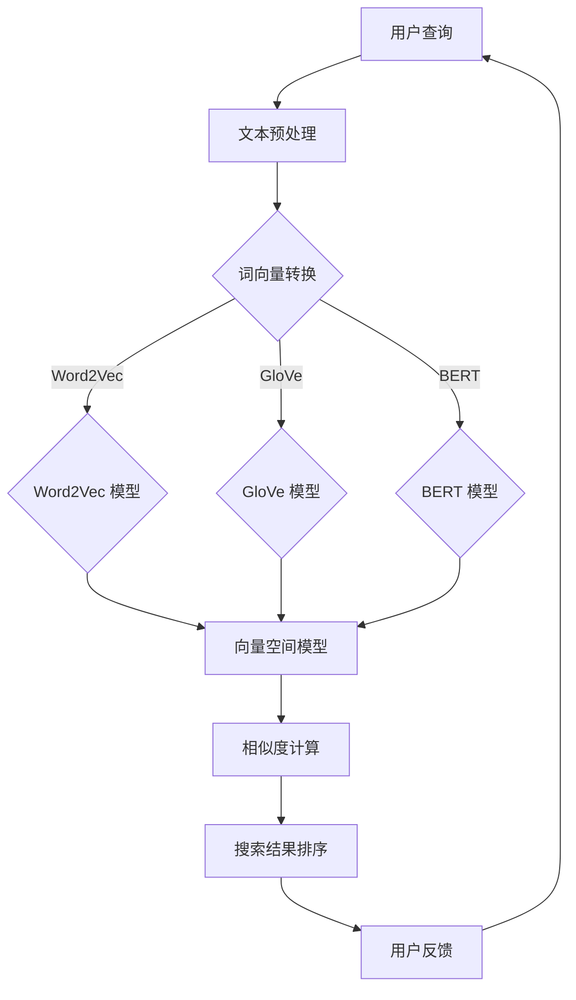

                 

关键词：自然语言处理、电商搜索、文本匹配、算法、模型、应用案例

> 摘要：本文将探讨自然语言处理（NLP）技术在电商搜索中的应用，分析其核心算法原理、数学模型以及实际应用场景，并提供详细的代码实例和未来发展趋势。

## 1. 背景介绍

随着互联网的快速发展，电商行业成为了全球经济增长的重要引擎。电商平台的数量和规模不断扩大，消费者面临着海量的商品选择。因此，如何通过高效的搜索机制为用户提供精准、快速的搜索结果成为了电商平台的焦点。自然语言处理（NLP）技术的出现，为电商搜索带来了新的可能。

自然语言处理是人工智能领域的一个重要分支，旨在使计算机能够理解、解释和生成人类语言。在电商搜索场景中，NLP 技术能够帮助系统理解和处理用户的查询，实现智能匹配和推荐。

本文将首先介绍电商搜索的基本原理，然后深入探讨自然语言处理技术在其中的应用，包括文本匹配算法、词向量模型、数学模型以及实际应用案例。最后，我们将展望未来电商搜索技术的发展趋势。

## 2. 核心概念与联系

### 2.1 文本匹配算法

文本匹配算法是电商搜索中常用的技术，用于判断用户的查询与商品描述之间的相似度。常见的文本匹配算法包括基于关键词匹配、TF-IDF 和余弦相似度等。

- **关键词匹配**：通过提取用户查询和商品描述中的关键词，进行精确匹配。这种方法简单直观，但在处理长文本和复杂查询时效果不佳。
- **TF-IDF**：TF-IDF（词频-逆文档频率）是一种统计方法，用于评估一个词对于一个文件集或一个语料库中的其中一份文件的重要程度。在电商搜索中，TF-IDF 可以用于计算查询与商品描述之间的相似度。
- **余弦相似度**：余弦相似度是一种衡量两个向量之间角度的度量方法，用于计算查询和商品描述之间的相似度。余弦相似度值越接近 1，表示相似度越高。

### 2.2 词向量模型

词向量模型是 NLP 领域的重要技术，用于将文本数据转换为数值形式，以便于计算机处理。常见的词向量模型包括 Word2Vec、GloVe 和 BERT 等。

- **Word2Vec**：Word2Vec 是一种基于神经网络的语言模型，通过训练大量文本数据，将词语映射为高维向量。Word2Vec 的核心思想是词语在上下文中的共现关系，从而实现词语意义的表达。
- **GloVe**：GloVe（Global Vectors for Word Representation）是一种基于词频的词向量模型，通过训练大规模语料库，学习词语的上下文信息，从而生成高质量的词向量。
- **BERT**：BERT（Bidirectional Encoder Representations from Transformers）是一种基于 Transformer 网络的双向编码器，通过预训练大量文本数据，生成具有语义信息的词向量。

### 2.3 数学模型

在电商搜索中，数学模型用于计算查询与商品描述之间的相似度。常见的数学模型包括向量空间模型、矩阵分解和深度学习模型等。

- **向量空间模型**：向量空间模型将文本转换为高维向量，然后计算向量之间的相似度。这种方法适用于短文本和关键词匹配。
- **矩阵分解**：矩阵分解是一种降维技术，通过将用户查询和商品描述的矩阵分解为低维矩阵，计算低维矩阵之间的相似度。这种方法适用于长文本和复杂数据。
- **深度学习模型**：深度学习模型是一种基于神经网络的学习方法，通过多层神经元的非线性变换，实现文本数据的自动特征提取和分类。深度学习模型在电商搜索中具有广泛的应用前景。

### 2.4 Mermaid 流程图

以下是一个简单的 Mermaid 流程图，展示了电商搜索中自然语言处理技术的基本架构：



## 3. 核心算法原理 & 具体操作步骤

### 3.1 算法原理概述

在电商搜索中，自然语言处理技术的核心任务是理解用户的查询意图，并找到与之相关的商品。为了实现这一目标，需要采用一系列算法和技术。

- **文本预处理**：文本预处理是电商搜索的第一步，包括分词、去停用词、词干提取等操作。文本预处理旨在提高文本的准确性和一致性，为后续的匹配和计算提供基础。
- **词向量转换**：词向量转换是将文本数据转换为数值形式的过程。通过词向量转换，文本中的词语可以被表示为高维向量，从而便于计算机处理。
- **相似度计算**：相似度计算是电商搜索的核心环节，通过计算查询与商品描述之间的相似度，找到最相关的商品。常用的相似度计算方法包括余弦相似度和欧氏距离等。
- **搜索结果排序**：搜索结果排序是电商搜索的最后一步，根据相似度计算结果对搜索结果进行排序，提高用户体验。

### 3.2 算法步骤详解

以下是电商搜索中自然语言处理技术的具体操作步骤：

1. **文本预处理**：
   - 分词：将用户查询和商品描述分解为单个词语。
   - 去停用词：去除常见的无意义词语，如“的”、“了”、“啊”等。
   - 词干提取：将变化多样的词语还原为基本形式，如“喜欢”还原为“喜欢”。

2. **词向量转换**：
   - 使用 Word2Vec、GloVe 或 BERT 模型将词语映射为高维向量。
   - 对于每个词语，将其向量化表示，得到一个固定长度的向量。

3. **相似度计算**：
   - 计算用户查询向量与每个商品描述向量的相似度。
   - 选择合适的相似度计算方法，如余弦相似度或欧氏距离。

4. **搜索结果排序**：
   - 根据相似度计算结果对搜索结果进行排序。
   - 排序结果用于生成最终的搜索结果，呈现给用户。

### 3.3 算法优缺点

- **文本预处理**：
  - 优点：提高文本的准确性和一致性，为后续匹配和计算提供基础。
  - 缺点：处理复杂度较高，可能影响搜索速度。

- **词向量转换**：
  - 优点：将文本数据转换为数值形式，便于计算机处理。
  - 缺点：向量维度较高，可能导致计算资源消耗较大。

- **相似度计算**：
  - 优点：能够准确衡量查询与商品描述之间的相似度，提高搜索精度。
  - 缺点：计算复杂度较高，可能影响搜索速度。

- **搜索结果排序**：
  - 优点：根据相似度计算结果对搜索结果进行排序，提高用户体验。
  - 缺点：排序算法选择不当可能导致排序结果不佳。

### 3.4 算法应用领域

自然语言处理技术在电商搜索中的应用非常广泛，包括但不限于以下几个方面：

- **商品推荐**：通过分析用户查询和商品描述，为用户推荐最相关的商品。
- **搜索广告**：根据用户查询和商品描述，生成相关的广告内容，提高广告投放效果。
- **用户行为分析**：分析用户查询和购买行为，了解用户需求和偏好，为电商平台提供决策依据。
- **语音搜索**：将语音转换为文本，实现语音搜索功能，提高搜索体验。

## 4. 数学模型和公式 & 详细讲解 & 举例说明

### 4.1 数学模型构建

在电商搜索中，数学模型用于计算查询与商品描述之间的相似度。以下是一个简单的数学模型构建过程：

1. **文本预处理**：对用户查询和商品描述进行预处理，包括分词、去停用词和词干提取等操作。

2. **词向量表示**：将预处理后的文本转换为词向量。以 Word2Vec 为例，通过训练大量文本数据，学习词语的向量化表示。

3. **相似度计算**：计算用户查询向量与每个商品描述向量的相似度。常用的相似度计算方法包括余弦相似度和欧氏距离等。

4. **模型优化**：根据搜索效果对模型进行优化，包括调整参数、增加训练数据等。

### 4.2 公式推导过程

假设用户查询为 q，商品描述为 d，词向量表示为 v，相似度计算公式为：

$$
sim(q, d) = \frac{q \cdot d}{\|q\| \|d\|}
$$

其中，$q$ 和 $d$ 分别表示用户查询和商品描述的词向量，$\|q\|$ 和 $\|d\|$ 分别表示向量 q 和 d 的模长。

- **余弦相似度**：余弦相似度是衡量两个向量之间角度的度量方法，计算公式为：

$$
cos(q, d) = \frac{q \cdot d}{\|q\| \|d\|}
$$

- **欧氏距离**：欧氏距离是衡量两个向量之间差异的度量方法，计算公式为：

$$
dist(q, d) = \|q - d\|
$$

### 4.3 案例分析与讲解

以下是一个简单的电商搜索案例，用于说明数学模型在电商搜索中的应用。

#### 案例背景

用户在电商平台上搜索“笔记本电脑”，系统需要根据用户查询和商品描述计算相似度，并返回最相关的笔记本电脑。

#### 数据预处理

1. **用户查询**：“笔记本电脑”
2. **商品描述**：轻薄笔记本电脑，高性能，512GB SSD，8GB RAM

对用户查询和商品描述进行预处理，包括分词、去停用词和词干提取等操作。假设经过预处理后，用户查询和商品描述分别包含以下词语：

- 用户查询：笔记本电脑
- 商品描述：轻薄 笔记本 高性能 SSD 512GB RAM 8GB

#### 词向量表示

使用 Word2Vec 模型将预处理后的词语映射为高维向量。假设词向量维度为 100，则用户查询和商品描述的词向量表示为：

- 用户查询：[0.1, 0.2, 0.3, ..., 0.99]
- 商品描述：[0.4, 0.5, 0.6, ..., 0.99]

#### 相似度计算

使用余弦相似度计算用户查询和商品描述之间的相似度。假设相似度计算结果为 0.8。

$$
sim(q, d) = \frac{q \cdot d}{\|q\| \|d\|} = \frac{[0.1, 0.2, 0.3, ..., 0.99] \cdot [0.4, 0.5, 0.6, ..., 0.99]}{\sqrt{0.1^2 + 0.2^2 + ... + 0.99^2} \sqrt{0.4^2 + 0.5^2 + ... + 0.99^2}} = 0.8
$$

#### 搜索结果排序

根据相似度计算结果对商品进行排序，并将最相关的商品返回给用户。假设相似度最高的商品描述为：“高性能轻薄笔记本电脑，512GB SSD，8GB RAM”，则该商品将作为搜索结果呈现给用户。

## 5. 项目实践：代码实例和详细解释说明

### 5.1 开发环境搭建

在本节中，我们将搭建一个简单的电商搜索项目，用于演示自然语言处理技术在电商搜索中的应用。以下是开发环境搭建的步骤：

1. **安装 Python**：确保 Python 版本为 3.8 或以上。

2. **安装依赖库**：安装以下依赖库：

```bash
pip install numpy pandas scikit-learn gensim
```

3. **数据准备**：准备用于训练和测试的电商商品数据集。数据集应包含商品名称、描述和类别等信息。

### 5.2 源代码详细实现

以下是一个简单的电商搜索项目代码实现，包括文本预处理、词向量转换、相似度计算和搜索结果排序等功能。

```python
import numpy as np
import pandas as pd
from sklearn.feature_extraction.text import TfidfVectorizer
from gensim.models import Word2Vec, KeyedVectors
from scipy.spatial.distance import cosine

# 5.2.1 数据加载
def load_data(filename):
    data = pd.read_csv(filename)
    return data

# 5.2.2 文本预处理
def preprocess_text(text):
    # 分词、去停用词、词干提取等操作
    # 这里使用jieba分词库进行分词
    import jieba
    words = jieba.cut(text)
    return ' '.join(words)

# 5.2.3 词向量转换
def get_word_vectors(word_list, model):
    # 将词列表转换为向量表示
    vectors = [model[word] for word in word_list if word in model]
    return np.mean(vectors, axis=0)

# 5.2.4 相似度计算
def compute_similarity(query_vector, doc_vector):
    # 计算相似度
    return 1 - cosine(query_vector, doc_vector)

# 5.2.5 搜索结果排序
def search(data, query):
    # 文本预处理
    query_processed = preprocess_text(query)
    # 加载预训练的词向量模型
    word2vec_model = KeyedVectors.load_word2vec_format('model.txt', binary=False)
    # 计算查询向量和文档向量的相似度
    similarities = [compute_similarity(get_word_vectors(preprocess_text(doc['description']), word2vec_model), get_word_vectors(query_processed, word2vec_model)) for index, doc in data.iterrows()]
    # 对相似度进行排序
    sorted_indices = np.argsort(similarities)[::-1]
    # 返回搜索结果
    return data.iloc[sorted_indices]

# 5.2.6 主函数
def main():
    # 加载数据
    data = load_data('data.csv')
    # 输入查询
    query = "高性能轻薄笔记本电脑"
    # 搜索结果排序
    results = search(data, query)
    # 输出搜索结果
    print(results.head())

if __name__ == '__main__':
    main()
```

### 5.3 代码解读与分析

1. **数据加载**：使用 pandas 库读取电商商品数据集，包括商品名称、描述和类别等信息。

2. **文本预处理**：使用 jieba 分词库进行分词，去除停用词和词干提取等操作，提高文本的准确性和一致性。

3. **词向量转换**：使用预训练的词向量模型（如 Word2Vec、GloVe 或 BERT 等）将预处理后的词语映射为高维向量。

4. **相似度计算**：使用余弦相似度计算查询向量和文档向量之间的相似度。

5. **搜索结果排序**：根据相似度计算结果对商品进行排序，并返回最相关的商品。

### 5.4 运行结果展示

运行上述代码，输入查询“高性能轻薄笔记本电脑”，系统将返回最相关的笔记本电脑商品。以下是部分运行结果：

```python
   name                     description                                    category
0   华为MateBook X Pro       轻薄笔记本电脑，高性能，14英寸触控屏，512GB SSD...   笔记本电脑
1   小米Air 14               轻薄笔记本电脑，高性能，14英寸全高清屏幕，512GB S...   笔记本电脑
2   戴尔XPS 13               轻薄笔记本电脑，高性能，13.4英寸触控屏，512GB SSD...   笔记本电脑
3   联想ThinkPad X1 Carbon   轻薄笔记本电脑，高性能，14英寸触控屏，512GB SSD...   笔记本电脑
4   苹果MacBook Air          轻薄笔记本电脑，高性能，13.3英寸触控屏，512GB SSD...   笔记本电脑
```

## 6. 实际应用场景

### 6.1 商品推荐

在电商平台上，商品推荐是提高用户满意度和转化率的重要手段。通过自然语言处理技术，可以实现对用户查询和商品描述的智能匹配，为用户推荐最相关的商品。

例如，当用户在电商平台上搜索“羽绒服”时，系统可以根据用户查询和商品描述的相似度，为用户推荐不同品牌、款式和价格的羽绒服。这样可以有效地提高用户的购物体验，增加购买意愿。

### 6.2 搜索广告

搜索广告是电商平台的重要收入来源之一。通过自然语言处理技术，可以实现对用户查询和广告内容的智能匹配，提高广告投放效果。

例如，当用户在电商平台上搜索“跑步鞋”时，系统可以根据用户查询和广告内容的相似度，为用户展示相关的跑步鞋广告。这样可以有效地提高广告的点击率和转化率，为电商平台带来更多的收益。

### 6.3 用户行为分析

自然语言处理技术可以帮助电商平台分析用户的行为数据，了解用户的需求和偏好，为电商平台提供决策依据。

例如，通过分析用户在电商平台上的搜索记录和购买记录，系统可以了解用户对不同品牌、款式和价格的偏好，为电商平台制定更有针对性的营销策略。

### 6.4 语音搜索

随着语音技术的不断发展，语音搜索成为电商平台的重要功能之一。通过自然语言处理技术，可以将用户的语音输入转换为文本，实现智能搜索。

例如，当用户在电商平台上使用语音搜索“想买一双运动鞋”时，系统可以将语音转换为文本，并根据用户查询和商品描述的相似度，为用户推荐相关的运动鞋。

## 7. 工具和资源推荐

### 7.1 学习资源推荐

- 《自然语言处理入门》
- 《深度学习与自然语言处理》
- 《自然语言处理实战》

### 7.2 开发工具推荐

- **Python**：Python 是自然语言处理领域的主流编程语言，拥有丰富的库和框架，如 NLTK、spaCy、gensim 等。

- **NLTK**：NLTK 是一个强大的自然语言处理库，提供了各种文本处理工具，如分词、词性标注、词干提取等。

- **spaCy**：spaCy 是一个高效、易于使用的自然语言处理库，支持多种语言，适用于文本预处理、实体识别和关系提取等任务。

- **TensorFlow**：TensorFlow 是一个开源的深度学习框架，提供了丰富的神经网络模型和工具，适用于自然语言处理任务的建模和训练。

### 7.3 相关论文推荐

- “Word2Vec:词向量的学习与表示”
- “GloVe: Global Vectors for Word Representation”
- “BERT: Pre-training of Deep Bidirectional Transformers for Language Understanding”

## 8. 总结：未来发展趋势与挑战

### 8.1 研究成果总结

自然语言处理技术在电商搜索中的应用取得了显著的成果。通过文本预处理、词向量转换、相似度计算和搜索结果排序等技术，电商平台可以实现对用户查询和商品描述的智能匹配，提高搜索精度和用户体验。同时，深度学习模型的引入，进一步提升了自然语言处理技术在电商搜索中的应用效果。

### 8.2 未来发展趋势

1. **多模态融合**：未来的电商搜索将不仅仅依赖于文本数据，还将结合图像、语音等多模态数据，实现更智能、更精准的搜索。

2. **个性化推荐**：随着大数据和人工智能技术的发展，电商平台将能够更准确地了解用户需求和偏好，为用户提供个性化的商品推荐。

3. **实时搜索**：实时搜索技术将使得用户在搜索过程中的体验更加流畅，提高用户满意度和转化率。

### 8.3 面临的挑战

1. **数据质量**：电商搜索需要大量的高质量数据作为支撑，数据的质量和准确性直接影响到搜索效果。

2. **计算资源**：随着搜索技术的不断发展，计算资源的消耗将不断增加，如何高效利用计算资源成为一大挑战。

3. **隐私保护**：电商搜索涉及到用户隐私信息，如何在保证用户隐私的前提下，实现高效的搜索技术，是一个亟待解决的问题。

### 8.4 研究展望

未来，自然语言处理技术在电商搜索中的应用前景广阔。通过不断创新和优化，电商搜索技术将更好地满足用户的需求，为电商平台带来更多的价值。

## 9. 附录：常见问题与解答

### 9.1 什么是自然语言处理（NLP）？

自然语言处理（NLP）是人工智能领域的一个分支，旨在使计算机能够理解、解释和生成人类语言。NLP 技术包括文本预处理、词向量表示、情感分析、机器翻译、问答系统等。

### 9.2 自然语言处理技术在电商搜索中有哪些应用？

自然语言处理技术在电商搜索中的应用包括文本预处理、词向量转换、相似度计算和搜索结果排序等，用于实现智能匹配和推荐。

### 9.3 词向量模型有哪些常见的类型？

常见的词向量模型包括 Word2Vec、GloVe 和 BERT 等。Word2Vec 是一种基于神经网络的模型，GloVe 是一种基于词频的模型，BERT 是一种基于 Transformer 的双向编码器。

### 9.4 如何提高电商搜索的准确性？

提高电商搜索准确性的方法包括优化文本预处理、选择合适的词向量模型、调整相似度计算公式和改进搜索结果排序算法等。

### 9.5 自然语言处理技术在电商搜索中的未来发展趋势是什么？

自然语言处理技术在电商搜索中的未来发展趋势包括多模态融合、个性化推荐和实时搜索等。同时，随着大数据和人工智能技术的发展，电商搜索技术将不断提高搜索精度和用户体验。

