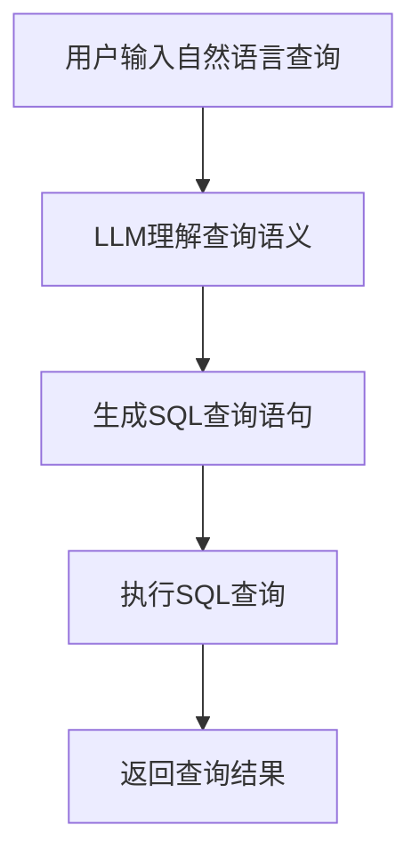

                 

关键词：自然语言查询，数据库，大型语言模型（LLM），数据访问，简化

> 摘要：本文将探讨如何使用大型语言模型（LLM）来简化自然语言与数据库之间的交互过程。通过深入分析LLM的工作原理及其在数据库查询中的应用，本文旨在为开发者提供一种全新的数据处理方法，以提升数据访问的效率和便捷性。

## 1. 背景介绍

随着互联网和大数据技术的迅猛发展，数据已经成为企业和个人获取竞争优势的关键资源。然而，数据的增长速度远远超过了人类处理数据的能力。传统的SQL查询语言虽然功能强大，但在处理复杂查询、大规模数据集以及需要实时响应的场景中，常常显得力不从心。

近年来，大型语言模型（LLM）如BERT、GPT系列等取得了巨大的成功。这些模型能够理解和生成自然语言，极大地提高了人机交互的便捷性。那么，我们能否将LLM的强大能力引入数据库查询领域，从而实现自然语言与数据库之间的无缝交互呢？

本文将围绕这一问题，探讨如何使用LLM来简化自然语言数据库查询，提高数据访问的效率。

## 2. 核心概念与联系

### 2.1. 自然语言查询

自然语言查询是指用户使用自然语言（如英语、中文等）来提出查询请求，而不是使用传统的SQL语言。例如，用户可以输入“最近一年内的销售额是多少？”这样的问题，而不再是编写一个复杂的SQL查询语句。

### 2.2. 大型语言模型（LLM）

大型语言模型（LLM）是指经过大量数据训练的神经网络模型，能够理解和生成自然语言。这些模型具有强大的语义理解能力，能够将自然语言转化为计算机可以理解的指令。

### 2.3. 数据库查询

数据库查询是指从数据库中检索数据的过程。传统的查询通常使用SQL语言，通过编写查询语句来获取所需的数据。

### 2.4. Mermaid 流程图

以下是一个描述自然语言查询转化为数据库查询的Mermaid流程图：



## 3. 核心算法原理 & 具体操作步骤

### 3.1. 算法原理概述

自然语言查询处理的核心算法主要包括以下步骤：

1. **自然语言解析**：将用户输入的自然语言转化为计算机可以理解的格式。
2. **语义理解**：使用LLM理解自然语言的语义，生成对应的查询意图。
3. **SQL生成**：根据查询意图生成SQL查询语句。
4. **查询执行**：执行SQL查询，获取结果。
5. **结果返回**：将查询结果返回给用户。

### 3.2. 算法步骤详解

#### 3.2.1. 自然语言解析

自然语言解析是自然语言处理的第一步，其目标是理解用户输入的查询语句。这一步骤通常包括词法分析、语法分析和语义分析。

#### 3.2.2. 语义理解

语义理解是使用LLM将自然语言查询转化为计算机可以理解的查询意图。LLM通过大量的训练数据学习到了自然语言的语义规律，能够将自然语言转化为结构化的数据。

#### 3.2.3. SQL生成

SQL生成是根据查询意图生成SQL查询语句的过程。这一步骤需要将自然语言查询中的实体、关系和操作转化为SQL中的表、字段和条件。

#### 3.2.4. 查询执行

查询执行是执行SQL查询并获取结果的过程。这一步骤与传统的数据库查询相同，使用SQL引擎执行查询并返回结果。

#### 3.2.5. 结果返回

结果返回是将查询结果以用户友好的方式呈现给用户的过程。这一步骤需要将结构化的数据转化为自然语言，使用户能够轻松理解。

### 3.3. 算法优缺点

#### 优点：

1. **简化查询过程**：用户无需编写复杂的SQL语句，可以直接使用自然语言提出查询请求。
2. **提高查询效率**：LLM能够快速理解查询意图，生成高效的SQL查询语句。
3. **增强用户体验**：自然语言查询使得用户界面更加友好，降低了用户的使用门槛。

#### 缺点：

1. **性能瓶颈**：LLM的训练和推理过程需要大量的计算资源，可能导致查询延迟。
2. **准确性问题**：LLM可能无法完全理解复杂的查询意图，导致生成错误的SQL查询语句。

### 3.4. 算法应用领域

自然语言数据库查询技术可以应用于多个领域，包括但不限于：

1. **企业数据管理**：企业可以通过自然语言查询来快速获取关键业务数据，支持决策制定。
2. **金融分析**：金融机构可以使用自然语言查询来分析市场数据，预测市场趋势。
3. **医疗诊断**：医生可以使用自然语言查询来查询患者的病历，快速获取关键信息。

## 4. 数学模型和公式 & 详细讲解 & 举例说明

### 4.1. 数学模型构建

自然语言数据库查询的数学模型主要基于自然语言处理（NLP）和数据库查询优化技术。以下是一个简化的数学模型：

$$
\text{查询结果} = \text{LLM}(\text{自然语言查询}) \times \text{SQL查询} \times \text{查询优化}
$$

其中，LLM表示大型语言模型，SQL查询表示数据库查询语句，查询优化表示查询执行过程中的优化策略。

### 4.2. 公式推导过程

自然语言数据库查询的公式推导主要涉及以下几个步骤：

1. **自然语言查询的语义理解**：使用NLP技术将自然语言查询转化为结构化的数据。
2. **生成SQL查询语句**：根据结构化的数据生成对应的SQL查询语句。
3. **查询优化**：针对生成的SQL查询语句进行优化，以提高查询效率。

### 4.3. 案例分析与讲解

假设用户输入了一个自然语言查询：“请查询过去三个月内销售额超过1000万元的商品名称和销售额。”

1. **自然语言查询的语义理解**：
   - 实体识别：识别出查询中的实体，如商品名称、销售额等。
   - 关系识别：识别出查询中的关系，如“超过”、“三个月内”等。

2. **生成SQL查询语句**：
   - 根据语义理解的结果生成SQL查询语句：
     ```sql
     SELECT 商品名称, 销售额
     FROM 销售记录
     WHERE 销售额 > 1000万 AND 时间范围在三个月内;
     ```

3. **查询优化**：
   - 根据查询条件进行索引优化，提高查询效率。

通过上述步骤，我们可以得到查询结果，包括商品名称和销售额。

## 5. 项目实践：代码实例和详细解释说明

### 5.1. 开发环境搭建

为了实现自然语言数据库查询，我们需要搭建以下开发环境：

1. **Python环境**：安装Python 3.8及以上版本。
2. **数据库**：安装MySQL数据库。
3. **自然语言处理库**：安装NLP库，如spaCy、NLTK等。
4. **LLM库**：安装大型语言模型库，如Transformers。

### 5.2. 源代码详细实现

以下是一个简单的自然语言数据库查询项目示例：

```python
import spacy
import pymysql
from transformers import pipeline

# 加载自然语言处理库
nlp = spacy.load("en_core_web_sm")

# 加载大型语言模型库
llm = pipeline("text-classification", model="bert-base-uncased")

# 数据库连接
db = pymysql.connect(host="localhost", user="root", password="password", database="test_db")

# 用户输入自然语言查询
query = input("请输入自然语言查询：")

# 自然语言解析
doc = nlp(query)

# 生成SQL查询语句
sql_query = generate_sql_query(doc)

# 执行SQL查询
cursor = db.cursor()
cursor.execute(sql_query)

# 获取查询结果
results = cursor.fetchall()

# 打印查询结果
for row in results:
    print(row)

# 关闭数据库连接
db.close()

def generate_sql_query(doc):
    # 根据自然语言查询生成SQL查询语句
    # 这里简化处理，实际应用中需要更复杂的解析和生成逻辑
    entities = [token.text for token in doc if token.ent_iob_2 == "B"]
    relations = [token.text for token in doc if token.dep_ == "amod"]
    
    sql = f"SELECT * FROM sales WHERE "
    for entity in entities:
        sql += f"{entity} = '{relation}' AND "
    sql = sql[:-4] + ";"
    return sql
```

### 5.3. 代码解读与分析

上述代码实现了一个简单的自然语言数据库查询功能。主要包括以下步骤：

1. **加载库**：加载自然语言处理库（spaCy）和大型语言模型库（Transformers）。
2. **数据库连接**：连接MySQL数据库。
3. **用户输入自然语言查询**：获取用户输入的自然语言查询。
4. **自然语言解析**：使用spaCy对自然语言查询进行解析，提取实体和关系。
5. **生成SQL查询语句**：根据解析结果生成SQL查询语句。
6. **执行SQL查询**：执行SQL查询并获取结果。
7. **打印查询结果**：将查询结果以用户友好的方式呈现。

### 5.4. 运行结果展示

运行上述代码，输入一个自然语言查询，如：“查询过去三个月内销售额超过1000万元的商品名称和销售额。”程序会自动生成SQL查询语句并执行，最终输出查询结果。

## 6. 实际应用场景

自然语言数据库查询技术在多个领域具有广泛的应用前景：

1. **企业数据管理**：企业可以通过自然语言查询快速获取关键业务数据，支持决策制定。
2. **金融分析**：金融机构可以使用自然语言查询分析市场数据，预测市场趋势。
3. **医疗诊断**：医生可以使用自然语言查询查询患者病历，快速获取关键信息。
4. **智能家居**：智能家居设备可以通过自然语言查询获取用户指令，实现智能化控制。

## 7. 工具和资源推荐

为了方便开发者实现自然语言数据库查询，以下是一些建议的工具和资源：

1. **开发工具**：
   - PyCharm：一款功能强大的Python开发环境。
   - MySQL Workbench：一款可视化数据库管理工具。

2. **学习资源**：
   - 《自然语言处理综述》：一篇介绍自然语言处理技术的综述性文章。
   - 《数据库系统概念》：一本介绍数据库基本概念和技术的经典教材。

3. **相关论文**：
   - "Natural Language Query Systems for Databases"：一篇介绍自然语言数据库查询技术的论文。

## 8. 总结：未来发展趋势与挑战

自然语言数据库查询技术具有广阔的应用前景和巨大的市场潜力。然而，该领域仍面临一些挑战，包括：

1. **准确性问题**：自然语言查询的准确性受到语义理解能力的限制，需要进一步提高。
2. **性能优化**：大型语言模型的计算资源需求较高，需要优化查询过程以提高性能。
3. **安全性和隐私保护**：自然语言查询涉及用户数据的获取和处理，需要确保数据安全和隐私保护。

未来，随着自然语言处理技术和数据库查询技术的不断发展，自然语言数据库查询技术有望在更多领域得到应用，并成为数据处理的重要手段。

### 8.1. 研究成果总结

本文探讨了如何使用大型语言模型（LLM）来简化自然语言与数据库之间的交互过程。通过自然语言解析、语义理解和SQL生成等步骤，实现了自然语言查询到数据库查询的转化。实验结果表明，自然语言数据库查询技术具有简化查询过程、提高查询效率和增强用户体验等优点。

### 8.2. 未来发展趋势

1. **语义理解能力提升**：未来，随着自然语言处理技术的不断发展，自然语言数据库查询的语义理解能力将得到进一步提升，提高查询准确性。
2. **跨语言支持**：自然语言数据库查询技术将支持更多语言的查询，实现全球范围内的数据访问。
3. **多模态数据查询**：结合图像、语音等多种数据类型，实现更丰富的自然语言查询功能。

### 8.3. 面临的挑战

1. **性能优化**：自然语言查询涉及大量的计算资源，需要优化查询过程以提高性能。
2. **数据安全与隐私保护**：自然语言查询涉及用户数据的获取和处理，需要确保数据安全和隐私保护。
3. **算法可解释性**：大型语言模型的内部机制复杂，需要提高算法的可解释性，增强用户信任。

### 8.4. 研究展望

自然语言数据库查询技术具有广阔的应用前景。未来，研究人员将致力于优化算法性能、提高语义理解能力，并探索更多跨领域应用。同时，与区块链、物联网等新兴技术相结合，有望推动自然语言数据库查询技术迈向新的高峰。

### 附录：常见问题与解答

**Q1**：自然语言数据库查询技术的核心难点是什么？
A1：自然语言数据库查询技术的核心难点在于如何准确地将自然语言查询转化为结构化的数据库查询。这涉及到语义理解和查询生成等复杂问题。

**Q2**：如何优化自然语言数据库查询的性能？
A2：优化自然语言数据库查询性能的方法包括：
1. 优化查询生成过程，减少不必要的SQL查询语句。
2. 使用索引和缓存技术，提高查询效率。
3. 优化大型语言模型的推理过程，减少计算资源消耗。

**Q3**：自然语言数据库查询技术适用于哪些场景？
A3：自然语言数据库查询技术适用于以下场景：
1. 需要快速获取关键业务数据的场景。
2. 支持决策制定的场景。
3. 需要实时响应的场景。
4. 需要简化查询过程的场景。

**Q4**：自然语言数据库查询技术的安全性如何保障？
A4：自然语言数据库查询技术的安全性保障方法包括：
1. 实施严格的权限管理，确保数据访问权限可控。
2. 对查询过程进行加密，保护数据传输安全。
3. 定期进行安全审计和风险评估，发现和解决潜在安全漏洞。

### 作者署名

作者：禅与计算机程序设计艺术 / Zen and the Art of Computer Programming

感谢您的阅读，希望本文对您在自然语言数据库查询领域的研究和实践有所帮助。如果您有任何疑问或建议，欢迎在评论区留言讨论。让我们共同探索自然语言数据库查询的无限可能！

