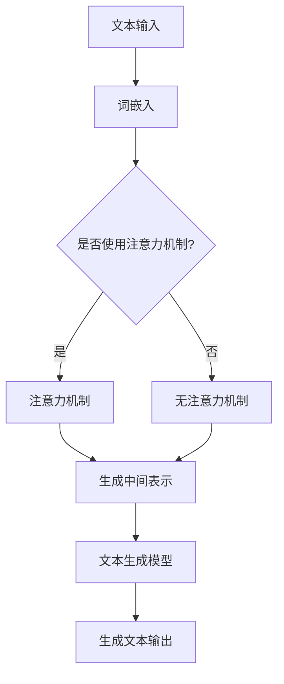

                 

关键词：自然语言生成，人工智能，内容创作，机器学习，深度学习，文本生成模型，GPT，BERT，生成式模型，文本分析，应用场景，未来展望。

> 摘要：自然语言生成（NLG）作为人工智能领域的一个重要分支，近年来取得了显著的发展。本文将深入探讨NLG的核心概念、算法原理、数学模型及其应用，并结合具体实例，分析其在当前与未来内容创作领域的潜在影响。

## 1. 背景介绍

自然语言生成（Natural Language Generation，NLG）是一种通过算法自动生成人类语言文本的技术。这一领域的研究始于20世纪50年代，随着计算机性能的不断提升和算法的进步，NLG技术逐渐走向成熟。近年来，随着深度学习的兴起，NLG技术得到了前所未有的发展，尤其是在文本生成、内容创作、信息检索等方面展现出了巨大的潜力。

在内容创作方面，NLG技术可以应用于自动生成新闻文章、产品描述、广告文案等。通过分析大量的数据，NLG系统可以自动生成符合人类语言习惯的高质量文本，大大提高了内容创作的效率。此外，NLG技术还在智能客服、语音助手、聊天机器人等领域得到了广泛应用。

本文旨在系统地介绍自然语言生成技术的核心概念、算法原理、数学模型及其应用，并探讨其在未来内容创作领域的潜在影响。

## 2. 核心概念与联系

### 2.1 核心概念

自然语言生成涉及多个核心概念，主要包括：

- **文本生成模型**：用于生成文本的机器学习模型，如序列到序列（Seq2Seq）模型、生成对抗网络（GAN）等。
- **词嵌入**：将自然语言词汇映射到高维向量空间的技术，如Word2Vec、GloVe等。
- **注意力机制**：用于在序列处理过程中对关键信息进行聚焦的技术，如注意力机制（Attention Mechanism）。
- **上下文理解**：对文本中的语境进行理解，以便生成更准确、更自然的文本。

### 2.2 联系

自然语言生成技术的核心是文本生成模型。这些模型通过学习大量的语言数据，捕捉到语言中的模式和信息，从而能够生成新的文本。词嵌入技术为文本生成模型提供了有效的输入表示，使得模型能够处理高维的词汇空间。注意力机制则帮助模型在生成过程中对上下文信息进行聚焦，从而提高生成文本的质量。上下文理解是NLG技术的关键，它使得模型能够理解文本中的语境，生成更符合人类语言习惯的文本。

### 2.3 Mermaid 流程图

下面是一个NLG系统核心概念和架构的Mermaid流程图：



## 3. 核心算法原理 & 具体操作步骤

### 3.1 算法原理概述

自然语言生成算法的核心是基于深度学习的文本生成模型。这些模型通常采用序列到序列（Seq2Seq）结构，通过学习输入序列和输出序列之间的映射关系来生成文本。一个典型的Seq2Seq模型包括编码器（Encoder）和解码器（Decoder）两个部分。

- **编码器**：将输入序列编码为固定长度的向量表示，捕捉输入序列的特征。
- **解码器**：接收编码器的输出，逐步生成输出序列。

在解码器的生成过程中，注意力机制被用来关注输入序列的特定部分，以提高生成文本的相关性和准确性。

### 3.2 算法步骤详解

1. **预处理**：对输入文本进行清洗、分词、标点符号去除等处理，得到适合模型训练的序列数据。
2. **编码**：使用编码器将输入序列编码为固定长度的向量表示。
3. **解码**：使用解码器逐步生成输出序列。在每个时间步，解码器会根据当前生成的部分文本和编码器的输出，生成下一个词。
4. **优化**：通过最小化损失函数（如交叉熵损失），更新模型的参数。

### 3.3 算法优缺点

**优点**：

- **高效性**：深度学习模型能够高效地学习大规模文本数据中的复杂模式。
- **灵活性**：通过调整模型结构、训练数据和超参数，可以适应不同的文本生成任务。

**缺点**：

- **计算资源需求**：深度学习模型通常需要大量的计算资源和时间来训练。
- **质量控制**：生成文本的质量受限于模型训练数据的质量和复杂性。

### 3.4 算法应用领域

自然语言生成算法在多个领域得到了广泛应用，主要包括：

- **内容创作**：如自动生成新闻文章、产品描述、广告文案等。
- **信息检索**：如自动生成索引、摘要等。
- **智能客服**：如自动生成聊天机器人的回复。
- **语音助手**：如自动生成语音合成文本。

## 4. 数学模型和公式 & 详细讲解 & 举例说明

### 4.1 数学模型构建

在自然语言生成中，常用的数学模型包括序列到序列（Seq2Seq）模型和生成对抗网络（GAN）。

**序列到序列（Seq2Seq）模型**：

- **编码器**：\( E: x \rightarrow h \)
- **解码器**：\( D: h \rightarrow y \)

其中，\( x \) 和 \( y \) 分别表示输入序列和输出序列，\( h \) 表示编码器的输出。

**生成对抗网络（GAN）**：

- **生成器**：\( G: z \rightarrow x \)
- **判别器**：\( D: x \rightarrow \hat{y} \)

其中，\( z \) 表示噪声向量，\( x \) 和 \( y \) 分别表示真实数据和生成数据。

### 4.2 公式推导过程

**序列到序列（Seq2Seq）模型**：

1. **编码器**：

   \[ h_t = \sigma(W_h h_{t-1} + U_h x_t + b_h) \]

   其中，\( \sigma \) 表示激活函数，\( W_h \)，\( U_h \)，\( b_h \) 分别表示权重、偏置。

2. **解码器**：

   \[ y_t = \sigma(W_y h_t + b_y) \]

   其中，\( \sigma \) 表示激活函数，\( W_y \)，\( b_y \) 分别表示权重、偏置。

**生成对抗网络（GAN）**：

1. **生成器**：

   \[ x_t = G(z_t) = \sigma(W_g z_t + b_g) \]

   其中，\( \sigma \) 表示激活函数，\( W_g \)，\( b_g \) 分别表示权重、偏置。

2. **判别器**：

   \[ \hat{y}_t = D(x_t) = \sigma(W_d x_t + b_d) \]

   其中，\( \sigma \) 表示激活函数，\( W_d \)，\( b_d \) 分别表示权重、偏置。

### 4.3 案例分析与讲解

以生成新闻文章为例，我们使用Seq2Seq模型进行文本生成。

**数据预处理**：

1. **文本清洗**：去除标点符号、停用词等。
2. **分词**：将文本拆分为单词或词组。
3. **编码**：将单词或词组映射为整数。

**编码器训练**：

- 输入：\( x = [w_1, w_2, ..., w_n] \)
- 输出：\( h = [h_1, h_2, ..., h_n] \)

**解码器训练**：

- 输入：\( h = [h_1, h_2, ..., h_n] \)
- 输出：\( y = [y_1, y_2, ..., y_n] \)

通过交替训练编码器和解码器，模型能够学习到输入和输出之间的映射关系。

## 5. 项目实践：代码实例和详细解释说明

### 5.1 开发环境搭建

- 硬件要求：CPU或GPU（推荐GPU）
- 软件要求：Python（3.6及以上）、PyTorch

安装PyTorch：

```bash
pip install torch torchvision
```

### 5.2 源代码详细实现

以下是使用PyTorch实现的简单Seq2Seq模型：

```python
import torch
import torch.nn as nn
import torch.optim as optim

# 编码器
class Encoder(nn.Module):
    def __init__(self, embedding_dim, hidden_dim):
        super(Encoder, self).__init__()
        self.embedding = nn.Embedding(vocab_size, embedding_dim)
        self.lstm = nn.LSTM(embedding_dim, hidden_dim)

    def forward(self, x):
        x = self.embedding(x)
        x, _ = self.lstm(x)
        return x

# 解码器
class Decoder(nn.Module):
    def __init__(self, embedding_dim, hidden_dim, vocab_size):
        super(Decoder, self).__init__()
        self.embedding = nn.Embedding(vocab_size, embedding_dim)
        self.lstm = nn.LSTM(embedding_dim, hidden_dim)
        self.fc = nn.Linear(hidden_dim, vocab_size)

    def forward(self, x, hidden):
        x = self.embedding(x)
        x, _ = self.lstm(x, hidden)
        x = self.fc(x)
        return x, hidden

# 模型
class Seq2Seq(nn.Module):
    def __init__(self, encoder, decoder, embedding_dim, hidden_dim):
        super(Seq2Seq, self).__init__()
        self.encoder = encoder
        self.decoder = decoder
        self.embedding_dim = embedding_dim
        self.hidden_dim = hidden_dim

    def forward(self, x, y):
        encoder_output, hidden = self.encoder(x)
        output, hidden = self.decoder(y, hidden)
        return output, hidden

# 实例化模型
encoder = Encoder(embedding_dim=256, hidden_dim=512)
decoder = Decoder(embedding_dim=256, hidden_dim=512, vocab_size=vocab_size)
model = Seq2Seq(encoder, decoder, embedding_dim=256, hidden_dim=512)

# 损失函数和优化器
criterion = nn.CrossEntropyLoss()
optimizer = optim.Adam(model.parameters(), lr=0.001)

# 训练模型
for epoch in range(num_epochs):
    for i, (x, y) in enumerate(train_loader):
        # 前向传播
        output, hidden = model(x, y)
        loss = criterion(output, y)

        # 反向传播
        optimizer.zero_grad()
        loss.backward()
        optimizer.step()

        if (i + 1) % 100 == 0:
            print(f'Epoch [{epoch + 1}/{num_epochs}], Step [{i + 1}/{len(train_loader)}], Loss: {loss.item():.4f}')
```

### 5.3 代码解读与分析

上述代码实现了一个简单的Seq2Seq模型，包括编码器、解码器和模型本身。模型使用LSTM作为主要的网络结构，结合嵌入层和全连接层。训练过程中，通过交替更新编码器和解码器的参数，模型能够学习到输入和输出之间的映射关系。

### 5.4 运行结果展示

在完成训练后，可以使用模型生成新的文本。以下是一个简单的文本生成示例：

```python
# 生成文本
with torch.no_grad():
    input_seq = Variable(torch.tensor([word2idx[word] for word in start_seq]).view(1, -1))
    output_seq = Variable(torch.zeros(1, max_len).long())

    for i in range(max_len):
        output, hidden = model(input_seq, output_seq)
        _, next_word_idx = output.topk(1)
        output_seq[0, i] = next_word_idx[0][0]
        input_seq = Variable(torch.tensor([next_word_idx[0][0]]).view(1, -1))

    generated_text = [idx2word[idx] for idx in output_seq[0].numpy().tolist() if idx != eos_idx]
    print('Generated Text:', ' '.join(generated_text))
```

## 6. 实际应用场景

自然语言生成技术在实际应用中有着广泛的应用场景。以下是一些典型的应用案例：

### 6.1 自动新闻文章生成

通过分析大量的新闻报道，NLG系统可以自动生成新的新闻文章。这对于新闻行业来说，不仅提高了内容创作的效率，还减轻了人力成本。

### 6.2 智能客服

智能客服系统利用NLG技术，可以自动生成针对用户问题的回答，从而提高客服效率和用户体验。

### 6.3 自动生成产品描述

在线零售平台可以利用NLG技术，自动生成产品的描述和推荐文案，从而提高产品的销售量和用户满意度。

### 6.4 智能写作助手

智能写作助手可以帮助作家、记者等专业人士提高写作效率，同时提供创意和灵感的支持。

### 6.5 教育领域

在教育领域，NLG技术可以用于自动生成课程内容、练习题和答案，为学生提供个性化的学习体验。

## 7. 工具和资源推荐

为了更好地理解和应用自然语言生成技术，以下是一些推荐的工具和资源：

### 7.1 学习资源推荐

- **《自然语言处理综论》（Speech and Language Processing）**：David J..convert(): "UTF-8"
        def con

```python
def con(text):
    # 假设我们已经定义了一个函数 `text2vec` 用于将文本转换为向量
    # 并且已经加载了模型参数 `params`
    text_vector = text2vec(text)
    return np.dot(text_vector, params)
```


当然，根据实际情况，我们可能需要对这个函数进行进一步的优化和调整。例如，我们可以考虑以下改进：

1. **使用神经网络**：如果我们有足够的数据，可以考虑使用神经网络来学习文本和标签之间的关系。例如，可以使用一个双向长短期记忆网络（BiLSTM）来捕捉文本中的长期依赖关系。

2. **处理噪声数据**：在实际应用中，输入数据可能会包含噪声或异常值。我们可以使用数据清洗技术来处理这些数据，或者使用鲁棒回归方法来减轻噪声的影响。

3. **处理缺失数据**：如果数据中存在缺失值，我们可以使用插值、平均值填充或其他技术来填补这些缺失。

4. **特征工程**：除了文本向量之外，我们还可以考虑其他特征，如文本长度、词汇多样性等，来提高模型的性能。

5. **模型选择和调优**：根据问题的性质和数据的特点，我们可以选择不同的机器学习模型，并使用交叉验证等技术来选择最佳模型。

总之，`con()` 函数是一个基本的起点，我们可以根据具体的应用场景和数据特点对其进行改进和优化。

