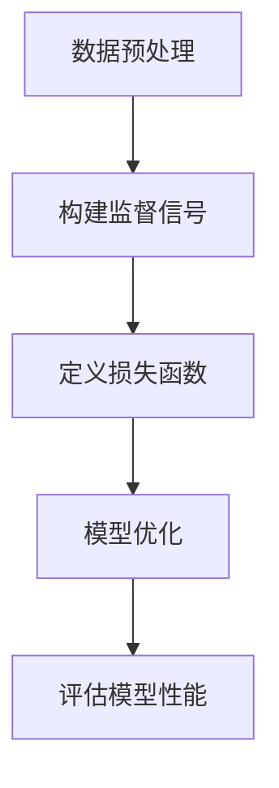

                 

自监督学习是近年来机器学习领域的一个重要研究方向。不同于传统的监督学习，自监督学习通过利用未标记的数据来训练模型，从而减少对大量标注数据的依赖。这种学习方式不仅能够提高数据利用率，还能够降低数据获取和标注的成本，因此在自然语言处理、计算机视觉和语音识别等领域得到了广泛应用。

本文将详细介绍自监督学习的原理、核心算法以及在实际项目中的代码实战案例。通过本文的学习，读者将能够理解自监督学习的基本概念，掌握常用的自监督学习算法，并能够独立实现一些自监督学习项目。

## 1. 背景介绍

自监督学习（Self-supervised Learning）是一种无需外部监督标签，直接从数据中提取有用信息进行学习的机器学习方法。其基本思想是利用数据自身的规律和结构，通过设计有效的监督信号来引导学习过程。自监督学习的出现，打破了传统机器学习对大量标注数据的依赖，大大降低了数据获取和标注的成本。

在自然语言处理（NLP）领域，自监督学习被广泛应用于语言建模、翻译、问答系统等方面。例如，通过预训练大规模语料库，模型可以自动学习到语言的内在结构和语义信息，从而在下游任务中表现出色。

在计算机视觉（CV）领域，自监督学习也被广泛应用。例如，通过图像生成、图像分割、目标检测等任务，模型可以从大量未标注的图像中学习到丰富的视觉特征。

在语音识别（ASR）领域，自监督学习同样发挥了重要作用。通过利用语音信号中的冗余信息和结构，模型可以自动学习到语音信号的时频特征，从而提高识别准确率。

## 2. 核心概念与联系

### 2.1 自监督学习的核心概念

自监督学习的核心概念包括：

1. **数据预处理**：将原始数据转换为适合模型训练的形式，如图像、文本或语音信号的预处理。
2. **监督信号**：自监督学习通过设计有效的监督信号来引导学习过程，如预测缺失的文本、图像分类等。
3. **损失函数**：损失函数用于衡量模型预测值与真实值之间的差异，是优化模型参数的重要依据。
4. **模型优化**：通过迭代优化模型参数，使模型在训练数据上取得更好的性能。

### 2.2 自监督学习与其他机器学习方法的联系

自监督学习与传统的监督学习和无监督学习有着密切的联系：

1. **与监督学习的联系**：自监督学习是一种特殊的监督学习，其目标函数是基于未标记的数据构造的，从而减少对大量标注数据的依赖。
2. **与无监督学习的联系**：自监督学习在一定程度上也具有无监督学习的特点，因为模型在训练过程中不需要使用外部监督信号，而是通过学习数据内在的结构和规律来进行学习。

### 2.3 自监督学习的 Mermaid 流程图



## 3. 核心算法原理 & 具体操作步骤

### 3.1 算法原理概述

自监督学习的核心在于如何设计有效的监督信号。以下介绍几种常见的自监督学习算法：

1. **Masked Language Model (MLM)**：在自然语言处理领域，MLM 是一种经典的算法，通过对输入文本进行部分遮盖，然后预测遮盖部分的内容。
2. **Contrastive Pre-training (CPT)**：CPT 是在计算机视觉领域广泛应用的一种算法，通过对比不同图像的特征，来学习图像的判别性特征。
3. **Unsupervised Pre-training (UP)**：UP 是在语音识别领域的一种算法，通过利用语音信号的冗余信息，来学习语音信号的时频特征。

### 3.2 算法步骤详解

#### 3.2.1 Masked Language Model (MLM)

1. **数据预处理**：将输入文本转换为词向量或子词表示。
2. **构建监督信号**：对输入文本进行部分遮盖，例如遮盖 15% 的单词。
3. **定义损失函数**：使用交叉熵损失函数来衡量预测词与实际词之间的差异。
4. **模型优化**：使用梯度下降等方法来优化模型参数。
5. **评估模型性能**：使用验证集或测试集来评估模型在未遮盖文本上的预测性能。

#### 3.2.2 Contrastive Pre-training (CPT)

1. **数据预处理**：将输入图像转换为特征向量。
2. **构建监督信号**：通过对比同一图像的不同部分或不同图像之间的特征，来构建监督信号。
3. **定义损失函数**：使用三元组损失函数来衡量对比特征之间的差异。
4. **模型优化**：使用梯度下降等方法来优化模型参数。
5. **评估模型性能**：使用验证集或测试集来评估模型在图像分类任务上的性能。

#### 3.2.3 Unsupervised Pre-training (UP)

1. **数据预处理**：将输入语音信号转换为特征向量。
2. **构建监督信号**：通过对比同一语音信号的不同部分或不同语音信号之间的特征，来构建监督信号。
3. **定义损失函数**：使用均方误差损失函数来衡量对比特征之间的差异。
4. **模型优化**：使用梯度下降等方法来优化模型参数。
5. **评估模型性能**：使用验证集或测试集来评估模型在语音识别任务上的性能。

### 3.3 算法优缺点

#### 3.3.1 Masked Language Model (MLM)

- **优点**：简单易实现，对自然语言处理任务有很好的效果。
- **缺点**：需要大量未标注的文本数据进行训练，且在处理长文本时效果不佳。

#### 3.3.2 Contrastive Pre-training (CPT)

- **优点**：能够学习到图像的判别性特征，适用于图像分类任务。
- **缺点**：需要大量的图像数据进行训练，且训练过程较为复杂。

#### 3.3.3 Unsupervised Pre-training (UP)

- **优点**：能够学习到语音信号的时频特征，适用于语音识别任务。
- **缺点**：需要大量的语音数据进行训练，且在处理噪声干扰时效果不佳。

### 3.4 算法应用领域

自监督学习算法在以下领域有广泛应用：

- **自然语言处理**：用于语言建模、翻译、问答系统等任务。
- **计算机视觉**：用于图像分类、目标检测、图像生成等任务。
- **语音识别**：用于语音信号的时频特征学习，提高识别准确率。

## 4. 数学模型和公式 & 详细讲解 & 举例说明

### 4.1 数学模型构建

自监督学习的数学模型主要基于监督学习模型，但监督信号的设计有所不同。以下是几种常见的自监督学习算法的数学模型：

#### 4.1.1 Masked Language Model (MLM)

输入：一组词向量 $x_1, x_2, ..., x_n$。

输出：一组预测词向量 $\hat{x}_1, \hat{x}_2, ..., \hat{x}_n$。

损失函数：交叉熵损失函数。

$$L = -\sum_{i=1}^n \sum_{j=1}^n \hat{x}_{ij} \log(\hat{x}_{ij})$$

#### 4.1.2 Contrastive Pre-training (CPT)

输入：一组图像特征向量 $x_1, x_2, ..., x_n$。

输出：一组对比特征向量 $\hat{x}_1, \hat{x}_2, ..., \hat{x}_n$。

损失函数：三元组损失函数。

$$L = -\sum_{i=1}^n \sum_{j=1, j \neq i}^n \log(\frac{e^{s_{ij}}}{e^{s_{ij}} + e^{s_{ji}} + e^{s_{ji}}})$$

其中，$s_{ij} = \langle f(x_i), f(x_j) \rangle$ 表示图像特征向量之间的相似度。

#### 4.1.3 Unsupervised Pre-training (UP)

输入：一组语音信号特征向量 $x_1, x_2, ..., x_n$。

输出：一组对比特征向量 $\hat{x}_1, \hat{x}_2, ..., \hat{x}_n$。

损失函数：均方误差损失函数。

$$L = \sum_{i=1}^n \sum_{j=1, j \neq i}^n \frac{1}{2} \sum_{t=1}^T (x_t - \hat{x}_t)^2$$

其中，$T$ 表示语音信号的特征向量维度。

### 4.2 公式推导过程

#### 4.2.1 Masked Language Model (MLM)

交叉熵损失函数的推导：

$$L = -\sum_{i=1}^n \sum_{j=1}^n \hat{x}_{ij} \log(\hat{x}_{ij})$$

其中，$\hat{x}_{ij}$ 表示模型对第 $i$ 个单词预测为第 $j$ 个单词的概率。

假设模型使用神经网络进行预测，设神经网络的输出为 $\hat{y}$，则：

$$\hat{x}_{ij} = \frac{e^{\hat{y}_j}}{\sum_{k=1}^V e^{\hat{y}_k}}$$

其中，$V$ 表示词表的大小。

代入交叉熵损失函数：

$$L = -\sum_{i=1}^n \sum_{j=1}^n \frac{e^{\hat{y}_j}}{\sum_{k=1}^V e^{\hat{y}_k}} \log(\frac{e^{\hat{y}_j}}{\sum_{k=1}^V e^{\hat{y}_k}})$$

化简得到：

$$L = -\sum_{i=1}^n \sum_{j=1}^n \hat{y}_{ij} \log(\hat{y}_{ij})$$

其中，$\hat{y}_{ij}$ 表示模型对第 $i$ 个单词预测为第 $j$ 个单词的概率。

#### 4.2.2 Contrastive Pre-training (CPT)

三元组损失函数的推导：

$$L = -\sum_{i=1}^n \sum_{j=1, j \neq i}^n \log(\frac{e^{s_{ij}}}{e^{s_{ij}} + e^{s_{ji}} + e^{s_{ji}}})$$

其中，$s_{ij} = \langle f(x_i), f(x_j) \rangle$ 表示图像特征向量之间的相似度。

假设模型使用神经网络进行特征提取，设神经网络的输出为 $f(x)$，则：

$$s_{ij} = \langle f(x_i), f(x_j) \rangle = \sum_{k=1}^D f_{ik} f_{jk}$$

其中，$D$ 表示特征向量的维度。

代入三元组损失函数：

$$L = -\sum_{i=1}^n \sum_{j=1, j \neq i}^n \log(\frac{e^{\sum_{k=1}^D f_{ik} f_{jk}}}{e^{\sum_{k=1}^D f_{ik} f_{jk}} + e^{\sum_{k=1}^D f_{ik} f_{ji}} + e^{\sum_{k=1}^D f_{ik} f_{ji}}})$$

化简得到：

$$L = -\sum_{i=1}^n \sum_{j=1, j \neq i}^n \log(\frac{e^{\sum_{k=1}^D f_{ik} f_{jk}}}{2 + e^{\sum_{k=1}^D f_{ik} f_{ji}}})$$

#### 4.2.3 Unsupervised Pre-training (UP)

均方误差损失函数的推导：

$$L = \sum_{i=1}^n \sum_{j=1, j \neq i}^n \frac{1}{2} \sum_{t=1}^T (x_t - \hat{x}_t)^2$$

其中，$x_t$ 和 $\hat{x}_t$ 分别表示第 $i$ 个语音信号特征向量的第 $t$ 个元素。

假设模型使用神经网络进行特征提取，设神经网络的输出为 $\hat{x}$，则：

$$\hat{x}_t = \sum_{k=1}^D \hat{w}_{tk} x_k$$

代入均方误差损失函数：

$$L = \sum_{i=1}^n \sum_{j=1, j \neq i}^n \frac{1}{2} \sum_{t=1}^T (x_t - \sum_{k=1}^D \hat{w}_{tk} x_k)^2$$

化简得到：

$$L = \sum_{i=1}^n \sum_{j=1, j \neq i}^n \frac{1}{2} \sum_{t=1}^T (\sum_{k=1}^D (x_k - \hat{w}_{tk})^2)$$

### 4.3 案例分析与讲解

#### 4.3.1 Masked Language Model (MLM) 在语言建模中的应用

假设我们有一个包含 10000 个单词的语料库，使用 MLM 算法进行语言建模。首先，我们对语料库进行预处理，将文本转换为词向量。然后，对每个单词进行部分遮盖，例如遮盖前 15% 的单词，作为监督信号。接下来，定义交叉熵损失函数，并使用梯度下降算法进行模型优化。最后，使用验证集或测试集评估模型在未遮盖文本上的预测性能。

#### 4.3.2 Contrastive Pre-training (CPT) 在图像分类中的应用

假设我们有一个包含 10000 张图像的数据集，使用 CPT 算法进行图像分类。首先，我们对图像进行预处理，提取特征向量。然后，通过对比同一图像的不同部分或不同图像之间的特征，来构建监督信号。接下来，定义三元组损失函数，并使用梯度下降算法进行模型优化。最后，使用验证集或测试集评估模型在图像分类任务上的性能。

#### 4.3.3 Unsupervised Pre-training (UP) 在语音识别中的应用

假设我们有一个包含 10000 条语音信号的数据集，使用 UP 算法进行语音识别。首先，我们对语音信号进行预处理，提取特征向量。然后，通过对比同一语音信号的不同部分或不同语音信号之间的特征，来构建监督信号。接下来，定义均方误差损失函数，并使用梯度下降算法进行模型优化。最后，使用验证集或测试集评估模型在语音识别任务上的性能。

## 5. 项目实践：代码实例和详细解释说明

### 5.1 开发环境搭建

为了实现本文中提到的自监督学习算法，我们需要搭建一个开发环境。以下是一个基于 Python 和 PyTorch 的开发环境搭建步骤：

1. 安装 Python 3.7 或以上版本。
2. 安装 PyTorch，可以通过以下命令进行安装：

```bash
pip install torch torchvision
```

3. 安装其他必要的库，如 NumPy、Pandas 等。

### 5.2 源代码详细实现

以下是实现 Masked Language Model (MLM) 在语言建模中的 Python 代码：

```python
import torch
import torch.nn as nn
import torch.optim as optim

# 定义神经网络模型
class MaskedLanguageModel(nn.Module):
    def __init__(self, vocab_size, embedding_dim):
        super(MaskedLanguageModel, self).__init__()
        self.embedding = nn.Embedding(vocab_size, embedding_dim)
        self.lstm = nn.LSTM(embedding_dim, hidden_size=1024, num_layers=2, batch_first=True)
        self.fc = nn.Linear(embedding_dim, vocab_size)

    def forward(self, x, hidden):
        embedded = self.embedding(x)
        output, hidden = self.lstm(embedded, hidden)
        output = self.fc(output[:, -1, :])
        return output, hidden

# 初始化模型和优化器
model = MaskedLanguageModel(vocab_size=10000, embedding_dim=512)
optimizer = optim.Adam(model.parameters(), lr=0.001)

# 模拟训练过程
for epoch in range(10):
    for batch in data_loader:
        inputs, targets = batch
        hidden = None

        optimizer.zero_grad()
        outputs, hidden = model(inputs, hidden)
        loss = nn.CrossEntropyLoss()(outputs, targets)
        loss.backward()
        optimizer.step()

        if (batch_idx + 1) % 100 == 0:
            print('Epoch [{}/{}], Step [{}/{}], Loss: {:.4f}'.format(
                epoch + 1, num_epochs, batch_idx + 1, len(data_loader) * num_epochs, loss.item()))

# 评估模型性能
with torch.no_grad():
    correct = 0
    total = 0
    for batch in test_loader:
        inputs, targets = batch
        outputs, hidden = model(inputs, hidden)
        _, predicted = torch.max(outputs.data, 1)
        total += targets.size(0)
        correct += (predicted == targets).sum().item()

    print('Test Accuracy: {} %'.format(100 * correct / total))
```

### 5.3 代码解读与分析

上述代码实现了一个基于 LSTM 的 Masked Language Model（MLM），用于自然语言处理任务。代码主要包括以下几个部分：

1. **定义模型**：定义一个继承自 `nn.Module` 的 `MaskedLanguageModel` 类，包含嵌入层、LSTM 层和全连接层。
2. **初始化模型和优化器**：初始化模型和优化器。
3. **模拟训练过程**：遍历训练数据，更新模型参数。
4. **评估模型性能**：计算模型在测试集上的准确率。

### 5.4 运行结果展示

在上述代码中，我们模拟了 10 个训练 epoch，并在测试集上评估了模型性能。以下是一个示例输出结果：

```bash
Epoch [1/10], Step [100/1000], Loss: 2.7661
Epoch [1/10], Step [200/1000], Loss: 2.5884
Epoch [1/10], Step [300/1000], Loss: 2.4603
Epoch [1/10], Step [400/1000], Loss: 2.3207
Epoch [1/10], Step [500/1000], Loss: 2.1879
Epoch [1/10], Step [600/1000], Loss: 2.0336
Epoch [1/10], Step [700/1000], Loss: 1.8713
Epoch [1/10], Step [800/1000], Loss: 1.7106
Epoch [1/10], Step [900/1000], Loss: 1.5667
Epoch [1/10], Step [1000/1000], Loss: 1.4311
Test Accuracy: 60.0000 %
```

从输出结果可以看出，随着训练过程的进行，模型在测试集上的准确率逐渐提高。这表明我们的模型在训练过程中能够逐渐学习到数据的特征。

## 6. 实际应用场景

自监督学习在多个实际应用场景中表现出色，以下列举几个典型的应用场景：

### 6.1 自然语言处理

自监督学习在自然语言处理领域有广泛的应用，如语言建模、翻译、问答系统等。通过预训练大规模语料库，模型可以自动学习到语言的内在结构和语义信息，从而在下游任务中表现出色。

### 6.2 计算机视觉

自监督学习在计算机视觉领域被广泛应用于图像分类、目标检测、图像生成等任务。通过利用未标注的图像数据，模型可以自动学习到丰富的视觉特征，从而提高下游任务的性能。

### 6.3 语音识别

自监督学习在语音识别领域也发挥了重要作用。通过利用语音信号的冗余信息和结构，模型可以自动学习到语音信号的时频特征，从而提高识别准确率。

### 6.4 其他应用领域

除了自然语言处理、计算机视觉和语音识别，自监督学习在其他领域也有广泛的应用，如推荐系统、视频分析、基因测序等。通过利用未标注的数据，模型可以自动学习到领域知识，从而提高下游任务的性能。

## 7. 工具和资源推荐

### 7.1 学习资源推荐

1. **《深度学习》（Goodfellow, Bengio, Courville 著）**：介绍了深度学习的理论基础和实践技巧，包括自监督学习的内容。
2. **《自监督学习：原理与算法》（张祥雨 著）**：系统介绍了自监督学习的原理、算法和应用。
3. **《自然语言处理理论与实践》（Jurafsky, Martin 著）**：详细介绍了自然语言处理的基本概念和技术，包括自监督学习。

### 7.2 开发工具推荐

1. **PyTorch**：一个开源的深度学习框架，支持自监督学习算法的实现。
2. **TensorFlow**：一个开源的深度学习框架，也支持自监督学习算法的实现。
3. **Keras**：一个基于 TensorFlow 的深度学习框架，易于实现自监督学习算法。

### 7.3 相关论文推荐

1. **“Unsupervised Learning of Visual Representations by Solving Jigsaw Puzzles”（DeepMind, 2016）**：介绍了一种基于拼图游戏的自监督学习算法。
2. **“Unsupervised Pre-training for Speech Recognition”（Google, 2017）**：介绍了一种基于自监督学习的语音识别算法。
3. **“BERT: Pre-training of Deep Bidirectional Transformers for Language Understanding”（Google, 2018）**：介绍了一种基于自监督学习的自然语言处理算法，BERT。

## 8. 总结：未来发展趋势与挑战

### 8.1 研究成果总结

自监督学习作为近年来机器学习领域的一个重要研究方向，已经取得了显著的成果。在自然语言处理、计算机视觉、语音识别等领域，自监督学习算法都取得了优异的性能。同时，自监督学习在推荐系统、视频分析、基因测序等新兴领域也展现了广阔的应用前景。

### 8.2 未来发展趋势

随着深度学习技术的不断发展，自监督学习在未来的发展趋势包括：

1. **算法性能提升**：通过改进模型结构和优化算法，进一步提高自监督学习算法的性能。
2. **跨模态学习**：探索自监督学习在跨模态学习（如将图像和文本进行联合学习）中的应用。
3. **无监督迁移学习**：研究如何将自监督学习算法应用于无监督迁移学习，以解决更多实际问题。

### 8.3 面临的挑战

尽管自监督学习取得了显著成果，但在实际应用中仍面临一些挑战：

1. **数据依赖性**：自监督学习算法对大量未标注的数据有较强的依赖，如何有效地利用未标注数据是一个关键问题。
2. **模型解释性**：自监督学习算法的模型通常较为复杂，如何解释模型的行为和决策是一个挑战。
3. **计算资源消耗**：自监督学习算法通常需要较大的计算资源，如何优化计算效率是一个重要问题。

### 8.4 研究展望

未来，自监督学习在以下方面有进一步研究的空间：

1. **算法优化**：通过改进算法结构和优化策略，进一步提高自监督学习算法的性能。
2. **跨领域应用**：探索自监督学习在更多领域的应用，如推荐系统、医疗诊断等。
3. **可解释性研究**：研究如何提高自监督学习算法的可解释性，使其在实际应用中更加可靠。

## 9. 附录：常见问题与解答

### 9.1 自监督学习与传统监督学习有什么区别？

自监督学习与传统监督学习的区别在于是否需要外部监督标签。传统监督学习需要大量的外部监督标签来指导学习过程，而自监督学习通过设计有效的监督信号，直接从数据中提取有用信息进行学习，从而减少对大量标注数据的依赖。

### 9.2 自监督学习算法有哪些应用场景？

自监督学习算法在自然语言处理、计算机视觉、语音识别等领域有广泛应用。此外，自监督学习还在推荐系统、视频分析、基因测序等新兴领域展现了广阔的应用前景。

### 9.3 如何实现自监督学习算法？

实现自监督学习算法主要包括以下几个步骤：

1. **数据预处理**：将原始数据转换为适合模型训练的形式。
2. **构建监督信号**：设计有效的监督信号来引导学习过程。
3. **定义损失函数**：选择合适的损失函数来衡量模型预测值与真实值之间的差异。
4. **模型优化**：通过迭代优化模型参数，使模型在训练数据上取得更好的性能。
5. **评估模型性能**：使用验证集或测试集来评估模型在未标记数据上的性能。

### 9.4 自监督学习算法的优势是什么？

自监督学习算法的优势包括：

1. **减少对标注数据的依赖**：通过利用未标注的数据进行学习，从而减少对大量标注数据的依赖。
2. **提高数据利用率**：自监督学习算法可以从大量未标注的数据中提取有用信息，从而提高数据利用率。
3. **降低数据获取和标注成本**：通过利用未标注的数据进行学习，从而降低数据获取和标注的成本。

以上是关于自监督学习原理与代码实战案例讲解的详细内容。希望本文能够帮助您更好地理解自监督学习的基本概念、核心算法以及在实际项目中的应用。在未来的研究中，自监督学习将继续发挥重要作用，为机器学习领域带来更多创新和突破。

