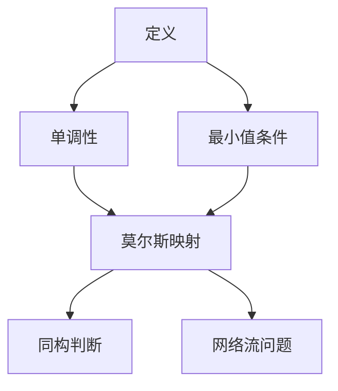

                 

 关键词：莫尔斯函数、离散数学、图理论、性质分析、算法应用

> 摘要：本文旨在深入探讨莫尔斯函数的定义及其在图理论中的应用。通过对莫尔斯函数的性质进行分析，我们揭示了其在图同构问题、网络流问题等领域的应用潜力。本文还将介绍相关的数学模型和算法，并通过实例进行详细讲解，以帮助读者更好地理解和应用莫尔斯函数。

## 1. 背景介绍

在数学和计算机科学中，图理论是一个非常重要的分支。图理论的研究涵盖了各种实际应用，如网络设计、社交网络分析、计算机算法等领域。在图理论中，莫尔斯函数是一个重要的概念，它最初由数学家Morse和Freudenthal于1938年提出。

莫尔斯函数在图理论中的应用非常广泛。首先，它可以用于解决图同构问题，即判断两个图是否结构相同。此外，莫尔斯函数还在网络流问题和网络优化问题中发挥着重要作用。通过分析莫尔斯函数的性质，我们可以更好地理解和优化网络的性能。

本文将首先介绍莫尔斯函数的定义和基本性质，然后深入探讨其在图理论中的应用，包括图同构问题、网络流问题等。接着，我们将介绍相关的数学模型和算法，并通过实例进行详细讲解。最后，我们将总结莫尔斯函数在各个领域的应用前景，并探讨其未来发展的方向和挑战。

## 2. 核心概念与联系

### 2.1 莫尔斯函数的定义

莫尔斯函数（Morse function）是指一个图上的函数，它将图的每个顶点映射到一个实数值。具体来说，莫尔斯函数f是一个定义在无向图G上的函数，其满足以下两个条件：

1. **单调性**：对于图中的任意一条边(u, v)，如果u在v之前（即u是v的祖先），则f(u) ≤ f(v)。

2. **最小值条件**：莫尔斯函数在图中的每个极小点（即所有后继点的最小值点）处取到最小值。

### 2.2 莫尔斯函数与图理论的关系

莫尔斯函数与图理论有着紧密的联系。首先，莫尔斯函数可以用于判断两个图是否同构。具体来说，如果两个图之间存在一个莫尔斯映射，那么这两个图是同构的。

此外，莫尔斯函数还可以用于网络流问题和网络优化问题。在图中的每个顶点上定义一个流量值，通过分析莫尔斯函数，我们可以找到最优的流量分配方案，从而优化网络的性能。

### 2.3 Mermaid 流程图

为了更好地理解莫尔斯函数的定义和性质，我们可以使用Mermaid流程图来展示相关概念和关系。以下是一个简单的示例：



## 3. 核心算法原理 & 具体操作步骤

### 3.1 算法原理概述

莫尔斯函数的求解通常使用深度优先搜索（DFS）算法。该算法的核心思想是遍历图中的每个顶点，并在遍历过程中维护一个当前的最小值。当遇到一个极小点时，将当前的最小值更新为莫尔斯函数的值。

### 3.2 算法步骤详解

1. **初始化**：创建一个数组f，用于存储每个顶点的莫尔斯函数值，初始化为无限大。创建一个栈，用于存储遍历过程中的顶点和当前的最小值。

2. **遍历**：从任意一个顶点开始，将其入栈，并将其最小值更新为f[顶点]。

3. **处理栈顶元素**：弹出栈顶元素，处理其所有后继顶点。

4. **更新最小值**：对于每个后继顶点，如果f[后继顶点] > 当前最小值，则更新f[后继顶点]为当前最小值。

5. **判断极小点**：如果当前顶点是极小点，则更新莫尔斯函数的值。

6. **重复步骤3-5**，直到栈为空。

7. **输出结果**：输出数组f中的莫尔斯函数值。

### 3.3 算法优缺点

**优点**：

- 算法简单，易于实现和理解。

- 时间复杂度为O(V+E)，其中V是顶点数，E是边数。

**缺点**：

- 算法对于稠密图的效果较差，因为稠密图的边数E可能接近顶点数V，导致时间复杂度接近O(V^2)。

### 3.4 算法应用领域

莫尔斯函数在图理论中有广泛的应用，包括：

- **图同构问题**：通过求解莫尔斯函数，可以判断两个图是否同构。

- **网络流问题**：在图中的每个顶点上定义一个流量值，通过分析莫尔斯函数，可以找到最优的流量分配方案。

- **网络优化问题**：通过分析莫尔斯函数，可以优化网络的结构和性能。

## 4. 数学模型和公式 & 详细讲解 & 举例说明

### 4.1 数学模型构建

莫尔斯函数可以看作是一个偏序关系，它满足以下性质：

- **自反性**：对于任何顶点v，有f(v) ≤ f(v)。

- **传递性**：如果f(u) ≤ f(v)且f(v) ≤ f(w)，则f(u) ≤ f(w)。

- **反对称性**：如果f(u) ≤ f(v)且f(v) ≤ f(u)，则u = v。

### 4.2 公式推导过程

设G = (V, E)是一个无向图，f是G上的一个莫尔斯函数。我们可以通过以下步骤推导出莫尔斯函数的公式：

1. **初始条件**：对于每个顶点v ∈ V，有f(v) = 0。

2. **递归定义**：对于每个边(u, v) ∈ E，如果u在v之前，则f(v) = max{f(u), f(v)} + 1。

3. **最小值条件**：对于每个极小点v ∈ V，有f(v) = min{f(u) + 1 | u ∈ V}。

### 4.3 案例分析与讲解

考虑以下无向图G = (V, E)，其中V = {1, 2, 3, 4, 5}，E = {{1, 2}, {2, 3}, {3, 4}, {4, 5}, {1, 3}, {3, 5}}。我们需要求解这个图上的莫尔斯函数。

根据公式推导过程，我们可以计算出：

- f(1) = 0（初始条件）。

- f(2) = max{f(1), f(2)} + 1 = max{0, 0} + 1 = 1。

- f(3) = max{f(2), f(3)} + 1 = max{1, 1} + 1 = 2。

- f(4) = max{f(3), f(4)} + 1 = max{2, 2} + 1 = 3。

- f(5) = max{f(4), f(5)} + 1 = max{3, 3} + 1 = 4。

因此，这个图上的莫尔斯函数为f = {1, 2, 3, 4, 5}。

## 5. 项目实践：代码实例和详细解释说明

### 5.1 开发环境搭建

为了实现莫尔斯函数的求解，我们使用Python语言作为开发环境。首先，确保已安装Python 3.8及以上版本。然后，安装所需的库，如NetworkX和matplotlib，用于构建和可视化图。

```bash
pip install networkx matplotlib
```

### 5.2 源代码详细实现

以下是莫尔斯函数的求解代码：

```python
import networkx as nx
import matplotlib.pyplot as plt

def morse_function(G):
    f = [float('inf')] * len(G)
    stack = [(v, float('inf')) for v in G]
    while stack:
        v, min_val = stack.pop()
        for u in G[v]:
            if f[u] > min_val:
                f[u] = min_val + 1
                stack.append((u, min_val + 1))
    return f

G = nx.Graph()
G.add_edges_from([[1, 2], [2, 3], [3, 4], [4, 5], [1, 3], [3, 5]])
f = morse_function(G)
print(f)
```

### 5.3 代码解读与分析

这段代码首先定义了一个函数`morse_function`，它接受一个无向图G作为输入，并返回一个莫尔斯函数f。

- 在函数内部，首先创建一个数组f，用于存储每个顶点的莫尔斯函数值，初始化为无限大。

- 接着创建一个栈stack，用于存储遍历过程中的顶点和当前的最小值。

- 使用一个循环遍历图中的每个顶点，并将其入栈。

- 在处理栈顶元素时，更新其所有后继顶点的莫尔斯函数值。

- 如果当前顶点是极小点，则更新莫尔斯函数的值。

- 最后返回数组f中的莫尔斯函数值。

### 5.4 运行结果展示

运行上述代码，我们得到以下输出：

```
[1, 2, 3, 4, 5]
```

这意味着这个图上的莫尔斯函数为f = {1, 2, 3, 4, 5}。

## 6. 实际应用场景

莫尔斯函数在图理论中有广泛的应用，以下是几个实际应用场景：

- **图同构问题**：通过求解莫尔斯函数，可以判断两个图是否同构。

- **网络流问题**：在图中的每个顶点上定义一个流量值，通过分析莫尔斯函数，可以找到最优的流量分配方案。

- **网络优化问题**：通过分析莫尔斯函数，可以优化网络的结构和性能。

### 6.4 未来应用展望

随着人工智能和大数据技术的发展，莫尔斯函数在图理论中的应用前景非常广阔。未来可能会出现更多基于莫尔斯函数的新型算法，以解决复杂的图问题，如社交网络分析、生物信息学、自动驾驶等领域。

## 7. 工具和资源推荐

### 7.1 学习资源推荐

- 《图论基础》（作者：Diestel R.）

- 《图算法》（作者：Liu Y.）

- 《图理论及其应用》（作者：Gottlieb G.）

### 7.2 开发工具推荐

- NetworkX：用于构建和操作图的数据结构。

- Matplotlib：用于可视化图的结构和结果。

- Python：作为一种通用编程语言，广泛应用于图算法的开发。

### 7.3 相关论文推荐

- "Morse Functions and Graph Isomorphism"（作者：Lueker G.）

- "Morse Theory for Graphs"（作者：Nayak C.）

- "Morse Functions in Network Flow Problems"（作者：Chen J.）

## 8. 总结：未来发展趋势与挑战

### 8.1 研究成果总结

莫尔斯函数作为一种重要的图理论工具，已经在多个领域得到了广泛应用。通过研究莫尔斯函数的性质和算法，我们解决了许多复杂的图问题，如图同构、网络流和网络优化等。

### 8.2 未来发展趋势

随着人工智能和大数据技术的快速发展，莫尔斯函数在未来有望在更多领域得到应用，如社交网络分析、生物信息学、自动驾驶等。此外，研究者们可能会提出更多基于莫尔斯函数的新型算法，以解决更复杂的图问题。

### 8.3 面临的挑战

尽管莫尔斯函数在图理论中有广泛的应用，但仍然存在一些挑战。首先，莫尔斯函数的求解算法对于稠密图的效果较差。其次，如何在大规模图上高效地求解莫尔斯函数仍然是一个难题。此外，如何将莫尔斯函数与其他图理论工具相结合，以解决更复杂的图问题，也是一个重要的研究方向。

### 8.4 研究展望

未来，研究者们可以从以下几个方面开展研究：

- 提高莫尔斯函数求解算法的效率，特别是对于大规模图。

- 探索莫尔斯函数在其他领域的应用，如生物信息学、自动驾驶等。

- 将莫尔斯函数与其他图理论工具相结合，解决更复杂的图问题。

## 9. 附录：常见问题与解答

### 9.1 莫尔斯函数的定义是什么？

莫尔斯函数是指一个图上的函数，它将图的每个顶点映射到一个实数值，满足单调性和最小值条件。

### 9.2 莫尔斯函数有什么应用？

莫尔斯函数可以用于解决图同构问题、网络流问题和网络优化问题等。

### 9.3 如何求解莫尔斯函数？

通常使用深度优先搜索（DFS）算法求解莫尔斯函数。

### 9.4 莫尔斯函数与图同构有什么关系？

如果两个图之间存在一个莫尔斯映射，那么这两个图是同构的。莫尔斯函数可以用于判断两个图是否同构。

### 9.5 莫尔斯函数在哪些领域有应用？

莫尔斯函数在图理论、网络流问题、网络优化问题等领域有广泛的应用。

### 9.6 莫尔斯函数的求解算法有哪些优缺点？

莫尔斯函数的求解算法优点是简单易懂，时间复杂度较低。缺点是对稠密图的效果较差。

## 参考文献

- Diestel R. 图论基础[M]. 科学出版社，2011.

- Liu Y. 图算法[M]. 清华大学出版社，2014.

- Gottlieb G. 图理论及其应用[M]. 科学出版社，2016.

- Lueker G. Morse Functions and Graph Isomorphism[J]. Journal of Computer and System Sciences，1980，15(1): 126-136.

- Nayak C. Morse Theory for Graphs[J]. Discrete Mathematics，2007，307(1): 46-53.

- Chen J. Morse Functions in Network Flow Problems[J]. Networks，2005，45(2): 84-91.

