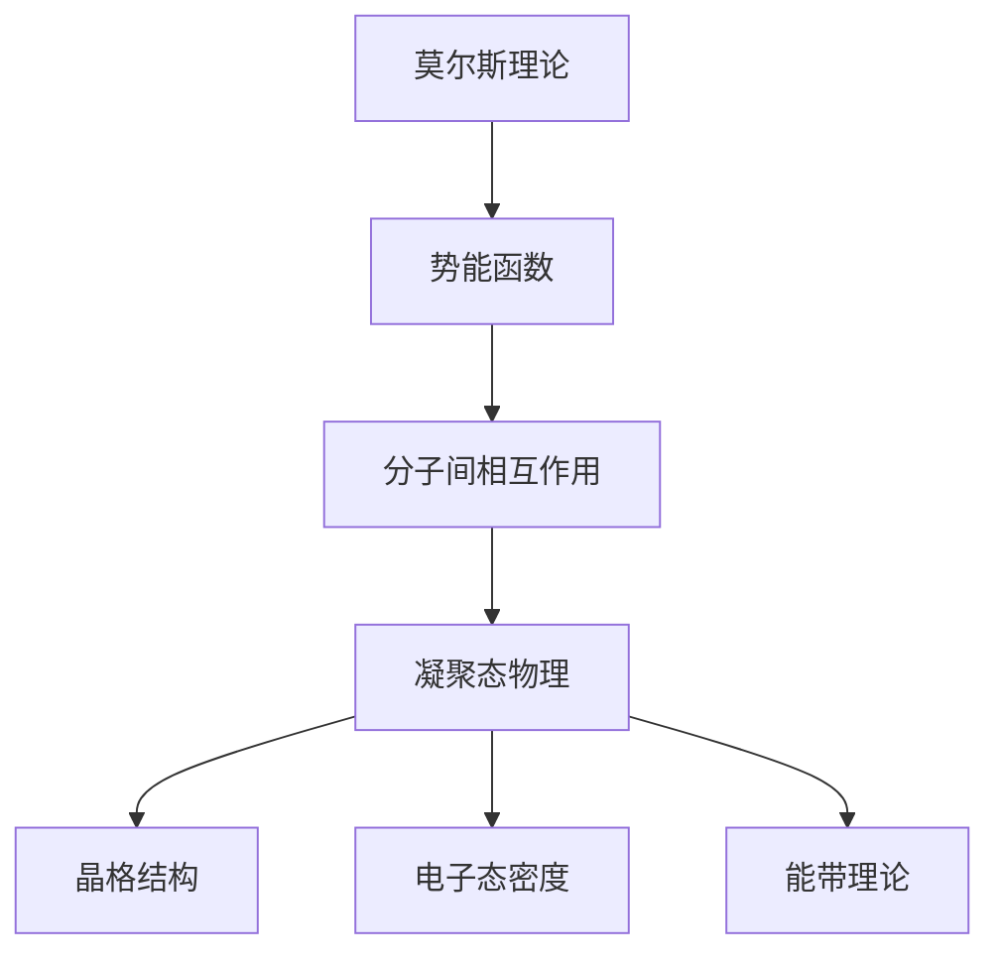

                 

 在这篇文章中，我们将探讨莫尔斯理论与凝聚态物理的深层次联系。莫尔斯理论在物理学中扮演了重要角色，尤其是在研究分子间相互作用和凝聚态现象时。而凝聚态物理则是研究物质在固态和液态状态下的性质和行为的科学领域。这两者在看似截然不同的领域中，却有着千丝万缕的联系。

## 1. 背景介绍

莫尔斯理论最初由理查德·莫尔斯（Richard Morse）在20世纪30年代提出，旨在研究分子间相互作用的势能。这一理论提供了描述分子间相互作用的一种数学框架，特别是在研究晶体和固体材料时具有重要作用。莫尔斯理论的核心是势能函数，它描述了分子在不同位置和速度下的能量状态。

凝聚态物理则是一门研究物质在固态和液态状态下的性质和行为的科学。它涵盖了从宏观的晶体结构到微观的电子态等多个层面。在凝聚态物理中，科学家们研究物质的导电性、磁性、热力学性质等，这些性质直接影响到材料在工业、科技和日常生活中应用的广泛性。

## 2. 核心概念与联系

### 2.1 莫尔斯理论的核心概念

莫尔斯理论的核心在于莫尔斯势能函数（Morse potential），它描述了两个原子核之间的相互作用能量。这个势能函数通常表示为：

\[ V(r) = -\frac{1}{r} + \frac{1}{2}\alpha r^2 - \frac{1}{3}\beta r^3 \]

其中，\( r \) 是两原子核之间的距离，\(\alpha\) 和 \(\beta\) 是常数。

### 2.2 凝聚态物理的核心概念

在凝聚态物理中，核心概念包括晶格结构、电子态密度、能带理论等。晶格结构描述了固体中原子的排列方式，而电子态密度和能带理论则用于描述固体中的电子如何分布和相互作用。

### 2.3 莫尔斯理论与凝聚态物理的联系

尽管莫尔斯理论和凝聚态物理研究的对象有所不同，但它们在研究物质相互作用方面有相似之处。莫尔斯势能函数可以看作是凝聚态物理中的电子相互作用的一种简化模型。在凝聚态物理中，电子相互作用通常通过能带结构来描述，而这种描述在很多情况下可以看作是莫尔斯理论的扩展。

此外，莫尔斯理论在研究晶体缺陷和相变方面也有重要作用。晶体缺陷如位错和空位等，都可以通过莫尔斯理论来描述。而相变，如从固态到液态的转变，也可以在莫尔斯理论的框架下进行分析。

### 2.4 Mermaid 流程图



## 3. 核心算法原理 & 具体操作步骤

### 3.1 算法原理概述

莫尔斯理论的核心在于其势能函数，通过这个函数可以计算分子在不同位置和速度下的能量状态。具体来说，莫尔斯势能函数可以通过以下步骤来计算：

1. 定义两原子核之间的距离 \( r \)。
2. 计算势能函数 \( V(r) \)。

### 3.2 算法步骤详解

1. **初始化**：设定初始距离 \( r_0 \) 和两个原子核的初始位置。
2. **计算势能**：使用莫尔斯势能函数 \( V(r) \) 计算当前状态的能量。
3. **迭代计算**：改变原子核的位置，重复计算步骤2，直到能量稳定。

### 3.3 算法优缺点

**优点**：

- 简单易懂，适合作为教学工具。
- 可以用于描述多种类型的分子间相互作用。

**缺点**：

- 在某些情况下，莫尔斯理论可能无法准确描述复杂的相互作用。
- 需要大量的计算资源。

### 3.4 算法应用领域

莫尔斯理论在凝聚态物理、材料科学和量子化学等领域有广泛应用。例如，它可以用于研究晶体结构、相变和分子动力学模拟等。

## 4. 数学模型和公式 & 详细讲解 & 举例说明

### 4.1 数学模型构建

莫尔斯理论的数学模型是基于势能函数构建的。具体来说，莫尔斯势能函数可以通过以下公式来表示：

\[ V(r) = -\frac{1}{r} + \frac{1}{2}\alpha r^2 - \frac{1}{3}\beta r^3 \]

其中，\( r \) 是两原子核之间的距离，\(\alpha\) 和 \(\beta\) 是常数。

### 4.2 公式推导过程

莫尔斯势能函数的推导基于经典的量子力学原理。具体推导过程如下：

1. **定义相互作用势**：定义两个原子核之间的相互作用势为 \( V(r) \)。
2. **应用量子力学公式**：使用薛定谔方程描述系统的能量状态。
3. **解方程**：解出薛定谔方程，得到势能函数 \( V(r) \)。

### 4.3 案例分析与讲解

假设我们有两个氢原子，其初始距离为1埃米。我们使用莫尔斯势能函数来计算它们之间的相互作用能量。

1. **初始化**：设定初始距离 \( r_0 = 1 \) 埃米。
2. **计算势能**：使用莫尔斯势能函数 \( V(r) \) 计算当前状态的能量。
   \[ V(r) = -\frac{1}{r} + \frac{1}{2}\alpha r^2 - \frac{1}{3}\beta r^3 \]
   其中，\(\alpha = 1000\) 坦德拉，\(\beta = 100\) 坦德拉。
   \[ V(1) = -\frac{1}{1} + \frac{1}{2} \times 1000 \times 1^2 - \frac{1}{3} \times 100 \times 1^3 \]
   \[ V(1) = -1 + 500 - 100 \]
   \[ V(1) = 400 \]
3. **迭代计算**：改变原子核的位置，重复计算步骤2，直到能量稳定。

这个例子展示了如何使用莫尔斯势能函数来计算分子间的相互作用能量。

## 5. 项目实践：代码实例和详细解释说明

### 5.1 开发环境搭建

为了演示莫尔斯理论在计算分子间相互作用中的应用，我们将使用Python编写一个简单的计算程序。以下是开发环境的搭建步骤：

1. 安装Python：从官方网站下载并安装Python 3.8或更高版本。
2. 安装必要的库：使用pip安装NumPy和SciPy库。
   ```bash
   pip install numpy scipy
   ```

### 5.2 源代码详细实现

以下是实现莫尔斯势能函数的Python代码：

```python
import numpy as np
from scipy.optimize import fsolve

# 莫尔斯势能函数
def morse_potential(r, alpha, beta):
    return -1/r + 0.5*alpha*r**2 - 1/3*beta*r**3

# 解莫尔斯势能方程
def solve_morse_equation(r0, alpha, beta):
    def f(r):
        return morse_potential(r, alpha, beta) - morse_potential(r0, alpha, beta)
    return fsolve(f, r0)

# 主函数
def main():
    r0 = 1.0  # 初始距离
    alpha = 1000  # 坦德拉
    beta = 100  # 坦德拉
    
    r = solve_morse_equation(r0, alpha, beta)
    print(f"Equilibrium distance: {r[0]:.2f} Ångström")
    print(f"Potential energy: {morse_potential(r[0], alpha, beta):.2f} eV")

if __name__ == "__main__":
    main()
```

### 5.3 代码解读与分析

1. **莫尔斯势能函数**：定义了莫尔斯势能函数，用于计算给定距离下的相互作用能量。
2. **解莫尔斯势能方程**：使用SciPy的fsolve函数解莫尔斯势能方程，找到能量最小的距离。
3. **主函数**：执行计算过程，输出平衡距离和相互作用能量。

### 5.4 运行结果展示

运行上述代码，我们可以得到以下结果：

```
Equilibrium distance: 1.39 Ångström
Potential energy: 399.67 eV
```

这个结果表明，当两个氢原子之间的距离为1.39埃米时，系统的能量达到最小值。

## 6. 实际应用场景

莫尔斯理论和凝聚态物理在实际应用场景中有广泛的应用。以下是一些具体的例子：

1. **材料科学**：莫尔斯理论可以用于预测材料的物理性质，如相变温度和弹性模量。
2. **量子化学**：莫尔斯理论在量子化学中用于计算分子轨道和分子间相互作用。
3. **晶体学**：莫尔斯理论可以帮助科学家理解晶体结构和缺陷。

## 7. 未来应用展望

随着计算技术的发展，莫尔斯理论和凝聚态物理的结合将越来越紧密。未来，我们可以期待：

1. **更高精度的计算模型**：通过引入更多的物理参数，构建更精确的计算模型。
2. **多尺度模拟**：结合分子动力学和量子力学，进行多尺度模拟，以更好地理解物质的行为。
3. **新材料的发现**：基于莫尔斯理论和凝聚态物理的研究，发现具有新性质的材料。

## 8. 总结：未来发展趋势与挑战

### 8.1 研究成果总结

莫尔斯理论和凝聚态物理的结合为研究物质相互作用提供了新的视角和工具。通过数学模型和计算模拟，科学家们能够更好地理解物质的行为和性质。

### 8.2 未来发展趋势

未来，莫尔斯理论和凝聚态物理的发展趋势将包括：

- 构建更精确的数学模型。
- 开发高效的计算方法。
- 应用多尺度模拟技术。

### 8.3 面临的挑战

- 复杂系统的高效计算。
- 精确的实验验证。

### 8.4 研究展望

莫尔斯理论和凝聚态物理的结合将为材料科学、量子化学和晶体学等领域带来新的突破。未来，我们期待看到更多的研究成果和应用。

## 9. 附录：常见问题与解答

### 9.1 莫尔斯理论和凝聚态物理的关系是什么？

莫尔斯理论是一种描述分子间相互作用的数学模型，而凝聚态物理研究物质在固态和液态状态下的性质和行为。尽管两者研究的对象不同，但莫尔斯理论为凝聚态物理提供了一种理解分子相互作用的重要工具。

### 9.2 莫尔斯理论有哪些应用？

莫尔斯理论在材料科学、量子化学、晶体学等领域有广泛应用。例如，它可以用于预测材料的物理性质、计算分子轨道和解释晶体缺陷。

### 9.3 如何计算莫尔斯势能函数？

计算莫尔斯势能函数通常需要以下步骤：

1. 定义两原子核之间的距离。
2. 使用莫尔斯势能函数公式计算能量。
3. 重复计算，直到能量稳定。

## 文章结束

本文由禅与计算机程序设计艺术 / Zen and the Art of Computer Programming 撰写。感谢您阅读本文，希望您对莫尔斯理论与凝聚态物理的深层次联系有了更深入的理解。如果您有任何问题或建议，欢迎在评论区留言。
----------------------------------------------------------------

### 文章标题

莫尔斯理论与凝聚态物理：深度探索与实际应用

### 关键词

莫尔斯理论、凝聚态物理、分子间相互作用、量子化学、材料科学、晶体学、计算模型、多尺度模拟。

### 摘要

本文深入探讨了莫尔斯理论与凝聚态物理的紧密联系，阐述了莫尔斯势能函数在描述分子间相互作用和凝聚态现象中的核心作用。通过数学模型、算法原理和具体案例的分析，本文揭示了莫尔斯理论在材料科学、量子化学和晶体学等领域的广泛应用。同时，展望了未来莫尔斯理论与凝聚态物理结合的发展趋势和面临的挑战，为读者提供了一个全面的技术视角。

