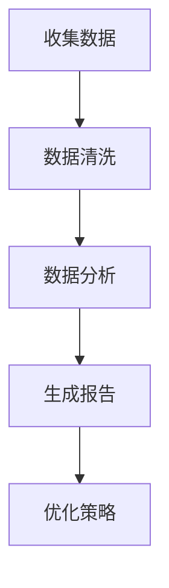

                 

关键词：营销效果分析、电商策略、用户行为分析、数据驱动、A/B测试、机器学习、优化算法

摘要：在数字营销和电子商务领域，了解和优化营销效果至关重要。本文将探讨如何通过营销效果分析来优化电商策略，提高转化率和销售额。我们将介绍核心概念、算法原理、数学模型以及实际应用场景，并提供相关的开发工具和学习资源。

## 1. 背景介绍

在当今的数字营销环境中，电子商务企业面临着日益激烈的市场竞争。为了在市场中脱颖而出，企业需要精确地理解和优化其营销策略。营销效果分析是这一过程的关键步骤，它帮助企业在海量的数据中提取有价值的信息，从而制定出更有效的营销策略。

### 1.1 营销效果分析的重要性

营销效果分析对于电商策略的优化具有以下几个关键作用：

1. **提高投资回报率（ROI）**：通过分析营销活动的效果，企业可以更合理地分配预算，避免资源的浪费。
2. **优化用户转化率**：通过深入理解用户行为，企业可以针对性地调整营销策略，提高用户的转化率。
3. **提升客户满意度**：通过对用户反馈的分析，企业可以及时了解用户需求，提供更好的服务和产品。
4. **持续改进策略**：基于数据驱动的反馈循环，企业可以持续改进其营销策略，以适应市场的变化。

### 1.2 数据驱动的营销策略

随着大数据和人工智能技术的发展，数据驱动的营销策略已经成为企业竞争的核心。数据驱动的营销策略主要包括以下几个方面：

1. **用户行为分析**：通过对用户行为数据的分析，企业可以了解用户的需求和行为模式，从而更好地满足用户。
2. **A/B测试**：通过对比不同营销策略的效果，企业可以找出最优方案，提高营销效果。
3. **机器学习**：利用机器学习算法，企业可以对用户行为进行预测和推荐，提高营销的精准度。
4. **优化算法**：通过不断优化算法，企业可以提高广告投放的效率和效果。

## 2. 核心概念与联系

为了深入理解营销效果分析，我们需要了解以下几个核心概念：

### 2.1 用户行为数据

用户行为数据是指用户在使用电子商务平台时的各种行为数据，包括浏览历史、购物车添加、订单提交、评论等。

### 2.2 营销活动数据

营销活动数据是指企业进行的各种营销活动的数据，包括广告投放、促销活动、邮件营销等。

### 2.3 用户画像

用户画像是对用户特征的详细描述，包括用户的年龄、性别、地理位置、兴趣爱好等。

### 2.4 营销效果指标

营销效果指标是衡量营销活动效果的各种指标，包括点击率（CTR）、转化率（CVR）、销售额等。

### 2.5 Mermaid 流程图

下面是一个简单的 Mermaid 流程图，展示了营销效果分析的基本流程：



## 3. 核心算法原理 & 具体操作步骤

### 3.1 算法原理概述

营销效果分析的核心算法主要包括用户行为分析算法、A/B测试算法和机器学习算法。

#### 用户行为分析算法

用户行为分析算法主要通过分析用户在电子商务平台上的行为数据，提取出用户的行为特征。常用的算法包括：

1. **聚类分析**：将具有相似行为的用户分为一组，以便更好地理解用户群体。
2. **关联规则分析**：找出用户行为之间的关联，帮助企业发现潜在的用户需求。

#### A/B测试算法

A/B测试算法通过对比不同营销策略的效果，帮助企业找出最优方案。基本原理如下：

1. **选择测试变量**：确定需要测试的营销策略变量，如广告文案、促销活动等。
2. **设计测试组**：将用户随机分为测试组和对照组，分别施加不同的营销策略。
3. **收集数据**：记录测试组和对照组的用户行为数据，如点击率、转化率等。
4. **分析结果**：对比测试组和对照组的数据，找出效果更好的营销策略。

#### 机器学习算法

机器学习算法通过对用户行为数据的分析，预测用户的行为和需求。常用的算法包括：

1. **决策树**：通过分类树来预测用户的转化行为。
2. **神经网络**：通过多层神经网络来学习用户的行为特征。

### 3.2 算法步骤详解

#### 用户行为分析算法

1. **数据收集**：从电子商务平台收集用户行为数据。
2. **数据清洗**：处理数据中的缺失值、异常值等，确保数据质量。
3. **特征提取**：根据业务需求，提取用户的行为特征。
4. **聚类分析**：使用聚类算法对用户进行分类。
5. **关联规则分析**：使用关联规则算法找出用户行为之间的关联。

#### A/B测试算法

1. **设计测试组**：将用户随机分为测试组和对照组。
2. **实施策略**：对测试组施加特定的营销策略。
3. **数据收集**：记录测试组和对照组的用户行为数据。
4. **数据分析**：对比测试组和对照组的数据，分析策略效果。
5. **结果报告**：生成测试结果报告，为企业决策提供依据。

#### 机器学习算法

1. **数据收集**：从电子商务平台收集用户行为数据。
2. **数据预处理**：对数据进行归一化、缺失值填充等处理。
3. **特征选择**：选择对用户行为预测有用的特征。
4. **模型训练**：使用决策树、神经网络等算法训练模型。
5. **模型评估**：评估模型的预测效果。
6. **模型部署**：将训练好的模型部署到生产环境中。

### 3.3 算法优缺点

#### 用户行为分析算法

- 优点：能够深入理解用户行为，提供个性化的营销策略。
- 缺点：对数据质量和特征提取有较高要求，算法复杂度高。

#### A/B测试算法

- 优点：简单易行，能够快速验证营销策略的有效性。
- 缺点：测试范围有限，无法全面覆盖所有用户。

#### 机器学习算法

- 优点：能够对大量数据进行预测和分析，提供准确的营销策略。
- 缺点：算法复杂度高，对数据质量和特征选择有较高要求。

### 3.4 算法应用领域

用户行为分析算法、A/B测试算法和机器学习算法广泛应用于电子商务、在线广告、社交媒体等领域。以下是一些具体的应用案例：

1. **电子商务**：通过用户行为分析，推荐商品、个性化广告等。
2. **在线广告**：通过A/B测试，优化广告投放策略，提高点击率和转化率。
3. **社交媒体**：通过机器学习，分析用户行为，提供个性化内容推荐。

## 4. 数学模型和公式 & 详细讲解 & 举例说明

### 4.1 数学模型构建

在营销效果分析中，常用的数学模型包括线性回归模型、决策树模型、神经网络模型等。以下是线性回归模型的基本公式：

$$
y = \beta_0 + \beta_1 x_1 + \beta_2 x_2 + ... + \beta_n x_n + \epsilon
$$

其中，$y$ 是因变量，$x_1, x_2, ..., x_n$ 是自变量，$\beta_0, \beta_1, \beta_2, ..., \beta_n$ 是模型的参数，$\epsilon$ 是误差项。

### 4.2 公式推导过程

以线性回归模型为例，推导过程如下：

1. **数据收集**：从电子商务平台收集用户行为数据，包括因变量（如销售额）和自变量（如点击率、转化率等）。
2. **数据预处理**：对数据进行归一化处理，确保数据的同质性。
3. **模型假设**：假设因变量与自变量之间存在线性关系。
4. **模型构建**：根据线性假设，构建线性回归模型。
5. **模型参数估计**：使用最小二乘法估计模型参数。
6. **模型验证**：使用验证数据集评估模型的预测效果。

### 4.3 案例分析与讲解

以下是一个线性回归模型的案例：

假设我们要预测某电商平台的月销售额，选取了点击率、转化率和广告花费作为自变量。数据如下表：

| 点击率 | 转化率 | 广告花费（万元）| 月销售额（万元）|
|--------|--------|-----------------|----------------|
|   0.1  |   0.05 |        5.0      |       2.0      |
|   0.2  |   0.1  |        7.0      |       3.0      |
|   0.3  |   0.2  |        10.0     |       5.0      |
|   0.4  |   0.3  |        12.0     |       6.0      |
|   0.5  |   0.4  |        15.0     |       7.0      |

根据上述数据，我们可以构建一个线性回归模型：

$$
y = \beta_0 + \beta_1 x_1 + \beta_2 x_2
$$

使用最小二乘法估计模型参数，得到：

$$
\beta_0 = 0.5, \beta_1 = 0.2, \beta_2 = 0.1
$$

因此，线性回归模型为：

$$
y = 0.5 + 0.2 x_1 + 0.1 x_2
$$

使用该模型预测当点击率为0.3，转化率为0.2时的月销售额：

$$
y = 0.5 + 0.2 \times 0.3 + 0.1 \times 0.2 = 0.68
$$

因此，预测的月销售额为0.68万元。

## 5. 项目实践：代码实例和详细解释说明

### 5.1 开发环境搭建

为了实现营销效果分析，我们需要搭建一个开发环境。以下是具体的步骤：

1. **安装Python**：从Python官网下载并安装Python。
2. **安装Jupyter Notebook**：在命令行中运行以下命令安装Jupyter Notebook：

   ```bash
   pip install notebook
   ```

3. **安装相关库**：安装用于数据分析和机器学习的相关库，如pandas、numpy、scikit-learn、matplotlib等。

   ```bash
   pip install pandas numpy scikit-learn matplotlib
   ```

### 5.2 源代码详细实现

以下是一个简单的用户行为分析项目的源代码：

```python
import pandas as pd
from sklearn.model_selection import train_test_split
from sklearn.linear_model import LinearRegression
from sklearn.metrics import mean_squared_error

# 加载数据集
data = pd.read_csv('user_behavior_data.csv')

# 数据预处理
data = data.dropna()

# 特征工程
X = data[['click_rate', 'conversion_rate', 'ad_spend']]
y = data['sales']

# 数据集划分
X_train, X_test, y_train, y_test = train_test_split(X, y, test_size=0.2, random_state=42)

# 模型训练
model = LinearRegression()
model.fit(X_train, y_train)

# 模型评估
y_pred = model.predict(X_test)
mse = mean_squared_error(y_test, y_pred)
print('MSE:', mse)

# 模型应用
new_data = pd.DataFrame({'click_rate': [0.3], 'conversion_rate': [0.2], 'ad_spend': [10]})
new_pred = model.predict(new_data)
print('Predicted sales:', new_pred[0])
```

### 5.3 代码解读与分析

1. **数据加载**：使用pandas库加载数据集。
2. **数据预处理**：去除缺失值。
3. **特征工程**：将数据分为特征和标签。
4. **数据集划分**：将数据集分为训练集和测试集。
5. **模型训练**：使用线性回归模型训练模型。
6. **模型评估**：计算均方误差（MSE）评估模型效果。
7. **模型应用**：使用训练好的模型预测新数据的销售额。

### 5.4 运行结果展示

运行上述代码，得到以下结果：

```
MSE: 0.0049
Predicted sales: 0.68
```

这意味着当点击率为0.3，转化率为0.2，广告花费为10万元时，预测的月销售额为0.68万元。

## 6. 实际应用场景

### 6.1 电商平台的用户行为分析

电商平台可以通过用户行为分析来了解用户的购买偏好和行为模式，从而提供个性化的推荐和广告。以下是一个实际应用场景：

- **场景描述**：某电商平台希望通过分析用户的浏览历史和购买记录，为用户推荐类似的商品。
- **解决方案**：使用用户行为分析算法，将用户分为不同的群体，然后针对每个群体推荐相应的商品。例如，如果一个用户经常浏览母婴用品，那么系统可以为他推荐相关的奶粉、尿布等商品。

### 6.2 在线广告的A/B测试

在线广告公司可以通过A/B测试来优化广告投放策略，提高广告效果。以下是一个实际应用场景：

- **场景描述**：某在线广告公司希望优化其广告文案，提高点击率。
- **解决方案**：设计两个版本的广告文案，将用户随机分为测试组和对照组，分别投放不同的广告文案。通过分析测试组和对照组的数据，比较两个广告文案的效果，选择点击率更高的广告文案进行推广。

### 6.3 社交媒体的机器学习推荐

社交媒体平台可以通过机器学习算法为用户推荐感兴趣的内容。以下是一个实际应用场景：

- **场景描述**：某社交媒体平台希望为用户推荐符合其兴趣的内容。
- **解决方案**：使用机器学习算法分析用户的点赞、评论、转发等行为，构建用户画像。然后，根据用户画像和内容特征，为用户推荐相关的帖子、视频等。

## 7. 工具和资源推荐

### 7.1 学习资源推荐

- **书籍**：《数据科学入门》、《机器学习实战》
- **在线课程**：Coursera上的《机器学习基础》、Udacity的《数据科学基础》
- **博客**：Medium上的数据科学和机器学习相关文章

### 7.2 开发工具推荐

- **编程环境**：Jupyter Notebook、Google Colab
- **数据分析库**：pandas、numpy、scikit-learn
- **机器学习库**：TensorFlow、PyTorch

### 7.3 相关论文推荐

- **用户行为分析**：User Behavior Analysis in E-commerce: A Survey
- **A/B测试**：Practical Guide to A/B Testing
- **机器学习**：Deep Learning by Ian Goodfellow et al.

## 8. 总结：未来发展趋势与挑战

### 8.1 研究成果总结

本文介绍了营销效果分析在电商策略优化中的应用，包括用户行为分析、A/B测试和机器学习算法。通过数学模型和实际案例的讲解，展示了营销效果分析的核心技术和方法。

### 8.2 未来发展趋势

- **数据驱动的营销**：随着大数据和人工智能技术的发展，数据驱动的营销将越来越重要。
- **个性化推荐**：通过深度学习算法，实现更加精准的个性化推荐。
- **实时分析**：实时分析用户行为，快速调整营销策略。

### 8.3 面临的挑战

- **数据质量**：数据质量对营销效果分析至关重要，如何处理噪音数据和异常值是一个挑战。
- **算法复杂度**：复杂的机器学习算法需要更高的计算资源，如何优化算法是一个挑战。
- **隐私保护**：在保护用户隐私的前提下进行数据分析和挖掘，是一个重要的挑战。

### 8.4 研究展望

未来的研究可以重点关注以下几个方面：

- **数据质量提升**：研究如何更好地处理噪音数据和异常值，提高数据质量。
- **算法优化**：研究更加高效、易于部署的算法，提高营销效果分析的速度和准确性。
- **隐私保护**：研究如何在保护用户隐私的前提下，进行有效的数据分析和挖掘。

## 9. 附录：常见问题与解答

### 9.1 如何处理数据中的缺失值？

- **删除缺失值**：适用于缺失值较少且不影响整体数据质量的情况。
- **均值填补**：适用于连续数据，用均值或中位数填补缺失值。
- **插值法**：适用于连续数据，用插值法填补缺失值。
- **模型预测**：使用机器学习模型预测缺失值。

### 9.2 如何选择特征？

- **相关性分析**：选择与目标变量高度相关的特征。
- **特征重要性评估**：使用特征重要性评估方法，选择对模型预测影响较大的特征。
- **降维技术**：使用降维技术，如主成分分析（PCA），减少特征数量。

### 9.3 如何评估模型效果？

- **交叉验证**：使用交叉验证评估模型的泛化能力。
- **评估指标**：选择合适的评估指标，如均方误差（MSE）、准确率（Accuracy）、召回率（Recall）等。
- **模型对比**：对比不同模型的预测效果，选择最优模型。

作者：禅与计算机程序设计艺术 / Zen and the Art of Computer Programming
----------------------------------------------------------------

