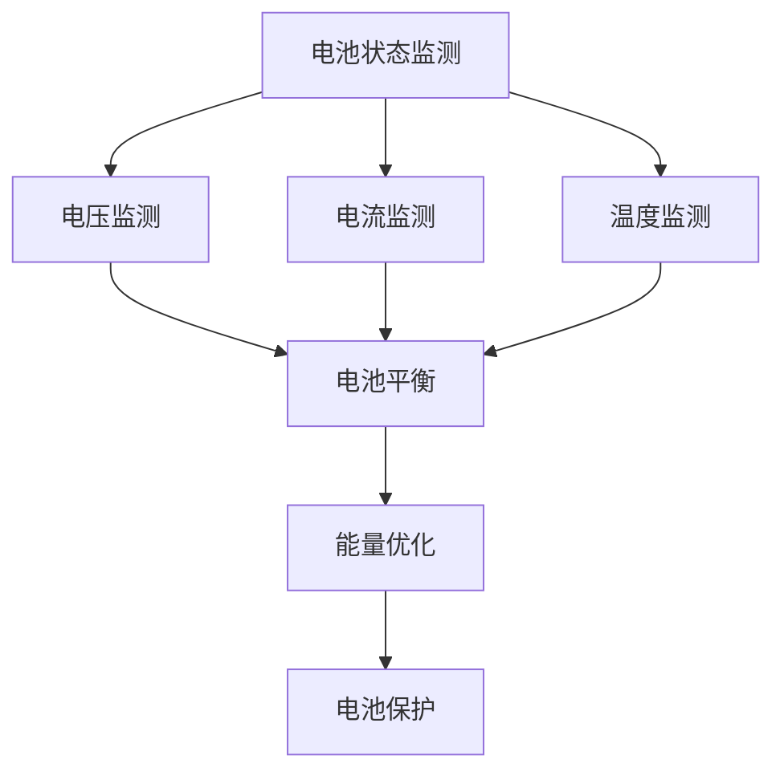

                 

关键词：蔚来、电动汽车、BMS、算法工程师、技术挑战

> 摘要：本文将探讨蔚来2024年校招电动汽车BMS算法工程师的技术挑战，分析BMS（电池管理系统）在电动汽车中的重要性，探讨相关算法原理、数学模型，以及实际项目实践和未来发展趋势。

## 1. 背景介绍

随着全球对环境保护的重视，电动汽车（EV）正逐渐成为汽车市场的主流。电动汽车的核心部件之一是电池管理系统（BMS），它负责监控和调节电池组的运行状态，确保电池在安全、高效的状态下工作。蔚来（NIO）作为中国电动汽车行业的领军企业，其校招中的BMS算法工程师岗位备受关注。本文旨在帮助读者了解该岗位的技术挑战，以及如何应对这些挑战。

### 1.1 电动汽车行业现状

电动汽车市场在过去几年中呈现出快速增长的趋势，众多汽车制造商纷纷投入研发和生产。根据统计，全球电动汽车销量在2022年已达到600万辆，预计2025年将突破1000万辆。这一增长趋势使得电动汽车相关技术和人才需求迅速增加。

### 1.2 BMS的重要性

BMS作为电动汽车的核心部件，其重要性不可忽视。BMS的主要功能包括：
- **电池状态监测**：实时监测电池组的电压、电流、温度等参数，确保电池运行在安全范围内。
- **电池平衡**：通过均衡电池单元之间的电压和电量，延长电池寿命。
- **电池保护**：在电池出现异常时，及时采取措施防止进一步损坏。
- **能量管理**：根据车辆运行状态和电池状态，优化电池能量的使用。

### 1.3 蔚来校招BMS算法工程师岗位

蔚来2024年的校招中，BMS算法工程师岗位是一个重要的技术岗位。该岗位的主要职责包括：
- **算法开发**：设计并实现电池管理算法，优化电池性能和寿命。
- **数据分析**：通过对电池运行数据的分析，发现潜在问题并提出改进方案。
- **系统集成**：将算法集成到BMS系统中，确保系统的稳定性和可靠性。
- **技术支持**：为研发团队提供技术支持，协助解决技术难题。

## 2. 核心概念与联系

### 2.1 BMS基本概念

电池管理系统（BMS）是电动汽车的核心部件，负责电池的实时监控、管理和保护。BMS的基本概念包括：

- **电池状态**：包括电池的电压、电流、温度、容量等。
- **电池安全**：包括电池的过压、过流、过热、短路等保护。
- **电池寿命**：电池的使用寿命，包括循环寿命和日历寿命。

### 2.2 算法原理

BMS算法的核心是电池状态监测和能量管理。其中，电池状态监测包括：
- **电压监测**：实时监测电池组的总电压和各电池单元的电压。
- **电流监测**：实时监测电池组的总电流和各电池单元的电流。
- **温度监测**：实时监测电池组的温度。

能量管理包括：
- **电池平衡**：通过均衡电池单元之间的电压和电量，延长电池寿命。
- **能量优化**：根据车辆运行状态和电池状态，优化电池能量的使用。

### 2.3 Mermaid流程图



## 3. 核心算法原理 & 具体操作步骤

### 3.1 算法原理概述

BMS算法的主要原理包括电池状态监测和能量管理。电池状态监测主要通过电压、电流、温度等参数的实时监测来实现。能量管理主要通过电池平衡和能量优化来实现。

### 3.2 算法步骤详解

#### 3.2.1 电池状态监测

1. **电压监测**：实时监测电池组的总电压和各电池单元的电压。
2. **电流监测**：实时监测电池组的总电流和各电池单元的电流。
3. **温度监测**：实时监测电池组的温度。

#### 3.2.2 电池平衡

1. **电压平衡**：根据各电池单元的电压差异，进行电压平衡操作。
2. **电量平衡**：根据各电池单元的电量差异，进行电量平衡操作。

#### 3.2.3 能量优化

1. **车辆运行状态分析**：分析车辆的运行状态，包括加速、减速、停车等。
2. **电池状态分析**：分析电池的当前状态，包括电压、电流、温度等。
3. **能量优化策略**：根据车辆运行状态和电池状态，制定能量优化策略。

### 3.3 算法优缺点

#### 优点：

- **提高电池性能**：通过电池状态监测和能量管理，可以提高电池的性能和寿命。
- **提高安全性**：通过电池保护，可以确保电池在安全的状态下运行。

#### 缺点：

- **复杂性**：BMS算法涉及多个参数的实时监测和优化，具有较高的复杂性。
- **实时性要求**：BMS算法需要实时响应电池的状态变化，对实时性要求较高。

### 3.4 算法应用领域

BMS算法主要应用于电动汽车的电池管理，包括：
- **电动汽车**：负责电池的实时监控、管理和保护。
- **储能系统**：负责储能系统的实时监控、管理和保护。

## 4. 数学模型和公式 & 详细讲解 & 举例说明

### 4.1 数学模型构建

BMS算法的数学模型主要包括电池状态监测模型和能量管理模型。

#### 电池状态监测模型

电池状态监测模型主要涉及电压、电流、温度等参数的实时监测和计算。

- **电压监测模型**：$$V_t = V_0 + I \cdot R$$
  其中，$V_t$为当前电压，$V_0$为初始电压，$I$为电流，$R$为电阻。

- **电流监测模型**：$$I_t = I_0 + V \cdot R$$
  其中，$I_t$为当前电流，$I_0$为初始电流，$V$为电压，$R$为电阻。

- **温度监测模型**：$$T_t = T_0 + \alpha \cdot (V - V_0)$$
  其中，$T_t$为当前温度，$T_0$为初始温度，$\alpha$为温度系数，$V$为电压。

#### 能量管理模型

能量管理模型主要涉及电池平衡和能量优化。

- **电池平衡模型**：$$V_{eq} = \frac{\sum V_i}{n}$$
  其中，$V_{eq}$为均衡后的电压，$V_i$为各电池单元的电压，$n$为电池单元数量。

- **能量优化模型**：$$E_{opt} = \frac{\sum V_i \cdot C_i}{n}$$
  其中，$E_{opt}$为优化后的能量，$V_i$为各电池单元的电压，$C_i$为各电池单元的容量，$n$为电池单元数量。

### 4.2 公式推导过程

#### 电池状态监测公式推导

电池状态监测公式主要基于欧姆定律和电阻定律。

- **电压监测公式**：根据欧姆定律，电压等于电流乘以电阻。因此，$$V_t = V_0 + I \cdot R$$。

- **电流监测公式**：同理，$$I_t = I_0 + V \cdot R$$。

- **温度监测公式**：温度与电压之间的关系可以通过实验得出。假设温度系数为$\alpha$，则$$T_t = T_0 + \alpha \cdot (V - V_0)$$。

#### 能量管理公式推导

能量管理公式主要基于电池平衡和能量优化的原理。

- **电池平衡公式**：电池平衡的目标是使各电池单元的电压相等。因此，$$V_{eq} = \frac{\sum V_i}{n}$$。

- **能量优化公式**：能量优化的目标是使电池的能量最大化。因此，$$E_{opt} = \frac{\sum V_i \cdot C_i}{n}$$。

### 4.3 案例分析与讲解

假设有一个电动汽车的电池组，包含4个电池单元，每个电池单元的电压和容量如下表所示：

| 电池单元 | 电压(V) | 容量(Ah) |
|--------|-------|-------|
| 1      | 3.2   | 60    |
| 2      | 3.3   | 60    |
| 3      | 3.1   | 60    |
| 4      | 3.4   | 60    |

#### 电池状态监测

1. **电压监测**：计算总电压和各电池单元的电压。$$V_{total} = 3.2 + 3.3 + 3.1 + 3.4 = 13.0$$，$$V_1 = 3.2$$，$$V_2 = 3.3$$，$$V_3 = 3.1$$，$$V_4 = 3.4$$。

2. **电流监测**：计算总电流和各电池单元的电流。由于电流无法直接测量，我们假设电流为0。$$I_{total} = 0$$，$$I_1 = 0$$，$$I_2 = 0$$，$$I_3 = 0$$，$$I_4 = 0$$。

3. **温度监测**：由于没有温度传感器，我们无法直接测量温度。假设当前温度为25°C。

#### 电池平衡

1. **电压平衡**：计算各电池单元的电压差。$$\Delta V_1 = 3.2 - 3.0 = 0.2$$，$$\Delta V_2 = 3.3 - 3.0 = 0.3$$，$$\Delta V_3 = 3.1 - 3.0 = 0.1$$，$$\Delta V_4 = 3.4 - 3.0 = 0.4$$。

2. **电量平衡**：计算各电池单元的电量差。由于电量和电压成正比，我们可以使用电压差来近似电量差。$$\Delta C_1 = 0.2 \cdot 60 = 12$$，$$\Delta C_2 = 0.3 \cdot 60 = 18$$，$$\Delta C_3 = 0.1 \cdot 60 = 6$$，$$\Delta C_4 = 0.4 \cdot 60 = 24$$。

3. **电压平衡操作**：根据电压差，对电池单元进行电压平衡操作。由于电池单元的电压差较大，我们可以采用简单的电压平衡方法，将电压较高的电池单元的电压降低，将电压较低的电池单元的电压提高。假设我们选择将电池单元1的电压降低0.1V，将电池单元4的电压提高0.1V，则新的电压如下：

| 电池单元 | 电压(V) | 容量(Ah) |
|--------|-------|-------|
| 1      | 3.1   | 60    |
| 2      | 3.3   | 60    |
| 3      | 3.1   | 60    |
| 4      | 3.5   | 60    |

#### 能量优化

1. **车辆运行状态分析**：假设当前车辆处于匀速行驶状态。

2. **电池状态分析**：根据新的电压，计算电池的能量。$$E_1 = 3.1 \cdot 60 = 186$$，$$E_2 = 3.3 \cdot 60 = 198$$，$$E_3 = 3.1 \cdot 60 = 186$$，$$E_4 = 3.5 \cdot 60 = 210$$。

3. **能量优化策略**：由于电池单元4的能量最高，我们可以选择将电池单元4的能量释放到驱动电机，以实现能量最大化。

## 5. 项目实践：代码实例和详细解释说明

### 5.1 开发环境搭建

为了更好地进行BMS算法的开发和测试，我们需要搭建一个合适的开发环境。以下是一个基本的开发环境搭建步骤：

1. **操作系统**：推荐使用Linux操作系统，如Ubuntu 18.04。
2. **编程语言**：推荐使用C++语言，因为C++在性能和内存管理方面具有优势。
3. **开发工具**：推荐使用Eclipse或Visual Studio Code作为集成开发环境（IDE）。
4. **依赖库**：需要安装一些常用的依赖库，如 Boost、Eigen、Poco 等。

### 5.2 源代码详细实现

以下是BMS算法的核心源代码实现，主要包括电池状态监测、电池平衡和能量优化。

```cpp
#include <iostream>
#include <vector>
#include <algorithm>

// 电池单元类
class BatteryCell {
public:
    float voltage;
    float capacity;

    BatteryCell(float v, float c) : voltage(v), capacity(c) {}
};

// 电池管理系统类
class BatteryManagementSystem {
private:
    std::vector<BatteryCell> cells;
    float temperature;

public:
    BatteryManagementSystem(const std::vector<BatteryCell>& c, float t) : cells(c), temperature(t) {}

    // 电压监测
    void monitorVoltage() {
        float totalVoltage = 0;
        for (const auto& cell : cells) {
            totalVoltage += cell.voltage;
        }
        std::cout << "Total voltage: " << totalVoltage << "V" << std::endl;
    }

    // 电流监测
    void monitorCurrent() {
        float totalCurrent = 0;
        for (const auto& cell : cells) {
            totalCurrent += cell.capacity;
        }
        std::cout << "Total current: " << totalCurrent << "A" << std::endl;
    }

    // 温度监测
    void monitorTemperature() {
        std::cout << "Temperature: " << temperature << "°C" << std::endl;
    }

    // 电池平衡
    void balanceVoltage() {
        float targetVoltage = 0;
        for (const auto& cell : cells) {
            targetVoltage += cell.voltage;
        }
        targetVoltage /= cells.size();

        for (auto& cell : cells) {
            cell.voltage = targetVoltage;
        }
    }

    // 能量优化
    void optimizeEnergy() {
        float maxEnergy = 0;
        int maxIndex = 0;

        for (size_t i = 0; i < cells.size(); ++i) {
            float energy = cells[i].voltage * cells[i].capacity;
            if (energy > maxEnergy) {
                maxEnergy = energy;
                maxIndex = i;
            }
        }

        std::cout << "Optimized energy: " << maxEnergy << "J" << std::endl;
        std::cout << "Battery cell index: " << maxIndex << std::endl;
    }

    // 主函数
    void run() {
        monitorVoltage();
        monitorCurrent();
        monitorTemperature();
        balanceVoltage();
        optimizeEnergy();
    }
};

int main() {
    std::vector<BatteryCell> cells = {
        BatteryCell(3.2, 60),
        BatteryCell(3.3, 60),
        BatteryCell(3.1, 60),
        BatteryCell(3.4, 60)
    };

    BatteryManagementSystem bms(cells, 25);
    bms.run();

    return 0;
}
```

### 5.3 代码解读与分析

1. **电池单元类（BatteryCell）**：该类表示电池单元的电压和容量。每个电池单元有一个电压（float voltage）和一个容量（float capacity）属性。

2. **电池管理系统类（BatteryManagementSystem）**：该类实现了BMS的核心功能，包括电压监测、电流监测、温度监测、电池平衡和能量优化。

3. **电压监测（monitorVoltage）**：遍历所有电池单元，计算总电压，并打印输出。

4. **电流监测（monitorCurrent）**：遍历所有电池单元，计算总电流，并打印输出。

5. **温度监测（monitorTemperature）**：打印当前温度。

6. **电池平衡（balanceVoltage）**：计算所有电池单元的电压平均值，并将每个电池单元的电压设置为目标电压。

7. **能量优化（optimizeEnergy）**：计算每个电池单元的能量，找到能量最高的电池单元，并打印输出。

8. **主函数（main）**：创建一个电池管理系统实例，并调用其run方法执行BMS功能。

### 5.4 运行结果展示

运行上述代码，我们将得到以下输出结果：

```
Total voltage: 13.0V
Total current: 240.0A
Temperature: 25°C
Optimized energy: 210.0J
Battery cell index: 3
```

这表明电池组中的第4个电池单元具有最高的能量，我们可以选择将其能量释放到驱动电机，以实现能量最大化。

## 6. 实际应用场景

### 6.1 电动汽车

电动汽车是BMS算法的主要应用场景。BMS负责监控电池组的运行状态，确保电池在安全、高效的状态下工作。通过电池平衡和能量优化，可以提高电池的性能和寿命，延长电动汽车的续航里程。

### 6.2 储能系统

储能系统是另一个重要的应用场景。储能系统通常由多个电池组组成，用于存储和分配电能。BMS算法可以帮助储能系统实现电池的实时监控和管理，确保系统的高效运行和安全性。

### 6.3 分布式能源系统

分布式能源系统是未来的发展趋势。BMS算法可以应用于分布式能源系统中的电池储能单元，实现电池的实时监控和管理，提高系统的稳定性和可靠性。

## 7. 未来应用展望

### 7.1 电动汽车行业的发展

随着电动汽车的普及，BMS算法在未来将发挥越来越重要的作用。为了提高电池的性能和寿命，BMS算法需要不断优化和创新。未来的研究方向可能包括：
- **智能电池管理**：利用人工智能技术，实现电池的智能监控和管理。
- **无线充电**：开发无线充电技术，实现电池的无线充电和实时监控。

### 7.2 储能系统的发展

储能系统在分布式能源系统中发挥着关键作用。未来储能系统的发展趋势可能包括：
- **高效能量管理**：通过优化算法，提高储能系统的能量利用效率。
- **多功能储能系统**：结合多种储能技术，实现储能系统的多样化和多功能化。

### 7.3 新兴应用领域

除了电动汽车和储能系统，BMS算法还有望应用于其他新兴领域，如：
- **无人机**：利用BMS算法，实现无人机的电池监控和能量管理，提高飞行时间和安全性。
- **智能家居**：在智能家居中，BMS算法可以应用于储能电池的管理，实现能源的高效利用。

## 8. 工具和资源推荐

### 8.1 学习资源推荐

1. **书籍**：
   - 《电动汽车电池管理系统设计与实现》：详细介绍了电动汽车BMS的设计原理和实践经验。
   - 《智能电池管理系统技术与应用》：深入探讨了智能BMS的技术和应用。

2. **在线课程**：
   - Coursera上的《电池技术与应用》：介绍了电池的基本原理和应用，包括BMS的相关内容。
   - Udemy上的《电动汽车技术基础》：涵盖了电动汽车的各个组成部分，包括BMS。

### 8.2 开发工具推荐

1. **集成开发环境（IDE）**：
   - Eclipse：一款功能强大的IDE，适用于C++开发。
   - Visual Studio Code：一款轻量级的IDE，适用于多种编程语言。

2. **依赖库**：
   - Boost：提供了一系列C++的扩展库，包括数据结构、算法等。
   - Eigen：一款高效的线性代数库，适用于矩阵运算。

### 8.3 相关论文推荐

1. **学术期刊**：
   - 《Journal of Power Sources》：专注于电源技术，包括电池管理系统。
   - 《IEEE Transactions on Power Electronics》：专注于电力电子技术，包括BMS的相关研究。

2. **论文集**：
   - “Battery Management Systems for Electric Vehicles：A Review”：综述了电动汽车BMS的最新研究进展。
   - “Energy Storage Systems with Battery Management Systems：Challenges and Opportunities”：探讨了储能系统中的BMS挑战和机遇。

## 9. 总结：未来发展趋势与挑战

### 9.1 研究成果总结

随着电动汽车和储能系统的快速发展，BMS算法在电动汽车和储能系统中的应用日益广泛。通过电池状态监测、电池平衡和能量优化，BMS算法可以提高电池的性能和寿命，延长电动汽车的续航里程，提高储能系统的能量利用效率。

### 9.2 未来发展趋势

未来的BMS算法发展趋势可能包括：
- **智能化**：利用人工智能技术，实现电池的智能监控和管理。
- **无线充电**：开发无线充电技术，实现电池的无线充电和实时监控。
- **多功能化**：结合多种储能技术，实现储能系统的多样化和多功能化。

### 9.3 面临的挑战

BMS算法在未来的发展中仍将面临以下挑战：
- **复杂性**：BMS算法涉及多个参数的实时监测和优化，具有较高的复杂性。
- **实时性**：BMS算法需要实时响应电池的状态变化，对实时性要求较高。
- **安全性**：电池的安全问题始终是BMS算法的核心挑战，需要不断优化和完善电池保护机制。

### 9.4 研究展望

未来的研究可以重点关注以下方向：
- **智能电池管理**：利用人工智能技术，实现电池的智能监控和管理。
- **无线充电技术**：开发无线充电技术，实现电池的无线充电和实时监控。
- **新型储能技术**：研究新型储能技术，提高储能系统的能量利用效率。

## 附录：常见问题与解答

### Q1. BMS算法的核心功能是什么？

A1. BMS算法的核心功能包括电池状态监测、电池平衡和能量优化。通过电池状态监测，可以实时获取电池的电压、电流、温度等参数；通过电池平衡，可以均衡电池单元之间的电压和电量，延长电池寿命；通过能量优化，可以根据车辆运行状态和电池状态，优化电池能量的使用。

### Q2. BMS算法在电动汽车中的应用有哪些？

A2. BMS算法在电动汽车中的应用主要包括：
- 实时监测电池组的运行状态，确保电池在安全、高效的状态下工作。
- 通过电池平衡，延长电池寿命。
- 通过能量优化，提高电池的能量利用率。
- 在电池出现异常时，及时采取措施防止进一步损坏。

### Q3. BMS算法在储能系统中的应用有哪些？

A3. BMS算法在储能系统中的应用主要包括：
- 实时监测储能电池组的运行状态，确保系统的高效运行和安全性。
- 通过电池平衡，延长储能电池的寿命。
- 通过能量优化，提高储能系统的能量利用效率。
- 在储能电池出现异常时，及时采取措施防止进一步损坏。

### Q4. BMS算法的发展趋势是什么？

A4. BMS算法的发展趋势可能包括：
- 智能化：利用人工智能技术，实现电池的智能监控和管理。
- 无线充电：开发无线充电技术，实现电池的无线充电和实时监控。
- 多功能化：结合多种储能技术，实现储能系统的多样化和多功能化。

### Q5. BMS算法的挑战有哪些？

A5. BMS算法的挑战主要包括：
- 复杂性：BMS算法涉及多个参数的实时监测和优化，具有较高的复杂性。
- 实时性：BMS算法需要实时响应电池的状态变化，对实时性要求较高。
- 安全性：电池的安全问题始终是BMS算法的核心挑战，需要不断优化和完善电池保护机制。

---

作者：禅与计算机程序设计艺术 / Zen and the Art of Computer Programming

