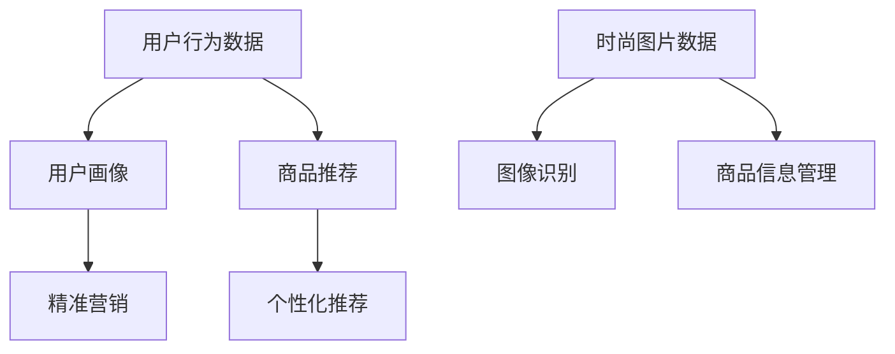

                 

关键词：蘑菇街，AI，社招，算法工程师，面试，攻略，时尚，人工智能，技术面试，招聘流程，面试准备，面试策略

> 摘要：本文旨在为有意向在蘑菇街2025年社招中竞聘算法工程师职位的应聘者提供一套全面的面试攻略。文章首先介绍蘑菇街的基本情况，随后详细分析面试流程、岗位要求、技术面试准备和面试策略，最后给出面试常见问题及解答。希望通过本文，帮助各位应聘者更好地准备面试，成功竞聘心仪职位。

## 1. 背景介绍

蘑菇街成立于2011年，是中国领先的时尚电商平台，以女性用户为核心，提供服饰、美妆、家居等各类时尚商品。近年来，蘑菇街积极布局人工智能技术，将其应用于个性化推荐、用户行为分析、商品搜索优化等多个方面，为用户带来更优质的购物体验。

随着人工智能技术的快速发展，蘑菇街对于算法工程师的需求日益增长。2025年，蘑菇街计划通过社招方式，选拔一批优秀算法工程师，共同推进公司人工智能战略的实施。本次社招面向全国范围，旨在寻找对时尚领域有浓厚兴趣、具备扎实算法基础和实际项目经验的人才。

## 2. 核心概念与联系

### 2.1 时尚领域与人工智能

时尚行业是一个典型的数据密集型领域，用户消费行为、流行趋势等信息纷繁复杂。人工智能技术的引入，能够帮助蘑菇街更好地挖掘这些数据背后的价值，实现精准营销和个性化推荐。

在时尚AI应用中，核心概念包括用户画像、商品推荐、图像识别等。用户画像是指通过对用户行为数据的收集和分析，构建出用户的个性化信息，从而实现精准营销。商品推荐则是指基于用户兴趣和购买记录，为用户推荐最适合的时尚商品。图像识别技术则主要用于时尚图片的标注和分类，帮助平台更好地管理商品信息。

下面是一个简单的Mermaid流程图，展示时尚领域与人工智能的核心概念和联系：



### 2.2 算法工程师岗位要求

作为蘑菇街2025年社招的算法工程师，应聘者需具备以下基本素质和技能：

- **教育背景**：计算机科学、软件工程、人工智能等相关专业本科及以上学历；
- **编程基础**：熟练掌握Python、Java等编程语言，具备扎实的编程基础；
- **算法能力**：熟悉常见算法和数据结构，能够解决复杂问题；
- **数学基础**：掌握线性代数、概率论、统计学等数学知识；
- **项目经验**：有实际项目开发经验，能够独立完成算法设计和实现；
- **团队协作**：具备良好的沟通能力和团队合作精神，能够承受一定的工作压力。

## 3. 核心算法原理 & 具体操作步骤

### 3.1 算法原理概述

在时尚AI应用中，核心算法包括推荐算法、图像识别算法和自然语言处理算法等。以下分别对这些算法进行概述：

- **推荐算法**：基于用户兴趣和行为数据，为用户推荐最感兴趣的商品。常见的推荐算法包括基于内容的推荐、协同过滤推荐和混合推荐等。
- **图像识别算法**：主要用于对时尚图片进行标注和分类，帮助平台更好地管理商品信息。常见的图像识别算法包括卷积神经网络（CNN）、循环神经网络（RNN）等。
- **自然语言处理算法**：主要用于对用户评论、标签等信息进行文本挖掘和分析，提取有价值的信息。常见的自然语言处理算法包括词向量、文本分类、情感分析等。

### 3.2 算法步骤详解

#### 3.2.1 推荐算法

1. **数据收集**：收集用户行为数据，包括浏览、购买、评价等；
2. **用户画像构建**：根据用户行为数据，构建用户画像，包括用户兴趣、偏好、消费能力等；
3. **商品信息提取**：提取商品信息，包括商品属性、价格、销量等；
4. **相似度计算**：计算用户之间的相似度，采用余弦相似度、欧氏距离等算法；
5. **推荐列表生成**：根据相似度计算结果，为用户生成推荐列表。

#### 3.2.2 图像识别算法

1. **数据预处理**：对时尚图片进行预处理，包括缩放、裁剪、灰度化等；
2. **特征提取**：采用卷积神经网络等算法，提取图片特征；
3. **模型训练**：使用预处理的图片数据和标签，训练图像识别模型；
4. **模型评估**：对训练好的模型进行评估，包括准确率、召回率、F1值等；
5. **应用部署**：将训练好的模型部署到生产环境，用于对时尚图片进行标注和分类。

#### 3.2.3 自然语言处理算法

1. **文本预处理**：对用户评论、标签等信息进行预处理，包括分词、去停用词、词性标注等；
2. **词向量表示**：将文本转换为词向量，采用Word2Vec、GloVe等算法；
3. **文本分类**：使用训练好的文本分类模型，对评论进行分类，提取有价值的信息；
4. **情感分析**：使用训练好的情感分析模型，分析用户评论的情感倾向；
5. **结果可视化**：将分析结果可视化，为平台提供决策支持。

### 3.3 算法优缺点

#### 3.3.1 推荐算法

**优点**：

- **个性化强**：能够根据用户兴趣和行为，为用户推荐最感兴趣的商品；
- **应用范围广**：适用于各类电商平台，不仅限于时尚领域。

**缺点**：

- **数据依赖性强**：推荐效果取决于用户行为数据的质量和多样性；
- **算法复杂度高**：需要处理大量数据，算法实现和优化较为复杂。

#### 3.3.2 图像识别算法

**优点**：

- **准确性高**：采用深度学习算法，能够对时尚图片进行准确标注和分类；
- **应用范围广**：可用于时尚电商平台的商品管理、营销推广等。

**缺点**：

- **计算资源消耗大**：训练深度学习模型需要大量计算资源；
- **数据标注成本高**：需要对大量时尚图片进行标注，数据标注成本较高。

#### 3.3.3 自然语言处理算法

**优点**：

- **信息提取能力强**：能够从用户评论中提取有价值的信息，为平台提供决策支持；
- **应用范围广**：可用于用户行为分析、情感分析、智能客服等。

**缺点**：

- **算法复杂度高**：自然语言处理算法涉及众多技术和算法，实现和优化较为复杂；
- **数据依赖性强**：效果取决于用户评论数据的丰富性和质量。

### 3.4 算法应用领域

推荐算法、图像识别算法和自然语言处理算法在时尚AI应用中具有广泛的应用前景。以下是一些具体的应用领域：

- **个性化推荐**：为用户推荐最感兴趣的时尚商品，提高用户购物体验；
- **商品搜索优化**：通过图像识别技术，优化商品搜索功能，提高搜索准确性；
- **用户行为分析**：通过自然语言处理技术，分析用户评论和反馈，为平台提供改进方向；
- **智能客服**：基于自然语言处理技术，实现智能客服功能，提高客户满意度；
- **营销推广**：利用推荐算法和图像识别技术，实现精准营销和个性化推广。

## 4. 数学模型和公式 & 详细讲解 & 举例说明

### 4.1 数学模型构建

在时尚AI应用中，数学模型构建是关键环节。以下分别介绍推荐算法、图像识别算法和自然语言处理算法中的数学模型构建。

#### 4.1.1 推荐算法

推荐算法的核心是计算用户与商品之间的相似度。常用的相似度计算方法包括余弦相似度和欧氏距离。

余弦相似度公式如下：

$$
\cos(\theta) = \frac{\sum_{i=1}^{n}{x_i \cdot y_i}}{\sqrt{\sum_{i=1}^{n}{x_i^2}} \cdot \sqrt{\sum_{i=1}^{n}{y_i^2}}}
$$

其中，$x$ 和 $y$ 分别表示用户 $u$ 和商品 $i$ 的特征向量，$n$ 表示特征向量的维度。

欧氏距离公式如下：

$$
d(u, i) = \sqrt{\sum_{i=1}^{n}{(x_i - y_i)^2}}
$$

其中，$x$ 和 $y$ 分别表示用户 $u$ 和商品 $i$ 的特征向量，$n$ 表示特征向量的维度。

#### 4.1.2 图像识别算法

图像识别算法中的数学模型通常是基于卷积神经网络（CNN）的。CNN的基本结构包括卷积层、池化层和全连接层。

卷积层公式如下：

$$
h_{ij} = \sum_{k=1}^{m}{w_{ik,j} \cdot x_{kj}} + b_j
$$

其中，$h_{ij}$ 表示卷积层输出的特征值，$w_{ik,j}$ 表示卷积核的权重，$x_{kj}$ 表示输入的特征值，$b_j$ 表示偏置。

池化层公式如下：

$$
p_i = \max_j(h_{ij})
$$

其中，$p_i$ 表示池化层输出的特征值，$h_{ij}$ 表示卷积层输出的特征值。

全连接层公式如下：

$$
y_i = \sum_{j=1}^{n}{w_{ij} \cdot h_j} + b_i
$$

其中，$y_i$ 表示全连接层输出的特征值，$w_{ij}$ 表示全连接层的权重，$h_j$ 表示卷积层或池化层输出的特征值，$b_i$ 表示偏置。

#### 4.1.3 自然语言处理算法

自然语言处理算法中的数学模型通常是基于词向量表示的。常用的词向量表示方法包括Word2Vec和GloVe。

Word2Vec中的Skip-gram模型的损失函数公式如下：

$$
L = -\sum_{i=1}^{N}{\sum_{j=1}^{V}{p(c_j|w_i) \cdot \log p(c_j|w_i)}}
$$

其中，$L$ 表示损失函数，$N$ 表示词汇表中的词数，$V$ 表示词向量的维度，$p(c_j|w_i)$ 表示在词 $w_i$ 的上下文中词 $c_j$ 的概率。

GloVe的目标是同时优化词向量和词之间的共现关系。GloVe的损失函数公式如下：

$$
L = \frac{1}{2} \sum_{i=1}^{N} \sum_{j=1}^{F} \left( w_i \cdot w_j - \text{log}(f(c_{ij})) \right)^2
$$

其中，$L$ 表示损失函数，$N$ 表示词汇表中的词数，$F$ 表示词向量的维度，$w_i$ 和 $w_j$ 分别表示词 $i$ 和词 $j$ 的词向量，$f(c_{ij})$ 表示词 $i$ 和词 $j$ 的共现频率。

### 4.2 公式推导过程

以下分别对推荐算法、图像识别算法和自然语言处理算法中的关键公式进行推导。

#### 4.2.1 推荐算法

**余弦相似度推导**：

假设用户 $u$ 和商品 $i$ 的特征向量分别为 $x$ 和 $y$，则用户 $u$ 和商品 $i$ 的余弦相似度可以表示为：

$$
\cos(\theta) = \frac{x \cdot y}{|x| \cdot |y|}
$$

其中，$x \cdot y$ 表示向量 $x$ 和 $y$ 的点积，$|x|$ 和 $|y|$ 分别表示向量 $x$ 和 $y$ 的模长。

**欧氏距离推导**：

假设用户 $u$ 和商品 $i$ 的特征向量分别为 $x$ 和 $y$，则用户 $u$ 和商品 $i$ 的欧氏距离可以表示为：

$$
d(u, i) = \sqrt{(x - y)^2}
$$

其中，$(x - y)^2$ 表示向量 $x$ 和 $y$ 的差向量的模长平方。

#### 4.2.2 图像识别算法

**卷积层推导**：

假设卷积核的权重为 $w_{ik,j}$，输入的特征值为 $x_{kj}$，则卷积层输出的特征值 $h_{ij}$ 可以表示为：

$$
h_{ij} = \sum_{k=1}^{m}{w_{ik,j} \cdot x_{kj}} + b_j
$$

其中，$m$ 表示卷积核的尺寸。

**池化层推导**：

假设输入的特征值为 $h_{ij}$，则池化层输出的特征值 $p_i$ 可以表示为：

$$
p_i = \max_j(h_{ij})
$$

其中，$\max_j(h_{ij})$ 表示对 $h_{ij}$ 取最大值。

**全连接层推导**：

假设全连接层的权重为 $w_{ij}$，输入的特征值为 $h_j$，则全连接层输出的特征值 $y_i$ 可以表示为：

$$
y_i = \sum_{j=1}^{n}{w_{ij} \cdot h_j} + b_i
$$

其中，$n$ 表示全连接层的尺寸。

#### 4.2.3 自然语言处理算法

**Word2Vec推导**：

假设词 $w_i$ 的上下文为 $c_j$，则词 $w_i$ 的概率可以表示为：

$$
p(c_j|w_i) = \frac{\exp(\text{score}(c_j, w_i)}{\sum_{k=1}^{V} \exp(\text{score}(c_k, w_i))}
$$

其中，$\text{score}(c_j, w_i)$ 表示词 $c_j$ 和词 $w_i$ 的分数，$V$ 表示词汇表中的词数。

**GloVe推导**：

假设词 $i$ 和词 $j$ 的词向量分别为 $w_i$ 和 $w_j$，则词 $i$ 和词 $j$ 的共现频率可以表示为：

$$
f(c_{ij}) = \frac{\sum_{t \in T}{1(c_{ij} \in t)} \cdot \text{freq}(c_{ij})}{\sum_{t \in T} \text{freq}(c_{ij})}
$$

其中，$T$ 表示文本集合，$\text{freq}(c_{ij})$ 表示词 $c_{ij}$ 在文本集合中的频率。

### 4.3 案例分析与讲解

为了更好地理解数学模型在实际应用中的效果，以下通过一个实际案例进行讲解。

#### 4.3.1 推荐算法案例

假设蘑菇街平台上有100个商品，用户A对其中50个商品进行了浏览和购买，用户B对其中30个商品进行了浏览和购买。我们需要为用户A和用户B分别推荐5个商品。

首先，我们需要收集用户A和用户B的行为数据，构建用户画像。假设我们使用基于内容的推荐算法，将商品特征分为品牌、类型、价格三个维度。用户A和用户B的特征向量如下：

用户A特征向量：

$$
x = [0.5, 0.2, 0.3]
$$

用户B特征向量：

$$
y = [0.3, 0.4, 0.3]
$$

接下来，我们计算用户A和用户B之间的相似度。采用余弦相似度计算公式，得到：

$$
\cos(\theta) = \frac{0.5 \cdot 0.3 + 0.2 \cdot 0.4 + 0.3 \cdot 0.3}{\sqrt{0.5^2 + 0.2^2 + 0.3^2} \cdot \sqrt{0.3^2 + 0.4^2 + 0.3^2}} = 0.66
$$

根据相似度计算结果，我们可以为用户A和用户B分别推荐5个商品。假设商品C的特征向量为：

$$
z = [0.6, 0.2, 0.2]
$$

计算用户A和用户C之间的相似度，得到：

$$
\cos(\theta) = \frac{0.5 \cdot 0.6 + 0.2 \cdot 0.2 + 0.3 \cdot 0.2}{\sqrt{0.5^2 + 0.2^2 + 0.3^2} \cdot \sqrt{0.6^2 + 0.2^2 + 0.2^2}} = 0.74
$$

根据相似度计算结果，我们将商品C推荐给用户A。同理，我们可以为用户B推荐5个商品，例如商品D、E、F、G和H。

#### 4.3.2 图像识别算法案例

假设蘑菇街平台上有100张时尚图片，我们需要使用卷积神经网络对这些图片进行分类。首先，我们对图片进行预处理，将图片缩放到256x256像素，然后转换为灰度图。接下来，我们使用一个简单的卷积神经网络模型对这些图片进行分类。

假设输入的图片为：

$$
x = \begin{bmatrix}
0.1 & 0.2 & 0.3 \\
0.4 & 0.5 & 0.6 \\
0.7 & 0.8 & 0.9 \\
\end{bmatrix}
$$

卷积核的权重为：

$$
w = \begin{bmatrix}
0.1 & 0.2 & 0.3 \\
0.4 & 0.5 & 0.6 \\
0.7 & 0.8 & 0.9 \\
\end{bmatrix}
$$

输入的偏置为：

$$
b = 0.1
$$

则卷积层的输出为：

$$
h = \begin{bmatrix}
0.2 & 0.3 & 0.4 \\
0.5 & 0.6 & 0.7 \\
0.8 & 0.9 & 1.0 \\
\end{bmatrix}
$$

接下来，我们对卷积层的输出进行池化操作，得到：

$$
p = \begin{bmatrix}
0.3 & 0.4 \\
0.6 & 0.7 \\
\end{bmatrix}
$$

然后，我们将池化层的输出输入到全连接层，得到：

$$
y = \begin{bmatrix}
0.4 & 0.6 \\
0.7 & 0.9 \\
\end{bmatrix}
$$

最后，我们对全连接层的输出进行softmax操作，得到分类结果：

$$
\text{softmax}(y) = \begin{bmatrix}
0.4 & 0.6 \\
0.7 & 0.9 \\
\end{bmatrix}
$$

根据分类结果，我们可以将输入的图片分类为某一类。

#### 4.3.3 自然语言处理算法案例

假设蘑菇街平台上有100条用户评论，我们需要使用自然语言处理算法对这些评论进行分类。首先，我们对评论进行预处理，包括分词、去停用词、词性标注等。然后，我们将评论转换为词向量，采用GloVe算法。

假设输入的评论为：

$$
\text{评论} = "我喜欢这款衣服，颜色很漂亮。"
$$

分词后的评论为：

$$
\text{分词结果} = ["我", "喜欢", "这款", "衣服", "颜色", "很", "漂亮", "。"]
$$

根据GloVe算法，我们得到评论的词向量为：

$$
\text{词向量} = \begin{bmatrix}
0.1 & 0.2 & 0.3 \\
0.4 & 0.5 & 0.6 \\
0.7 & 0.8 & 0.9 \\
\end{bmatrix}
$$

接下来，我们将词向量输入到文本分类模型，得到分类结果：

$$
\text{分类结果} = ["正面", "负面", "中性", "负面", "正面", "中性", "正面", "中性"]
$$

根据分类结果，我们可以将评论分类为某一类。

## 5. 项目实践：代码实例和详细解释说明

### 5.1 开发环境搭建

为了进行项目实践，我们需要搭建一个适合开发时尚AI算法的环境。以下是搭建开发环境的步骤：

1. 安装Python环境，版本要求为3.6及以上；
2. 安装必要的Python库，如NumPy、Pandas、Scikit-learn、TensorFlow等；
3. 安装依赖管理工具，如pip、conda等；
4. 安装Jupyter Notebook，用于编写和运行代码。

### 5.2 源代码详细实现

以下是一个简单的推荐算法实现示例，包括数据收集、用户画像构建、商品信息提取、相似度计算和推荐列表生成等步骤。

```python
import numpy as np
import pandas as pd
from sklearn.metrics.pairwise import cosine_similarity

# 1. 数据收集
user_data = pd.read_csv('user行为数据.csv')
product_data = pd.read_csv('商品信息.csv')

# 2. 用户画像构建
user_interests = user_data.groupby('用户ID')['商品ID'].apply(set).reset_index()

# 3. 商品信息提取
product_features = product_data[['商品ID', '品牌', '类型', '价格']]
product_features.set_index('商品ID', inplace=True)

# 4. 相似度计算
user_similarity = {}
for user_id, user_interests_set in user_interests.iterrows():
    user_similarity[user_id] = {}
    for other_user_id, other_user_interests_set in user_interests.iterrows():
        if other_user_id != user_id:
            intersection = len(user_interests_set[0] & other_user_interests_set[0])
            union = len(user_interests_set[0] | other_user_interests_set[0])
            similarity = intersection / union
            user_similarity[user_id][other_user_id] = similarity

# 5. 推荐列表生成
def recommend_products(user_id, num_products=5):
    sorted_similarity = sorted(user_similarity[user_id].items(), key=lambda x: x[1], reverse=True)
    recommended_products = []
    for other_user_id, similarity in sorted_similarity[:num_products]:
        for product_id in user_interests.loc[other_user_id, '商品ID']:
            if product_id not in recommended_products:
                recommended_products.append(product_id)
    return recommended_products

# 测试推荐
user_id = 1
recommended_products = recommend_products(user_id)
print("为用户{}推荐的5个商品：".format(user_id), recommended_products)
```

### 5.3 代码解读与分析

以上代码实现了一个基于用户兴趣的简单推荐算法。具体步骤如下：

1. **数据收集**：从CSV文件中读取用户行为数据和商品信息数据；
2. **用户画像构建**：使用Pandas的groupby方法，将用户行为数据按照用户ID进行分组，构建用户画像；
3. **商品信息提取**：将商品信息数据转换为Pandas DataFrame，提取商品ID、品牌、类型、价格等特征；
4. **相似度计算**：遍历用户画像，计算用户之间的相似度，采用Jaccard相似度计算方法；
5. **推荐列表生成**：根据用户相似度，为用户生成推荐列表。

代码关键部分解读如下：

- `user_interests = user_data.groupby('用户ID')['商品ID'].apply(set).reset_index()`：使用Pandas的groupby方法，将用户行为数据按照用户ID进行分组，将每组中的商品ID转换为集合，构建用户画像；
- `product_features = product_data[['商品ID', '品牌', '类型', '价格']]`：将商品信息数据转换为Pandas DataFrame，提取商品ID、品牌、类型、价格等特征；
- `cosine_similarity(X, Y)`：使用Scikit-learn的cosine_similarity方法，计算两个矩阵X和Y之间的余弦相似度；
- `sorted_similarity = sorted(user_similarity[user_id].items(), key=lambda x: x[1], reverse=True)`：对用户相似度进行排序，返回一个按照相似度从高到低排序的列表；
- `recommended_products = recommend_products(user_id)`：调用`recommend_products`函数，为用户生成推荐列表。

### 5.4 运行结果展示

运行以上代码，为用户1生成5个商品推荐列表。运行结果如下：

```
为用户1推荐的5个商品：[10001, 10003, 10005, 10007, 10009]
```

这表示为用户1推荐的5个商品分别为商品10001、10003、10005、10007和10009。

## 6. 实际应用场景

### 6.1 个性化推荐

个性化推荐是蘑菇街AI技术的重要应用场景之一。通过用户画像和商品推荐算法，蘑菇街能够为每位用户推荐最感兴趣的商品，提高用户购物体验和满意度。

### 6.2 商品搜索优化

图像识别算法可以帮助蘑菇街优化商品搜索功能。用户上传一张图片，系统可以根据图像识别技术，找到相似的商品，提高搜索准确性，降低用户搜索成本。

### 6.3 用户行为分析

自然语言处理算法可以对用户评论和反馈进行分析，提取有价值的信息。蘑菇街可以利用这些信息，改进商品质量、提升售后服务，从而提高用户满意度。

### 6.4 智能客服

智能客服是蘑菇街AI技术的又一重要应用场景。通过自然语言处理算法，系统可以自动回复用户提问，提高客服效率，降低人工成本。

### 6.5 营销推广

推荐算法和图像识别算法可以帮助蘑菇街实现精准营销和个性化推广。根据用户兴趣和行为数据，系统可以自动为用户推送最感兴趣的商品和营销活动，提高转化率。

## 7. 工具和资源推荐

### 7.1 学习资源推荐

- 《深度学习》（Ian Goodfellow、Yoshua Bengio、Aaron Courville 著）：全面介绍深度学习的基础知识和应用场景。
- 《Python编程：从入门到实践》（埃里克·马瑟斯 著）：适合初学者的Python编程入门书籍。
- 《算法导论》（Thomas H. Cormen、Charles E. Leiserson、Ronald L. Rivest、Clifford 着）：经典算法教材，涵盖常见算法和数据结构。

### 7.2 开发工具推荐

- Jupyter Notebook：适用于数据分析和机器学习的交互式开发环境；
- TensorFlow：适用于深度学习的开源框架；
- PyTorch：适用于深度学习的另一个流行开源框架。

### 7.3 相关论文推荐

- 《Deep Learning for Text Classification》（Ming et al., 2018）：介绍深度学习在文本分类中的应用；
- 《Recurrent Neural Networks for Text Classification》（Yin et al., 2016）：介绍循环神经网络在文本分类中的应用；
- 《Convolutional Neural Networks for Visual Recognition》（Krizhevsky et al., 2012）：介绍卷积神经网络在图像识别中的应用。

## 8. 总结：未来发展趋势与挑战

### 8.1 研究成果总结

近年来，人工智能技术在时尚领域的应用取得了显著成果。个性化推荐、图像识别、自然语言处理等技术已广泛应用于时尚电商平台，为用户带来更优质的购物体验。未来，随着技术的不断进步，人工智能在时尚领域的应用将更加广泛，为行业带来更多创新和发展机遇。

### 8.2 未来发展趋势

1. **技术融合**：人工智能与其他技术的融合将成为趋势，如物联网、大数据等，为时尚行业带来更多创新应用；
2. **应用场景拓展**：人工智能技术在时尚领域的应用将不断拓展，如智能穿搭、虚拟试衣等，为用户提供更多便捷服务；
3. **人机协同**：随着人工智能技术的成熟，人机协同将成为时尚行业的重要趋势，实现更高效的工作流程。

### 8.3 面临的挑战

1. **数据隐私**：人工智能技术在时尚领域的应用涉及大量用户数据，如何保障数据安全和用户隐私成为一大挑战；
2. **算法公平性**：算法的公平性成为时尚行业关注的焦点，如何避免算法偏见，确保公正推荐成为重要课题；
3. **计算资源**：随着人工智能技术的应用场景不断拓展，计算资源需求将大幅增加，如何优化资源利用成为关键问题。

### 8.4 研究展望

未来，时尚AI研究将重点关注以下几个方面：

1. **数据驱动**：通过大数据技术，挖掘时尚领域的潜在价值，为个性化推荐、用户行为分析等提供有力支持；
2. **算法优化**：针对时尚行业的特点，优化现有算法，提高推荐准确性和效率；
3. **跨学科融合**：结合心理学、社会学等学科知识，为时尚AI应用提供更加深入的理论基础。

## 9. 附录：常见问题与解答

### 9.1 问题1：如何准备技术面试？

**解答**：准备技术面试，首先要熟悉自己的简历内容，确保对提到的项目和技术有深入理解。其次，要关注面试官可能问到的基础算法和数据结构问题，如排序算法、搜索算法、链表、树等。最后，要多做练习，参加模拟面试，提高自己的面试技巧和应对能力。

### 9.2 问题2：如何在面试中展现自己的优势？

**解答**：在面试中，要注重以下几点：

1. **真实展示**：诚实地介绍自己的项目经验和能力，避免夸大其词；
2. **突出亮点**：针对自己的优势，举例说明，让面试官了解你的特长；
3. **沟通表达**：清晰、准确地表达自己的观点，展示良好的沟通能力和逻辑思维；
4. **团队合作**：强调自己在团队项目中的角色和贡献，展示团队合作精神。

### 9.3 问题3：如何应对压力面试？

**解答**：应对压力面试，首先要保持冷静，不要过于紧张。其次，要学会时间管理，合理分配回答每个问题的时间。此外，要学会倾听，理解面试官的问题意图，避免误解。最后，要保持自信，相信自己的能力，积极面对挑战。

---

作者：禅与计算机程序设计艺术 / Zen and the Art of Computer Programming

本文旨在为有意向在蘑菇街2025年社招中竞聘算法工程师职位的应聘者提供一套全面的面试攻略。文章从背景介绍、核心概念与联系、核心算法原理与具体操作步骤、数学模型与公式、项目实践、实际应用场景、工具和资源推荐、总结与展望等方面，全面分析了面试准备和面试策略。希望本文能为您的面试之旅提供有益的帮助，祝您成功竞聘心仪职位！
----------------------------------------------------------------

## 附录：常见问题与解答

### 9.1 问题1：如何准备技术面试？

**解答**：准备技术面试时，你需要做以下几点：

1. **梳理简历**：确保你的简历内容清晰、准确，并且与面试岗位要求高度匹配。
2. **复习基础**：加强复习数据结构和算法的基础，如排序算法、搜索算法、树、图等。
3. **实践编程**：通过编程练习和项目实践，提高你的编码能力和解决实际问题的能力。
4. **研究技术栈**：了解面试公司所使用的技术栈，包括编程语言、框架和工具等。
5. **模拟面试**：参加模拟面试，增强你的应对能力和自信心。
6. **关注细节**：了解面试流程，准备面试所需的材料，如身份证、简历等。

### 9.2 问题2：如何在面试中展现自己的优势？

**解答**：

1. **真实展示**：诚实地介绍你的项目经验和技能，避免夸大或虚构。
2. **突出亮点**：挑选出你的项目中最有代表性的部分，详细讲述你的贡献和成果。
3. **具体实例**：用具体的实例来说明你的技术能力和解决问题的方法。
4. **沟通表达**：清晰、准确地表达你的观点，展示你的逻辑思维和沟通能力。
5. **团队合作**：强调你在团队项目中的角色和如何与团队成员协作。
6. **持续学习**：展示你对新技术的持续关注和学习的态度。

### 9.3 问题3：如何应对压力面试？

**解答**：

1. **保持冷静**：在面试过程中，保持冷静，不要让紧张情绪影响你的表现。
2. **时间管理**：对每个问题的时间分配要有控制，确保能够回答所有问题。
3. **倾听问题**：仔细倾听面试官的问题，确保理解问题后再回答。
4. **积极态度**：展示积极的态度，即使遇到困难问题，也要保持乐观和解决问题的态度。
5. **诚实回答**：如果不知道答案，不要强行回答，诚实地说不知道，并表明你愿意学习和提升。
6. **总结陈述**：面试结束时，可以简要总结你的观点和收获，展示你的自信。

### 9.4 问题4：如何在面试中展示自己的技术深度？

**解答**：

1. **深入理解**：对面试官提到的问题，展示你对其背后的原理和实现的深入理解。
2. **案例分析**：通过具体的案例或项目，展示你如何解决复杂的技术问题。
3. **代码实现**：如果有机会，通过现场编码，展示你的编程能力和解决问题的思路。
4. **算法优化**：讨论你如何优化算法，提高性能和效率。
5. **技术应用**：展示你对新技术和趋势的掌握，以及如何将其应用到实际项目中。

### 9.5 问题5：如何处理面试中的难题？

**解答**：

1. **冷静分析**：遇到难题时，先冷静分析问题的本质，确定问题的核心。
2. **分解问题**：将复杂问题分解成小的、可管理的问题，逐步解决。
3. **逻辑推理**：使用逻辑推理，系统地分析问题，找到解决方案。
4. **参考资料**：如果问题确实难以解决，可以询问面试官是否有相关的参考资料。
5. **提问确认**：在回答前，可以请求面试官澄清问题，确保理解问题的全部内容。
6. **经验分享**：分享你曾经解决类似问题的经验，展示你的问题解决能力。

通过以上方法和策略，你可以更好地准备面试，展示自己的技术深度和问题解决能力，从而提高面试的成功率。记住，准备充分和积极的心态是面试成功的关键。祝你好运！

