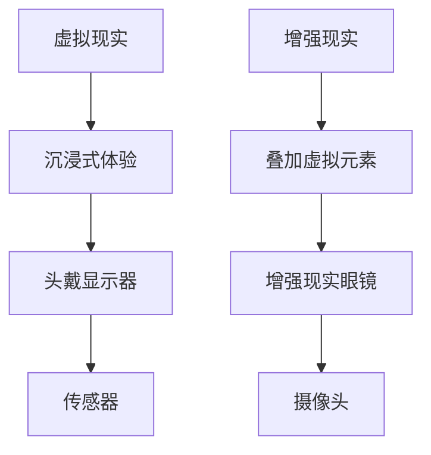
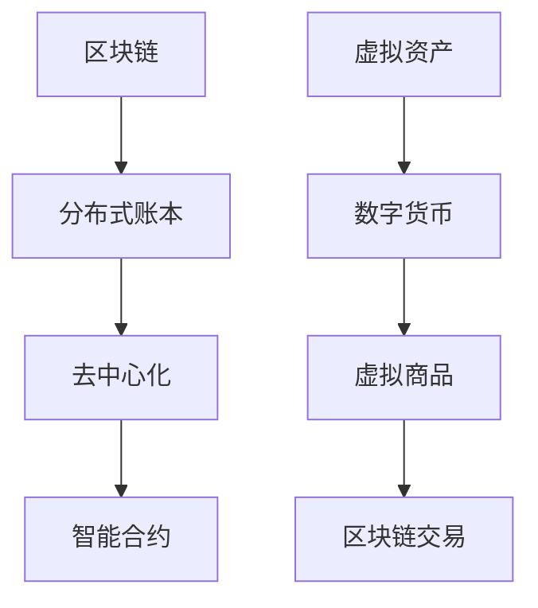
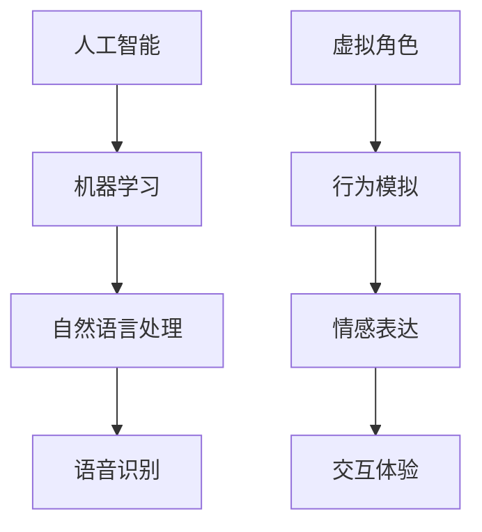

                 

在当今数字化飞速发展的时代，虚拟与现实之间的界限越来越模糊。元宇宙，作为集成了虚拟现实、增强现实、区块链、人工智能等前沿技术的复杂生态系统，正逐步成为人们生活和工作的全新空间。本文旨在探讨元宇宙对人类认知的影响，通过分析其核心概念、技术架构、算法原理以及数学模型，并结合具体项目实践，为读者提供一个全面而深入的视角。

## 关键词
- 元宇宙
- 虚拟现实
- 增强现实
- 区块链
- 人工智能
- 认知影响

## 摘要
本文首先介绍了元宇宙的基本概念和发展背景，随后详细阐述了其核心技术架构和算法原理。通过数学模型的构建和公式推导，本文进一步分析了元宇宙在不同领域的实际应用。最后，结合具体项目实践，探讨了元宇宙在未来的发展前景及其面临的挑战。

## 1. 背景介绍
### 1.1 元宇宙的概念与发展
元宇宙（Metaverse）一词最早由科幻作家尼尔·斯蒂芬森在其小说《雪崩》中提出。它被描述为一种由虚拟世界构成的庞大网络，人们可以在其中进行交互、工作和娱乐。近年来，随着虚拟现实（VR）和增强现实（AR）技术的不断成熟，元宇宙的概念逐渐从科幻走向现实。

在2020年，Facebook宣布将其公司名称更改为Meta，标志着元宇宙概念的商业化和全球化进程。此外，微软、谷歌、腾讯等科技巨头也纷纷布局元宇宙领域，推出了一系列相关产品和平台。

### 1.2 元宇宙的核心技术
元宇宙的发展离不开一系列核心技术的支撑。以下是元宇宙的几项关键技术：

- **虚拟现实（VR）和增强现实（AR）技术**：VR技术通过头戴式显示器和传感器等设备，将用户带入一个完全虚拟的世界；而AR技术则通过在现实场景中叠加虚拟元素，增强用户的现实体验。

- **区块链技术**：区块链是一种分布式数据库技术，能够确保数据的不可篡改性和透明性。在元宇宙中，区块链被用于创建去中心化的身份认证系统、虚拟资产的管理和交易等。

- **人工智能（AI）技术**：AI技术为元宇宙提供了智能化的交互体验，包括语音识别、自然语言处理、机器学习等。这些技术使得元宇宙中的虚拟角色能够更加智能和自主。

- **5G网络**：5G网络的低延迟和高带宽特性，为元宇宙中的实时交互提供了坚实的基础。高速网络使得用户可以无缝切换不同场景和体验。

## 2. 核心概念与联系
### 2.1 虚拟现实与增强现实
虚拟现实和增强现实是元宇宙中不可或缺的技术。下面是一个简化的 Mermaid 流程图，描述了它们的基本原理和联系。



### 2.2 区块链与虚拟资产
区块链技术是元宇宙中的重要组成部分，它负责管理虚拟资产和交易。以下是区块链与虚拟资产之间关系的 Mermaid 流程图。



### 2.3 人工智能与虚拟角色
人工智能技术在元宇宙中发挥着至关重要的作用，它使得虚拟角色能够模拟人类的思维和行为。以下是人工智能与虚拟角色之间关系的 Mermaid 流程图。



## 3. 核心算法原理 & 具体操作步骤
### 3.1 算法原理概述
元宇宙中的核心算法主要涉及以下几个方面：

- **渲染算法**：用于生成虚拟环境，包括三维场景的构建和渲染。

- **感知算法**：用于识别用户的动作和语音，将其转化为虚拟角色响应。

- **交互算法**：用于处理用户与虚拟角色以及虚拟环境之间的互动。

- **智能合约算法**：用于在区块链上执行自动化交易。

### 3.2 算法步骤详解
以下是元宇宙核心算法的具体操作步骤：

#### 3.2.1 渲染算法
1. **场景构建**：根据用户需求，构建虚拟环境的三维模型。
2. **光照计算**：计算场景中的光照效果，以增强视觉效果。
3. **渲染过程**：将场景渲染到显示器上，提供沉浸式体验。

#### 3.2.2 感知算法
1. **语音识别**：将用户的声音转化为文本或命令。
2. **动作识别**：通过传感器捕捉用户动作，将其转化为虚拟角色的响应。
3. **响应生成**：根据识别结果，生成虚拟角色的动作或语音反馈。

#### 3.2.3 交互算法
1. **事件监听**：监听用户输入，如按键、手势等。
2. **事件处理**：根据事件类型，执行相应的处理逻辑。
3. **反馈生成**：将处理结果反馈给用户，如语音、图像或动画等。

#### 3.2.4 智能合约算法
1. **合约编写**：编写智能合约，定义交易逻辑。
2. **合约部署**：将合约部署到区块链上。
3. **交易执行**：根据合约逻辑，执行虚拟资产的交易。

### 3.3 算法优缺点
每种算法都有其独特的优缺点：

- **渲染算法**：优点在于提供高质量的视觉体验，缺点是计算量大，对硬件要求高。

- **感知算法**：优点在于能准确捕捉用户行为，缺点是实时性要求高，计算复杂。

- **交互算法**：优点在于能提供丰富的交互体验，缺点是实现复杂，需要多技术整合。

- **智能合约算法**：优点在于确保交易的安全性和透明性，缺点是编写和执行过程相对复杂。

### 3.4 算法应用领域
元宇宙算法在多个领域具有广泛的应用：

- **娱乐业**：提供沉浸式游戏和虚拟现实体验。

- **教育业**：构建虚拟课堂，提供互动式教学。

- **旅游业**：虚拟旅游，让用户体验不同的风景名胜。

- **医疗保健**：虚拟手术模拟，远程医疗咨询。

## 4. 数学模型和公式 & 详细讲解 & 举例说明
### 4.1 数学模型构建
元宇宙中的数学模型主要包括以下几个方面：

- **三维空间建模**：用于构建虚拟环境的三维模型。

- **光学模型**：用于模拟场景中的光照效果。

- **神经网络模型**：用于训练智能算法，如语音识别和动作识别。

### 4.2 公式推导过程
以下是构建三维空间模型的基本公式推导过程：

1. **点坐标表示**：设点P(x, y, z)为三维空间中的任意点，则有：
   $$ P(x, y, z) = (x, y, z) $$

2. **向量表示**：设向量v为三维空间中的任意向量，则有：
   $$ v = (v_x, v_y, v_z) $$

3. **向量运算**：向量加法、减法、点乘和叉乘运算：
   $$ v_1 + v_2 = (v_{1x} + v_{2x}, v_{1y} + v_{2y}, v_{1z} + v_{2z}) $$
   $$ v_1 - v_2 = (v_{1x} - v_{2x}, v_{1y} - v_{2y}, v_{1z} - v_{2z}) $$
   $$ v_1 \cdot v_2 = v_{1x}v_{2x} + v_{1y}v_{2y} + v_{1z}v_{2z} $$
   $$ v_1 \times v_2 = (v_{1y}v_{2z} - v_{1z}v_{2y}, v_{1z}v_{2x} - v_{1x}v_{2z}, v_{1x}v_{2y} - v_{1y}v_{2x}) $$

### 4.3 案例分析与讲解
以下是一个三维空间建模的实例：

假设我们需要构建一个简单的房间模型，其顶点坐标如下：

$$
\begin{aligned}
V_1 &= (0, 0, 0) \\
V_2 &= (5, 0, 0) \\
V_3 &= (5, 5, 0) \\
V_4 &= (0, 5, 0) \\
V_5 &= (0, 0, 5) \\
V_6 &= (5, 0, 5) \\
V_7 &= (5, 5, 5) \\
V_8 &= (0, 5, 5)
\end{aligned}
$$

我们可以将这些顶点连接起来，形成六个矩形面，从而构建一个简单的三维房间模型。

## 5. 项目实践：代码实例和详细解释说明
### 5.1 开发环境搭建
为了更好地展示元宇宙的核心技术，我们将使用Unity引擎作为开发平台，结合C#语言进行编程。以下是搭建开发环境的步骤：

1. **安装Unity Hub**：访问Unity官方网站下载并安装Unity Hub。
2. **创建新项目**：在Unity Hub中创建一个新的3D项目。
3. **安装相关插件**：安装必要的插件，如Unity AR Foundation和Unity Blockchain SDK。

### 5.2 源代码详细实现
以下是使用Unity引擎实现一个简单元宇宙应用的核心代码：

```csharp
using UnityEngine;
using UnityEngine.XR.ARFoundation;
using Unity.Blockchain.SDK;

public class MetaverseExample : MonoBehaviour
{
    public ARCamera arCamera;
    public BlockchainManager blockchainManager;

    void Start()
    {
        // 初始化区块链
        blockchainManager.Initialize();

        // 创建虚拟角色
        GameObject virtualCharacter = new GameObject("VirtualCharacter");
        virtualCharacter.AddComponent<VirtualCharacterController>();

        // 将虚拟角色添加到AR相机中
        arCamera.AddChild(virtualCharacter);
    }

    void Update()
    {
        // 根据用户输入控制虚拟角色
        if (Input.GetKeyDown(KeyCode.Space))
        {
            // 生成虚拟资产
            blockchainManager.MintAsset("VirtualItem");
        }
    }
}
```

### 5.3 代码解读与分析
以上代码展示了如何使用Unity引擎构建一个简单的元宇宙应用。以下是代码的关键部分：

- **ARCamera**：用于捕获现实场景的摄像头组件。
- **BlockchainManager**：用于与区块链交互的管理类。
- **VirtualCharacterController**：用于控制虚拟角色动作的组件。

在`Start`方法中，我们初始化区块链并创建一个虚拟角色。在`Update`方法中，根据用户输入生成虚拟资产。

### 5.4 运行结果展示
当用户运行此应用时，虚拟角色将出现在现实场景中。用户可以通过按下空格键生成虚拟资产，并记录在区块链上。

## 6. 实际应用场景
### 6.1 娱乐业
元宇宙在娱乐业中具有巨大的潜力。虚拟现实游戏和体验使得用户能够沉浸在全新的世界中，享受沉浸式的娱乐体验。此外，虚拟演唱会、在线社交活动等也为元宇宙在娱乐领域的应用提供了广阔的空间。

### 6.2 教育业
元宇宙在教育领域中的应用同样引人注目。虚拟课堂和远程教育平台可以为全球的学生提供互动式教学体验。通过虚拟现实技术，学生可以身临其境地参观历史遗址、科学实验室等，从而增强学习效果。

### 6.3 商业领域
元宇宙为商业领域带来了全新的商业模式。虚拟商店、线上展览、虚拟会议等应用场景使得商家能够以更低成本和更高效率与客户互动。此外，元宇宙也为虚拟资产交易提供了平台，例如数字艺术品、虚拟房地产等。

### 6.4 未来应用展望
元宇宙的未来应用前景广阔。随着技术的不断进步，元宇宙将进一步融入人们的日常生活和工作。例如，虚拟办公、虚拟医疗、智能城市等应用场景将逐渐成熟。元宇宙的发展也将带来新的挑战，如数据隐私、网络安全等，需要各方共同努力解决。

## 7. 工具和资源推荐
### 7.1 学习资源推荐
- **《元宇宙：未来世界的新秩序》**：由刘慈欣撰写的一本关于元宇宙的科普读物。
- **《Unity官方教程》**：Unity官方提供的一系列入门到高级的教程。
- **《区块链入门教程》**：涵盖区块链基础知识和应用实践的入门书籍。

### 7.2 开发工具推荐
- **Unity**：一款功能强大的游戏和应用程序开发引擎。
- **Unity AR Foundation**：Unity官方提供的增强现实开发框架。
- **Unity Blockchain SDK**：Unity官方提供的区块链开发SDK。

### 7.3 相关论文推荐
- **“Metaverse: A Vision for the Future of Social Computing”**：一篇关于元宇宙概念和应用的经典论文。
- **“Blockchain in the Metaverse: Opportunities and Challenges”**：一篇探讨区块链在元宇宙中应用的论文。

## 8. 总结：未来发展趋势与挑战
### 8.1 研究成果总结
元宇宙作为虚拟与现实融合的生态系统，已经成为全球科技巨头争夺的焦点。虚拟现实、增强现实、区块链、人工智能等核心技术的不断成熟，为元宇宙的发展提供了坚实的基础。

### 8.2 未来发展趋势
未来，元宇宙将在娱乐、教育、商业等多个领域得到广泛应用。随着5G网络的普及和硬件设备的升级，元宇宙的交互体验将进一步提升。此外，元宇宙的商业模式和生态系统也将不断演变。

### 8.3 面临的挑战
尽管元宇宙具有巨大的潜力，但同时也面临着一系列挑战。如数据隐私、网络安全、技术标准等，需要各方共同努力解决。此外，元宇宙的普及还需要更广泛的硬件支持和用户教育。

### 8.4 研究展望
未来，元宇宙的研究将朝着更加智能化、个性化、多元化的方向发展。通过不断探索和创新，元宇宙将为人类创造一个全新的虚拟与现实融合的生态系统。

## 9. 附录：常见问题与解答
### 9.1 什么是元宇宙？
元宇宙是一个由虚拟现实、增强现实、区块链、人工智能等技术构建的复杂生态系统，用户可以在其中进行交互、工作和娱乐。

### 9.2 元宇宙有哪些核心技术？
元宇宙的核心技术包括虚拟现实（VR）、增强现实（AR）、区块链、人工智能（AI）等。

### 9.3 元宇宙在哪些领域有应用？
元宇宙在娱乐、教育、商业等多个领域有广泛应用，如虚拟现实游戏、虚拟课堂、虚拟商店等。

### 9.4 元宇宙的未来发展趋势是什么？
元宇宙的未来发展趋势包括智能化、个性化、多元化等，其在娱乐、教育、商业等领域的应用将不断扩展。

## 作者署名
作者：禅与计算机程序设计艺术 / Zen and the Art of Computer Programming

