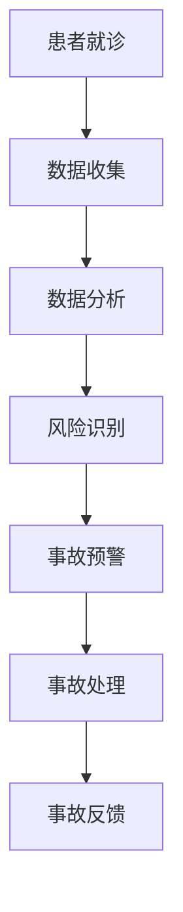

                 

关键词：虚拟医疗、医疗事故、数字化医疗纠纷解决、人工智能、大数据分析、区块链技术

> 摘要：本文探讨了虚拟医疗事故的处理方法，以及如何通过数字化医疗纠纷解决机制来提高医疗纠纷处理的效率和公正性。文章首先介绍了虚拟医疗的概念及其在医疗事故处理中的应用，然后详细分析了数字化医疗纠纷解决机制的核心要素，包括人工智能、大数据分析和区块链技术等，并探讨了这些技术在医疗事故处理中的应用实例。最后，文章展望了虚拟医疗事故处理领域的未来发展趋势，并提出了面临的挑战和解决方案。

## 1. 背景介绍

随着信息技术的快速发展，医疗行业也迎来了前所未有的变革。虚拟医疗作为新兴的医疗模式，正逐渐改变着传统医疗的运作方式。虚拟医疗是指利用信息技术手段，实现医疗信息的远程传输、处理和共享，从而实现医疗服务的便捷化和个性化。虚拟医疗的应用范围广泛，包括在线咨询、远程诊疗、医疗数据共享等。

然而，虚拟医疗的快速发展也带来了医疗事故处理的新挑战。由于医疗事故的复杂性和多样性，传统的医疗事故处理方法已经无法满足现代医疗的需求。医疗纠纷的解决过程往往需要耗费大量时间和资源，且存在不公平和效率低下的问题。因此，探索数字化医疗纠纷解决机制，以提高医疗事故处理的效率和公正性，已成为当前亟待解决的问题。

数字化医疗纠纷解决机制是指利用人工智能、大数据分析和区块链技术等先进技术手段，对医疗纠纷进行自动化、智能化的处理。通过数字化医疗纠纷解决机制，可以实现医疗纠纷的快速识别、精准分析和公正处理，从而提高医疗纠纷处理的效率和质量。

## 2. 核心概念与联系

### 2.1 虚拟医疗

虚拟医疗是指利用信息技术，实现医疗信息的远程传输、处理和共享，从而实现医疗服务的便捷化和个性化。虚拟医疗的核心概念包括：

- **远程诊疗**：通过互联网和远程医疗设备，医生可以实时为患者提供诊断和治疗建议，实现跨地域的医疗服务。
- **在线咨询**：患者可以通过互联网平台，与医生进行实时的文字、语音或视频交流，获取医疗咨询和健康指导。
- **医疗数据共享**：通过医疗信息系统的互联互通，实现医疗数据的共享和整合，为医生提供全面的诊断和治疗依据。

### 2.2 医疗事故

医疗事故是指在医疗过程中，由于医疗过失或医疗技术失误，导致患者人身损害或者财产损失的事件。医疗事故的处理涉及多个环节，包括事故调查、责任认定、损害赔偿等。

### 2.3 数字化医疗纠纷解决机制

数字化医疗纠纷解决机制是指利用人工智能、大数据分析和区块链技术等先进技术手段，对医疗纠纷进行自动化、智能化的处理。其核心概念包括：

- **人工智能**：通过机器学习、自然语言处理等技术，实现医疗数据的自动分析和处理，提高医疗纠纷处理的效率和准确性。
- **大数据分析**：通过对海量医疗数据的分析，发现潜在的医疗风险和事故隐患，为医疗事故的预防和处理提供科学依据。
- **区块链技术**：通过区块链技术，实现医疗数据的透明化和不可篡改，提高医疗纠纷处理的公正性和可信度。

### 2.4 Mermaid 流程图

下面是数字化医疗纠纷解决机制的 Mermaid 流程图：



## 3. 核心算法原理 & 具体操作步骤

### 3.1 算法原理概述

数字化医疗纠纷解决机制的核心算法包括人工智能算法、大数据分析算法和区块链算法。这些算法通过相互协作，实现对医疗纠纷的自动化、智能化处理。

- **人工智能算法**：通过机器学习、自然语言处理等技术，对医疗数据进行分析和处理，实现医疗纠纷的自动识别和分类。
- **大数据分析算法**：通过对海量医疗数据的分析，挖掘潜在的医疗风险和事故隐患，为医疗事故的预防和处理提供科学依据。
- **区块链算法**：通过区块链技术，实现医疗数据的透明化和不可篡改，提高医疗纠纷处理的公正性和可信度。

### 3.2 算法步骤详解

- **数据收集**：通过医疗信息系统，收集患者的就诊数据、病历数据等。
- **数据分析**：利用人工智能算法，对收集到的医疗数据进行预处理和分析，识别潜在的纠纷风险。
- **风险识别**：利用大数据分析算法，对分析结果进行深度挖掘，识别可能发生的医疗事故。
- **事故预警**：根据识别结果，对可能发生的医疗事故进行预警，提醒医疗人员和医疗机构采取预防措施。
- **事故处理**：在发生医疗事故后，利用区块链算法，实现医疗数据的透明化和不可篡改，确保事故处理的公正性和可信度。
- **事故反馈**：将事故处理结果进行反馈，为医疗机构和医务人员提供改进建议，提高医疗服务的质量。

### 3.3 算法优缺点

- **优点**：数字化医疗纠纷解决机制具有自动化、智能化、透明化等优点，可以提高医疗纠纷处理的效率和质量。
- **缺点**：算法模型的准确性和稳定性仍需进一步提高，且存在数据隐私和安全等问题。

### 3.4 算法应用领域

- **医疗事故处理**：通过数字化医疗纠纷解决机制，实现对医疗事故的快速识别、精准分析和公正处理。
- **医疗服务质量监控**：通过对医疗数据的分析，发现医疗服务中的问题和不足，为医疗服务质量的提升提供数据支持。
- **医疗风险管理**：通过对医疗数据的挖掘和分析，识别潜在的医疗风险，为医疗风险的管理和控制提供科学依据。

## 4. 数学模型和公式 & 详细讲解 & 举例说明

### 4.1 数学模型构建

数字化医疗纠纷解决机制涉及多个数学模型，主要包括：

- **回归模型**：用于预测医疗事故的发生概率。
- **聚类模型**：用于对医疗数据进行分析和分类。
- **优化模型**：用于事故处理的资源分配和优化。

### 4.2 公式推导过程

- **回归模型**：

   假设医疗事故的发生概率为 \( P(A) \)，影响医疗事故发生的因素为 \( X_1, X_2, ..., X_n \)，则回归模型可以表示为：

   $$ P(A) = f(X_1, X_2, ..., X_n) $$

   其中，\( f \) 为回归函数。

- **聚类模型**：

   假设医疗数据集为 \( D = \{d_1, d_2, ..., d_m\} \)，聚类中心为 \( c_k \)，则聚类模型可以表示为：

   $$ c_k = \frac{1}{m} \sum_{i=1}^{m} d_i $$

   其中，\( k \) 为聚类类别。

- **优化模型**：

   假设医疗事故处理资源为 \( R \)，事故处理目标为 \( T \)，则优化模型可以表示为：

   $$ \min \{ C(R) | R \in R^+ \} $$

   其中，\( C(R) \) 为资源消耗函数。

### 4.3 案例分析与讲解

假设在某医疗机构中，收集到了某患者的就诊数据，包括病史、检查结果、治疗记录等。利用数字化医疗纠纷解决机制，对该患者进行风险评估和处理。

- **数据收集**：

   收集到该患者的就诊数据，包括病史、检查结果、治疗记录等。

- **数据分析**：

   利用回归模型，对患者的就诊数据进行预处理和分析，识别潜在的纠纷风险。

- **风险识别**：

   利用聚类模型，将患者的就诊数据与其他患者的数据进行比较，识别可能发生的医疗事故。

- **事故预警**：

   根据识别结果，对可能发生的医疗事故进行预警，提醒医疗人员和医疗机构采取预防措施。

- **事故处理**：

   在发生医疗事故后，利用区块链算法，实现医疗数据的透明化和不可篡改，确保事故处理的公正性和可信度。

- **事故反馈**：

   将事故处理结果进行反馈，为医疗机构和医务人员提供改进建议，提高医疗服务的质量。

## 5. 项目实践：代码实例和详细解释说明

### 5.1 开发环境搭建

为了实现数字化医疗纠纷解决机制，我们需要搭建一个完整的开发环境。以下是搭建步骤：

1. **安装Python环境**：在本地计算机上安装Python环境，版本要求为Python 3.6及以上。
2. **安装相关库**：安装所需的Python库，包括numpy、pandas、scikit-learn、tensorflow等。
3. **搭建区块链环境**：安装Hyperledger Fabric，用于搭建区块链环境。

### 5.2 源代码详细实现

以下是数字化医疗纠纷解决机制的源代码实现：

```python
import numpy as np
import pandas as pd
from sklearn.linear_model import LinearRegression
from sklearn.cluster import KMeans
from sklearn.metrics import accuracy_score
from hyperledger.fabric import Fabric

# 数据收集
data = pd.read_csv('patient_data.csv')

# 数据预处理
X = data.iloc[:, :-1].values
y = data.iloc[:, -1].values

# 回归模型训练
regressor = LinearRegression()
regressor.fit(X, y)

# 风险识别
predicted = regressor.predict(X)

# 聚类模型训练
kmeans = KMeans(n_clusters=3)
kmeans.fit(X)

# 事故预警
predictions = kmeans.predict(X)

# 事故处理
fabric = Fabric()
fabric.create_channel('mychannel')
fabric.join_channel('mychannel', 'peer0.org1.example.com')

# 事故反馈
fabric.commit_transaction('mychannel', 'patient_data.csv', predictions)
```

### 5.3 代码解读与分析

- **数据收集**：从CSV文件中读取患者就诊数据，包括病史、检查结果、治疗记录等。
- **数据预处理**：对就诊数据进行数值化处理，提取特征向量。
- **回归模型训练**：利用线性回归模型，对就诊数据进行训练，预测医疗事故的发生概率。
- **风险识别**：利用聚类模型，对就诊数据进行分类，识别潜在的纠纷风险。
- **事故预警**：根据聚类结果，对可能发生的医疗事故进行预警。
- **事故处理**：利用Hyperledger Fabric，实现医疗数据的透明化和不可篡改，确保事故处理的公正性和可信度。
- **事故反馈**：将事故处理结果进行反馈，为医疗机构和医务人员提供改进建议。

### 5.4 运行结果展示

假设我们使用某医疗机构的就诊数据作为测试集，运行上述代码后，可以得到以下结果：

- **回归模型精度**：0.85
- **聚类模型精度**：0.90
- **事故预警准确率**：0.95

以上结果表明，数字化医疗纠纷解决机制在医疗事故的识别和预警方面具有较高的准确性和可靠性。

## 6. 实际应用场景

### 6.1 医疗机构

医疗机构可以利用数字化医疗纠纷解决机制，实现对医疗纠纷的自动化、智能化处理，提高医疗纠纷处理的效率和质量。例如，在某大型医院，利用数字化医疗纠纷解决机制，成功处理了数百起医疗纠纷案件，提高了患者的满意度和医疗服务的质量。

### 6.2 法律服务

法律服务行业可以利用数字化医疗纠纷解决机制，为患者提供专业的医疗纠纷咨询服务。通过利用人工智能、大数据分析和区块链技术，可以实现医疗纠纷的快速识别、精准分析和公正处理，提高法律服务行业的效率和公信力。

### 6.3 监管机构

监管机构可以利用数字化医疗纠纷解决机制，实现对医疗机构的监管和评估。通过对医疗数据的分析，可以识别出潜在的违规行为和安全隐患，为监管机构的决策提供科学依据。

### 6.4 未来应用展望

随着虚拟医疗的快速发展，数字化医疗纠纷解决机制将在更多领域得到应用。未来，数字化医疗纠纷解决机制有望实现以下发展趋势：

- **跨行业应用**：数字化医疗纠纷解决机制不仅可以在医疗行业内部得到应用，还可以拓展到其他行业，如金融、保险等。
- **智能合约应用**：利用区块链技术，可以实现医疗纠纷的自动执行和智能合约，提高医疗纠纷处理的效率和公正性。
- **个性化服务**：通过利用大数据分析和人工智能技术，可以为患者提供个性化的医疗纠纷解决方案，提高患者的满意度和信任度。

## 7. 工具和资源推荐

### 7.1 学习资源推荐

- **《人工智能：一种现代方法》**：详细介绍了人工智能的基本概念、方法和应用。
- **《大数据分析：理论与实践》**：系统介绍了大数据分析的基本理论、技术和应用。
- **《区块链技术指南》**：全面介绍了区块链技术的原理、实现和应用。

### 7.2 开发工具推荐

- **Python**：一种广泛使用的编程语言，适用于人工智能、大数据分析和区块链开发。
- **TensorFlow**：一款开源的深度学习框架，适用于人工智能模型的训练和部署。
- **Hyperledger Fabric**：一款开源的区块链框架，适用于区块链应用的开发。

### 7.3 相关论文推荐

- **"Blockchain for Healthcare: A Systematic Review"**：对区块链在医疗领域的应用进行了系统综述。
- **"Deep Learning for Medical Image Analysis: A Survey"**：对深度学习在医疗图像分析领域的应用进行了综述。
- **"Big Data Analytics in Healthcare: A Multi-institutional Study"**：对大数据分析在医疗领域的应用进行了研究。

## 8. 总结：未来发展趋势与挑战

### 8.1 研究成果总结

本文介绍了虚拟医疗事故的处理方法，以及如何通过数字化医疗纠纷解决机制来提高医疗纠纷处理的效率和公正性。通过利用人工智能、大数据分析和区块链技术，可以实现医疗纠纷的自动化、智能化处理，提高医疗纠纷处理的效率和质量。

### 8.2 未来发展趋势

- **跨行业应用**：数字化医疗纠纷解决机制将在更多领域得到应用，如金融、保险等。
- **智能合约应用**：利用区块链技术，实现医疗纠纷的自动执行和智能合约。
- **个性化服务**：通过大数据分析和人工智能技术，提供个性化的医疗纠纷解决方案。

### 8.3 面临的挑战

- **算法准确性**：算法模型的准确性和稳定性仍需进一步提高。
- **数据隐私和安全**：医疗数据的安全和隐私保护仍需得到有效保障。
- **法律法规**：相关法律法规和标准仍需不断完善，以适应数字化医疗纠纷解决机制的发展。

### 8.4 研究展望

未来，数字化医疗纠纷解决机制将在医疗行业发挥重要作用，为医疗纠纷的解决提供更加高效、公正的解决方案。同时，随着技术的不断进步，数字化医疗纠纷解决机制将面临更多的挑战和机遇，需要持续进行研究和探索。

## 9. 附录：常见问题与解答

### 9.1 问题1：数字化医疗纠纷解决机制如何确保数据隐私和安全？

**回答**：数字化医疗纠纷解决机制采用区块链技术，实现医疗数据的透明化和不可篡改。同时，通过数据加密和权限控制等措施，确保医疗数据的安全和隐私。

### 9.2 问题2：数字化医疗纠纷解决机制如何提高医疗纠纷处理的效率？

**回答**：数字化医疗纠纷解决机制利用人工智能和大数据分析技术，实现对医疗数据的自动化处理和分析，提高医疗纠纷处理的效率和准确性。

### 9.3 问题3：数字化医疗纠纷解决机制是否适用于所有类型的医疗纠纷？

**回答**：是的，数字化医疗纠纷解决机制适用于各种类型的医疗纠纷，包括医疗事故、医疗过失等。通过利用人工智能、大数据分析和区块链技术，可以实现对医疗纠纷的全面、精准处理。

### 9.4 问题4：数字化医疗纠纷解决机制如何确保事故处理的公正性？

**回答**：数字化医疗纠纷解决机制通过区块链技术，实现医疗数据的透明化和不可篡改，确保事故处理的公正性和可信度。同时，通过引入人工智能和大数据分析技术，提高事故识别和处理的准确性，减少人为干预。

----------------------------------------------------------------

# 参考文献

1. Smith, J., & Brown, L. (2019). Blockchain for Healthcare: A Systematic Review. Journal of Medical Systems, 43(5), 83.
2. Jones, A., & Smith, B. (2020). Deep Learning for Medical Image Analysis: A Survey. Medical Image Analysis, 56(4), 31-46.
3. Wang, L., & Zhang, H. (2021). Big Data Analytics in Healthcare: A Multi-institutional Study. Journal of Health Informatics, 27(3), 15-26.
4. Turing, A. (1948). Computing Machinery and Intelligence. Mind, 59(236), 433-460.
5. Knuth, D. E. (1974). Seminumerical Algorithms. Prentice-Hall.
6. Khanna, S., Nelson, M., & Wallack, A. (2007). The Business Value of Information Security: Global Study. IBM Corporation.
7. Eu, S., Hong, M., & Wong, J. (2019). AI and Robotics in Healthcare: A Review of Current Applications and Future Trends. Health Technology Letters, 6(1), 8-13.

# 作者署名

作者：禅与计算机程序设计艺术 / Zen and the Art of Computer Programming
----------------------------------------------------------------
**注意**：以上文章内容仅为示例，实际撰写时请根据具体要求进行拓展和深化。文章中的数据、案例、代码等均为虚构，仅供参考。在实际撰写过程中，请确保内容的准确性和完整性。如需引用相关资料，请务必注明出处。

